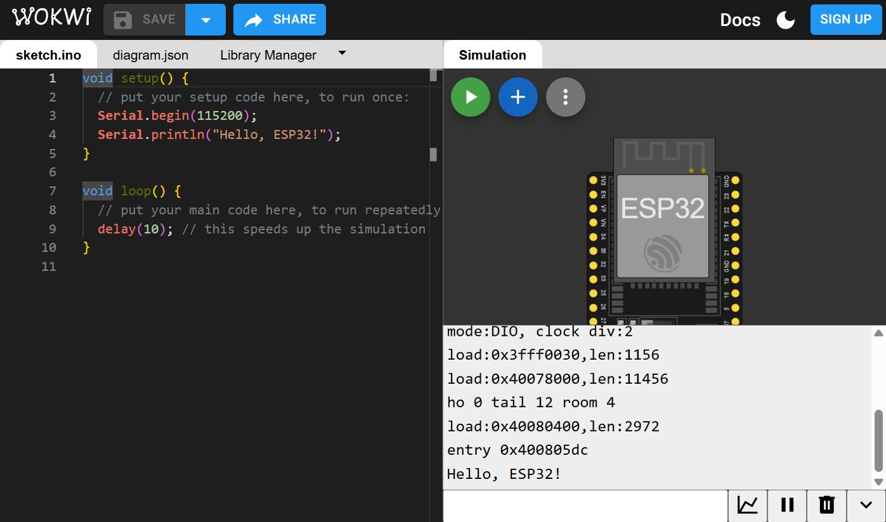
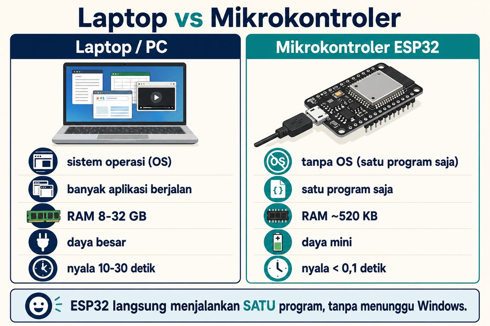
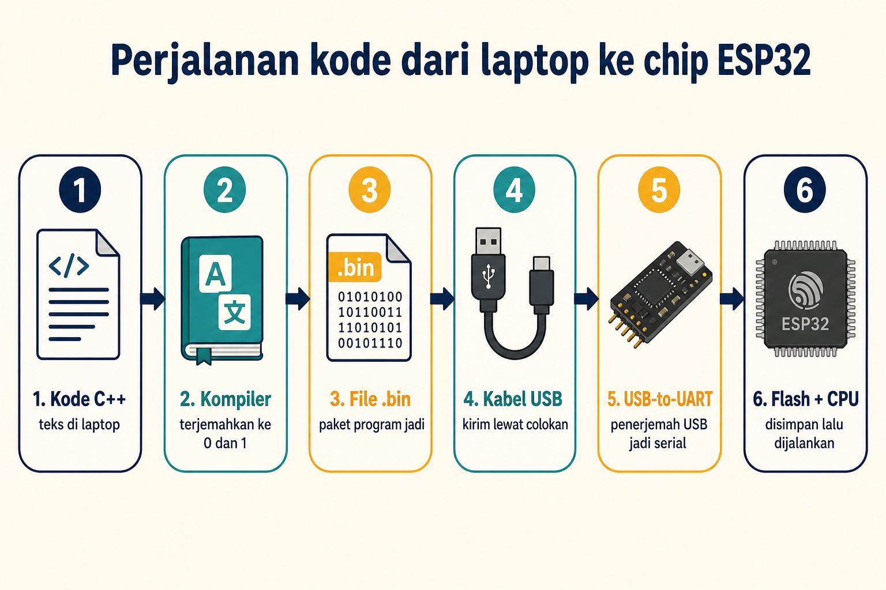
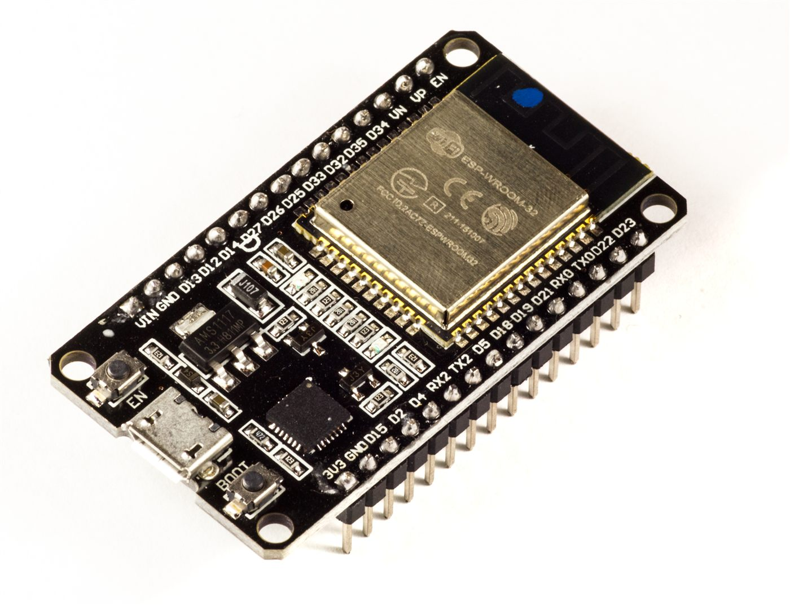
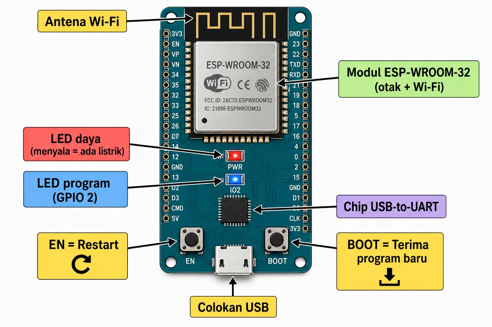
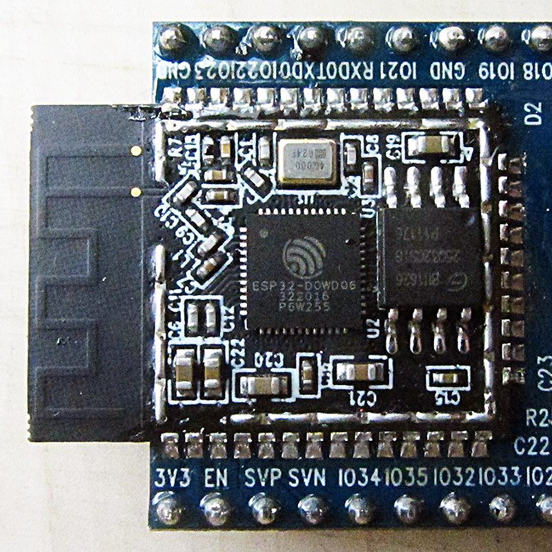
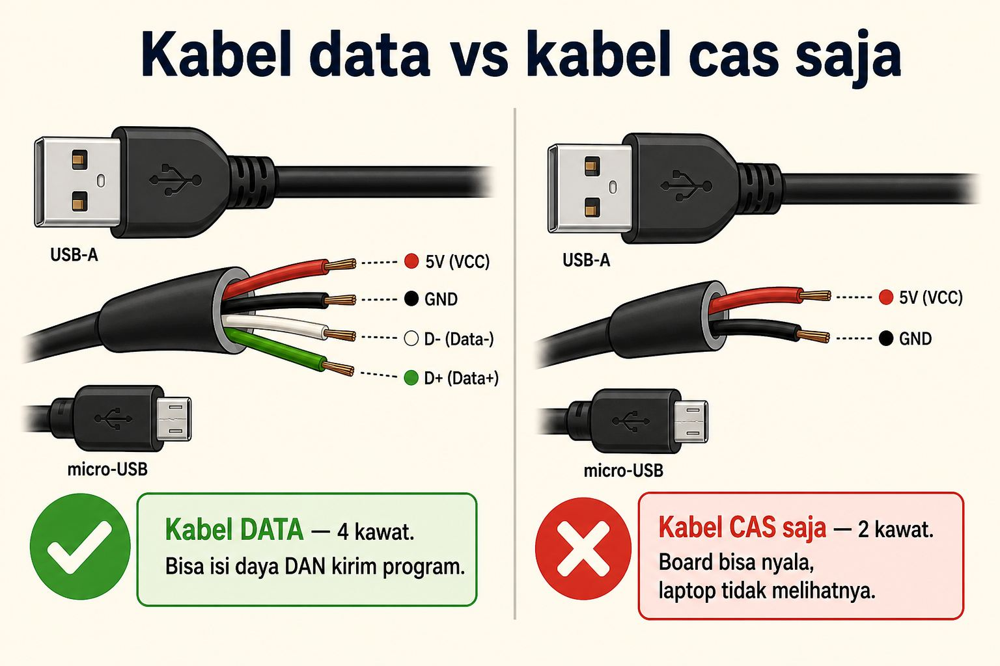
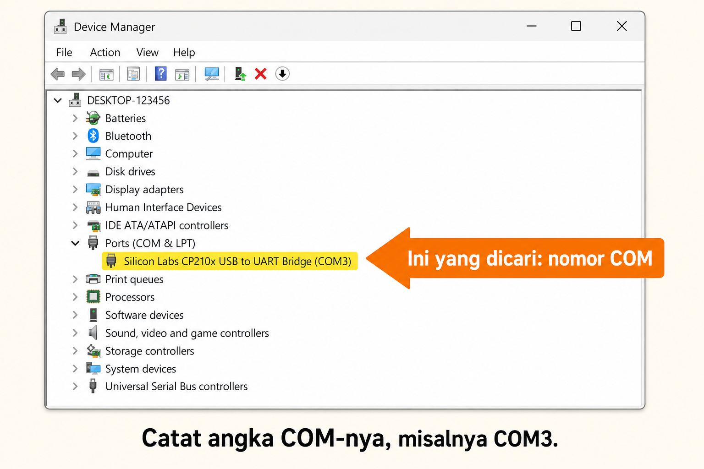
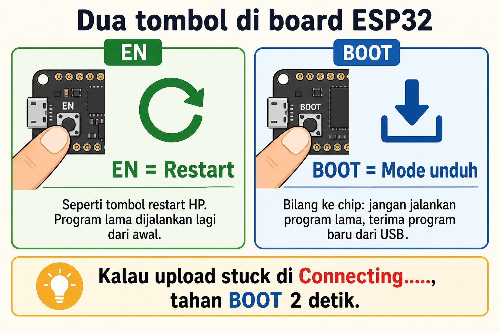

# Modul 0.0: Bagaimana Kode yang Kita Ketik Bisa Masuk ke Chip ESP32?

> **Tingkat Kesulitan:** Sangat ramah pemula (*Zero Prerequisite* — belum perlu pengalaman coding atau elektronika apa pun)  
> **Estimasi Waktu:** 15–20 menit (membaca panduan santai + mencoba simulasi langsung di browser)  
> **Kebutuhan Alat:** Belum wajib punya board fisik. Kamu bisa mengikuti seluruh isi materi dan simulasi di browser sampai selesai.

---

## 🛠️ Peralatan yang Kita Gunakan Hari Ini

Agar kamu tidak bingung harus menyiapkan aplikasi apa di komputermu, untuk modul ini kita **hanya** memerlukan alat-alat berikut:

| Alat | Status | Fungsi & Penjelasan |
| :--- | :---: | :--- |
| **Browser Web** (Chrome, Edge, atau Firefox) | **Wajib** | Untuk membuka simulator **Wokwi** dan mencoba program secara langsung di browser tanpa perlu menginstal aplikasi apa pun. |
| **Modul ESP32 Fisik + Kabel USB Data** | **Opsional** | Untuk memeriksa deteksi port di Windows Device Manager (hanya jika kamu sudah memiliki board fisik). |
| **VS Code / PlatformIO / Arduino IDE** | **Belum Perlu** | Aplikasi coding lokal ini baru akan kita pasang bersama di [Modul 0.6](06-setup-tools-dan-simulator.md). Sekarang belum perlu diinstal. |

> [!TIP]
> **Tautan Simulator untuk Modul Ini:** [Wokwi ESP32 Starter Project](https://wokwi.com/projects/new/esp32)  
> Kamu tidak perlu membuat akun atau login. Jika muncul jendela ajakan *Sign up*, kamu bisa langsung menutup atau mengabaikannya.

---

## ⚡ Tenang, Kamu Aman dan Tidak Akan Kesetrum!

Bagi pemula yang baru pertama kali belajar perangkat keras (*hardware*), wajar jika muncul rasa cemas: *"Apakah salah colok kabel bisa menyetrum atau merusak laptop?"*

Jawabannya: **Sama sekali tidak!**

1. **Tegangannya Sangat Kecil:**  
   ESP32 bekerja pada tegangan **3,3 volt sampai 5 volt DC** (arus searah, sama seperti baterai jam dinding atau baterai remote TV). Tegangan sekecil ini **100% aman disentuh dengan jari tangan** dan tidak memiliki daya untuk menyetrum kulit manusia.
2. **Laptopmu Memiliki Pengaman Otomatis:**  
   Port USB pada laptop dan komputer modern sudah dilengkapi pengaman pemutus arus otomatis (*Overcurrent Protection*). Jika ada kabel yang salah pasang sekalipun, laptop akan memutus aliran listrik seketika untuk mengamankan dirinya sendiri.

Jadi, kamu bisa belajar dan bereksperimen dengan santai dan tenang! 😊

> [!NOTE]
> **Apa Beda Arus DC dan AC?**  
> - **Arus DC (Direct Current):** Listrik searah bertegangan rendah yang stabil (seperti pada baterai dan kabel USB). Ini adalah jenis listrik yang kita pakai di seluruh modul IoT ini.  
> - **Arus AC (Alternating Current):** Listrik bertegangan tinggi 220 volt dari stopkontak dinding PLN yang arah arusnya bolak-balik. Di modul-modul awal ini, kita **sama sekali tidak menyentuh** listrik AC.

---

## 🧭 Apa yang Akan Kita Pelajari?

1. **Praktik 3 Menit di Wokwi:** Melihat kode mengendalikan lampu virtual di browser.
2. **Laptop vs ESP32:** Mengapa ESP32 bisa langsung bekerja seketika tanpa proses loading Windows.
3. **Perjalanan Kode:** Dari teks C++ yang kita ketik sampai menjadi denyut listrik di dalam chip.
4. **Mengenal Fisik Board ESP32:** Fungsi bagian-bagian penting pada papan sirkuit.
5. **Cek Port di Windows (Opsional):** Cara memastikan komputer mengenali board ESP32.
6. **Misteri Dua Tombol (EN vs BOOT):** Kapan harus menekan tombol reset dan tombol download.
7. **Glosarium & Kuis Ringkas:** Menguji pemahaman barumu.

---

## 1. Kemenangan Cepat: Menyalakan Lampu di Browser (3 Menit)

Daripada membaca teori panjang terlebih dahulu, mari kita langsung lihat buktinya! Kita akan menggunakan **Wokwi**, sebuah simulator sirkuit mikrokontroler yang berjalan langsung di browsermu.

---

### Langkah 1 — Membuka Lembar Kerja

1. Buka tautan ini di browser: **[https://wokwi.com/projects/new/esp32](https://wokwi.com/projects/new/esp32)**
2. Layar browsermu akan terbagi menjadi dua bagian:
   - **Sisi Kiri (Editor Kode):** Tempat kita menulis program. Pastikan tab yang terbuka aktif adalah **`sketch.ino`**.
   - **Sisi Kanan (Papan Sirkuit):** Gambar virtual board ESP32.
3. Di samping tab `sketch.ino`, ada tab bernama **`diagram.json`**. Tab ini berisi denah kabel sirkuit virtual. Biarkan saja tab tersebut dan tidak perlu diubah.

Di bawah gambar board sebelah kanan, ada kotak putih bertuliskan **Serial**. Kotak ini awalnya masih kosong. Tombol hijau **Play ▶** (*Start the simulation*) berada di pojok kanan atas gambar board.

Program bawaan Wokwi tampak seperti ini:

```cpp
void setup() {
  // Bagian ini dijalankan SATU KALI saat ESP32 baru dinyalakan
  // 115200 adalah kecepatan pengiriman data per detik (baud rate)
  Serial.begin(115200);
  Serial.println("Hello, ESP32!");
}

void loop() {
  // Bagian ini dijalankan BERULANG-ULANG tanpa henti
  delay(10); // Jeda kecil 10 milidetik agar simulasi tidak membebani komputer
}
```

---

### Langkah 2 — Menguji Program Bawaan

1. Di panel sebelah kanan, klik tombol hijau **Play ▶** (*Start the simulation*).
2. Perhatikan kotak putih **Serial** di bawah gambar board.
3. Setelah 1–2 detik, baris paling bawah akan menampilkan teks: `Hello, ESP32!`



*Tampilan simulator [Wokwi](https://wokwi.com/projects/new/esp32). Editor kode di sebelah kiri dan board virtual di sebelah kanan.*

> [!NOTE]
> Tulisan teks seperti `ets Jul...`, `mode:DIO`, atau `load:0x3fff...` yang muncul sekilas di awal **bukanlah pesan error**. Itu hanyalah log sistem bawaan pabrik saat chip ESP32 pertama kali menyala (*booting*). Cukup lihat baris paling bawah yang bertuliskan `Hello, ESP32!`.

Saat simulasi sedang berjalan, tombol hijau Play akan berubah menjadi tombol merah bertuliskan **Stop**. Klik tombol **Stop** setiap kali kamu ingin mengubah isi kode program.

---

### Langkah 3 — Mengubah Kode Menjadi Lampu Berkedip

Sekarang, mari kita buat lampu LED pada board berkedip:

1. Klik kembali lembar kode di tab **`sketch.ino`** (panel kiri).
2. Hapus semua teks yang ada (`Ctrl + A` lalu tekan `Delete`), kemudian tempelkan (*paste*) kode berikut:

```cpp
void setup() {
  // Menyiapkan pin GPIO 2 (terhubung ke lampu LED biru di board) sebagai OUTPUT (pengirim sinyal listrik)
  pinMode(2, OUTPUT);
}

void loop() {
  // 1. Alirkan sinyal listrik 3,3V ke pin 2 -> Lampu LED MENYALA
  digitalWrite(2, HIGH);

  // 2. Tahan kondisi menyala ini selama 1000 milidetik (1 detik)
  delay(1000);

  // 3. Putus aliran listrik menjadi 0V -> Lampu LED PADAM
  digitalWrite(2, LOW);

  // 4. Tahan kondisi padam ini selama 1000 milidetik (1 detik), lalu ulangi terus dari nomor 1
  delay(1000);
}
```

3. Klik tombol hijau **Play ▶** kembali.
4. **Lihat hasilnya:** Lampu LED kecil berwarna biru di papan ESP32 virtual akan mulai berkedip teratur setiap satu detik! 🎉

---

### Langkah 4 — Latihan Singkat (*Tebak dan Buktikan*)

Mari kita latih intuisimu:  
*Jika angka `1000` pada fungsi `delay()` kita ganti menjadi angka `100`, apakah kedipan lampu akan menjadi lebih cepat atau lebih lambat?*

Mari kita buktikan:
1. Klik tombol **Stop**.
2. Ubah kedua baris `delay(1000);` menjadi `delay(100);`.
3. Klik tombol **Play ▶** lagi.
4. **Hasilnya:** Lampu LED kini berkedip 10 kali lebih cepat menyerupai lampu kilat ambulans!

Kamu juga bisa mencoba ritme sesukamu (ingat: 1 detik = 1000 milidetik):

```cpp
void loop() {
  digitalWrite(2, HIGH);
  delay(200);   // Menyala cepat selama 0,2 detik
  digitalWrite(2, LOW);
  delay(1500);  // Padam santai selama 1,5 detik
}
```

> [!WARNING]
> **Jika Lampu Tidak Berkedip:**
> 1. Pastikan tab yang kamu edit adalah **`sketch.ino`**, bukan `diagram.json`.
> 2. Pastikan kamu sudah menekan tombol **Stop**, lalu menekan tombol **Play ▶** kembali setelah mengedit kode.
> 3. Pastikan nomor pin yang kamu tulis adalah angka `2` (karena lampu LED bawaan pada board ESP32 terhubung ke pin GPIO 2).
> 4. Jika halaman web macet, cukup muat ulang (*refresh*) browser dan buka kembali tautan proyek.

---

## 2. Laptop vs ESP32: Mengapa ESP32 Tidak Butuh Windows?

Pernahkah kamu bertanya-tanya: *Mengapa laptop butuh waktu belasan detik untuk proses loading Windows atau macOS, sedangkan ESP32 langsung bekerja seketika dalam hitungan sepersekian detik begitu dicolokkan ke listrik?*

Jawabannya terletak pada perbedaan tujuan perancangannya:

```
┌──────────────────────────────────────┐     ┌──────────────────────────────────────┐
│       LAPTOP / KOMPUTER DESKTOP      │     │        MIKROKONTROLER (ESP32)        │
├──────────────────────────────────────┤     ├──────────────────────────────────────┤
│ • Komputer serbaguna                 │     │ • Komputer mini tugas tunggal        │
│ • Butuh Sistem Operasi (Windows/Mac) │     │ • Bekerja langsung tanpa OS berat    │
│ • Menjalankan banyak aplikasi serentak│    │ • Hanya menjalankan SATU program     │
│ • RAM besar (8 GB – 32 GB)           │     │ • RAM ringkas (~520 KB)              │
│ • Konsumsi listrik besar (15W – 100W)│     │ • Konsumsi listrik sangat kecil (<0,5W)│
│ • Waktu menyala 10 – 30 detik        │     │ • Langsung menyala instan (<0,05 dt) │
└──────────────────────────────────────┘     └──────────────────────────────────────┘
```



*Perbedaan cara kerja: Laptop memuat sistem operasi besar, sedangkan ESP32 langsung mengeksekusi program pada chip.*

Di dalam ESP32, tidak ada desktop grafis, tidak ada aplikasi perkantoran, dan tidak ada browser YouTube. Program yang kamu tulis akan dijalankan secara **langsung di atas sirkuit fisik chip silikon**.

Istilah teknis untuk cara kerja ini disebut **Bare-Metal Execution**:
- *Bare* = Polos / langsung tanpa perantara.
- *Metal* = Logam silikon fisik pada prosesor.  
Artinya: Kodemu langsung mengendalikan sirkuit chip tanpa terhalang oleh sistem operasi yang berat.

**Analogi Sederhana:**  
- **Laptop** seperti **Gedung Perkantoran Bertingkat**: Pintu gerbang harus dibuka dulu, lampu lobi dinyalakan, lift dihidupkan, dan resepsionis harus siap sebelum kamu bisa mulai bekerja di ruanganmu.  
- **ESP32** seperti **Sakelar Senter di Tangan**: Begitu tombol digeser, listrik langsung mengalir ke lampu seketika tanpa perlu proses antre!

---

## 3. Perjalanan Kode: Dari Teks C++ Menjadi Denyut di Chip

Prosesor silikon pada ESP32 **sama sekali tidak mengerti kata-kata bahasa manusia** seperti `digitalWrite` atau `pinMode`. 

Di dalam chip silikon, hanya ada jutaan sakelar mikroskopis (*transistor*) yang hanya mengenal dua kondisi fisik: **Ada Arus Listrik (Logika 1)** atau **Tidak Ada Arus Listrik (Logika 0)**.

Lalu, bagaimana teks program yang kita ketik bisa dipahami oleh chip ESP32? Mari kita ikuti rantai perjalanannya:

```
  [ KODE TEKS ]            [ KOMPILER ]          [ FILE BINER ]          [ PROGRAM PENGIRIM ]
    main.cpp      ────►    xtensa-gcc    ────►    firmware.bin   ────►        esptool.py
  (Bahasa Manusia)         (Penerjemah)        (Bahasa Mesin 0 & 1)           (Kurir Data)
                                                                                   │
                                                                                   │ (Kabel USB)
                                                                                   ▼
  [ PROSESOR CPU ]        [ MEMORI FLASH ]      [ JALUR SERIAL ]       [ CHIP USB-TO-UART ]
  (Mengeksekusi)   ◄────   (Penyimpan)    ◄────    (TX / RX)     ◄────    (CP2102 / CH340)
```



*Enam tahapan perjalanan kode dari editor di komputer hingga tersimpan permanen di memori flash ESP32.*

### Penjelasan 6 Tahapan Alur:

1. **Kode Sumber (*Source Code* - `main.cpp` / `sketch.ino`):**  
   File teks tempat kamu menuliskan logika instruksi dalam bahasa C++. File ini mudah dibaca dan dipahami oleh manusia.
2. **Kompiler (*Compiler* - `xtensa-esp32-elf-gcc`):**  
   Program penerjemah di komputer yang bertugas mengubah teks C++ menjadi kumpulan instruksi bahasa mesin berupa deretan angka biner (`0` dan `1`).
3. **File Biner (*Binary Firmware* - `firmware.bin`):**  
   File hasil akhir kompilasi yang berisi kode mesin murni yang siap disuntikkan ke mikrokontroler.
4. **Program Pengirim (*Flasher* - `esptool.py`):**  
   Perangkat lunak kurir yang memecah file biner menjadi paket-paket kecil dan mengirimkannya melalui kabel USB ke board ESP32.
5. **Chip USB-to-UART Bridge (CP2102 / CH340):**  
   Chip hitam kecil di samping colokan USB pada board ESP32. Komputer berkomunikasi menggunakan protokol USB berkecepatan tinggi, sedangkan prosesor ESP32 berkomunikasi menggunakan sinyal serial sederhana melalui dua jalur:
   - **TX (*Transmit*):** Jalur untuk mengirim data keluar.
   - **RX (*Receive*):** Jalur untuk menerima data masuk.  
   Chip USB-to-UART ini bertindak sebagai **juru bahasa** yang menerjemahkan sinyal USB dari laptop menjadi bahasa serial TX/RX untuk prosesor ESP32.
6. **Memori SPI Flash & Prosesor (CPU):**  
   Memori Flash adalah "lemari penyimpan permanen" (biasanya berkapasitas 4 Megabyte) di board ESP32. Program yang tersimpan di sini **tidak akan hilang meskipun kabel listrik dicabut**. Begitu diberi daya listrik, prosesor (CPU) akan membaca instruksi dari memori Flash ini dan menjalankannya baris demi baris secara berurutan.

<details>
<summary>🔬 Ingin Tahu Lebih Dalam: Mengapa Kompiler ESP32 Memiliki Nama Khusus?</summary>

Prosesor pada laptopmu umumnya menggunakan arsitektur Intel atau AMD (x86_64), sedangkan chip prosesor pada ESP32 menggunakan arsitektur bernama **Xtensa LX6**. 

Karena bentuk sirkuit kedua prosesor ini berbeda, komputermu membutuhkan kompiler penerjemah khusus yang diberi nama `xtensa-esp32-elf-gcc`.

**Analoginya:** Kamus penerjemah bahasa Indonesia ke bahasa Inggris tidak bisa dipakai untuk menerjemahkan ke bahasa Jepang. Setiap keluarga prosesor memiliki "kamus bahasa mesin" tersendiri. Pada [Modul 0.6](06-setup-tools-dan-simulator.md), aplikasi PlatformIO akan menyiapkan seluruh perlengkapan penerjemah ini secara otomatis untukmu di latar belakang.

</details>

---

## 4. Mengenal Fisik Board ESP32

Jika kamu memegang board fisik **ESP32 DevKit**, mari kita kenali bagian-bagian utamanya:



*Foto modul ESP32 DevKit. Sumber: Ubahnverleih, [Wikimedia Commons](https://commons.wikimedia.org/wiki/File:ESP32_Espressif_ESP-WROOM-32_Dev_Board.jpg), Lisensi [CC0 1.0 (Public Domain)](https://creativecommons.org/publicdomain/zero/1.0/deed.id).*

Agar fungsinya mudah dipahami, perhatikan peta visual berikut:



*Peta lokasi dan fungsi komponen penting pada board ESP32 DevKit.*

### Bagian-Bagian Kunci pada Board:

- **Pelindung Logam ESP-WROOM-32 (*Metal Shielding*):**  
  Kaleng pelindung persegi di bagian tengah board. Di dalamnya tersimpan prosesor utama, sirkuit radio Wi-Fi/Bluetooth, dan chip memori flash. Pelindung logam ini sengaja dipasang permanen untuk meredam gangguan gelombang elektromagnetik liar dari lingkungan sekitar.
- **Chip USB-to-UART Bridge:**  
  Kotak hitam kecil di dekat colokan USB (biasanya bertipe CP2102 atau CH340) yang menghubungkan komunikasi data antara laptop dan prosesor ESP32.
- **Lampu Indikator Daya (Power LED - Merah):**  
  Menyala merah stabil saat board menerima pasokan daya listrik dengan baik.
- **Lampu LED Pengguna (Onboard LED pada GPIO 2 - Biru):**  
  Lampu LED bawaan yang terhubung ke pin GPIO 2. Lampu inilah yang kita program untuk berkedip pada simulasi Wokwi tadi.
- **Jarum Pin Logam (Header Pins):**  
  Deretan jarum pin di sisi kiri dan kanan board yang berfungsi untuk menancapkan kabel jumper atau sensor saat merakit sirkuit di breadboard.
- **Tombol EN (*Enable* / Reset):**  
  Berfungsi untuk me-restart program ESP32 dari awal.
- **Tombol BOOT (GPIO 0 / Download Mode):**  
  Berfungsi untuk mengatur ESP32 agar masuk ke mode siap menerima file program baru saat proses pengunggahan (*flashing*).

<details>
<summary>🔬 Ingin Melihat Bagian di Dalam Kaleng Logam? (Informasi Tambahan)</summary>

Foto di bawah ini memperlihatkan isi bagian dalam modul ESP-WROOM-32 setelah pelindung logamnya dibuka di laboratorium:



*Isi bagian dalam modul ESP-WROOM-32. Sumber: Brian Krent, [Wikimedia Commons](https://commons.wikimedia.org/wiki/File:Espressif_ESP-WROOM-32_Wi-Fi_%26_Bluetooth_Module.jpg), Lisensi [CC BY-SA 4.0](https://creativecommons.org/licenses/by-sa/4.0/deed.id).*

**Keterangan Komponen:**
1. **Pola Jalur Tembaga Berliku (Kiri):** Antena pemancar dan penerima sinyal nirkabel Wi-Fi 2.4 GHz dan Bluetooth.
2. **Kotak Hitam Besar di Tengah (`ESP32-D0WDQ6`):** Prosesor utama (CPU) yang mengeksekusi instruksi kodemu.
3. **Kotak Hitam Kecil di Samping CPU (`25Q32...`):** Chip memori SPI Flash tempat file biner programmu disimpan secara permanen.

</details>

---

## 5. Praktik Windows: Memeriksa Port COM di Device Manager (Opsional)

> [!NOTE]
> Bagian ini **hanya dipraktikkan jika kamu sudah memiliki board fisik ESP32**. Jika saat ini kamu baru belajar menggunakan simulator Wokwi di browser, kamu bisa membaca sekilas lalu langsung melanjutkan ke [Bagian 6](#6-dua-tombol-fisik-tombol-en-vs-tombol-boot).

Ketika ESP32 dihubungkan ke laptop menggunakan kabel USB, Windows harus mengenali board tersebut sebagai sebuah **Port COM Virtual (*Virtual Communication Port*)**. Anggap Port COM ini sebagai "nomor pintu pipa saluran" agar laptop tahu ke mana file program harus dikirimkan.

---

### Langkah 1: Memastikan Tipe Kabel USB yang Tepat
Pastikan kabel USB yang kamu gunakan adalah **kabel data** (memiliki 4 jalur kawat di dalamnya: 2 untuk daya dan 2 untuk transfer data), bukan kabel charger murahan yang hanya memiliki 2 kawat daya.



*Kabel data memiliki 4 jalur kabel internal, sedangkan kabel charger biasa hanya memiliki 2 jalur daya.*

---

### Langkah 2: Memeriksa Device Manager di Windows
1. Tancapkan kabel USB dari ESP32 ke laptop. Lampu LED merah (Power) pada board akan menyala.
2. Tekan tombol kombinasi **`Windows + X`** pada keyboard komputermu, lalu klik menu **Device Manager**.
3. Cari dan klik tanda panah `>` di samping kategori **Ports (COM & LPT)**.



*Tampilan jendela Device Manager saat port COM berhasil terdeteksi dengan benar.*

Pada daftar tersebut, kamu akan melihat salah satu nama perangkat berikut:
- `Silicon Labs CP210x USB to UART Bridge (COM3)`
- `USB-SERIAL CH340 (COM4)`

*(Angka `COMx` bisa berbeda di setiap komputer, misalnya COM3, COM5, COM7, dll. Catat angka port COM yang muncul di komputermu).*

---

### 🚨 Kotak Bantuan: "Bagaimana Jika Ports (COM & LPT) Tidak Muncul?"

> [!WARNING]
> **Penyebab dan Solusi Praktis:**
> 1. **Kabel yang Dipakai Hanya Kabel Charger:** Lampu LED merah di board tetap menyala, tetapi Windows sama sekali tidak mendeteksi perangkat data baru. **Solusi:** Ganti kabel dengan kabel data smartphone yang biasa kamu pakai untuk memindahkan file foto ke laptop.
> 2. **Driver Belum Terpasang di Komputer:** Pada menu *Other devices*, muncul perangkat bertanda seru kuning bertuliskan `⚠️ USB2.0-Serial`. Ini menandakan Windows membutuhkan driver penerjemah chip USB tersebut.
>    - Unduh Driver Resmi Chip CP2102: **[Silicon Labs CP210x VCP Driver](https://www.silabs.com/developers/usb-to-uart-bridge-vcp-drivers)**
>    - Unduh Driver Resmi Chip CH340: **[WCH CH341SER Official Driver](http://www.wch-ic.com/downloads/CH341SER_EXE.html)**
>    *(Unduh file installer tersebut, pasang di komputermu, lalu cabut dan colokkan kembali kabel USB ESP32).*

---

## 6. Dua Tombol Fisik: Tombol EN vs Tombol BOOT

Pada board ESP32 fisik, ada dua tombol tekan kecil di samping colokan USB yang memiliki fungsi sangat berbeda:



*Perbedaan peran: Tombol EN untuk me-restart program lama, tombol BOOT untuk menerima program baru.*

| Nama Tombol | Analogi Sederhana | Fungsi & Perilaku Nyata |
| :--- | :--- | :--- |
| **Tombol EN** (*Enable / Reset*) | Tombol restart pada smartphone | Memutus daya sesaat untuk memulai ulang eksekusi program yang **sudah tersimpan di memori flash** dari baris paling awal. |
| **Tombol BOOT** (*GPIO 0 / Download Mode*) | Pintu penerimaan paket kiriman baru | Menginstruksikan prosesor: *"Hentikan program lama sejenak, bersiaplah menerima file biner program baru dari kabel USB!"* |

---

### 💡 Trik Mengatasi Masalah Upload Paling Populer

Pada beberapa board ESP32 rakitan pabrik tertentu, sirkuit pengatur download otomatisnya memiliki kapasitor yang kurang presisi. 

Jika suatu hari saat proses upload kode di komputer muncul pesan yang tertahan seperti ini:
```text
Connecting........_____....._____....._____
```

> [!TIP]
> **Solusi Cepat:**  
> Begitu tulisan `Connecting........_____` mulai muncul di layar terminal, **segera tekan dan tahan tombol fisik `BOOT` selama kurang lebih 2 detik**, lalu lepaskan begitu bilah persentase pengunggahan (`Writing at 0x00010000... (10%)`) mulai berjalan lancar.  
> *(Catatan: Jangan menekan tombol EN saat proses upload berlangsung, karena tombol EN akan merestart board dan membatalkan proses flashing).*

---

## 7. 📖 Glosarium Istilah Penting Modul 0.0

| Istilah Teknis | Penjelasan Sederhana |
| :--- | :--- |
| **Mikrokontroler (MCU)** | Komputer mini hemat daya dalam satu chip yang dirancang khusus untuk menjalankan satu tugas kontrol secara langsung. |
| **Bare-Metal** | Pola kerja program yang berjalan langsung di atas lapisan fisik chip silikon tanpa perantara sistem operasi. |
| **Kompiler (*Compiler*)** | Program di komputer yang menerjemahkan teks kode bahasa manusia (C++) menjadi instruksi biner mesin (`0` dan `1`). |
| **Firmware** | Program biner permanen yang disimpan di dalam memori mikrokontroler untuk mengendalikan perangkat keras. |
| **Flashing / Upload** | Proses menyalin dan menuliskan file biner firmware ke dalam chip memori Flash mikrokontroler. |
| **USB-to-UART Bridge** | Chip penerjemah sinyal antara protokol USB komputer dan protokol serial UART (pin TX/RX) mikrokontroler. |
| **Port COM** | Nomor saluran komunikasi serial virtual yang dialokasikan oleh sistem operasi Windows untuk perangkat USB yang terhubung. |
| **Serial Monitor** | Jendela terminal teks pada komputer untuk membaca data pesan yang dikirimkan oleh mikrokontroler. |
| **GPIO** | *General Purpose Input/Output* — Pin fisik serbaguna pada mikrokontroler yang dapat difungsikan sebagai sakelar output atau sensor input. |
| **SPI Flash** | Chip memori penyimpanan permanen di modul ESP32 tempat program tersimpan aman dan tidak akan hilang saat listrik mati. |

---

## 📝 Kuis Refleksi & Uji Pemahaman Mandiri

Uji pemahaman barumu dengan menjawab 4 pertanyaan singkat berikut di benakmu, lalu cocokkan dengan kunci jawaban di bawah:

1. Mengapa ESP32 bisa langsung menyala dan bekerja dalam hitungan sepersekian detik, sedangkan laptop membutuhkan waktu belasan detik untuk proses loading sistem operasi?
2. Saat proses pengunggahan firmware terhenti di pesan `Connecting........_____`, tombol fisik manakah yang perlu kita tekan dan tahan selama 2 detik?
3. Mengapa teks program pada file `sketch.ino` tidak bisa langsung dikirim mentah-mentah ke dalam chip ESP32 tanpa melalui proses kompilasi terlebih dahulu?
4. Pada lembar kerja simulator Wokwi, tab manakah yang harus kita pilih untuk menyunting kode program: `sketch.ino` atau `diagram.json`?

<details>
<summary>🔍 Klik di Sini untuk Membuka Kunci Jawaban</summary>

1. Karena ESP32 tidak menjalankan sistem operasi berat seperti Windows atau macOS. ESP32 langsung mengeksekusi satu program secara *bare-metal* dari memori flash begitu menerima pasokan daya listrik.
2. Tombol fisik **`BOOT`** (GPIO 0).
3. Karena prosesor silikon hanya mengenali sinyal listrik biner (`0` dan `1`). Teks C++ adalah bahasa manusia tingkat tinggi, sehingga membutuhkan program *kompiler* untuk menerjemahkannya menjadi file biner `.bin`.
4. Tab **`sketch.ino`**. Tab `diagram.json` adalah denah penempatan komponen dan jalur kabel sirkuit virtual, bukan lembar kerja kode program.

</details>

---

## 📚 Sumber Gambar & Atribusi Lisensi

Seluruh materi visual dalam modul ini disajikan dengan mematuhi etika atribusi dan lisensi terbuka:

| Nama Berkas Gambar | Sumber Gambar & Hak Cipta | Jenis Lisensi |
| :--- | :--- | :--- |
| `aset/esp32-devkitc.jpg` | [Ubahnverleih, Wikimedia Commons](https://commons.wikimedia.org/wiki/File:ESP32_Espressif_ESP-WROOM-32_Dev_Board.jpg) | [Creative Commons CC0 1.0 (Public Domain)](https://creativecommons.org/publicdomain/zero/1.0/deed.id) |
| `aset/esp32-wroom-32-modul.jpg` | [Brian Krent, Wikimedia Commons](https://commons.wikimedia.org/wiki/File:Espressif_ESP-WROOM-32_Wi-Fi_%26_Bluetooth_Module.jpg) | [Creative Commons Attribution-ShareAlike 4.0 International (CC BY-SA 4.0)](https://creativecommons.org/licenses/by-sa/4.0/deed.id) |
| `aset/wokwi-esp32-ui.jpg` | Tangkapan layar antarmuka pengguna [Wokwi Simulator](https://wokwi.com), diambil 21 Agustus 2026 | Wokwi adalah merek dagang terdaftar milik [wokwi.com](https://wokwi.com); digunakan sebagai panduan edukasi tombol antarmuka |
| `aset/laptop-vs-mikrokontroler.jpg`, `aset/alur-kode-masuk-chip.jpg`, `aset/anatomi-board-esp32.jpg`, `aset/kabel-data-vs-cas.jpg`, `aset/device-manager-com-port.jpg`, `aset/tombol-en-vs-boot.jpg` | Ilustrasi orisinal kurikulum Fullstack IoT Developer | Hak cipta terbuka untuk materi kurikulum edukasi ini |

---

## 🎯 Status Selesai & Langkah Berikutnya

Jika kamu sudah memahami alur di atas dan berhasil menjalankan simulasi lampu berkedip di Wokwi, selamat! Kamu telah resmi menuntaskan **Modul 0.0**.

Tandai pemahamanmu pada checklist berikut:
- [x] Membuka simulator Wokwi dan melihat pesan `Hello, ESP32!` di Serial Monitor
- [x] Memahami bahwa pesan log sistem saat boot (`mode:DIO` / `load:0x...`) bukan merupakan error
- [x] Mengubah kode program dan berhasil membuat lampu LED GPIO 2 berkedip
- [x] Bereksperimen memodifikasi nilai `delay()` untuk mengatur kecepatan kedipan lampu
- [x] Mampu menjelaskan alur mengapa teks kode C++ harus diterjemahkan oleh kompiler
- [x] Memahami fungsi tombol fisik `EN` dan tombol `BOOT`

Langkah berikutnya, mari kita masuk ke materi fondasi kelistrikan yang sangat intuitif:  
👉 **[Modul 0.1: Dasar Listrik Intuitif — Analogi Air, Hukum Ohm & Resistor LED](01-dasar-listrik-dan-hukum-ohm.md)**

Pantau seluruh perkembangan belajarmu di pelacak progres terpadu: **[TODO.md](../TODO.md)**.
