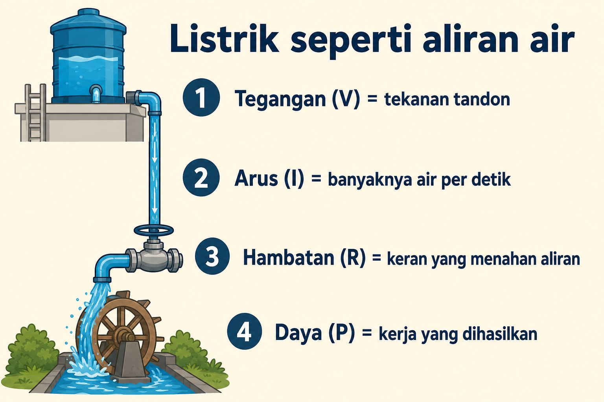
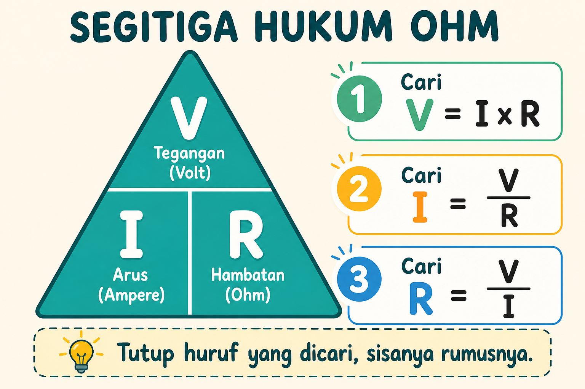
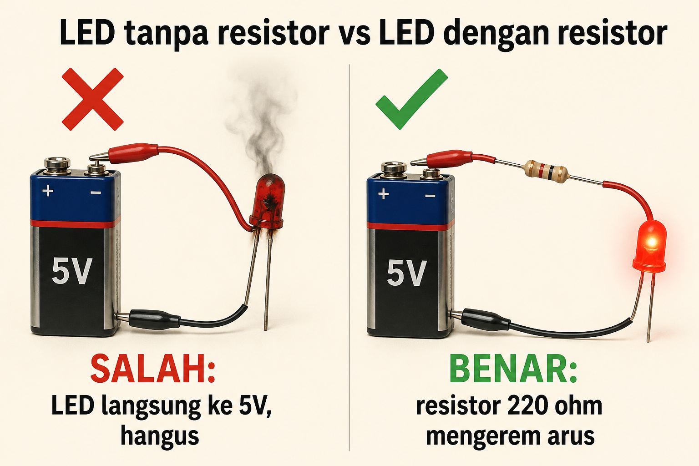
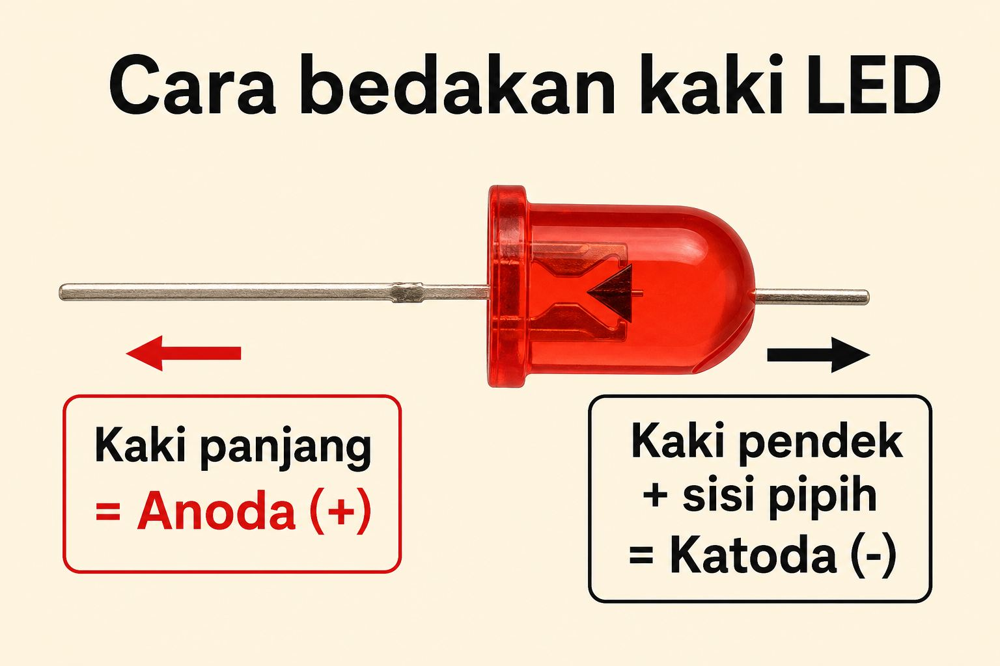
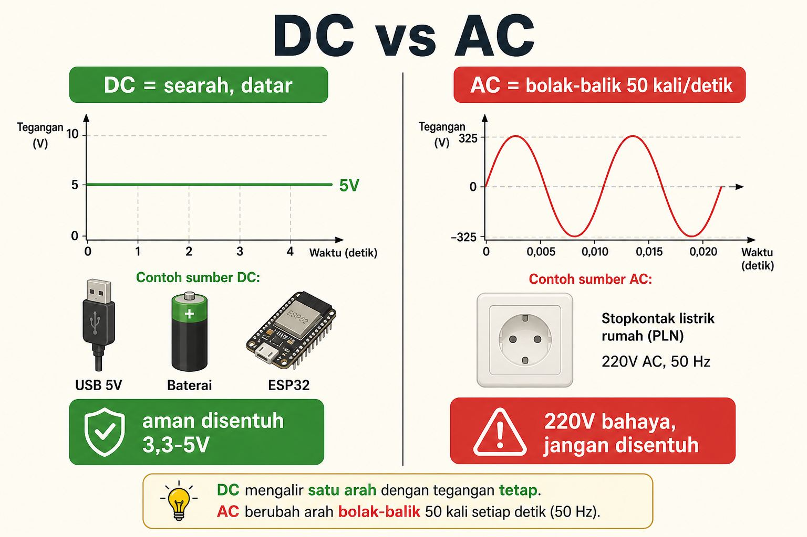
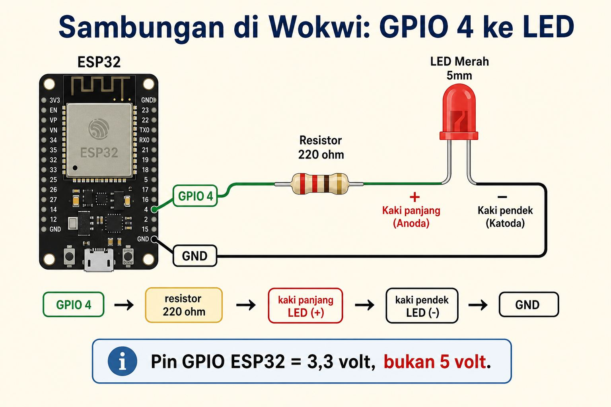

# Modul 0.1: Dasar Listrik Intuitif — Analogi Air, Hukum Ohm, dan Resistor LED

> **Tingkat kesulitan:** Sangat ramah pemula  
> **Perkiraan waktu:** 20–25 menit (baca + hitung + praktik Wokwi)  
> **Board fisik:** Belum wajib. Semua percobaan di browser.

---

## Buka ini dulu, baru mulai

| Perlu sekarang? | Alat | Untuk apa |
| :--- | :--- | :--- |
| **Wajib** | Browser Chrome, Edge, atau Firefox | Membuka **Wokwi** |
| **Wajib, yang sudah ada** | Kalkulator HP atau aplikasi Kalkulator Windows | Menghitung resistor |
| **Belum perlu** | Breadboard, LED fisik, VS Code, Arduino IDE | Itu modul berikutnya. Jangan beli dulu kalau belum siap |

> [!TIP]
> **Tautan praktik:** [Wokwi ESP32 Project Baru](https://wokwi.com/projects/new/esp32)  
> Tidak perlu akun. Tombol **Sign up** boleh diabaikan.

Modul 0.0 sudah selesai? Bagus. Kalau belum, mulai dari [Bagaimana ketikan kode masuk ke chip silikon](00-bagaimana-kode-masuk-ke-chip-silikon.md).

---

## Tenang, listrik di modul ini aman disentuh

Kita hanya bicara **3,3 volt dan 5 volt DC** (USB, baterai, pin ESP32). Itu aman disentuh jari.

**Stopkontak rumah 220 volt AC jangan disentuh.** Itu urusan tukang listrik, bukan latihan IoT pemula.

---

## Peta singkat

1. Analogi tandon air: volt, ampere, ohm, watt.
2. Hukum Ohm, versi jari di segitiga.
3. Kenapa LED wajib pakai resistor.
4. Hitung resistor 3 langkah (kalkulator HP).
5. DC vs AC.
6. Praktik Wokwi: pasang LED + resistor, lalu ubah nilainya.
7. Glosarium dan kuis.

---

## 1. Listrik itu seperti aliran air

Elektron terlalu kecil untuk dilihat. Untungnya, perilaku listrik **mirip pipa air di rumah**.

Tebak dulu, tanpa rumus: kalau keran diputar hampir tertutup, air di kincir lebih deras atau lebih pelan?

Jawaban insting: **lebih pelan**. Itu intinya hambatan.



*Ilustrasi orisinal kurikulum ini.*

| Istilah listrik | Analogi air | Contoh di dunia nyata |
| :--- | :--- | :--- |
| **Tegangan (V, volt)** | Tekanan dari tandon | USB 5 V, pin ESP32 **3,3 V**, listrik rumah **220 V** |
| **Arus (I, ampere)** | Banyaknya air per detik | LED biasa butuh kira-kira **10–20 mA** |
| **Hambatan (R, ohm)** | Keran / pipa sempit | Komponen bernama **resistor** |
| **Daya (P, watt)** | Kerja yang dihasilkan kincir | Charger 5 V × 2 A = **10 watt** |

**mA** (miliampere) = seperseribu ampere. Jadi 15 mA = 0,015 A. Di elektronika kecil, kita hampir selalu pakai mA, bukan ampere utuh.

**Resistor** = komponen yang sengaja dipasang sebagai “keran”, supaya arusnya tidak kebablasan.

---

## 2. Hukum Ohm, tanpa drama

Pada 1827, **Georg Ohm** merangkum hubungan tiga variabel itu jadi satu kalimat:

**Tegangan = arus × hambatan**, atau `V = I × R`.

Cara hafal yang dipakai teknisi: **segitiga**. Tutup huruf yang mau dicari, sisanya rumusnya.



*Ilustrasi orisinal kurikulum ini.*

Logika warung:

- Resistor **diperbesar** → arus **mengecil** (keran ditutup).
- Resistor **diperkecil** → arus **membesar** (keran dibuka).

Itu saja yang kamu butuhkan untuk melindungi LED.

<details>
<summary>Mau hitung daya juga? (opsional)</summary>

Daya: `P = V × I`.  
Contoh: pin 3,3 V mengalirkan 0,015 A → `P = 3,3 × 0,015 = 0,05 watt`. Kecil sekali. Makanya LED tidak panas seperti setrika.

</details>

---

## 3. Kenapa LED wajib pakai resistor

LED (*light emitting diode*) = lampu kecil. Bahasa manusianya: “dioda yang nyala kalau arus lewat dengan arah yang benar.”

Sifat nakalnya: LED **hampir tidak bisa mengerem arus sendiri**. Disambung langsung ke 5 V, arusnya melonjak, kawat di dalam panas, LED berkedip sekali lalu mati.



*Ilustrasi orisinal kurikulum ini. Baterai di gambar hanya pemanis; di ESP32 kita pakai pin GPIO 3,3 V atau colokan 5 V.*

Resistor itu **rem**. Kita pasang supaya arus kira-kira 10–20 mA, LED terang dan awet.

### Cara bedakan kaki LED

Salah arah = tidak nyala (biasanya tidak rusak, cuma diam).



*Ilustrasi orisinal kurikulum ini.*

- **Kaki panjang** = **anoda (+)** = tempat arus “masuk”.
- **Kaki pendek + sisi plastik yang pipih** = **katoda (−)** = menuju GND.

---

## 4. Hitung resistor sendiri (buka kalkulator HP)

Kita hitung untuk **pin GPIO ESP32**, karena itu yang dipakai di Wokwi nanti.

> [!IMPORTANT]
> Pin GPIO yang kamu `digitalWrite(..., HIGH)` itu **3,3 volt**, **bukan 5 volt**.  
> Colokan USB / pin bertuliskan `5V` memang 5 volt, tapi itu bukan pin program.

Data:

1. Tegangan sumber `Vs` = **3,3 V** (GPIO).
2. Tegangan maju LED merah `Vled` ≈ **2,0 V** (supaya LED mau nyala).
3. Arus aman `I` = **15 mA = 0,015 A**.

### Langkah 1 — sisa tegangan yang harus “dibuang” resistor

```
V resistor = Vs − Vled
V resistor = 3,3 − 2,0 = 1,3 volt
```

### Langkah 2 — rumus `R = V / I`

Buka kalkulator. Ketik: `1.3 ÷ 0.015`

```
R = 1,3 / 0,015 ≈ 87 ohm
```

### Langkah 3 — pilih yang ada di toko

Toko tidak jual 87 ohm. Seri yang umum: 100 Ω, 150 Ω, 220 Ω, 330 Ω, 470 Ω, 1 kΩ.

Pilih yang **agak di atas** hasil hitung, biar arusnya tidak kegedean:

- **100 Ω** = paling dekat.
- **220 Ω** = lebih aman, LED agak lebih redup, **ini yang kita pakai di Wokwi** (paling gampang dicari).

Kalau suatu hari kamu nyalakan LED dari pin **5V** (bukan GPIO):

```
V resistor = 5,0 − 2,0 = 3,0 volt
R = 3,0 / 0,015 = 200 ohm  →  pakai 220 Ω
```

> [!NOTE]
> **Warna LED, patokan kasar**  
> - Merah / kuning / oranye: `Vled` kira-kira 1,8–2,0 V.  
> - Hijau / biru / putih: `Vled` kira-kira 3,0–3,2 V (dari GPIO 3,3 V, sisa tegangannya kecil — resistor 100–220 Ω tetap aman).

Coba isi sendiri: `R = (3,3 − 2,0) / 0,015`. Hasilnya kira-kira berapa? (Membulatkan ke **87** sudah benar. Jangan mengetik garis bawah di kalkulator.)

---

## 5. DC vs AC: kenapa ESP32 tidak pakai listrik rumah



*Ilustrasi orisinal kurikulum ini. Angka puncak di grafik AC tidak perlu dihafal; yang penting: AC naik-turun dan berbahaya.*

| | **DC (searah)** | **AC (bolak-balik)** |
| :--- | :--- | :--- |
| Arah | Satu arah, datar | Bolak-balik kira-kira 50 kali per detik |
| Contoh | Baterai, USB, ESP32 | Stopkontak PLN 220 V |
| Sentuh | 3,3–5 V aman | 220 V **bahaya** |

Chip butuh angka yang **diam**: 3,3 V = bit 1, 0 V = bit 0. Kalau tegangannya naik-turun seperti AC, prosesor tidak bisa membedakan 0 dan 1.

---

## 6. Praktik Wokwi: pasang LED dan resistor

Kita buktikan: resistor besar → lampu redup.

### Langkah 1 — buka proyek kosong

1. Buka [https://wokwi.com/projects/new/esp32](https://wokwi.com/projects/new/esp32)
2. Pastikan tab **`sketch.ino`** aktif. Jangan sunting `diagram.json` dengan tangan.

### Langkah 2 — tempel kode

Pilih semua (`Ctrl + A` / `Command + A`), tempel ini:

```cpp
void setup() {
  // Pin 4 jadi sakelar: kita yang menentukan nyala/mati
  pinMode(4, OUTPUT);
  // HIGH di ESP32 = kira-kira 3,3 volt (bukan 5 volt)
  digitalWrite(4, HIGH);
}

void loop() {
  // Kosong sengaja: lampu biar tetap nyala, tidak berkedip
}
```

### Langkah 3 — tambah resistor dan LED

1. Di panel kanan, klik tombol biru **+** (**Add a new part**).
2. Ketik `LED`, pilih **LED**.
3. Klik **+** lagi, ketik `Resistor`, pilih **Resistor**.
4. Klik resistor di kanvas, ubah nilainya menjadi **220** (satuan ohm).

### Langkah 4 — sambungkan seperti peta ini



*Ilustrasi orisinal kurikulum ini. Di Wokwi, arahkan mouse ke kaki LED: biasanya ada label anode/cathode.*

Urutan arus, hafalkan kayak lagu:

`GPIO 4` → `resistor 220 Ω` → `kaki panjang LED (+)` → `kaki pendek LED (−)` → `GND`

Cara menyambung di Wokwi: klik satu kaki, lalu klik kaki tujuan. Muncul kabel.

### Langkah 5 — Play

Klik hijau **Start the simulation**. LED harus menyala **tetap** (tidak kedip).

> [!WARNING]
> **Kalau LED tidak nyala**
> 1. Stop dulu, baru sunting. Kode baru jalan setelah Play lagi.
> 2. Cek polaritas LED (panjang ke resistor, pendek ke GND). Balikkan kalau perlu.
> 3. Pastikan GPIO **4**, bukan 2. Pin 2 adalah LED onboard; kita sedang pakai LED tambahan.
> 4. Resistor harus tersambung **seri** (satu jalur), bukan nyangkut ke pin lain.
> 5. Tab kode = `sketch.ino`.

### Langkah 6 — tebak, lalu rusak pelan-pelan

1. Stop.
2. Klik resistor, ubah `220` menjadi `10000` (itu 10 kΩ).
3. **Tebak dulu:** lampu lebih terang atau lebih redup?
4. Play. Harusnya **jauh lebih redup** — keran ditutup, arus mengecil.

---

## Glosarium

| Istilah | Bahasa manusia |
| :--- | :--- |
| **Tegangan (V)** | Tekanan yang mendorong elektron |
| **Arus (I)** | Banyaknya elektron per detik |
| **Hambatan (R)** | Rem aliran. Satuan ohm (Ω) |
| **Resistor** | Komponen rem yang kita pasang |
| **Hukum Ohm** | `V = I × R` |
| **LED** | Lampu kecil yang hanya mau nyala jika kutubnya benar |
| **Anoda / katoda** | Kaki + dan − pada LED |
| **mA** | Seperseibu ampere |
| **DC** | Listrik searah, datar |
| **AC** | Listrik bolak-balik dari stopkontak |
| **GPIO** | Pin sakelar ESP32. HIGH-nya 3,3 V |

---

## Kuis singkat

1. Mau arus lebih besar ke sebuah beban 5 V: resistor diperbesar atau diperkecil?
2. LED disambung langsung ke 5 V tanpa resistor: apa yang terjadi?
3. Kenapa ESP32 pakai DC 3,3 V, bukan AC 220 V?
4. `digitalWrite(4, HIGH)` di ESP32 itu kira-kira berapa volt: 3,3 atau 5?

<details>
<summary>Kunci jawaban</summary>

1. **Diperkecil.** `I = V / R` — R kecil, I besar.
2. Arus kebablasan, LED bisa hangus.
3. Chip butuh tegangan **datar** untuk membedakan 0 dan 1. AC 220 V juga berbahaya.
4. **Kira-kira 3,3 V.** Pin `5V` di board itu colokan daya, bukan hasil `digitalWrite`.

</details>

---

## Sumber gambar

| Gambar | Sumber | Lisensi |
| :--- | :--- | :--- |
| Analogi tandon, segitiga Ohm, LED ± resistor, polaritas LED, DC vs AC, rangkaian Wokwi | Ilustrasi orisinal kurikulum ini | Dibuat khusus untuk modul 0.1 |

---

## Status selesai & langkah berikutnya

- [ ] Bisa menjelaskan V, I, R pakai bahasa air
- [ ] Menghitung resistor GPIO 3,3 V di kalkulator (hasil ≈ 87 Ω, pakai 100–220 Ω)
- [ ] Tahu kaki panjang LED = plus
- [ ] LED + resistor 220 Ω menyala di Wokwi
- [ ] Mengubah ke 10 kΩ dan melihat lampu redup

Lanjut ke **[Modul 0.2: Anatomi Breadboard dan Komponen Fisik](02-anatomi-breadboard-dan-komponen.md)**.

Pantau progres di **[TODO.md](../TODO.md)**.
