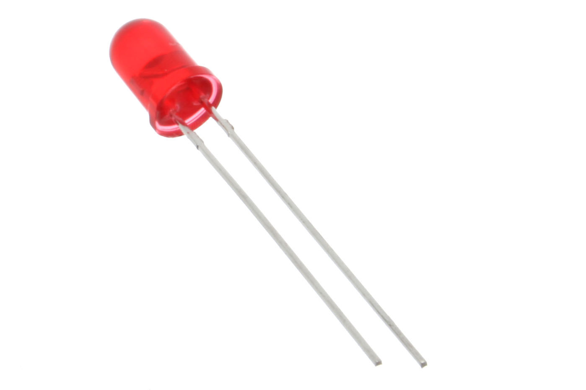

# Modul 0.1: Dasar Listrik Intuitif — Analogi Air, Hukum Ohm, dan Resistor LED

> **Tingkat Kesulitan:** Sangat ramah pemula (*Zero Prerequisite* — tidak membutuhkan latar belakang fisika atau matematika rumit)  
> **Estimasi Waktu Belajar:** 15–20 menit (membaca panduan santai + menghitung dengan kalkulator + mencoba simulasi di browser)  
> **Kebutuhan Alat:** Belum wajib memiliki board fisik. Seluruh percobaan dapat dijalankan langsung di browser.

---

## 🛠️ Peralatan yang Kita Butuhkan

Agar kamu tidak bingung harus menyiapkan apa saja di mejamu, pada modul ini kita **hanya** memerlukan alat-alat berikut:

| Alat | Status | Fungsi & Keterangan |
| :--- | :---: | :--- |
| **Browser Web** (Google Chrome, Edge, atau Firefox) | **Wajib** | Untuk membuka simulator **Wokwi** dan merangkai sirkuit virtual langsung di browser tanpa instalasi apa pun. |
| **Kalkulator Smartphone / Komputer** | **Wajib** | Untuk mencoba menghitung kebutuhan nilai resistor dengan rumus sederhana. |
| **Komponen Fisik (Breadboard, LED, Resistor Asli)** | **Belum Perlu** | Praktik menggunakan alat fisik akan kita bahas di modul selanjutnya. Sekarang kita fokus memahami logikanya terlebih dahulu. |

> [!TIP]
> **Tautan Simulator untuk Modul Ini:** [Wokwi ESP32 Starter Project](https://wokwi.com/projects/new/esp32)  
> Kamu tidak perlu membuat akun atau login. Jika muncul jendela pop-up ajakan *Sign up*, cukup tutup atau abaikan saja jendela tersebut.

Jika kamu sudah menyelesaikan [Modul 0.0: Bagaimana Kode Masuk ke Dalam Chip ESP32?](00-bagaimana-kode-masuk-ke-chip-silikon.md), mari kita lanjutkan perjalanan kita ke dasar kelistrikan yang menggerakkan dunia IoT!

---

## ⚡ Tenang, Listrik di Modul Ini Sangat Aman!

Sebelum melangkah lebih jauh, mari kita pastikan satu hal penting agar kamu merasa tenang:

Tegangan kerja yang kita gunakan pada mikrokontroler ESP32 hanya berkisar **3,3 volt hingga 5 volt DC** (arus searah, setara dengan tegangan baterai jam dinding atau baterai remote TV). Tegangan sekecil ini **100% aman disentuh langsung dengan jari tangan** dan sama sekali tidak memiliki daya untuk menyengat kulit manusia.

Listrik bertegangan tinggi seperti stopkontak PLN 220V AC adalah ranah instalasi listrik rumah tangga dan **sama sekali tidak kita sentuh** dalam kurikulum dasar ini.

> [!NOTE]
> **Arus DC vs AC Secara Singkat:**  
> - **Arus DC (Direct Current):** Listrik searah bertegangan rendah yang stabil (seperti pada baterai dan kabel USB). Ini adalah jenis listrik yang kita pakai di seluruh modul IoT ini.  
> - **Arus AC (Alternating Current):** Listrik bertegangan tinggi 220 volt dari stopkontak dinding PLN yang arah arusnya bolak-balik. Di modul-modul ini, kita **murni hanya menggunakan arus DC**.

---

## 🧭 Apa yang Akan Kita Pelajari?

```
┌────────────────────────────────────────────────────────────────────────┐
│                        ALUR MATERI MODUL 0.1                           │
├────────────────────────────────────────────────────────────────────────┤
│ 1. Dasar Listrik Intuitif: Analogi Aliran Air (Volt, Ampere, Ohm, Watt)│
│ 2. Hukum Ohm Sederhana: Hubungan Segitiga V, I, dan R                  │
│ 3. Mengapa Lampu LED Wajib Menggunakan Resistor?                       │
│ 4. Cara Menghitung Nilai Resistor yang Tepat (3 Langkah Mudah)         │
│ 5. Perbedaan Arus DC vs AC: Mengapa Chip Membutuhkan Sinyal Datar?     │
│ 6. Praktik Simulator Wokwi: Merangkai LED dan Mengubah Resistor        │
│ 7. Glosarium Istilah Penting & Kuis Refleksi                           │
└────────────────────────────────────────────────────────────────────────┘
```

---

## 1. Dasar Listrik Intuitif: Analogi Aliran Air

Partikel listrik (*elektron*) berukuran sangat mikroskopis sehingga tidak bisa dilihat dengan mata telanjang. Untungnya, perilaku aliran listrik **sangat mirip dengan aliran air pipa di rumah kita**.

Mari kita gunakan logika sederhana: *Jika keran air di rumah diputar hingga hampir tertutup rapat, apakah semprotan air yang keluar akan menjadi lebih deras atau lebih pelan?*

Instingmu pasti menjawab: **lebih pelan**. Konsep dasar inilah yang disebut sebagai **hambatan listrik**.


*Ilustrasi perbandingan konsep kelistrikan dengan sistem tandon dan pipa air.*

Mari kita bedah 4 besaran listrik utama menggunakan analogi air di atas:

| Besaran Listrik | Satuan | Analogi Sistem Air | Contoh di Dunia Nyata |
| :--- | :---: | :--- | :--- |
| **Tegangan ($V$)** | **Volt (V)** | **Tekanan Air:** Ketinggian tandon air yang mendorong air mengalir ke bawah pipa. | Baterai remote = 1,5V, Pin ESP32 = **3,3V**, Port USB = 5V. |
| **Arus ($I$)** | **Ampere (A)** | **Debit Aliran:** Jumlah volume air yang mengalir melewati pipa setiap detiknya. | Lampu LED kecil membutuhkan arus sekitar **10–20 mA**. |
| **Hambatan ($R$)** | **Ohm ($\Omega$)** | **Keran / Pipa Sempit:** Hambatan yang mempersempit jalan agar aliran air tidak terlalu liar. | Komponen elektronik bernama **Resistor**. |
| **Daya ($P$)** | **Watt (W)** | **Kerja Nyata:** Kekuatan putaran kincir air yang digerakkan oleh semprotan air ($P = V \times I$). | Charger smartphone 5V $\times$ 2A = **10 Watt**. |

> [!TIP]
> **Mengenal Satuan mA (Miliampere):**  
> $1\text{ Ampere} = 1000\text{ mA}$ (miliampere artinya seperseribu ampere).  
> Jadi, arus $15\text{ mA}$ sama dengan $0,015\text{ Ampere}$. Dalam rangkaian mikrokontroler, kita hampir selalu bekerja pada rentang arus kecil (miliampere).

---

## 2. Hukum Ohm Sederhana: Hubungan Antara V, I, dan R

Pada tahun 1827, seorang fisikawan bernama **Georg Ohm** menemukan bahwa ketiga besaran listrik di atas selalu berhubungan secara teratur:

$$\text{Tegangan} = \text{Arus} \times \text{Hambatan} \quad \longrightarrow \quad V = I \times R$$

Untuk mempermudah mengingat rumus ini saat merakit sirkuit, para teknisi menggunakan metode **Segitiga Hukum Ohm**:


*Metode Segitiga Hukum Ohm: Tutup huruf yang ingin kamu cari dengan jari untuk menemukan rumusnya.*

**Cara Menggunakan Segitiga Hukum Ohm:**
1. **Mencari Tegangan ($V$):** Tutup huruf $V \longrightarrow V = I \times R$
2. **Mencari Arus ($I$):** Tutup huruf $I \longrightarrow I = \frac{V}{R}$
3. **Mencari Nilai Hambatan ($R$):** Tutup huruf $R \longrightarrow R = \frac{V}{I}$

**Logika Praktis:**
- Jika hambatan resistor **diperbesar**, maka arus listrik yang mengalir akan **mengecil** (ibarat keran air ditutup sebagian).
- Jika hambatan resistor **diperkecil**, maka arus listrik yang mengalir akan **membesar** (ibarat keran air dibuka lebar).

<details>
<summary>🔬 Ingin Tahu Cara Menghitung Daya Listrik? (Informasi Tambahan)</summary>

Daya listrik dihitung dengan rumus: $P = V \times I$.  
Misalnya, sebuah pin GPIO 3,3V mengalirkan arus sebesar 0,015A ke lampu LED:
$$P = 3,3\text{ V} \times 0,015\text{ A} = 0,0495\text{ Watt}$$
Daya sebesar 0,05 Watt ini sangat kecil, sehingga komponen LED tidak akan panas dan sangat hemat energi.

</details>

---

## 3. Mengapa Lampu LED Wajib Menggunakan Resistor?

Lampu **LED** (*Light Emitting Diode*) adalah komponen semikonduktor yang memancarkan cahaya saat dialiri arus listrik searah.

Namun, LED memiliki satu sifat kritis: **LED tidak mampu membatasi aliran arusnya sendiri**.

Jika kaki LED dihubungkan langsung ke sumber listrik 3,3V atau 5V tanpa resistor, arus listrik akan melonjak tak terkendali melewati batas kemampuan LED. Akibatnya, kawat mikroskopis di dalam kubah LED akan terbakar seketika (LED rusak dan mati permanen).


*Perbandingan: LED tanpa resistor akan rusak akibat lonjakan arus, sedangkan LED dengan resistor 220 ohm menyala aman dan awet.*

Oleh karena itu, kita **wajib memasang resistor secara seri** sebagai *rem pembatas arus* agar arus yang mengalir tetap stabil pada rentang yang aman (10–20 mA).

---

### Cara Mengenali Kutub Kaki LED

LED hanya dapat menyala jika arus listrik mengalir dari kutub positif menuju kutub negatif. Jika posisinya terbalik, LED tidak akan menyala (namun tidak rusak).

Mari kita lihat bentuk fisik LED 5 mm:



*Foto fisik LED 5 mm. Sumber: [oomlout](https://commons.wikimedia.org/wiki/File:5mm_Red_LED.jpg), Wikimedia Commons, Lisensi [CC BY-SA 2.0](https://creativecommons.org/licenses/by-sa/2.0/).*


*Panduan polaritas kaki LED: Kaki panjang adalah Anoda (+), kaki pendek adalah Katoda (-).*

**3 Cara Membedakan Kutub Positif dan Negatif pada LED:**
1. **Panjang Kaki:** Kaki yang **lebih panjang** adalah **Anoda (+)**, sedangkan kaki yang **lebih pendek** adalah **Katoda (-)**.
2. **Sisi Plastik Kubah:** Pada tepi lingkaran kubah LED, terdapat **satu sisi yang dipapas rata/pipih**. Kaki yang berada di dekat sisi pipih tersebut adalah **Katoda (-)**.
3. **Bentuk Pelat di Dalam Kubah Bening:** Jika kamu menerawang ke dalam plastik LED transparan:
   - Pelat logam yang berbentuk **kecil ramping** adalah **Anoda (+)**.
   - Pelat logam yang berbentuk **lebar menyerupai bendera** adalah **Katoda (-)**.

---

## 4. Cara Menghitung Nilai Resistor yang Tepat (3 Langkah Mudah)

Sekarang, mari kita hitung berapa nilai hambatan resistor yang kita butuhkan untuk menyalakan sebuah lampu LED merah dari pin GPIO ESP32.

> [!IMPORTANT]
> **Fakta Penting Pin ESP32:**  
> Pin GPIO pada ESP32 yang kita atur dengan perintah `digitalWrite(pin, HIGH)` mengeluarkan tegangan kerja sebesar **3,3 Volt**, bukan 5 Volt!

### Data yang Kita Miliki:
1. **Tegangan Sumber ($V_s$):** $3,3\text{ Volt}$ (dari pin GPIO ESP32).
2. **Tegangan Kerja LED Merah ($V_{led}$):** Sekitar $2,0\text{ Volt}$ (tegangan maju agar LED merah mulai menyala).
3. **Arus Kerja Aman ($I$):** $15\text{ mA} = 0,015\text{ Ampere}$.

---

### Langkah 1 — Hitung Sisa Tegangan yang Harus Ditahan Resistor
Tegangan sumber sebesar 3,3V akan dibagi dua: 2,0V digunakan oleh LED, dan sisanya harus ditahan oleh resistor:

$$V_R = V_s - V_{led} = 3,3\text{ V} - 2,0\text{ V} = 1,3\text{ Volt}$$

---

### Langkah 2 — Hitung Hambatan Resistor Menggunakan Rumus $R = \frac{V}{I}$
Gunakan kalkulator smartphone atau komputermu, lalu bagi sisa tegangan dengan target arus:

$$R = \frac{1,3\text{ V}}{0,015\text{ A}} \approx 86,67\ \Omega \quad (\text{dibulatkan menjadi } 87\ \Omega)$$

---

### Langkah 3 — Memilih Nilai Resistor Standar di Pasaran
Pabrik komponen elektronik tidak memproduksi resistor bernilai 87 $\Omega$. Nilai resistor standar yang beredar di pasaran antara lain: $100\ \Omega$, $150\ \Omega$, $220\ \Omega$, $330\ \Omega$, $470\ \Omega$, dan $1\text{ k}\Omega$ ($1000\ \Omega$).

Pilihlah nilai resistor yang **sedikit lebih besar** dari hasil hitungan kita:
- **$100\ \Omega$:** Menghasilkan nyala lampu yang paling terang dan aman.
- **$220\ \Omega$:** Nilai paling populer, sangat mudah ditemukan, dan memberikan perlindungan arus yang sangat aman. **(Nilai ini yang akan kita gunakan pada seluruh latihan)**.

> [!NOTE]
> **Tegangan Kerja LED Berdasarkan Warna (*Forward Voltage*):**  
> - **Merah, Kuning, Oranye:** Membutuhkan tegangan sekitar $1,8\text{ V} - 2,0\text{ V}$.  
> - **Hijau, Biru, Putih:** Membutuhkan tegangan sekitar $3,0\text{ V} - 3,2\text{ V}$.  
> Menggunakan resistor **$220\ \Omega$** aman digunakan untuk semua warna LED di atas saat dihubungkan ke ESP32.

---

## 5. Perbedaan Arus DC vs AC: Mengapa Chip Membutuhkan Sinyal Datar?


*Perbandingan bentuk gelombang: Sinyal DC memiliki tegangan yang datar dan stabil, sedangkan sinyal AC berosilasi bolak-balik.*

| Karakteristik | Listrik Arus Searah (DC) | Listrik Arus Bolak-Balik (AC) |
| :--- | :--- | :--- |
| **Arah Aliran** | Mengalir satu arah secara konstan dan datar. | Mengalir bolak-balik (50–60 kali per detik). |
| **Sumber Utama** | Baterai, adaptor charger USB, pin ESP32. | Stopkontak dinding rumah (PLN 220V). |
| **Tingkat Keamanan** | Sangat aman disentuh pada tegangan rendah (3,3V–5V). | Berbahaya dan dapat menyengat tubuh pada 220V. |

### Mengapa Mikrokontroler Wajib Menggunakan Listrik DC?
Prosesor digital bekerja menggunakan logika biner:
- **Tegangan 3,3V Datar** dibaca sebagai **Angka 1 (HIGH / ON)**.
- **Tegangan 0V Datar** dibaca sebagai **Angka 0 (LOW / OFF)**.

Jika tegangan listrik berfluktuasi naik-turun seperti sinyal AC, prosesor tidak akan pernah bisa membaca instruksi data biner secara stabil.

---

## 6. Praktik Simulator Wokwi: Merangkai LED dan Resistor

Sekarang, mari kita buktikan teori di atas langsung di simulator sirkuit Wokwi!

---

### Langkah 1 — Membuka Lembar Kerja Proyek
1. Buka kembali lembar kerja: **[https://wokwi.com/projects/new/esp32](https://wokwi.com/projects/new/esp32)**
2. Pastikan tab yang terbuka aktif adalah **`sketch.ino`**.

---

### Langkah 2 — Memasukkan Kode Program
Hapus semua teks yang ada di tab `sketch.ino`, lalu tempelkan kode program berikut:

```cpp
void setup() {
  // Atur pin GPIO 4 sebagai sakelar pengirim listrik (OUTPUT)
  pinMode(4, OUTPUT);
  
  // Alirkan tegangan 3,3V ke GPIO 4 agar lampu LED menyala terus
  digitalWrite(4, HIGH);
}

void loop() {
  // Dibiarkan kosong agar lampu menyala stabil tanpa berkedip
}
```

---

### Langkah 3 — Menambahkan Komponen LED dan Resistor
1. Pada area diagram sebelah kanan, klik tombol biru bertanda **+** (*Add a new part*).
2. Ketik `LED` pada kotak pencarian, lalu klik **LED**.
3. Klik tombol **+** lagi, ketik `Resistor`, lalu klik **Resistor**.
4. Klik komponen resistor yang baru muncul di layar, lalu pada menu pengaturan di atasnya, pastikan nilainya bernilai **`220`** (ohm).

---

### Langkah 4 — Menyambungkan Kabel Sirkuit

Hubungkan kaki-kaki komponen dengan urutan sebagai berikut:


*Diagram jalur kabel: Pin GPIO 4 menuju Resistor 220 ohm, lalu ke Kaki Panjang LED (Anoda), dan Kaki Pendek LED (Katoda) menuju GND.*

**Urutan Sambungan Kabel:**
$$\text{GPIO 4} \longrightarrow \text{Resistor } 220\ \Omega \longrightarrow \text{Kaki Panjang LED (+)} \longrightarrow \text{Kaki Pendek LED (-)} \longrightarrow \text{Pin GND}$$

*(Cara menyambungkan kabel di Wokwi: Klik salah satu pin/kaki komponen, lalu klik pin/kaki tujuan).*

---

### Langkah 5 — Menjalankan Simulasi
Klik tombol hijau **Play ▶** (*Start the simulation*).  
Lampu LED eksternal berwarna merah akan menyala terang dan stabil! 🎉

---

### Langkah 6 — Eksperimen Mandiri: Membuktikan Pengaruh Nilai Hambatan
Mari kita buktikan hukum fisika bahwa *hambatan besar membuat arus mengecil*:

1. Klik tombol merah **Stop**.
2. Klik komponen resistor di kanvas, lalu ubah nilainya dari `220` menjadi **`10000`** ($10\text{ k}\Omega$).
3. Klik tombol hijau **Play ▶** kembali.
4. **Lihat perbedaannya:** Lampu LED kini menyala **sangat redup**! Ini membuktikan bahwa memperbesar hambatan resistor akan menahan laju arus listrik yang mengalir ke lampu.

> [!WARNING]
> **Panduan Jika Lampu LED Tidak Menyala:**
> 1. Pastikan posisi kaki LED tidak terbalik: Kaki anoda (panjang) terhubung ke arah resistor/GPIO 4, dan kaki katoda (pendek) terhubung ke pin GND.
> 2. Pastikan nomor pin pada kode program adalah angka `4` (sesuai pin yang kamu colokkan kabelnya).
> 3. Pastikan kamu menekan tombol **Stop** terlebih dahulu sebelum mengubah kabel atau nilai resistor.

---

## 7. 📖 Glosarium Istilah Penting Modul 0.1

| Istilah Teknis | Penjelasan Sederhana |
| :--- | :--- |
| **Tegangan ($V$)** | Tekanan atau dorongan listrik yang menggerakkan elektron, diukur dalam satuan Volt. |
| **Arus ($I$)** | Jumlah partikel listrik yang mengalir melewati konduktor setiap detik, diukur dalam satuan Ampere atau Miliampere (mA). |
| **Hambatan ($R$)** | Tingkat resistansi suatu komponen dalam menahan laju arus listrik, diukur dalam satuan Ohm ($\Omega$). |
| **Resistor** | Komponen elektronika yang sengaja dipasang untuk membatasi dan mengamankan besarnya aliran arus listrik. |
| **Hukum Ohm** | Hukum fisika dasar yang menyatakan bahwa Tegangan sebanding dengan Arus dikali Hambatan ($V = I \times R$). |
| **LED** | *Light Emitting Diode* — Komponen semikonduktor pemancar cahaya yang memiliki kutub positif dan negatif. |
| **Anoda & Katoda** | Anoda adalah kutub positif (+) tempat arus listrik masuk, Katoda adalah kutub negatif (-) tempat arus keluar menuju GND. |
| **Arus DC** | Listrik arus searah bertegangan stabil yang digunakan sebagai sumber tenaga mikrokontroler digital. |

---

## 📝 Kuis Refleksi & Uji Pemahaman Mandiri

Uji pemahaman barumu dengan menjawab 4 pertanyaan singkat berikut di benakmu, lalu cocokkan dengan kunci jawaban di bawah:

1. Jika kita ingin memperbesar arus listrik yang mengalir ke suatu perangkat pada tegangan yang tetap, apakah nilai hambatan resistor harus kita perbesar atau perkecil?
2. Apa yang akan terjadi jika sebuah lampu LED 5 mm dihubungkan langsung ke sumber tegangan 5V tanpa menggunakan resistor pembatas arus?
3. Mengapa mikrokontroler seperti ESP32 membutuhkan pasokan arus listrik DC bertegangan stabil dan tidak dapat bekerja langsung dengan arus AC 220V dari PLN?
4. Berapakah tegangan keluaran nyata pada pin GPIO ESP32 saat diaktifkan dengan perintah `digitalWrite(pin, HIGH)`: 3,3 Volt atau 5 Volt?

<details>
<summary>🔍 Klik di Sini untuk Membuka Kunci Jawaban</summary>

1. **Diperkecil.** Berdasarkan Hukum Ohm ($I = \frac{V}{R}$), memperkecil nilai hambatan ($R$) akan memperbesar aliran arus listrik ($I$).
2. Arus listrik akan melonjak tinggi tak terkendali melewati batas toleransi LED, menyebabkan filamen semikonduktor di dalam kubah LED terbakar dan rusak seketika.
3. Karena sirkuit prosesor digital membutuhkan level tegangan yang datar dan stabil untuk membedakan bit data biner (3,3V untuk logika 1 dan 0V untuk logika 0). Tegangan AC 220V yang berosilasi bolak-balik tidak bisa dibaca sebagai bit logika dan berbahaya bagi chip.
4. **3,3 Volt.** Seluruh pin GPIO kendali logika pada ESP32 bekerja pada level tegangan 3,3 Volt.

</details>

---

## 📚 Sumber Gambar & Atribusi Lisensi

Seluruh materi visual dalam modul ini disajikan dengan mematuhi etika atribusi dan lisensi terbuka:

| Nama Berkas Gambar | Sumber Gambar & Hak Cipta | Jenis Lisensi |
| :--- | :--- | :--- |
| `aset/led-5mm-foto.jpg` | [oomlout, Wikimedia Commons](https://commons.wikimedia.org/wiki/File:5mm_Red_LED.jpg) | [Creative Commons Attribution-ShareAlike 2.0 Generic (CC BY-SA 2.0)](https://creativecommons.org/licenses/by-sa/2.0/) |
| `aset/analogi-tandon-air.jpg`, `aset/segitiga-hukum-ohm.jpg`, `aset/led-dengan-tanpa-resistor.jpg`, `aset/polaritas-kaki-led.jpg`, `aset/arus-dc-vs-ac.jpg`, `aset/rangkaian-wokwi-led-resistor.jpg` | Ilustrasi orisinal kurikulum Fullstack IoT Developer | Hak cipta terbuka untuk materi kurikulum edukasi ini |

---

## 🎯 Status Selesai & Langkah Berikutnya

Jika kamu sudah memahami konsep kelistrikan di atas dan berhasil mempraktikkan rangkaian LED di Wokwi, selamat! Kamu telah resmi menuntaskan **Modul 0.1**.

Tandai pemahamanmu pada checklist berikut:
- [x] Mampu menjelaskan konsep Tegangan, Arus, Hambatan, dan Daya dengan analogi air
- [x] Memahami cara menggunakan Segitiga Hukum Ohm ($V = I \times R$)
- [x] Mengetahui alasan mengapa LED wajib dipasangi resistor pembatas arus
- [x] Mampu menghitung kebutuhan resistor untuk pin GPIO 3,3V menggunakan kalkulator
- [x] Mengetahui cara membedakan kaki Anoda (+) dan Katoda (-) pada LED
- [x] Berhasil merangkai LED eksternal dengan resistor 220 ohm dan mengujinya di Wokwi

Langkah berikutnya, mari kita pelajari bagaimana cara menyusun komponen di atas papan uji fisik (*breadboard*):  
👉 **[Modul 0.2: Anatomi Breadboard dan Komponen Fisik IoT](02-anatomi-breadboard-dan-komponen.md)**

Pantau seluruh perkembangan belajarmu di pelacak progres terpadu: **[TODO.md](../TODO.md)**.
