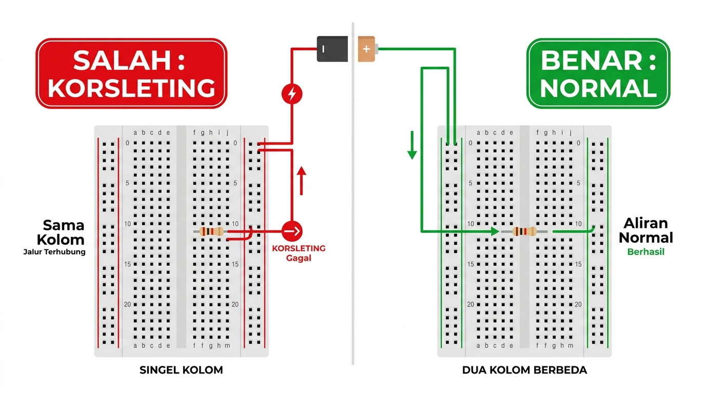
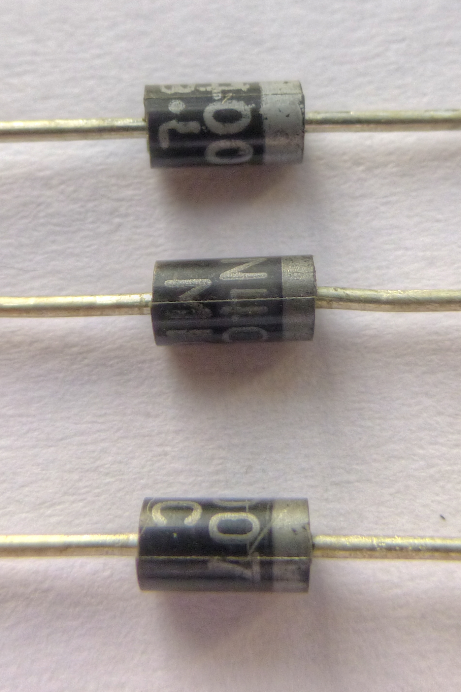
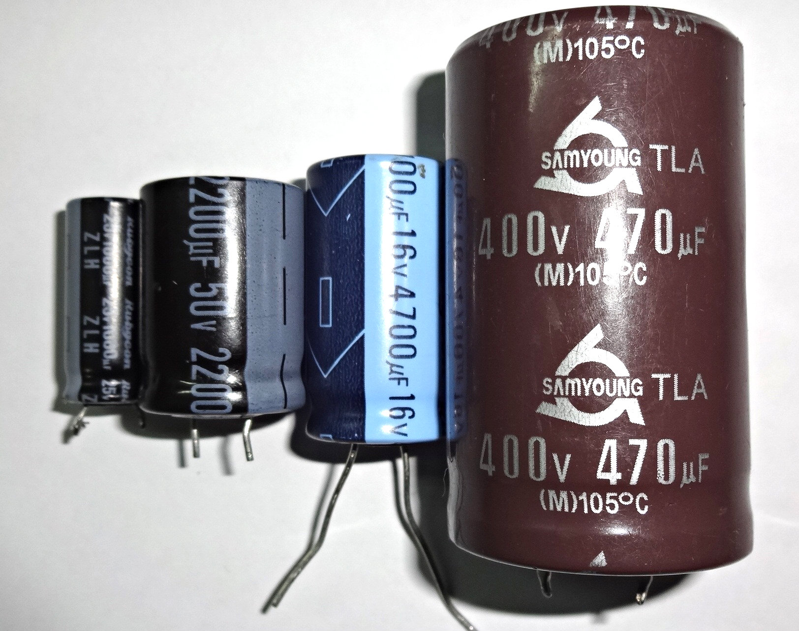
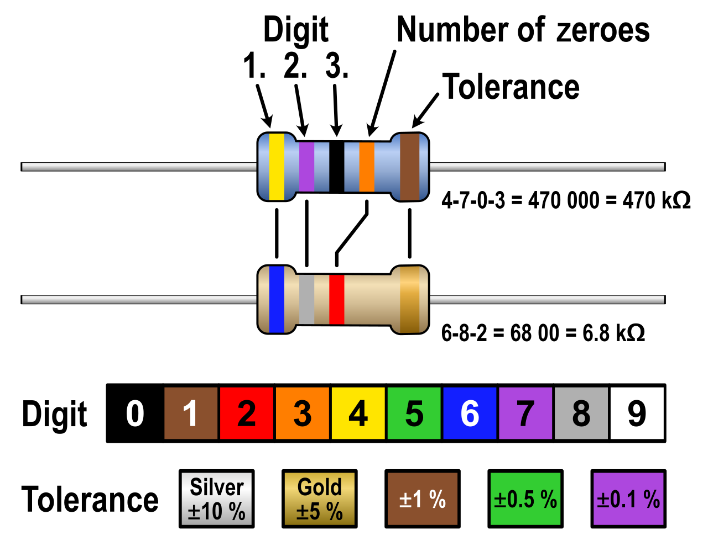
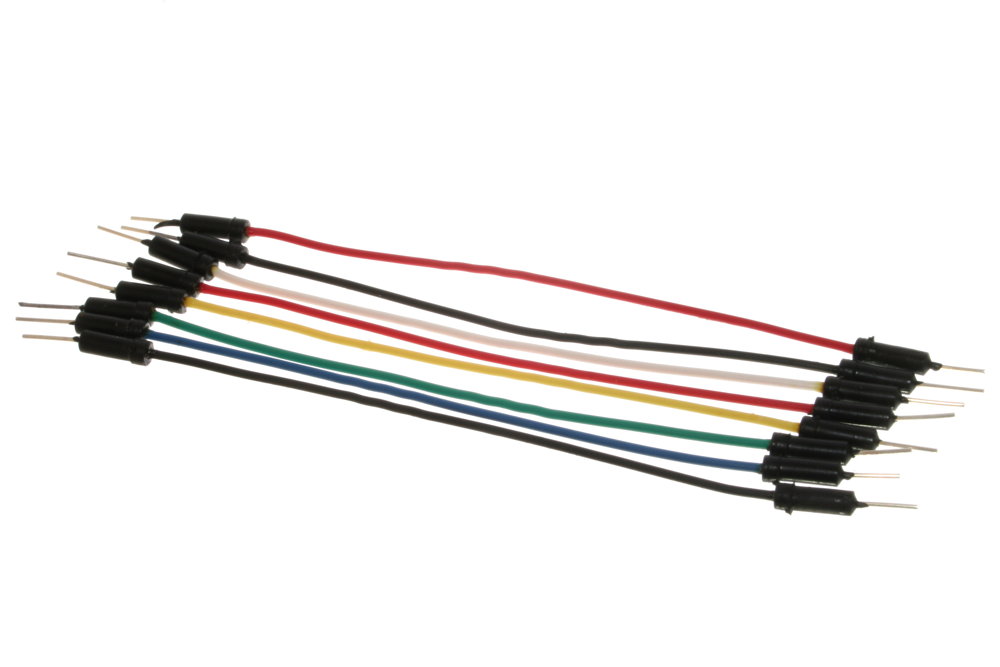

# Modul 0.2: Anatomi Breadboard & Komponen Fisik — Panduan Merangkai Anti-Korslet

> **Tingkat Kesulitan:** Sangat ramah pemula (*Zero Prerequisite* — tidak membutuhkan latar belakang elektronika sebelumnya)  
> **Estimasi Waktu Belajar:** 15–20 menit (membaca panduan santai + mencoba simulasi interaktif di browser)  
> **Kebutuhan Alat:** Belum wajib memiliki board fisik. Seluruh percobaan dapat dijalankan langsung di browser.

---

## 🛠️ Peralatan yang Kita Butuhkan

Agar kamu tidak bingung harus menyiapkan aplikasi atau alat apa di komputermu, pada modul ini kita **hanya** memerlukan alat-alat berikut:

| Alat | Status | Fungsi & Keterangan |
| :--- | :---: | :--- |
| **Browser Web** (Google Chrome, Edge, atau Firefox) | **Wajib** | Untuk membuka simulator **Wokwi** dan merangkai sirkuit virtual di breadboard tanpa perlu memasang aplikasi apa pun (*zero install*). |
| **Komponen Fisik (Breadboard, LED, Resistor, Kabel Jumper)** | **Belum Perlu** | Sangat bagus jika kamu sudah memilikinya di meja kerja, namun seluruh materi ini 100% dapat dipraktikkan langsung di simulator browser. |
| **Multimeter Digital** | **Belum Perlu** | Penggunaan multimeter untuk menguji kontinuitas jalur breadboard akan kita bahas di [Modul 0.3](03-logika-sirkuit-dan-common-ground.md). Sekarang kita fokus memahami jalur logikanya terlebih dahulu. |

> [!TIP]
> **Tautan Simulator untuk Modul Ini:** [Wokwi ESP32 Starter Project](https://wokwi.com/projects/new/esp32)  
> Kamu tidak perlu mendaftar akun atau login. Jika muncul jendela pop-up ajakan *Sign up*, cukup tutup atau abaikan saja jendela tersebut.

Jika kamu sudah menuntaskan [Modul 0.1: Dasar Listrik Intuitif — Analogi Air, Hukum Ohm & Resistor LED](01-dasar-listrik-dan-hukum-ohm.md), mari kita pelajari papan ajaib yang menjadi tempat bertemunya semua komponen elektronika: **Breadboard**!

---

## ⚡ Tenang, Kamu Aman dan Tidak Akan Kesetrum!

Sebelum mulai menancapkan kabel dan komponen, mari kita ingat kembali prinsip kenyamanan dan keamanan dasar kita:

1. **Tegangan Rendah 100% Aman Disentuh:**  
   Seluruh sirkuit breadboard yang kita rakit bekerja pada tegangan **3,3 volt hingga 5 volt DC**. Tegangan ini setara dengan baterai remote TV dan **sama sekali tidak memiliki daya untuk menyengat kulit manusia**. Kamu bisa memegang kabel dan kaki komponen secara bebas tanpa rasa cemas.
2. **Laptopmu Memiliki Proteksi Otomatis:**  
   Port USB pada laptop dan komputer modern sudah dilengkapi sirkuit pemutus arus otomatis (*Overcurrent Protection*). Jika kamu salah menancapkan lubang hingga terjadi korsleting, laptop akan memutus aliran listrik seketika untuk mengamankan dirinya sendiri tanpa merusak perangkat.

Jadi, bereksperimenlah dengan santai dan nikmati proses belajarnya! 😊

---

## 🧭 Apa yang Akan Kita Pelajari?

```
┌────────────────────────────────────────────────────────────────────────┐
│                        ALUR MATERI MODUL 0.2                           │
├────────────────────────────────────────────────────────────────────────┤
│ 1. Membedah Isi Perut Breadboard: Jalur Horizontal vs Vertikal        │
│ 2. Kesalahan Fatal Nomor 1 Pemula: Korslet di Kolom yang Sama          │
│ 3. Cara Menentukan Polaritas Komponen (+ vs -): LED, Dioda, Kapasitor  │
│ 4. Membaca Kode Warna Resistor Tanpa Rumit (3 Resistor Utama IoT)      │
│ 5. Tiga Jenis Kabel Jumper & Standar Warna Kabel Rapi                  │
│ 6. Praktik Virtual Wokwi: Merakit Sirkuit Breadboard Pertama           │
│ 7. Glosarium Istilah Penting & Kuis Refleksi Pemahaman                 │
└────────────────────────────────────────────────────────────────────────┘
```

---

## 1. Membedah Isi Perut Breadboard: Jalur Horizontal vs Vertikal

Pernahkah kamu bertanya-tanya: *Bagaimana para insinyur merakit sirkuit elektronika sebelum disolder secara permanen?*

Jawabannya adalah menggunakan **Breadboard (Papan Rangkaian Prototipe Tanpa Solder)**!  
Dengan breadboard, kamu bisa menancapkan dan mencabut komponen listrik (LED, resistor, kabel, sensor) ribuan kali layaknya bermain balok **LEGO**.

Namun, di balik lubang-lubang plastik putih tersebut, terdapat **deretan pelat jepit tembaga tersembunyi**. Mari kita lihat foto penampang nyata ketika lapisan penutup bawah breadboard dibuka:


*Foto fisik breadboard asli: Sisi kiri menampilkan tampak atas dengan label koordinat, sedangkan sisi kanan memperlihatkan pelat jepit logam internal setelah lapisan perekat bawahnya dibuka. Sumber: Guhuru, Wikimedia Commons, Lisensi CC BY-SA 4.0 / CC0.*

Perhatikan diagram alur pelat tembaga di bawah ini:

```
    JALUR DAYA ATAS (POWER RAILS) - TERSAMBUNG HORIZONTAL (KIRI KE KANAN)
    (+) ──[===============================================================]── (+) Garis Merah
    (-) ──[===============================================================]── (-) Garis Biru
    
    JALUR KOMPONEN TENGAH (TERMINAL STRIPS) - TERSAMBUNG VERTIKAL (ATAS KE BAWAH)
          Kolom 1   Kolom 2   Kolom 3   ...   Kolom 30
        A   (o)       (o)       (o)             (o)
        B   (o)       (o)       (o)             (o)     Setiap 5 lubang (A-B-C-D-E)
        C   (o)       (o)       (o)             (o) ◄── TERSAMBUNG OLEH 1 PELAT
        D   (o)       (o)       (o)             (o)     TEMBAGA DI BAWAHNYA!
        E   (o)       (o)       (o)             (o)
       ═════════════════════════════════════════════  ◄── PARIT TENGAH (TERPUTUS / ISOLASI)
        F   (o)       (o)       (o)             (o)
        G   (o)       (o)       (o)             (o)     Setiap 5 lubang (F-G-H-I-J)
        H   (o)       (o)       (o)             (o) ◄── TERSAMBUNG OLEH 1 PELAT
        I   (o)       (o)       (o)             (o)     TEMBAGA TERPISAH!
        J   (o)       (o)       (o)             (o)
    
    JALUR DAYA BAWAH (POWER RAILS) - TERSAMBUNG HORIZONTAL (KIRI KE KANAN)
    (+) ──[===============================================================]── (+) Garis Merah
    (-) ──[===============================================================]── (-) Garis Biru
```

### Dua Wilayah Utama pada Breadboard:

1. **Jalur Daya (*Power Rails* / Garis Merah & Biru):**
   - Terletak di pinggiran paling atas dan paling bawah breadboard.
   - **Tersambung secara HORIZONTAL (Memanjang mendatar dari kiri ke kanan).**
   - **Garis Merah ($+$):** Dihubungkan ke sumber tegangan positif (3,3V atau 5V).
   - **Garis Biru ($-$ / GND):** Dihubungkan ke Ground ($0\text{V}$).
   - *Fungsi:* Menyediakan rel tegangan bersama agar kita tidak perlu berebut pin daya pada board ESP32 saat memakai banyak sensor.

2. **Jalur Komponen (*Terminal Strips* / Baris A–J):**
   - Terletak di wilayah tengah tempat kita menancapkan sensor, resistor, dan lampu LED.
   - **Tersambung secara VERTIKAL (Tegak lurus dari atas ke bawah per 5 lubang).**
   - Misalnya pada Kolom 1: lubang **1A, 1B, 1C, 1D, dan 1E** semuanya terhubung oleh satu pelat tembaga yang sama di bawahnya.
   - **Parit Pemisah Tengah (*Center Ravine*):** Parit isolasi ini memutus koneksi antara baris A–E dan baris F–J. Parit ini dirancang khusus dengan jarak standar agar kita bisa menancapkan chip terpadu (*IC / Integrated Circuit*) berkaki dua sisi tepat di tengahnya tanpa membuat kaki kiri dan kaki kanannya saling korslet.

---

## 2. Kesalahan Fatal Nomor 1 Pemula: Korslet di Kolom yang Sama

Mari kita pelajari kesalahan paling mendasar yang sering membuat pemula bingung mengapa lampu rangkaiannya tidak mau menyala:



*Perbandingan pemasangan komponen: Menancapkan kedua kaki komponen pada kolom yang sama akan membuat arus listrik mengambil jalan pintas melalui pelat tembaga (korsleting). Komponen wajib menjembatani dua kolom berbeda agar dapat dialiri arus secara normal.*

```
   ❌ CARA SALAH (KORSLETING / TIDAK MENYALA)       ✅ CARA BENAR (BERFUNGSI NORMAL)
   
     Kolom 5                                          Kolom 5        Kolom 8
   A   (o)                                          A   (o)            (o)
   B   (o) ◄── Kaki Kiri Resistor                   B   (o) ◄──────────(o) ◄── Resistor
   C   (o)                                          C   (o) Jumper ke  (o)     menjembatani
   D   (o) ◄── Kaki Kanan Resistor                  D   (o) LED (+)    (o)     dua kolom!
   E   (o)                                          E   (o)            (o)
       ▲                                                ▲              ▲
   Kedua kaki menancap di kolom yang sama!          Kolom 5        Kolom 8
   Listrik memilih jalan pintas (korslet)           berbeda pelat tembaga!
   dan resistor dilewati begitu saja!
```

> [!WARNING]
> **Aturan Emas Merangkai di Breadboard:**  
> **Jangan pernah menancapkan kedua kaki dari satu komponen yang sama pada kolom vertikal yang sama!**  
> Karena seluruh lubang pada satu kolom (misalnya 5A sampai 5E) terhubung oleh satu pelat tembaga yang sama di bawahnya, menancapkan kedua kaki di kolom tersebut akan membuat arus listrik memilih jalan pintas melalui pelat tembaga dan **melewati komponenmu begitu saja (*Short Circuit / Korsleting*)**.  
> Setiap komponen wajib **menjembatani dua kolom yang berbeda**.

---

## 3. Cara Menentukan Polaritas Komponen ($+$ vs $-$)

Komponen elektronika terbagi menjadi dua kelompok besar:
1. **Komponen Non-Polar (Bebas Bolak-Balik):** Tidak memiliki kutub positif maupun negatif. Kamu bebas memasangnya terbalik tanpa masalah (contoh: Resistor dan Kapasitor Keramik bulat pipih).
2. **Komponen Polar (Wajib Searah):** Memiliki kutub **Positif ($+$)** dan **Negatif ($-$)**. Jika dipasang terbalik, komponen tidak akan bekerja, tidak menyala, atau pada komponen tertentu bisa rusak!

Mari kita pelajari cara mengenali kutub pada tiga komponen polar yang paling sering kita gunakan di dunia IoT:

---

### A. Lampu LED (*Light Emitting Diode*)
Lampu LED hanya mengalirkan arus listrik dari kutub **Anoda ($+$)** menuju **Katoda ($-$)**:


*Panduan polaritas kaki LED: Kaki panjang adalah Anoda (+), kaki pendek dan sisi papas pipih pada kubah plastik adalah Katoda (-).*

```
                  ┌─────────┐
                  │ (  LED  │
                  │   )==== │ ◄── Sisi Pipih / Rata (Flat Edge)
                  └────┬─┬──┘
         Panjang       │ │      Pendek
         Anoda (+) ────┘ └─── Katoda (-)
```

* **Anoda (Positif / $+$):** Kaki yang lebih **panjang**. Jika dilihat ke dalam kubah plastik beningnya, pelat logamnya berukuran lebih **kecil ramping**.
* **Katoda (Negatif / $-$):** Kaki yang lebih **pendek**. Pada bibir plastik kubah terdapat **sisi pipih/rata**, dan pelat logam di dalamnya berbentuk **lebar menyerupai bendera**.

---

### B. Dioda Penyearah (Tipe 1N4007)
Dioda berfungsi sebagai katup satu arah (mencegah arus listrik mengalir mundur yang dapat merusak mikrokontroler):



*Foto fisik dioda 1N4007: Garis cincin berwarna perak di sisi kanan menandai kutub Katoda (-). Sumber: Nevit Dilmen, Wikimedia Commons, Lisensi CC BY-SA 3.0.*

```
                  ┌───────────────┐
                  │    [====| ]   │ ◄── Garis Cincin Perak / Putih
                  └───┬───────┬───┘
                      │       │
                  Anoda (+) Katoda (-)
```

* **Katoda (Negatif / $-$):** Ujung badan dioda yang memiliki **garis cincin melingkar berwarna perak atau putih**.
* **Anoda (Positif / $+$):** Sisi badan dioda yang berwarna hitam polos tanpa garis.

---

### C. Kapasitor Elektrolit (*Electrolytic Capacitor*)
Kapasitor elektrolit berbentuk seperti tabung kaleng mini dan berfungsi menyimpan cadangan muatan listrik sementara:



*Foto fisik kapasitor elektrolit: Kaki pendek dan garis strip vertikal dengan tanda minus (-) menandai kutub Katoda. Sumber: Hustvedt, Wikimedia Commons, Lisensi CC BY-SA 3.0.*

```
                  ┌─────────┐
                  │ [ - - ] │ ◄── Garis Strip Abu-abu / Putih dengan Tanda Minus (-)
                  └────┬─┬──┘
                       │ │      
         Anoda (+) ────┘ └─── Katoda (-) (Kaki Pendek)
```

* **Katoda (Negatif / $-$):** Kaki yang lebih **pendek**, dan di sisi tabungnya terdapat **garis strip vertikal berwarna terang bertanda minus ($-$)**.
* **Anoda (Positif / $+$):** Kaki yang lebih **panjang** pada sisi tabung yang polos.

> [!CAUTION]
> Jangan pernah memasang kapasitor elektrolit terbalik pada rangkaian bertegangan tinggi, karena cairan elektrolit di dalamnya bisa mendidih, menghasilkan gas berlebih, dan membuat tabung meletus!

---

## 4. Membaca Kode Warna Resistor Tanpa Rumit

Resistor memiliki ukuran fisik yang sangat mungil sehingga nilai hambatannya tidak dicetak dalam bentuk angka huruf biasa, melainkan menggunakan **gelang kode warna melingkar**:

```
                 ┌───┬───┬───┬───┬───┐
                 │   │ 1 │ 2 │ 3 │ 4 │   │
                 └───┴─┬─┴─┬─┴─┬─┴─┬─┴───┘
                       │   │   │   └─── Gelang 4: Toleransi Presisi (Emas = 5%)
                       │   │   └─────── Gelang 3: Pengali Jumlah Nol (x10 / x100 / x1k)
                       │   └─────────── Gelang 2: Angka Kedua
                       └─────────────── Gelang 1: Angka Pertama
```

### 3 Resistor Paling Wajib yang Digunakan di Proyek IoT:
Kamu tidak perlu menghafalkan seluruh tabel warna di awal. Cukup ingat **tiga kombinasi warna paling populer** yang mencakup 90% kebutuhan proyek kita:

| Nilai Resistor | Warna Gelang 1 - 2 - 3 | Fungsi Utama di Proyek IoT |
| :---: | :---: | :--- |
| **$220\ \Omega$** | **Merah – Merah – Cokelat** | **Pengaman Lampu LED:** Mencegah lampu terbakar saat dialiri tegangan 3,3V dari pin ESP32. |
| **$1\text{ k}\Omega$ ($1000\ \Omega$)** | **Cokelat – Hitam – Merah** | **Pembagi Tegangan & Driver:** Mengamankan kaki basis transistor atau pembagi voltase sensor. |
| **$10\text{ k}\Omega$ ($10000\ \Omega$)** | **Cokelat – Hitam – Oranye** | **Resistor Pull-Up / Pull-Down:** Mencegah sinyal mengambang (*floating*) pada tombol tekan dan sensor cahaya LDR. |

<details>
<summary>🔬 Ingin Tahu Rumus Lengkap Menghitung Gelang Warna Resistor? (Tabel Referensi Internasional)</summary>



*Diagram pembacaan gelang warna resistor 4-gelang dan 5-gelang standar internasional. Sumber: S-kei, Wikimedia Commons, Lisensi CC BY-SA 3.0 / CC0.*

Nilai gelang warna resistor 4-gelang dihitung dengan rumus:
$$\text{Nilai} = [(\text{Gelang 1} \times 10) + \text{Gelang 2}] \times 10^{\text{Gelang 3}}$$

**Kode Angka Warna Standar Internasional:**
- **Hitam** = 0
- **Cokelat** = 1
- **Merah** = 2
- **Oranye** = 3
- **Kuning** = 4
- **Hijau** = 5
- **Biru** = 6
- **Ungu** = 7
- **Abu-abu** = 8
- **Putih** = 9
- **Emas** = Toleransi 5%

**Contoh Pembuktian Resistor $220\ \Omega$ (Merah – Merah – Cokelat):**
- Gelang 1 (Merah) = 2
- Gelang 2 (Merah) = 2
- Gelang 3 (Cokelat) = Pengali $10^1$ (tambah satu angka nol di belakangnya)
- Hasil: $22 \times 10 = 220\ \Omega$ (Toleransi 5%). Sangat mudah dan teratur!

</details>

---

## 5. Tiga Jenis Kabel Jumper & Standar Warna Kabel

Kabel jumper adalah kawat penghubung lentur berisolasi yang digunakan untuk menyambungkan titik-titik sirkuit pada breadboard dan mikrokontroler:



*Foto fisik kabel jumper Dupont Male-to-Male dengan ujung jarum logam berlapis isolator hitam. Sumber: oomlout, Wikimedia Commons, Lisensi CC BY-SA 2.0.*

```
┌──────────────────────────────────────┐     ┌──────────────────────────────────────┐
│        JENIS KABEL JUMPER            │     │         STANDAR WARNA KABEL          │
├──────────────────────────────────────┤     ├──────────────────────────────────────┤
│ 1. Male-to-Male (M-M):               │     │ 🔴 Merah  : Tegangan Positif (5V/3.3V│
│    Jarum di kedua ujung kabel.       │     │ ⚫ Hitam  : Ground / Negatif (0V/GND)│
│    (ESP32 ke Breadboard)             │     │ 🟡 Kuning : Sinyal Data / I2C SDA    │
│ 2. Male-to-Female (M-F):             │     │ 🟢 Hijau  : Sinyal Clock / I2C SCL   │
│    Jarum di 1 ujung, lubang di ujung │     │ 🔵 Biru   : Sinyal Kontrol / PWM     │
│    lainnya. (ESP32 ke Modul Sensor)  │     │                                      │
│ 3. Female-to-Female (F-F):           │     │ *Catatan: Semua kawat sama daya      │
│    Lubang di kedua ujung kabel.      │     │ hantarnya, warna dipakai semata      │
│    (Sensor langsung ke Raspberry Pi) │     │ untuk kerapian dan pelacakan.*       │
└──────────────────────────────────────┘     └──────────────────────────────────────┘
```

### 3 Jenis Ujung Konektor:
1. **Male-to-Male (M-M / Jarum ke Jarum):** Kedua ujungnya memiliki jarum logam runcing. Ini adalah jenis kabel yang paling banyak kita gunakan untuk menghubungkan board ESP32 ke lubang breadboard.
2. **Male-to-Female (M-F / Jarum ke Lubang):** Satu ujung berupa jarum dan ujung lainnya berupa soket lubang. Digunakan untuk menghubungkan modul sensor luar (yang sudah memiliki pin jarum menonjol) ke board ESP32.
3. **Female-to-Female (F-F / Lubang ke Lubang):** Kedua ujungnya berupa soket lubang. Sering digunakan pada koneksi pin header Raspberry Pi langsung ke modul display.

> [!TIP]
> **Mengapa Warna Kabel Sangat Membantu?**  
> Secara fisik, semua kawat tembaga di dalam kabel jumper memiliki kemampuan menghantar listrik yang persis sama. Namun, membiasakan diri menggunakan **kabel Merah untuk Positif ($+$)** dan **kabel Hitam untuk Ground ($-$ / GND)** akan menyelamatkan sirkuitmu dari kesalahan colok yang fatal saat rangkaian mulai padat!

---

## 6. Praktik Virtual Wokwi: Merakit Sirkuit Breadboard Pertama

Sekarang, mari kita buktikan seluruh pemahaman ini dengan merakit sirkuit di atas papan breadboard virtual di simulator Wokwi!

---

### Langkah 1 — Membuka Simulator di Browser
1. Buka tautan lembar kerja di browsermu: **[https://wokwi.com/projects/new/esp32](https://wokwi.com/projects/new/esp32)**
2. Layar browsermu akan menampilkan dua panel:
   - **Panel Kiri:** Editor kode program. Pastikan tab yang aktif adalah **`sketch.ino`**.
   - **Panel Kanan:** Area kerja kanvas diagram sirkuit virtual.

---

### Langkah 2 — Menyiapkan Kode Program
Klik tab **`sketch.ino`** di panel kiri, hapus semua teks yang ada (`Ctrl + A` lalu tekan `Delete`), kemudian tempelkan (*paste*) kode program berikut:

```cpp
void setup() {
  // Sirkuit breadboard ini bekerja secara konstan dari rel daya hardware 3.3V.
  // Kita inisialisasi komunikasi Serial pada kecepatan 115200 baud agar bisa memantau status di layar.
  Serial.begin(115200);
  Serial.println("Sirkuit Breadboard Aktif dan Bekerja Normal!");
}

void loop() {
  // Loop dibiarkan kosong karena rangkaian menerima daya listrik konstan dari pin 3V3 fisik
  delay(1000);
}
```

---

### Langkah 3 — Menambahkan Komponen ke Kanvas Diagram
1. Di panel sebelah kanan (tepat di atas board ESP32), klik tombol biru bertanda **+** (*Add a new part*).
2. Ketik `breadboard`, lalu klik **Half Breadboard**. Papan putih breadboard akan muncul di kanvas. Tarik dan letakkan di sebelah kanan board ESP32.
3. Klik tombol **+** lagi, ketik `resistor`, lalu klik **Resistor**. (Klik resistor yang baru muncul, pastikan nilai hambatannya bernilai **`220`** ohm).
4. Klik tombol **+** lagi, ketik `led`, lalu klik **LED** (pilih warna merah).

---

### Langkah 4 — Menancapkan Komponen ke Lubang Breadboard

Tancapkan komponen ke lubang breadboard dengan koordinat berikut:
1. **Resistor $220\ \Omega$:** Tancapkan satu kaki di lubang **10A** dan kaki lainnya di lubang **14A** *(resistor menjembatani kolom 10 dan kolom 14)*.
2. **LED Merah:**
   - Tancapkan kaki **Anoda (kaki panjang/melengkung)** di lubang **14B** *(sekolom dengan kaki kanan resistor agar saling terhubung oleh pelat tembaga di bawahnya)*.
   - Tancapkan kaki **Katoda (kaki pendek)** di lubang **15B**.

---

### Langkah 5 — Menghubungkan Kabel Jumper Virtual

Tarik sambungan kabel dengan cara mengklik pin asal lalu mengklik pin tujuan:
1. **Kabel Merah:** Klik pin **3V3** pada board ESP32, lalu klik lubang breadboard **10C** *(arahkan kursor ke kabel, lalu ubah warnanya menjadi merah)*.
2. **Kabel Hitam:** Klik lubang breadboard **15C**, lalu klik pin **GND** pada board ESP32 *(ubah warnanya menjadi hitam)*.

```
               DIAGRAM KONEKSI SIRKUIT BREADBOARD
               
   [ ESP32 ]                          [ BREADBOARD ]
    Pin 3V3 ────(Kabel Merah)────────► Kolom 10 (10C) ──┐
                                                        [ Resistor 220 Ω ]
                                                         └► Kolom 14 (14A/14B) ──┐
                                                                                [ Anoda LED (+) ]
                                                                                [ Katoda LED (-) ]
    Pin GND ◄───(Kabel Hitam)───────── Kolom 15 (15C/15B) ───────────────────────┘
```

<details>
<summary>💡 Ingin Cara Instan Tanpa Menarik Kabel Satu per Satu? (Klik di Sini untuk diagram.json)</summary>

Jika kamu ingin langsung melihat rangkaian terpasang sempurna tanpa menarik kabel secara manual, kamu bisa menggunakan fitur denah Wokwi:
1. Klik tab **`diagram.json`** di sebelah tab `sketch.ino`.
2. Ganti seluruh isinya dengan kode JSON berikut:

```json
{
  "version": 1,
  "author": "Fullstack IoT 2026",
  "editor": "wokwi",
  "parts": [
    { "type": "board-esp32-devkit-c-v4", "id": "esp", "top": 0, "left": -80, "attrs": {} },
    { "type": "wokwi-breadboard-half", "id": "bb1", "top": -20, "left": 160, "attrs": {} },
    { "type": "wokwi-resistor", "id": "r1", "top": 120, "left": 230, "attrs": { "value": "220" } },
    { "type": "wokwi-led", "id": "led1", "top": 90, "left": 270, "attrs": { "color": "red" } }
  ],
  "connections": [
    [ "esp:3V3", "bb1:10t.c", "red", [ "v20", "h60" ] ],
    [ "r1:1", "bb1:10t.a", "gold", [ "v0" ] ],
    [ "r1:2", "bb1:14t.a", "gold", [ "v0" ] ],
    [ "led1:A", "bb1:14t.b", "green", [ "v0" ] ],
    [ "led1:C", "bb1:15t.b", "black", [ "v0" ] ],
    [ "bb1:15t.c", "esp:GND.1", "black", [ "v20", "h-140" ] ]
  ]
}
```
3. Begitu kamu kembali ke tab `sketch.ino`, seluruh komponen dan kabel akan langsung tertata rapi otomatis!

</details>

---

### Langkah 6 — Menjalankan Simulasi
1. Klik tombol hijau **Play ▶** (*Start the simulation*) di pojok kanan atas kanvas diagram.
2. **Lihat hasilnya:** Lampu LED merah pada breadboard akan menyala terang dan stabil! 🎉
3. Perhatikan kotak putih **Serial** di bawah board, pesan teks `Sirkuit Breadboard Aktif dan Bekerja Normal!` akan tampil dengan lancar.

---

### Langkah 7 — Eksperimen Mandiri (*Tebak Dulu, Baru Buktikan*)

Mari kita uji pemahaman intuisimu:  
*Apa yang akan terjadi jika kaki katoda LED kamu pindahkan dari lubang 15B ke lubang 18B?*

Mari kita buktikan:
1. Klik tombol merah **Stop**.
2. Geser kaki katoda LED ke lubang **18B** (sementara kabel hitam GND tetap berada di lubang 15C).
3. Klik tombol hijau **Play ▶**.
4. **Hasilnya:** Lampu LED **PADAM**!  
   *Mengapa?* Karena lubang 18B dan 15C berada pada kolom yang berbeda, sehingga pelat tembaga di bawahnya tidak terhubung dan sirkuit listrik menjadi terputus (*Open Circuit*). Kembalikan kaki katoda ke 15B, dan lampu akan langsung menyala kembali!

---

### 🚨 Kotak Bantuan: "Bagaimana Jika Lampu LED Tidak Menyala?"

> [!WARNING]
> **Langkah Pemeriksaan Cepat:**
> 1. **Periksa Kaki LED:** Pastikan kaki anoda (kaki melengkung) berada di kolom 14 (sekolom dengan kaki resistor), bukan tertukar dengan katoda.
> 2. **Periksa Jembatan Resistor:** Pastikan kedua kaki resistor tidak tertancap di kolom yang sama (misalnya jangan sampai kedua kaki menancap di kolom 10).
> 3. **Periksa Pin Daya:** Pastikan kabel merah tertancap di pin bertuliskan **3V3**, bukan pin EN atau pin GPIO lain.
> 4. **Periksa Pin Ground:** Pastikan kabel hitam tertancap di pin bertuliskan **GND**.

---

## 7. 📖 Glosarium Istilah Penting Modul 0.2

| Istilah Teknis | Penjelasan Sederhana |
| :--- | :--- |
| **Breadboard** | Papan berlubang dengan jepitan pelat tembaga internal untuk merakit prototipe sirkuit elektronika tanpa perlu disolder. |
| **Power Rails** | Jalur rel daya di sepanjang tepi atas dan bawah breadboard yang tersambung secara horizontal untuk menyalurkan tegangan positif dan Ground. |
| **Terminal Strips** | Lubang-lubang di area tengah breadboard yang tersambung secara vertikal (5 lubang per kelompok kolom). |
| **Center Ravine** | Parit pemisah di tengah breadboard yang memutus baris A–E dan F–J, dirancang sebagai dudukan chip IC berkaki dua sisi. |
| **Short Circuit (Korsleting)** | Kondisi ketika arus listrik mengalir melewati jalan pintas tanpa beban hambatan, yang dapat menyebabkan komponen gagal bekerja. |
| **Open Circuit** | Kondisi sirkuit terputus sehingga arus listrik tidak dapat mengalir membentuk satu putaran penuh. |
| **Komponen Non-Polar** | Komponen elektronika yang bebas dipasang bolak-balik tanpa membedakan kutub positif atau negatif (contoh: resistor). |
| **Komponen Polar** | Komponen elektronika yang wajib dipasang searah kutub positif dan negatifnya (contoh: LED, dioda, kapasitor elektrolit). |
| **Anoda & Katoda** | Anoda adalah kutub positif ($+$) tempat arus masuk, Katoda adalah kutub negatif ($-$) tempat arus keluar menuju Ground. |
| **Jumper Wire** | Kabel penghubung fleksibel berkepala jarum (*Male*) atau soket (*Female*) untuk menyambungkan titik sirkuit. |

---

## 📝 Kuis Refleksi & Uji Pemahaman Mandiri

Uji pemahaman barumu dengan menjawab 4 pertanyaan singkat berikut di benakmu, lalu cocokkan dengan kunci jawaban di bawah:

1. Jika kamu menancapkan kaki anoda dan katoda dari lampu LED yang sama pada lubang 7A dan 7D, apakah lampu LED tersebut akan menyala normal? Jelaskan alasannya!
2. Mengapa parit isolasi di tengah breadboard (*Center Ravine*) sengaja dibuat terputus antara baris A–E dan baris F–J?
3. Sebutkan urutan gelang warna untuk resistor pengaman LED bernilai $220\ \Omega$!
4. Jika kamu memiliki modul sensor yang pin kakinya berupa jarum logam menonjol keluar dan ingin kamu hubungkan langsung ke lubang breadboard, jenis kabel jumper apakah yang paling tepat kamu gunakan?

<details>
<summary>🔍 Klik di Sini untuk Membuka Kunci Jawaban</summary>

1. **Tidak akan menyala.** Karena lubang 7A dan 7D berada pada kolom vertikal yang sama dan terhubung oleh satu pelat tembaga yang sama di bawahnya. Arus listrik akan mengambil jalan pintas melalui pelat tembaga tersebut (*korsleting*), sehingga tidak ada arus yang melewati lampu LED.
2. Agar komponen chip terpadu (*IC*) atau mikrokontroler berkaki dua sisi dapat ditancapkan tepat di tengah parit tanpa menyebabkan pin di sisi kiri dan pin di sisi kanan saling korslet satu sama lain.
3. **Merah – Merah – Cokelat – Emas** (Angka 2, Angka 2, Pengali 10, Toleransi 5%).
4. **Kabel Female-to-Male (F-M)**: Ujung *Female* (soket lubang) dicolokkan ke pin sensor yang menonjol, dan ujung *Male* (jarum) ditancapkan ke lubang breadboard.

</details>

---

## 📚 Sumber Gambar & Atribusi Lisensi

Seluruh materi visual dalam modul ini disajikan dengan mematuhi etika atribusi dan lisensi terbuka:

| Nama Berkas Gambar | Sumber Gambar & Hak Cipta | Jenis Lisensi |
| :--- | :--- | :--- |
| `aset/breadboard-top-bottom.png` | [Guhuru, Wikimedia Commons](https://commons.wikimedia.org/wiki/File:Breadboard.png) | [Creative Commons CC0 1.0 (Public Domain)](https://creativecommons.org/publicdomain/zero/1.0/deed.id) / [CC BY-SA 4.0](https://creativecommons.org/licenses/by-sa/4.0/) |
| `aset/dioda-1n4007-foto.jpg` | [Nevit Dilmen, Wikimedia Commons](https://commons.wikimedia.org/wiki/File:1N4007_Diode_1480378_79_80_HDR_Enhancer_cr.jpg) | [Creative Commons Attribution-ShareAlike 3.0 Unported (CC BY-SA 3.0)](https://creativecommons.org/licenses/by-sa/3.0/) |
| `aset/kapasitor-elektrolit-foto.jpg` | [Hustvedt, Wikimedia Commons](https://commons.wikimedia.org/wiki/File:Electrolytic_capacitor.jpg) | [Creative Commons Attribution-ShareAlike 3.0 Unported (CC BY-SA 3.0)](https://creativecommons.org/licenses/by-sa/3.0/) |
| `aset/kabel-jumper-breadboard-asli.jpg` | [oomlout, Wikimedia Commons](https://commons.wikimedia.org/wiki/File:A_few_Jumper_Wires.jpg) | [Creative Commons Attribution-ShareAlike 2.0 Generic (CC BY-SA 2.0)](https://creativecommons.org/licenses/by-sa/2.0/) |
| `aset/tabel-kode-warna-resistor.png` | [S-kei, Wikimedia Commons](https://commons.wikimedia.org/wiki/File:Resistor_Color_Code.svg) | [Creative Commons Attribution-ShareAlike 3.0 Unported (CC BY-SA 3.0)](https://creativecommons.org/licenses/by-sa/3.0/) |
| `aset/breadboard-korslet-vs-benar.jpg`, `aset/polaritas-kaki-led.jpg` | Ilustrasi orisinal kurikulum Fullstack IoT Developer | Hak cipta terbuka untuk materi kurikulum edukasi ini |

---

## 🎯 Status Selesai & Langkah Berikutnya

Jika kamu sudah memahami struktur internal breadboard di atas dan berhasil menyalakan lampu sirkuit di Wokwi, selamat! Kamu telah resmi menuntaskan **Modul 0.2**.

Tandai pemahamanmu pada checklist berikut:
- [x] Memahami perbedaan jalur rel daya horizontal (*Power Rails*) dan kolom komponen vertikal (*Terminal Strips*)
- [x] Mengetahui fungsi parit isolasi tengah (*Center Ravine*) pada breadboard
- [x] Memahami aturan emas agar tidak membuat komponen korslet di kolom yang sama
- [x] Mampu membedakan kutub Anoda ($+$) dan Katoda ($-$) pada LED, dioda, dan kapasitor elektrolit
- [x] Mengenali kode warna 3 resistor utama IoT ($220\ \Omega$, $1\text{ k}\Omega$, $10\text{ k}\Omega$)
- [x] Mengetahui perbedaan 3 jenis kabel jumper (M-M, M-F, F-F) dan konvensi warnanya
- [x] Berhasil merangkai sirkuit breadboard pertama dan mengujinya di Wokwi

Langkah berikutnya, mari kita masuk ke logika sirkuit terpenting dalam seluruh rekayasa perangkat keras IoT:  
👉 **[Modul 0.3: Logika Sirkuit — Common Ground, Voltage Divider & Floating Pin](03-logika-sirkuit-dan-common-ground.md)**

Pantau seluruh perkembangan belajarmu di pelacak progres terpadu: **[TODO.md](../TODO.md)**.
