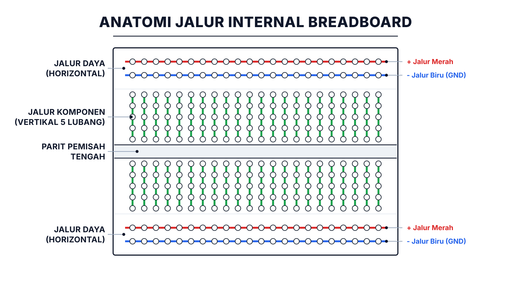
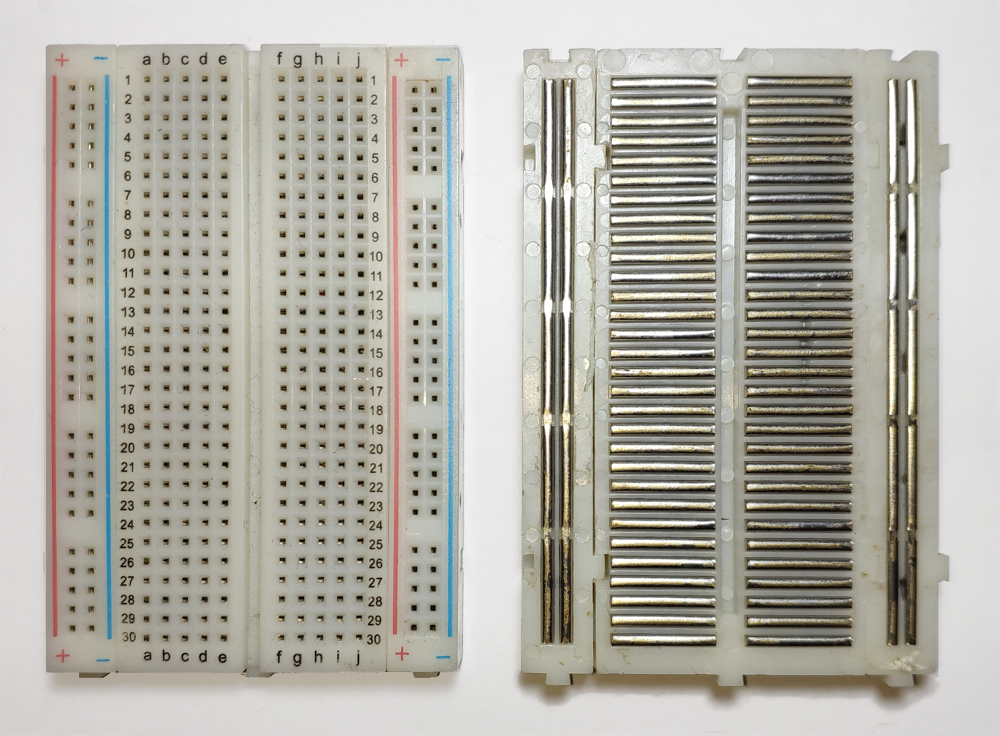
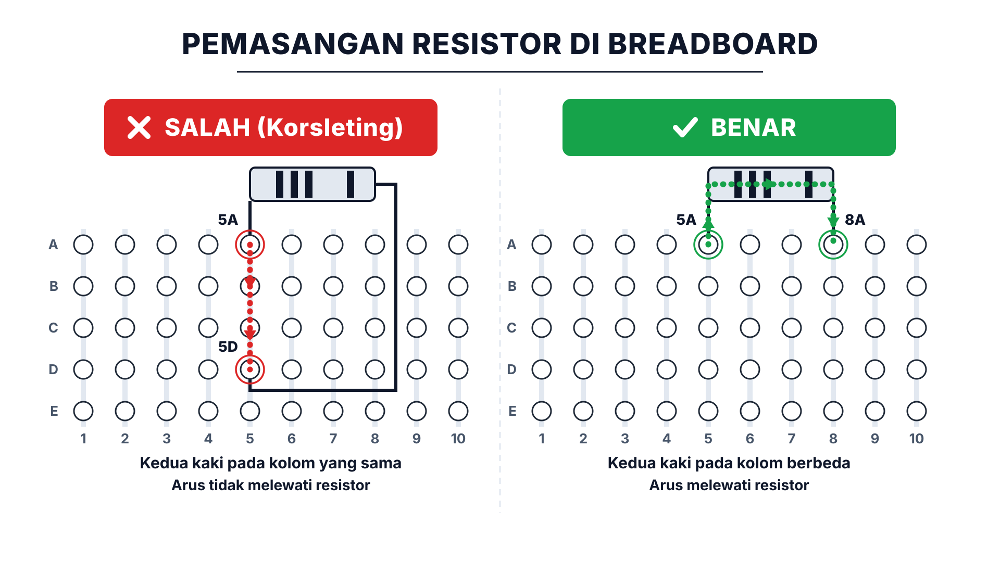
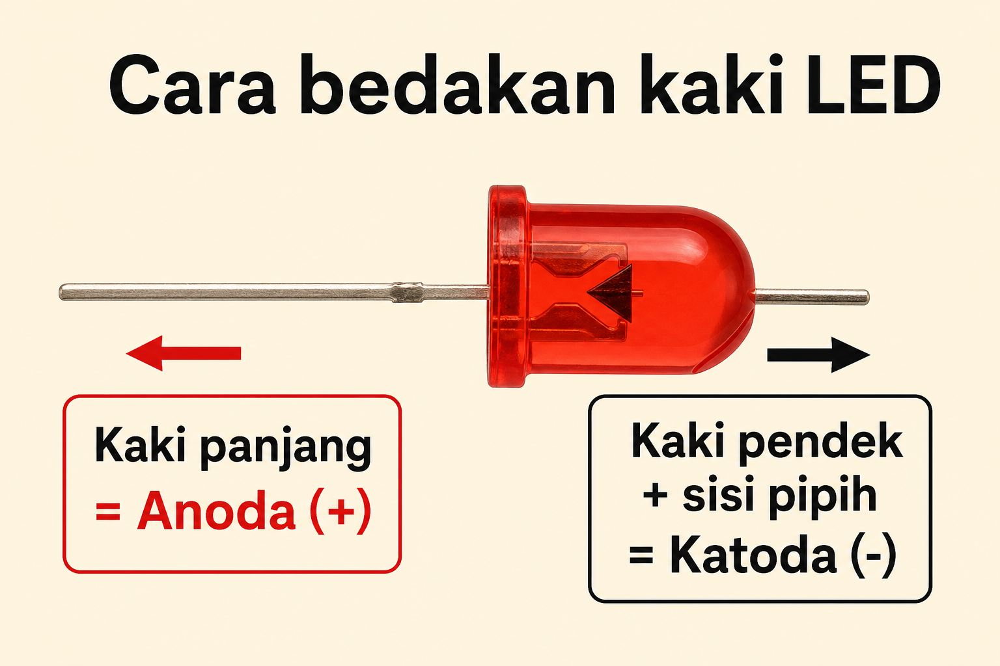
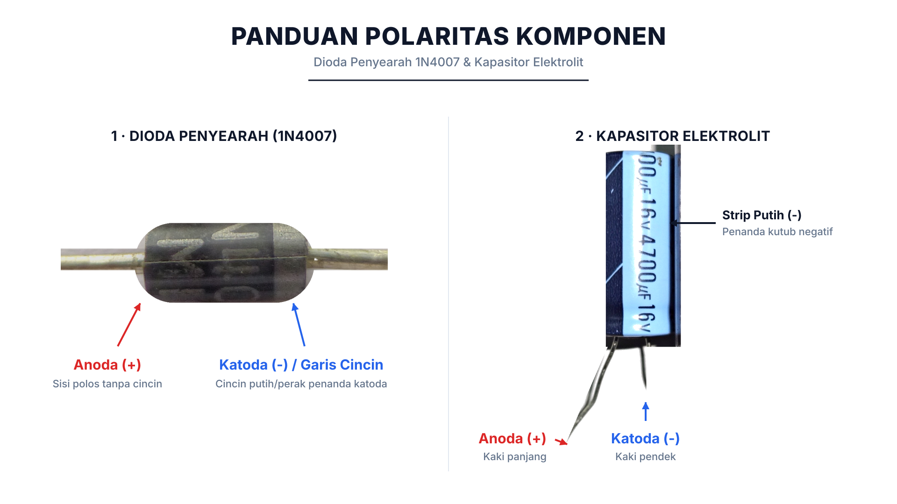
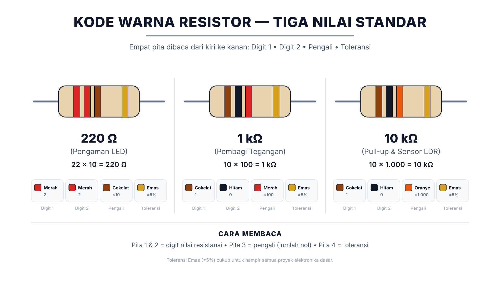
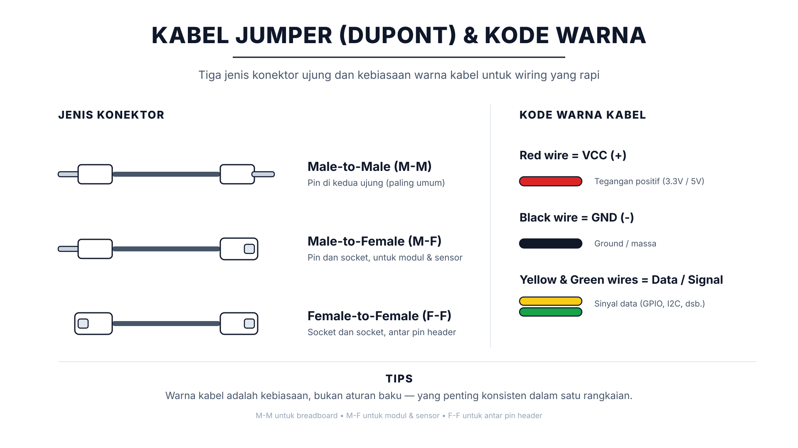

# Modul 0.2: Anatomi Breadboard & Komponen Fisik — Panduan Merangkai Anti-Korslet

> **Tingkat Kesulitan:** Sangat ramah pemula (*Zero Prerequisite* — tidak membutuhkan keahlian menyolder atau pengalaman elektronika sebelumnya)  
> **Estimasi Waktu Belajar:** 15–20 menit (membaca panduan santai + melihat diagram visual + mencoba simulasi di browser)  
> **Kebutuhan Alat:** Belum wajib memiliki breadboard fisik. Seluruh percobaan dapat dijalankan langsung di simulator browser.

---

## 🛠️ Peralatan yang Kita Butuhkan

Agar kamu tidak bingung harus menyiapkan alat apa saja di mejamu, pada modul ini kita **hanya** memerlukan alat-alat berikut:

| Alat | Status | Fungsi & Keterangan |
| :--- | :---: | :--- |
| **Browser Web** (Google Chrome, Edge, atau Firefox) | **Wajib** | Untuk membuka simulator **Wokwi** dan merangkai komponen di atas breadboard virtual secara interaktif tanpa instalasi apa pun. |
| **Papan Breadboard Fisik (Tipe MB-102 Half/Full)** | **Opsional** | Untuk mencoba menancapkan komponen asli dengan tangan (hanya jika kamu sudah memiliki kit fisik). |
| **Komponen Fisik (Resistor, LED, Dioda, Jumper Asli)** | **Opsional** | Untuk merasakan sensasi melatih kepekaan jari saat membedakan kaki komponen fisik. |
| **Solder & Timah Panas** | **Sama Sekali Tidak Perlu** | Breadboard dirancang khusus agar kita bisa merakit sirkuit tanpa menyolder sedikit pun! |

> [!TIP]
> **Tautan Simulator untuk Modul Ini:** [Wokwi ESP32 Starter Project](https://wokwi.com/projects/new/esp32)  
> Kamu tidak perlu membuat akun atau login. Jika muncul jendela pop-up ajakan *Sign up*, cukup tutup atau abaikan saja jendela tersebut.

Jika pada [Modul 0.1](01-dasar-listrik-dan-hukum-ohm.md) kamu sudah memahami rumus Hukum Ohm dan alasan mengapa lampu LED wajib dipasangi resistor pembatas arus, sekarang saatnya kita belajar **tempat menancapkan komponen tersebut secara aman dan rapi**!

---

## ⚡ Tenang, Merangkai di Breadboard 100% Aman!

Bagi yang baru pertama kali merakit sirkuit elektronika, wajar jika muncul rasa ragu: *"Bagaimana kalau salah colok lubang? Apakah komponennya bisa meledak atau tangan saya kesetrum?"*

Jawabannya: **Kamu aman sepenuhnya!**

1. **Bebas Risiko Sengatan Listrik:**  
   Mikrokontroler ESP32 bekerja pada tegangan **3,3 volt hingga 5 volt DC** (arus searah). Listrik bertegangan sekecil ini **100% aman disentuh langsung dengan jari tangan** dan tidak memiliki daya untuk menyengat kulit manusia.
2. **Tanpa Panas Solder:**  
   Breadboard mengusung prinsip *solderless* (tanpa solder). Kamu cukup menancapkan dan mencabut kaki komponen menggunakan jari layaknya bermain balok **LEGO**. Tidak ada risiko jari terkena timah panas!
3. **Laptopmu Dilengkapi Proteksi Otomatis:**  
   Port USB laptop modern memiliki sirkuit pengaman *Overcurrent Protection*. Jika terjadi korsleting pada kabel breadboard sekalipun, laptop akan memutus aliran daya secara otomatis untuk melindungi dirinya sendiri.

Jadi, tarik napas dalam-dalam dan nikmati proses belajarmu dengan santai dan percaya diri! 😊

---

## 🧭 Apa yang Akan Kita Pelajari?

```
┌────────────────────────────────────────────────────────────────────────┐
│                        ALUR MATERI MODUL 0.2                           │
├────────────────────────────────────────────────────────────────────────┤
│ 1. Membedah Isi Perut Breadboard: Jalur Horizontal vs Vertikal        │
│ 2. Kesalahan Fatal Nomor 1 Pemula: Korslet di Kolom yang Sama          │
│ 3. Cara Menentukan Polaritas Komponen (+ vs -): LED, Dioda, Kapasitor  │
│ 4. Membaca Kode Warna Resistor Tanpa Hafalan Rumit                     │
│ 5. Tiga Jenis Kabel Jumper (M-M, M-F, F-F) & Standar Warna Kabel      │
│ 6. Praktik Virtual Wokwi: Merakit Sirkuit Breadboard Pertama           │
│ 7. Glosarium Istilah Penting & Kuis Refleksi                           │
└────────────────────────────────────────────────────────────────────────┘
```

---

## 1. Membedah Isi Perut Breadboard: Jalur Horizontal vs Vertikal

Pernahkah kamu bertanya-tanya: *Bagaimana para penemu dan insinyur merakit prototipe sirkuit elektronika sebelum dicetak permanen di pabrik PCB?*

Jawabannya adalah menggunakan **Breadboard (Papan Prototyping Tanpa Solder)**!

Di balik lubang-lubang plastik putih breadboard, terdapat **deretan pelat jepit tembaga/logam tersembunyi**. Pelat inilah yang bertindak sebagai "kawat konduktor" yang menghubungkan kaki-kaki komponen yang kamu tancapkan.

Mari kita lihat diagram penampang jalur internal breadboard berikut:



*Diagram jalur internal breadboard: Rel daya di sisi tepi terhubung horizontal dari kiri ke kanan, sedangkan rel komponen tengah terhubung vertikal per 5 lubang yang dipisahkan oleh parit tengah.*

### Tiga Wilayah Kunci pada Breadboard:

1. **Jalur Rel Daya (*Power Rails* / Garis Merah & Biru):**
   - Terletak di pinggir paling atas dan paling bawah breadboard.
   - **Tersambung secara HORIZONTAL (Memanjang dari kiri ke kanan).**
   - **Garis Merah ($+$):** Jalur untuk mendistribusikan tegangan positif (biasanya 3,3V atau 5V dari ESP32).
   - **Garis Biru ($-$):** Jalur untuk mendistribusikan Ground ($0\text{V}$ / GND).
   - Seluruh lubang di sepanjang garis merah terhubung menjadi satu kawat panjang, begitu pula seluruh lubang di sepanjang garis biru.

> [!TIP]
> **Waspada "Jalur Daya Terputus di Tengah" pada Breadboard Panjang (Full-Size 830 Titik):**  
> Pada breadboard mini atau ukuran sedang (*Half-Size* 400 titik seperti di Wokwi), jalur rel daya tersambung penuh dari ujung kiri ke kanan.  
> Namun, jika kamu membeli breadboard fisik berukuran panjang (*Full-Size MB-102* 830 titik), beberapa pabrik sengaja **memutus jalur rel daya tepat di tengah** (antara Kolom 30 dan Kolom 31). Tanda visualnya: garis sablon merah/biru memiliki celah jeda kosong di tengah.  
> **Solusinya sangat mudah:** Jika kamu merangkai sirkuit di paruh kanan breadboard panjang dan komponenmu tidak menyala, cukup tancapkan satu kabel jumper merah pendek untuk menjembatani rel positif kiri ke kanan, dan satu kabel jumper hitam pendek untuk menjembatani rel negatif kiri ke kanan.

2. **Jalur Komponen Tengah (*Terminal Strips* / Baris A–J):**
   - Area utama di bagian tengah tempat kita menancapkan resistor, sensor, LED, dan chip mikrokontroler.
   - **Tersambung secara VERTIKAL (Tegak lurus dari atas ke bawah).**
   - Perhatikan koordinat huruf dan angka: Pada **Kolom 1**, lubang **A, B, C, D, dan E semuanya tersambung menjadi satu pelat tembaga**. Artinya, menancapkan kabel di lubang 1A sama persis dengan menyambungkannya ke lubang 1B, 1C, 1D, atau 1E!
   - Kolom 1 **tidak tersambung** ke Kolom 2, Kolom 3, dan seterusnya. Setiap kolom vertikal adalah kelompok kawat independen.
3. **Parit Pemisah Tengah (*Center Trench / Ravine*):**
   - Parit plastik kosong di bagian tengah yang memisahkan kelompok baris A–E (atas) dari kelompok baris F–J (bawah).
   - Lubang 1E **sama sekali tidak terhubung** ke lubang 1F.
   - **Fungsi Parit Tengah:** Dirancang khusus dengan lebar standar agar chip IC berkaki dua sisi (seperti mikrokontroler atau chip logika) bisa ditancapkan tepat di tengah parit tanpa menyebabkan kaki kiri dan kaki kanannya saling korslet!

<details>
<summary>🔬 Ingin Melihat Wujud Nyata Pelat Logam di Balik Breadboard? (Foto Laboratorium)</summary>

Foto di bawah ini memperlihatkan wujud fisik breadboard asli saat lapisan stiker perekat di bagian bawahnya dilepas:



*Foto fisik breadboard: Bagian atas berupa lubang plastik isolator, dan bagian bawah memperlihatkan deretan klip pelat logam pegas yang menjepit kaki komponen.*

Klip pelat logam tersebut memiliki penjepit pegas (*spring clips*). Saat kamu menusukkan kawat komponen ke dalam lubang, penjepit logam akan merenggang sedikit lalu menjepit kawat dengan erat agar arus listrik mengalir dengan stabil.

**Mengapa Kaki Semua Komponen Pas Masuk ke Breadboard?**  
Karena seluruh industri elektronika global mematuhi standar jarak lubang (*Pitch*) yang seragam, yaitu **2,54 mm (setara 0,1 inci)**. Jarak antar-kaki pada chip ESP32, sensor, IC, dan kabel jumper dirancang persis 2,54 mm sehingga dapat ditancapkan dengan sangat presisi tanpa perlu dipaksa.

</details>

---

## 2. Kesalahan Fatal Nomor 1 Pemula: Korslet di Kolom yang Sama

Mari kita pelajari kesalahan paling klasik yang sering dialami oleh orang yang baru pertama kali merangkai di breadboard:



*Perbandingan penancapan komponen: Sisi kiri SALAH karena kedua kaki berada di kolom vertikal yang sama (arus mem-bypass resistor lewat pelat internal). Sisi kanan BENAR karena resistor menjembatani dua kolom berbeda.*

**Mengapa Cara Kiri Salah?**  
Ingat analogi aliran listrik pada Modul 0.1: *Arus listrik selalu memilih jalan pintas yang hambatannya paling kecil (*path of least resistance*)*.  

Karena lubang 5B dan 5D berada pada **satu kolom vertikal yang sama**, keduanya sudah tersambung oleh pelat tembaga logam di bawahnya. Akibatnya, arus listrik akan langsung mengalir lewat pelat tembaga di bawah breadboard dan **melewati (*bypass*) resistor begitu saja**. Resistor sama sekali tidak bekerja menahan arus (*Short Circuit / Korsleting*).

> [!WARNING]
> **Aturan Emas Menancapkan Komponen di Breadboard:**  
> **Komponen pasif berkaki dua (seperti resistor) WAJIB menjembatani dua kolom vertikal yang berbeda!**  
> Tancapkan kaki kiri di satu kolom (misalnya Kolom 5) dan kaki kanan di kolom lain (misalnya Kolom 8). Dengan begitu, arus listrik terpaksa mengalir melewati badan resistor untuk menyeberang antar-kolom.

> [!TIP]
> **Trik Menancapkan Kaki Komponen Fisik Tanpa Bengkok:**  
> Kawat kaki resistor dan LED fisik relatif tipis dan mudah melengkung jika ditekan sembarangan.  
> **Tips Praktis:** Tekuk kedua kaki resistor membentuk huruf "U" atau sudut siku-siku $90^\circ$ yang rapi. Saat menancapkan, jepit kawat menggunakan ujung jarimu sedekat mungkin dengan permukaan breadboard, lalu dorong masuk secara tegak lurus perlahan. Jangan menekan dari atas badan resistor karena kawatnya akan mudah bengkok di tengah jalan.

---

## 3. Cara Menentukan Polaritas Komponen ($+$ vs $-$)

Komponen elektronika yang akan kita gunakan terbagi menjadi dua kelompok besar:
1. **Komponen Non-Polar (Bebas Bolak-Balik):** Tidak memiliki kutub positif maupun negatif. Kamu bebas menancapkannya bolak-balik tanpa takut salah (contoh: **Resistor**, Kapasitor Keramik bulat pipih).
2. **Komponen Polar (Wajib Searah):** Memiliki kutub **Positif ($+$)** dan **Negatif ($-$)**. Komponen ini **wajib** dipasang sesuai arah aliran listrik. Jika dipasang terbalik, komponen tidak akan bekerja atau bahkan bisa rusak.

Mari kita pelajari cara mengenali kutub komponen polar yang paling sering digunakan di dunia IoT:

---

### A. Lampu LED (*Light Emitting Diode*)

LED hanya dapat mengalirkan arus listrik dari kutub **Anoda ($+$)** menuju kutub **Katoda ($-$)**.



*Panduan mengenali polaritas kaki LED melalui panjang kaki, sisi pipih kubah, dan bentuk pelat internal.*

**3 Cara Mudah Menentukan Kutub LED:**
1. **Panjang Kaki Fisik:** Kaki yang **lebih panjang** adalah **Anoda (+)**, sedangkan kaki yang **lebih pendek** adalah **Katoda (-)**.
2. **Sisi Pipih Kubah Plastik (*Flat Edge*):** Raba tepi lingkaran dasar kubah LED. Ada satu sisi yang dipapas rata/pipih. Kaki yang terletak persis di dekat sisi pipih tersebut adalah **Katoda (-)**.
3. **Bentuk Pelat di Dalam Kubah Transparan:** Terawang plastik LED ke arah cahaya:
   - Pelat logam kecil ramping di dalam adalah **Anoda (+)**.
   - Pelat logam lebar menyerupai bendera adalah **Katoda (-)**.

---

### B. Dioda Penyearah (1N4007) & Kapasitor Elektrolit

Mari kita perhatikan dua komponen polar penting lainnya yang sering kita jumpai di rangkaian catu daya IoT:



*Panduan kutub polaritas komponen: Dioda penyearah 1N4007 menandai katoda (-) dengan garis cincin perak, sedangkan kapasitor elektrolit menandai katoda (-) dengan strip vertikal bertanda minus dan kaki yang lebih pendek.*

#### 1. Dioda Penyearah (1N4007)
Dioda berfungsi layaknya **katup satu arah** pipa air: listrik hanya diizinkan mengalir maju dan dicegah mengalir mundur (sangat penting untuk melindungi chip ESP32 dari arus balik motor atau relay).
- **Katoda (Negatif / $-$):** Ujung tabung hitam yang memiliki **garis cincin berwarna perak/putih**.
- **Anoda (Positif / $+$):** Sisi tabung polos hitam tanpa garis.

#### 2. Kapasitor Elektrolit (*Electrolytic Capacitor*)
Kapasitor elektrolit berbentuk seperti kaleng mini yang berfungsi sebagai "tandon penyimpan cadangan listrik sementara" untuk meredam kedipan voltase saat modul Wi-Fi ESP32 menyala.
- **Katoda (Negatif / $-$):** Kaki yang **lebih pendek** dan berada persis di bawah **garis strip vertikal berwarna abu-abu/putih bertanda minus ($-$)** pada tabung.
- **Anoda (Positif / $+$):** Kaki yang **lebih panjang**.

> [!CAUTION]
> **Peringatan Penting Kapasitor Elektrolit:**  
> Jangan pernah memasang kutub kapasitor elektrolit terbalik pada sirkuit bertegangan! Cairan elektrolit di dalamnya dapat mendidih dan menyebabkan tabung kapasitor meletup serta mengeluarkan asap. Selalu pastikan kaki bertanda minus ($-$) terhubung ke jalur GND.

---

## 4. Membaca Kode Warna Resistor Tanpa Rumit

Ukuran badan resistor sangat kecil (panjangnya hanya sekitar 6 mm), sehingga pabrik tidak mencetak angka teks di badannya. Sebagai gantinya, nilai hambatannya dicetak menggunakan **gelang pita warna melingkar**:



*Diagram kode warna resistor empat pita: Tiga nilai paling standar dalam rekayasa IoT beserta formula matematis pengalinya.*

### Cara Membaca Resistor 4 Pita Warna:
Membaca pita warna resistor dilakukan dari kiri ke kanan (pita keempat yang berwarna emas/perak diletakkan di sebelah kanan):
1. **Pita 1:** Angka Digit Pertama.
2. **Pita 2:** Angka Digit Kedua.
3. **Pita 3 (Pengali):** Faktor Pengali Jumlah Angka Nol ($10^n$).
4. **Pita 4 (Toleransi):** Akurasi presisi pabrik (Warna Emas = toleransi $\pm 5\%$).

---

### 3 Resistor Paling Wajib di Dunia IoT:
Sebagai pemula, kamu **tidak perlu menghafal** tabel 10 warna resistor! Cukup kenali dan simpan **3 nilai resistor paling populer** yang akan kita pakai di 95% proyek IoT:

| Nilai Hambatan | Urutan Pita Warna | Perhitungan Logis | Fungsi Utama di Proyek IoT |
| :---: | :---: | :---: | :--- |
| **$220\ \Omega$** | **Merah – Merah – Cokelat – Emas** | $22 \times 10^1 = \mathbf{220\ \Omega}$ | **Pengaman Lampu LED:** Menahan arus berlebih agar LED tidak terbakar saat dipicu pin GPIO 3,3V. |
| **$1\text{ k}\Omega$** ($1000\ \Omega$) | **Cokelat – Hitam – Merah – Emas** | $10 \times 10^2 = \mathbf{1000\ \Omega}$ | **Pembagi Tegangan & Driver:** Pengaman kaki *Base* transistor dan modul sensor analog. |
| **$10\text{ k}\Omega$** ($10.000\ \Omega$) | **Cokelat – Hitam – Oranye – Emas** | $10 \times 10^3 = \mathbf{10.000\ \Omega}$ | **Resistor Pull-up / Pull-down:** Menjaga kestabilan sinyal tombol tekan dan rangkaian sensor cahaya LDR. |

> [!TIP]
> **Trik Praktis:** Jika kamu ragu membaca warna resistor di meja kerjamu, gunakan **Multimeter Digital** pada mode pengukuran resistansi ($\Omega$). Tempelkan kedua jarum probe ke kedua kaki resistor, dan layarnya akan langsung menampilkan nilai ohm aslinya secara akurat!

---

## 5. Tiga Jenis Kabel Jumper & Standar Warna Kabel

Kabel jumper adalah kawat fleksibel berinti tembaga yang ujungnya dilengkapi kepala konektor khusus (*Dupont Connector*) untuk menancap pas ke lubang breadboard atau pin header ESP32.



*Panduan kabel jumper Dupont: Tiga konfigurasi ujung konektor (M-M, M-F, F-F) dan standar pewarnaan kabel untuk menjaga kerapian sirkuit.*

### Mengenal Tiga Jenis Kabel Jumper:

1. **Male-to-Male (M-M):** Memiliki jarum pin logam di **kedua ujungnya** (paling sering digunakan untuk menghubungkan pin ESP32 ke lubang breadboard).
2. **Male-to-Female (M-F):** Memiliki jarum pin di satu ujung dan lubang soket di ujung lainnya (digunakan untuk menghubungkan modul sensor ke breadboard atau pin ESP32).
3. **Female-to-Female (F-F):** Memiliki lubang soket di **kedua ujungnya** (digunakan untuk menghubungkan dua modul sensor berkaki pin jarum secara langsung tanpa breadboard).

---

### Standar Warna Kabel dalam Rekayasa IoT:

Semua kabel jumper—apapun warna plastik isolatornya—memiliki kawat tembaga internal yang **sama persis daya hantarnya**. Listrik tidak peduli kabelmu berwarna merah atau ungu!

Namun, para insinyur profesional selalu mematuhi **kesepakatan warna standar** agar sirkuit rapi dan mudah ditelusuri saat terjadi kesalahan (*troubleshooting*):

* 🔴 **Kabel Merah:** Digunakan khusus untuk **Tegangan Positif ($+$ / VCC / 3,3V / 5V)**.
* ⚫ **Kabel Hitam:** Digunakan khusus untuk **Ground ($-$ / GND / 0V)**.
* 🟡 **Kabel Kuning & 🟢 Kabel Hijau:** Digunakan untuk **Jalur Sinyal Data & Clock** (seperti pin I2C SDA/SCL atau sensor analog).
* 🔵 **Kabel Biru & ⚪ Kabel Putih:** Digunakan untuk **Sinyal Kontrol / PWM Aktuator**.

> [!NOTE]
> **Disiplin Wiring Sejak Dini:**  
> Jangan pernah menggunakan kabel hitam untuk jalur daya 5V atau kabel merah untuk jalur GND! Kebiasaan mencampuradukkan warna kabel daya adalah penyebab nomor satu komponen terbakar akibat salah colok saat sirkuit bertambah rumit.

---

## 6. Praktik Virtual Wokwi: Merakit Sirkuit Breadboard Pertama

Sekarang, mari kita buktikan seluruh pemahaman ini dengan merakit sirkuit di atas breadboard virtual simulator Wokwi!

---

### Langkah 1 — Membuka Lembar Kerja Simulasi
1. Buka tautan lembar kerja di browser: **[https://wokwi.com/projects/new/esp32](https://wokwi.com/projects/new/esp32)**
2. Pastikan tab yang aktif di editor kode sebelah kiri adalah **`sketch.ino`**.

---

### Langkah 2 — Memasukkan Kode Program
Hapus semua kode bawaan di tab `sketch.ino`, lalu tempelkan (*paste*) kode program berikut:

```cpp
void setup() {
  // 1. Siapkan pin GPIO 4 sebagai pengirim sinyal listrik (OUTPUT)
  pinMode(4, OUTPUT);

  // 2. Alirkan tegangan stabil 3,3V ke GPIO 4 agar lampu LED menyala
  digitalWrite(4, HIGH);
}

void loop() {
  // Dibiarkan kosong karena kita ingin mengamati lampu menyala stabil di breadboard
}
```

---

### Langkah 3 — Menambahkan Komponen ke Kanvas Simulasi
1. Di panel diagram sebelah kanan, klik tombol biru bertanda **+** (*Add a new part*).
2. Tambahkan 3 komponen berikut satu per satu:
   - Ketik `Breadboard` $\rightarrow$ klik **Half Breadboard**.
   - Ketik `Resistor` $\rightarrow$ klik **Resistor**.
   - Ketik `LED` $\rightarrow$ klik **LED** (pilih warna merah).
3. Klik komponen resistor yang baru muncul di kanvas, lalu pada menu nilai hambatan di bagian atas kanvas, pastikan nilainya tertulis **`220`** (ohm).

---

### Langkah 4 — Menancapkan Komponen & Menghubungkan Kabel

Tancapkan komponen ke breadboard dengan panduan koordinat berikut:

1. **Pasang Resistor 220 $\Omega$:**
   - Tancapkan kaki kiri resistor di lubang **10A**.
   - Tancapkan kaki kanan resistor di lubang **14A** (menjembatani kolom 10 dan kolom 14!).
2. **Pasang Lampu LED Merah:**
   - Tancapkan **Anoda LED (kaki panjang melengkung)** di lubang **14B** (sekolom vertikal dengan kaki resistor agar terhubung!).
   - Tancapkan **Katoda LED (kaki pendek lurus)** di lubang **15B**.
3. **Tarik Kabel Jumper:**
   - Klik pin **GPIO 4** pada board ESP32, lalu tarik kabel ke lubang **10C** di breadboard (klik kabel dan ubah warnanya menjadi **merah**).
   - Klik lubang **15C** di breadboard (sekolom dengan katoda LED), lalu tarik kabel kembali ke pin **GND** pada board ESP32 (ubah warna kabel menjadi **hitam**).

| Dari Titik (*Asal*) | Menuju Titik (*Tujuan*) | Warna Kabel | Keterangan Jalur |
| :--- | :--- | :---: | :--- |
| **Pin GPIO 4** (ESP32) | **Kolom 10C** (Breadboard) | 🔴 Merah | Memasok tegangan 3,3V ke jalur resistor |
| **Kaki Kiri Resistor** | **Kolom 10A** | — | Menancap di Kolom 10 (sejalur kabel merah) |
| **Kaki Kanan Resistor** | **Kolom 14A** | — | Menjembatani Kolom 10 ke Kolom 14 |
| **Anoda LED (+)** | **Kolom 14B** | — | Sekolom vertikal dengan kaki kanan resistor |
| **Katoda LED (-)** | **Kolom 15B** | — | Menancap di Kolom 15 |
| **Kolom 15C** (Breadboard) | **Pin GND** (ESP32) | ⚫ Hitam | Mengalirkan arus balik dari katoda ke Ground |

<details>
<summary>⚡ Ingin Rangkaian Terpasang Otomatis? Salin Kode diagram.json Ini ke Wokwi!</summary>

Jika kamu ingin sirkuit langsung tersusun rapi secara otomatis di simulator tanpa repot menarik kabel satu per satu dengan mouse:

1. Di simulator Wokwi, klik tab **`diagram.json`** (di sebelah tab `sketch.ino`).
2. Hapus semua teks bawaan (`Ctrl + A` lalu `Delete`), lalu tempelkan (*paste*) kode JSON berikut:

```json
{
  "version": 1,
  "author": "Fullstack IoT 2026",
  "editor": "wokwi",
  "parts": [
    { "type": "board-esp32-devkit-c-v4", "id": "esp", "top": 0, "left": -220, "attrs": {} },
    { "type": "wokwi-breadboard-half", "id": "bb1", "top": 20, "left": 100, "attrs": {} },
    { "type": "wokwi-resistor", "id": "r1", "top": 120, "left": 180, "attrs": { "value": "220" } },
    { "type": "wokwi-led", "id": "led1", "top": 110, "left": 230, "attrs": { "color": "red" } }
  ],
  "connections": [
    [ "esp:TX", "$serialMonitor:RX", "", [] ],
    [ "esp:RX", "$serialMonitor:TX", "", [] ],
    [ "esp:4", "bb1:10c", "red", [ "v0" ] ],
    [ "r1:1", "bb1:10a", "#00d1b2", [ "v0" ] ],
    [ "r1:2", "bb1:14a", "#00d1b2", [ "v0" ] ],
    [ "led1:A", "bb1:14b", "green", [ "v0" ] ],
    [ "led1:C", "bb1:15b", "green", [ "v0" ] ],
    [ "bb1:15c", "esp:GND.1", "black", [ "v0" ] ]
  ],
  "dependencies": {}
}
```

3. Klik kembali tab **`sketch.ino`**. Semua komponen (ESP32, Breadboard, Resistor 220 $\Omega$, LED Merah, dan seluruh kabelnya) akan langsung otomatis terpasang rapi di kanvas!

</details>

---

### Langkah 5 — Menjalankan Simulasi
1. Klik tombol hijau **Play ▶** (*Start the simulation*).
2. **Lihat hasilnya:** Lampu LED merah di atas breadboard akan menyala terang dan stabil! 🎉

---

### Langkah 6 — Eksperimen Mandiri (*Observe $\rightarrow$ Break $\rightarrow$ Create*)
Mari kita buktikan hukum korsleting breadboard yang baru saja kita pelajari:

1. Klik tombol merah **Stop**.
2. Geser kaki kanan resistor dari lubang **14A** ke lubang **10E** (sekarang kedua kaki resistor berada di **Kolom 10 yang sama**).
3. Pindahkan juga anoda LED ke lubang **10D**.
4. Klik tombol **Play ▶** kembali.
5. **Amati hasilnya:** Lampu LED **tidak menyala sama sekali**! Arus listrik memotong jalan lewat pelat Kolom 10 tanpa melewati lampu dan resistor.
6. Klik tombol **Stop**, lalu kembalikan kaki resistor menjembatani kolom 10 dan 14 seperti semula agar lampu menyala kembali. Sekarang kamu telah membuktikan sendiri prinsip sirkuit breadboard dengan matamu sendiri!

> [!WARNING]
> **Panduan Jika Lampu LED Tidak Menyala:**
> 1. **Periksa Kaki LED:** Pastikan kaki anoda (kaki melengkung) berada di kolom 14 dan kaki katoda (kaki lurus) berada di kolom 15. Jika terbalik, LED tidak akan menyala.
> 2. **Periksa Kolom Jumper:** Pastikan kabel dari GPIO 4 tertancap di Kolom 10, dan kabel ke GND tertancap di Kolom 15 (sekolom dengan katoda LED).
> 3. **Periksa Nilai Resistor:** Pastikan nilai resistor adalah `220` ohm, bukan `220k` (kilo-ohm). Resistor yang terlalu besar akan membuat arus terlalu kecil sehingga nyala lampu tidak terlihat.

---

## 7. 📖 Glosarium Istilah Penting Modul 0.2

| Istilah Teknis | Penjelasan Sederhana |
| :--- | :--- |
| **Breadboard** | Papan berlubang dengan jepitan pelat tembaga internal untuk merakit prototipe sirkuit elektronika tanpa perlu disolder. |
| **Power Rails** | Jalur rel daya horizontal di pinggir atas dan bawah breadboard yang saling terhubung memanjang untuk jalur positif ($+$) dan negatif ($-$). |
| **Terminal Strips** | Lubang-lubang di area tengah breadboard yang terhubung secara vertikal (5 lubang per kolom, baris A–E dan F–J). |
| **Parit Tengah (*Center Trench*)** | Celah pemisah di tengah breadboard yang memutus sambungan antara baris atas dan bawah untuk tempat memasang chip IC. |
| **Korsleting (*Short Circuit*)** | Kondisi ketika arus listrik mengalir melalui jalan pintas tanpa melewati komponen beban, menyebabkan rangkaian tidak bekerja normal. |
| **Polaritas** | Sifat komponen yang memiliki kutub positif ($+$) dan negatif ($-$) sehingga wajib dipasang searah aliran arus. |
| **Anoda & Katoda** | Anoda adalah kutub positif ($+$) tempat arus masuk, dan Katoda adalah kutub negatif ($-$) tempat arus keluar. |
| **Resistor Axial** | Resistor tabung berkaki kawat di kedua sisinya yang nilainya ditandai dengan gelang pita warna. |
| **Kabel Jumper Dupont** | Kabel penghubung fleksibel berkepala standar dengan variasi jarum logam (*Male*) dan lubang soket (*Female*). |

---

## 📝 Kuis Refleksi & Uji Pemahaman Mandiri

Uji pemahaman barumu dengan menjawab 4 pertanyaan singkat berikut di benakmu, lalu cocokkan dengan kunci jawaban di bawah:

1. Jika kamu menancapkan kaki kiri resistor di lubang **7A** dan kaki kanan resistor di lubang **7D**, apakah resistor tersebut akan berfungsi menahan arus listrik? Jelaskan alasannya!
2. Mengapa breadboard memiliki parit kosong memanjang tepat di bagian tengahnya?
3. Pada kapasitor elektrolit fisik berbentuk tabung, ciri visual apakah yang menandakan bahwa suatu kaki adalah kutub negatif (Katoda)?
4. Berapakah nilai hambatan sebuah resistor yang memiliki urutan pita warna: **Merah – Merah – Cokelat – Emas**?

<details>
<summary>🔍 Klik di Sini untuk Membuka Kunci Jawaban</summary>

1. **Tidak berfungsi.** Karena lubang 7A dan 7D berada pada kolom vertikal yang sama (Kolom 7), keduanya sudah terhubung oleh pelat tembaga di bawahnya. Arus listrik akan memotong jalan (*short circuit*) lewat pelat tembaga dan mem-bypass resistor. Komponen wajib menjembatani dua kolom berbeda (misalnya 7A ke 10A).
2. Parit tengah berfungsi sebagai pemisah isolasi antara kelompok baris A–E dan baris F–J, sehingga chip mikrokontroler berkaki dua sisi (IC) dapat ditancapkan di tengah tanpa menyebabkan kaki sisi kiri dan kanannya saling korslet.
3. Kaki katoda (negatif) memiliki kawat fisik yang **lebih pendek** dan terletak sejajar dengan **garis strip vertikal berwarna abu-abu/putih bertanda minus ($-$)** di badan tabung kapasitor.
4. **$220\ \Omega$ (toleransi $\pm 5\%$).** Digit pertama Merah (2), Digit kedua Merah (2), Pengali Cokelat ($10^1 = 10$), dan Emas ($\pm 5\%$). Nilai ini adalah resistor pengaman LED standar.

</details>

---

## 📚 Sumber Gambar & Atribusi Lisensi

Seluruh materi visual dalam modul ini disajikan dengan mematuhi etika atribusi dan lisensi terbuka:

| Nama Berkas Gambar | Sumber Gambar & Hak Cipta | Jenis Lisensi |
| :--- | :--- | :--- |
| `aset/breadboard-anatomy.svg` | Diagram vektor orisinal kurikulum Fullstack IoT Developer | Lisensi Terbuka Kurikulum Edukasi |
| `aset/breadboard-resistor-placement.svg` | Diagram vektor komparasi orisinal kurikulum Fullstack IoT Developer | Lisensi Terbuka Kurikulum Edukasi |
| `aset/polaritas-komponen.svg` | Diagram hibrida foto nyata & vektor kurikulum Fullstack IoT Developer (foto Dioda 1N4007 & Kapasitor Elektrolit dinormalisasi via Python) | Lisensi Terbuka Kurikulum Edukasi |
| `aset/diagram-kode-warna-tiga-resistor.svg` | Diagram infografis vektor standar resistor 4 pita orisinal | Lisensi Terbuka Kurikulum Edukasi |
| `aset/diagram-kabel-jumper-jenis-dan-warna.svg` | Diagram vektor jenis konektor Dupont & kode warna kabel orisinal | Lisensi Terbuka Kurikulum Edukasi |
| `aset/breadboard-top-bottom.png` | Foto laboratorium perbandingan penampang breadboard tampak atas dan bawah | Dokumentasi Edukasi Perangkat Keras |
| `aset/polaritas-kaki-led.jpg` | Ilustrasi panduan polaritas kaki LED kurikulum Fullstack IoT Developer | Lisensi Terbuka Kurikulum Edukasi |

---

## 🎯 Status Selesai & Langkah Berikutnya

Selamat! Kamu telah resmi menuntaskan **Modul 0.2**. Sekarang kamu sudah memahami anatomi di balik breadboard, tidak akan pernah salah menancapkan kutub komponen lagi, dan mampu membaca kode warna resistor dengan mudah!

Tandai capaian belajarmu pada checklist berikut:
- [x] Memahami perbedaan jalur rel daya horizontal (*Power Rails*) dan rel komponen vertikal (*Terminal Strips*)
- [x] Mengetahui fungsi parit pemisah tengah (*Center Trench*) untuk penempatan chip IC
- [x] Memahami aturan emas breadboard agar tidak terjadi korsleting pada kolom yang sama
- [x] Mampu membedakan kutub Anoda (+) dan Katoda (-) pada LED, Dioda 1N4007, dan Kapasitor Elektrolit
- [x] Menguasai 3 nilai resistor paling wajib di IoT ($220\ \Omega$, $1\text{ k}\Omega$, $10\text{ k}\Omega$)
- [x] Memahami 3 jenis kabel jumper Dupont (M-M, M-F, F-F) dan standar warna kabelnya
- [x] Berhasil merangkai sirkuit breadboard pertama di simulator Wokwi dan membuktikan fenomena korsleting

Langkah berikutnya, mari kita pelajari hukum sirkuit paling fundamental dalam IoT:  
👉 **[Modul 0.3: Logika Sirkuit — Common Ground, Voltage Divider & Floating Pin](03-logika-sirkuit-dan-common-ground.md)**

Pantau seluruh perkembangan belajarmu di pelacak progres terpadu: **[TODO.md](../TODO.md)**.
