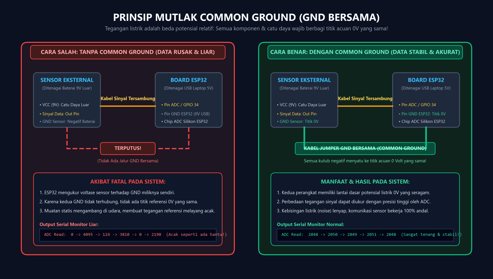
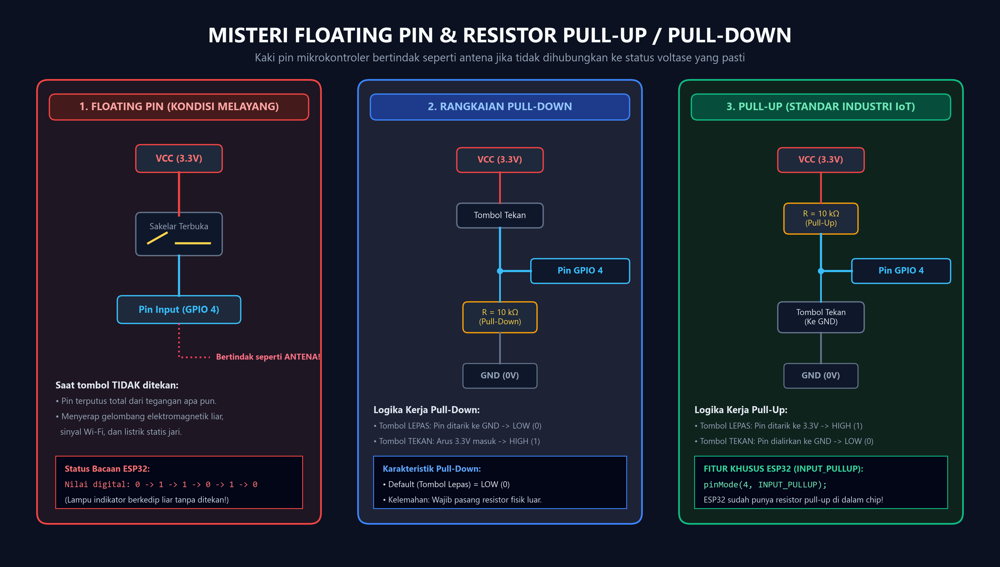
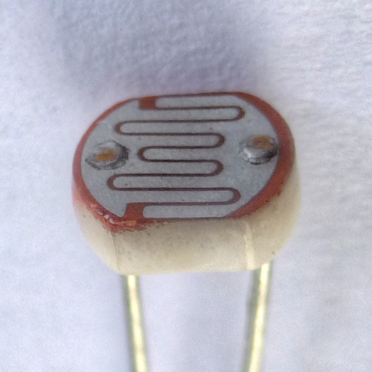
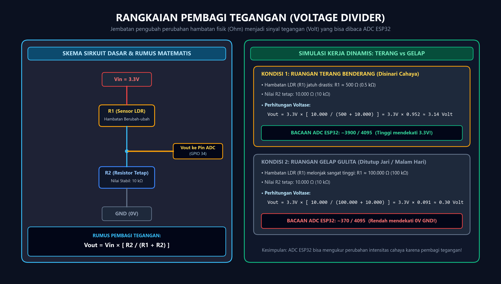
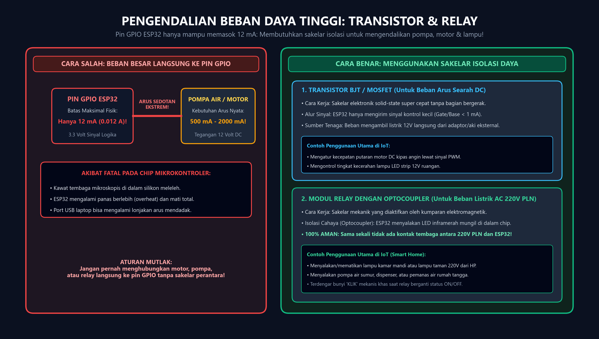
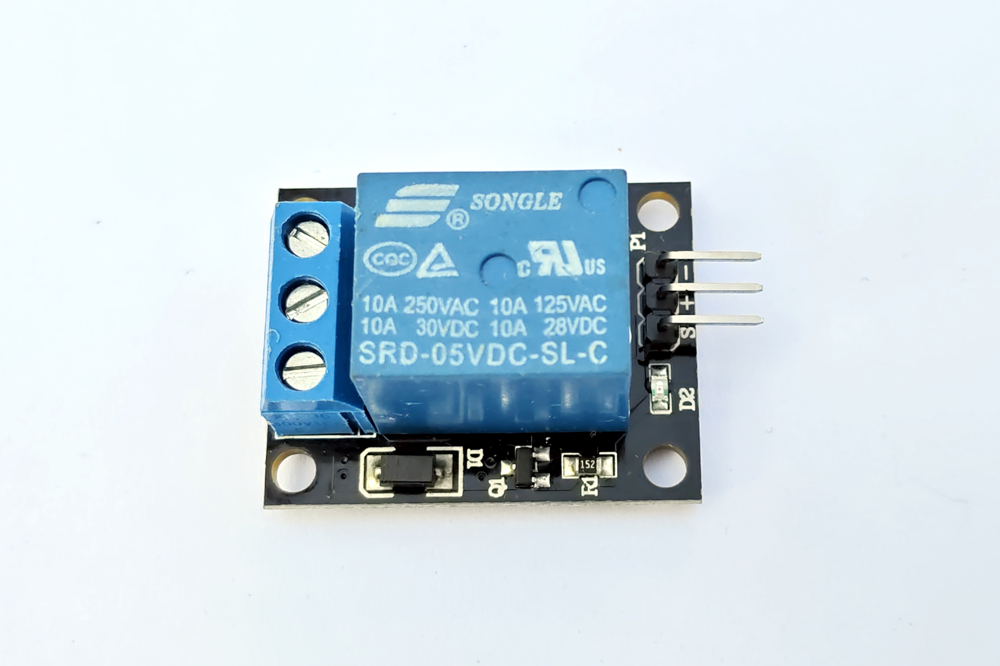
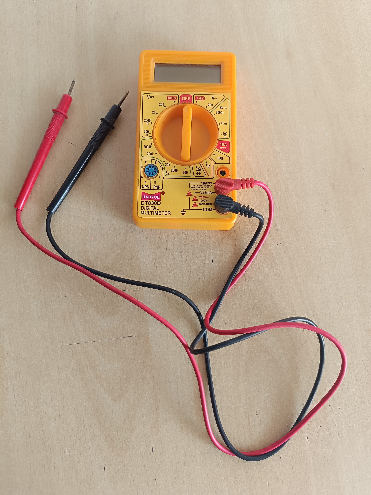
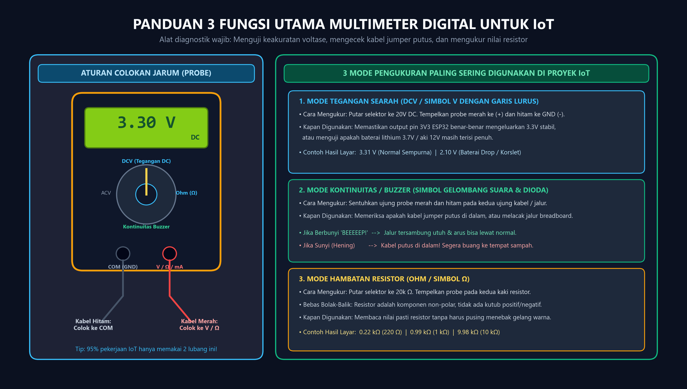
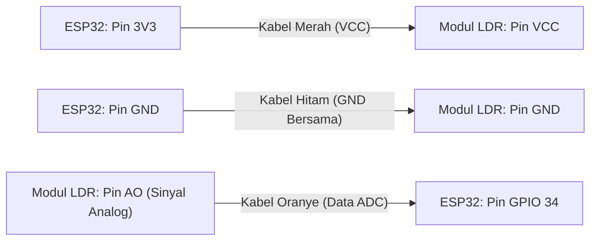

# Modul 0.3: Logika Sirkuit Dasar — Common Ground, Voltage Divider & Floating Pin

> **Tingkat Kesulitan:** Sangat ramah pemula (*Zero Prerequisite* — tidak membutuhkan latar belakang teknik elektro sebelumnya)  
> **Estimasi Waktu Belajar:** 20–25 menit (membaca panduan santai + mencoba eksperimen interaktif di browser)  
> **Kebutuhan Alat:** Belum wajib memiliki board fisik. Seluruh percobaan dapat dijalankan langsung di simulator browser (*zero install*).

---

## 🛠️ Peralatan yang Kita Butuhkan

Agar kamu tidak bingung harus menyiapkan aplikasi atau alat apa di komputermu, pada modul ini kita **hanya** memerlukan alat-alat berikut:

| Alat | Status | Fungsi & Keterangan |
| :--- | :---: | :--- |
| **Browser Web** (Google Chrome, Edge, atau Firefox) | **Wajib** | Untuk membuka simulator **Wokwi** dan menguji sirkuit sensor cahaya analog LDR secara interaktif tanpa perlu memasang aplikasi apa pun. |
| **Multimeter Digital (DMM)** | **Opsional / Belum Wajib** | Sangat bagus jika kamu sudah memilikinya di meja kerja untuk menguji kabel dan voltase fisik, namun kita akan membedah cara kerjanya secara visual terlebih dahulu. |
| **Komponen Fisik (ESP32, Sensor LDR, Resistor 10 kΩ, Modul Relay)** | **Belum Perlu** | Seluruh materi dan fenomena kelistrikan pada modul ini 100% disimulasikan secara akurat di simulator browser. |

> [!TIP]
> **Tautan Simulator untuk Modul Ini:** [Wokwi ESP32 Starter Project](https://wokwi.com/projects/new/esp32)  
> Kamu tidak perlu mendaftar akun atau login. Cukup buka tautan di atas dan kamu siap bereksperimen!

---

## 🌟 Tiga Misteri Terbesar Pemula Elektronika & IoT

Pernahkah kamu mengalami atau mendengar cerita seperti ini?
1. *"Saya menghubungkan sensor ke ESP32, tapi angka bacaannya bergerak melompat liar seperti ada hantu!"*
2. *"Saya membuat tombol tekan (push button), tapi saat tombol TIDAK ditekan, lampu kadang menyala dan mati sendiri!"*
3. *"Saya menyambungkan pompa air mini langsung ke pin ESP32, lalu chip ESP32 saya panas menyengat dan mati total!"*

Ketiga masalah di atas adalah **"jebakan klasik"** yang dialami oleh hampir semua pemula. Masalah tersebut bukan karena board ESP32 kamu rusak atau kodemu salah ketik, melainkan karena kamu belum mengenal **3 Logika Sirkuit Dasar**:
- **Prinsip Mutlak Common Ground (GND Bersama)**
- **Misteri Floating Pin & Resistor Pull-Up / Pull-Down**
- **Rangkaian Pembagi Tegangan (*Voltage Divider*)**
- **Pengendali Beban Daya Besar (*Transistor & Relay*)**

Di modul ini, kita akan membongkar tuntas rahasia di balik fenomena ini dengan analogi visual yang sangat mudah dipahami!

---

## 🧭 Apa yang Akan Kita Pelajari?

1. **Prinsip Mutlak Common Ground:** Mengapa semua kutub negatif (GND) wajib disatukan menjadi satu titik acuan bersama.
2. **Misteri Floating Pin:** Mengapa kaki pin mikrokontroler bisa bertindak seperti antena radio penyerap gangguan sinyal liar.
3. **Solusi Pull-Up & Pull-Down:** Cara mengunci status logika tombol dan memanfaatkan fitur bawaan `INPUT_PULLUP` pada ESP32.
4. **Rangkaian Pembagi Tegangan (*Voltage Divider*):** Jembatan pengubah perubahan hambatan fisik sensor menjadi sinyal tegangan yang bisa dibaca ADC.
5. **Pengendali Beban Daya Besar (Transistor & Relay):** Cara mengamankan chip ESP32 saat mengendalikan motor, pompa air, dan lampu rumah 220V PLN.
6. **Panduan 3 Mode Utama Multimeter Digital:** Cara menguji tegangan, mendeteksi kabel putus lewat bunyi *beep*, dan mengukur nilai resistor.
7. **Praktik Virtual Wokwi:** Merakit sirkuit pembaca intensitas cahaya LDR dan memantau datanya di Serial Monitor.
8. **Glosarium Istilah Penting & Kuis Refleksi:** Menguji pemahaman barumu secara mandiri.

---

## 1. Prinsip Mutlak Common Ground (GND Bersama)

Bayangkan kamu dan temanmu sedang berdiri di dua gedung terpisah. Kamu berdiri di balkon lantai 3 Gedung A, dan temanmu berdiri di balkon lantai 3 Gedung B.  
Jika kamu berteriak ke temanmu: *"Ketinggian saya sekarang tepat 10 meter!"*, temanmu akan bingung:  
*10 meter diukur dari lantai balkonmu, dari atap gedung, atau dari permukaan tanah bumi tempat kedua gedung itu berpijak?*

Tanpa **lantai dasar yang sama (titik acuan $0\text{ meter}$ bersama)**, perbandingan tinggi menjadi tidak bermakna sama sekali!

Hal yang persis sama berlaku pada tegangan listrik. Perhatikan diagram infografis perbandingan di bawah ini:



*Infografis prinsip Common Ground: Sisi kiri menunjukkan kekacauan data sensor ketika jalur GND terputus, sedangkan sisi kanan memperlihatkan stabilitas bacaan data ketika kedua perangkat berbagi titik acuan 0 Volt yang sama.*

### Mengapa Semua GND Wajib Dihubungkan Bersama?

1. **Tegangan Listrik adalah Nilai Relatif:**  
   Tegangan listrik bukanlah angka absolut, melainkan **perbedaan potensial muatan antara dua titik**.
2. **Titik Acuan ADC ESP32:**  
   Ketika ESP32 membaca sinyal dari sensor luar (misalnya mendeteksi sinyal $2,5\text{V}$), ESP32 mengukur voltase tersebut **terhadap pin GND miliknya sendiri ($0\text{V}$)**.
3. **Bahaya Jika GND Terpisah:**  
   Jika baterai sensor dan board ESP32 ditenagai oleh dua sumber daya terpisah dan kabel GND-nya tidak disatukan, tegangan acuan sensor akan melayang bebas di udara (*floating reference*). Akibatnya, chip ADC pada ESP32 membaca angka acak yang bergerak liar.

| Kondisi Sistem | Status Sambungan GND | Dampak pada Pembacaan Data |
| :--- | :--- | :--- |
| ❌ **Tanpa Common Ground** | Kabel GND sensor dan GND ESP32 terpisah/terputus. | **Data rusak & liar!** Nilai analog melompat-lompat tak menentu karena tidak ada acuan $0\text{V}$ bersama. |
| ✅ **Dengan Common Ground** | Seluruh pin GND disatukan dengan seutas kabel jumper. | **Data stabil & akurat!** ESP32 membaca perbedaan potensial sinyal secara presisi tanpa gangguan *noise*. |

> [!IMPORTANT]
> **Hukum Emas IoT #1 (Aturan Common Ground):**  
> **Semua modul sensor, baterai eksternal, adaptor catu daya, dan mikrokontroler WAJIB menyambungkan seluruh pin GND-nya menjadi satu titik acuan bersama (*Common Ground*)!**  
> *(Catatan: Hanya kutub negatif/GND yang disatukan, kabel positif VCC dari sumber daya yang berbeda voltasenya TIDAK BOLEH disatukan).*

---

## 2. Misteri "Floating Pin" & Resistor Pull-Up / Pull-Down

Pernahkah kamu mencoba menghubungkan tombol tekan (*push button*) langsung ke pin mikrokontroler dengan menghubungkan satu kaki ke $3,3\text{V}$ dan kaki lainnya ke pin GPIO?

Mari kita bedah apa yang terjadi di dalam silikon chip mikrokontroler:
- **Saat tombol DITEKAN:** Sirkuit terhubung langsung ke sumber listrik $3,3\text{V}$ $\rightarrow$ ESP32 membaca status pasti **`HIGH` (Logika 1)**.
- **Saat tombol DILEPAS:** Sirkuit terputus dan pin GPIO tidak terhubung ke mana-mana $\rightarrow$ **Pertanyaannya: Berapakah nilai yang dibaca ESP32?**

Banyak pemula menduga saat tombol dilepas, pin akan otomatis bernilai **`LOW` (Logika 0)**. **Dugaan ini salah!**

### Mengapa Pin Melayang (*Floating Pin*) Sangat Berbahaya?
Kaki tembaga pin GPIO yang tidak terhubung ke tegangan mana pun berada dalam status **mengambang (*Floating*)**.  
Kaki pin tersebut bertindak persis seperti **antena radio mini** yang menangkap gelombang elektromagnetik liar di sekitarmu (sinyal pemancar Wi-Fi, sinyal seluler ponsel, dengung listrik dinding 50Hz, hingga muatan statis dari jari tanganmu yang mendekat).

Akibatnya, chip ESP32 akan membaca nilai `0`, `1`, `0`, `0`, `1`, `1` secara liar dan lampu indikator akan berkedip-kedip sendiri tanpa pernah ada yang menekan tombol!

Perhatikan diagram solusi penstabil status pin di bawah ini:



*Infografis logika penstabil pin input: Panel 1 memperlihatkan kondisi floating pin yang liar, Panel 2 menyajikan rangkaian Pull-Down eksternal, dan Panel 3 memperlihatkan standar industri Pull-Up beserta fitur internal INPUT_PULLUP bawaan ESP32.*

### Membandingkan Rangkaian Pull-Down vs Pull-Up:

| Parameter Logika | Rangkaian Pull-Down | Rangkaian Pull-Up (Standar Industri) |
| :--- | :--- | :--- |
| **Posisi Resistor $10\text{ k}\Omega$** | Dipasang antara Pin GPIO ke **GND ($0\text{V}$)** | Dipasang antara Pin GPIO ke **$3,3\text{V}$ (VCC)** |
| **Posisi Tombol Tekan** | Dipasang antara Pin GPIO ke **$3,3\text{V}$ (VCC)** | Dipasang antara Pin GPIO ke **GND ($0\text{V}$)** |
| **Status Saat Tombol DILEPAS** | **`LOW` (0)** — Pin ditarik ke GND oleh resistor | **`HIGH` (1)** — Pin ditarik ke 3.3V oleh resistor |
| **Status Saat Tombol DITEKAN** | **`HIGH` (1)** — Arus $3,3\text{V}$ masuk ke pin | **`LOW` (0)** — Pin dialirkan langsung ke GND |
| **Kebutuhan Komponen Fisik** | Wajib memasang resistor fisik $10\text{ k}\Omega$ di luar | **Bisa tanpa resistor luar sama sekali!** |

> [!TIP]
> **Kabar Gembira: ESP32 Punya Resistor Pull-Up Internal Bawaan!**  
> Di dunia industri IoT modern, hampir tidak ada insinyur yang repot-repot menancapkan resistor fisik tambahan di breadboard hanya untuk sebuah tombol.  
> Chip ESP32 sudah memiliki resistor *pull-up* terintegrasi di dalam silikonnya. Kamu cukup mengaktifkannya dengan sebaris perintah di fungsi `setup()`:  
> ```cpp
> pinMode(4, INPUT_PULLUP);
> ```
> Dengan sebaris kode ini, pin 4 akan otomatis terkunci stabil pada status `HIGH` saat tombol dilepas, dan berubah menjadi `LOW` saat tombol ditekan ke GND. Sangat praktis, hemat tempat, dan anti-ribet!

---

## 3. Rangkaian Pembagi Tegangan (*Voltage Divider*)

Banyak sensor analog di dunia fisik (seperti sensor cahaya **LDR**, sensor suhu **Thermistor NTC**, dan sensor tekanan gaya) bekerja dengan cara **mengubah nilai hambatannya ($R$) sesuai kondisi lingkungan**.

Mari kita lihat wujud fisik sensor cahaya LDR (*Light Dependent Resistor*) asli di bawah ini:



*Foto fisik sensor LDR: Permukaan keramik dengan jalur meliuk kadmium sulfida yang mengubah nilai resistansinya ketika terkena foton cahaya. Sumber: Nevit Dilmen, Wikimedia Commons, Lisensi CC BY-SA 3.0.*

- **Saat LDR Terkena Sinar Terang:** Elektron melompat bebas, nilai hambatannya mengecil drastis ($\approx 500\,\Omega$).
- **Saat LDR Ditutup Gelap Gulita:** Elektron terkunci, nilai hambatannya melonjak sangat tinggi ($\approx 100.000\,\Omega = 100\text{ k}\Omega$).

### Masalah Besar Mikrokontroler:
Pin analog mikrokontroler (*ADC / Analog-to-Digital Converter*) **hanya bisa mengukur TEGANGAN ($0\text{V} - 3,3\text{V}$)**. Pin ADC **SAMA SEKALI TIDAK BISA membaca hambatan (Ohm) secara langsung!**

Bagaimana cara kita mengubah perubahan hambatan ($R$) menjadi perubahan voltase ($V$) yang bisa dipahami oleh ESP32?  
Jawabannya adalah dengan merangkai **Pembagi Tegangan (*Voltage Divider*)**!



*Infografis cara kerja Voltage Divider: Dua resistor dirangkai seri untuk membagi tegangan 3.3V secara proporsional. Pin ADC mengambil tegangan titik tengah (Vout) yang nilainya berubah seiring perubahan hambatan sensor.*

### Rumus Matematis Pembagi Tegangan:

$$V_{\text{out}} = V_{\text{in}} \times \frac{R_2}{R_1 + R_2}$$

Keterangan:
- $V_{\text{in}}$ = Tegangan sumber daya listrik utama ($3,3\text{ Volt}$).
- $R_1$ = Hambatan sensor LDR (nilainya dinamis berubah sesuai cahaya).
- $R_2$ = Hambatan resistor pembanding tetap ($10\text{ k}\Omega = 10.000\,\Omega$).
- $V_{\text{out}}$ = Tegangan titik tengah yang disalurkan ke pin ADC ESP32.

### Pembuktian Hitungan Nyata:

1. **Saat Kondisi Terang Benderang:**  
   Hambatan LDR mengecil menjadi $R_1 \approx 500\,\Omega$.  
   $$V_{\text{out}} = 3,3 \times \frac{10.000}{500 + 10.000} = 3,3 \times 0,952 \approx 3,14\text{ Volt}$$  
   *Hasil pada ESP32:* Pin ADC membaca angka tinggi mendekati nilai maksimal ($\approx 3900$ dari rentang 12-bit $0 - 4095$).

2. **Saat Kondisi Gelap Gulita:**  
   Hambatan LDR melonjak menjadi $R_1 \approx 100.000\,\Omega$ ($100\text{ k}\Omega$).  
   $$V_{\text{out}} = 3,3 \times \frac{10.000}{100.000 + 10.000} = 3,3 \times 0,091 \approx 0,30\text{ Volt}$$  
   *Hasil pada ESP32:* Pin ADC membaca angka rendah mendekati nol ($\approx 370$ dari rentang $0 - 4095$).

Dengan menggunakan satu buah resistor tetap $10\text{ k}\Omega$, kita berhasil mengubah perubahan gelap-terang ruangan menjadi angka numerik yang bisa diproses oleh kode C++!

---

## 4. Transistor & Relay: Pengendali Beban Daya Besar

Pin GPIO pada board ESP32 dirancang khusus untuk memproses **sinyal data logika**, bukan untuk menyuplai tenaga listrik alat berat!

- **Batas Kemampuan Fisik Pin ESP32:** Tegangan maksimal $3,3\text{V}$ dan arus maksimal **$12\text{ mA}$** ($0,012\text{ Ampere}$).
- **Kebutuhan Beban Riil di Lapangan:** Pompa air mini $12\text{V}$ membutuhkan arus sekitar $500\text{ mA} - 1500\text{ mA}$, sedangkan lampu ruangan membutuhkan listrik AC $220\text{V}$ PLN.

Jika kamu nekat menancapkan kabel motor DC atau pompa air langsung ke pin GPIO ESP32:
Arus listrik yang disedot beban akan melampaui kapasitas kawat silikon mikroskopis di dalam chip. **Hasilnya: Chip ESP32 akan mengalami panas ekstrem (*overheat*), mengeluarkan asap, dan terbakar rusak permanen!**

Perhatikan diagram solusi sakelar perantara di bawah ini:



*Infografis kendali beban arus besar: Sisi kiri menunjukkan bahaya chip terbakar bila beban besar dicolok langsung ke GPIO, sedangkan sisi kanan menyajikan arsitektur sakelar isolasi menggunakan Transistor BJT/MOSFET dan Modul Relay.*

Mari kita lihat modul relay fisik yang paling sering digunakan pada proyek IoT rumah pintar (*Smart Home*):



*Foto fisik modul relay 5V 1-channel: Kotak biru adalah sakelar mekanik Songle, chip hitam kecil di sampingnya adalah Optocoupler pengisolasi cahaya, dan terminal sekrup di sisi kanan untuk menyambungkan kabel listrik PLN. Sumber: Suyash Dwivedi, Wikimedia Commons, Lisensi CC BY-SA 4.0.*

### Dua Solusi Sakelar Pengendali Beban:

| Tipe Sakelar | Jenis Beban yang Dikendalikan | Cara Kerja & Keunggulan |
| :--- | :--- | :--- |
| **Transistor BJT / MOSFET** | Beban Arus Searah (**DC**: Kipas 12V, Motor DC, LED Strip) | **Sakelar Solid-State Elektronik:** Bekerja sangat cepat tanpa bagian bergerak mekanis, tidak berisik, dan mendukung modulasi kecepatan putaran (*PWM*). |
| **Modul Relay (dengan Optocoupler)** | Beban Arus Bolak-Balik (**AC 220V PLN**: Lampu rumah, Pompa air sumur) | **Sakelar Elektromekanik Berisolasi Optik:** Menggunakan berkas cahaya LED inframerah internal untuk memicu sakelar mekanik. **100% aman** karena sirkuit $220\text{V}$ PLN terpisah total dan tidak bisa melompat ke ESP32! |

---

## 5. Panduan 3 Mode Utama Multimeter Digital

Multimeter Digital (*Digital Multimeter / DMM*) adalah alat ukur diagnostik yang bertindak layaknya "kacamata rontgen" bagi seorang teknisi IoT.

Mari kita lihat penampakan multimeter digital fisik yang siap pakai di meja kerja:



*Foto fisik multimeter digital: Menampilkan layar pembacaan LCD digital di atas, tombol pemutar selektor mode di tengah, dan soket colokan probe uji di bawah. Sumber: K.Venkataramana, Wikimedia Commons, Lisensi Domain Publik CC0 1.0.*

Perhatikan diagram panduan cepat penggunaan multimeter di bawah ini:



*Infografis panduan multimeter: Sisi kiri memperlihatkan posisi standar jarum probe (Hitam di COM, Merah di V/Ω), dan sisi kanan menguraikan 3 mode wajib (Tegangan DC, Kontinuitas Beep, dan Hambatan Ohm).*

### 3 Mode Pengukuran yang Wajib Kamu Kuasai:

1. **Mode Tegangan Searah (DCV / Simbol $\overline{\text{V}}$):**
   - **Cara Setting:** Putar sakelar pemutar ke skala **`20V DC`** (atau mode Auto).
   - **Cara Mengukur:** Tempelkan probe merah ke kutub $(+)$ dan probe hitam ke GND $(-)$.
   - **Kapan Digunakan:** Memastikan pin 3V3 benar-benar mengeluarkan tegangan $3,3\text{V}$ stabil, atau menguji apakah baterai lithium $3,7\text{V}$ masih memiliki daya.

2. **Mode Kontinuitas / Buzzer (Simbol Gelombang Suara •)))) & Dioda):**
   - **Cara Setting:** Putar sakelar ke simbol bel/gelombang suara.
   - **Cara Mengukur:** Sentuhkan ujung probe merah dan hitam pada kedua ujung kabel jumper atau dua lubang jalur breadboard.
   - **Hasil Ukur:**
     - 🔊 **Berbunyi "BEEEEEP!":** Kabel utuh sempurna dan arus listrik bisa mengalir lancar.
     - 🔇 **Hening (Sunyi):** Kabel putus di dalam isolator plastiknya! Segera buang kabel tersebut ke tempat sampah agar tidak membuatmu bingung saat merakit proyek.

3. **Mode Hambatan (Ohm / Simbol $\Omega$):**
   - **Cara Setting:** Putar sakelar ke skala **`20k $\Omega$`**.
   - **Cara Mengukur:** Tempelkan probe ke kedua kaki resistor (bebas bolak-balik karena resistor adalah komponen non-polar).
   - **Kapan Digunakan:** Mengukur nilai pasti hambatan resistor tanpa perlu pusing mengingat tabel kode gelang warna.

---

## 6. Praktik Virtual Wokwi: Membaca Sensor Cahaya LDR

Sekarang, mari kita buktikan seluruh teori pembagi tegangan dan pembacaan sensor analog ini secara langsung di simulator browser!

---

### Langkah 1 — Membuka Lembar Kerja di Browser
1. Buka tautan lembar kerja baru di browsermu: **[https://wokwi.com/projects/new/esp32](https://wokwi.com/projects/new/esp32)**
2. Pastikan panel kiri menampilkan tab **`sketch.ino`** dan panel kanan menampilkan board ESP32.

---

### Langkah 2 — Memasukkan Kode Program C++
Klik panel kiri tab **`sketch.ino`**, hapus seluruh teks yang ada (`Ctrl + A` lalu `Delete`), kemudian tempelkan (*paste*) kode program berikut:

```cpp
// Definisikan pin analog input ADC yang kita gunakan
const int ldrPin = 34; // GPIO 34 adalah pin ADC1 (aman dan akurat pada ESP32)

void setup() {
  // Buka saluran komunikasi serial ke laptop dengan kecepatan 115200 baud
  Serial.begin(115200);
  Serial.println("=========================================");
  Serial.println("Sistem Pembaca Sensor Cahaya LDR Aktif!");
  Serial.println("=========================================");
}

void loop() {
  // 1. Baca nilai tegangan analog dari sensor (rentang 12-bit: 0 hingga 4095)
  int nilaiSensor = analogRead(ldrPin);
  
  // 2. Hitung perkiraan voltase nyata di pin (0.0V - 3.3V)
  float voltase = (nilaiSensor / 4095.0) * 3.3;
  
  // 3. Tampilkan data ke Serial Monitor
  Serial.print("Nilai ADC (0-4095): ");
  Serial.print(nilaiSensor);
  Serial.print("  |  Perkiraan Voltase: ");
  Serial.print(voltase, 2);
  Serial.print(" V  |  Status: ");
  
  if (nilaiSensor > 2500) {
    Serial.println("TERANG BENDERANG ☀️");
  } else if (nilaiSensor > 1000) {
    Serial.println("REDUP / NORMAL ⛅");
  } else {
    Serial.println("GELAP GULITA 🌙");
  }
  
  // Beri jeda 500 milidetik agar layar monitor tidak bergulir terlalu cepat
  delay(500);
}
```

---

### Langkah 3 — Menambahkan Sensor Cahaya ke Kanvas
1. Di panel sebelah kanan (di atas board ESP32), klik tombol biru bertanda **+** (*Add a new part*).
2. Ketik `photoresistor`, lalu klik **Photoresistor Sensor (LDR Module)**.
3. Papan modul sensor kecil berwarna hijau dengan komponen LDR di atasnya akan muncul di kanvas.

---

### Langkah 4 — Menghubungkan Kabel Sirkuit

Tarik kabel jumper dengan mengklik pin asal lalu mengklik pin tujuan:
1. **Kabel Merah (VCC):** Hubungkan pin **VCC** modul sensor ke pin **3V3** pada board ESP32.
2. **Kabel Hitam (GND):** Hubungkan pin **GND** modul sensor ke pin **GND** pada board ESP32 *(Common Ground!)*.
3. **Kabel Oranye (Sinyal AO):** Hubungkan pin **AO** (*Analog Output*) modul sensor ke pin **GPIO 34** (pin `34`) pada board ESP32.



<details>
<summary>💡 Ingin Cara Instan Tanpa Menarik Kabel Satu per Satu? (Klik di Sini untuk diagram.json)</summary>

Jika kamu ingin langsung merapikan posisi komponen dan kabel secara otomatis:
1. Klik tab **`diagram.json`** di sebelah tab `sketch.ino`.
2. Ganti seluruh isinya dengan kode JSON berikut:

```json
{
  "version": 1,
  "author": "Fullstack IoT 2026",
  "editor": "wokwi",
  "parts": [
    { "type": "board-esp32-devkit-c-v4", "id": "esp", "top": 0, "left": 0, "attrs": {} },
    { "type": "wokwi-photoresistor-sensor", "id": "ldr", "top": -30, "left": 180, "attrs": {} }
  ],
  "connections": [
    [ "esp:3V3", "ldr:VCC", "red", [ "v20", "h40" ] ],
    [ "esp:GND.1", "ldr:GND", "black", [ "v30", "h60" ] ],
    [ "esp:34", "ldr:AO", "orange", [ "v-20", "h50" ] ]
  ]
}
```
3. Kembali ke tab `sketch.ino`, dan rangkaian akan langsung terpasang rapi!

</details>

---

### Langkah 5 — Menjalankan Simulasi & Menguji Cahaya
1. Klik tombol hijau **Play ▶** (*Start the simulation*) di pojok kanan atas kanvas diagram.
2. Perhatikan jendela **Serial Monitor** di bagian bawah layar: Nilai pembacaan sensor akan mulai dicetak secara kontinu.
3. **Uji Perubahan Cahaya:** Klik pada modul sensor LDR virtual di layar. Sebuah jendela slider pengatur intensitas matahari (*Lux*) akan muncul.
4. Geser penggeser matahari dari kiri (Gelap) ke kanan (Terang):
   - **Saat Gelap:** Angka ADC turun ke kisaran ratusan dan status menampilkan `GELAP GULITA 🌙`.
   - **Saat Terang:** Angka ADC melonjak melampaui $3000$ dan status menampilkan `TERANG BENDERANG ☀️`! 🎉

---

### 🚨 Kotak Bantuan: "Bagaimana Jika Angka Sensor Tidak Bergerak?"

> [!WARNING]
> **Langkah Pemeriksaan Mandiri:**
> 1. **Periksa Pin Sinyal:** Pastikan kabel oranye dicolokkan ke pin **AO** (*Analog Output*), bukan pin **DO** (*Digital Output*). Pin DO hanya mengeluarkan nilai 0 atau 1 untuk sakelar digital, sedangkan pin AO mengeluarkan voltase analog kontinu.
> 2. **Periksa Pin ADC:** Pastikan kabel oranye tertancap di pin **GPIO 34**, bukan pin GPIO lain yang bukan pin analog (ADC).
> 3. **Periksa Common Ground:** Pastikan kabel hitam GND terhubung erat antara sensor dan ESP32.

---

## 7. 📖 Glosarium Istilah Penting Modul 0.3

| Istilah Teknis | Penjelasan Sederhana |
| :--- | :--- |
| **Common Ground** | Menghubungkan seluruh jalur negatif (GND) dari semua modul listrik menjadi satu agar memiliki titik acuan 0 Volt yang seragam. |
| **Floating Pin** | Kondisi pin input mikrokontroler yang mengambang tanpa sambungan tegangan pasti, sehingga menyerap gangguan elektromagnetik di udara seperti antena. |
| **Pull-Up Resistor** | Resistor yang bertugas menarik tegangan pin ke status `HIGH` ($3,3\text{V}$) secara *default* saat tombol dilepas. |
| **Pull-Down Resistor** | Resistor yang bertugas menarik tegangan pin ke status `LOW` ($0\text{V}$ / GND) secara *default* saat tombol dilepas. |
| **Voltage Divider** | Rangkaian dua resistor seri yang membagi tegangan sumber menjadi tegangan keluaran yang lebih kecil secara proporsional. |
| **ADC (Analog-to-Digital Converter)** | Fitur silikon mikrokontroler yang mengubah sinyal voltase fisik ($0\text{V} - 3,3\text{V}$) menjadi angka integer digital ($0 - 4095$). |
| **Optocoupler** | Komponen sakelar isolasi yang menggunakan berkas cahaya inframerah internal untuk memisahkan tegangan rendah mikrokontroler dari tegangan tinggi $220\text{V}$ PLN. |
| **Kontinuitas (Buzzer DMM)** | Fitur pengujian pada multimeter digital yang membunyikan nada "beep" nyaring jika suatu kabel atau jalur tembaga terhubung utuh tanpa putus. |

---

## 📝 Kuis Refleksi & Uji Pemahaman Mandiri

Uji pemahaman barumu dengan menjawab 4 pertanyaan singkat berikut di benakmu, lalu cocokkan dengan kunci jawaban di bawah:

1. Jika kamu menggunakan adaptor $12\text{V}$ eksternal untuk memberi tenaga pada sensor luar dan kabel data sensor dihubungkan ke ESP32, kabel apakah yang mutlak wajib kamu sambungkan antara adaptor/sensor ke ESP32?
2. Mengapa ketika tombol tekan dilepas tanpa resistor pull-up/pull-down, lampu indikator ESP32 bisa berkedip-kedip liar sendiri?
3. Sebutkan keunggulan utama menggunakan fitur `INPUT_PULLUP` bawaan ESP32 dibandingkan merangkai resistor pull-down fisik di breadboard!
4. Mengapa kita tidak boleh menghubungkan motor pompa air langsung ke pin GPIO ESP32 tanpa perantara transistor atau modul relay?

<details>
<summary>🔍 Klik di Sini untuk Membuka Kunci Jawaban</summary>

1. **Kabel Ground (GND)**: Kutub negatif dari catu daya sensor dan pin GND ESP32 wajib disatukan (*Common Ground*) agar ESP32 memiliki titik acuan $0\text{V}$ yang sama untuk mengukur sinyal sensor.
2. Karena pin berada dalam kondisi **Floating (Mengambang)** dan bertindak seperti antena radio mini yang menangkap gelombang elektromagnetik dan muatan statis liar di udara.
3. **Lebih praktis, hemat ruang, dan hemat biaya**, karena kita tidak perlu memasang resistor fisik $10\text{ k}\Omega$ tambahan di luar breadboard. Cukup aktifkan resistor internal chip lewat sebaris kode C++.
4. Karena pin GPIO ESP32 hanya mampu mengeluarkan arus maksimal **$12\text{ mA}$**, sedangkan motor pompa menyedot arus ratusan hingga ribuan miliampere. Arus berlebih tersebut akan membakar kawat mikroskopis di dalam chip silikon ESP32 (*overheat* dan rusak permanen).

</details>

---

## 📚 Sumber Gambar & Atribusi Lisensi

Seluruh materi visual dalam modul ini disajikan dengan mematuhi etika atribusi dan lisensi terbuka internasional:

| Nama Berkas Gambar | Sumber Gambar & Hak Cipta | Jenis Lisensi |
| :--- | :--- | :--- |
| `aset/foto-sensor-ldr.jpg` | [Nevit Dilmen, Wikimedia Commons](https://commons.wikimedia.org/wiki/File:LDR_1480405_6_7_HDR_Enhancer_1.jpg) | [Creative Commons Attribution-ShareAlike 3.0 Unported (CC BY-SA 3.0)](https://creativecommons.org/licenses/by-sa/3.0/) |
| `aset/foto-modul-relay.jpg` | [Suyash Dwivedi, Wikimedia Commons](https://commons.wikimedia.org/wiki/File:SRD-05VDC-SL-C_5V_one-channel_relay_module.jpg) | [Creative Commons Attribution-ShareAlike 4.0 International (CC BY-SA 4.0)](https://creativecommons.org/licenses/by-sa/4.0/) |
| `aset/foto-multimeter-digital.jpg` | [K.Venkataramana, Wikimedia Commons](https://commons.wikimedia.org/wiki/File:Digital_Multimeter_(To_measure_Voltage,_Current_and_Resistance).jpg) | [Creative Commons CC0 1.0 Universal (Public Domain)](https://creativecommons.org/publicdomain/zero/1.0/deed.id) |
| `aset/diagram-common-ground.png`, `aset/diagram-pullup-pulldown.png`, `aset/diagram-voltage-divider.png`, `aset/diagram-transistor-relay.png`, `aset/diagram-multimeter-digital.png` | Ilustrasi vektor kurikulum Fullstack IoT Developer | Hak cipta terbuka untuk materi kurikulum edukasi ini |

---

## 🎯 Status Selesai & Langkah Berikutnya

Jika kamu sudah memahami logika pembagi tegangan di atas dan berhasil melihat perubahan angka sensor LDR di simulator Wokwi, selamat! Kamu telah menguasai seluruh logika sirkuit terpenting di dunia IoT dan resmi menuntaskan **Modul 0.3**.

Tandai pemahamanmu pada checklist berikut:
- [x] Memahami prinsip mutlak *Common Ground* (menyatukan seluruh GND agar berbagi acuan $0\text{V}$)
- [x] Mengidentifikasi fenomena *Floating Pin* dan bahaya interferensi elektromagnetik
- [x] Menguasai rangkaian *Pull-Down* dan *Pull-Up* serta fitur bawaan `INPUT_PULLUP` pada ESP32
- [x] Memahami cara kerja rangkaian pembagi tegangan (*Voltage Divider*) untuk membaca sensor analog
- [x] Mengetahui batas arus pin GPIO ($12\text{ mA}$) dan fungsi isolasi daya Transistor & Modul Relay
- [x] Memahami 3 mode utama Multimeter Digital (DCV, Kontinuitas Buzzer, dan Hambatan Ohm)
- [x] Berhasil merangkai sirkuit sensor LDR dan mengamati perubahan nilai ADC di Wokwi

Langkah berikutnya, mari kita melangkah ke jantung pemrograman perangkat keras IoT — belajar bahasa C/C++ modern khusus mikrokontroler dari nol:  
👉 **[Modul 0.4: Pemrograman C/C++ Modern untuk Embedded System](04-pemrograman-cpp-embedded-dari-nol.md)**

Pantau seluruh perkembangan belajarmu di pelacak progres terpadu: **[TODO.md](../TODO.md)**.
