# 🎓 Silabus — Fullstack IoT Developer: Zero to Expert

> **Kurikulum 32 modul — satu modul = satu minggu belajar santai (±8 bulan) — untuk orang awam total hingga mampu membangun sistem IoT lengkap dari sensor sampai dashboard di HP.**
> Hardware: **ESP32 + Raspberry Pi** · Software: **JavaScript/TypeScript (Node.js + React) untuk server & tampilan, sedikit C++ untuk chip** · Bahasa pengantar: **Indonesia, ramah awam**.
>
> Status dokumen: **v1.0.5 — disetujui, penulisan materi berjalan; Modul 1–4 (seluruh Fase 0) tersedia** (10 Oktober 2026). Keputusan yang mendasarinya ada di [§11](#11-keputusan-yang-sudah-disetujui); riwayat perubahan di [§13](#13-riwayat-revisi).

---

## Daftar Isi

1. [Untuk siapa kurikulum ini & apa hasil akhirnya](#1-untuk-siapa-kurikulum-ini--apa-hasil-akhirnya)
2. [Gambaran besar: apa yang akan kita bangun](#2-gambaran-besar-apa-yang-akan-kita-bangun)
3. [Pilihan teknologi & alasannya](#3-pilihan-teknologi--alasannya)
4. [Cara belajar di kurikulum ini](#4-cara-belajar-di-kurikulum-ini)
5. [Prasyarat, peralatan, & perkiraan biaya](#5-prasyarat-peralatan--perkiraan-biaya)
6. [Peta kurikulum (ringkasan 6 fase)](#6-peta-kurikulum-ringkasan-6-fase)
7. [Rincian 32 modul](#7-rincian-32-modul)
8. [Evaluasi & tanda kelulusan tiap fase](#8-evaluasi--tanda-kelulusan-tiap-fase)
9. [Struktur folder repositori](#9-struktur-folder-repositori)
10. [Setelah "expert": peta jalan lanjutan](#10-setelah-expert-peta-jalan-lanjutan)
11. [Keputusan yang sudah disetujui](#11-keputusan-yang-sudah-disetujui)
12. [Glosarium mini: istilah yang muncul di silabus ini](#12-glosarium-mini-istilah-yang-muncul-di-silabus-ini)
13. [Riwayat revisi](#13-riwayat-revisi)
14. [Lampiran A — Kontrak data "Rumah Pintar Mini"](#14-lampiran-a--kontrak-data-rumah-pintar-mini)

> 💡 **Kalau Anda pemula total:** bacalah §1, §2, §4, dan §5 dulu. §7 (rincian modul) memang berisi banyak nama alat yang belum Anda kenal — itu wajar; setiap nama akan dijelaskan di modulnya masing-masing, dan [§12 Glosarium](#12-glosarium-mini-istilah-yang-muncul-di-silabus-ini) menerjemahkan istilah yang paling sering muncul. Lampiran A adalah "bahasa bersama" yang dipakai semua modul — Anda akan memahaminya setelah Modul 11.

---

## 1. Untuk siapa kurikulum ini & apa hasil akhirnya

**Kurikulum ini ditulis untuk orang yang belum pernah menyentuh kabel, breadboard, atau menulis satu baris kode pun.** Kalau Anda bisa memakai laptop, menginstal aplikasi, dan punya rasa penasaran, itu sudah cukup sebagai modal awal. Tidak ada prasyarat matematika di luar perkalian dan pembagian.

Istilah *Fullstack IoT Developer* sendiri artinya sederhana: orang yang bisa membuat **seluruh rantai** sebuah produk IoT — dari **perangkat fisik** yang membaca sensor, **jaringan** yang mengirim datanya, **server** yang menyimpan dan mengolahnya, sampai **tampilan** yang dilihat pengguna di HP atau laptop. Kebanyakan kursus hanya mengajarkan satu potong rantai itu. Kurikulum ini mengajarkan semuanya, berurutan, dengan satu proyek yang tumbuh dari modul ke modul.

**Anda akan belajar dua bahasa pemrograman, dan ini disengaja:** sedikit **C++** untuk memprogram chip ESP32 (karena JavaScript tidak praktis untuk chip sekecil itu), dan **JavaScript** untuk semua sisanya — server, database, dashboard. Mulai Fase 3, JavaScript-nya diberi "sabuk pengaman" bernama **TypeScript** (versi ringan, bertahap) karena itulah yang diminta hampir semua lowongan kerja 2026. Modul 3 dan 4 memastikan Anda nyaman dengan dua bahasa itu sebelum dipakai sungguhan.

### Setelah menyelesaikan 32 modul, Anda akan mampu:

1. **Merangkai sensor dan alat kendali** (lampu LED, kipas kecil, pompa mini, motor servo) ke ESP32 dengan aman, tanpa takut korsleting atau merusak barang.
2. **Menulis program untuk chip** (istilahnya: *firmware*) yang rapi dan tangguh: membaca banyak sensor sekaligus, tetap bekerja saat internet putus, tidak macet berhari-hari, dan bisa diperbarui dari jarak jauh tanpa kabel (istilahnya: *OTA*).
3. **Menghubungkan perangkat ke jaringan** lewat WiFi dan membuatnya "berbicara" dengan bahasa standar industri IoT (istilahnya: *MQTT* dan *HTTP*), termasuk membaca sensor industri lewat kabel **RS-485/Modbus** yang lazim di pertanian dan pabrik.
4. **Menyiapkan Raspberry Pi** — komputer mungil seukuran kartu kredit — sebagai "kantor pos" lokal yang menampung data dan meneruskannya ke pusat saat internet tersedia.
5. **Membangun server** (istilahnya: *backend*) dengan Node.js + TypeScript yang menerima data, menjalankan aturan otomatis ("jika suhu > 30 °C, nyalakan kipas"), dan mengirim peringatan ke Telegram Anda — dengan dokumentasi API yang bisa dibaca orang lain.
6. **Menyimpan riwayat data** bertahun-tahun di database (PostgreSQL + TimescaleDB) dan menjawab pertanyaan seperti "berapa rata-rata suhu per jam minggu lalu?".
7. **Membuat dashboard web** yang angkanya bergerak sendiri (istilahnya: *realtime*), bisa dibuka di HP, punya grafik, tombol kendali, dan halaman login.
8. **Memasang semuanya ke internet** supaya bisa dibuka dari mana saja, 24 jam, dengan alamat sendiri dan gembok hijau di browser (istilahnya: *deploy*, *domain*, *HTTPS*) — di server sewaan (*VPS*) dengan Raspberry Pi sebagai gateway di rumah, atau jalur gratis sepenuhnya di Pi.
9. **Menjaga sistem tetap hidup dan aman**: Anda diberi tahu lebih dulu saat ada yang rusak (*monitoring*), data tidak pernah hilang (*backup*), perubahan kode diuji dan dipasang otomatis (*CI/CD*), dan orang iseng tidak bisa masuk (*autentikasi*, kunci per perangkat).
10. **Bekerja seperti engineer sungguhan**: Git dengan *branch* & *pull request*, kode yang diuji, dokumentasi, dan satu **proyek akhir** (*capstone*) layak portofolio yang bisa Anda tunjukkan ke pemberi kerja atau klien.

Semua istilah dalam kurung di atas **diajarkan dari nol** di modulnya; Anda tidak diharapkan memahaminya sekarang.

### Yang sengaja *tidak* dicakup (agar pemula tidak kewalahan)

Desain PCB profesional, protokol otomotif/pabrik lanjutan (CAN bus, OPC-UA), TinyML/Edge AI mendalam, Matter/Thread, LoRaWAN & seluler secara praktik, aplikasi HP *native* (Android/iOS), dan regulasi/sertifikasi produk. Semua itu disinggung sebagai **wawasan** di modul terkait dan dirangkum menjadi peta jalan di [§10](#10-setelah-expert-peta-jalan-lanjutan). Prinsipnya: lebih baik benar-benar menguasai satu rantai lengkap daripada mengenal 30 teknologi setengah-setengah.

---

## 2. Gambaran besar: apa yang akan kita bangun

Sepanjang kurikulum, kita membangun **satu proyek benang merah bernama "Rumah Pintar Mini"**: sistem yang memantau rumah dan satu "kebun" kecil, lalu mengendalikan **lampu LED, kipas kecil, pompa mini, dan tirai (servo) — semuanya bertegangan rendah (5 V dari adaptor USB)**. Mula-mula lewat tombol fisik, lalu lewat WiFi, lalu lewat dashboard di HP, dan akhirnya otomatis berdasarkan aturan. Proyek ini sengaja dipilih karena komponennya murah, hasilnya terlihat langsung, dan polanya sama persis dengan sistem IoT komersial (*smart farming*, pemantauan gudang, *smart building*).

> ⚠️ **Tentang listrik rumah 220 V:** kurikulum ini **tidak pernah** menyambungkan apa pun ke listrik PLN 220 V. Semua yang kita kendalikan bertegangan rendah (3,3 V / 5 V) yang aman disentuh. Cara kerja relay untuk 220 V dibahas sebagai pengetahuan dan peringatan, bukan praktik.


*Diagram arsitektur yang akan dibangun. Setiap kotak berwarna adalah satu fase kurikulum. (Gambar dibuat khusus untuk kurikulum ini, lisensi CC BY 4.0 — sumber SVG ada di `aset/arsitektur-fullstack-iot.svg`.)*

Begini cara membaca diagramnya dengan analogi sehari-hari:

| Lapisan | Analogi | Yang terjadi |
| :--- | :--- | :--- |
| **1. Perangkat (ESP32)** | Indra & tangan | Sensor "merasakan" suhu, ESP32 "memutuskan" lalu "menggerakkan" relay. Kalau pusat tidak terjangkau, ESP32 tetap menjalankan aturan pengaman terakhir yang ia ingat. |
| **2. Gateway (Raspberry Pi)** | Kantor pos lokal | Semua surat (data) dari perangkat di rumah dikumpulkan di sini dulu, baru dikirim ke pusat. Kalau jalan ke pusat putus, surat ditahan, bukan dibuang. |
| **3. Backend & Data** | Kantor pusat & gudang arsip | Menyimpan semua riwayat, menjawab pertanyaan, menjalankan aturan otomatis, dan mengirim perintah balik. |
| **4. Dashboard** | Layar di meja Anda | Tempat manusia melihat angka, grafik, dan menekan tombol. |
| **5. Operasi** | Satpam, teknisi, & tukang servis | Memastikan semuanya tetap hidup, aman, bisa diperbarui, dan tidak kehilangan data. |

### 2.1 Dua perangkat, dua peran (ditetapkan sejak awal agar tidak berubah-ubah)

| | **Node 1 — "Rumah"** | **Node 2 — "Kebun"** |
| :--- | :--- | :--- |
| Dibangun di | Modul 5–11 | Modul 14 |
| Catu daya | **Selalu hidup** dari adaptor 5 V (bukan baterai) — karena harus menerima perintah kapan saja, menyalakan relay, dan menampilkan layar | **Baterai 18650**, bangun tiap beberapa menit lalu tidur lagi (*deep sleep*) |
| Komunikasi | WiFi → MQTT ke gateway | ESP-NOW (radio langsung ESP32 ↔ ESP32, tanpa router) → diteruskan Node 1 ke MQTT |
| Sensor | DHT22 (suhu & kelembapan ruangan), LDR (cahaya), kelembapan tanah pot tanaman, PIR (gerak), HC-SR04 (level air di tandon pompa) — **5 sensor** | BME280 (suhu/kelembapan/tekanan luar ruangan, tahan cuaca lebih baik dari DHT22), DS18B20 (suhu tanah/air), sensor tanah ke-2 |
| Aktuator | Relay lampu, relay kipas, pompa mini (lewat MOSFET), servo tirai, buzzer | Tidak ada (baterai) |
| Lain-lain | Tombol manual, LED status, layar OLED, (opsional) microSD | — |

Peta pin lengkap kedua node ditetapkan sekali di Modul 5 dan **tidak berubah sampai Modul 28**, sehingga Anda tidak perlu membongkar rangkaian tiap modul.

### 2.2 Di mana "otak"-nya berjalan, dari waktu ke waktu

| Tahap | Broker MQTT | Otak (aturan, API, database) | Dashboard | Catatan jujur |
| :--- | :--- | :--- | :--- | :--- |
| Modul 11 | Laptop | — | — | Semua masih di laptop. |
| Modul 12–15 | **Raspberry Pi** (24 jam) | Node-RED di Pi (otomasi sederhana) | Node-RED di Pi | Sistem hidup tanpa laptop. |
| Modul 16–25 | Raspberry Pi | **Laptop** (backend + database dalam Docker, sedang dikembangkan) | Laptop (dev server) | Sistem "pintar" hanya saat laptop menyala — wajar di tahap pengembangan. Otomasi Node-RED dimatikan sejak Modul 16 agar tidak ada dua otak. |
| Modul 26 | Pi (`compose.edge.yml`) | Laptop (semua layanan dalam Docker Compose) | Laptop | Latihan membungkus semuanya dengan Docker — masih di jaringan rumah, belum ke internet. |
| Modul 27 → seterusnya, **jalur utama** | Pi (*bridge* ke VPS) | **VPS** (Docker: Mosquitto, API, database, Grafana, web) | VPS, HTTPS, PWA | Pi menahan data saat internet putus; firmware menjalankan aturan pengaman lokal. |
| Modul 27 → seterusnya, **jalur gratis** | Pi | Pi (Docker: semuanya) | Pi + Cloudflare Tunnel | Dashboard bisa dibuka dari luar; broker MQTT hanya di jaringan rumah. |

**Peran yang berubah seiring waktu (agar tidak bingung nanti):** di Modul 13 kita memakai **Node-RED** (alat *drag-and-drop*) sebagai dashboard & otomasi pertama supaya cepat melihat hasil. Mulai Modul 16, **server buatan sendiri** mengambil alih peran otak, dan Node-RED "pensiun" menjadi alat bantu opsional untuk melihat lalu lintas data. Halaman web kecil di dalam ESP32 (Modul 10) hanya batu loncatan sebelum MQTT (Modul 11).

---

## 3. Pilihan teknologi & alasannya

Semua pilihan di bawah ini **gratis / open-source**, aktif dirawat per Oktober 2026, populer di industri, dan punya komunitas Indonesia yang besar. **Untuk setiap kebutuhan hanya ada satu pilihan utama** — alternatif disebut sekilas di kotak "bedah teknis" modul terkait, supaya pemula tidak lumpuh memilih.

| Lapisan | Pilihan utama | Kenapa ini, bukan yang lain? |
| :--- | :--- | :--- |
| Mikrokontroler | **ESP32 DevKit V1** (modul ESP32-WROOM-32, 30 pin) × 2 | Rp 45–80 ribu sudah termasuk WiFi + Bluetooth. Dokumentasi dan contoh paling melimpah. Varian lain (S3/C3/C6) punya pinout berbeda — kita tunda sampai Anda mahir. |
| Bahasa firmware | **C++ (Arduino framework)**, core arduino-esp32 **3.3.x**, **Arduino IDE 2** | Satu-satunya pilihan yang ramah pemula sekaligus dipakai industri. **Peringatan penting:** banyak tutorial & jawaban AI masih memakai cara penulisan core 2.x yang gagal di 3.x — setiap modul menyediakan tabel "kode lama → kode baru". |
| Simulator | **Wokwi** (di browser) | Modul 1–9 bisa dikerjakan **±90 % tanpa hardware** (tabel substitusi di §5.4). |
| Gateway | **Raspberry Pi 5 (2 GB cukup, 4 GB lebih lega)** + Raspberry Pi OS (Debian 13 "Trixie") | Di 2026 Pi 5 2 GB lebih murah daripada Pi 4 4 GB. Pi 4 4 GB (baru/bekas) tetap didukung sebagai jalur hemat. Di awal, laptop Anda bisa menggantikannya. |
| Broker pesan | **MQTT — Eclipse Mosquitto** | Protokol standar de facto IoT. Ringan, jalan di Pi, dipahami semua platform cloud, punya fitur *bridge* untuk meneruskan ke pusat. |
| Library MQTT di ESP32 | **PubSubClient** | Paling banyak contohnya. Keterbatasannya (hanya QoS 0 untuk kirim, buffer 256 byte) dibahas jujur di Modul 11. |
| Kaca pembesar MQTT | **MQTTX** | Aktif dirawat (MQTT Explorer sudah lama tidak diperbarui). |
| Protokol industri | **Modbus RTU lewat RS-485** (modul MAX485, library ModbusMaster) | Protokol yang paling sering diminta lowongan smart farming / system integrator di Indonesia (sensor NPK/EC, flow meter, inverter). |
| Low-code | **Node-RED + Dashboard 2** (`@flowfuse/node-red-dashboard`) | Dashboard & otomasi *drag-and-drop* untuk "kemenangan cepat" di Modul 13. Dashboard 1 yang lama sudah *deprecated*. |
| Backend | **Node.js 24 LTS** + **Fastify** + **TypeScript ringan** (mulai Modul 16) | Satu bahasa untuk server dan dashboard; Node 24 bisa menjalankan `.ts` langsung tanpa alat tambahan, punya `--watch` dan `--env-file` bawaan (tidak perlu nodemon/dotenv). Fastify + Zod memang dirancang untuk TypeScript. |
| Validasi & dokumentasi API | **Zod** + **@fastify/swagger** (OpenAPI) | Satu definisi tipe dipakai untuk validasi *dan* dokumentasi API otomatis — artefak yang lazim diminta lowongan. |
| Database | **PostgreSQL 17** + ekstensi **TimescaleDB**, dijalankan lewat **Docker** | Belajar SQL yang berlaku di mana-mana, plus kemampuan khusus data deret waktu. Docker dipilih agar instalasinya sama di Windows/macOS/Linux; satu perintah `docker run` cukup di Modul 17, Compose penuh di Modul 26. |
| Realtime | **Socket.IO** (WebSocket) | Angka di dashboard berubah tanpa *refresh*. |
| Frontend | **React 19 + Vite (template react-ts) + Tailwind CSS v4**, state dengan **Zustand**, routing **React Router v7** | Framework UI paling banyak lowongannya. Next.js dikenalkan sebagai wawasan di Modul 24. |
| Grafik & visual | **Recharts** (gauge = `RadialBarChart`), **Grafana**, **Leaflet** | Recharts untuk dashboard buatan sendiri; Grafana untuk dashboard teknis tanpa koding; Leaflet untuk peta. |
| Uji API | **Bruno** | Gratis, offline, koleksi tersimpan di repo (bagus untuk portofolio). |
| Autentikasi | **bcrypt + JWT di cookie `httpOnly`** (@fastify/jwt + @fastify/cookie) | Pola yang ditanyakan di wawancara keamanan; lebih aman daripada menyimpan token di `localStorage`. |
| Notifikasi | **Telegram Bot API** lewat **grammY** | Gratis, tanpa verifikasi bisnis, 10 menit jadi. |
| Deploy | **Docker + Docker Compose**, **Caddy** (HTTPS otomatis), **Cloudflare Tunnel** (jalur gratis), *image* di **GitHub Container Registry** | Satu perintah menjalankan semua layanan, di Pi maupun VPS. |
| Pembaruan di Pi | **systemd timer** yang menjalankan `docker compose pull && up -d` | Watchtower sudah diarsipkan (Des 2025); timer bawaan Linux lebih sederhana dan tidak bergantung proyek pihak ketiga. |
| Monitoring & backup | **Uptime Kuma**, **Grafana alerting**, **rclone → Cloudflare R2/Backblaze B2** (gratis ≤ 10 GB) | Tujuan backup S3-compatible tidak butuh pendaftaran OAuth Google yang rumit. |
| Testing | **Vitest** (backend & frontend) | Satu alat uji untuk dua sisi. |
| Versi kode | **Git** lewat **GitHub Desktop** (Modul 3) → perintah `git` + *branch* & *pull request* (Modul 16) + **GitHub Actions** (Modul 29) | Portofolio Anda adalah repositori GitHub ini sendiri. |

---

## 4. Cara belajar di kurikulum ini

### 4.1 Anatomi setiap modul (selalu sama, supaya Anda hafal ritmenya)

Setiap modul adalah satu artikel panjang untuk **satu minggu belajar santai (6–10 jam)** dengan urutan tetap:

1. **🎯 Setelah modul ini Anda bisa…** — 3–5 kalimat konkret.
2. **🧰 Yang perlu disiapkan** — komponen, aplikasi yang diinstal **di modul ini** (bukan sebelumnya), versi yang dipakai, dan modul prasyarat.
3. **🏆 Kemenangan Cepat (10 menit pertama)** — langsung praktik, lihat hasil nyata (lampu menyala, angka muncul), *baru* teori.
4. **🧠 Konsep "Mengapa"** — dijelaskan dengan analogi dunia nyata, satu konsep per bagian, istilah asing selalu diterjemahkan saat pertama muncul.
5. **🔧 Praktik Langkah-demi-Langkah** — instruksi mikro 1-2-3, setiap baris kode diberi komentar bahasa manusia, diagram rangkaian fisik (bukan hanya skematik simbol), ditulis untuk Windows **dan** macOS/Linux.
6. **🚨 Kotak "Kalau Tidak Jalan?"** — selalu dibuka dengan tabel **"kode/perintah lama → yang benar untuk versi kita"** (core ESP32 3.x, Tailwind v4, Pi OS Trixie, dsb.), lalu daftar error paling umum di tahap itu dan solusinya.
7. **🔬 Bedah Teknis Mendalam (opsional, bisa dilipat)** — untuk yang ingin tahu "di balik layar" atau alternatif alat.
8. **🧩 Tantangan Mandiri** — 3 tingkat: ubah sedikit → isi bagian rumpang → buat sendiri dari nol.
9. **➕ Tambahan ke "Rumah Pintar Mini"** — apa yang modul ini sumbangkan ke proyek benang merah.
10. **📖 Glosarium & 📝 Kuis singkat** (5 soal + kunci jawaban berpenjelasan) + **✅ Checklist kelulusan modul**.
11. **📚 Sumber & atribusi gambar** — setiap gambar yang diambil dari internet dicantumkan sumber dan lisensinya.

**Target tiap artikel (sesuai keputusan "lebih dalam, detail, runut, jelas, ramah awam"):** 3.500–6.000 kata (Modul 1 sebagai modul orientasi, Modul 2 sebagai modul perangkat keras & instalasi pertama, dan Modul 3 sebagai modul bahasa pemrograman pertama boleh lebih panjang dan bergambar lebih banyak), 8–15 gambar (foto komponen, diagram rangkaian, tangkapan layar tiap langkah penting), kode lengkap yang bisa disalin utuh dengan komentar tiap baris, dan satu "peta jalan mini" di awal artikel yang menunjukkan di mana modul ini berada dalam proyek besar.

### 4.2 Prinsip penulisan materi (janji penulis kepada pembaca)

- **Analogi dulu, istilah belakangan.** Tegangan = tekanan air di tandon; MQTT = kantor pos; API = pelayan restoran yang membawa pesanan ke dapur.
- **Jelaskan *mengapa*, bukan hanya *bagaimana*.** "Pakai resistor 220 Ω" selalu diikuti "karena tanpa itu LED terbakar dalam sepersekian detik, begini hitungannya."
- **Tidak ada lompatan gaib.** Tidak pernah berasumsi Anda sudah tahu cara membuka terminal, menekan tombol BOOT, atau apa itu `npm`. Aplikasi diinstal **tepat saat dibutuhkan**, bukan semuanya di minggu pertama.
- **Aman secara emosional.** Listrik 3,3 V / 5 V dari USB **aman disentuh**; laptop punya pengaman arus; error adalah bagian normal dari belajar, bukan tanda Anda tidak berbakat.
- **Satu konsep baru per halaman.** Kalau ada dua konsep, salah satunya ditunda ke modul berikutnya.
- **Praktik → Teori → Eksperimen (metode "sandwich").** Coba dulu, baru dibedah, lalu ubah-ubah sendiri.
- **Bantuan bertahap (*faded scaffolding*).** Kode lengkap → kode rumpang → kerangka kosong → tantangan tanpa contekan.
- **Jujur soal keterbatasan.** Kalau sebuah alat punya kelemahan (misalnya board DevKit boros baterai), itu ditulis, bukan disembunyikan.
- **Versi dikunci.** Setiap modul menyebut versi persis (core, library, paket npm) dan cara memasang versi itu, supaya kode yang Anda salin benar-benar jalan.
- **Visual yang jujur.** Gambar hanya dipakai jika benar-benar memperjelas bagian yang sedang dibahas; gambar dari internet selalu disertai sumber & lisensi; gambar buatan sendiri dibuat sederhana dan berlabel.

### 4.3 Dua jalur belajar & estimasi waktu yang jujur

| Jalur | Untuk siapa | Durasi | Cara |
| :--- | :--- | :--- | :--- |
| **Lengkap** | Awam total | 32 minggu (±8 bulan) @ 6–10 jam/minggu; capstone (Modul 31) boleh lebih lama | Ikuti Modul 1 → 32 berurutan. **Modul N = Minggu N.** |
| **Cepat** | Sudah bisa salah satu bahasa pemrograman & nyaman dengan terminal | ±24 minggu | Baca cepat Modul 3 & 4 (cukup kerjakan kuisnya); banyak modul Fase 3–5 bisa diselesaikan 2 modul per minggu. |

> Bagaimana jika hanya 3–4 jam seminggu? Tidak masalah — kurikulum ini tidak kedaluwarsa. Selesaikan dalam setahun pun hasilnya sama.

### 4.4 Kalau macet: aturan 2 jam & ke mana bertanya

Pembelajar mandiri paling sering berhenti bukan karena materinya sulit, tapi karena **macet sendirian** di satu error kecil. Karena itu:

1. **Aturan 2 jam.** Kalau satu masalah tidak selesai dalam 2 jam, tandai, lewati, lanjut ke bagian berikutnya, dan kembali besok. Otak yang istirahat sering menemukan jawabannya sendiri.
2. **Cek kotak "Kalau Tidak Jalan?"** di modul itu — 80 % masalah pemula ada di sana, dan tabel "kode lama → baru" di awal kotak itu menyelesaikan sebagian besar error "tutorial di internet beda".
3. **Bertanya dengan baik** (diajarkan di Modul 1): lampirkan foto rangkaian, kode lengkap, pesan error persisnya, **dan versi yang Anda pakai** (core ESP32, Node, library); sebutkan apa yang sudah dicoba. Tempat bertanya: *issue* di repositori ini, forum Wokwi (Discord), komunitas ESP32/Arduino Indonesia (Facebook/Telegram), forum Arduino & Raspberry Pi resmi, r/esp32.
4. **Pakai asisten AI (ChatGPT/Claude/Gemini) dengan bijak**: bagus untuk menjelaskan pesan error dan memberi ide, tapi **selalu sebutkan versi yang Anda pakai dan selalu uji jawabannya** — asisten AI sering percaya diri pada pin, library, atau cara penulisan lama yang sudah tidak berlaku. Modul 1 memberi contoh cara bertanya ke AI yang menghasilkan jawaban berguna.

---

## 5. Prasyarat, peralatan, & perkiraan biaya

### 5.0 Prasyarat lingkungan (periksa sebelum mulai)

| Kebutuhan | Minimum | Catatan |
| :--- | :--- | :--- |
| **Laptop/PC** | Windows 10/11, macOS, atau Linux; RAM 8 GB; ruang kosong 25 GB; port USB | **Chromebook, tablet, dan HP tidak bisa** menjalankan Arduino IDE & Docker. Laptop lama 2015+ umumnya cukup. Mac sebaiknya sudah macOS 13.5 (Ventura) atau lebih baru karena Node.js 24 membutuhkannya; Mac yang tertahan di macOS 12 tetap bisa mengikuti Modul 4 dengan Node.js 22 (lihat Praktik 3.1 di modul itu). Mulai Fase 3 syaratnya lebih ketat: Docker Desktop (Modul 17) hanya mendukung macOS versi terbaru dan dua versi sebelumnya, jadi periksa lagi sebelum Modul 17. Semua langkah ditulis untuk Windows **dan** macOS/Linux. |
| **HP Android atau iPhone** | Apa saja yang bisa membuka browser | Untuk menguji dashboard & "tambahkan ke layar utama". |
| **WiFi 2,4 GHz** | Router/hotspot yang memancarkan jaringan 2,4 GHz | ESP32 **tidak bisa** tersambung ke WiFi 5 GHz. Router modern sering "menggabungkan" keduanya (*band steering*) — materi menjelaskan cara memisahkannya. **Hotspot HP** (2,4 GHz) adalah cadangan yang selalu berhasil. |
| **Jaringan tanpa halaman login** | WiFi rumah/hotspot, bukan WiFi kampus/kos berhalaman login | ESP32 tidak bisa mengisi halaman login (*captive portal*) WiFi kampus/kafe. |
| **Internet** | Untuk mengunduh alat (±4 GB total) & Fase 2+ | Kuota HP cukup untuk belajar; VPS di Fase 5 butuh koneksi stabil. |
| **Akun** | Google/email, GitHub (gratis), Telegram | Dibuat di modul yang membutuhkannya. |
| **Kemampuan dasar** | Memakai browser, menginstal aplikasi, mengetik | Tidak perlu pernah coding atau menyolder (menyolder dikenalkan sebagai opsi di Modul 28). |

### 5.1 Perangkat lunak (semua gratis, diinstal **tepat saat dibutuhkan**)

| Alat | Fungsi | Diinstal di |
| :--- | :--- | :--- |
| Wokwi (browser, tanpa instal) | Simulator ESP32 | Modul 1 |
| Akun GitHub (web) | Menyimpan hasil belajar | Modul 1 |
| Arduino IDE 2.x + core arduino-esp32 3.3.x + driver USB (CH340/CP2102) | Menulis & mengunggah firmware | Modul 2 |
| GitHub Desktop | Git tanpa terminal | Modul 3 |
| Visual Studio Code + Node.js 24 LTS | Editor kode & menjalankan JavaScript (perkenalan terminal di sini) | Modul 4 |
| Serial Plotter (bawaan Arduino IDE) | Melihat grafik sensor | Modul 6 |
| Mosquitto + MQTTX | Broker & "kaca pembesar" lalu lintas MQTT | Modul 11 |
| Raspberry Pi Imager, klien SSH (bawaan Windows/macOS) | Menyiapkan Pi | Modul 12 |
| Node-RED + Dashboard 2 | Dashboard & otomasi tanpa koding | Modul 13 |
| Bruno, perintah `git` di terminal | Menguji API; Git untuk tim | Modul 16 |
| Docker Desktop ("secukupnya": satu perintah untuk database) + DBeaver | Database & GUI-nya | Modul 17 |
| Grafana | Dashboard teknis | Modul 25 |
| Docker Compose (penuh) | Menjalankan semua layanan | Modul 26 |
| Caddy, cloudflared | HTTPS; jalur gratis | Modul 27 |
| Uptime Kuma, rclone | Pemantau layanan; backup | Modul 30 |

### 5.2 Kit A — ESP32 & elektronika dasar

**Cara membaca tabel ini:** Anda belum perlu memahami arti semua istilah — cukup salin kolom "Kata kunci cari" ke Tokopedia/Shopee dan cocokkan fotonya dengan panduan "benar vs salah" di Modul 1. Istilah yang sering muncul: **M-M / M-F / F-F** = kabel dengan ujung colokan jantan-jantan / jantan-betina / betina-betina; **header tersolder** = kaki logam sudah terpasang, tinggal colok; **I2C / SPI / 1-Wire** = tiga "bahasa kabel" sensor (Modul 7); **modul** = sensor yang sudah dipasang di papan kecil siap colok.

Perkiraan harga marketplace Indonesia, Oktober 2026 — **bisa berubah**. Pesan **Tahap 1 di Minggu 1** agar sampai sebelum Modul 2; Tahap 2 bisa menyusul sebelum Modul 7.

| Komponen | Jml | Perkiraan harga | Pertama dipakai | Kata kunci cari & catatan |
| :--- | :---: | ---: | :---: | :--- |
| **TAHAP 1 (Modul 2–6)** | | | | |
| ESP32 DevKit V1, 30 pin, chip USB CP2102/CH340 | 1 | Rp 45–80 rb | Modul 2 | *"ESP32 DevKit V1 30 pin"*. **Jangan** beli ESP32-S3/C3/C6, ESP32-CAM, atau versi "U" (tanpa antena). Board ke-2 di Tahap 2. |
| Kabel USB **data** sesuai konektor board (micro-USB atau USB-C) | 1 | Rp 10–20 rb | Modul 2 | Kabel cas murah sering tidak punya jalur data → "board tidak terdeteksi". Cek dulu konektor board yang Anda beli. |
| Breadboard 830 titik | 2 | Rp 15–30 rb/bh | Modul 2 | DevKit V1 memakan hampir seluruh lebar breadboard; dua breadboard dijejerkan lebih lega. |
| Kabel jumper M-M, M-F, F-F | 1 set | Rp 10–25 rb | Modul 2 | |
| LED 5 mm aneka warna + resistor pack (220 Ω, 1 kΩ, 4,7 kΩ, 10 kΩ) | 1 set | Rp 10–20 rb | Modul 2 | 4,7 kΩ dipakai DS18B20 (Modul 7). |
| Kapasitor elektrolit 100 µF & keramik 100 nF | 2 bh | Rp 3–5 rb | Modul 2 | Belajar polaritas; peredam *noise* sensor (Modul 6). |
| Multimeter digital sederhana | 1 | Rp 50–100 rb | Modul 2 | Investasi seumur hidup. |
| **Adaptor USB 5 V ≥ 2 A + modul catu daya breadboard (MB102)** | 1 + 1 | Rp 25–40 rb | Modul 5 | *"adaptor 5V 2A"*, *"MB102 breadboard power supply"*. **Aturan emas Modul 5: beban (kipas, pompa, servo) selalu dari catu daya ini, bukan dari USB laptop (±500 mA, rawan ESP32 restart sendiri); GND disatukan.** |
| Push button, potensiometer 10 kΩ, buzzer pasif | 2 bh | Rp 10–15 rb | Modul 5 | |
| Modul relay 1–2 channel 5 V, *low-level trigger* (aktif saat diberi sinyal rendah), ber-optocoupler | 1 | Rp 8–20 rb | Modul 5 | *"relay 2 channel 5V low level trigger"*. Dipicu sinyal 3,3 V ESP32 (Modul 5 mengajarkan cara mengeceknya). |
| Kipas DC 5 V kecil (40 mm) | 1 | Rp 10–20 rb | Modul 5 | Beban untuk relay. |
| Pompa mini 3–5 V + selang | 1 | Rp 15–30 rb | Modul 5 | *"pompa mini 5V DC"*. |
| **MOSFET logic-level IRLZ44N** (atau modul **D4184**) + dioda 1N4007 | 1 + 1 | Rp 5–15 rb | Modul 5 | Kendali pompa dari sinyal 3,3 V. **Bukan** modul IRF520 (tidak menyala penuh di 3,3 V). |
| Motor servo SG90 | 1 | Rp 15–25 rb | Modul 5 | |
| DHT22 (modul 3 pin) | 1 | Rp 25–50 rb | Modul 6 | DHT11 lebih murah tapi kurang akurat; kurikulum memakai DHT22 (Node 1, dalam ruangan). |
| LDR 5 mm | 2 | Rp 3–5 rb | Modul 6 | |
| Sensor kelembapan tanah **kapasitif** v1.2/v2.0 | 2 | Rp 10–20 rb/bh | Modul 6 | Satu untuk Node 1, satu untuk Node 2 (Modul 14). Bukan yang berpelat tembaga terbuka (cepat berkarat). |
| Sensor jarak ultrasonik **3,3 V-kompatibel** (HC-SR04+ / RCWL-1601) — atau HC-SR04 biasa + 2 resistor | 1 | Rp 10–25 rb | Modul 6 | HC-SR04 biasa mengeluarkan 5 V di pin ECHO; **pin ESP32 tidak tahan 5 V** → perlu pembagi tegangan (dijelaskan di Modul 6). |
| Sensor gerak PIR HC-SR501 | 1 | Rp 10–20 rb | Modul 6 | |
| **TAHAP 2 (Modul 7–28)** | | | | |
| ESP32 DevKit V1 ke-2 + kabel USB data ke-2 | 1 + 1 | Rp 55–100 rb | Modul 14 | **Wajib** (Node 2 "Kebun" dipakai Modul 14, 15, 16, 25, 28). |
| Layar OLED 0,96" SSD1306 I2C (**header tersolder**) | 1 | Rp 25–45 rb | Modul 7 | Cari yang *"sudah solder"*. |
| Sensor BME280 I2C (**header tersolder**) | 1 | Rp 20–50 rb | Modul 7 | Dipakai di Node 2 (luar ruangan). Hati-hati BMP280 (tanpa kelembapan) dijual dengan nama mirip. |
| DS18B20 tahan air + **modul/terminal adapter** | 1 | Rp 15–30 rb | Modul 7 | Versi kabel telanjang perlu disolder; versi "modul DS18B20" tinggal colok. |
| Modul microSD (SPI) + kartu microSD 4–16 GB | 1 | Rp 5–15 rb + kartu | Modul 7 | **Opsional** — hanya untuk latihan SPI & buffer offline; boleh dilepas setelah Modul 11 kalau pin kurang. |
| **Modul INA219** (pengukur arus/tegangan I2C) | 1 | Rp 15–30 rb | Modul 9 | Mengukur arus tidur Node 2. Multimeter biasa bisa µA, tetapi sekringnya 200 mA rawan putus saat ESP32 bangun. |
| Baterai Li-ion 18650 + holder + modul charger **TP4056 (dengan proteksi)** + **modul boost MT3608** | 1 set | Rp 35–70 rb | Modul 9 | Dipelajari di Modul 9, dipasang di Node 2 (Modul 14). Boost menaikkan 3,7 V baterai → 5 V ke pin VIN (regulator DevKit butuh ≥ 4,5 V; **jangan** masukkan 4,2 V ke pin 3V3). |
| **Modul RS-485 MAX485** | 2 | Rp 5–10 rb/bh | Modul 15 | Lab Modbus RTU (ESP32 ke-2 berperan sebagai "sensor industri" tiruan). Sensor RS-485 sungguhan (tanah NPK/EC, Rp 150–250 rb) **opsional**. |
| Kotak proyek plastik + **papan ekspansi ESP32 terminal sekrup** (tanpa solder) — atau perfboard + solder 60 W + timah | 1 set | Rp 25–40 rb (terminal) / Rp 60–120 rb (solder) | Modul 28 | "Dari breadboard ke kotak". Jalur tanpa solder tersedia. |
| **Total Kit A** | | **≈ Rp 500–950 rb** | | Kit "ESP32 starter" paketan sering lebih murah; Modul 1 memberi daftar isi minimum yang harus ada. |

### 5.3 Kit B — Raspberry Pi sebagai gateway (dibutuhkan mulai Modul 12)

| Komponen | Perkiraan harga | Catatan |
| :--- | ---: | :--- |
| **Raspberry Pi 5 — 2 GB** (pilihan utama) atau 4 GB | Rp 1,0 – 1,5 jt | Jalur hemat: Pi 4 Model B 4 GB baru/bekas (Rp 700 rb – 1,1 jt); semua materi diuji di keduanya. |
| microSD 32 GB **high-endurance** (A2) + **card reader USB** | Rp 90–150 rb | Kartu biasa cepat rusak jika database 24/7 dijalankan di Pi (jalur gratis). |
| Adaptor daya resmi (Pi 5: USB-C 5 V 5 A; Pi 4: USB-C 5 V 3 A) | Rp 150–300 rb | Adaptor HP sering kurang kuat → Pi restart sendiri. |
| Casing + pendingin aktif (Pi 5) / heatsink (Pi 4) | Rp 50–200 rb | |
| **Kabel LAN (Ethernet)** 1–2 m | Rp 10–20 rb | Gateway sebaiknya lewat kabel, bukan berebut WiFi dengan ESP32. |
| **Total Kit B** | **≈ Rp 1,3 – 2,2 jt** | |

**Alternatif hemat (jalur "tanpa Pi"):** sampai Modul 25, laptop/PC lama Anda bisa menjalankan semua peran Pi (Mosquitto, Node-RED). Setiap modul yang memakai Pi menyediakan **kriteria lulus alternatif** untuk jalur laptop. Raspberry Pi Zero 2 W (Rp 350–500 rb) juga cukup untuk broker + Node-RED + *bridge*, meski terlalu lemah untuk database.

### 5.4 Belajar tanpa hardware: apa yang bisa dan tidak bisa di Wokwi

Wokwi menyediakan ESP32, LED, tombol, potensiometer, buzzer, servo, relay, DHT22, LDR, HC-SR04, PIR, DS18B20, OLED SSD1306, dan modul microSD — jadi **±90 % praktik Modul 1–9 bisa dikerjakan tanpa membeli apa pun.** Yang tidak bisa:

| Praktik | Di Wokwi | Pengganti di simulator |
| :--- | :--- | :--- |
| Sensor tanah kapasitif (Modul 6) | Tidak ada | Potensiometer sebagai "tanah basah/kering" |
| BME280 (Modul 7) | Tidak ada | DHT22 |
| Mengukur arus *deep sleep* (Modul 9) | Tidak bisa | Pelajari konsepnya; ukur saat kit datang |
| Uji "24 jam tanpa restart" (Modul 8) | Tidak praktis | Uji 30 menit di simulator + *uptime counter* |
| Lab RS-485/Modbus (Modul 15) | Tidak ada | Pelajari konsep & kode; praktik saat kit datang |
| Kabel kendor, kabel cas, driver USB, catu daya (Modul 2, 5) | Tidak ada | Inilah mengapa hardware asli tetap disarankan |

### 5.5 Biaya layanan (Fase 5)

| Layanan | Biaya | Dipakai di |
| :--- | ---: | :--- |
| Nama domain (`.my.id` Rp 15–30 rb/tahun; `.com` Rp 150–200 rb/tahun) | Rp 15–200 rb/tahun | Modul 27 (HTTPS, Cloudflare Tunnel, Let's Encrypt **butuh** domain) |
| VPS **2 GB RAM** (IDCloudHost, Biznet Gio, DigitalOcean) — 1 GB tidak cukup untuk database + Grafana + API | Rp 100–150 rb/bulan | Modul 27–30 (**sangat disarankan, tidak wajib** — jalur gratis tersedia) |
| Cloudflare Tunnel, Let's Encrypt, GitHub Actions & Container Registry (repo publik), Cloudflare R2/Backblaze B2 (≤ 10 GB), Telegram | Gratis | |

> **Ringkasan biaya:** mulai dengan **Rp 0** (Wokwi) untuk Modul 1–9, **±Rp 500–950 rb** untuk pengalaman hardware nyata (2 ESP32), **±Rp 1,3–2,2 jt** jika ingin gateway Raspberry Pi sungguhan, dan **±Rp 100–150 rb/bulan + domain** untuk ±2 bulan terakhir jika mengambil jalur VPS.

---

## 6. Peta kurikulum (ringkasan 6 fase)

Satu modul = satu minggu, jadi **nomor modul = nomor minggu**.

| Fase | Nama | Modul (= Minggu) | Hasil nyata di akhir fase |
| :---: | :--- | :---: | :--- |
| **0** | Fondasi: listrik, kode, & peralatan | 1–4 | LED berkedip di Wokwi & di meja Anda; nyaman menulis C++ dan JavaScript sederhana. |
| **1** | ESP32 Embedded: sensor, aktuator, & firmware tangguh | 5–9 | Node 1 "Rumah" mandiri: 5 sensor, relay/pompa/servo, layar OLED, firmware tangguh dengan catu daya sendiri; paham hemat daya untuk Node 2. |
| **2** | Konektivitas: WiFi, MQTT, gateway Pi, & protokol lapangan | 10–15 | Node 1 bicara MQTT ke broker di Raspberry Pi, dashboard Node-RED, Node 2 "Kebun" via ESP-NOW, lab Modbus RTU. |
| **3** | Backend & data: Node.js/TypeScript + PostgreSQL | 16–21 | Server menyimpan riwayat, menjalankan aturan (plus aturan pengaman lokal di firmware), kirim Telegram, punya login & kunci perangkat. |
| **4** | Frontend: dashboard React realtime | 22–25 | Dashboard di HP (jaringan rumah): grafik live, tombol kendali, riwayat, Grafana, peta. |
| **5** | Operasi & skala: deploy, OTA, CI/CD, capstone | 26–32 | Semua online dengan domain + HTTPS + TLS, OTA, CI/CD, monitoring, backup, dan proyek akhir portofolio. |

Ketergantungan utama antar modul (panah = "dibutuhkan oleh"):

```mermaid
flowchart LR
  subgraph F0[Fase 0]
    M1[M1 Peta & Wokwi] --> M2[M2 Listrik & upload] --> M3[M3 C++] --> M4[M4 JavaScript]
  end
  subgraph F1[Fase 1]
    M5[M5 GPIO & peta pin] --> M6[M6 Sensor] --> M7[M7 Bus & OLED] --> M8[M8 Firmware tangguh] --> M9[M9 Catu daya & hemat daya]
  end
  subgraph F2[Fase 2]
    M10[M10 WiFi & HTTP] --> M11[M11 MQTT & kontrak data] --> M12[M12 Raspberry Pi] --> M13[M13 Node-RED] --> M14[M14 Node 2 ESP-NOW] --> M15[M15 Modbus RS-485]
  end
  subgraph F3[Fase 3]
    M16[M16 Backend TS & Git tim] --> M17[M17 SQL & skema] --> M18[M18 TimescaleDB] --> M19[M19 Realtime & aturan] --> M20[M20 Keamanan pengguna] --> M21[M21 Keamanan perangkat]
  end
  subgraph F4[Fase 4]
    M22[M22 React] --> M23[M23 Realtime UI] --> M24[M24 Kendali & peran] --> M25[M25 Grafana & peta]
  end
  subgraph F5[Fase 5]
    M26[M26 Docker & Compose] --> M27[M27 Internet, TLS, bridge, PWA] --> M28[M28 OTA & fleet] --> M29[M29 Testing & CI/CD] --> M30[M30 Monitoring & backup] --> M31[M31 Capstone] --> M32[M32 Portofolio & karier]
  end
  M3 --> M5
  M4 --> M10
  M4 --> M16
  M9 --> M14
  M11 --> M16
  M15 --> M16
  M21 --> M22
  M19 --> M23
  M25 --> M26
  M10 --> M28
  M19 --> M29
```



---

## 7. Rincian 32 modul

Format tiap modul:
**Setelah modul ini Anda bisa** (hasil) · **Konsep inti** (dalam bahasa manusia — inilah yang wajib dipahami) · **Alat yang dipakai** (nama-nama program/library; tidak perlu dihafal sekarang) · **Opsional / bedah teknis** (boleh dilewati pemula) · **Praktik & proyek mini** · **➕ Rumah Pintar Mini** (sumbangan ke proyek benang merah) · **✅ Lulus jika** (bukti konkret).

---

### 🟧 FASE 0 — FONDASI: LISTRIK, KODE, & PERALATAN (Modul 1–4)

> Tujuan fase: menghilangkan rasa takut. Di akhir fase ini Anda sudah "berbicara" dengan chip lewat kode, memahami kenapa listrik USB aman, dan punya alat kerja yang dipasang satu per satu saat dibutuhkan.

#### Modul 1 — Peta Besar IoT & Kemenangan Pertama dalam 10 Menit
*Fase 0 · Minggu 1 · Hardware: tidak perlu (Wokwi di browser) · Prasyarat: tidak ada*

📖 **Materi sudah tersedia:** [buka artikel Modul 1](fase-0-fondasi/modul-01-peta-besar-iot/README.md)

- **Setelah modul ini Anda bisa:** menjelaskan IoT dan "fullstack" ke orang lain dengan bahasa sehari-hari; membuat LED berkedip di simulator; menyimpan hasil belajar pertama di GitHub; tahu cara bertanya saat macet; memesan kit yang benar.
- **Konsep inti:** contoh IoT di sekitar kita (meteran listrik pintar, pelacak ojek online, sensor banjir); komputer vs mikrokontroler ("otak kecil yang hanya menjalankan satu program, tanpa Windows"); kode → kompiler → chip (resep → juru masak → masakan); tur singkat kelima lapisan sistem & dua node proyek (§2); apa itu repositori GitHub ("folder di internet yang mengingat setiap perubahan"); aturan keselamatan dasar; **versi itu penting**: mengapa tutorial lama bisa gagal dan cara menyebutkan versi saat bertanya; **cara bertanya yang baik** (foto, kode, pesan error, versi) dan cara memakai asisten AI tanpa tersesat; **panduan belanja Kit A Tahap 1** dengan panduan gambar "benar vs salah" (foto papan yang benar + gambar skematis papan yang sering tertukar).
- **Alat yang dipakai:** Wokwi (tanpa instal apa pun), akun GitHub (unggah file lewat browser — belum perlu Git).
- **Opsional / bedah teknis:** sejarah singkat Arduino & ESP32; apa isi file `diagram.json` Wokwi.
- **Praktik & proyek mini:** Blink pertama di Wokwi → ubah kecepatan kedip → tambah LED kedua → pola kedip "nama Anda"; buat repositori `belajar-iot` dan unggah tangkapan layar + kode lewat web; pesan Kit A Tahap 1.
- **➕ Rumah Pintar Mini:** halaman "visi proyek" (apa yang ingin Anda pantau & kendalikan di rumah/kebun Anda sendiri).
- **✅ Lulus jika:** LED di Wokwi berkedip dengan pola yang Anda rancang sendiri, tangkapan layarnya ada di repositori GitHub Anda, dan Kit A Tahap 1 sudah dipesan.

#### Modul 2 — Listrik Ramah Awam, Breadboard, & Unggah Pertama ke ESP32 Asli
*Fase 0 · Minggu 2 · Hardware: Kit A Tahap 1 (bisa Wokwi dulu bila kit belum sampai) · Prasyarat: Modul 1*

📖 **Materi sudah tersedia:** [buka artikel Modul 2](fase-0-fondasi/modul-02-listrik-dan-unggah-pertama/README.md)

- **Setelah modul ini Anda bisa:** menjelaskan tegangan/arus/hambatan dengan analogi air; menghitung resistor LED; merangkai di breadboard tanpa korsleting; mengunggah program ke ESP32 sungguhan; tahu persis mengapa 5 V USB aman tapi 220 V PLN tidak — **dan mengapa pin ESP32 hanya boleh menerima 3,3 V.**
- **Konsep inti:** tegangan–arus–hambatan (tandon, pipa, keran) dan daya; Hukum Ohm (satu rumus saja); DC vs AC; anatomi breadboard (jalur dalam yang tak terlihat); kaki LED panjang-pendek, kode warna resistor, polaritas kapasitor & dioda; kabel jumper; *common ground* ("semua harus sepakat titik nol-nya"); mengukur dengan multimeter; apa itu korsleting; **aturan emas: cabut USB sebelum mengubah kabel**; **3,3 V vs 5 V: ESP32 "berbicara" 3,3 V — pin 5V dan 3V3 di board, mana yang boleh ke sensor, mana yang dilarang masuk ke pin GPIO**; **unggah pertama ke board asli**: memasang core ESP32 **versi 3.3.x** di Arduino IDE, driver USB, memilih port COM, tombol BOOT/EN, Serial Monitor.
- **Alat yang dipakai:** Arduino IDE 2 + core arduino-esp32 3.3.x + driver CH340/CP2102 (**diinstal di modul ini**), multimeter.
- **Opsional / bedah teknis:** apa yang dilakukan regulator AMS1117 di board; mengapa LED tiap warna "minum" tegangan berbeda.
- **Praktik & proyek mini:** LED + resistor 220 Ω di breadboard (lalu coba 10 kΩ → redup, mengapa?); mengukur tegangan & nilai resistor; Blink dari pin GPIO ESP32 asli; sengaja "merusak" rangkaian di Wokwi; **kotak "Kalau Tidak Jalan?" terbesar di seluruh kurikulum** (kabel cas, driver, port COM, tombol BOOT, antivirus).
- **➕ Rumah Pintar Mini:** LED indikator status Node 1.
- **✅ Lulus jika:** LED di breadboard berkedip dari program yang Anda unggah sendiri ke ESP32 asli, dan Anda bisa menghitung resistor untuk LED merah 2 V pada pin 3,3 V (dan menjelaskan kenapa jawabannya bukan "pakai 5 V saja").

#### Modul 3 — Pemrograman C++ untuk ESP32 dari Nol
*Fase 0 · Minggu 3 · Hardware: tidak perlu (Wokwi / ESP32 di meja) · Prasyarat: Modul 2*

📖 **Materi sudah tersedia:** [buka artikel Modul 3](fase-0-fondasi/modul-03-cpp-untuk-esp32/README.md)

- **Setelah modul ini Anda bisa:** menulis program C++ sederhana untuk ESP32 tanpa menyontek; membaca pesan error kompiler tanpa panik; memanfaatkan contoh bawaan library; menyimpan setiap kemajuan dengan Git.
- **Konsep inti:** `setup()` vs `loop()` ("ritual pagi" vs "rutinitas seharian"); variabel & tipe data (`int`, `float`, `bool`, `String`); operator; `if/else`; `for/while`; fungsi dengan parameter & nilai balik; array; `struct` (mengelompokkan data sensor); `#define` & `const`; Serial Monitor sebagai "jendela ke otak chip"; komentar & gaya rapi; apa itu library, cara memasang **versi tertentu**, dan **contoh bawaan (File → Examples)** sebagai sumber belajar terbaik; **Git dasar lewat GitHub Desktop**: *commit* ("menyimpan foto kemajuan") dan *push* ("mengunggah").
- **Alat yang dipakai:** Arduino IDE 2, Wokwi, GitHub Desktop (**diinstal di modul ini**).
- **Opsional / bedah teknis:** apa yang terjadi saat kompilasi; perbedaan `String` dan `char[]`.
- **Praktik & proyek mini:** kalkulator Serial; pola kedip morse nama Anda; fungsi `nyalakanLED(berapaKali)`; array suhu dummy → hitung rata-rata; struct `BacaanSensor`; lampu lalu lintas 3 LED.
- **➕ Rumah Pintar Mini:** kerangka program Node 1 dengan fungsi-fungsi terpisah yang akan diisi di Fase 1; repositori proyek dibuat lewat GitHub Desktop.
- **✅ Lulus jika:** kuis 5 soal ≥ 4 benar dan program "lampu lalu lintas 3 LED" jalan dari kode yang Anda tulis sendiri dan ter-*push* ke GitHub.

#### Modul 4 — JavaScript & Node.js dari Nol (Bahasa untuk Server & Dashboard)
*Fase 0 · Minggu 4 · Hardware: tidak perlu · Prasyarat: Modul 3*

📖 **Materi sudah tersedia:** [buka artikel Modul 4](fase-0-fondasi/modul-04-javascript-nodejs/README.md)

- **Setelah modul ini Anda bisa:** membuka terminal tanpa takut; menjalankan JavaScript di Node.js; memahami *asynchronous* (menunggu tanpa membeku); membuat server mini yang "mendengarkan" — bekal langsung untuk Modul 10 dan 16.
- **Konsep inti:** **terminal/PowerShell dasar** (membuka, berpindah folder, menjalankan perintah, membaca output — 10 perintah saja); `let/const`; string, angka, boolean; array & objek (`{ suhu: 28.5 }`) dan JSON ("format surat universal") — **mengikuti contoh payload di Lampiran A**; fungsi & *arrow function*; `if`, perulangan, `map/filter`; **async/await & Promise** dengan analogi memesan makanan; `npm` & `package.json` ("daftar belanja library"); membaca/menulis file; `import/export`; `console.log` untuk debug; **server HTTP mini 15 baris** (`penerima-webhook.js`) yang mencetak apa pun yang dikirim ke sana; **tabel C++ vs JavaScript** berdampingan agar tidak tertukar.
- **Alat yang dipakai:** Visual Studio Code + Node.js 24 LTS (**diinstal di modul ini**).
- **Opsional / bedah teknis:** *event loop* Node.js; JSDoc sebagai "pemeriksa ejaan" (pintu masuk ke TypeScript di Modul 16).
- **Praktik & proyek mini:** skrip yang membaca file JSON berisi 100 bacaan sensor palsu (format Lampiran A) lalu mencetak min/maks/rata-rata; simulasi "menunggu sensor" dengan `setTimeout` + `await`; skrip yang memanggil API cuaca publik (`fetch`); server mini yang menerima kiriman dari skrip lain.
- **➕ Rumah Pintar Mini:** `generate-dummy.js` (pembuat data palsu sesuai Lampiran A) dan `penerima-webhook.js` — dipakai lagi di Modul 10, 16, 22.
- **✅ Lulus jika:** skrip statistik sensor Anda jalan dari terminal, server mini Anda mencetak JSON yang dikirim skrip lain, dan Anda bisa menjelaskan apa yang terjadi jika `await` dihapus.

---

### 🟧 FASE 1 — ESP32 EMBEDDED: SENSOR, AKTUATOR, & FIRMWARE TANGGUH (Modul 5–9)

> Tujuan fase: Node 1 "Rumah" yang berdiri sendiri — membaca lingkungan, menampilkan di layar, menggerakkan sesuatu, dengan catu daya sendiri dan firmware yang tidak gampang hang — plus bekal hemat daya untuk Node 2.

#### Modul 5 — Anatomi ESP32, Peta Pin Kanonik, Catu Daya, & Mengendalikan Dunia Nyata
*Fase 1 · Minggu 5 · Hardware: Kit A Tahap 1 · Prasyarat: Modul 3*

- **Setelah modul ini Anda bisa:** tahu pin mana yang aman dan mana "jebakan"; memakai **peta pin tetap** untuk seluruh proyek; memberi daya ke beban tanpa membuat ESP32 restart; mengendalikan LED, relay, buzzer, servo, kipas, dan pompa; membaca tombol dengan benar.
- **Konsep inti:** peta pinout ESP32 DevKit V1 & **daftar pin yang harus dihindari** (pin *strapping* 0/12 dihindari total; 2/5/15 boleh untuk output dengan catatan; pin flash 6–11 dilarang; pin 34–39 hanya input, tanpa *pull-up* internal); **anggaran pin**: Node 1 butuh ±15 sambungan (19 dengan microSD) dari ±22 pin yang aman — **tabel peta pin kanonik Node 1 & Node 2** yang berlaku sampai Modul 28 (sensor analog & PIR di ADC1/34–39, I2C di 21/22, SD di VSPI 18/19/23/5, dst.); **catu daya**: MB102 + adaptor 2 A untuk semua beban, GND disatukan, kenapa USB laptop tidak cukup (*brownout*); `pinMode`/`digitalWrite`/`digitalRead`; *pull-up* internal ("kenapa tombol saya kebaca acak?"); *debounce*; PWM dengan **`ledcAttach` (cara 3.x — bukan `ledcSetup` lama)** untuk redup-terang, nada buzzer, sudut servo; modul relay: cara kerja, *low-level trigger*, cara mengecek apakah terpicu oleh 3,3 V; **MOSFET IRLZ44N + dioda *flyback*** untuk pompa; arus maksimum pin (±12 mA); **beban hanya DC/tegangan rendah — 220 V dibahas sebagai peringatan, bukan praktik**; keluarga ESP32 (S3/C3/C6) sekilas.
- **Alat yang dipakai:** Arduino IDE, library ESP32Servo.
- **Opsional / bedah teknis:** DAC & sensor sentuh bawaan ESP32; transistor NPN sebagai alternatif MOSFET; membaca arus beban dengan multimeter.
- **Praktik & proyek mini:** tombol → toggle LED (dengan debounce); dimmer LED via potensiometer; buzzer memainkan nada; servo 0–180°; relay menyalakan kipas dari MB102; pompa 3 detik lewat MOSFET; sengaja memberi daya kipas dari USB laptop untuk melihat ESP32 restart (lalu memperbaikinya).
- **➕ Rumah Pintar Mini:** Node 1: relay lampu & kipas, pompa, servo "tirai", tombol manual, LED status (D4, sudah terpasang sejak Modul 2) — semua di pin kanonik; file `PETA-PIN.md` dibuat.
- **✅ Lulus jika:** satu tombol menyalakan/mematikan relay tanpa "bouncing", pompa & kipas bekerja dari MB102 tanpa ESP32 restart, dan Anda bisa menyebutkan 3 pin ESP32 yang sebaiknya tidak dipakai beserta alasannya.

#### Modul 6 — Membaca Sensor: Analog, Digital, & Kalibrasi
*Fase 1 · Minggu 6 · Hardware: Kit A Tahap 1 · Prasyarat: Modul 5*

- **Setelah modul ini Anda bisa:** membaca lima sensor Node 1 yang berbeda cara kerjanya, mengubah angka mentah → satuan nyata, dan tahu kapan sensor "berbohong".
- **Konsep inti:** ADC ("penggaris 12-bit": 0–4095) & keterbatasannya di ESP32 (tidak linier, hanya ADC1 saat WiFi aktif); pembagi tegangan untuk LDR — **dan pembagi tegangan yang sama untuk menurunkan ECHO 5 V HC-SR04 ke 3,3 V**; sensor kapasitif tanah & kalibrasi kering/basah (plus tips melindungi bagian elektroniknya dari air); DHT22 (protokol satu kabel, library); HC-SR04 sebagai **pengukur level air tandon pompa**; PIR (digital sederhana, *warm-up* 1 menit); *noise* & rata-rata bergerak; `map()` & pembatasan nilai; kapasitor 100 nF sebagai peredam *noise*; membaca datasheet bagian yang penting saja; **mengisi struct `BacaanSensor` persis sesuai Lampiran A**.
- **Alat yang dipakai:** library DHT sensor (Adafruit), Serial Plotter.
- **Opsional / bedah teknis:** mengoreksi ketidaklinieran ADC; akurasi ±0,5 °C itu artinya apa.
- **Praktik & proyek mini:** monitor Serial yang mencetak 5 bacaan rapi tiap 2 detik; Serial Plotter; kalibrasi sensor tanah dengan gelas air; "siram otomatis": tanah kering → pompa 3 detik, **ditolak jika level tandon rendah**; "lampu otomatis" PIR + LDR.
- **➕ Rumah Pintar Mini:** Node 1 lengkap dengan 5 sensor; logika siram & lampu otomatis versi lokal pertama.
- **✅ Lulus jika:** bacaan sensor tanah menunjukkan ±0 % di udara dan ±100 % di air, pompa menolak menyala saat tandon kosong, dan semua sensor analog Anda ada di pin ADC1.

#### Modul 7 — Protokol Bus Sensor: I2C, 1-Wire, SPI, Layar OLED, & Membaca Skematik
*Fase 1 · Minggu 7 · Hardware: Kit A Tahap 2 · Prasyarat: Modul 6*

- **Setelah modul ini Anda bisa:** menghubungkan beberapa perangkat pintar dengan hanya 2–4 kabel; menampilkan data di layar OLED; memahami "alamat" perangkat; membaca skematik bersimbol dasar yang ada di datasheet & dokumentasi modul.
- **Konsep inti:** mengapa ada protokol bus (jalan tol vs jalan pribadi); **I2C** (SDA/SCL, alamat seperti 0x3C, *I2C scanner*); OLED SSD1306 (teks, angka besar, ikon sederhana); BME280 via I2C (**dilatih di Node 1, nanti dipasang di Node 2**); **1-Wire** DS18B20 (banyak sensor, satu kabel, "nomor seri", pull-up 4,7 kΩ); **SPI** (lebih cepat, lebih banyak kabel) dengan microSD untuk *logging* offline (**opsional, boleh dilepas setelah Modul 11**); **membaca skematik simbol dasar** (resistor, LED, kapasitor, saklar, GND, VCC, bus) agar bisa membaca datasheet dan skema modul; menggabungkan banyak sensor tanpa saling mengganggu.
- **Alat yang dipakai:** library Adafruit SSD1306 & GFX, Adafruit BME280, OneWire + DallasTemperature, SD.
- **Opsional / bedah teknis:** *clock stretching*, *pull-up* pada bus, UART sebagai "protokol" paling tua.
- **Praktik & proyek mini:** I2C scanner; OLED menampilkan 5 bacaan Node 1 dengan tata letak rapi; BME280 & DS18B20 dibaca; log CSV ke microSD; menggambar ulang rangkaian Node 1 sebagai skematik simbol.
- **➕ Rumah Pintar Mini:** layar OLED status Node 1; (opsional) log CSV lokal.
- **✅ Lulus jika:** OLED menampilkan semua bacaan Node 1 dengan layout yang Anda desain sendiri, dan Anda bisa membaca skematik modul relay/sensor dari dokumentasinya.

#### Modul 8 — Firmware Tangguh: millis(), State Machine, Kode Modular, Watchdog, & Debugging
*Fase 1 · Minggu 8 · Hardware: Kit A · Prasyarat: Modul 7*

- **Setelah modul ini Anda bisa:** menulis firmware yang mengerjakan banyak hal "sekaligus" tanpa `delay()`, tidak hang, mengingat setelan setelah mati listrik, dan mudah di-debug — standar firmware yang layak dipakai sungguhan.
- **Konsep inti:** jebakan `delay()` & pola `millis()` (melirik jam dinding); *state machine* sederhana (IDLE → MEMBACA → MENAMPILKAN → BERTINDAK); memecah kode ke beberapa file `.h/.cpp`; *watchdog timer* ("penjaga yang me-restart kalau program macet", **dengan cara penulisan 3.x**); menyimpan setelan & ambang di NVS/Preferences (tetap ada setelah mati listrik — nanti menjadi dasar "aturan pengaman lokal" di Modul 19); *logging* bertingkat (DEBUG/INFO/ERROR); **metode debugging sistematis** (ubah satu hal, bagi dua, isolasi); *uptime counter* di OLED.
- **Alat yang dipakai:** Arduino IDE, library Preferences.
- **Opsional / bedah teknis:** *interrupt* (menghitung pulsa tanpa melewatkan); FreeRTOS task di dua core ESP32; PlatformIO; pointer & *reference* sekadar untuk membaca kode orang lain.
- **Praktik & proyek mini:** refaktor seluruh firmware Node 1 ke pola `millis()` + state machine; ambang "tanah kering" disimpan di NVS dan tetap ada setelah dicabut; sengaja membuat *infinite loop* dan lihat watchdog menyelamatkan; uji 24 jam.
- **➕ Rumah Pintar Mini:** firmware Node 1 v1.0 — mandiri, modular, tangguh.
- **✅ Lulus jika:** Node 1 berjalan 24 jam tanpa restart (dicek lewat *uptime counter* di OLED; di Wokwi: 30 menit; laptop masih boleh menjadi catu daya ESP32 — adaptor permanen dipasang di Modul 9), ambang tetap tersimpan setelah mati listrik, dan kode Anda tidak lagi memakai `delay()` di `loop()`.

#### Modul 9 — Catu Daya & Hemat Daya: Adaptor, Baterai, Deep Sleep, & Mengukur Arus
*Fase 1 · Minggu 9 · Hardware: Kit A (+ INA219, 18650/TP4056/MT3608) · Prasyarat: Modul 8*

- **Setelah modul ini Anda bisa:** memberi daya ke perangkat tanpa laptop dengan aman (adaptor, *power bank*, baterai), membuat ESP32 tidur dan bangun sendiri, mengukur berapa lama baterai bertahan, dan tahu kapan DevKit V1 *bukan* pilihan yang tepat.
- **Konsep inti:** **catu daya tanpa laptop**: adaptor 5 V ke VIN/5V, *power bank* (jebakan auto-off saat arus kecil), *brownout* & kapasitor penyangga; **baterai Li-ion 18650**: TP4056 (pengisian + proteksi), **boost MT3608 → 5 V → VIN** (regulator DevKit butuh ≥ 4,5 V; **jangan** masukkan 4,2 V ke pin 3V3), keamanan baterai (polaritas, suhu, jangan korslet); ***deep sleep* & *light sleep***: bangun oleh timer / tombol, apa yang hilang saat tidur (RAM) dan apa yang tetap (RTC memory, NVS); menghitung umur baterai (mAh ÷ arus rata-rata); **jujur soal DevKit V1**: saat tidur masih "minum" ±10 mA karena regulator & chip USB-nya, jadi baterai bertahan hari–minggu, bukan bulan; mengukur arus dengan **INA219** (dan mengapa multimeter murah berisiko sekringnya putus); **Node 1 selalu hidup dari adaptor — tidak pernah *deep sleep***; sketsa hemat daya ini menjadi dasar Node 2 (Modul 14).
- **Alat yang dipakai:** library Adafruit INA219, Preferences.
- **Opsional / bedah teknis:** board low-power (FireBeetle, TinyPICO) dan modul ESP32 tanpa DevKit; panel surya kecil + TP4056; *ULP coprocessor*.
- **Praktik & proyek mini:** Node 1 pindah ke adaptor + MB102 permanen; sketsa "tidur 30 detik, bangun, baca DHT22, tidur lagi" di ESP32 dari baterai 18650 lewat MT3608; ukur arus bangun vs tidur dengan INA219 dan hitung perkiraan umur baterai; uji *power bank* mati sendiri dan solusinya.
- **➕ Rumah Pintar Mini:** Node 1 dengan catu daya permanen; "kerangka Node 2" (sketsa hemat daya + rangkaian baterai) siap dipakai Modul 14. 🎉 **Checkpoint Fase 1.**
- **✅ Lulus jika:** Node 1 hidup dari adaptor (bukan laptop) selama 24 jam, dan sketsa baterai Anda terukur < 15 mA saat tidur dengan perhitungan umur baterai yang Anda tulis sendiri.

---

### 🟦 FASE 2 — KONEKTIVITAS: WIFI, MQTT, GATEWAY RASPBERRY PI, & PROTOKOL LAPANGAN (Modul 10–15)

> Tujuan fase: perangkat "berbicara" ke dunia luar dengan protokol standar, ada "kantor pos" lokal (Raspberry Pi), dan Anda mengenal protokol yang benar-benar dipakai di lapangan. **Semua masih di jaringan rumah Anda** — membuka ke internet adalah urusan Fase 5.

#### Modul 10 — WiFi & HTTP: Perangkat Mulai Berbicara dengan Jaringan
*Fase 2 · Minggu 10 · Hardware: Kit A · Prasyarat: Modul 8, Modul 4 (JSON & server mini)*

- **Setelah modul ini Anda bisa:** menghubungkan ESP32 ke WiFi dengan andal (termasuk saat WiFi putus-nyambung), mengirim & menerima data lewat HTTP, dan mengendalikan relay dari browser HP.
- **Konsep inti:** cara kerja WiFi & alamat IP (alamat rumah vs nomor rumah); **hanya 2,4 GHz**; `WiFi.begin` → *reconnect* otomatis; menyimpan kredensial tanpa menulisnya di kode (**WiFiManager ≥ 2.0.17** / *captive portal* — "portal login seperti WiFi hotel"; di Android pop-up sering tidak muncul → buka `192.168.4.1` manual) dan **jangan pernah commit password** (`secrets.h` di `.gitignore`); sinkronisasi jam lewat NTP (& zona waktu) — **sejak modul ini setiap data membawa `ts`**; **HTTP** sebagai surat-menyurat (GET/POST, status 200/404/500, header, body JSON); ArduinoJson; **mengirim ke server mini Node buatan sendiri di laptop (`penerima-webhook.js` Modul 4)** — HTTP polos di jaringan rumah, tanpa sertifikat; memanggil API publik HTTPS **dengan `setInsecure()` yang dijelaskan jujur sebagai "sementara, tanpa verifikasi" sampai Modul 27**; ESP32 sebagai *web server* kecil dengan **dua tautan `/on` dan `/off`** (HTML cantik menunggu Modul 22; kode siap-tempel disediakan); menemukan perangkat di jaringan: **IP tetap lewat router (*DHCP reservation*)** sebagai jalur utama, mDNS `.local` sebagai bonus (tidak jalan di Android); **skema partisi "Minimal SPIFFS (1.9 MB APP with OTA)"** ditetapkan mulai sekarang; **jebakan ADC2 saat WiFi aktif** (ini sebabnya Modul 5 mewajibkan ADC1).
- **Alat yang dipakai:** library WiFiManager, ArduinoJson, HTTPClient, WebServer.
- **Opsional / bedah teknis:** apa itu DNS; apa yang sebenarnya diverifikasi sertifikat (dibahas tuntas di Modul 27); ESPAsyncWebServer.
- **Praktik & proyek mini:** Node 1 mengirim 5 bacaan (JSON Lampiran A) ke server mini di laptop tiap menit; `/on` `/off` relay dari browser HP; portal konfigurasi WiFi; uji cabut router 1 menit.
- **➕ Rumah Pintar Mini:** Node 1 tersambung ke jaringan rumah, jam akurat, bisa dikendalikan dari browser (sementara, sampai MQTT di Modul 11).
- **✅ Lulus jika:** Anda bisa mematikan lampu dari HP lewat tautan ESP32, server mini di laptop mencetak JSON dari Node 1, dan perangkat tersambung kembali sendiri setelah router dimatikan 1 menit.

#### Modul 11 — MQTT: Bahasa Resmi Dunia IoT & Kontrak Data Proyek
*Fase 2 · Minggu 11 · Hardware: Kit A + laptop sebagai broker · Prasyarat: Modul 10*

- **Setelah modul ini Anda bisa:** memahami *publish/subscribe* sampai ke tulang; menjalankan broker sendiri di laptop; membuat Node 1 mengirim data dan menerima perintah lewat MQTT **dengan skema topik & JSON yang dipakai sampai akhir kurikulum (Lampiran A)**.
- **Konsep inti:** mengapa HTTP kurang cocok untuk ribuan perangkat; model pub/sub (grup WhatsApp: *broker* = server WA, *topic* = nama grup); instalasi Mosquitto di laptop (**jebakan Mosquitto 2.x: default hanya menerima dari laptop sendiri — perlu 2 baris konfigurasi — dan firewall Windows**); `mosquitto_pub/sub` & MQTTX; **kontrak data (Lampiran A)**: `device_id` dari MAC chip, topik `rpm/<device_id>/telemetry` (satu JSON berisi semua sensor + `ts` + `fw`), `/cmd`, `/ack`, `/status` (LWT, *retained*), `/vitals` (RSSI, uptime, heap — tiap 5 menit); wildcard `+` dan `#`; **QoS 0/1/2** (surat biasa / tercatat / kurir tanda tangan) — **didemokan dari laptop**, karena PubSubClient di ESP32 hanya bisa mengirim QoS 0; *retained message* ("papan pengumuman"); **Last Will & Testament** ("surat wasiat" → status online/offline otomatis); *keep-alive*; **`setBufferSize()`** karena buffer default 256 byte memotong JSON diam-diam; **kirim tiap 10 detik + kirim segera jika nilai berubah melewati ambang** (*report-by-exception*); pola *command → ack*.
- **Alat yang dipakai:** Mosquitto, MQTTX, library PubSubClient.
- **Opsional / bedah teknis:** MQTT 5 vs 3.1.1; library alternatif (esp_mqtt bawaan ESP-IDF) yang mendukung QoS 1/2; MQTT over WebSocket.
- **Praktik & proyek mini:** Node 1 publish `telemetry` & `vitals`; subscribe `cmd` → relay/pompa/servo + balas `ack`; LWT menampilkan ONLINE/OFFLINE di MQTTX; uji QoS 1 vs 0 dengan `mosquitto_sub` sambil mematikan WiFi; web server `/on` `/off` dipensiunkan; file `KONTRAK-DATA.md` dibuat.
- **➕ Rumah Pintar Mini:** seluruh komunikasi pindah ke MQTT sesuai Lampiran A.
- **✅ Lulus jika:** Anda bisa menggambar diagram pub/sub proyek Anda di kertas, perintah dari MQTTX menyalakan relay dan dibalas `ack` < 1 detik, dan payload `telemetry` Anda lolos pemeriksaan format Lampiran A.

#### Modul 12 — Raspberry Pi & Linux Dasar: Gateway yang Selalu Hidup
*Fase 2 · Minggu 12 · Hardware: Kit B (atau laptop / Pi Zero 2 W) · Prasyarat: Modul 11, Modul 4 (terminal)*

- **Setelah modul ini Anda bisa:** menyiapkan Raspberry Pi tanpa monitor (*headless*), nyaman dengan perintah Linux dasar, dan memindahkan broker ke Pi sehingga perangkat punya "kantor pos" yang hidup 24/7 tanpa laptop.
- **Konsep inti:** peran gateway & *edge* (kenapa tidak semua langsung ke cloud: biaya, internet putus, privasi); Raspberry Pi Imager + setelan SSH/WiFi sebelum boot; **SSH** ("terminal jarak jauh"); **Linux dasar** 20 perintah yang cukup (`cd`, `ls`, `nano`, `sudo`, `apt`, `systemctl`, `journalctl`); IP tetap lewat kabel LAN (**`nmcli` di Trixie, bukan `dhcpcd.conf` lama**); Mosquitto di Pi — **jujur: masih tanpa password di jaringan rumah; dikunci di Modul 21**; *systemd service* (jalan otomatis saat boot, restart sendiri saat crash); membaca log; backup kartu SD; kapan Pi perlu *reboot* otomatis; **mengapa microSD biasa cepat rusak** dan kenapa kita pakai kartu *high-endurance*.
- **Alat yang dipakai:** Raspberry Pi Imager, SSH, Mosquitto.
- **Opsional / bedah teknis:** GPIO Raspberry Pi (perbandingan dengan ESP32; proyek kita tidak memakainya); Pi sebagai *access point* sendiri; apa bedanya Pi 4 & Pi 5.
- **Praktik & proyek mini:** Pi hidup headless & dapat di-SSH lewat kabel LAN; broker pindah ke Pi; Node 1 diarahkan ke broker Pi; MQTTX di laptop memantau lewat Pi; membaca log Mosquitto.
- **➕ Rumah Pintar Mini:** gateway permanen.
- **✅ Lulus jika:** cabut laptop, Node 1 tetap tersambung ke broker di Pi (dibuktikan lewat MQTTX di HP/laptop lain), dan Anda bisa masuk ke Pi lewat SSH serta membaca lognya. *(Jalur laptop: Mosquitto jalan sebagai service 24 jam tanpa membuka terminal.)*

#### Modul 13 — Node-RED & Dashboard 2: Dashboard Pertama Tanpa Koding
*Fase 2 · Minggu 13 · Hardware: Kit B (atau laptop) · Prasyarat: Modul 12*

- **Setelah modul ini Anda bisa:** membuat dashboard & otomasi dengan *drag-and-drop* dalam hitungan menit, memahami pola "alur data" (*flow*) yang nanti Anda tulis sendiri di backend, dan punya "dashboard v0" di HP untuk Rumah Pintar Mini.
- **Konsep inti:** apa itu *low-code* dan kapan ia cukup; instalasi Node-RED di Pi (dan sebagai *service*); konsep *flow*, *node*, *message* (`msg.payload`); node MQTT in/out; mengubah JSON (node *change*, *function* kecil); **Dashboard 2** (`@flowfuse/node-red-dashboard`): gauge, grafik, saklar, teks; otomasi sederhana (jika suhu > 30 → publish `cmd` kipas; *hysteresis* sederhana); *debug node* sebagai "kaca pembesar"; ekspor/impor *flow* (JSON) ke repositori; **Node-RED akan "pensiun" sebagai otak di Modul 16** — tetapi tetap alat debug yang berguna.
- **Alat yang dipakai:** Node-RED + `@flowfuse/node-red-dashboard` (**diinstal di modul ini**).
- **Opsional / bedah teknis:** node *function* dengan JavaScript (hubungan dengan Modul 4); Node-RED vs Home Assistant.
- **Praktik & proyek mini:** dashboard Node-RED menampilkan 5 sensor Node 1 + tombol relay/pompa/servo; otomasi kipas & siram; dibuka dari HP di jaringan rumah; *flow* disimpan di repo.
- **➕ Rumah Pintar Mini:** dashboard v0 (Node-RED) & otomasi pertama yang berjalan 24 jam di Pi.
- **✅ Lulus jika:** HP membuka dashboard Node-RED di Pi, tombol kipas berfungsi, otomasi menyalakan kipas saat sensor dihangatkan, dan *flow* JSON ada di repositori Anda.

#### Modul 14 — Node 2 "Kebun": Sensor Bertenaga Baterai via ESP-NOW
*Fase 2 · Minggu 14 · Hardware: Kit A Tahap 2 (2 ESP32, baterai) · Prasyarat: Modul 13, Modul 9 (hemat daya)*

- **Setelah modul ini Anda bisa:** membangun node sensor bertenaga baterai yang bicara langsung ke Node 1 tanpa router, dan memahami mengapa pola "sensor node → gateway node" ada di hampir semua produk IoT.
- **Konsep inti:** **ESP-NOW**: ESP32 ↔ ESP32 tanpa router, jarak jauh, hemat daya; pola *sensor node → gateway node*; **jebakan nyata**: channel harus sama (Node 2 menemukan channel Node 1 dengan memindai SSID-nya, disimpan di RTC memory), Node 1 mematikan *modem sleep* (`WiFi.setSleep(false)`) dan membatasi *reconnect* agar tidak terus memindai; **callback ESP-NOW cara 3.x**; rangkaian baterai dari Modul 9 (18650 → TP4056 → MT3608 → VIN) dipasang permanen; BME280 + DS18B20 + sensor tanah ke-2 di Node 2; Node 1 meneruskan data Node 2 ke `rpm/<device_id_node2>/telemetry` dan `/status`; enkripsi ESP-NOW & jangan menyiarkan kredensial.
- **Alat yang dipakai:** library esp_now bawaan core, INA219.
- **Opsional / bedah teknis:** *mesh* ESP-NOW; BLE dasar (ESP32 sebagai *peripheral* dibaca nRF Connect) sebagai sketsa terpisah; mengapa OTA node ESP-NOW rumit (dibahas lagi di Modul 28).
- **Praktik & proyek mini:** Node 2 di baterai: bangun tiap 5 menit, kirim via ESP-NOW, tidur; data Node 2 tampil di Node-RED dengan `device_id` sendiri; **uji: matikan router — ≥ 90 % paket Node 2 tetap tiba dalam 5 menit, dan data muncul lagi di Pi saat router hidup**; ukur arus tidur Node 2 dan hitung umur baterainya.
- **➕ Rumah Pintar Mini:** Node 2 "Kebun" nirkabel.
- **✅ Lulus jika:** data Node 2 tampil di Node-RED dengan `device_id` sendiri, ≥ 90 % paket tiba saat router dimatikan, dan Node 2 bertahan ≥ 3 hari dari satu baterai 18650.

#### Modul 15 — Lab Modbus RTU/RS-485 & Memilih Protokol yang Tepat
*Fase 2 · Minggu 15 · Hardware: Kit A Tahap 2 (2 ESP32, 2 MAX485) · Prasyarat: Modul 14, Modul 7 (bus)*

- **Setelah modul ini Anda bisa:** membaca "sensor industri" lewat RS-485/Modbus — protokol yang benar-benar dipakai di pertanian & pabrik — dan punya "peta" untuk memilih protokol kabel/nirkabel yang tepat untuk masalah nyata.
- **Konsep inti:** kenapa sensor pertanian/pabrik memakai kabel dua kawat yang bisa ratusan meter (RS-485: diferensial, tahan *noise*); *master/slave*, alamat, register (*holding*/*input*), fungsi 03/04/06, CRC; modul MAX485 & pin DE/RE; dua ESP32: ESP32 ke-2 berperan sebagai "sensor tanah industri" tiruan (library eModbus) dan Node 1 sebagai *master* (ModbusMaster) membaca registernya; membaca datasheet sensor RS-485 sungguhan (peta register, *baud rate*); mengubah bacaan Modbus menjadi `telemetry` Lampiran A; **tabel keputusan protokol** (jarak, daya, bandwidth, biaya, topologi) untuk WiFi, ESP-NOW, RS-485/Modbus, LoRa/LoRaWAN, Zigbee/Thread & Matter, NB-IoT/LTE-M — **wawasan, tanpa praktik** untuk yang nirkabel jarak jauh.
- **Alat yang dipakai:** ModbusMaster, eModbus, modul MAX485.
- **Opsional / bedah teknis:** Modbus TCP; sensor NPK/EC RS-485 sungguhan; *terminator* 120 Ω dan topologi bus; konverter USB-RS485 untuk debug dari laptop.
- **Praktik & proyek mini:** Node 1 membaca 3 register dari ESP32 ke-2 lewat kabel RS-485 ≥ 5 m; nilai Modbus ikut masuk `telemetry` Node 1 dan tampil di Node-RED; 5 skenario soal "protokol apa yang cocok".
- **➕ Rumah Pintar Mini:** kemampuan membaca sensor industri (menjadi dasar capstone *smart farming*). 🎉 **Checkpoint Fase 2.**
- **✅ Lulus jika:** Node 1 bisa membaca register Modbus dari ESP32 ke-2 dan nilainya tampil di dashboard, dan Anda bisa memilih protokol yang tepat untuk 5 skenario soal (mis. "sensor di sawah 3 km dari rumah" → LoRa).

---

### 🟩 FASE 3 — BACKEND & DATA: NODE.JS/TYPESCRIPT + POSTGRESQL (Modul 16–21)

> Tujuan fase: "kantor pusat" yang mengingat semuanya, mengambil keputusan, dan punya kunci pintu. **Backend & database dikembangkan di laptop** (Pi tetap jadi broker 24/7); mengunci jalur komunikasi dengan TLS/HTTPS dan memasang ke VPS adalah urusan Fase 5. Setiap modul Fase 3 **dimulai dengan "pemanasan ulang JavaScript 1 jam"** karena Modul 4 sudah 3 bulan berlalu.

#### Modul 16 — Backend Pertama dengan TypeScript Ringan: Menerima Data, API, & Git untuk Tim
*Fase 3 · Minggu 16 · Hardware: Kit A + B (atau laptop) · Prasyarat: Modul 4, Modul 11, Modul 15*

- **Setelah modul ini Anda bisa:** membangun server Node.js yang mendengarkan MQTT, memvalidasi data, dan menyediakan API berdokumentasi — dengan struktur proyek dan alur Git yang tidak memalukan saat dilihat perekrut.
- **Konsep inti:** apa itu backend & API (pelayan restoran); **TypeScript ringan**: menambahkan "label tipe" pada JavaScript (`number`, `string`, `interface Bacaan`) — Node 24 menjalankannya langsung, tanpa alat tambahan; struktur proyek (`src/`, `routes/`, `services/`, `config/`); `--env-file` ("jangan pernah commit password"); *route*, *handler*, *middleware*; MQTT client di Node → menerima semua topik `rpm/#` → menyimpan ke memori dulu; **validasi payload dengan Zod sesuai Lampiran A** ("jangan percaya perangkat") dan **dokumentasi API otomatis (OpenAPI/Swagger)** dari definisi yang sama; REST API: `GET /devices`, `GET /devices/:id/latest`, `POST /devices/:id/command`; kode status & pesan error yang jelas; **simulator perangkat** (skrip yang mem-publish data palsu dari `generate-dummy.js`) agar bisa bekerja tanpa hardware; **Node-RED pensiun sebagai otak: matikan flow otomasinya**; **Git untuk tim**: `git` di terminal, *branch* per fitur, *pull request*, *code review* dengan checklist — dipakai di semua modul berikutnya; **jujur: backend berjalan di laptop sampai Modul 27**.
- **Alat yang dipakai:** Fastify, mqtt.js, Zod, @fastify/swagger, pino, Bruno (**diinstal di modul ini**), `node --watch`, `git`.
- **Opsional / bedah teknis:** ESLint + Prettier; Express sebagai pembanding; TypeScript "berat" (*generics*, *build step*) — kapan perlu.
- **Praktik & proyek mini:** server menerima data Node 1 & Node 2 dan menyajikannya via API; endpoint perintah → publish `cmd` → relay menyala → `ack` tercatat; halaman `/docs` Swagger; simulator 10 perangkat palsu; fitur pertama dikerjakan lewat *branch* + *pull request* yang Anda review sendiri dengan checklist.
- **➕ Rumah Pintar Mini:** backend v0.1 (tanpa database).
- **✅ Lulus jika:** `GET /devices/<id>/latest` di Bruno mengembalikan JSON bacaan terbaru, `POST .../command` menyalakan relay dan `ack`-nya tercatat, `/docs` menampilkan semua endpoint, dan riwayat Git Anda menunjukkan satu *pull request* yang di-*merge*.

#### Modul 17 — Database Pertama: SQL Dasar & Skema "Rumah Pintar Mini" (PostgreSQL via Docker)
*Fase 3 · Minggu 17 · Hardware: Kit A + B (atau laptop) · Prasyarat: Modul 16*

- **Setelah modul ini Anda bisa:** menjalankan database di laptop apa pun dengan satu perintah, merancang tabel yang benar, menulis SQL untuk pertanyaan nyata, dan tidak kehilangan/menduplikasi data saat perangkat mengirim ulang.
- **Konsep inti:** mengapa database (bukan file CSV); **Docker "secukupnya"**: satu perintah `docker run timescale/timescaledb:latest-pg17` menjalankan PostgreSQL + TimescaleDB (konsep kontainer dibedah di Modul 26); DBeaver sebagai "jendela" ke database; **SQL dasar**: `CREATE TABLE`, `INSERT`, `SELECT`, `WHERE`, `ORDER BY`, `JOIN`, `GROUP BY`; perancangan skema: `devices` (termasuk `lat`, `lng`, `lokasi`), `readings`, `commands`, `device_health`, `users`, `rules`; `timestamptz` (jebakan WIB vs UTC); **`ts` dari perangkat sebagai waktu data, dan `INSERT … ON CONFLICT (device_id, ts) DO NOTHING` agar kiriman ulang tidak dobel**; koneksi dari Node (`pg` + *pool*); migrasi skema (file SQL bernomor); *batch insert*.
- **Alat yang dipakai:** Docker Desktop (**diinstal di modul ini**, dipakai satu perintah), PostgreSQL 17, DBeaver, library `pg`.
- **Opsional / bedah teknis:** ORM (Drizzle) — kapan membantu, kapan menghalangi belajar SQL; *transaction*; database di Pi (jalur gratis) dan mengapa butuh kartu *high-endurance*.
- **Praktik & proyek mini:** semua data MQTT tersimpan; API `GET /devices/:id/readings?from=&to=`; query "jam berapa tanah paling kering tiap hari minggu ini?"; mengirim data yang sama dua kali → hanya tersimpan sekali; migrasi skema bernomor di repo.
- **➕ Rumah Pintar Mini:** riwayat permanen; backend v0.2.
- **✅ Lulus jika:** Anda bisa menulis SQL "rata-rata suhu per hari 7 hari terakhir" tanpa contekan, kiriman ganda tidak membuat baris dobel, dan API riwayat mengembalikan data dari database.

#### Modul 18 — TimescaleDB: Data Deret Waktu, Agregasi Otomatis, Retensi, & Backup
*Fase 3 · Minggu 18 · Hardware: — (data dari backend/simulator) · Prasyarat: Modul 17*

- **Setelah modul ini Anda bisa:** menyimpan jutaan baris data sensor secara efisien, menjawab "rata-rata per 15 menit" dalam sekejap, membuang data lama otomatis tanpa kehilangan ringkasannya, dan membuat/memulihkan backup.
- **Konsep inti:** mengapa data sensor berbeda dari data toko (selalu bertambah, jarang diubah, ditanya per rentang waktu); **hypertable** ("tabel yang otomatis dipotong per waktu"); `time_bucket` ("rata-rata per 15 menit"); *continuous aggregate* (ringkasan yang dihitung otomatis); *retention policy* ("buang data mentah > 90 hari, simpan rata-rata per jam selamanya"); kompresi; *index* yang tepat; API `bucket=1h`; **backup & restore** (`pg_dump`/`pg_restore`) — "backup yang belum pernah di-restore = tidak ada backup".
- **Alat yang dipakai:** TimescaleDB, DBeaver, `pg_dump`.
- **Opsional / bedah teknis:** InfluxDB sebagai pembanding; *partitioning* PostgreSQL biasa; *downsampling* untuk grafik.
- **Praktik & proyek mini:** `readings` diubah menjadi hypertable; API `GET /devices/:id/readings?from=&to=&bucket=1h`; memuat 1 juta baris dummy & membandingkan kecepatan dengan/tanpa hypertable; *continuous aggregate* per jam; retensi 90 hari; backup lalu restore ke database kosong.
- **➕ Rumah Pintar Mini:** riwayat yang skalabel; backend v0.3.
- **✅ Lulus jika:** query "rata-rata per jam 7 hari terakhir" dari 1 juta baris selesai < 1 detik, dan backup-restore menghasilkan data yang sama.

#### Modul 19 — Realtime, Kendali Dua Arah, Aturan Otomatis (Cloud & Lokal), & Notifikasi
*Fase 3 · Minggu 19 · Hardware: Kit A + B (atau laptop) · Prasyarat: Modul 18*

- **Setelah modul ini Anda bisa:** data mengalir ke browser tanpa *refresh*, perintah dari server sampai ke perangkat dengan konfirmasi, aturan otomatis bisa diatur tanpa mengubah kode **dan tetap berjalan di perangkat saat server tak terjangkau**, dan Anda ditelepon (ya, Telegram) saat ada masalah.
- **Konsep inti:** WebSocket vs HTTP *polling* (telepon vs mengecek kotak surat); *room* per perangkat; pola **command → ack → timeout** ("perintah dianggap gagal jika tak dijawab 5 detik"); **device state** (*desired* vs *reported*); status online/offline dari LWT; **rules engine** berbasis data: tabel `rules` (jika `suhu > 30` selama 2 menit → `kipas ON`, *hysteresis* agar tidak kedip-kedip); **aturan pengaman lokal di firmware**: server mengirim ambang terakhir ke Node 1 (`cmd` *retained*), Node 1 menyimpannya di NVS (Modul 8) dan menjalankannya sendiri jika broker tak terjangkau > 2 menit ("mode offline" dilaporkan di `status`); penjadwalan (siram tiap 06.00); menyimpan `vitals` ke `device_health`; **Telegram Bot (grammY)**: kirim peringatan & terima `/status`; *debouncing* notifikasi; *event log* "siapa menyalakan apa, kapan"; **unit test pertama** untuk rules engine (logika murni = paling mudah diuji).
- **Alat yang dipakai:** Socket.IO, node-cron, grammY, Vitest.
- **Opsional / bedah teknis:** *message queue* saat perintah menumpuk; *idempotency*.
- **Praktik & proyek mini:** terminal kecil yang menampilkan data live via Socket.IO; aturan kipas & siram otomatis dibuat lewat API, bukan kode; **cabut kabel LAN Pi → Node 1 tetap menyalakan kipas saat panas, dan melapor "mode offline" saat tersambung lagi**; bot Telegram kirim "🌡️ Suhu 33 °C — kipas dinyalakan otomatis"; 10 unit test rules engine hijau.
- **➕ Rumah Pintar Mini:** otak otomasi (cloud + pengaman lokal) + notifikasi; backend v0.4.
- **✅ Lulus jika:** mengubah ambang suhu lewat API langsung mengubah perilaku kipas tanpa restart server, perangkat tetap bereaksi saat broker dimatikan, dan Telegram Anda menerima peringatan ≤ 10 detik.

#### Modul 20 — Keamanan Pengguna: Login, JWT di Cookie, Peran, & Pengaman API
*Fase 3 · Minggu 20 · Hardware: Kit A + B (atau laptop) · Prasyarat: Modul 19*

- **Setelah modul ini Anda bisa:** sistem tidak bisa dibuka sembarang orang; ada akun dengan peran berbeda; API dan koneksi realtime sama-sama terkunci dengan cara yang lazim ditanyakan di wawancara.
- **Konsep inti:** model ancaman sederhana ("siapa yang mungkin iseng & apa akibatnya"); *hashing* password dengan bcrypt ("simpan sidik jari, bukan wajah"); **JWT** ("gelang masuk konser") **disimpan di cookie `httpOnly`** (bukan `localStorage` — alasannya dijelaskan), *refresh token*, logout; peran admin/viewer & pemeriksaan hak di setiap endpoint; *rate limiting* ("maksimal 10 percobaan login per menit"); CORS (kenapa browser menolak); **Socket.IO ikut dikunci** (*handshake* memakai cookie yang sama); *secrets* di `.env` + `.gitignore` + GitHub secret scanning; privasi data pengguna; **catatan untuk Fase 4:** setelah modul ini semua endpoint butuh login, jadi Modul 22 dimulai dengan form login minimal.
- **Alat yang dipakai:** bcrypt, @fastify/jwt, @fastify/cookie, @fastify/rate-limit, @fastify/cors.
- **Opsional / bedah teknis:** OAuth/login Google; *2FA*; OWASP Top 10 versi ramah awam.
- **Praktik & proyek mini:** `POST /auth/login` + proteksi semua endpoint & Socket.IO; akun viewer tidak bisa menyalakan relay; uji *rate limit* dengan Bruno; *pull request* "keamanan pengguna" di-review dengan checklist keamanan.
- **➕ Rumah Pintar Mini:** backend v0.5 — berkunci untuk manusia.
- **✅ Lulus jika:** tanpa login semua endpoint menjawab 401, akun viewer gagal menyalakan relay (HTTP 403), dan percobaan login ke-11 dalam semenit ditolak.

#### Modul 21 — Keamanan Perangkat: API Key, Provisioning Sederhana, & Hak Akses Broker (ACL)
*Fase 3 · Minggu 21 · Hardware: Kit A + B (atau laptop) · Prasyarat: Modul 20*

- **Setelah modul ini Anda bisa:** perangkat palsu tidak bisa menyusup, tiap perangkat hanya boleh "bicara" di topiknya sendiri, dan Anda tahu persis apa yang *belum* aman sebelum sistem dibuka ke internet.
- **Konsep inti:** mengapa perangkat butuh "kunci" sendiri (bukan akun manusia); **API key per perangkat** & registrasi/*provisioning* sederhana (tabel `devices` + kunci yang di-*hash*); Mosquitto *username/password* per perangkat; **ACL dengan pola `%c`** (perangkat hanya boleh publish ke `rpm/<device_id>/…` miliknya dan subscribe `cmd`-nya sendiri); backend memakai akun broker tersendiri; mencabut kunci perangkat yang hilang; **jujur: di jaringan rumah, lalu lintas masih tanpa enkripsi** — mengapa itu belum masalah di LAN dan mengapa wajib dibereskan sebelum ke internet (Modul 27); daftar periksa OWASP IoT Top 10 versi ramah awam.
- **Alat yang dipakai:** Mosquitto (password file + ACL), Zod, Bruno.
- **Opsional / bedah teknis:** *secure boot* & *flash encryption* ESP32; sertifikat klien per perangkat (mTLS).
- **Praktik & proyek mini:** Node 1 memakai username/password broker; ESP32 ke-2 (sebagai "penyusup") mencoba mem-publish ke topik Node 1 → ditolak ACL dan tercatat di log; endpoint registrasi perangkat + kunci; mencabut kunci dan melihat perangkat tertolak.
- **➕ Rumah Pintar Mini:** backend v1.0 — berkunci untuk manusia *dan* perangkat. 🎉 **Checkpoint Fase 3.**
- **✅ Lulus jika:** MQTTX tanpa password ditolak broker, perangkat yang "menyamar" ke topik lain ditolak ACL, dan perangkat yang kuncinya dicabut tidak bisa mengirim data lagi.

---

### 🟪 FASE 4 — FRONTEND: DASHBOARD REACT REALTIME (Modul 22–25)

> Tujuan fase: wajah produk — dashboard yang enak dipakai di HP maupun laptop, oleh orang yang tidak tahu apa itu MQTT. Masih dibuka lewat jaringan rumah; "bisa dibuka dari mana saja" menyusul di Modul 27.

#### Modul 22 — HTML, CSS, & React (TypeScript) dari Nol untuk Dashboard IoT
*Fase 4 · Minggu 22 · Hardware: — (data dari backend di laptop atau simulator) · Prasyarat: Modul 21*

- **Setelah modul ini Anda bisa:** memahami cara halaman web dibangun dan membuat antarmuka React pertama yang login lalu menampilkan data dari API Anda.
- **Konsep inti:** HTML (kerangka), CSS (kulit), JavaScript (otot) — 1 hari untuk dasar, **termasuk membedah halaman `/on` `/off` Modul 10**; **Tailwind v4** agar tidak menulis CSS panjang (tanpa `tailwind.config.js` lama); apa itu React & mengapa komponen (balok LEGO); JSX; *props* & *state*; `useState`, `useEffect`; **form login minimal** (cookie dari Modul 20 — disempurnakan di Modul 24) lalu `fetch` ke API; daftar perangkat & kartu sensor; *loading* & *error state*; struktur folder frontend; tipe TypeScript dipakai ulang dari Lampiran A.
- **Alat yang dipakai:** Vite (template `react-ts`), React 19, Tailwind CSS v4, React DevTools.
- **Opsional / bedah teknis:** *Virtual DOM* itu apa; membagi tipe antara backend & frontend (*monorepo* sederhana).
- **Praktik & proyek mini:** halaman login → "Daftar Perangkat" → "Detail Perangkat" dari API (bisa dengan simulator Modul 16); komponen `KartuSensor` yang dipakai ulang; *responsive* HP/laptop.
- **➕ Rumah Pintar Mini:** dashboard v0.1 (statis, sudah ber-login).
- **✅ Lulus jika:** setelah login, dashboard menampilkan bacaan terbaru semua sensor dari API, rapi di layar HP.

#### Modul 23 — Dashboard Realtime: Grafik, Gauge, Riwayat, & Status
*Fase 4 · Minggu 23 · Hardware: Kit A + B (atau simulator) · Prasyarat: Modul 22, Modul 19*

- **Setelah modul ini Anda bisa:** angka bergerak sendiri, grafik yang bisa dibaca, dan riwayat yang bisa dijelajahi.
- **Konsep inti:** Socket.IO client (dengan cookie login) & `useEffect` untuk langganan/berhenti langganan; *state management* ringan agar data live tersedia di semua halaman; grafik garis realtime (jendela 5 menit), grafik riwayat, **gauge dengan `RadialBarChart`**; memilih visual yang jujur (skala, satuan, warna status); pemilih rentang waktu (1 jam / 24 jam / 7 hari) → API `bucket`; indikator online/offline & "terakhir dilihat"; tabel riwayat dengan *pagination*; performa: jangan *re-render* 10× per detik; dark mode.
- **Alat yang dipakai:** socket.io-client, Zustand, Recharts, date-fns.
- **Opsional / bedah teknis:** *virtualized list*; *downsampling* di sisi server.
- **Praktik & proyek mini:** grafik suhu live; halaman riwayat 7 hari dengan rata-rata per jam; kartu status perangkat merah/hijau; ekspor CSV.
- **➕ Rumah Pintar Mini:** dashboard v0.2 (live).
- **✅ Lulus jika:** menutup LDR dengan tangan membuat grafik di HP berubah dalam **< 1 interval kirim + 1 detik** (dengan *report-by-exception* Modul 11: ≈ 1–2 detik), dan riwayat 7 hari termuat < 1 detik.

#### Modul 24 — Kendali, Form Aturan, Peran, & Rute Terproteksi
*Fase 4 · Minggu 24 · Hardware: Kit A + B (atau simulator) · Prasyarat: Modul 23, Modul 20*

- **Setelah modul ini Anda bisa:** pengguna bisa mengendalikan perangkat dan mengatur aturan otomatis dengan aman dari HP di jaringan rumah, sesuai perannya.
- **Konsep inti:** tombol kendali dengan *optimistic UI* + konfirmasi *ack* (dan *rollback* jika gagal); form aturan (ambang, durasi, aksi) dengan validasi Zod yang sama dengan backend; **React Router v7** (mode library), *protected route*, peran viewer vs admin, logout; notifikasi di layar (*toast*); aksesibilitas dasar (kontras, ukuran sentuh); **"tambahkan ke layar utama" sebagai bookmark** — menjadikannya aplikasi sungguhan (PWA) butuh HTTPS, jadi menunggu Modul 27.
- **Alat yang dipakai:** React Router v7, react-hook-form, Zod (dipakai ulang dari backend).
- **Opsional / bedah teknis:** **Next.js 16** — apa bedanya dengan Vite + React, kapan perlu (SEO, SSR), kapan tidak (dashboard internal).
- **Praktik & proyek mini:** toggle lampu/kipas dengan status "menunggu konfirmasi…"; CRUD aturan; peran; uji oleh orang lain.
- **➕ Rumah Pintar Mini:** dashboard v1.0 — lengkap untuk pengguna akhir (di jaringan rumah).
- **✅ Lulus jika:** orang lain (bukan Anda) bisa login dari HP-nya lewat WiFi rumah, menyalakan lampu, dan membuat aturan "siram jika tanah < 30 %" tanpa bantuan — dan akun viewer tidak melihat tombol kendali.

#### Modul 25 — Visualisasi Profesional: Grafana, Peta Perangkat, & Laporan
*Fase 4 · Minggu 25 · Hardware: Kit A + B (atau simulator) · Prasyarat: Modul 18, Modul 19 (vitals), Modul 23*

- **Setelah modul ini Anda bisa:** punya dua jenis dashboard — buatan sendiri untuk pengguna, dan Grafana untuk tim teknis — serta tahu kapan memakai yang mana.
- **Konsep inti:** **Grafana** terhubung ke TimescaleDB: panel, variabel, *alert* ke Telegram; perbandingan jujur Node-RED vs Grafana vs React; peta perangkat dengan Leaflet/OpenStreetMap memakai `lat`/`lng` dari tabel `devices`; laporan harian otomatis **CSV** lewat Telegram (PDF = bedah teknis); **wawasan**: platform IoT siap pakai (ThingsBoard, Home Assistant, Blynk, Antares) — kapan membeli, kapan membangun.
- **Alat yang dipakai:** Grafana (**diinstal di modul ini**), react-leaflet.
- **Opsional / bedah teknis:** laporan PDF (pdfkit); *embed* panel Grafana di React; Grafana Loki untuk log.
- **Praktik & proyek mini:** dashboard Grafana "Kesehatan Sistem" dari `device_health` (RSSI, uptime, heap tiap node); alert "node offline > 5 menit"; peta node; laporan harian CSV via Telegram.
- **➕ Rumah Pintar Mini:** dashboard teknis + laporan. 🎉 **Checkpoint Fase 4.**
- **✅ Lulus jika:** Grafana mengirim alert Telegram saat Anda mencabut baterai Node 2, dan laporan harian tiba otomatis.

---

### ⬛ FASE 5 — OPERASI & SKALA: DEPLOY, OTA, CI/CD, & CAPSTONE (Modul 26–32)

> Tujuan fase: dari "jalan di jaringan rumah saya" menjadi "jalan di internet, 24/7, terenkripsi, bisa diperbarui, dan tidak kehilangan data" — lalu membuktikannya dengan proyek akhir.

#### Modul 26 — Docker & Docker Compose: Satu Perintah untuk Semua Layanan
*Fase 5 · Minggu 26 · Hardware: Kit B (atau laptop) · Prasyarat: Modul 25, Modul 17 (Docker secukupnya)*

- **Setelah modul ini Anda bisa:** menjalankan seluruh sistem (broker, API, database, Grafana, web) dengan satu perintah di laptop maupun Raspberry Pi, dan memahami dua "profil" yang akan dipakai sampai akhir.
- **Konsep inti:** masalah "di laptop saya jalan"; *image*, *container*, *volume*, *network* (kontainer kapal); `Dockerfile` backend & frontend (multi-stage, *image* kecil); **Docker Compose**: layanan, *volume* untuk data, *network* internal, *healthcheck* & *restart policy*; **dua berkas Compose yang dipakai sampai akhir**: `compose.cloud.yml` (pusat: Mosquitto + API + database + Grafana + web + Caddy + Uptime Kuma) dan `compose.edge.yml` (Pi: Mosquitto *bridge* + cloudflared, Node-RED opsional); *image* dipublikasikan ke **GitHub Container Registry** (manual dulu, otomatis di Modul 29); menjalankan `compose.cloud.yml` di laptop dan `compose.edge.yml` di Pi (ARM64) — semua masih di jaringan rumah; membaca log kontainer; *backup volume*.
- **Alat yang dipakai:** Docker Desktop, Docker Engine di Pi, Docker Compose, GHCR.
- **Opsional / bedah teknis:** `docker compose` vs Kubernetes (kapan tidak perlu); *image* multi-arsitektur (dibahas tuntas di Modul 29).
- **Praktik & proyek mini:** `docker compose up -d` menjalankan semua di laptop; Pi menjalankan `compose.edge.yml`; database & Grafana pindah ke kontainer tanpa kehilangan data; mematikan satu kontainer dan melihatnya hidup lagi sendiri.
- **➕ Rumah Pintar Mini:** seluruh sistem terbungkus Docker, siap dipindahkan ke mana saja.
- **✅ Lulus jika:** di laptop yang "bersih" (atau milik teman), `git clone` + `docker compose up -d` menjalankan seluruh sistem dalam < 10 menit, dan data riwayat tetap ada setelah `docker compose down && up`.

#### Modul 27 — Ke Internet: VPS, Domain, HTTPS, TLS MQTT, Bridge Pi → VPS, & Aplikasi di HP (PWA)
*Fase 5 · Minggu 27 · Hardware: Kit A + B + VPS 2 GB (sangat disarankan) + domain · Prasyarat: Modul 26, Modul 21*

- **Setelah modul ini Anda bisa:** membuka sistem ke internet dengan domain + gembok hijau, mengenkripsi jalur MQTT, membuat Pi menahan data saat internet putus, dan memasang dashboard sebagai aplikasi di HP.
- **Konsep inti:** menyewa VPS 2 GB, SSH key, *firewall* (ufw); domain & DNS; **Caddy** sebagai *reverse proxy* + HTTPS otomatis (Let's Encrypt); **TLS untuk MQTT (8883)**: resep teruji menyalin sertifikat ke Mosquitto (izin berkas uid 1883, muat ulang tiap perpanjangan), **record DNS `mqtt.` harus "DNS only" (bukan proxy Cloudflare)**, root CA ISRG Root X1 di ESP32; **Mosquitto *bridge* Pi → VPS dengan *store-and-forward* yang benar** (`topic # out 1`, `cleansession false`, `persistence true`, `queue_qos0_messages true`, `max_queued_messages` diperbesar, `notifications true`) — dan mengapa `ts` di payload + `ON CONFLICT` di database (Modul 11/17) membuat data susulan tercatat pada waktu yang benar tanpa dobel; **Cloudflare Tunnel** untuk jalur gratis: dashboard & API di Pi bisa diakses dari luar tanpa membuka port, **tetapi broker MQTT tidak bisa lewat tunnel biasa** (hanya HTTP/WebSocket); skenario opsional "perangkat di lokasi lain" (ESP32 langsung TLS ke VPS, tanpa Pi — tanpa antrean offline); **PWA**: *manifest*, ikon, *service worker* → "Tambahkan ke layar utama" sungguhan.
- **Alat yang dipakai:** Caddy, Cloudflare Tunnel, Let's Encrypt, `WiFiClientSecure` di ESP32, vite-plugin-pwa.
- **Opsional / bedah teknis:** Nginx sebagai pembanding; MQTT over WebSocket lewat tunnel; acme.sh DNS-challenge.
- **Praktik & proyek mini:** `compose.cloud.yml` di VPS dengan `https://iot.namaanda.my.id`; `compose.edge.yml` di Pi dengan bridge TLS; Node 1 → Pi → bridge → VPS; **uji cabut internet rumah 10 menit → data muncul susulan di VPS dengan waktu yang benar**; PWA terpasang di HP; uji dari jaringan seluler. *(Jalur gratis: semua di Pi + Tunnel.)*
- **➕ Rumah Pintar Mini:** online di internet, terenkripsi, tahan putus internet.
- **✅ Lulus jika:** teman di kota lain membuka dashboard Anda lewat HTTPS dan melihat angka berubah; MQTTX **tanpa** TLS ditolak di port 8883 VPS dan log Mosquitto menunjukkan koneksi TLS dari bridge; data 10 menit saat internet rumah putus muncul susulan tanpa dobel.

#### Modul 28 — OTA Update, Provisioning, Fleet, & Dari Breadboard ke Kotak
*Fase 5 · Minggu 28 · Hardware: Kit A (2 ESP32, kotak proyek) + server · Prasyarat: Modul 27, Modul 10 (partisi)*

- **Setelah modul ini Anda bisa:** memperbarui firmware 1 atau 100 perangkat tanpa menyentuhnya, mendaftarkan perangkat baru dalam 1 menit, tahu kesehatan setiap perangkat, dan memindahkan rangkaian dari breadboard ke kotak yang layak dipasang.
- **Konsep inti:** mengapa OTA wajib ("perangkat di atap"); **HTTP OTA** dari server (untuk node WiFi) dengan partisi ganda (Modul 10); **rollback yang benar-benar bekerja**: firmware baru baru dianggap sah setelah berhasil tersambung MQTT & mem-publish dalam 60 detik (`verifyRollbackLater()`), kalau tidak → kembali ke versi lama; **perintah `cmd: update` memicu OTA seketika** (bukan menunggu cek tiap jam); **versi firmware** (SemVer, dilaporkan di `fw`) & *manifest*; pola *canary* (update 1 perangkat dulu); **jujur: Node 2 (ESP-NOW) tidak punya jalur HTTP** → tidak di-OTA di jalur utama; **provisioning** lewat captive portal WiFiManager dengan parameter tambahan (*claim code*, alamat server) + `device_id` dari MAC; konfigurasi jarak jauh (interval, ambang) via `cmd` *retained*; **alasan reset** ditambahkan ke `vitals`; **halaman baru `/armada` di dashboard React** (daftar perangkat, versi, kesehatan, tombol update); menonaktifkan perangkat hilang; **dari breadboard ke kotak**: papan ekspansi terminal sekrup (tanpa solder) atau perfboard + solder dasar (video), kabel yang tidak kendor, catu daya sendiri, casing, label, foto "sebelum–sesudah".
- **Alat yang dipakai:** library Update/HTTPUpdate ESP32, Preferences, WiFiManager.
- **Opsional / bedah teknis:** OTA Node 2 (perintah ESP-NOW "masuk mode update" → sambung WiFi sementara → OTA → kembali); *signed firmware*; BLE provisioning dengan NimBLE; ESP32 modul WROOM tanpa DevKit.
- **Praktik & proyek mini:** pipeline: build firmware v1.1 → unggah ke server → `cmd: update` → Node 1 memperbarui dirinya → `fw` baru tampil di `/armada`; sengaja kirim firmware dengan kredensial broker salah → rollback otomatis; daftarkan ESP32 ketiga (pinjam/Wokwi) dalam 1 menit lewat portal + *claim code*; Node 1 pindah ke kotak proyek.
- **➕ Rumah Pintar Mini:** siap dipasang di banyak lokasi.
- **✅ Lulus jika:** Node 1 ter-update ke versi baru tanpa kabel dan versinya tampil di `/armada`, firmware yang sengaja salah otomatis kembali ke versi lama, dan Node 1 terpasang rapi di kotak dengan catu daya sendiri.

#### Modul 29 — Testing & CI/CD: Setiap Perubahan Diuji dan Dipasang Otomatis
*Fase 5 · Minggu 29 · Hardware: server · Prasyarat: Modul 27, Modul 16 (Git tim), Modul 19 (unit test)*

- **Setelah modul ini Anda bisa:** setiap perubahan kode diuji otomatis, dibungkus menjadi *image*, dan dipasang ke VPS dan Pi tanpa Anda SSH — alur kerja yang sama dengan tim engineering sungguhan.
- **Konsep inti:** piramida uji ramah awam (unit → integrasi → end-to-end); *integration test* API dengan database uji (Vitest); **GitHub Actions**: *workflow* lint → test → *build image* **multi-arsitektur** (x86 untuk VPS, ARM64 untuk Pi) → *push* ke GHCR → deploy ke VPS lewat SSH; **Pi memperbarui dirinya sendiri** dengan *systemd timer* `docker compose pull && up -d` (GitHub tidak bisa "menghubungi" Pi di rumah); *staging* vs *production*; SemVer & `CHANGELOG`; *branch protection* (PR wajib lolos uji sebelum *merge*); uji firmware otomatis di Wokwi CI (**opsional**).
- **Alat yang dipakai:** Vitest, GitHub Actions, GHCR, `docker buildx`, systemd timer.
- **Opsional / bedah teknis:** Wokwi CI; `node:test` sebagai pengganti Vitest di backend; *end-to-end test* dashboard dengan Playwright.
- **Praktik & proyek mini:** 20 test hijau; *workflow* Actions lengkap; *pull request* kecil di-*merge* → tampil di produksi tanpa SSH; Pi memperbarui *image*-nya sendiri; `CHANGELOG` & *tag* versi pertama.
- **➕ Rumah Pintar Mini:** v2.0 — pipeline produksi.
- **✅ Lulus jika:** *pull request* kecil yang di-*merge* tampil di produksi (VPS dan Pi) tanpa Anda SSH, dan PR yang tesnya gagal tidak bisa di-*merge*.

#### Modul 30 — Monitoring, Backup, Runbook: Tahu Lebih Dulu, Tidak Pernah Kehilangan Data
*Fase 5 · Minggu 30 · Hardware: server · Prasyarat: Modul 29, Modul 25 (Grafana alert)*

- **Setelah modul ini Anda bisa:** tahu lebih dulu dari pengguna saat ada yang rusak, tidak pernah kehilangan data, dan orang lain bisa mengoperasikan sistem Anda dari dokumentasi.
- **Konsep inti:** *observability* ramah awam (log, metrik, alert); **matriks "siapa mengawasi apa"**: backend = aturan bisnis & perangkat offline (Telegram), Grafana = metrik teknis, **Uptime Kuma** = layanan hidup/mati; *healthcheck endpoint*; **backup otomatis** database ke Cloudflare R2/Backblaze B2 (rclone) & **uji restore** terjadwal; *log rotation*; *disk full* & cara mencegahnya; dokumentasi yang bisa diikuti orang lain (README, diagram, *runbook* "kalau X rusak lakukan Y"); latihan *incident* kecil ("API mati jam 2 pagi — apa yang terjadi, siapa diberi tahu, bagaimana pulih").
- **Alat yang dipakai:** Uptime Kuma, Grafana alerting, rclone, cron/systemd timer.
- **Opsional / bedah teknis:** Prometheus + exporter; OpenTelemetry; Grafana Loki.
- **Praktik & proyek mini:** alert Telegram saat API dimatikan; backup harian ke R2/B2 + restore ke database kosong; *runbook* 1 halaman; simulasi *incident* dan catatan *post-mortem* singkat.
- **➕ Rumah Pintar Mini:** v2.0 — tingkat produksi, terdokumentasi.
- **✅ Lulus jika:** Anda mematikan kontainer API dan menerima alert < 2 menit; restore dari backup menghasilkan data yang sama; teman bisa memulihkan layanan hanya dengan membaca *runbook* Anda.

#### Modul 31 — Capstone: Rancang & Bangun Proyek Akhir Anda
*Fase 5 · Minggu 31 (boleh 2–3 minggu) · Hardware: pilihan Anda · Prasyarat: semua modul sebelumnya*

- **Setelah modul ini Anda bisa:** membuktikan semua kemampuan dalam satu proyek orisinal yang bekerja end-to-end.
- **Konsep inti:** memilih proyek (tabel ide + tingkat kesulitan): *smart farming/hidroponik* (termasuk sensor RS-485 sungguhan), *cold chain* (suhu kulkas/vaksin), *smart parking*, *kualitas udara* (PM2.5/MQ-135), *pemantauan tandon & pompa*, *pelacak aset GPS*, *monitoring energi DC* (panel surya/baterai dengan INA219) — **monitoring energi AC (PZEM-004T) hanya dengan pendamping teknisi listrik**; **dokumen rancangan 1 halaman** (masalah, pengguna, arsitektur, komponen, risiko, kontrak data sendiri); memecah pekerjaan menjadi *milestone* 2 minggu; memakai ulang "Rumah Pintar Mini" sebagai fondasi (firmware, backend, dashboard, compose) — bukan mulai dari nol; *code review* mandiri dengan *checklist*.
- **Alat yang dipakai:** semua yang sudah dipelajari.
- **Opsional / bedah teknis:** bekerja berkelompok (pembagian firmware/backend/frontend + PR silang).
- **Praktik & proyek mini:** dokumen rancangan → *milestone* → sistem capstone yang bekerja end-to-end (sensor → dashboard → kendali → notifikasi) dan online.
- **➕ Rumah Pintar Mini:** menjadi fondasi atau "adik" dari capstone Anda.
- **✅ Lulus jika:** capstone Anda bekerja end-to-end dan online, dengan dokumen rancangan dan *milestone* yang tercatat di repositori.

#### Modul 32 — Portofolio, Biaya & Skala, & Langkah Karier
*Fase 5 · Minggu 32 · Hardware: — · Prasyarat: Modul 31*

- **Setelah modul ini Anda bisa:** mempresentasikan proyek Anda seperti produk sungguhan, memperkirakan biaya & skala sistem, dan tahu langkah berikutnya di dunia kerja.
- **Konsep inti:** **standar portofolio**: README dengan foto/video demo, diagram arsitektur, cara menjalankan dalam 5 menit, daftar fitur, keterbatasan jujur; video demo 3 menit; presentasi 5 menit; **biaya & skala**: perkiraan biaya bulanan sistem Anda (VPS, domain, listrik), apa yang berubah di 1 vs 100 vs 10.000 perangkat (kapan butuh EMQX cluster, Kafka, dsb. — wawasan); **karier**: peta peran (firmware, backend, fullstack IoT, solution engineer), jenis perusahaan & kisaran gaji di Indonesia, cara membaca lowongan, menyiapkan wawancara teknis (pertanyaan yang lazim: MQTT QoS, JWT, Docker, Modbus), komunitas, freelance & membuat produk kecil sendiri; menulis artikel teknis tentang proyek Anda.
- **Alat yang dipakai:** GitHub (README, *release*), perekam layar.
- **Opsional / bedah teknis:** sertifikasi yang relevan; *open source* kontribusi pertama.
- **Praktik & proyek mini:** README produk, video demo, presentasi; *peer review* (bila belajar berkelompok); menerbitkan repositori; daftar 5 lowongan yang cocok dan surat lamaran pertama.
- **➕ Rumah Pintar Mini:** diterbitkan sebagai portofolio bersama capstone.
- **✅ Lulus jika:** repositori capstone Anda bisa dijalankan orang lain hanya dengan membaca README, dan video demo 3 menit menunjukkan alur sensor → dashboard → kendali → notifikasi. 🎓 **Selesai: Fullstack IoT Developer.**

---

## 8. Evaluasi & tanda kelulusan tiap fase

Tidak ada ujian formal — kurikulum ini untuk belajar mandiri — tetapi setiap fase punya **tiga bukti** yang harus ada di repositori Anda sebelum lanjut:

| Fase | Kuis (5 soal/modul) | Proyek checkpoint | Artefak di GitHub |
| :---: | :--- | :--- | :--- |
| 0 | ≥ 4 benar tiap modul | Lampu lalu lintas (C++) + skrip statistik & server mini (JS) | Kode + tangkapan layar Wokwi |
| 1 | ≥ 4 benar | Node 1 mandiri 24 jam dari adaptor + sketsa baterai terukur | Firmware v1.0 + foto rangkaian + `PETA-PIN.md` + video 30 detik |
| 2 | ≥ 4 benar | Node 1 + Node 2 + gateway Pi + lab Modbus | `KONTRAK-DATA.md` + flow Node-RED (JSON) |
| 3 | ≥ 4 benar | Backend berkunci (manusia & perangkat) dengan aturan (cloud + lokal) & Telegram | Koleksi Bruno + `/docs` OpenAPI + skema SQL + *pull request* |
| 4 | ≥ 4 benar | Dashboard dipakai orang lain tanpa dibantu | Video demo HP + tautan Grafana |
| 5 | ≥ 4 benar (Modul 26–30) | Sistem online + TLS + OTA + CI/CD + monitoring + capstone | README produk + runbook + video demo 3 menit |

Setiap modul juga diakhiri **checklist "Saya bisa…"** yang Anda centang sendiri — jujur pada diri sendiri lebih penting daripada cepat.

---

## 9. Struktur folder repositori

Setiap modul adalah satu folder berisi artikel (`README.md`), gambar (`aset/`), dan kode (`kode/`) agar bisa dibaca langsung di GitHub maupun di-*clone* dan dijalankan.

```
Full-Stack-IoT-Developer/
├── README.md                      ← halaman depan: cara memakai repo ini
├── SILABUS.md                     ← dokumen ini (termasuk Lampiran A kontrak data)
├── PROGRES.md                     ← checklist 32 modul yang bisa Anda centang
├── aset/                          ← gambar yang dipakai lintas modul
├── fase-0-fondasi/
│   ├── README.md                  ← daftar modul fase ini (setiap folder fase punya)
│   ├── modul-01-peta-besar-iot/
│   │   ├── README.md              ← artikel modul
│   │   ├── aset/                  ← gambar modul ini (+ SUMBER.md untuk atribusi)
│   │   └── kode/                  ← sketsa Arduino / proyek Wokwi / skrip JS
│   ├── modul-02-listrik-dan-unggah-pertama/
│   ├── modul-03-cpp-untuk-esp32/
│   └── modul-04-javascript-nodejs/
├── fase-1-esp32-embedded/
│   ├── modul-05-gpio-dan-peta-pin/
│   ├── modul-06-membaca-sensor/
│   ├── modul-07-bus-sensor-oled-skematik/
│   ├── modul-08-firmware-tangguh/
│   └── modul-09-catu-daya-dan-hemat-daya/
├── fase-2-konektivitas/
│   ├── modul-10-wifi-dan-http/
│   ├── modul-11-mqtt-dan-kontrak-data/
│   ├── modul-12-raspberry-pi-dan-linux/
│   ├── modul-13-node-red-dashboard/
│   ├── modul-14-node-2-esp-now/
│   └── modul-15-modbus-rs485-dan-protokol/
├── fase-3-backend-data/
│   ├── modul-16-backend-typescript-api-git/
│   ├── modul-17-sql-dan-skema-database/
│   ├── modul-18-timescaledb/
│   ├── modul-19-realtime-aturan-notifikasi/
│   ├── modul-20-keamanan-pengguna/
│   └── modul-21-keamanan-perangkat-broker/
├── fase-4-frontend-dashboard/
│   ├── modul-22-react-dasar/
│   ├── modul-23-dashboard-realtime/
│   ├── modul-24-kendali-aturan-peran/
│   └── modul-25-grafana-peta-laporan/
├── fase-5-operasi-skala/
│   ├── modul-26-docker-compose/
│   ├── modul-27-deploy-internet-tls-pwa/
│   ├── modul-28-ota-provisioning-fleet/
│   ├── modul-29-testing-cicd/
│   ├── modul-30-monitoring-backup-runbook/
│   ├── modul-31-capstone-rancang-bangun/
│   └── modul-32-portofolio-skala-karier/
├── proyek-rumah-pintar-mini/      ← kode proyek benang merah, versi terbaru
│   ├── alat/                      ← data palsu, penerima webhook, pengirim uji (dibuat Modul 4)
│   ├── KONTRAK-DATA.md            ← salinan Lampiran A yang selalu diperbarui (dibuat Modul 11)
│   ├── PETA-PIN.md                ← peta pin kanonik Node 1 & Node 2 (dibuat Modul 5)
│   ├── firmware/{node-1-rumah, node-2-kebun}/
│   ├── edge/                      ← compose.edge.yml + konfigurasi Mosquitto bridge (Pi)
│   ├── backend/
│   ├── frontend/
│   └── compose.cloud.yml
└── _arsip-lama/                   ← kurikulum versi sebelumnya (tidak perlu dibaca)
```

**Aturan gambar di seluruh materi** (sesuai permintaan): gambar dari internet hanya dipakai jika lisensinya mengizinkan (CC0, CC BY, CC BY-SA, dokumentasi resmi produsen) dan **selalu** disertai keterangan *"Sumber: … , lisensi …"* tepat di bawah gambar plus rekap di `aset/SUMBER.md`; gambar buatan sendiri (diagram SVG/PNG, foto rangkaian) diberi label jelas dan hanya dibuat jika benar-benar memperjelas paragraf tempat ia berada; tidak ada gambar hiasan.

---

## 10. Setelah "expert": peta jalan lanjutan

Setelah 32 modul, Anda sudah bisa bekerja sebagai Fullstack IoT Developer. Jika ingin **spesialisasi**, inilah cabang yang masuk akal — masing-masing bisa menjadi kurikulum lanjutan tersendiri:

| Arah | Topik kunci | Cocok jika Anda suka… |
| :--- | :--- | :--- |
| **Arsitektur backend lanjutan** | TypeScript "berat", *clean architecture*, *message queue*, multi-tenant, *event sourcing* | Kode yang rapi & tim besar |
| **Firmware profesional** | ESP-IDF murni, FreeRTOS mendalam, *secure boot*, *flash encryption*, *unit test* firmware, Zephyr RTOS | Mengutak-atik chip & efisiensi |
| **Desain hardware** | KiCad (skematik & PCB), DFM, *power budgeting*, baterai & *energy harvesting*, EMC | Membuat produk fisik sendiri |
| **Wireless jarak jauh & seluler** | LoRaWAN + ChirpStack, NB-IoT/LTE-M (SIM7600/A7670), Zigbee/Thread + Matter | Lokasi lapangan tanpa WiFi — norma di Indonesia |
| **Industri & otomotif** | Modbus TCP, CAN bus, OPC-UA, Sparkplug B, PLC | Pabrik, energi, kendaraan |
| **Edge AI / TinyML** | Edge Impulse, TensorFlow Lite Micro, deteksi anomali getaran/suara, kamera ESP32-CAM | Membuat perangkat "pintar" sungguhan |
| **Aplikasi HP native** | React Native / Flutter, notifikasi push, BLE dari HP | Produk konsumen |
| **Cloud & skala besar** | AWS IoT Core / Azure IoT Hub, EMQX cluster, Kafka, Kubernetes, *data lake* | Jutaan perangkat & tim besar |
| **Keamanan & kepatuhan** | *Pen-testing* perangkat, SBOM, EU Cyber Resilience Act, NIST IR 8259, PSTI | Produk yang dijual ke pasar global |

---

## 11. Keputusan yang sudah disetujui

Disetujui oleh pemilik kurikulum (antonprafanto) pada 9 Oktober 2026, menutup pertanyaan terbuka dari draf v0.3:

1. **Proyek benang merah:** "Rumah Pintar Mini" dengan dua node (Node 1 "Rumah" selalu hidup, Node 2 "Kebun" bertenaga baterai).
2. **Format & durasi:** **32 modul × 1 minggu** (nomor modul = nomor minggu); delapan modul yang sebelumnya "dua minggu" dipecah menjadi dua modul utuh (Firmware tangguh / Catu daya; Pi & Linux / Node-RED; ESP-NOW / Modbus; SQL / TimescaleDB; Keamanan pengguna / perangkat; Docker / Internet; Testing-CI/CD / Monitoring; Capstone / Portofolio). Capstone (Modul 31) boleh memakan 2–3 minggu.
3. **TypeScript ringan** sebagai jalur utama mulai Modul 16 (JavaScript murni di Modul 4–15).
4. **Lab Modbus RTU/RS-485** sebagai modul inti (Modul 15).
5. **Raspberry Pi 5 2 GB** sebagai pilihan utama; Pi 4 4 GB tetap didukung.
6. **Modul 4 (JavaScript)** tetap di Fase 0; Fase 3 dibuka dengan pemanasan ulang 1 jam.
7. **VPS 2 GB + domain** di Fase 5 sebagai "sangat disarankan, tidak wajib"; jalur gratis (Pi + Cloudflare Tunnel) selalu disediakan.
8. **Kedalaman artikel:** lebih dalam, detail, runut, jelas, dan ramah awam — target 3.500–6.000 kata per modul, 8–15 gambar, kode lengkap berkomentar tiap baris, kuis dengan kunci jawaban berpenjelasan; yang terpenting **mudah diikuti dan dipelajari**.

Penulisan materi dimulai dari **Modul 1** dan berjalan berurutan, satu modul per iterasi, masing-masing langsung di-*push* ke GitHub.

---

## 12. Glosarium mini: istilah yang muncul di silabus ini

Satu kalimat per istilah, bahasa manusia. Semua akan dibahas tuntas di modulnya.

| Istilah | Artinya |
| :--- | :--- |
| **Mikrokontroler / ESP32** | Chip "otak kecil" yang hanya menjalankan satu program, murah, dan punya WiFi. |
| **Node** (dalam kurikulum ini) | Satu perangkat ESP32 beserta sensornya (Node 1 "Rumah", Node 2 "Kebun"). *Bukan* Node.js (bahasa server) dan *bukan* Node-RED (alat drag-and-drop). |
| **Firmware** | Program yang ditanam di dalam chip; versinya dilaporkan sebagai `fw`. |
| **GPIO / pin / peta pin** | Kaki-kaki logam di board tempat kabel sensor & lampu dicolokkan; peta pin = daftar tetap "kabel apa di kaki mana". |
| **ADC / PWM** | Cara chip membaca nilai analog (tegangan → angka 0–4095) / cara chip "meredupkan" lampu atau menggerakkan servo dengan denyut cepat. |
| **Breadboard / MB102** | Papan berlubang untuk merangkai tanpa solder / modul kecil yang memberi daya 5 V ke breadboard dari adaptor. |
| **Sensor / aktuator** | Yang merasakan (suhu, cahaya) / yang menggerakkan (relay, motor, pompa). |
| **Relay / MOSFET** | Saklar yang dikendalikan listrik kecil untuk menyalakan beban yang lebih besar (relay = mekanis "klik", MOSFET = elektronik). |
| **I2C, SPI, 1-Wire** | Tiga "bahasa kabel" agar beberapa sensor bisa berbagi kabel yang sama. |
| **RS-485 / Modbus** | Kabel dua kawat yang bisa ratusan meter / "bahasa" standar untuk membaca sensor & mesin industri lewat kabel itu. |
| **ESP-NOW / BLE** | Radio langsung ESP32 ↔ ESP32 tanpa router / Bluetooth hemat daya untuk bicara dengan HP. |
| **Deep sleep** | Chip "tidur" hampir tanpa listrik, bangun sendiri setelah waktu tertentu — untuk perangkat baterai. |
| **State machine** | Cara menulis program sebagai daftar "keadaan" (membaca → menampilkan → bertindak) agar rapi dan tidak macet. |
| **Wokwi** | Simulator ESP32 di browser — belajar tanpa membeli apa pun. |
| **Terminal / command line** | Jendela hitam tempat mengetik perintah ke komputer; menakutkan di awal, biasa setelah seminggu. |
| **Port** | Tiga arti: *port COM* (nama colokan USB di Windows), *port 1883/8883* (nomor "pintu" layanan di jaringan), *membuka port* (mengizinkan pintu itu diakses dari internet). |
| **Git / GitHub / commit / push / branch / pull request** | Cara menyimpan "foto" setiap kemajuan kode, mengunggahnya, bekerja di cabang terpisah, dan meminta perubahan ditinjau sebelum digabung. |
| **JSON** | Format teks universal untuk mengirim data, misalnya `{ "suhu": 28.5 }`. |
| **TypeScript** | JavaScript yang diberi "label tipe" (angka, teks) supaya kesalahan ketahuan sebelum program dijalankan. |
| **HTTP / API / REST / OpenAPI** | Cara program saling "surat-menyurat" lewat internet; API = daftar pesanan yang bisa diminta ke server; OpenAPI = dokumen otomatis yang menjelaskan daftar itu. |
| **NTP / `ts`** | Cara perangkat menyetel jamnya lewat internet / cap waktu yang ikut dikirim bersama setiap data. |
| **MQTT / broker / topic / publish / subscribe** | Sistem "kantor pos" untuk IoT: perangkat mengirim ke nama grup (topic), siapa pun yang berlangganan grup itu menerima. |
| **QoS / retained / LWT** | Tingkat jaminan pesan sampai / pesan yang "ditempel di papan pengumuman" untuk pendatang baru / "surat wasiat" yang broker umumkan saat perangkat putus. |
| **Bridge / store-and-forward** | Broker di Pi yang meneruskan pesan ke broker pusat / menahan pesan saat jalur putus dan mengirimnya belakangan. |
| **Gateway / edge** | Komputer kecil di lokasi (Raspberry Pi) yang mengumpulkan data sebelum dikirim ke pusat. |
| **Raspberry Pi / Linux / SSH** | Komputer mungil; sistem operasinya; cara mengendalikannya dari jauh lewat terminal. |
| **Node-RED** | Alat *drag-and-drop* untuk menyambung data & membuat dashboard tanpa koding. |
| **Backend / server** | Program di "kantor pusat" yang menerima, menyimpan, memutuskan. |
| **Frontend / dashboard** | Tampilan yang dilihat manusia di browser/HP. |
| **Database / SQL / PostgreSQL / TimescaleDB** | Gudang arsip data; bahasa bertanya ke gudang itu; produk yang kita pakai; tambahan khusus data berurutan waktu. |
| **Realtime / WebSocket** | Angka berubah sendiri tanpa menekan *refresh*. |
| **Rules engine / aturan pengaman lokal** | Daftar aturan "jika … maka …" yang bisa diubah tanpa mengubah kode / salinan aturan terakhir yang dijalankan perangkat sendiri saat server tak terjangkau. |
| **Autentikasi / JWT / cookie httpOnly / API key / ACL** | Cara memastikan siapa yang masuk (manusia pakai login, perangkat pakai kunci rahasia) / "gelang masuk" / tempat aman menyimpan gelang itu di browser / kunci per perangkat / daftar "siapa boleh bicara di topik mana" di broker. |
| **TLS / HTTPS / sertifikat** | "Amplop tersegel" untuk data di internet; gembok hijau di browser. |
| **Docker / container / compose / registry** | Cara membungkus program beserta semua kebutuhannya agar jalan sama di mana saja; compose = menjalankan beberapa sekaligus; registry = "toko" tempat bungkusan itu disimpan. |
| **Deploy / VPS / domain / DNS** | Memasang ke server; server sewaan di internet; nama alamat; buku telepon internet. |
| **OTA / rollback** | Memperbarui firmware lewat udara (WiFi), tanpa kabel / otomatis kembali ke versi lama bila yang baru gagal. |
| **Provisioning / fleet / vitals / RSSI / heap** | Mendaftarkan perangkat baru / mengelola banyak perangkat sekaligus / laporan kesehatan perangkat / kekuatan sinyal WiFi / sisa memori kerja chip. |
| **Monitoring / alert / backup / runbook** | Mengawasi sistem; diberi tahu saat rusak; salinan data untuk jaga-jaga; panduan "kalau X rusak lakukan Y". |
| **CI/CD / GitHub Actions / SemVer** | Robot yang otomatis menguji dan memasang kode setiap kali Anda menyimpan perubahan / layanan GitHub untuk itu / aturan penomoran versi 1.2.3. |
| **PWA** | Situs web yang bisa "di-install" di HP seperti aplikasi. |
| **Capstone** | Proyek akhir yang membuktikan semua kemampuan. |

---

## 13. Riwayat revisi

**v1.0.5 (10 Okt 2026)** — Modul 4 terbit, sehingga seluruh Fase 0 tersedia. Folder `proyek-rumah-pintar-mini/` bertambah `alat/` (`generate-dummy.js`, `penerima-webhook.js`, `kirim-data.js`) yang dipakai lagi di Modul 10, 16, dan 22 (§9). Versi yang dikunci untuk Modul 4: Node.js 24 LTS (24.21.0) dengan npm 11, VS Code 1.141, dan dayjs 1.11.23. Catatan prasyarat Mac (macOS 13.5 ke atas untuk Node.js 24; Node.js 22.18+ untuk macOS 12) dan pengingat syarat macOS untuk Docker Desktop (Modul 17) ditambahkan di §5.0.

**v1.0.4 (10 Okt 2026)** — navigasi diperjelas saat Modul 3 terbit: setiap folder fase punya `README.md` yang berisi daftar modulnya (§9), modul yang sudah terbit diberi tautan "📖 Materi sudah tersedia" di §7, dan halaman depan memuat tabel modul yang sudah tersedia. Ejaan "mencontek" di §7 diganti bentuk baku "menyontek". Folder `proyek-rumah-pintar-mini/` mulai terisi: kerangka `firmware/node-1-rumah/` v0.1.0 dari Modul 3. Catatan di §4.1: Modul 3 (bahasa pemrograman pertama, dua belas konsep dasar sekaligus) juga boleh melebihi target panjang dan jumlah gambar.

**v1.0.3 (10 Okt 2026)** — penyesuaian kecil saat menulis Modul 2: istilah "korslet" diganti bentuk baku KBBI "korsleting"; catatan di §4.1 bahwa Modul 2 (perangkat keras & instalasi pertama) juga boleh melebihi target panjang; LED status Node 1 ditetapkan di D4 sejak Modul 2 supaya rangkaian tidak perlu dibongkar di Modul 5.

**v1.0.2 (9 Okt 2026)** — penyesuaian kecil dari hasil audit Modul 1: janji "foto benar vs salah" di Modul 1 & §5.2 diubah menjadi "panduan gambar" (foto papan yang benar + gambar skematis papan yang sering tertukar); catatan di §4.1 bahwa Modul 1 sebagai modul orientasi boleh melebihi target panjang.

**v1.0.1 (9 Okt 2026)** — rapikan hasil verifikasi (judul modul di README/PROGRES disamakan, tautan & anchor diperiksa).

**v1.0 (9 Okt 2026) — disetujui.** Keputusan pemilik kurikulum atas 8 pertanyaan terbuka (§11): format diubah menjadi **32 modul × 1 minggu** — delapan modul "dua minggu" dari v0.3 dipecah menjadi dua modul utuh (8→8+9, 11→12+13, 12→14+15, 14→17+18, 16→20+21, 21→26+27, 23→29+30, 24→31+32), seluruh referensi silang, Lampiran A, tabel alat/kit, diagram ketergantungan, dan struktur folder (32 slug) dinomori ulang; target artikel dinaikkan menjadi 3.500–6.000 kata + 8–15 gambar + kuis berkunci jawaban; TypeScript ringan, lab Modbus, Pi 5, posisi Modul 4, dan VPS "sangat disarankan" dikunci sebagai keputusan final.

**v0.3 (9 Okt 2026)** — hasil putaran audit kedua (dua peninjau independen, 40 temuan) + penelusuran ulang ketergantungan modul: arsitektur dikunci (dua node berperan tetap, tabel "di mana otak berjalan", topologi Pi *bridge* → VPS + jalur gratis, Lampiran A kontrak data); keruntutan diperbaiki (peta pin kanonik, login sebelum dashboard, `vitals` sejak MQTT, skema database lengkap, Node-RED dipensiunkan, provisioning satu jalur, OTA rollback nyata); *edge autonomy* (aturan pengaman lokal, *store-and-forward* konkret); alat usang diganti (Watchtower, Dashboard 1, MQTT Explorer, nodemon/dotenv, installer TimescaleDB Windows, JWT di `localStorage`); kesiapan kerja (TypeScript ringan, OpenAPI, PR & review, Modbus, GHCR multi-arch, skematik); jebakan teknis core 3.x, ESP-NOW, sertifikat Caddy→Mosquitto, VPS 2 GB, komponen daya; daftar belanja & biaya realistis; glosarium +15 istilah; diagram Mermaid. *(Penomoran modul di entri ini mengikuti skema lama 24 modul.)*

**v0.2 (9 Okt 2026)** — hasil audit putaran pertama (20 temuan): urutan TLS/PWA/store-and-forward dipindah ke modul deploy, level logika 3,3 V vs 5 V, jebakan teknis eksplisit (ADC1, partisi OTA, QoS 0, Mosquitto 2.x, mDNS Android, DevKit 10 mA), daftar belanja 2 tahap, prasyarat lingkungan, tabel Wokwi, struktur Konsep/Alat/Opsional, glosarium, estimasi waktu jujur.

**v0.1 (9 Okt 2026)** — draf pertama (24 modul).

---

## 14. Lampiran A — Kontrak data "Rumah Pintar Mini"

> **Apa ini?** "Bahasa bersama" yang dipakai firmware, gateway, backend, database, dan dashboard supaya semua modul cocok satu sama lain. Pemula tidak perlu memahaminya sekarang — Modul 11 menjelaskannya pelan-pelan, dan salinan yang selalu diperbarui ada di `proyek-rumah-pintar-mini/KONTRAK-DATA.md`.

**Identitas perangkat.** `device_id` = 12 digit heksadesimal dari alamat MAC chip, huruf kecil, contoh `a4cf12e5b7c0`. Dipakai sebagai nama topik, kunci tabel `devices`, nama pengguna broker (Modul 21), dan identitas OTA (Modul 28). Lokasi ("ruang tamu", "kebun") adalah **metadata di tabel `devices`**, bukan bagian dari topik.

**Topik MQTT** (awalan `rpm` = Rumah Pintar Mini):

| Topik | Arah | Isi | Retained | Mulai |
| :--- | :--- | :--- | :---: | :---: |
| `rpm/<device_id>/telemetry` | perangkat → server | semua bacaan sensor dalam satu JSON | tidak | M11 |
| `rpm/<device_id>/status` | perangkat → server (LWT) | `"online"` / `"offline"` / `"offline-mode"` | **ya** | M11 |
| `rpm/<device_id>/vitals` | perangkat → server | kesehatan perangkat, tiap 5 menit | tidak | M11 |
| `rpm/<device_id>/cmd` | server → perangkat | satu perintah (aktuator, konfigurasi, update) | ya untuk konfigurasi | M11 |
| `rpm/<device_id>/ack` | perangkat → server | jawaban atas `cmd` | tidak | M11 |

Node 2 (ESP-NOW) tidak tersambung ke broker; **Node 1 menerbitkan atas namanya** di `rpm/<device_id_node2>/telemetry` dan `/status` (Modul 14).

**Contoh payload** (waktu selalu UTC ISO-8601 dari NTP, Modul 10; `fw` = versi firmware SemVer):

```jsonc
// rpm/a4cf12e5b7c0/telemetry
{ "ts": "2026-10-09T09:41:30Z", "fw": "1.0.0",
  "suhu": 28.5, "kelembapan": 71, "cahaya": 412, "tanah": 37, "gerak": false, "level_air": 64 }

// rpm/a4cf12e5b7c0/vitals
{ "ts": "2026-10-09T09:41:30Z", "rssi": -61, "uptime_s": 86400, "heap_free": 183200, "reset_reason": "POWERON" }

// rpm/a4cf12e5b7c0/cmd  (server → perangkat)
{ "id": "c-20261009-0917", "ts": "2026-10-09T09:41:32Z", "aksi": "set", "target": "kipas", "nilai": true }
{ "id": "c-20261009-0918", "ts": "...", "aksi": "config", "ambang": { "suhu_kipas_on": 30, "tanah_siram": 30 } }   // retained
{ "id": "c-20261009-0919", "ts": "...", "aksi": "update", "url": "https://iot.namaanda.my.id/fw/node-1/1.1.0.bin", "versi": "1.1.0" }

// rpm/a4cf12e5b7c0/ack
{ "id": "c-20261009-0917", "ts": "2026-10-09T09:41:32Z", "ok": true, "state": { "kipas": true, "lampu": false, "pompa": false, "tirai": 90 } }
```

**Aturan yang dipegang semua modul:** (1) `ts` dibuat perangkat, bukan server — supaya data susulan (Modul 27) tercatat pada waktu kejadian; (2) database menolak duplikat `(device_id, ts)` (Modul 17); (3) perangkat mengirim `telemetry` tiap 10 detik **dan** segera saat nilai berubah melewati ambang (Modul 11); (4) setiap `cmd` wajib dijawab `ack` dengan `id` yang sama dalam 5 detik (Modul 19); (5) `cmd` berjenis `config` dikirim *retained* dan disimpan perangkat di NVS sebagai dasar aturan pengaman lokal (Modul 19); (6) perangkat hanya boleh menulis ke topik `device_id`-nya sendiri — ditegakkan ACL broker (Modul 21).
