# Modul 1 — Peta Besar IoT & Kemenangan Pertama dalam 10 Menit

*Fase 0 · Minggu 1 · Perangkat keras (*hardware*): **tidak perlu** (semua di browser) · Prasyarat: **tidak ada** · Waktu: 6–8 jam, dicicil dalam seminggu*

[⬅️ Kembali ke Silabus](../../SILABUS.md) · [Pelacak progres](../../PROGRES.md) · [Modul 2 ➡️](../modul-02-listrik-dan-unggah-pertama/README.md)

---

Selamat datang! Kalau kamu belum pernah menulis kode, belum pernah memegang kabel jumper, dan kata "mikrokontroler" terdengar seperti nama obat — kamu berada di tempat yang **tepat**. Modul ini ditulis untukmu.

Dalam 10 menit pertama kamu akan membuat lampu berkedip dari kode yang kamu tempel sendiri — tanpa membeli apa pun, tanpa menginstal apa pun. Sepanjang sisa minggu ini, kita jalan-jalan santai melihat peta besar IoT, membedah apa yang barusan terjadi, menyimpan hasil pertamamu di internet, dan memesan alat untuk minggu depan.

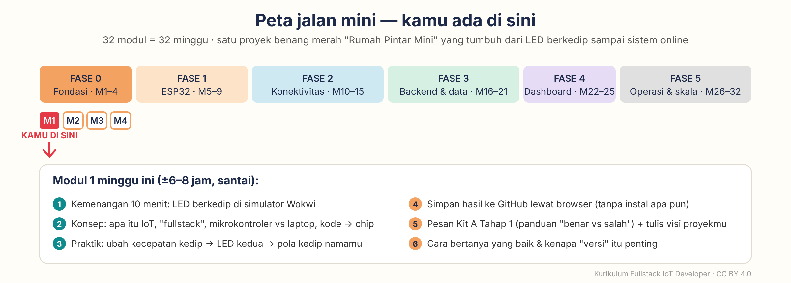

> [!NOTE]
> **Cara membaca modul ini (dan semua modul berikutnya).** Setiap modul punya ritme yang sama: 🎯 tujuan → 🧰 persiapan → 🏆 Kemenangan Cepat → 🧠 konsep → 🔧 praktik → 🚨 kotak "Kalau Tidak Jalan?" → 🔬 bedah teknis → 🧩 tantangan → ➕ proyek benang merah → 📖 glosarium → 📝 kuis → ✅ checklist → 📚 sumber gambar. Setelah 2–3 modul, kamu akan hafal ritmenya. Beberapa bagian **dilipat** (klik judulnya untuk membuka). Bagian lipat di 🔬 Bedah Teknis boleh dilewati pemula. Bagian lipat di 🚨 dan kunci kuis dibuka saat kamu membutuhkannya.

## Daftar isi

1. [🎯 Setelah modul ini kamu bisa…](#-setelah-modul-ini-kamu-bisa)
2. [🧰 Yang perlu disiapkan](#-yang-perlu-disiapkan)
3. [🏆 Kemenangan Cepat: LED berkedip dalam 10 menit](#-kemenangan-cepat-led-berkedip-dalam-10-menit)
4. [🧠 Konsep "Mengapa"](#-konsep-mengapa)
5. [🔧 Praktik langkah demi langkah](#-praktik-langkah-demi-langkah)
6. [🚨 Kalau Tidak Jalan?](#-kalau-tidak-jalan)
7. [🔬 Bedah Teknis (opsional)](#-bedah-teknis-opsional)
8. [🧩 Tantangan mandiri](#-tantangan-mandiri)
9. [➕ Tambahan ke "Rumah Pintar Mini"](#-tambahan-ke-rumah-pintar-mini)
10. [📖 Glosarium](#-glosarium) · [📝 Kuis](#-kuis-5-soal) · [✅ Checklist kelulusan](#-checklist-kelulusan-modul-1)
11. [📚 Sumber & atribusi gambar](#-sumber--atribusi-gambar)

---

## 🎯 Setelah modul ini kamu bisa…

- **Menjelaskan** apa itu IoT dan apa artinya "fullstack IoT" kepada teman atau keluarga dengan bahasa sehari-hari, lengkap dengan contoh yang mereka kenal (meteran listrik, ojek online, peringatan banjir).
- **Membuat LED berkedip** di simulator Wokwi dengan pola yang kamu rancang sendiri, dan tahu persis baris kode mana yang mengatur apa.
- **Menyimpan hasil belajar** pertamamu di GitHub lewat browser supaya tidak hilang dan bisa dilihat orang lain.
- **Bertanya dengan baik** saat macet, termasuk kepada asisten AI, dan mengerti kenapa "versi" adalah kata paling penting dalam setiap pertanyaan.
- **Memesan Kit A Tahap 1** yang benar — bukan papan yang mirip, tetapi berbeda — supaya Modul 2 bisa langsung dimulai begitu paketnya datang.

---

## 🧰 Yang perlu disiapkan

| Kebutuhan | Keterangan |
| :--- | :--- |
| **Laptop/PC** dengan browser (peramban) modern | Chrome, Edge, atau Firefox versi terbaru. Windows, macOS, atau Linux sama saja. **HP saja tidak cukup** untuk Wokwi (layarnya terlalu sempit dan simulator butuh tenaga komputer), tapi boleh dipakai untuk membaca materi dan memotret. |
| **Tidak punya laptop?** | Pakai lab komputer kampus, warnet, atau perpustakaan — Wokwi dan GitHub **tidak perlu menginstal apa pun**, jadi 1–2 jam di komputer pinjaman cukup untuk Kemenangan Cepat dan Praktik 1–4 (unggah ke GitHub sekalian dari komputer itu, atau kirim tangkapan layarnya ke HP-mu dulu). Bagian lain (konsep, belanja, latihan bertanya) bisa dibaca di HP. Jalan darurat: Chrome di HP dengan menu ⋮ → *Desktop site* (*Situs desktop*) untuk Kemenangan Cepat saja; sempit, tapi bisa. |
| **Koneksi internet** | Wokwi dan GitHub keduanya berjalan di browser. Kuota HP yang di-*tethering* cukup. |
| **Alamat email** (surel) | Untuk membuat akun GitHub (gratis) dan, kalau mau menyimpan proyek, akun Wokwi (gratis). |
| **Uang untuk Kit A Tahap 1** | Kit A = paket komponen ESP32 dasar menurut Silabus; Tahap 1 = bagian yang dibutuhkan Modul 2–6. Rp300–620 ribu, **dipesan di akhir modul ini** supaya sampai sebelum Modul 2. Belum perlu dibeli sekarang — baca dulu panduan belanjanya di Praktik 5. |
| **Yang TIDAK perlu** | Menginstal program apa pun. Arduino IDE baru dipasang di Modul 2, Git di Modul 3, Node.js di Modul 4. Satu alat per modul, tepat saat dibutuhkan. |

**Versi yang dipakai di modul ini** (penting — nanti kamu paham kenapa):

| Alat | Versi | Catatan |
| :--- | :--- | :--- |
| Wokwi | Versi web, Oktober 2026 | Tampilannya bisa sedikit berubah dari tangkapan layar di sini; letak tombolnya biasanya tetap. |
| GitHub | Versi web, Oktober 2026 | Sama seperti di atas. |
| Kode contoh | Ditulis untuk ***core* arduino-esp32 3.3.x** | *Core* = paket penerjemah yang membuat ESP32 bisa diprogram gaya Arduino (dijelaskan di Konsep 9). Wokwi memakai core 3.x; untuk kode Modul 1 (`pinMode`, `digitalWrite`, `delay`) versi persisnya tidak berpengaruh. Di Modul 2 kamu memasang core versi yang sama di laptopmu. |

> [!TIP]
> **Siapkan satu folder di laptop** bernama `belajar-iot`, misalnya di *Documents* (Windows: *Dokumen*; macOS: *Documents*). Semua tangkapan layar dan file dari modul ini kamu simpan di situ supaya saat mengunggah ke GitHub nanti tidak perlu mencari-cari.

---

## 🏆 Kemenangan Cepat: LED berkedip dalam 10 menit

Kita langsung praktik. **Jangan khawatir kalau belum paham satu baris pun** — justru itu tujuannya. Teori menyusul setelah kamu melihat hasilnya sendiri.

> 🖥️ **Alat yang dipakai di bagian ini:** hanya browser di laptop/PC. Buka Chrome/Edge/Firefox sekarang.

### Langkah 1 — Buka editor Wokwi

Ketik alamat ini di bilah alamat browser, lalu tekan **Enter**:

```
https://wokwi.com/projects/new/esp32
```

Alamat itu langsung membuka **proyek ESP32 baru**. (Kalau kamu masuk lewat beranda [wokwi.com](https://wokwi.com), pilih kotak **ESP32** — hasilnya sama.) Tidak perlu mendaftar dulu. Kalau muncul kotak sambutan atau iklan, tutup dengan tanda ×.

Kamu akan melihat layar seperti ini. Kenali dulu bagian-bagiannya — lima menit ke depan kita hanya memakai nomor **1, 2, dan 3**:

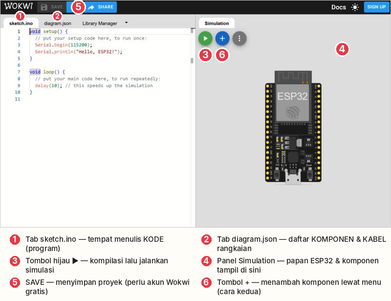

Di layarmu tombol **SAVE** masih abu-abu dan ada tombol **SIGN UP** di pojok kanan — normal, kita belum mendaftar. Di panel kanan ada gambar papan (*board*) ESP32 — itu papan **bawaan** Wokwi, versi 38 pin (pin = kaki logam di tepi papan). Kita akan menggantinya dengan papan **30 pin** yang sama persis dengan yang akan kamu beli, plus satu LED (lampu kecil) dan satu resistor (komponen kecil pembatas arus). Caranya: menempel satu "daftar komponen".

### Langkah 2 — Tempel daftar komponen (diagram.json)

> 🖥️ **Di mana?** Di Wokwi, panel **kiri**, klik tab **`diagram.json`** (nomor 2 pada gambar di atas).

1. Klik tab **`diagram.json`**.
2. Klik di tengah teks, tekan **Ctrl + A** (macOS: **Cmd + A**) untuk memilih semua, kemudian tekan **Delete** sampai kosong.
3. Salin seluruh isi kotak di bawah ini (arahkan kursor ke pojok kanan atas kotak, klik ikon salin 📋), lalu tempel ke editor dengan **Ctrl + V** (macOS: **Cmd + V**).

```json
{
  "version": 1,
  "author": "Kurikulum Fullstack IoT Developer",
  "editor": "wokwi",
  "parts": [
    { "type": "wokwi-esp32-devkit-v1", "id": "esp", "top": 0, "left": 0, "attrs": {} },
    { "type": "wokwi-resistor", "id": "r1", "top": 94.35, "left": 130, "attrs": { "value": "220" } },
    { "type": "wokwi-led", "id": "led1", "top": 107, "left": 150, "attrs": { "color": "red" } }
  ],
  "connections": [
    [ "esp:TX0", "$serialMonitor:RX", "", [] ],
    [ "esp:RX0", "$serialMonitor:TX", "", [] ],
    [ "esp:D4", "r1:1", "green", [] ],
    [ "r1:2", "led1:A", "green", [ "h20", "v49" ] ],
    [ "led1:C", "esp:GND.1", "black", [] ]
  ]
}
```

Begitu ditempel, panel kanan **langsung berubah**: papan 30 pin, resistor, LED merah, dan tiga kabel muncul sendiri. Kalau teks di layarmu tampak lebih rapat atau lebih renggang daripada tangkapan layar di bawah, tidak apa-apa — itu hanya soal tampilan; komponen dan kabelnya sama.

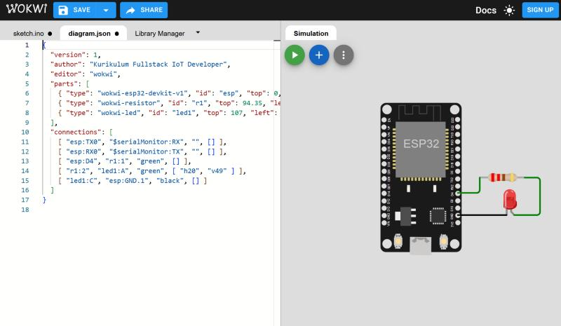

> [!NOTE]
> File ini bernama `diagram.json`. **JSON** adalah cara menulis data yang rapi dan bisa dibaca komputer; di sini isinya daftar komponen (`parts`) dan kabel (`connections`). Kamu *belum* perlu mengerti isinya — kita bedah di bagian 🔬. Yang penting: tanda kurung, koma, dan tanda petiknya harus utuh; itulah sebabnya kita **salin-tempel**, bukan mengetik ulang.

### Langkah 3 — Tempel kode program (sketch.ino)

> 🖥️ **Di mana?** Masih di Wokwi, panel kiri, klik tab **`sketch.ino`** (nomor 1).

1. Klik tab **`sketch.ino`**.
2. Klik di dalam kode, tekan **Ctrl + A**, lalu **Delete** untuk mengosongkan contoh bawaan "Hello, ESP32!".
3. Salin kode di bawah ini, lalu tempel dengan **Ctrl + V**.

```cpp
// Program pertama kita: LED berkedip (Blink)
// LED dipasang di pin D4 lewat resistor 220 ohm

const int PIN_LED = 4;  // nomor pin tempat LED dipasang

void setup() {
  // Dijalankan SEKALI saat ESP32 baru menyala
  pinMode(PIN_LED, OUTPUT);  // pin ini untuk keluaran
}

void loop() {
  // Diulang TERUS-MENERUS selama ESP32 menyala
  digitalWrite(PIN_LED, HIGH);  // HIGH = LED menyala
  delay(500);                   // tunggu 500 milidetik
  digitalWrite(PIN_LED, LOW);   // LOW  = LED padam
  delay(500);                   // tunggu 500 milidetik lagi
}
```

Hasilnya seperti ini — kode di kiri, rangkaian di kanan:

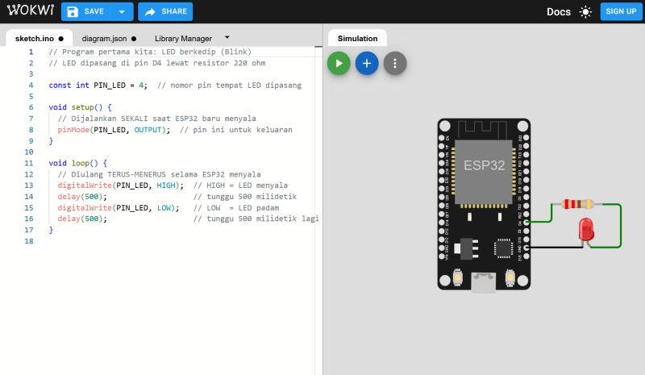

Kedua file juga tersedia di folder [`kode/01-blink/`](kode/01-blink/) — isinya sama persis dengan dua kotak di atas.

### Langkah 4 — Jalankan!

> 🖥️ **Di mana?** Panel **kanan** Wokwi, tombol **hijau ▶** (nomor 3).

Klik tombol hijau. Akan muncul kotak **"Compiling project…"** dengan hitungan detik — Wokwi sedang menerjemahkan kodemu menjadi bahasa mesin di servernya. Biasanya 5–20 detik; kalau servernya sedang ramai, bisa sampai satu menit (ada tulisan soal *build queue* dan paket berbayar — abaikan saja). Lebih dari 2 menit? Lihat kotak 🚨.

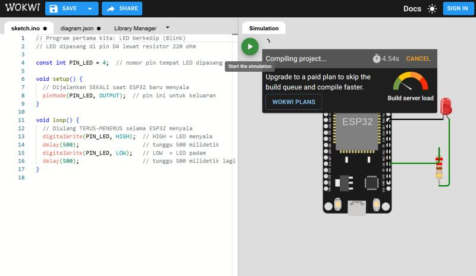

Lalu… **LED merahnya berkedip.** Nyala setengah detik, padam setengah detik, terus-menerus. Di pojok kanan atas ada penghitung waktu simulasi yang berjalan, dan di bawah muncul kotak hitam berisi tulisan aneh (itu "catatan harian" chip saat menyala — abaikan dulu).

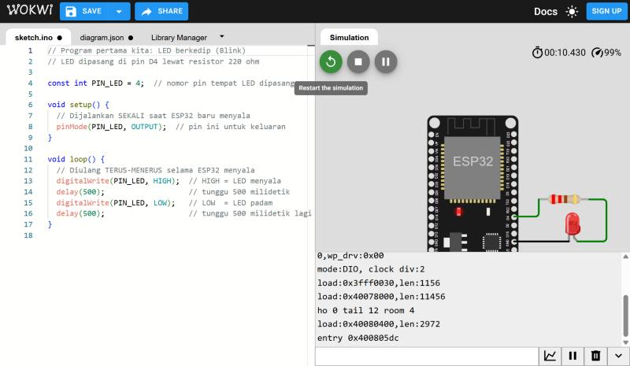

Kalau kamu klik tombol **⏸ jeda** (di sebelah tombol stop), Wokwi membekukan simulasi dan memperlihatkan keadaan setiap pin. Perhatikan pin **D4**: kalau kamu menjeda saat LED menyala, labelnya `OUT High`; jeda saat padam, labelnya `OUT Low` — persis seperti yang kodemu perintahkan (bandingkan dua gambar di bawah). Untuk melanjutkan, klik tombol **kuning ▶**.

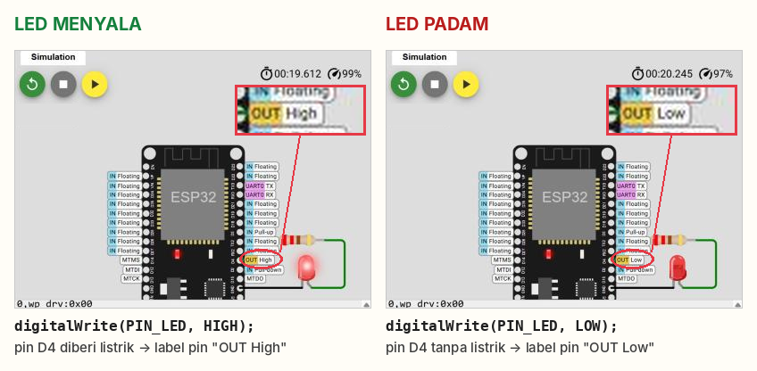

### Langkah 5 — Abadikan kemenanganmu

Ambil tangkapan layar (*screenshot*) saat LED menyala — ini akan kamu unggah ke GitHub nanti. Trik: klik **⏸ jeda** tepat saat LED menyala (kalau tertangkap padam, klik tombol **kuning ▶** untuk melanjutkan, tunggu LED menyala, lalu ⏸ lagi), baru ambil tangkapan layar.

| Sistem | Cara |
| :--- | :--- |
| **Windows 11** | Tekan **Win + Shift + S**, seret kotak di area Wokwi. Hasilnya otomatis tersimpan di folder *Pictures → Screenshots*. |
| **Windows 10** | Tekan **Win + Shift + S**, seret kotak. Hasilnya **belum** tersimpan: klik notifikasi yang muncul di pojok kanan bawah, lalu klik ikon simpan (disket) di aplikasi Snip & Sketch yang terbuka. |
| **macOS** | Tekan **Cmd + Shift + 4**, seret kotak. File tersimpan di *Desktop* dengan nama otomatis "Screenshot …". Untuk mengganti nama: klik sekali nama filenya, tekan **Enter**, ketik nama baru. |
| **Linux (GNOME/Ubuntu)** | Tekan tombol **PrtSc**, pilih mode *area*, seret kotak, lalu klik tombol bulat. File tersimpan di folder *Pictures/Screenshots*. |

Beri nama filenya **`modul-01-blink.png`** (Windows/Linux: klik kanan file → **Rename**/*Ubah nama*, atau pilih file lalu tekan **F2**) dan pindahkan ke folder `belajar-iot` yang kamu buat tadi. (Windows biasanya **menyembunyikan** akhiran `.png` — kalau namanya tampil tanpa `.png`, tidak apa-apa.)

> [!IMPORTANT]
> **🎉 Selamat — kamu baru saja memprogram sebuah mikrokontroler.** Serius. Kode yang kamu tempel itu bukan "pura-pura": kode yang sama persis, tanpa diubah satu huruf pun, akan kamu unggah ke ESP32 sungguhan di Modul 2, dan LED di mejamu akan berkedip dengan irama yang sama. Yang berbeda hanya *tempat* chip-nya berjalan — hari ini di dalam browser, minggu depan di papan seharga Rp50 ribu.

**Ingin menyimpan proyeknya?** Klik **SAVE** (nomor 5). Wokwi akan meminta kamu masuk (*login*) atau mendaftar — gratis, bisa pakai akun Google. Setelah tersimpan, tombol **SHARE** memberi tautan yang bisa kamu kirim ke siapa pun. Kalau tidak disimpan, proyek hilang saat tab ditutup; tidak masalah karena kodenya ada di materi ini.

---

## 🧠 Konsep "Mengapa"

Sekarang kamu sudah melihat hasilnya. Mari kita bongkar pelan-pelan — satu konsep per bagian, selalu dengan perbandingan dunia nyata. Konsep 1–6 cukup untuk lanjut ke Praktik 1–3; Konsep 7–10 boleh dibaca belakangan, tepat sebelum Praktik 4–6.

### 1. Apa itu IoT?

**IoT** (*Internet of Things*, "internet untuk benda-benda") artinya sederhana: **benda biasa yang diberi sensor dan koneksi supaya bisa melapor dan diperintah dari jauh.** Bukan hanya laptop dan HP yang terhubung ke internet, melainkan juga meteran listrik, pompa air, lampu teras, kandang ayam, pintu air.

Coba perhatikan tiga contoh yang hampir pasti pernah kamu temui:

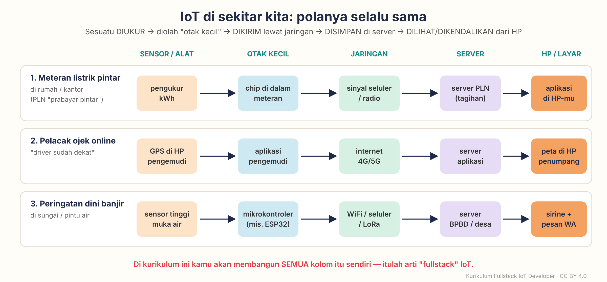

(*LoRa* di gambar = radio jarak jauh hemat daya, dibahas di Modul 15; BPBD = Badan Penanggulangan Bencana Daerah.)

Lihat polanya? **Selalu sama**, apa pun bendanya:

1. Ada yang **diukur** (sensor): berapa kWh, di mana posisinya, setinggi apa airnya.
2. Ada **otak kecil** di benda itu yang membaca sensor dan memutuskan "saatnya melapor".
3. Laporan dikirim lewat **jaringan**: WiFi, sinyal seluler, radio.
4. **Server** di suatu tempat menerima, menyimpan, dan menghitung.
5. Kamu melihat atau mengendalikannya dari **HP/layar**.

Yang kamu lakukan tadi — menyalakan LED dari kode — adalah **langkah 2** versi paling kecil: otak kecil (ESP32) menjalankan perintahmu. Tiga puluh satu modul berikutnya menambahkan langkah 1, 3, 4, dan 5 satu per satu.

### 2. "Fullstack" = kamu membangun semua lapisannya

Dalam industri, langkah-langkah di atas biasanya dikerjakan tim yang berbeda: ada yang khusus chip, khusus jaringan, khusus server, khusus aplikasi. **Fullstack IoT developer** (pengembang IoT *fullstack*) adalah orang yang paham dan bisa membangun **semuanya** — minimal cukup untuk membuat sistem utuh sendirian, dan cukup untuk bisa bekerja sama dengan spesialis mana pun.

Inilah sistem yang akan kamu bangun selama 32 minggu, dari sensor sampai ke layar HP:

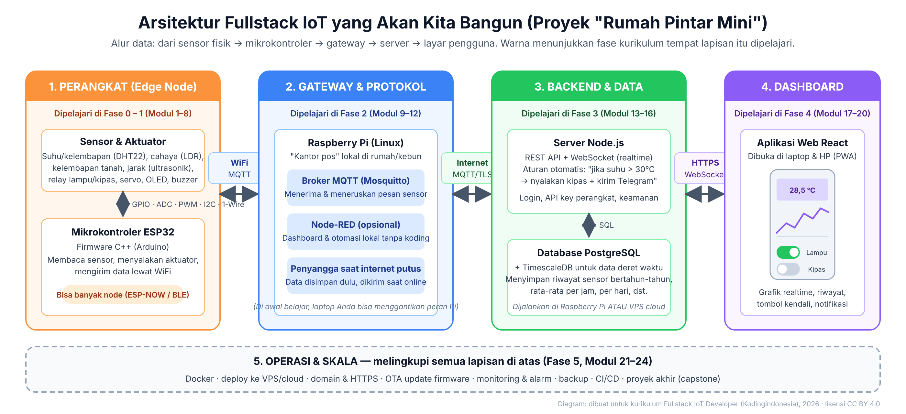

Jangan pusing melihat banyaknya kotak dan singkatan — gambar ini sengaja diperlihatkan sekarang supaya kamu **tahu tujuan akhirnya**, bukan untuk dihafal. Setiap kotak akan dapat gilirannya. Sistemnya terdiri atas **lima lapisan**, masing-masing punya analogi sehari-hari (ini pemetaan yang sama dengan [Silabus §2](../../SILABUS.md#2-gambaran-besar-apa-yang-akan-kita-bangun)):

| Lapisan | Analogi | Dibangun di | Hubungannya dengan "pola IoT" di Konsep 1 |
| :--- | :--- | :---: | :--- |
| **1. Perangkat (ESP32)** | Indra & tangan | Fase 0–1 (+ Node 2 di Modul 14) | Langkah 1 & 2: sensor + otak kecil. Hari ini kamu sudah menyentuhnya. |
| **2. Gateway (Raspberry Pi)** | Kantor pos lokal di rumah | Fase 2 | Bagian dari langkah 3: mengumpulkan laporan semua perangkat di rumah, menahannya kalau internet putus. |
| **3. Backend & Data** | Kantor pusat & gudang arsip | Fase 3 | Langkah 4: server yang menyimpan riwayat dan menjalankan aturan. |
| **4. Dashboard** | Layar di mejamu | Fase 4 | Langkah 5: tempat manusia melihat angka dan menekan tombol. |
| **5. Operasi** | Satpam, teknisi, & tukang servis | Fase 5 | Tidak ada di pola sederhana tadi — inilah yang memastikan semuanya tetap hidup, aman, dan bisa diperbarui 24 jam. |

Dua hal lagi yang perlu kamu ingat dari gambar itu:

- Ada **dua node** (*node* = satu perangkat ESP32 beserta sensornya): **Node 1 "Rumah"** yang selalu tercolok listrik, dan **Node 2 "Kebun"** yang hidup dari baterai (di gambar, Node 2 hanya tampak sebagai label kecil "via ESP-NOW" di kotak pertama). Kamu baru akan merakit Node 1 di Fase 1, Node 2 di Modul 14.
- Otaknya ada di **banyak tempat**: di ESP32 (keputusan kilat, misalnya "tanah kering → siram"), di Raspberry Pi (penghubung di rumah), dan di server (menyimpan riwayat, mengirim notifikasi). Fullstack berarti kamu yang memutuskan otak mana mengerjakan apa.

### 3. Laptop vs mikrokontroler: "komputer kecil yang hanya menjalankan satu program"

ESP32 adalah **mikrokontroler**: komputer mungil seharga puluhan ribu rupiah yang **tidak punya sistem operasi** seperti Windows — tidak ada aplikasi lain, tidak ada tombol "tutup". Begitu dinyalakan, ia langsung menjalankan **satu-satunya program** yang tersimpan di dalamnya, dan terus menjalankannya sampai listrik dicabut. (Penyederhanaan kecil yang jujur: di dalamnya ada "OS mini" bernama FreeRTOS, tapi kamu baru bertemu dengannya di Modul 8.)

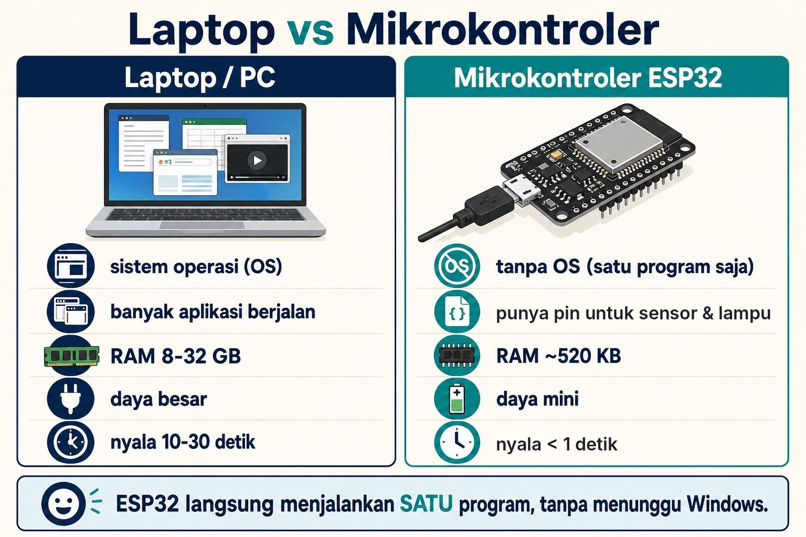

*(Gambar papan di ilustrasi ini hanya simbol; wujud papan yang benar-benar kita beli ada di Praktik 5. "Nyala < 1 detik" di gambar maksudnya: dari dicolok sampai program berjalan, tanpa menunggu apa pun.)*

Kelemahan? Jelas: tidak bisa membuka browser, memorinya cuma sepersepuluh ribu memori laptopmu. Justru itulah kekuatannya untuk IoT:

- **Menyala dalam sepersekian detik** dan tidak pernah tersendat (*lag*) karena tidak ada program lain yang berebut.
- **Hemat daya luar biasa** — Node 2 "Kebun" nanti bertahan berhari-hari sampai beberapa minggu dari satu baterai 18650 (Modul 9 menjelaskan hitungannya dengan jujur).
- **Murah dan kecil**, bisa ditanam di dalam pot, pompa, atau kotak sakelar.
- Punya **kaki-kaki (pin)** yang bisa langsung disambung ke sensor dan lampu — laptop tidak punya.

> [!TIP]
> **Analogi:** laptop itu seperti restoran dengan banyak koki, pelayan, dan menu panjang. Mikrokontroler itu seperti **tukang sate** yang hanya bisa satu hal, tapi melakukannya sangat cepat, sangat murah, dan tidak perlu gedung.

### 4. Dari kode ke chip: resep → juru masak → masakan

Kode yang kamu tempel tadi adalah **teks biasa**. Chip tidak bisa membaca teks. Jadi, apa yang terjadi saat kamu klik ▶?

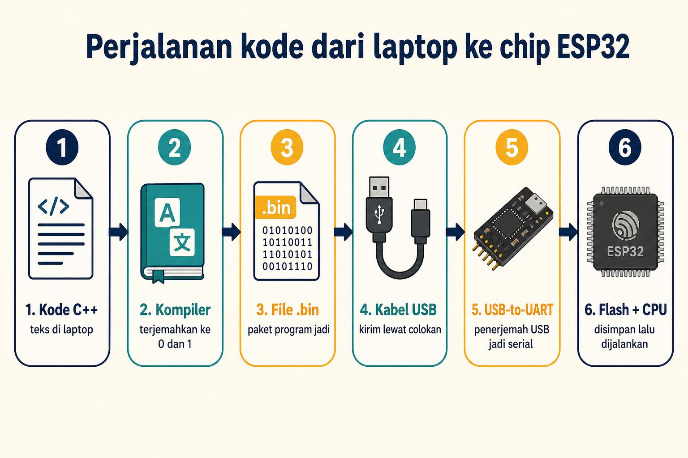

Bayangkan **resep masakan** (kodemu, ditulis dalam bahasa "setengah manusia" bernama C++) diserahkan ke **juru masak** bernama **kompiler**. Kompiler menerjemahkannya menjadi "masakan jadi": sebuah file berisi 0 dan 1 (`.bin`) yang dimengerti chip. File itu lalu **dikirim ke chip**. Di Modul 2, pengirimannya lewat kabel USB ke ESP32 asli (langkah 4–6 di gambar; istilah-istilahnya dibahas di sana). Hari ini langkah 4–5 digantikan Wokwi: file `.bin` tidak lewat kabel, tapi langsung dimasukkan ke **ESP32 tiruan** yang berjalan di dalam browsermu.

Itulah sebabnya ada jeda "Compiling project…": juru masak sedang bekerja. Itu pula sebabnya pesan kesalahan sering berbunyi `error: expected ';'` — juru masak tidak bisa menebak resep yang tanda bacanya kurang. Kita lihat contohnya di bagian 🚨.

### 5. Dua "ruangan" dalam setiap program: `setup()` dan `loop()`

Semua program Arduino/ESP32 — dari yang 10 baris sampai yang 10.000 baris — punya dua bagian wajib ini:

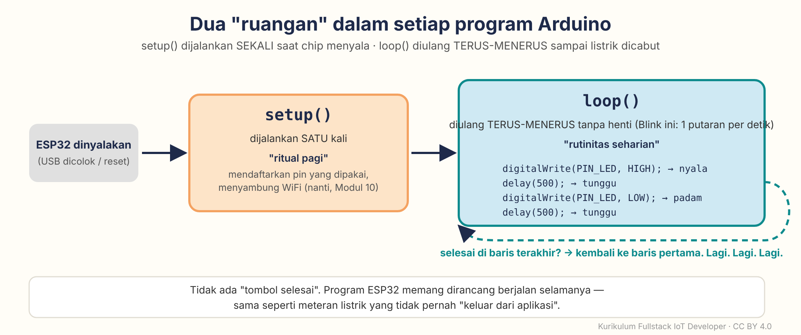

- **`setup()`** dijalankan **satu kali** saat chip menyala — seperti ritual pagi: cuci muka, nyalakan lampu dapur, cek apakah masih ada kopi. Di sini kita "mendaftarkan" pin.
- **`loop()`** dijalankan **berulang-ulang tanpa henti** — seperti rutinitas seharian yang diulang terus. Selesai di baris terakhir? Kembali ke baris pertama. Tidak ada tombol selesai karena mikrokontroler memang dirancang hidup selamanya.

Sekarang mari baca kode tadi baris per baris. Tidak perlu dihafal — tujuannya supaya tidak ada satu baris pun yang terasa seperti mantra:

| Baris | Artinya dalam bahasa manusia |
| :--- | :--- |
| `// Program pertama kita…` | Apa pun setelah `//` adalah **komentar**: catatan untuk manusia, diabaikan kompiler. Pakai sebanyak mungkin. |
| `const int PIN_LED = 4;` | "Buat **nama** `PIN_LED` yang isinya angka 4, dan jangan pernah berubah (`const`)." Dengan begini, kalau LED pindah ke pin lain, kamu mengubah **satu angka**, bukan mencari di seluruh kode. `int` = tipe data bilangan bulat. |
| `void setup() { … }` | Mulai ruangan `setup`. `void` = kata pembuka wajib untuk ruangan jenis ini (arti harfiahnya "tidak mengembalikan apa-apa"; dibahas di Modul 3). Kurung kurawal `{` dan `}` adalah pintu masuk dan pintu keluar ruangan. |
| `pinMode(PIN_LED, OUTPUT);` | "Pin nomor 4 akan dipakai untuk **mengeluarkan** listrik" (`OUTPUT`), bukan membaca sensor (`INPUT`). Wajib sebelum pin dipakai. |
| `void loop() { … }` | Mulai ruangan `loop`. |
| `digitalWrite(PIN_LED, HIGH);` | "Pin 4: **keluarkan listrik**" (`HIGH` = 3,3 V). LED menyala. |
| `delay(500);` | "**Tunggu** 500 milidetik" = 0,5 detik. Selama menunggu, chip tidak melakukan apa pun. |
| `digitalWrite(PIN_LED, LOW);` | "Pin 4: **hentikan listrik**" (`LOW` = 0 V). LED padam. |
| `delay(500);` | Tunggu 0,5 detik lagi, lalu `}` → kembali ke baris pertama `loop()`. |

Tiga aturan tata bahasa C++ yang akan sering kamu temui:

1. **Setiap perintah diakhiri titik koma `;`** — seperti titik di akhir kalimat. Lupa satu saja → error (lihat bagian 🚨).
2. **Huruf besar-kecil itu beda.** `digitalWrite` benar; `DigitalWrite` atau `digitalwrite` salah.
3. **Kurung harus berpasangan**: setiap `(` punya `)`, setiap `{` punya `}`.

### 6. Kenapa LED butuh resistor, dan kenapa kakinya ada yang panjang?

Rangkaian tadi hanya tiga komponen dan tiga kabel — susunannya sama dengan yang tampil di Wokwi:

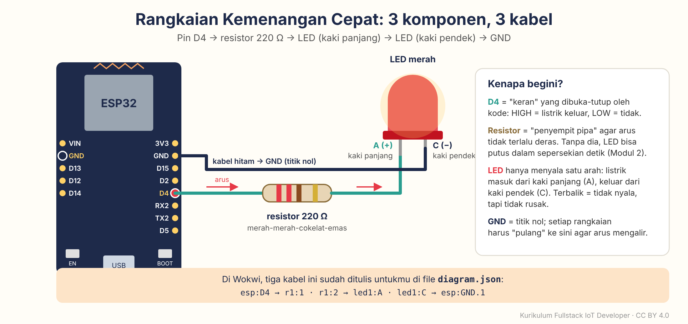

- **D4** adalah "keran" yang dibuka-tutup oleh kodemu.
- **Resistor 220 Ω** (ohm) adalah "penyempit pipa". Tanpanya, arus mengalir terlalu deras dan LED atau pin ESP32 bisa rusak. Di simulator tidak ada yang rusak, tapi kita **membiasakan diri** dari sekarang — di Modul 2 kamu akan menghitung sendiri kenapa angkanya 220.
- **LED** hanya mau dilewati arus **satu arah**. Listrik masuk dari **kaki panjang** (anoda, tanda `A` atau `+`), keluar dari **kaki pendek** (katoda, `C` atau `−`). Dipasang terbalik? Tidak menyala — tapi tidak rusak, jadi jangan takut mencoba.
- **GND** (*ground*, "tanah") adalah titik nol. Setiap rangkaian harus "pulang" ke GND supaya arus bisa mengalir memutar, seperti air yang harus kembali ke tandon.

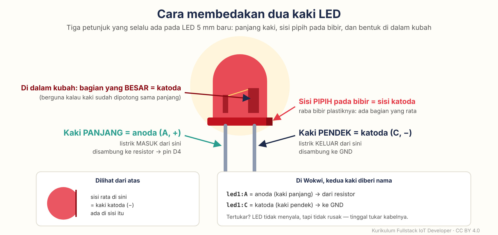

Cukup sekian dulu soal listrik. Modul 2 seluruhnya tentang ini — dengan analogi tandon air dan satu rumus saja.

> ☕ **Titik istirahat.** Sampai sini kamu sudah punya bekal untuk Praktik 1–3. Kalau mau langsung praktik, lompat ke [🔧 Praktik](#-praktik-langkah-demi-langkah) dan kembali ke Konsep 7–10 nanti — Konsep 8 dibutuhkan sebelum Praktik 4, Konsep 9 sebelum Praktik 6.

### 7. Simulator vs papan asli: apa yang bisa dan tidak bisa dilakukan Wokwi

**Wokwi** adalah ESP32 tiruan yang berjalan di browser: CPU-nya ditiru persis sehingga kode yang jalan di Wokwi hampir selalu jalan di papan asli. Enaknya: gratis, tidak bisa terbakar, tidak ada kabel kendur, bisa dicoba di mana saja. Itulah mengapa sekitar 90% praktik Modul 1–9 bisa dikerjakan di Wokwi.

Yang **tidak** bisa ditiru Wokwi — dan ini alasan papan asli tetap penting (istilah di tabel ini milik Modul 2; sekadar gambaran, tidak perlu paham sekarang):

| Di dunia nyata | Di Wokwi |
| :--- | :--- |
| Kabel kendur, *breadboard* (papan rangkaian tanpa solder) longgar | Semua kabel selalu sempurna |
| Kabel USB "cas saja" yang tidak bisa kirim data | Tidak ada kabel |
| *Driver* USB belum terpasang, port COM salah (laptop tidak mengenali papan) | Tidak ada laptop di antaranya |
| Sensor yang angkanya goyang (*noise*) | Angka sensor selalu bersih |
| Catu daya kurang → chip menyala ulang sendiri | Listrik tak terbatas |

Jadi, pola belajarnya: **coba di Wokwi dulu** (cepat, aman), **lalu pindahkan ke papan asli** (untuk belajar hal-hal nyata di tabel di atas). Dua-duanya perlu.

### 8. Apa itu GitHub dan "repositori"?

**GitHub** adalah situs tempat jutaan programmer menyimpan kodenya. Satu proyek disimpan dalam satu **repositori** (*repo*): bayangkan **folder di internet yang mengingat setiap perubahan** — kamu bisa melihat seperti apa isi folder itu seminggu lalu, siapa yang mengubah apa, dan kenapa. Setiap repositori biasanya punya file **README** ("baca saya"): catatan utama yang tampil otomatis di halaman depannya — artikel yang sedang kamu baca ini pun sebuah README.

Di modul ini kita memakainya untuk hal paling sederhana: **mengunggah file lewat browser**, seperti mengunggah foto ke media sosial. Belum ada perintah, belum ada aplikasi. Alat yang lebih canggih (GitHub Desktop, lalu perintah `git`) menyusul di Modul 3 dan 16 — saat kamu sudah punya alasan untuk membutuhkannya.

Kenapa repot menyimpan di GitHub, bukan di laptop saja?

- **Tidak hilang** saat laptop rusak atau diganti.
- **Portofolio** — di Modul 32 kamu akan senang melihat repositori pertamamu bertanggal hari ini.
- **Bisa ditunjukkan** saat bertanya: dengan "ini kodeku, tautannya di sini", kamu jauh lebih mudah dibantu daripada dengan foto layar yang buram.

### 9. Versi itu penting (dan kenapa tutorial di internet sering "tidak jalan")

Ini pelajaran yang akan menyelamatkan ratusan jammu di kemudian hari.

Alat yang kita pakai **terus diperbarui**. *Core* arduino-esp32 (paket penerjemah yang membuat ESP32 bisa diprogram gaya Arduino), misalnya, berganti dari versi 2.x ke 3.x pada 2024 — dan beberapa perintah **berubah nama**. Tutorial yang ditulis tahun 2022 dengan perintah lama akan menghasilkan error di alat versi 2026, padahal kodenya "benar" pada zamannya.

Contoh nyata yang akan kamu temui di Modul 5:

| Tutorial lama (core 2.x) | Yang benar untuk versi kita (core 3.3.x) |
| :--- | :--- |
| `ledcSetup(0, 5000, 8); ledcAttachPin(pin, 0);` | `ledcAttach(pin, 5000, 8);` |

Artinya, ada **dua kebiasaan** yang perlu kamu mulai hari ini:

1. Setiap kali mengikuti tutorial dari luar kurikulum ini, **cek tahun dan versinya**. Kalau tidak disebut, curigai.
2. Setiap kali **bertanya** (kepada manusia maupun AI), **sebutkan versimu**: "core arduino-esp32 3.3.x", "Wokwi", "Arduino IDE 2.x", "Node.js 24". Tanpa itu, penjawab akan menebak — dan sering menebak versi lama.

Karena itu pula, setiap modul di kurikulum ini membuka kotak 🚨 dengan tabel **"kode lama → yang benar untuk versi kita"**.

### 10. Keselamatan dasar (singkat karena minggu ini belum ada perangkat keras)

Satu kalimat untuk dibawa ke Modul 2: **semua yang kita pakai di kurikulum ini bertegangan rendah dari USB — aman disentuh tangan, tidak bisa menyetrum.** USB memberi 5 V ke papan; papan menurunkannya menjadi 3,3 V untuk chip dan pin-pinnya (itulah angka `HIGH = 3,3 V` di Konsep 5). Keduanya aman. Listrik PLN 220 V **tidak pernah** kita sentuh: kurikulum ini tidak menyambungkan apa pun ke 220 V; cara kerja relay untuk 220 V hanya dibahas sebagai wawasan dan peringatan.

Aturan emas yang akan diulang di tiap modul perangkat keras: **cabut kabel USB sebelum mengubah kabel rangkaian.** Sekarang kamu hanya perlu mengingatnya.

---

## 🔧 Praktik langkah demi langkah

Enam praktik. Kerjakan berurutan, santai, boleh dicicil beberapa hari. Setiap praktik dimulai dengan kotak **🖥️ Alat** supaya kamu selalu tahu harus membuka apa.

### Praktik 1 — Ubah kecepatan kedip

> 🖥️ **Alat:** browser → Wokwi, tab `sketch.ino` (proyek Kemenangan Cepat tadi; kalau tabnya sudah ditutup, ulangi Langkah 1–3 di atas — hanya 2 menit).

Angka di dalam `delay(…)` adalah lama tunggu dalam **milidetik** (1 detik = 1.000 ms). Mengubahnya = mengubah irama kedip.

1. Kalau simulasi masih berjalan, klik tombol **⏹ stop** (kotak abu-abu di antara tombol hijau ↻ dan tombol ⏸).
2. Ubah **kedua** `delay(500)` menjadi `delay(100)`.
3. Klik **▶** lagi. Wokwi mengompilasi ulang (sabar 5–20 detik), lalu LED berkedip **lima kali lebih cepat**.
4. Coba lagi dengan kombinasi di tabel ini, satu per satu. Setiap kali ubah kode → stop → play.

| `delay` saat nyala | `delay` saat padam | Yang kamu lihat | Dipakai untuk |
| :---: | :---: | :--- | :--- |
| 500 | 500 | Kedip tenang 1× per detik | Lampu "sistem hidup" |
| 100 | 100 | Kedip cepat, agak panik | Alarm / peringatan |
| 1000 | 50 | Lama nyala, padam sekejap | Lampu "normal" hemat perhatian |
| 50 | 1000 | Kilat singkat tiap detik | Indikator baterai (hemat daya!) |
| 2 | 2 | Terlihat seperti **menyala terus, tetapi setengah terang** | Dasar dari peredupan (*dimming*, Modul 5) |

Baris terakhir itu kejutan kecil: mata manusia tidak bisa mengikuti ratusan kedip per detik, jadi LED terlihat menyala redup. (Di Wokwi hasilnya bisa tampak redup *atau* berkelip cepat, tergantung kecepatan simulasi; di LED asli nanti benar-benar redup.) Trik nyala-padam sangat cepat untuk mengatur terang ini namanya **PWM** (*pulse width modulation*, modulasi lebar pulsa), dan kamu akan memakainya untuk meredupkan LED dan membunyikan nada buzzer di Modul 5.

Begini bentuk dua pola dari tabel kalau digambar di garis waktu — plus bocoran pola "nama" yang akan kamu buat di Praktik 3:

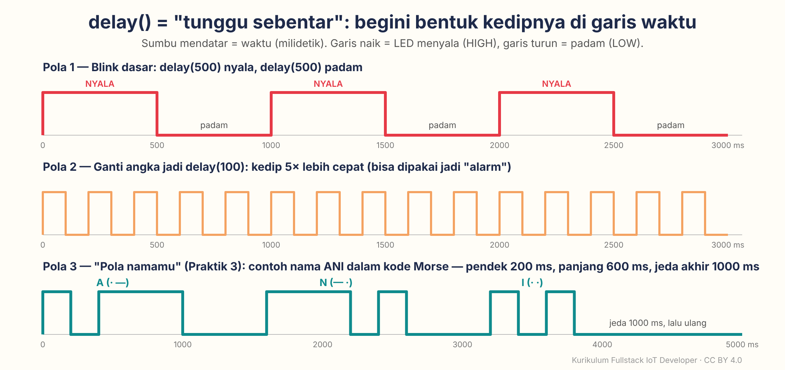

> [!TIP]
> **Kebiasaan baik dari sekarang:** ubah **satu hal**, jalankan, lihat efeknya. Jangan mengubah lima hal sekaligus — kalau hasilnya aneh, kamu tidak tahu perubahan mana yang menyebabkannya.

### Praktik 2 — Tambah LED kedua

> 🖥️ **Alat:** browser → Wokwi, tab `diagram.json` **dan** `sketch.ino`.

Ada dua cara menambah komponen di Wokwi. **Pilih salah satu.** Kalau ingin mencoba keduanya, lakukan Cara A dulu; Cara B akan mengganti seluruh rangkaian dengan versi yang rapi — itu normal.

**Cara A — lewat tombol ➕ (klik-klik, cocok untuk eksplorasi).**

1. Klik tombol **➕** biru di panel kanan (nomor 6 di gambar editor). Muncul daftar komponen.
2. Pilih **LED** (kelompok *Basic*). LED baru muncul di panel; seret ke tempat kosong. Warnanya merah — tidak memengaruhi kode, tapi kalau mau sama dengan gambar dan tantangan, klik LED baru itu lalu klik **kotak warna hijau** di baris yang muncul di atasnya (lihat gambar di bawah).

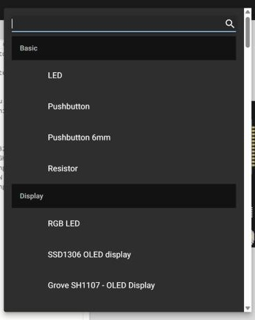

3. Klik ➕ lagi, pilih **Resistor**. Klik resistor yang baru muncul — di atasnya terbuka panel kecil dengan kolom **Resistance**; ganti isinya menjadi `220`. (Mengeklik komponen juga memunculkan ikon putar, hapus, dan `?` untuk dokumentasi.)
4. **Menyambung kabel:** arahkan kursor ke ujung sebuah pin *tanpa* mengeklik — Wokwi memunculkan **nama pinnya** dalam kotak kecil (`esp:D18`, `esp:GND.1`, `led2:A`, `led2:C`, `r2:1`, `r2:2`). Klik pin pertama, lalu klik pin tujuan. Sambungkan: pin **D18** ESP32 → kaki **1** resistor; kaki **2** resistor → kaki **A** LED; kaki **C** LED baru → kaki **C** LED pertama (keduanya "pulang" ke GND lewat kabel hitam yang sudah ada — seperti dua rumah berbagi satu saluran pembuangan).

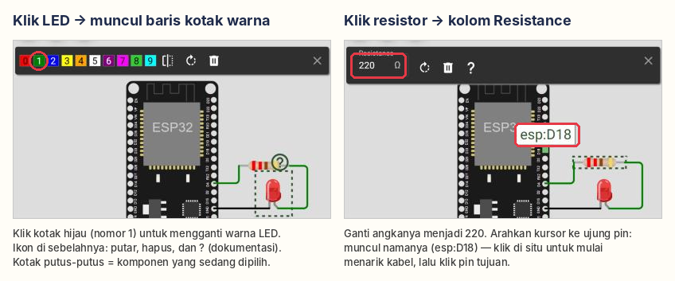

**Cara B — lewat `diagram.json` (tempel teks, hasilnya pasti rapi).** Buka tab `diagram.json`, kosongkan (**Ctrl + A**, **Delete**), lalu tempel ini:

```json
{
  "version": 1,
  "author": "Kurikulum Fullstack IoT Developer",
  "editor": "wokwi",
  "parts": [
    { "type": "wokwi-esp32-devkit-v1", "id": "esp", "top": 0, "left": 0, "attrs": {} },
    { "type": "wokwi-resistor", "id": "r1", "top": 94.35, "left": 130, "attrs": { "value": "220" } },
    { "type": "wokwi-led", "id": "led1", "top": 107, "left": 150, "attrs": { "color": "red" } },
    { "type": "wokwi-resistor", "id": "r2", "top": 54.35, "left": 210, "attrs": { "value": "220" } },
    { "type": "wokwi-led", "id": "led2", "top": 107, "left": 230, "attrs": { "color": "green" } }
  ],
  "connections": [
    [ "esp:TX0", "$serialMonitor:RX", "", [] ],
    [ "esp:RX0", "$serialMonitor:TX", "", [] ],
    [ "esp:D4", "r1:1", "green", [] ],
    [ "r1:2", "led1:A", "green", [ "h20", "v49" ] ],
    [ "led1:C", "esp:GND.1", "black", [] ],
    [ "esp:D18", "r2:1", "blue", [ "h20", "v-21.7" ] ],
    [ "r2:2", "led2:A", "blue", [ "h20", "v89" ] ],
    [ "led2:C", "led1:C", "black", [ "v15", "h-80" ] ]
  ]
}
```

Kalau kamu bandingkan dengan yang pertama, bedanya: **dua komponen baru** (`r2` dan `led2` hijau) dan **tiga kabel baru** untuk jalur D18 (kabel biru dari D18 ke resistor, dari resistor ke LED, dan kabel hitam dari kaki C LED hijau ke kaki C LED merah). File ini juga ada di [`kode/02-blink-dua-led/diagram.json`](kode/02-blink-dua-led/diagram.json).

> [!TIP]
> **Cara menyalin isi file dari GitHub** (berlaku untuk semua file di folder `kode/`): klik nama filenya → di kanan atas kotak isi file ada tombol **Raw** dan ikon **salin** (dua kotak bertumpuk, *Copy raw file*) → klik ikon salin → tempel di tujuan. Jangan menyalin dari tampilan "cantik"-nya karena nomor baris atau format bisa ikut tersalin.

Apa pun caranya, sekarang ganti kode di `sketch.ino` dengan ini (juga ada di [`kode/02-blink-dua-led/sketch.ino`](kode/02-blink-dua-led/sketch.ino)):

```cpp
// Praktik 2: dua LED berkedip bergantian
// LED merah di D4, LED hijau di D18 (masing-masing lewat resistor 220 ohm)

const int PIN_LED_MERAH = 4;   // LED merah di pin D4
const int PIN_LED_HIJAU = 18;  // LED hijau di pin D18

void setup() {
  // Dua pin, dua kali pinMode. Setiap pin yang dipakai harus "didaftarkan".
  pinMode(PIN_LED_MERAH, OUTPUT);
  pinMode(PIN_LED_HIJAU, OUTPUT);
}

void loop() {
  // Merah nyala, hijau padam
  digitalWrite(PIN_LED_MERAH, HIGH);
  digitalWrite(PIN_LED_HIJAU, LOW);
  delay(500);

  // Merah padam, hijau nyala
  digitalWrite(PIN_LED_MERAH, LOW);
  digitalWrite(PIN_LED_HIJAU, HIGH);
  delay(500);
}
```

Klik ▶. Dua LED berkedip **bergantian** seperti lampu perlintasan kereta:

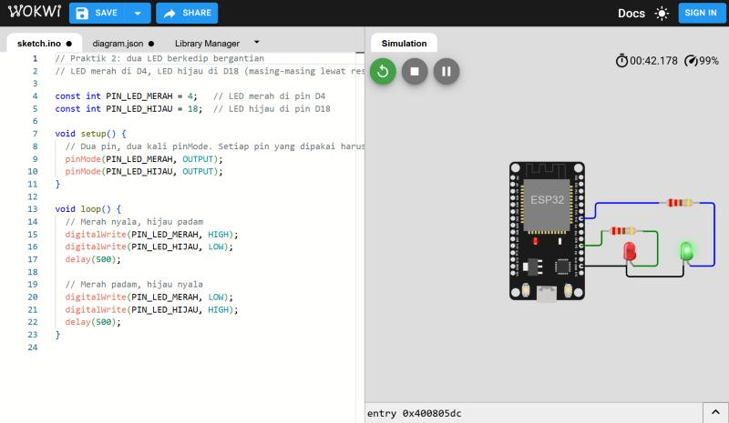

Perhatikan polanya: untuk tiap pin baru kamu perlu (1) komponen dan kabel di diagram, (2) satu `const int` untuk namanya, (3) satu `pinMode` di `setup()`, dan (4) `digitalWrite` di `loop()`. Pola empat langkah ini berlaku untuk relay, buzzer, pompa — semuanya.

### Praktik 3 — Proyek mini: pola kedip "namamu"

> 🖥️ **Alat:** browser → Wokwi, tab `sketch.ino` (rangkaian kembali memakai LED merah di D4; LED hijau boleh dibiarkan, tidak mengganggu).

Ini syarat kelulusan modul: **LED berkedip dengan pola yang kamu rancang sendiri.** Cara paling seru: tulis namamu dengan **kode Morse** — kedip pendek = titik (·), kedip panjang = garis (—).

| Huruf | Morse | Huruf | Morse | Huruf | Morse |
| :---: | :--- | :---: | :--- | :---: | :--- |
| A | · — | J | · — — — | S | · · · |
| B | — · · · | K | — · — | T | — |
| C | — · — · | L | · — · · | U | · · — |
| D | — · · | M | — — | V | · · · — |
| E | · | N | — · | W | · — — |
| F | · · — · | O | — — — | X | — · · — |
| G | — — · | P | · — — · | Y | — · — — |
| H | · · · · | Q | — — · — | Z | — — · · |
| I | · · | R | · — · | | |

Supaya tidak menulis `digitalWrite … delay …` puluhan kali, kita buat satu **resep kecil** bernama `kedip(…)` yang bisa dipanggil berulang kali. (Ini namanya *fungsi* — dibahas tuntas di Modul 3; sekarang cukup tahu cara memakainya.) Kode ini juga ada di [`kode/03-pola-nama/sketch.ino`](kode/03-pola-nama/sketch.ino).

```cpp
// Praktik 3: pola kedip "namamu" dengan kode Morse
// Rangkaian sama dengan Kemenangan Cepat (LED merah di D4)

const int PIN_LED = 4;

const int PENDEK = 200;        // lama kedip pendek (titik), dalam milidetik
const int PANJANG = 600;       // lama kedip panjang (garis)
const int JEDA_KEDIP = 200;    // jeda singkat antara dua kedip
const int JEDA_HURUF = 400;    // jeda antara dua huruf
const int JEDA_ULANG = 1000;   // jeda panjang sebelum pola diulang

// Fungsi kecil = "resep" yang bisa dipanggil berkali-kali
void kedip(int lamaNyala) {
  digitalWrite(PIN_LED, HIGH);
  delay(lamaNyala);           // nyala selama lamaNyala milidetik
  digitalWrite(PIN_LED, LOW);
  delay(JEDA_KEDIP);          // padam sebentar sebelum kedip berikutnya
}

void setup() {
  pinMode(PIN_LED, OUTPUT);
}

void loop() {
  // Contoh pola untuk nama "ANI" (A = · —, N = — ·, I = · ·)
  // Satu huruf = satu baris kedip(...) + satu baris delay(JEDA_HURUF)
  // Ganti dengan huruf-huruf namamu (tabel Morse ada di materi modul)
  kedip(PENDEK); kedip(PANJANG);   // A
  delay(JEDA_HURUF);
  kedip(PANJANG); kedip(PENDEK);   // N
  delay(JEDA_HURUF);
  kedip(PENDEK); kedip(PENDEK);    // I
  delay(JEDA_ULANG);               // jeda panjang, lalu ulang dari awal
}
```

Tugasmu: ganti huruf-huruf di `loop()` dengan huruf-huruf **namamu** (3–5 huruf cukup; nama panggilan boleh). Aturannya: **satu huruf = satu baris** berisi 1–4 panggilan `kedip(…)` (sesuai jumlah titik/garis di tabel), lalu satu baris `delay(JEDA_HURUF);`. Contoh huruf B (— · · ·):

```cpp
  kedip(PANJANG); kedip(PENDEK); kedip(PENDEK); kedip(PENDEK);   // B
  delay(JEDA_HURUF);
```

Nama 4–5 huruf? Salin sepasang baris itu dan tempel sebelum `delay(JEDA_ULANG);`. Ingin iramanya beda? Ubah angka `PENDEK`, `PANJANG`, atau `JEDA_…` di bagian atas — satu angka, berlaku untuk semua huruf. Jalankan, lalu **ambil tangkapan layar** dengan nama `modul-01-pola-nama.png`.

**Simpan juga kodenya.** Ada dua jalur; pilih yang kamu suka:

- **Jalur A (paling mudah, tanpa file di laptop):** salin kode dari Wokwi (klik di dalam editor, **Ctrl + A**, **Ctrl + C**), lalu nanti di Praktik 4 tempel langsung ke GitHub lewat **Add file → Create new file** dengan nama `modul-01-pola-nama.ino`. Caranya persis seperti langkah di bagian ➕ di bawah.
- **Jalur B (menyimpan file di laptop)** — langkah ini sering membuat pemula tersandung, jadi ikuti pelan-pelan:
  1. Klik di dalam editor Wokwi, tekan **Ctrl + A**, lalu **Ctrl + C**.
  2. Buka aplikasi catatan polos: **Notepad** (Windows), **TextEdit** (macOS — pilih menu *Format → Make Plain Text* dulu), atau **Text Editor/gedit** (Linux). Tempel dengan **Ctrl + V**.
  3. *File → Save As*, lalu ketik nama `modul-01-pola-nama.ino` dan pilih folder `belajar-iot`.
  4. Sebelum klik **Save**, cek jebakan akhiran file: **Windows** — ubah *Save as type* menjadi **All files (\*.\*)**; kalau dibiarkan "Text Documents", Notepad diam-diam menambahkan `.txt` sehingga namanya jadi `modul-01-pola-nama.ino.txt`. **macOS** — kalau TextEdit bertanya *Use .txt / Use .ino*, pilih **Use .ino**.
  5. Cek hasilnya di folder. Windows menyembunyikan akhiran file; untuk melihatnya: Windows 11 → File Explorer → menu **View** → **Show** → centang **File name extensions**; Windows 10 → tab **View** → centang **File name extensions**.

> [!TIP]
> Kalau namamu panjang dan polanya jadi membosankan, buat versi "tanda tangan" saja: dua huruf inisial. Yang dinilai bukan panjangnya, melainkan **apakah kamu mengerti angka mana mengatur apa**.

### Praktik 4 — Simpan ke GitHub (lewat browser, tanpa menginstal apa pun)

> 🖥️ **Alat:** browser → [github.com](https://github.com). Siapkan file di folder `belajar-iot`: `modul-01-blink.png`, `modul-01-pola-nama.png`, dan (kalau memakai Jalur B di Praktik 3) `modul-01-pola-nama.ino`. (Belum baca Konsep 8 tentang GitHub? Baca dulu, 3 menit.)

#### 4a. Buat akun GitHub (lewati kalau sudah punya)

1. Buka `https://github.com/signup`.
2. Isi **email**, **kata sandi**, dan **username** (nama pengguna). Username ini akan **terlihat oleh semua orang** dan menjadi bagian alamat repositorimu. Bisa diganti nanti, tapi tautan profil lamamu akan putus — jadi pilih yang rapi sejak awal, misalnya nama asli (`budisantoso`) atau nama + kata (`budi-iot`).
3. Selesaikan teka-teki verifikasi, lalu masukkan kode yang dikirim ke emailmu.
4. GitHub mungkin bertanya beberapa hal (tujuan, minat) — boleh dilewati (*skip*). Kalau ditawari paket, pilih **Free**.

#### 4b. Buat repositori `belajar-iot`

1. Setelah masuk, buka `https://github.com/new` (atau klik tombol **➕** di pojok kanan atas → *New repository*).
2. Isi **Repository name**: `belajar-iot`. Tanda centang hijau "belajar-iot is available" artinya nama tersedia.
3. **Description** (boleh kosong): `Catatan belajar Fullstack IoT Developer`.
4. Biarkan **Public** — supaya nanti bisa kamu tunjukkan saat bertanya dan jadi portofolio. (Tidak ada rahasia di sini; kata sandi WiFi dan sejenisnya tidak akan pernah kita simpan di repositori — itu pelajaran Modul 10.)

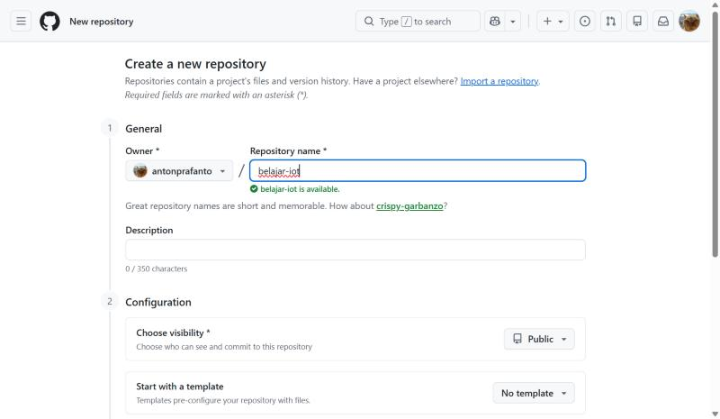

5. Gulir ke bawah. **Nyalakan "Add README"** (klik sakelarnya sampai menjadi hijau/*On*). Ini penting: repositori yang punya README langsung menampilkan tombol unggah yang mudah. (README = file "baca saya" yang tampil di halaman depan repositori; lihat Konsep 8.)
6. Klik tombol hijau **Create repository**.

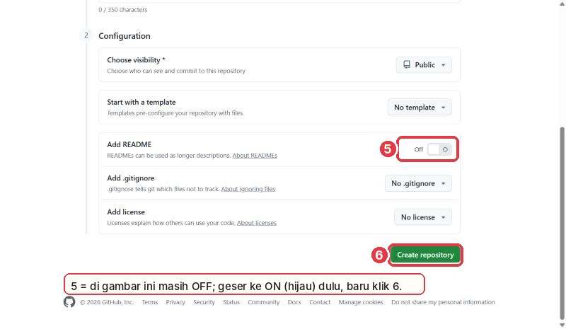

#### 4c. Unggah file

1. Di halaman repositori barumu (isinya baru satu file, `README.md`), cari tombol **➕** di samping kotak "Go to file" (atau tombol **Add file**, tergantung tampilan), lalu pilih **Upload files**.

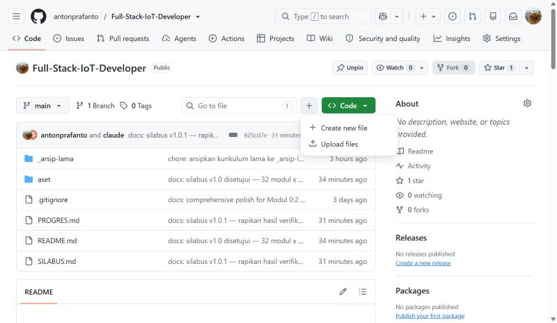

2. **Seret** file-file dari folder `belajar-iot` ke kotak bertuliskan *"Drag files here to add them to your repository"*, atau klik **choose your files** dan pilih filenya (tahan **Ctrl** sambil mengeklik untuk memilih beberapa file sekaligus; atau unggah satu per satu).

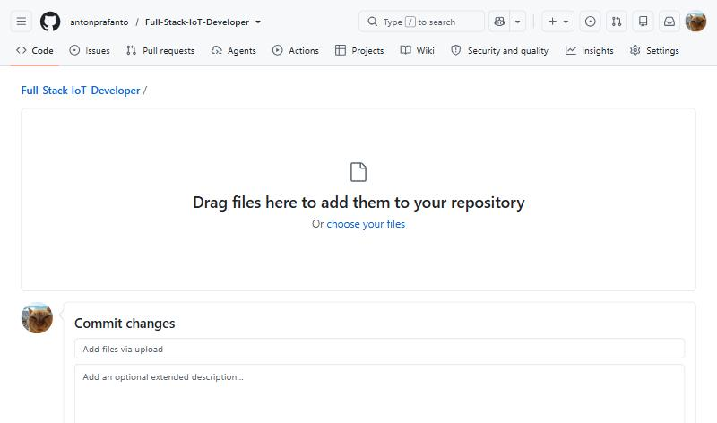

3. Gulir ke bawah ke bagian **Commit changes**. Kotak pertama adalah **pesan commit** — catatan singkat tentang perubahan ini. Ganti isinya menjadi `Modul 1: blink pertama dan pola nama`. (*Commit* = "menyimpan satu foto kemajuan" — istilah ini akan kamu pakai ratusan kali.)
4. Klik tombol hijau **Commit changes** (di bawah formulir). Tunggu beberapa detik; kamu kembali ke halaman repositori dan file-filemu sudah ada di daftar.
5. Memakai **Jalur A** untuk kode? Sekarang: **➕ / Add file → Create new file**, ketik nama `modul-01-pola-nama.ino`, tempel kodenya di kotak besar, lalu **Commit changes…** → **Commit changes**.

#### 4d. Tulis catatan di README (opsional, 3 menit)

1. Klik file **`README.md`** → klik ikon **pensil ✏️** (*Edit*) di kanan atas.
2. Tempel teks ini di bawah judul yang sudah ada, lalu isi bagian yang ada di dalam kurung. Biarkan tanda `##`, `**`, dan `` apa adanya.

```markdown
## Modul 1 — LED berkedip pertama (tanggal: …)


Pola kedip nama saya: **(NAMA)** → (tulis polanya, misalnya "· — / — · / · ·")


Yang paling membingungkan minggu ini: (tulis jujur, satu kalimat)
```

3. Klik **Commit changes…** (kanan atas) → **Commit changes**.

> [!NOTE]
> Tanda-tanda seperti `##`, `**`, dan `` adalah **Markdown**, cara menulis teks berformat di GitHub: `##` = judul, `**tebal**`, `` = sisipkan gambar. Artikel ini pun ditulis dengan Markdown.

Buka halaman utama repositorimu: README-nya sekarang menampilkan kedua tangkapan layar. Alamat `https://github.com/USERNAME/belajar-iot` adalah **portofolio pertamamu** — simpan tautannya.

> [!NOTE]
> Nama file sebaiknya **tanpa spasi** dan huruf kecil semua (`modul-01-blink.png`, bukan `Modul 1 Blink.PNG`). Spasi dan huruf kapital sering membuat tautan gambar tidak muncul.

### Praktik 5 — Pesan Kit A Tahap 1 (supaya Modul 2 tidak menunggu)

> 🖥️ **Alat:** browser/aplikasi Tokopedia, Shopee, atau toko elektronik langgananmu. Belum perlu membuka Wokwi.

Pengiriman dari toko komponen biasanya 2–7 hari. Kalau dipesan **minggu ini**, paket datang tepat saat Modul 2 dimulai. Kalau kit belum sampai saat Modul 2, tenang: Modul 2 menyediakan jalur Wokwi dulu.

#### Yang paling sering salah beli: papannya

Ada belasan papan yang namanya mengandung "ESP32". Kurikulum ini memakai **ESP32 DevKit V1, 30 pin** (sering ditulis "DOIT ESP32 DevKit V1"). Begini cara membedakannya dari yang mirip (gambar skematis, bukan foto produk — cocokkan ciri-cirinya dengan foto di toko):

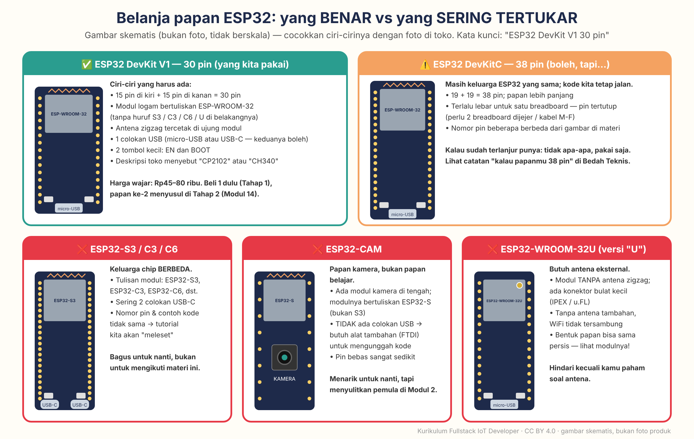

Inilah wujud aslinya, lengkap dengan ciri yang harus kamu cari di foto produk:

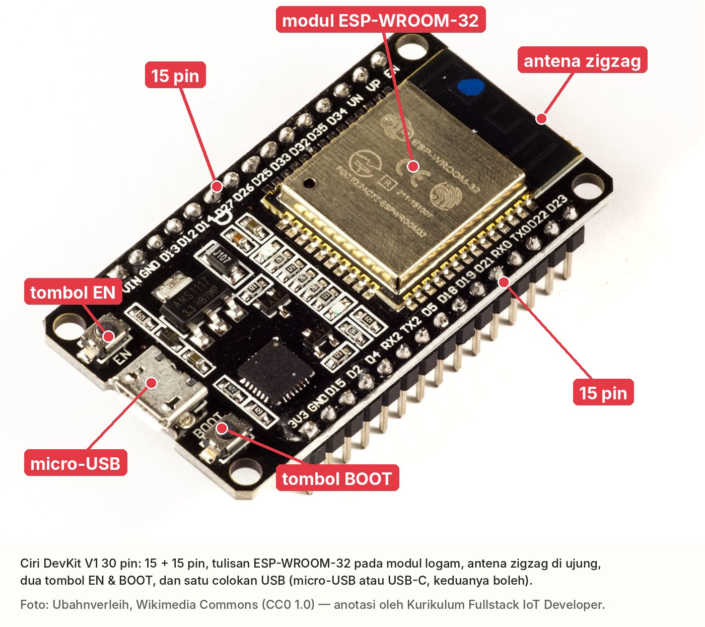

Kesalahan paling sering nomor dua: **kabel USB**. Banyak kabel murah hanya punya dua kawat (untuk mengecas) tanpa kawat data — papan menyala, tapi laptop "tidak melihatnya". Cari yang deskripsinya menyebut **"kabel data"** dan cocokkan konektornya (micro-USB atau USB-C) dengan papan yang kamu beli. Punya kabel di rumah dan ingin mengujinya? Colokkan HP ke laptop dengan kabel itu: kalau HP menawarkan "Transfer file"/MTP, itu kabel data.

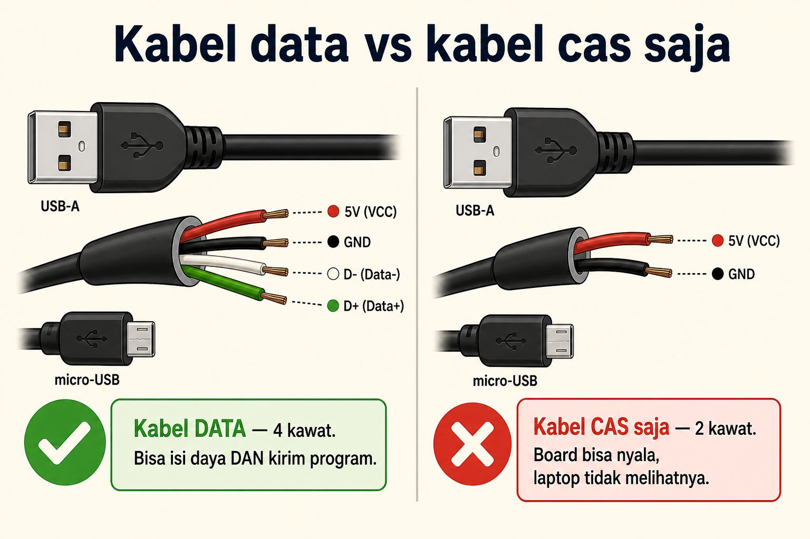

#### Daftar belanja Tahap 1

Daftar lengkap beserta harga ada di [Silabus §5.2](../../SILABUS.md#52-kit-a--esp32--elektronika-dasar). Ini ringkasannya — kolom **kata kunci** tinggal disalin ke kotak pencarian toko. Kamu belum perlu paham arti setiap komponen; semuanya dijelaskan saat dipakai.

**Wajib untuk Modul 2** (pesan sekarang):

| Komponen | Jml | Kata kunci pencarian | Catatan |
| :--- | :---: | :--- | :--- |
| ESP32 DevKit V1 30 pin | 1 | `ESP32 DevKit V1 30 pin` | Lihat panduan di atas. Deskripsi toko menyebut chip USB **CP2102** atau **CH340** — keduanya boleh. Rp45–80 ribu. |
| Kabel USB **data** | 1 | `kabel data micro usb` / `kabel data usb c` | Sesuaikan konektor papan. |
| Breadboard 830 titik | 2 | `breadboard 830` | Dua buah supaya papan 30 pin lega. |
| Kabel jumper M-M, M-F, F-F | 1 set | `kabel jumper 40 pin set` | M = jantan (colokan), F = betina (lubang). |
| LED 5 mm aneka warna + paket resistor | 1 set | `led 5mm set`, `resistor pack 1/4 watt` | Pastikan ada 220 Ω, 1 kΩ, 4,7 kΩ, 10 kΩ. |
| Kapasitor 100 µF dan 100 nF | 2 + 2 (masing-masing 2 buah) | `kapasitor elektrolit 100uF`, `kapasitor keramik 104` | "104" = 100 nF. |
| Multimeter digital | 1 | `multimeter digital` | Dipakai sejak Modul 2 untuk mengukur tegangan dan resistor; Rp50–100 ribu, investasi seumur hidup. |

<details>
<summary><b>Boleh sekalian dipesan untuk Modul 5–6 (hemat ongkos kirim) — klik untuk membuka</b></summary>

| Komponen | Jml | Kata kunci pencarian | Catatan |
| :--- | :---: | :--- | :--- |
| Adaptor 5 V ≥ 2 A + modul catu daya breadboard MB102 | 1 + 1 | `adaptor 5v 2a`, `MB102 breadboard power supply` | Modul 5. |
| Push button (tombol tekan), potensiometer 10 kΩ, buzzer pasif | masing-masing 2 buah | `push button 12mm`, `potensiometer 10k`, `buzzer pasif` | Modul 5. |
| Relay 1–2 kanal 5 V *low-level trigger* | 1 | `relay 2 channel 5v low level trigger` | Pilih yang ber-*optocoupler*. Modul 5. |
| Kipas DC 5 V 40 mm, pompa mini 3–5 V + selang | 1 + 1 | `kipas dc 5v 4cm`, `pompa mini 5v dc` | Beban untuk relay/MOSFET. Modul 5. |
| MOSFET IRLZ44N (atau modul D4184) + dioda 1N4007 | 1 + 1 | `IRLZ44N`, `dioda 1N4007` | **Bukan** modul IRF520. Modul 5. |
| Servo SG90 | 1 | `servo sg90` | Modul 5. |
| DHT22 modul 3 pin | 1 | `DHT22 modul` | Bukan DHT11. Modul 6. |
| LDR 5 mm | 2 | `LDR 5mm` | Modul 6. |
| Sensor kelembapan tanah **kapasitif** | 2 | `capacitive soil moisture sensor v1.2` | Bukan yang berpelat tembaga terbuka. Modul 6. |
| Ultrasonik 3,3 V (HC-SR04+ / RCWL-1601) | 1 | `HC-SR04+ 3.3V` / `RCWL-1601` | HC-SR04 biasa boleh, tapi perlu 2 resistor tambahan. Modul 6. |
| PIR HC-SR501 | 1 | `PIR HC-SR501` | Modul 6. |

</details>

Perkiraan total Tahap 1: **Rp300–620 ribu** (Oktober 2026, bisa berubah). Paket "ESP32 starter kit" sering lebih murah — boleh asalkan isinya memuat tabel **Wajib** di atas dan papannya benar. Syarat lulus modul ini: **minimal tabel Wajib sudah dipesan sekarang**; sisa Tahap 1 boleh menyusul, paling lambat sebelum Modul 5.

> [!WARNING]
> Sebelum klik "beli", cek **tiga hal**: (1) foto papan menunjukkan **30 pin** dan tulisan **ESP-WROOM-32**, (2) kabelnya **kabel data**, (3) paket resistornya mengandung **220 Ω**. Tiga kesalahan ini menyumbang hampir semua "Modul 2 saya macet".

Setelah memesan, catat **tanggal pesan** dan **perkiraan tanggal tiba** di catatanmu (atau di README repositorimu).

### Praktik 6 — Latihan bertanya yang baik (termasuk kepada AI)

> 🖥️ **Alat:** aplikasi catatan apa saja. Ini latihan menulis, 15 menit. (Konsep 9 tentang "versi" dibutuhkan di sini.)

Pembelajar mandiri paling sering berhenti bukan karena materinya sulit, melainkan karena **macet sendirian** lalu malu bertanya — atau bertanya dengan cara yang tidak bisa dijawab. Bandingkan:

> ❌ *"Kak, kok LED-nya nggak nyala ya? Udah ikutin tutorial. Tolong."*

Tidak ada yang bisa menjawab ini kecuali dengan dua puluh pertanyaan balik. Versi yang **bisa dibantu dalam satu balasan**:

> ✅ *"Halo, saya mengerjakan Modul 1 kurikulum Fullstack IoT di **Wokwi** (browser Chrome, Windows 11). Tujuan: LED di pin D4 berkedip. **Yang terjadi:** setelah saya mengeklik ▶, muncul 'Build failed!' dengan pesan `sketch.ino:15:19: error: expected ';' before 'digitalWrite'`. **Kode lengkap** ada di https://github.com/budi/belajar-iot/blob/main/modul-01-pola-nama.ino. **Yang sudah dicoba:** menyalin ulang kode dari materi (tetap error), mengganti browser ke Edge. Tangkapan layar error terlampir."*

Polanya selalu sama. Salin templat ini ke catatanmu dan isi setiap kali bertanya:

```text
1. KONTEKS      : modul/tutorial apa, alat & VERSI (Wokwi / Arduino IDE 2.x + core arduino-esp32 3.3.x / Node.js 24), OS.
2. TUJUAN       : apa yang seharusnya terjadi (satu kalimat).
3. KENYATAAN    : apa yang terjadi — salin PESAN ERROR persis, jangan diketik ulang/diringkas.
4. KODE         : tautan ke file di GitHub, atau kode lengkap (bukan potongan).
5. GAMBAR       : foto rangkaian (perangkat keras) / tangkapan layar (perangkat lunak).
6. SUDAH DICOBA : 2–3 hal yang sudah dicoba dan hasilnya.
```

**Ke mana bertanya?**

- *Issue* (tiket pertanyaan/laporan) di repositori kurikulum ini — klik tab **Issues** di bagian atas halaman repositori; penulis dan pembelajar lain membacanya.
- Komunitas Wokwi di Discord (tautan di menu Wokwi) — ramah pemula; cukup dengan bahasa Inggris sederhana.
- Grup Facebook/Telegram "ESP32 Indonesia" / "Arduino Indonesia".
- Forum resmi Arduino dan r/esp32 di Reddit.

**Memakai asisten AI (ChatGPT, Claude, Gemini) dengan benar.** AI sangat membantu untuk *menjelaskan pesan error* dan *memberi ide*, tapi ia sering dengan percaya diri menyarankan cara lama (lihat Konsep 9). Dua aturan: **sebutkan versi** dan **uji jawabannya**. Contoh *prompt* (teks pertanyaan untuk AI) yang menghasilkan jawaban berguna:

```text
Saya pemula, belajar ESP32 dengan core arduino-esp32 versi 3.3.x (bukan 2.x) di simulator Wokwi.
Kode saya di bawah menghasilkan error:
  sketch.ino:14:13: error: expected ';' before 'digitalWrite'
Tolong jelaskan artinya dengan bahasa sederhana, tunjukkan baris yang salah,
dan JANGAN mengganti library (pustaka kode) atau cara penulisan ke versi lama.
[tempel kode lengkap di sini]
```

Latihan: tulis satu pertanyaan "versi ✅" tentang hal apa pun yang membingungkanmu di modul ini (boleh pura-pura ada error). Simpan di catatanmu — minggu depan kamu akan benar-benar membutuhkannya.

---

## 🚨 Kalau Tidak Jalan?

Kotak ini selalu dibuka dengan tabel **"kode lama → yang benar untuk versi kita"** karena 80% masalah pemula berasal dari tutorial lain yang ditulis untuk versi berbeda.

| Yang sering ditemui di tutorial lain | Yang benar untuk kurikulum ini (core arduino-esp32 3.3.x, Wokwi) | Kenapa |
| :--- | :--- | :--- |
| `digitalWrite(LED_BUILTIN, HIGH);` | `const int PIN_LED = 4;` lalu `digitalWrite(PIN_LED, HIGH);` | `LED_BUILTIN` tidak didefinisikan untuk semua papan ESP32 → error *"not declared"*. Pakai nomor pin yang jelas. |
| `#define LED 2` + mengandalkan LED kecil di papan | LED **eksternal** di D4 + resistor | LED bawaan papan tidak ada di semua tiruan papan dan tidak tampak di semua simulator; LED eksternal pasti terlihat. |
| `ledcSetup(…)` + `ledcAttachPin(…)` (akan muncul di Modul 5) | `ledcAttach(pin, frekuensi, resolusi)` | Berubah di core 3.x. Belum dipakai minggu ini; dicatat supaya kamu tidak kaget. |
| `diagram.json` dengan `"board-esp32-devkit-c-v4"` (papan bawaan Wokwi, 38 pin) | `"wokwi-esp32-devkit-v1"` (30 pin) | Supaya gambar di simulator sama dengan papan yang kamu beli. Keduanya jalan; catatan untuk pemilik papan 38 pin ada di 🔬. |
| `Delay(500)` / `digitalwrite(…)` | `delay(500)` / `digitalWrite(…)` | C++ membedakan huruf besar-kecil. |

Berikut masalah paling umum di tahap ini:

<details>
<summary><b>"Build failed!" — kotak merah berisi pesan error</b></summary>

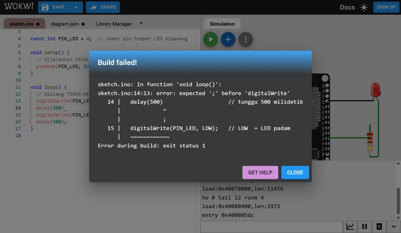

Ini **bukan** tanda kamu tidak berbakat — ini kompiler sedang menunjukkan tepat di mana ia bingung. Cara membacanya:

- `sketch.ino:14:13` → file `sketch.ino`, **baris 14**, kolom 13. Lihat nomor baris di kiri editor. Di situlah — tepat di ujung baris 14, `delay(500)` — titik koma yang hilang.
- `error: expected ';' before 'digitalWrite'` → "saya mengharapkan titik koma **sebelum** kata digitalWrite". Kata `digitalWrite` adalah perintah **berikutnya** (baris 15); kompiler baru sadar ada yang kurang saat bertemu kata itu. Jadi, yang perlu diperbaiki tetap **baris 14**: tambahkan `;` di ujungnya.
- Tanda `^` dan `;` di bawah kode menunjukkan posisi persis yang disarankan.

Error lain yang sering muncul:

| Pesan | Artinya | Perbaikan |
| :--- | :--- | :--- |
| `'PIN_LED' was not declared in this scope` | Nama dipakai, tapi belum dibuat, atau salah ketik (`PIN_LED` vs `PIN_led`). | Cek baris `const int …`; samakan ejaannya. |
| `expected '}' at end of input` | Kurung kurawal tidak berpasangan. | Hitung `{` dan `}`; biasanya hilang satu di akhir `loop()`. |
| `'digitalwrite' was not declared` | Salah huruf besar-kecil. | `digitalWrite`. |
| `expected unqualified-id` / `stray '\342'` | Ada karakter aneh, biasanya tanda petik "pintar" (“ ”) dari aplikasi catatan/Word. | Salin ulang dari materi, bukan dari Word. |

Setelah memperbaiki, klik ▶ lagi. Kalau error-nya berbeda, bagus — kamu maju satu langkah.
</details>

<details>
<summary><b>LED dan resistor tidak muncul setelah menempel diagram.json</b></summary>

- Pastikan kamu menempel ke tab **`diagram.json`**, bukan `sketch.ino`.
- Pastikan editor **kosong** sebelum menempel (**Ctrl + A** lalu **Delete**). Kalau ada sisa teks lama, JSON-nya rusak dan Wokwi diam-diam mengabaikannya atau menampilkan garis merah.
- Arahkan kursor ke garis merah bergelombang (jika ada): pesannya biasanya *"Expected comma"* atau *"Unexpected token"* → ada koma/kurung yang hilang. Paling mudah: hapus semua dan tempel ulang dari materi.
- Papan tidak terlihat utuh di panel? Putar roda mouse di panel kanan untuk memperbesar/memperkecil, atau seret latar abu-abu untuk menggeser.
</details>

<details>
<summary><b>Simulasi jalan, tapi LED tidak menyala sama sekali</b></summary>

- Cek kabel: `esp:D4 → r1:1`, `r1:2 → led1:A`, `led1:C → esp:GND.1`. Kalau `A` dan `C` tertukar, LED tidak menyala (tidak rusak, cukup ditukar balik).
- Cek angka pin di kode: `PIN_LED = 4` harus sama dengan pin di diagram (`esp:D4`). LED dipindah ke D18 di diagram, tapi kode masih 4 → tidak menyala.
- `delay` sangat kecil (`delay(1)` atau `delay(2)`)? LED tampak redup/setengah terang, bukan mati. Kembalikan ke 500.
- Lupa `pinMode(PIN_LED, OUTPUT);` → pin tidak mengeluarkan listrik yang cukup; LED redup/mati.
</details>

<details>
<summary><b>"Compiling project…" lama sekali atau macet</b></summary>

- Wokwi gratis memakai antrean server; 5–20 detik itu normal, sampai sekitar 1 menit saat ramai. Tunggu.
- Kalau lebih dari 2 menit: klik **CANCEL**, muat ulang halaman (**F5**), tempel ulang kode, coba lagi.
- Penghitung simulasi berjalan, tapi sangat lambat (misalnya "10%")? Tutup tab lain yang berat atau pindah ke browser Chrome/Edge. Simulator butuh tenaga komputer.
</details>

<details>
<summary><b>Tombol SAVE meminta masuk (login) / proyek hilang</b></summary>

Wokwi hanya menyimpan proyek untuk pengguna yang sudah masuk. Daftar gratis (pakai Google atau GitHub), lalu klik SAVE. Kalau proyek sudah hilang: tidak masalah — tempel ulang dari `kode/01-blink/` (2 menit).
</details>

<details>
<summary><b>GitHub: tidak ada tombol "Upload files"</b></summary>

- Repositori dibuat **tanpa README** → GitHub menampilkan halaman "Quick setup" yang membingungkan. Cari tautan kecil **"uploading an existing file"** di halaman itu — fungsinya sama. Atau klik **Add file → Create new file**, buat `README.md` berisi satu baris, lakukan commit, lalu tombol **Upload files** muncul.
- Kamu tidak sedang masuk (*login*) → tombol tidak muncul. Cek pojok kanan atas.
</details>

<details>
<summary><b>GitHub: gambar tidak muncul di README</b></summary>

- Nama file di teks harus **persis** sama dengan nama file yang diunggah, termasuk huruf besar-kecil dan akhiran (`.png` vs `.PNG`).
- Nama file ada spasinya → ganti nama tanpa spasi, unggah ulang.
- File lebih dari 25 MB tidak bisa diunggah lewat browser → perkecil tangkapan layarnya.
- File kodemu bernama `modul-01-pola-nama.ino.txt`? Itu jebakan Notepad (lihat Praktik 3 langkah 3) — ganti namanya, unggah ulang.
</details>

> [!TIP]
> **Aturan 2 jam.** Kalau satu masalah belum selesai setelah 2 jam, berhenti. Tulis pertanyaan "versi ✅" (Praktik 6), kirim, lalu lanjut ke bagian lain atau istirahat. Otak yang beristirahat sering menemukan jawabannya sendiri besok pagi.

---

## 🔬 Bedah Teknis (opsional)

Bagian ini untuk yang penasaran "di balik layar". **Boleh dilewati** — tidak ada isi bagian ini yang menjadi syarat lulus.

<details>
<summary><b>Sejarah 3 menit: Arduino dan ESP32</b></summary>

**Arduino** lahir pada 2005 di sebuah sekolah desain di Ivrea, Italia, dari keinginan sederhana: supaya mahasiswa desain (bukan insinyur) bisa membuat benda interaktif. Resepnya: papan murah + cara menulis kode yang disederhanakan (`setup()`/`loop()`, `digitalWrite`) + komunitas yang berbagi contoh. Resep itulah yang kamu pakai hari ini, meski chip-nya bukan buatan Arduino.

**ESP32** dibuat oleh Espressif Systems (Shanghai) dan dirilis pada 2016 sebagai penerus ESP8266 (2014) yang mengejutkan dunia karena menyediakan WiFi seharga segelas kopi. ESP32 menambah Bluetooth, dua inti prosesor, dan banyak pin. Espressif lalu membuat *core* (paket penerjemah) supaya ESP32 bisa diprogram dengan gaya Arduino — itulah **arduino-esp32** yang versinya (3.3.x) kita sebut-sebut sejak tadi. Versi 3.x (2024) dibangun di atas ESP-IDF 5, kerangka resmi Espressif, dan di situlah beberapa nama perintah berubah. Di dalam core itu juga berjalan sistem operasi mini bernama **FreeRTOS** — jadi "tanpa OS" di Konsep 3 adalah penyederhanaan: tidak ada OS *seperti Windows*, tapi ada pengatur tugas kecil yang akan kamu manfaatkan di Modul 8.

Keluarga ESP32 kini beranggotakan banyak chip (S2, S3, C3, C6, H2, P4…). Kurikulum ini memakai **ESP32 "klasik"** (modul ESP-WROOM-32) karena paling murah, paling banyak contohnya, dan tersedia di Wokwi.
</details>

<details>
<summary><b>Anatomi diagram.json</b></summary>

```json
{
  "version": 1,                       // format file; selalu 1
  "author": "…", "editor": "wokwi",   // informasi saja
  "parts": [                          // DAFTAR KOMPONEN
    { "type": "wokwi-esp32-devkit-v1",   // jenis komponen (nama baku Wokwi)
      "id": "esp",                       // nama panggilan, bebas, harus unik
      "top": 0, "left": 0,               // posisi di layar
      "attrs": {} },                     // pengaturan tambahan
    { "type": "wokwi-resistor", "id": "r1", "top": 94.35, "left": 130,
      "attrs": { "value": "220" } },     // nilai dalam ohm
    { "type": "wokwi-led", "id": "led1", "top": 107, "left": 150,
      "attrs": { "color": "red" } }      // warna LED
  ],
  "connections": [                    // DAFTAR KABEL: [dari, ke, warna, belokan]
    [ "esp:TX0", "$serialMonitor:RX", "", [] ],   // dua baris ini menyambungkan
    [ "esp:RX0", "$serialMonitor:TX", "", [] ],   // "catatan harian" chip ke kotak hitam
    [ "esp:D4", "r1:1", "green", [] ],            // [] = Wokwi memilih jalur sendiri
    [ "r1:2", "led1:A", "green", [ "h20", "v49" ] ],  // belokan: ke kanan 20, ke bawah 49
    [ "led1:C", "esp:GND.1", "black", [] ]
  ]
}
```

(Catatan: JSON asli **tidak boleh** berisi komentar `//`; di atas hanya untuk penjelasan. Pakai file di `kode/` untuk ditempel.)

Setiap pin ditulis `id:namaPin`. Nama pin papan mengikuti tulisan di papan fisik (`D4`, `D18`, `3V3`, `VIN`); karena papan punya **dua** pin GND, Wokwi menomorinya `GND.1` (sisi kanan, dekat 3V3) dan `GND.2` (sisi kiri, dekat VIN). Pin LED adalah `A` dan `C`; pin resistor `1` dan `2`. Daftar lengkap komponen dan pinnya ada di [docs.wokwi.com](https://docs.wokwi.com/) → *Parts*. Kamu bisa menggeser komponen dengan mouse — Wokwi akan menulis ulang angka `top`/`left` sendiri.
</details>

<details>
<summary><b>Apa yang terjadi saat tombol ▶ diklik</b></summary>

1. Isi `sketch.ino` dikirim ke **server kompilasi** Wokwi. Di sana kompiler C++ untuk ESP32 (yang sama dengan yang nanti kamu pasang di Arduino IDE) menerjemahkannya menjadi file biner (`.bin`). Inilah jeda "Compiling project…". Kalau ada kesalahan tata bahasa, server mengembalikan pesan *Build failed*.
2. File biner diunduh ke browsermu.
3. Di browser, Wokwi menjalankan **emulator**: program yang meniru CPU ESP32 instruksi demi instruksi, lengkap dengan pin-pinnya. LED di layar menyala karena emulator "melihat" pin D4 bertegangan — bukan karena ada animasi yang dibuat khusus.
4. Teks aneh di kotak hitam adalah ***serial monitor*** (monitor serial): pesan yang dikirim chip lewat pin TX0 saat *booting* (memuat program). Mulai Modul 3, kamu sendiri yang akan mengirim pesan ke sana dengan `Serial.println(…)` untuk "mengintip isi otak chip".

Karena emulatornya berjalan di browser, kecepatan simulasi bergantung pada laptopmu — itulah angka persen di pojok kanan atas (100% = secepat chip asli).
</details>

<details>
<summary><b>Kenapa pin D4 dan D18, bukan pin 2 (LED bawaan papan)?</b></summary>

Papan DevKit V1 asli punya LED kecil berwarna biru yang tersambung ke **GPIO 2**; banyak tutorial memakainya. Kurikulum ini memilih **LED eksternal di GPIO 4** (dan GPIO 18 untuk LED kedua) karena tiga alasan: (1) tidak semua tiruan papan punya LED itu dan tidak semua simulator menampilkannya; (2) kamu langsung berlatih merangkai, yang memang tujuan Modul 2; (3) GPIO 4 dan 18 adalah pin "aman" — tidak punya peran khusus saat chip menyala. Beberapa pin ESP32 (0, 2, 5, 12, 15) punya peran khusus saat *booting* dan bisa membuat papan gagal menyala atau berkedip sekejap jika dibebani; pin-pin ini dibahas tuntas di **peta pin kanonik** Modul 5. Sampai saat itu, ikuti nomor pin di materi.
</details>

<details>
<summary><b>Kalau papanmu 38 pin (ESP32 DevKitC)</b></summary>

Kodenya sama persis; yang berbeda hanya gambar di simulator dan letak pin di papan fisik. Di Wokwi, ganti baris papan di `diagram.json` menjadi `{ "type": "board-esp32-devkit-c-v4", "id": "esp", "top": 0, "left": 0, "attrs": {} }` — lalu perhatikan dua perbedaan: pin serialnya bernama `TX` dan `RX` (bukan `TX0`/`RX0`), jadi dua baris `$serialMonitor` harus diubah menjadi `"esp:TX"` dan `"esp:RX"`; dan nama pin GPIO ditulis tanpa huruf D (`"esp:4"` bukan `"esp:D4"`, `"esp:GND.1"` tetap). Di papan fisik nanti (Modul 2), cari label `D4`/`IO4`/`4` di samping pinnya — nomor GPIO-nya sama, hanya posisinya yang bergeser.
</details>

---

## 🧩 Tantangan mandiri

Tiga tingkat, dari "ubah sedikit" sampai "buat sendiri". Kerjakan minimal tingkat 1. Semua di Wokwi, dengan rangkaian dari Praktik 2 (dua LED).

**Tingkat 1 — Ubah sedikit: detak jantung.** Buat LED merah berkedip dengan pola "dug-dug … dug-dug …": dua kedip cepat (nyala 100 ms, padam 100 ms, nyala 100 ms), lalu diam 700 ms. Cukup pakai `digitalWrite` dan `delay`.

**Tingkat 2 — Isi rumpang: lampu lalu lintas.** Tambahkan LED **kuning** di pin **D19** (resistor 220 Ω; kaki C ke kaki C LED lain), lalu lengkapi bagian `___` di kode ini sehingga urutannya: hijau 3 detik → kuning 1 detik → merah 3 detik → ulang.

```cpp
const int PIN_MERAH  = 4;
const int PIN_KUNING = ___;
const int PIN_HIJAU  = 18;

void setup() {
  pinMode(PIN_MERAH, OUTPUT);
  pinMode(___, OUTPUT);
  pinMode(PIN_HIJAU, OUTPUT);
}

void loop() {
  digitalWrite(PIN_HIJAU, HIGH);
  delay(___);
  digitalWrite(PIN_HIJAU, LOW);

  digitalWrite(PIN_KUNING, ___);
  delay(1000);
  digitalWrite(PIN_KUNING, LOW);

  digitalWrite(___, HIGH);
  delay(3000);
  digitalWrite(PIN_MERAH, ___);
}
```

**Tingkat 3 — Dari nol: SOS dua warna.** Rancang sendiri program yang mengirim sinyal darurat **SOS** (· · · — — — · · ·) dengan LED merah, kemudian "jawaban" **OK** (— — — / — · —) dengan LED hijau, lalu jeda 2 detik, dan ulang dari awal. Petunjuk: buat dua fungsi, `kedipMerah(int lama)` dan `kedipHijau(int lama)`, meniru `kedip(…)` di Praktik 3. Tidak ada kunci jawaban untuk tingkat 3 — kalau LED-nya berkedip seperti yang kamu rencanakan, kamu benar.

Unggah hasil tantangan (tangkapan layar + kode) ke repositori `belajar-iot` — latihan ekstra untuk Praktik 4.

---

## ➕ Tambahan ke "Rumah Pintar Mini"

Sumbangan Modul 1 ke proyek benang merah bukan kode, melainkan **arah**: halaman *visi proyek* — apa yang ingin **kamu** pantau dan kendalikan di rumah/kos/kebunmu sendiri. Ini bukan formalitas. Di Modul 6 kamu membandingkan sensor yang kita pakai dengan keinginanmu di sini. Di Modul 19 kamu menulis aturan otomatis dari kalimat "KALAU … MAKA …" yang kamu tulis sekarang. Di Modul 31 (*capstone*, proyek akhir) kamu bebas membangun versimu sendiri.

1. Buka [`kode/visi-proyek-TEMPLATE.md`](kode/visi-proyek-TEMPLATE.md), salin isinya (tombol **Raw** / ikon salin — lihat tip di Praktik 2).
2. Di repositori `belajar-iot`: **➕ / Add file → Create new file**, beri nama `visi-proyek.md`, tempel, lalu isi enam bagiannya (15–20 menit; jawaban satu-dua kalimat cukup).
3. **Commit changes**.

Contoh isian singkat supaya ada bayangan: *"Tempat: kamar kos 3×3 m dan dua pot cabai di jendela. Pantau: suhu kamar, kelembapan tanah pot, apakah lampu lupa dimatikan. Kendalikan: kipas, pompa mini. Aturan: KALAU tanah kering lebih dari 6 jam, MAKA siram selama 20 detik dan kirim pesan Telegram. Pengguna lain: teman sekamar. Alasan: ingin pindah karier ke IoT dalam setahun."*

---

## 📖 Glosarium

| Istilah | Arti ramah awam |
| :--- | :--- |
| **IoT** (*Internet of Things*) | Benda biasa yang diberi sensor dan koneksi supaya bisa melapor dan diperintah dari jauh. |
| **Fullstack** | Menguasai semua lapisan sistem: dari sensor di benda sampai tampilan di HP. |
| **Mikrokontroler** | Komputer mungil tanpa sistem operasi seperti Windows, yang menjalankan satu program selamanya. ESP32 salah satunya. |
| **ESP32** | Mikrokontroler murah buatan Espressif dengan WiFi dan Bluetooth; chip utama kurikulum ini. |
| **Papan** (*board*, DevKit) | Papan sirkuit yang memuat chip ESP32 beserta colokan USB, tombol, dan pin — supaya chip bisa langsung dipakai. |
| **Node** | Satu perangkat (ESP32 + sensor/aktuatornya) dalam sistem IoT. Proyek kita punya Node 1 "Rumah" dan Node 2 "Kebun". |
| **Pin / GPIO** | "Kaki" logam di papan yang bisa mengeluarkan atau membaca sinyal listrik. GPIO = *general purpose input/output*, pin serbaguna; `D4` = GPIO nomor 4. |
| **LED** | Lampu kecil hemat daya yang hanya mau dialiri arus satu arah (kaki panjang = +). |
| **Resistor** | Komponen "penyempit pipa" yang membatasi arus; nilainya dalam ohm (Ω). |
| **GND** (*ground*) | Titik nol listrik; tempat arus "pulang". |
| **HIGH / LOW** | Perintah pin: keluarkan listrik (3,3 V) / jangan (0 V). |
| **Sketch** (`.ino`) | Sebutan Arduino untuk file program. |
| **Firmware** | Program yang tertanam di chip; sketch yang sudah dikompilasi dan dikirim ke chip. |
| **Kompiler** | "Juru masak" yang menerjemahkan kode teks menjadi bahasa mesin (0 dan 1). |
| **`setup()` / `loop()`** | Dua bagian wajib program Arduino: dijalankan sekali / diulang selamanya. |
| **`delay(ms)`** | Perintah "tunggu" selama sekian milidetik (1.000 ms = 1 detik). |
| **Simulator (Wokwi)** | ESP32 tiruan di browser; kode yang jalan di sini hampir selalu jalan di papan asli. |
| **JSON** | Format teks rapi untuk data, dipakai `diagram.json` (dan nanti untuk kiriman sensor di Modul 4+). |
| **Repositori (repo)** | "Folder di internet yang mengingat setiap perubahan" — satu proyek di GitHub. |
| **Commit** | Menyimpan satu "foto kemajuan" ke repositori, disertai pesan singkat. |
| **README** | File catatan utama sebuah repositori; tampil otomatis di halaman depannya. |
| **Markdown** | Cara menulis teks berformat dengan tanda sederhana (`##` judul, `**tebal**`); dipakai di README. |
| **Versi** | Nomor rilis alat/pustaka. Berbeda versi → bisa berbeda perintah. Selalu sebutkan saat bertanya. |
| **Core (arduino-esp32)** | Paket penerjemah yang membuat ESP32 bisa diprogram gaya Arduino; kita memakai 3.3.x. |
| **Library** (pustaka) | Kode siap pakai buatan orang lain yang bisa kita panggil; dibahas di Modul 3. |

---

## 📝 Kuis 5 soal

Jawab dulu di kepala atau di catatan, baru buka kuncinya. Lulus = minimal 4 benar.

1. Apa perbedaan paling mendasar antara laptop dan mikrokontroler seperti ESP32?
2. Dalam kode Blink, perintah mana yang dijalankan **hanya sekali**, dan perintah mana yang **diulang terus**?
3. Kalau kamu mengubah `delay(500)` pertama menjadi `delay(2000)`, tapi `delay(500)` kedua dibiarkan, apa yang terlihat?
4. Temanmu menyalin kode dari tutorial tahun 2022 dan mendapat error `'ledcSetup' was not declared`. Apa kemungkinan besar penyebabnya, dan apa yang harus ia sebutkan saat bertanya?
5. Kamu akan membeli papan ESP32 untuk kurikulum ini. Sebutkan tiga ciri yang kamu cek di foto produk.

<details>
<summary><b>Kunci jawaban & penjelasan</b></summary>

1. **Mikrokontroler tidak punya sistem operasi seperti Windows dan hanya menjalankan satu program** yang tertanam, langsung sejak dinyalakan; laptop punya OS yang menjalankan banyak aplikasi. (Kalau kamu menjawab "lebih kecil/murah/hemat daya", itu benar, tapi itu *akibat*, bukan perbedaan mendasarnya.)
2. `pinMode(PIN_LED, OUTPUT);` di dalam **`setup()`** dijalankan sekali. Empat baris `digitalWrite`/`delay` di dalam **`loop()`** diulang terus-menerus.
3. LED **menyala 2 detik, padam 0,5 detik**, berulang. `delay` pertama mengatur lama nyala (setelah `HIGH`), `delay` kedua mengatur lama padam (setelah `LOW`).
4. Tutorial itu ditulis untuk **core arduino-esp32 versi 2.x**; di versi 3.x perintahnya berganti menjadi `ledcAttach(…)`. Saat bertanya, ia harus menyebutkan **versi core** (3.3.x), versi Arduino IDE/Wokwi, pesan error persis, dan kode lengkapnya.
5. (Tiga dari ini) **30 pin** (15 + 15); tulisan **ESP-WROOM-32** di modul logam — bukan S3/C3/C6/U; **antena zigzag** di ujung modul (bukan konektor antena bulat); ada **colokan USB** dan dua tombol **EN/BOOT** (bukan ESP32-CAM tanpa USB); deskripsi menyebut chip USB **CP2102/CH340**.
</details>

---

## ✅ Checklist kelulusan Modul 1

Centang jujur. Kotak ⭐ adalah **syarat lulus resmi** dari Silabus; sisanya sangat dianjurkan. Kalau semua tercentang, tandai Modul 1 di salinan [PROGRES.md](../../PROGRES.md) milikmu (buka `PROGRES.md` → ikon salin **Copy raw file** → di repositorimu **Add file → Create new file** bernama `PROGRES.md` → tempel → Commit; lalu ganti `[ ]` menjadi `[x]` lewat ikon pensil) dan lanjut ke Modul 2 — bahkan kalau kit belum sampai.

- [ ] LED di Wokwi berkedip dari kode Blink yang saya tempel sendiri.
- [ ] Saya sudah mengubah kecepatan kedip dan melihat efeknya (Praktik 1).
- [ ] Dua LED berkedip bergantian (Praktik 2).
- [ ] ⭐ **LED berkedip dengan pola yang saya rancang sendiri** (nama/inisial dalam Morse), dan saya bisa menunjuk baris mana yang mengatur panjang-pendeknya (Praktik 3).
- [ ] ⭐ Repositori `belajar-iot` ada di GitHub saya, berisi **tangkapan layar** dan kode pola nama; alamatnya: `https://github.com/________/belajar-iot` (Praktik 4).
- [ ] ⭐ **Kit A Tahap 1 sudah dipesan** (minimal tabel Wajib), papannya DevKit V1 30 pin, kabelnya kabel data (Praktik 5).
- [ ] Saya punya templat pertanyaan "versi ✅" di catatan saya dan tahu ke mana bertanya (Praktik 6).
- [ ] `visi-proyek.md` terisi dan sudah di-*commit* di repositori (➕).
- [ ] Kuis: minimal 4 dari 5 benar.

**Lulus jika** (sesuai Silabus): *LED di Wokwi berkedip dengan pola yang kamu rancang sendiri, tangkapan layarnya ada di repositori GitHub-mu, dan Kit A Tahap 1 sudah dipesan.*

---

## 📚 Sumber & atribusi gambar

Semua tangkapan layar diambil penulis pada Oktober 2026 dari layanan yang bersangkutan dan dipakai untuk tujuan pendidikan; antarmuka bisa berubah. Diagram buatan sendiri dilisensikan **CC BY 4.0** (untuk ketujuh diagram, file sumber `.svg` disertakan di folder `aset/` supaya bisa kamu ubah; tiga ilustrasi `.jpg` hanya tersedia sebagai gambar jadi). Rekap lengkap juga ada di [`aset/SUMBER.md`](aset/SUMBER.md).

| File | Sumber | Lisensi / keterangan |
| :--- | :--- | :--- |
| `peta-jalan-modul-01.png`, `iot-di-sekitar-kita.png`, `setup-vs-loop.png`, `rangkaian-led-wokwi.png`, `polaritas-kaki-led.png`, `pola-kedip-waktu.png`, `kit-benar-vs-salah.png` (+ `.svg`) | Diagram orisinal kurikulum Fullstack IoT Developer | CC BY 4.0. `kit-benar-vs-salah` adalah gambar skematis, bukan foto produk. |
| `../../aset/arsitektur-fullstack-iot.png` | Diagram orisinal kurikulum (gambar lintas modul) | CC BY 4.0 |
| `laptop-vs-mikrokontroler.jpg`, `alur-kode-masuk-chip.jpg`, `kabel-data-vs-cas.jpg` | Ilustrasi orisinal kurikulum Fullstack IoT Developer (dari versi kurikulum sebelumnya, diperiksa ulang) | CC BY 4.0 |
| `foto-esp32-devkit-v1.jpg`, `foto-esp32-devkit-v1-anotasi.jpg` | [Ubahnverleih, Wikimedia Commons — *ESP32 Espressif ESP-WROOM-32 Dev Board*](https://commons.wikimedia.org/wiki/File:ESP32_Espressif_ESP-WROOM-32_Dev_Board.jpg); anotasi oleh penulis | [CC0 1.0 (domain publik)](https://creativecommons.org/publicdomain/zero/1.0/deed.id) |
| `wokwi-02-editor-dijelaskan.png`, `wokwi-03-diagram-json.jpg` … `wokwi-11-klik-komponen.png` | Tangkapan layar [Wokwi](https://wokwi.com) (© Wokwi / CodeMagic LTD), sebagian diberi anotasi oleh penulis | Dipakai untuk tujuan pendidikan/tutorial; bukan bagian dari lisensi CC kurikulum. |
| `github-01-repo-baru.jpg` … `github-04-upload-files.jpg` | Tangkapan layar [GitHub](https://github.com) (© GitHub, Inc.), sebagian diberi anotasi oleh penulis | Dipakai untuk tujuan pendidikan/tutorial; bukan bagian dari lisensi CC kurikulum. |

Rujukan yang dipakai saat menulis: dokumentasi Wokwi ([docs.wokwi.com](https://docs.wokwi.com/)), kode sumber komponen Wokwi ([github.com/wokwi/wokwi-elements](https://github.com/wokwi/wokwi-elements) — nama dan posisi pin papan), dokumentasi arduino-esp32 ([docs.espressif.com/projects/arduino-esp32](https://docs.espressif.com/projects/arduino-esp32/en/latest/); khususnya catatan migrasi 2.x → 3.x), dan dokumentasi GitHub ([docs.github.com](https://docs.github.com/)) untuk alur unggah file lewat browser.

---

[⬅️ Kembali ke Silabus](../../SILABUS.md) · [Pelacak progres](../../PROGRES.md) · **Berikutnya: [Modul 2 — Listrik Ramah Awam, Breadboard, & Unggah Pertama ke ESP32 Asli](../modul-02-listrik-dan-unggah-pertama/README.md) ➡️**
