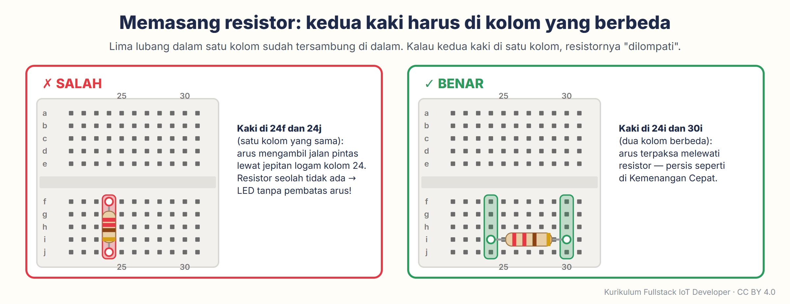
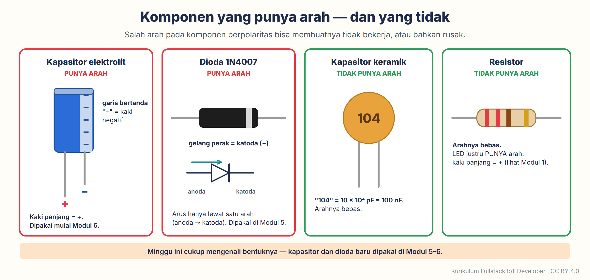
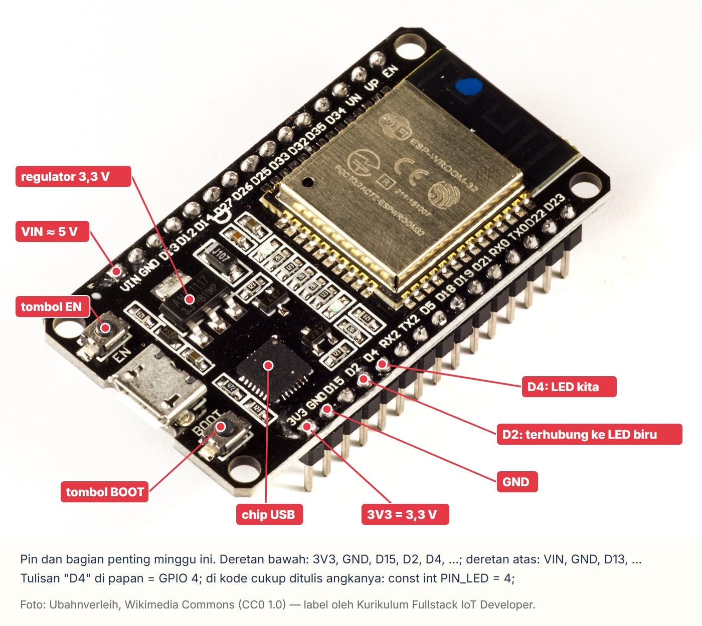
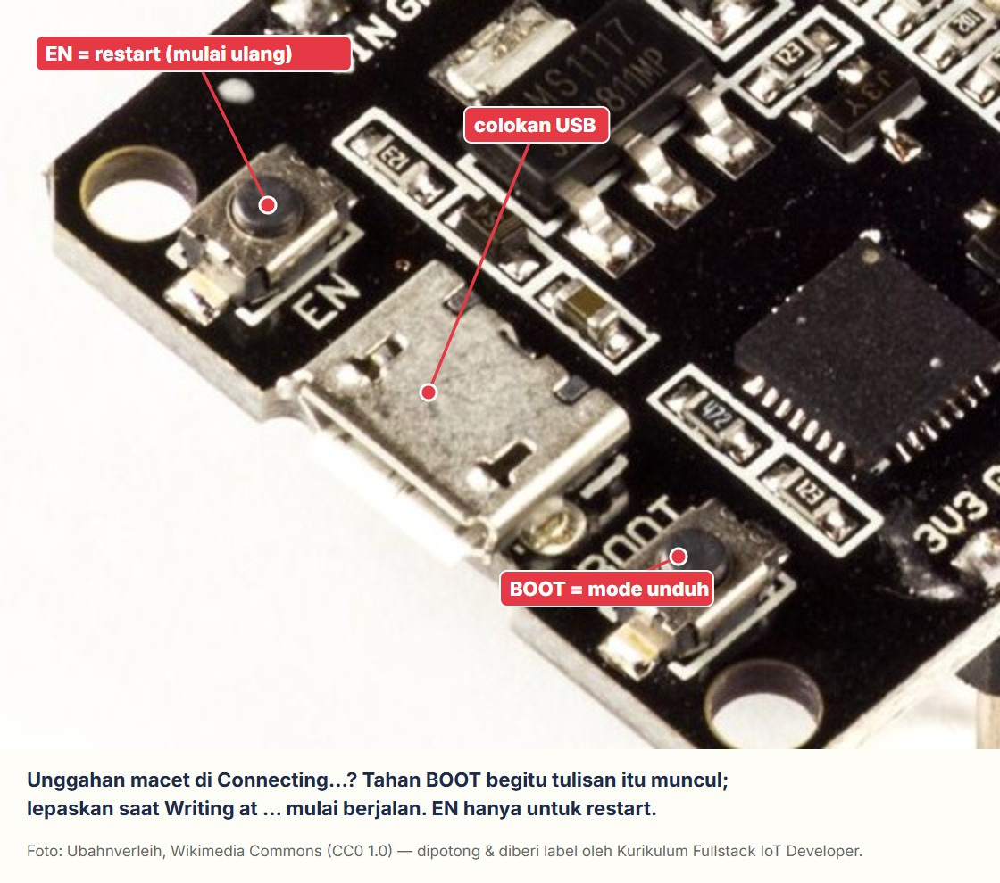
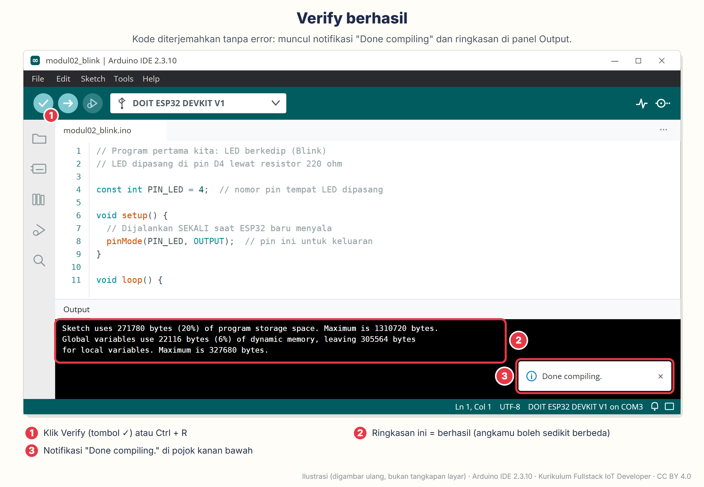
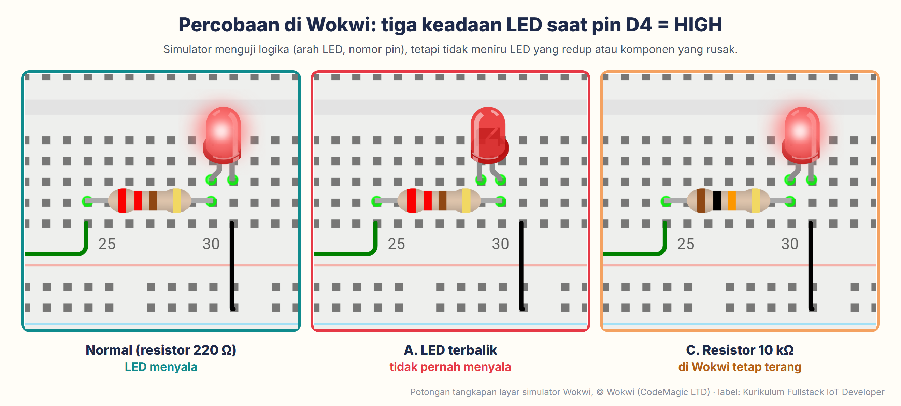
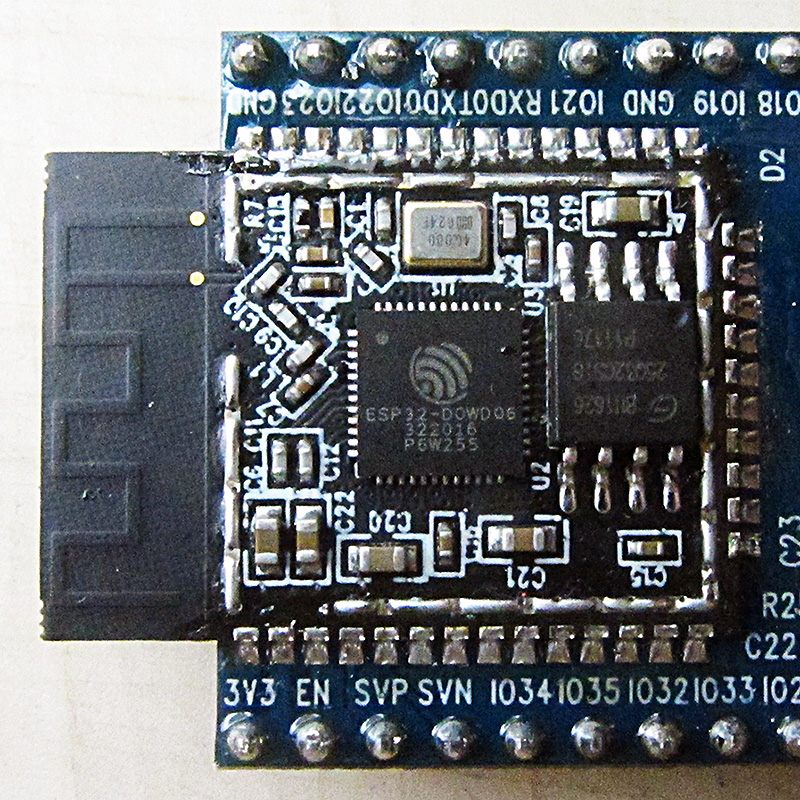

# Modul 2 — Listrik Ramah Awam, Breadboard, & Unggah Pertama ke ESP32 Asli

*Fase 0 · Minggu 2 · Perangkat keras (*hardware*): **Kit A Tahap 1** (bisa Wokwi dulu bila kit belum sampai) · Prasyarat: **Modul 1** · Waktu: 8–10 jam, dicicil dalam seminggu*

[⬅️ Modul 1](../modul-01-peta-besar-iot/README.md) · [Silabus](../../SILABUS.md) · [Pelacak progres](../../PROGRES.md) · [Modul 3 ➡️ (segera terbit — baca ringkasannya di Silabus)](../../SILABUS.md#modul-3--pemrograman-c-untuk-esp32-dari-nol)

---

Minggu lalu LED-mu berkedip di layar. Minggu ini LED-nya **sungguhan**: kamu akan memegang papan ESP32 asli, menancapkannya ke *breadboard* (papan rangkaian tanpa solder), memasang LED dan resistor dengan tanganmu sendiri, lalu mengirim program dari laptop ke chip lewat kabel USB. Di tengah jalan kita berhenti sebentar untuk memahami listrik dengan bahasa air dan keran — cukup untuk tahu kenapa resistor itu wajib; kenapa 5 V dari USB aman disentuh, tetapi 220 V dari stopkontak tidak; dan kenapa pin ESP32 hanya boleh "disuapi" 3,3 V.

Modul ini juga memuat kotak **"Kalau Tidak Jalan?" terbesar di seluruh kurikulum**. Bukan karena modul ini sulit, melainkan karena ini pertama kalinya tiga dunia bertemu: perangkat keras, *driver* (program kecil pengenal perangkat) di laptop, dan kabel USB. Kalau sesuatu macet, hampir pasti jawabannya sudah ada di kotak itu.


> [!NOTE]
> **Kit belum sampai?** Tidak masalah. Kerjakan dulu yang tidak butuh kit: 🧠 Konsep, Praktik 2.1–2.2 (memasang Arduino IDE dan paket esp32 — paling lama karena unduhannya besar), dan Praktik 5 (rangkaian yang sama di Wokwi). Kemenangan Cepat, Praktik 2.3–2.4, serta Praktik 1, 3, 4, dan 6 menunggu kit datang. Urutannya boleh dibolak-balik; checklist di akhir tetap sama.

Ritme modul ini sama dengan Modul 1. Bagian lipat di 🚨 (klik judulnya untuk membuka) cukup dibuka saat kamu membutuhkannya; bagian lipat di 🔬 boleh dilewati. Setiap praktik diawali kotak **🖥️** yang menyebut alat apa yang harus kamu buka.

## Daftar isi

1. [🎯 Setelah modul ini kamu bisa…](#-setelah-modul-ini-kamu-bisa)
2. [🧰 Yang perlu disiapkan](#-yang-perlu-disiapkan)
3. [🏆 Kemenangan Cepat: LED menyala tanpa kode (10 menit)](#-kemenangan-cepat-led-menyala-tanpa-kode-10-menit)
4. [🧠 Konsep "Mengapa"](#-konsep-mengapa)
5. [🔧 Praktik langkah demi langkah](#-praktik-langkah-demi-langkah)
6. [🚨 Kalau Tidak Jalan?](#-kalau-tidak-jalan)
7. [🔬 Bedah Teknis (opsional)](#-bedah-teknis-opsional)
8. [🧩 Tantangan mandiri](#-tantangan-mandiri)
9. [➕ Tambahan ke "Rumah Pintar Mini"](#-tambahan-ke-rumah-pintar-mini)
10. [📖 Glosarium](#-glosarium) · [📝 Kuis](#-kuis-5-soal) · [✅ Checklist kelulusan](#-checklist-kelulusan-modul-2)
11. [📚 Sumber & atribusi gambar](#-sumber--atribusi-gambar)

---

## 🎯 Setelah modul ini kamu bisa…

- **Menjelaskan tegangan, arus, dan hambatan** dengan analogi air kepada orang awam, dan memakai **Hukum Ohm** untuk menghitung resistor LED — termasuk menjawab "kenapa tidak pakai 5 V saja?".
- **Merangkai di breadboard tanpa korsleting**: tahu lubang mana yang tersambung di dalam, ke mana kaki panjang LED, dan kenapa USB dicabut dulu sebelum mengubah kabel.
- **Mengunggah program ke ESP32 sungguhan** dari Arduino IDE 2: memasang paket papan esp32 3.3.x dan *driver* USB, memilih papan dan port, menekan **Upload**, lalu "mengobrol" dengan ESP32 lewat Serial Monitor.
- **Mengukur dengan multimeter**: tegangan pin 3V3, VIN, dan D4; nilai resistor; serta sambungan di breadboard.
- **Menyebutkan aturan emas 3,3 V**: pin mana yang boleh memberi listrik ke modul 5 V, pin mana yang tidak boleh menerima 5 V — dan kenapa 5 V USB aman disentuh, sedangkan 220 V PLN tidak.

---

## 🧰 Yang perlu disiapkan

| Kebutuhan | Keterangan |
| :--- | :--- |
| **ESP32 DevKit V1 30 pin** (dari Kit A Tahap 1) | Pin sudah tersolder. Cocokkan cirinya dengan [panduan di Modul 1](../modul-01-peta-besar-iot/README.md#praktik-5--pesan-kit-a-tahap-1-supaya-modul-2-tidak-menunggu): 15 + 15 pin, tulisan ESP-WROOM-32, antena zigzag. |
| **Kabel USB data** | Micro-USB atau USB-C, sesuai colokan papanmu. Kabel cas HP murah sering **tidak punya jalur data** — gejalanya: papan menyala (LED merah kecil di papan), tetapi laptop tidak mendeteksi apa-apa. Pakai kabel bawaan HP/*powerbank* bermerek, atau kabel yang terbukti bisa memindahkan file. |
| **Breadboard 830 titik** | Satu cukup untuk minggu ini (yang kedua disimpan untuk modul berikutnya). |
| **Kabel jumper jantan–jantan (M-M)** | Minimal 4 utas: 1 merah, 1 hijau (atau kuning), dan 2 hitam. Warna sebenarnya bebas, tetapi kebiasaan warna sangat membantu: merah = +, hitam = GND, warna lain = sinyal. Tambah 2 utas cadangan untuk Praktik 1. |
| **LED 5 mm merah** + resistor **220 Ω** | Dari paket LED/resistor. Siapkan juga resistor **1 kΩ** dan **10 kΩ** untuk percobaan "redup", serta satu LED **hijau** + satu 220 Ω lagi untuk tantangan. |
| **Multimeter digital** | Yang murah (DT-830B, DT-9205, dan sejenisnya) cukup. Pastikan baterainya terpasang (biasanya baterai kotak 9 V). |
| **Laptop/PC** | Windows 10/11 64-bit, macOS, atau Linux 64-bit, dengan satu port USB. Laptop yang **hanya punya USB-C** butuh adaptor USB-C → USB-A, atau kabel USB-C → micro-USB (pastikan kabel data). |
| **Internet + kuota ±2,5 GB, ruang disk kosong ±10 GB** | Sekali saja: Arduino IDE ±160–200 MB, lalu paket papan esp32 ±2 GB (isinya penerjemah untuk *semua* jenis chip ESP32, bukan hanya milikmu). Setelah diekstrak, paket itu memakan beberapa GB, jadi sisakan ruang yang lega. Kalau kuota HP terbatas, kerjakan Praktik 2 di WiFi kampus, kantor, atau kafe. |
| **Yang TIDAK perlu** | Solder, adaptor, baterai, sensor. Semua itu baru muncul di Modul 5–9. |

**Versi yang dipakai di modul ini:**

| Alat | Versi | Catatan |
| :--- | :--- | :--- |
| Arduino IDE | **2.3.x** (saat ditulis: 2.3.10, rilis Juni 2026) | Aplikasi di laptop untuk menulis, menerjemahkan, dan mengunggah kode. Versi lama 1.8.x (*Legacy IDE*) **jangan** dipakai. |
| Paket papan (*board package*) **esp32 by Espressif Systems** | **3.3.x** (saat ditulis: 3.3.12, rilis September 2026) | Inilah *core* arduino-esp32 yang dibahas di [Modul 1 Konsep 9](../modul-01-peta-besar-iot/README.md#9-versi-itu-penting-dan-kenapa-tutorial-di-internet-sering-tidak-jalan). Kalau di tempat lain kamu melihat versi **4.0.0-RC** atau **alpha**, jangan dipakai — itu versi uji coba. |

<details>
<summary><b>Versi lain yang dipakai (esptool, <i>driver</i> USB, sistem operasi)</b></summary>

| Alat | Versi | Catatan |
| :--- | :--- | :--- |
| esptool | 5.x (ikut terpasang bersama paket papan; di 3.3.12 versinya 5.3.1) | Program kecil yang sebenarnya mengirim file ke chip. Namanya muncul di panel Output saat kamu mengunggah. |
| *Driver* USB | CP210x (Silicon Labs) atau CH340/CH9102 (WCH) | Tergantung chip penerjemah USB di papanmu. Windows 10/11 sering memasangnya otomatis; kalau tidak, Praktik 2 menjelaskan caranya. |
| Sistem operasi | Windows 10/11 64-bit, macOS, Linux 64-bit (misalnya Ubuntu 22.04/24.04) | Gambar Arduino IDE di modul ini adalah **ilustrasi** yang digambar ulang dari tampilan Arduino IDE 2.3.10 di Windows, dengan tulisan tombol dan menu yang sama persis. Di macOS/Linux isinya sama; yang berbeda hanya bingkai jendela dan nama port. |

</details>

> [!TIP]
> **Siapkan "meja kerja" kecil**: alas meja yang bukan logam (kertas atau buku tebal cukup), lampu yang cukup terang, dan kotak bekas untuk menyimpan komponen. Kabel jumper dan resistor gampang sekali hilang.

---

## 🏆 Kemenangan Cepat: LED menyala tanpa kode (10 menit)

Kita mulai dari yang paling sederhana: **menyalakan LED hanya dengan listrik dari papan, tanpa menulis kode sama sekali.** Tujuannya supaya tanganmu kenal dulu dengan breadboard dan LED sebelum laptop ikut campur. Kalau kit belum datang, lompat dulu ke [🧠 Konsep](#-konsep-mengapa) dan kembali ke sini nanti.

> 🖥️ **Alat yang dipakai di bagian ini:** papan ESP32, breadboard, 1 LED merah, 1 resistor 220 Ω, 3 kabel jumper (1 merah, 2 hitam), kabel USB, dan sumber listrik USB (port laptop atau kepala cas HP — keduanya boleh). **Tidak perlu membuka aplikasi apa pun.**

Lihat dulu gambar tujuan kita. Simpan gambar ini di depan matamu selama lima langkah berikut:

![Rangkaian Kemenangan Cepat di breadboard, dilihat dari atas: papan ESP32 memanjang searah breadboard di kolom 4 sampai 18 dengan colokan USB di kiri; resistor 220 ohm di lubang 24i dan 30i; LED merah dengan kaki panjang di 30h dan kaki pendek di 31h; kabel merah dari 4j (di bawah pin 3V3) ke 24j; kabel hitam dari 5j (di bawah pin GND) dan dari 31j lurus ke bawah ke jalur biru paling bawah; huruf baris a sampai j ditandai di tepi kanan, dan kotak perbesaran memperlihatkan pin 3V3, GND, dan D4 dengan lubang 4j, 5j, dan 8j di bawahnya](aset/rangkaian-kemenangan-cepat.png)

*Gambar dibuat dengan simulator [Wokwi](https://wokwi.com) supaya posisi lubangnya persis — tangkapan layar © Wokwi (CodeMagic LTD), label oleh penulis. Susunan lubang breadboard aslimu sama.*

### Langkah 1 — Tancapkan papan ESP32 ke breadboard

Letakkan breadboard dengan **angka 1 di kiri** dan **huruf a di atas** (angka dan huruf tercetak di tepi breadboard). Letakkan papan ESP32 **memanjang searah breadboard, mengangkangi parit tengah** — celah memanjang yang membelah breadboard menjadi bagian atas dan bawah — dengan colokan USB menghadap **kiri** sehingga:

- deretan pin **atas** (VIN, GND, D13, …, EN) masuk ke **baris a**, kolom **4 sampai 18**;
- deretan pin **bawah** (3V3, GND, D15, D2, D4, …, D23) masuk ke **baris i**, kolom 4 sampai 18.

Tekan papan pelan-pelan dan merata di kedua ujungnya sampai masuk. Pin yang sedikit bengkok boleh diluruskan dulu dengan kuku. Yang terpenting: **baris j di bawah deretan pin bawah tetap kosong** karena di situlah kabel kita masuk.

Lebar papan tiruan sedikit berbeda-beda. Kalau papanmu lebih sempit sehingga deretan bawahnya jatuh di baris h, tidak apa-apa — semua petunjuk "baris j" di modul ini tetap berlaku. Kalau papanmu begitu lebar sampai menutup semua baris, lihat [🔬 Bedah Teknis → *Kalau papanmu menutup semua lubang*](#kalau-papanmu-menutup-semua-lubang).

### Langkah 2 — Pasang resistor dan LED

1. **Resistor 220 Ω**. Yang berbadan krem bergelang empat: **merah-merah-cokelat-emas**. Yang berbadan biru bergelang lima: **merah-merah-hitam-hitam-cokelat**. Bungkusnya biasanya juga berlabel *220R* atau *220Ω*. Satu kaki ke lubang **24i**, kaki lainnya ke **30i**. Arahnya bebas. Tekuk kakinya seperlunya supaya pas.
2. **LED merah**: perhatikan kakinya — satu lebih **panjang**. **Kaki panjang ke 30h**, **kaki pendek ke 31h**. Kalau kakinya sudah terpotong sama panjang, lihat bibir plastik LED: sisi yang **pipih** adalah sisi kaki pendek.

Kenapa kaki resistor di 30i dan kaki LED di 30h tersambung tanpa kabel? Karena lima lubang dalam satu kolom di bagian bawah (f, g, h, i, j) tersambung di dalam breadboard. Ini dijelaskan di Konsep 4.

### Langkah 3 — Tiga kabel jumper

1. **Kabel hitam** dari **31j** (kolom kaki pendek LED) **lurus ke bawah**, ke lubang **jalur biru (−) paling bawah** yang terdekat — di kolom 31 atau sedikit ke kiri, **jangan ke kanan**. Di sebagian breadboard, jalur ini terputus di tengah (sekitar kolom 32).
2. **Kabel hitam** kedua dari **5j** — lubang tepat di bawah pin **GND** — ke jalur biru (−) yang sama. Sekarang jalur biru itu "resmi" menjadi GND.
3. **Kabel merah** dari **4j** — tepat di bawah pin **3V3** — ke **24j** (kolom kaki kiri resistor).

Kabel merah akan bersilangan dengan kabel hitam dari 5j — tidak apa-apa. Kabel jumper berselubung plastik, jadi kabel yang bersilangan atau bersentuhan tidak tersambung. Yang menyambung hanyalah ujung logam yang masuk ke lubang.

Telusuri dengan jarimu: **3V3 → kabel merah → resistor → LED (masuk lewat kaki panjang, keluar lewat kaki pendek) → kabel hitam → jalur biru → kabel hitam → GND**. Satu lingkaran utuh: listrik selalu butuh jalan pulang.

### Langkah 4 — Colok USB

Sambungkan kabel USB ke papan, lalu ke laptop atau kepala cas HP. Dua lampu menyala: **LED merah kecil di papan** (tanda papan mendapat listrik) dan **LED-mu di breadboard**. 🎉

Tidak menyala? Perhatikan dulu LED kecil di papan, lalu **cabut USB** dan cek urutan ini:

1. LED kecil di papan tadi pun mati → masalahnya di kabel USB atau sumber listriknya. Coba kabel/port lain.
2. LED terbalik → tukar kedua kakinya (LED tidak rusak karena terbalik).
3. Kaki LED atau resistor masuk ke kolom yang salah → hitung ulang angka kolomnya.
4. Kabel merah masuk ke 4j? (Lubang 4i sudah ditempati pin.)
5. Jalur biru breadboard-mu mungkin terputus di tengah (garis biru di tepinya ada celah?). Pindahkan ujung bawah kabel hitam dari 31j ke jalur biru yang lebih ke kiri, dekat kabel hitam satunya.

Masih gelap? Buka lipatan *LED di breadboard tidak menyala* di [🚨 Kalau Tidak Jalan?](#-kalau-tidak-jalan).

### Langkah 5 — Pindahkan satu kabel, dan sadari sesuatu

**Cabut USB.** Pindahkan ujung kabel merah dari **4j ke 8j** — lubang di bawah pin **D4**. Colok USB lagi. LED **padam**.

Itu normal, dan justru itulah intinya: pin 3V3 selalu "hidup", sedangkan pin **D4 baru mengeluarkan listrik kalau ada program yang menyuruhnya**. Program itu yang akan kamu unggah di Praktik 3. (Kalau LED-nya malah berkedip, papanmu kebetulan sudah berisi program contoh dari pabrik. Tidak apa-apa — programmu akan menggantikannya.) Biarkan rangkaian terpasang seperti ini; kita memakainya lagi.

> [!IMPORTANT]
> **Aturan emas minggu ini (dan seterusnya): cabut USB sebelum menyentuh atau mengubah kabel.** Rangkaian yang keliru tanpa listrik tidak merusak apa-apa. Rangkaian yang keliru *dengan* listrik bisa membakar LED, memanaskan papan, atau membuat laptop mematikan port USB-nya.

---

## 🧠 Konsep "Mengapa"

Sepuluh konsep, satu per bagian. Bacanya santai saja — ada ☕ titik istirahat di tengah. Konsep 1–8 cukup untuk Praktik 1; Konsep 9–10 dibaca sebelum Praktik 2 dan 3.

### 1. Listrik seperti air: tegangan, arus, hambatan, daya

Kamu tidak perlu kuliah fisika untuk minggu ini. Cukup satu gambar di kepala: **air dari tandon yang tinggi mengalir lewat pipa dan keran, memutar kincir, lalu dipompa kembali ke tandon.**


| Istilah listrik | Satuan | Dalam bahasa air | Di proyek kita |
| :--- | :--- | :--- | :--- |
| **Tegangan** (V, *voltage*) | volt (V) | Tekanan air. Makin tinggi tandon, makin kuat dorongannya. | USB = 5 V, pin ESP32 = 3,3 V, PLN = 220 V. |
| **Arus** (I, *current*) | ampere (A); 1 A = 1.000 mA | Derasnya aliran: berapa liter lewat per detik. | LED kita ±6 mA; chip ESP32 saat WiFi memancar bisa ±250 mA. |
| **Hambatan** (R, *resistance*) | ohm (Ω); 1 kΩ = 1.000 Ω | Keran yang menyempitkan pipa. | Resistor 220 Ω "mengerem" arus LED. |
| **Daya** (P, *power*) | watt (W) | Kerja yang dihasilkan: kincir berputar. | P = V × I. Rangkaian LED kita: 3,3 V × 0,006 A ≈ 0,02 W; lampu kamar ±10 W. |

Dua kalimat yang menyelamatkan banyak komponen:

- **Tegangan tetap "ada" walaupun tidak ada yang mengalir** (tandon penuh, keran tertutup). Jadi, pin 3V3 tetap 3,3 V walaupun tidak dipakai.
- **Arus hanya mengalir kalau ada jalan pulang ke GND.** Itu sebabnya setiap rangkaian minggu ini berakhir di jalur biru.

### 2. Hukum Ohm — satu-satunya rumus minggu ini

Tiga besaran pertama tadi diikat satu rumus: **V = I × R** (tegangan = arus × hambatan). Tutup huruf yang ingin kamu cari di segitiga ini; sisanya adalah rumusnya.


Satu-satunya hitungan yang wajib kamu kuasai adalah **resistor untuk LED**:

1. Pin memberi **3,3 V**. LED merah "memakai" sekitar **2,0 V** (setiap warna LED berbeda; lihat 🔬).
2. Sisanya, **3,3 − 2,0 = 1,3 V**, harus "ditahan" oleh resistor.
3. Dengan resistor 220 Ω: **I = V ÷ R = 1,3 ÷ 220 ≈ 0,0059 A = 5,9 mA**.

Hasilnya cukup terang, aman untuk LED (LED biasa nyaman di 5–15 mA), dan aman untuk pin ESP32 (batas yang kita pakai di kurikulum ini ±12 mA per pin — lembar data chip mengizinkan lebih, tetapi kita main aman).


Nilainya tidak harus persis 220 Ω. Resistor 150–470 Ω semuanya aman untuk LED merah di 3,3 V; yang berubah hanya terang-redupnya. Yang **tidak boleh** adalah 0 Ω alias tanpa resistor: 1,3 ÷ 0 = arus "tak terbatas". Dalam kenyataan, arusnya dibatasi oleh pin itu sendiri — dan pin itulah yang menderita.

**Lalu, kenapa tidak pakai 5 V saja supaya lebih terang?** Ada tiga alasan:

- Pin yang bisa dinyalakan-dimatikan oleh program (pin GPIO) hanya mengeluarkan **3,3 V**. Tidak ada pin ESP32 yang bisa "dikedipkan" dengan 5 V.
- Pin 5 V di papan (VIN) **selalu menyala** selama USB tercolok sehingga LED di sana tidak bisa dikendalikan kode.
- Dengan 5 V pun **resistor tetap wajib**: (5 − 2) ÷ 220 ≈ 13,6 mA. Lebih terang memang, tetapi tanpa resistor, LED tetap hangus.

### 3. DC dan AC: kenapa 5 V USB aman disentuh, 220 V PLN tidak


Semua yang kita pakai di kurikulum ini adalah **DC** (*direct current*, arus searah): USB 5 V, baterai, pin 3,3 V. Tegangannya rendah dan arahnya tetap — ada kutub + dan −.

Kenapa aman? Pakai Hukum Ohm tadi. Pada tegangan rendah, kulit kering punya hambatan puluhan ribu ohm. Dari USB: 5 V ÷ 50.000 Ω = 0,0001 A — sama sekali tidak terasa. Listrik rumah lain ceritanya: **AC** (*alternating current*, arus bolak-balik) 220 V yang bolak-balik 50 kali per detik (50 Hz). Pada tegangan setinggi itu, lapisan luar kulit "jebol" sehingga hambatan tubuh dari tangan ke tangan anjlok ke sekitar 1.000–2.000 Ω, **bahkan saat kulit kering**: 220 V ÷ 1.500 Ω ≈ 150 mA, berlipat-lipat di atas arus yang bisa mengacaukan detak jantung (±30–50 mA). Jadi, 220 V berbahaya, kering ataupun basah. Yang membuat USB aman adalah **tegangannya yang rendah**, bukan semata-mata karena DC.

**Kurikulum ini tidak pernah menyentuh 220 V secara langsung.** Kepala cas HP-lah yang mengurus 220 V, di dalam kotaknya yang tertutup; yang keluar dari colokan USB-nya sudah 5 V DC.

### 4. Breadboard: jalur tersembunyi di balik lubang-lubang

Breadboard adalah papan rangkaian **tanpa solder**: komponen tinggal ditancapkan dan bisa dicabut lagi. Lubang-lubangnya tidak berdiri sendiri — di bawahnya ada **jepitan logam** yang menghubungkan kelompok lubang tertentu.


*Foto bagian belakang breadboard (kanan): Guhuru, [Wikimedia Commons](https://commons.wikimedia.org/wiki/File:Breadboard.png), CC0 (domain publik); dipotong dan diputar oleh penulis.*

Tiga aturan ini menjelaskan semuanya:

1. **Lima lubang dalam satu kolom tersambung**: a-b-c-d-e satu jalur, f-g-h-i-j satu jalur. Kolom 24 bagian atas dan kolom 24 bagian bawah **tidak** tersambung — dipisah parit tengah.
2. **Jalur daya di tepi tersambung memanjang** (garis merah + dan garis biru −), bukan ke atas-bawah. Perhatian: di sebagian breadboard 830 titik, jalur daya **terputus di tengah** (ada celah pada garis merah/biru di sekitar kolom 32). Kamu akan mengeceknya dengan multimeter di Praktik 1.
3. **Dua kaki satu komponen tidak boleh berada di satu kolom.** Kalau kedua kaki resistor masuk ke kolom yang sama, arus mengambil jalan pintas lewat jepitan logam, dan resistornya seolah tidak ada. Untuk LED, itu sama saja dengan dipasang tanpa resistor.



Papan ESP32 DevKit V1 "menunggangi" parit tengah: deretan pin atas di baris a, deretan pin bawah di baris i sehingga **baris j di bawah setiap pin bawah tetap kosong**. Hanya lubang itulah yang bisa kamu pakai untuk setiap pin bawah. Untuk deretan pin atas tidak ada lubang tersisa; kalau nanti butuh, kita jajarkan dua breadboard (lihat [🔬 *Kalau papanmu menutup semua lubang*](#kalau-papanmu-menutup-semua-lubang)).

### 5. Mengenal komponen: LED, resistor, kapasitor, dioda, kabel jumper

**LED** (*light-emitting diode*) hanya mau dialiri arus **satu arah**: masuk lewat kaki **panjang** (anoda, +), keluar lewat kaki **pendek** (katoda, −). Dipasang terbalik tidak rusak, hanya tidak menyala. Gambar dari Modul 1 ini masih berlaku:


Petunjuk ketiga di gambar itu — bagian logam yang lebih besar di dalam kubah biasanya katoda — tidak berlaku untuk semua merek. Pegangan yang paling bisa diandalkan tetap kaki panjang dan sisi pipih.

**Resistor** tidak punya arah. Nilainya dibaca dari **gelang warna**: dua gelang pertama = angka, gelang ketiga = jumlah nol di belakangnya, gelang keempat (emas) = toleransi ±5%. Tiga nilai yang akan sering kamu pakai:


Resistor di paketmu berbadan **biru dengan 5 gelang**? Itu jenis yang lebih presisi (±1%) dan sangat umum di paket resistor. Cara bacanya hampir sama: tiga gelang pertama angka, gelang keempat jumlah nol, gelang kelima toleransi. Jadi, 220 Ω = merah-merah-hitam-hitam-cokelat (lihat kotak biru di gambar).

Nilai keempat di kit, **4,7 kΩ** (kuning-ungu-merah-emas), disimpan untuk sensor suhu DS18B20 di Modul 7. Malas menghafal warna? Multimeter bisa membacakannya untukmu (Praktik 1). Meski begitu, kemampuan "melihat 220 Ω dari warnanya" sangat berguna saat komponen berserakan.

<details>
<summary><b>Kapasitor dan dioda di kit — cukup dikenali dulu, baru dipakai di Modul 5–6</b></summary>

**Kapasitor elektrolit** dan **dioda** punya arah seperti LED; **kapasitor keramik** tidak. Minggu ini kita cukup mengenali bentuknya. Kapasitor 100 µF dan 100 nF sudah ada di kit Tahap 1 dan baru dipakai di Modul 6 sebagai "peredam" gangguan sinyal sensor. Dioda 1N4007 (kalau sudah ikut kamu pesan) dipakai di Modul 5 sebagai pelindung saat mengendalikan pompa.



</details>

**Kabel jumper** ada tiga jenis ujung. Untuk breadboard pakai **jantan–jantan (M-M)**. Jantan–betina (M-F) dipakai untuk menyambung modul sensor yang pinnya menonjol (Modul 6), dan betina–betina (F-F) untuk menyambung pin ke pin.


### 6. Titik nol bersama (*common ground*) dan korsleting

Tegangan selalu diukur **terhadap sesuatu**, seperti tinggi gunung yang diukur dari permukaan laut. "Permukaan laut" rangkaian kita adalah **GND**. Setiap komponen, sensor, dan nanti setiap modul tambahan harus berbagi GND yang **sama**; kalau tidak, "3,3 V" menurut ESP32 bisa berbeda dengan "3,3 V" menurut sensor, dan pembacaannya kacau. Itulah gunanya jalur biru di breadboard: satu GND untuk semua. Kalimat ini akan sering kamu dengar di Modul 5–15: *"GND-nya sudah disatukan belum?"*

**Korsleting** (sering disebut *korslet*, atau hubung singkat) adalah kebalikannya: kutub + bertemu kutub − **tanpa beban** di antaranya sehingga arus melonjak.


Pada pemula, korsleting jarang disebabkan kesengajaan menyambung 3V3 ke GND. Yang sering justru: dua kaki komponen di kolom yang sama, kaki komponen yang saling menempel, atau papan diletakkan di atas benda logam (kunci, gunting) sehingga pin-pin di bawahnya saling tersambung. Gejalanya: papan terasa hangat, LED merah di papan meredup, atau laptop memberi peringatan *USB power surge*. Tindakan pertama selalu sama: **cabut USB**.

> ☕ **Titik istirahat.** Enam konsep di atas adalah "listriknya". Empat berikutnya adalah "papan dan laptopnya". Kalau sudah membaca 20 menit, berdiri dulu, minum, lalu lanjut.

### 7. Tiga sumber listrik di papan ESP32 (plus GND) dan aturan emas 3,3 V

Papan menerima 5 V dari USB. Sebuah komponen kecil bernama **regulator** (di papan DevKit V1 biasanya AMS1117) menurunkannya menjadi 3,3 V untuk chip. Akibatnya, ada beberapa macam pin "listrik" yang harus kamu bedakan:


| Pin | Nilai | Boleh untuk | Jangan |
| :--- | :--- | :--- | :--- |
| **VIN** (di beberapa papan tertulis **5V**) | ±4,5–5 V (tembusan dari USB) | Memberi makan modul yang memang butuh 5 V, misalnya relay dan sensor jarak (Modul 5–6). Minggu ini hanya diukur. | Disambung ke pin GPIO atau ke 3V3. Disentuhkan ke GND. |
| **3V3** | 3,3 V stabil dari regulator | Sensor 3,3 V (DHT22, BME280, layar OLED) dan percobaan LED tanpa kode. Kemampuannya terbatas — anggap ±500 mA, dibagi dengan chip ESP32 sendiri. | Motor, pompa, kipas — apa pun yang berputar atau memanas. |
| **GPIO** (D4, D18, D19, …) | Keluar: HIGH = 3,3 V, LOW = 0 V. Masuk: terbaca HIGH bila mendekati 3,3 V | Sinyal: LED + resistor, tombol, sensor. Arusnya kecil (kita pakai batas ±12 mA per pin). | **Menerima 5 V.** Chip bisa rusak permanen — tanpa asap, tanpa peringatan. |
| **GND** (ada dua; keduanya sama) | 0 V | Titik nol bersama untuk semuanya. | — |

Rumus mudah diingat: **"5 V untuk makan, 3,3 V untuk bicara, GND untuk sepakat."** Sensor yang keluarannya 5 V tetap bisa dipakai, tetapi sinyalnya diturunkan dulu dengan dua resistor (pembagi tegangan) sebelum masuk ke pin — kamu akan melakukannya di Modul 6.



*Foto: Ubahnverleih, [Wikimedia Commons](https://commons.wikimedia.org/wiki/File:ESP32_Espressif_ESP-WROOM-32_Dev_Board.jpg), CC0 (domain publik); label oleh penulis.*

Satu hal lagi dari foto itu: tulisan **D4** di papan berarti **GPIO nomor 4**, dan di kode kita menulis angkanya saja (`const int PIN_LED = 4;`). Pin dengan nama lain — **VP, VN, EN, RX0, TX0** — punya tugas khusus dan tidak dipakai untuk LED. RX0/TX0, misalnya, dipakai jalur USB; menempelkan sesuatu di sana bisa menggagalkan unggahan.

### 8. Multimeter: "mata" untuk melihat listrik

Listrik tidak terlihat; multimeter membuatnya terbaca sebagai angka. Model paling murah sudah cukup untuk tiga pengukuran yang kita butuhkan sampai Modul 9:


*Foto multimeter: K.Venkataramana, [Wikimedia Commons](https://commons.wikimedia.org/wiki/File:Digital_Multimeter_(To_measure_Voltage,_Current_and_Resistance).jpg), CC0 (domain publik); label dan kartu oleh penulis.*

Urutan amannya selalu sama: **putar sakelar ke posisi yang benar → colokkan *probe* (batang penguji; hitam ke COM, merah ke VΩmA) → baru tempelkan ke rangkaian → selesai: putar ke OFF** supaya baterainya awet.

Mengukur arus (posisi A⎓) sengaja **tidak** diajarkan minggu ini: caranya berbeda dan mudah memutus sekering di dalam multimeter. Untuk mengukur arus, kita memakai modul INA219 di Modul 9.

### 9. Dari Wokwi ke papan asli: apa yang berubah, apa yang sama

Yang **sama**: kodenya. Blink yang berjalan di Wokwi juga berjalan di papan asli tanpa perubahan karena Wokwi meniru *core* arduino-esp32 yang sama. Yang **berubah** adalah "perjalanan" kode dari layar ke chip:


Di Wokwi, tombol ▶ langsung menjalankan simulasi. Di papan asli, tombol **Upload** melakukan lima hal berturut-turut:

1. menerjemahkan kode menjadi bahasa mesin (**kompilasi**);
2. membuka **port USB**;
3. membujuk chip masuk "mode unduh" (tahap `Connecting…`);
4. **menulis** program ke memori *flash* — memori yang isinya tidak hilang walau listrik padam;
5. me-*restart* (memulai ulang) chip.

Program yang sudah masuk *flash* **tetap ada** walaupun USB dicabut. Begitu diberi listrik lagi, ia langsung jalan sendiri. Itulah sebabnya ESP32 bisa dipasang di kebun tanpa laptop.

Tiga pemain baru yang tidak ada di Wokwi:

- **Arduino IDE 2** — "Wokwi versi desktop": editor + penerjemah + pengunggah. Tampilannya mirip Wokwi karena Wokwi memang meniru kebiasaan Arduino.
- **Chip penerjemah USB** di papan (CP2102 atau CH340) — mengubah "bahasa USB" laptop menjadi "bahasa serial" chip ESP32. Chip inilah yang butuh *driver* di Windows, dan yang membuat papan muncul sebagai "COM3" (Windows), `/dev/cu.usbserial-…` (macOS), atau `/dev/ttyUSB0` (Linux).
- **Dua tombol di papan**: **EN** = *restart* (program yang ada jalan lagi dari awal), **BOOT** = "siap menerima program baru". Biasanya tombol BOOT "ditekan" secara elektronik oleh chip penerjemah USB, tetapi pada sebagian papan dan kabel kamu perlu **menahannya dengan jari**: tahan BOOT begitu `Connecting…` muncul, lalu lepaskan saat `Writing at …` mulai berjalan. Dengan colokan USB di kiri, EN ada di pojok kiri atas (dekat VIN) dan BOOT di pojok kiri bawah (dekat 3V3).



*Foto: Ubahnverleih, [Wikimedia Commons](https://commons.wikimedia.org/wiki/File:ESP32_Espressif_ESP-WROOM-32_Dev_Board.jpg), CC0 (domain publik); dipotong dan diberi label oleh penulis.*

### 10. Keselamatan dan kebiasaan yang membuat komponen awet

Tidak ada yang berbahaya bagi manusia di modul ini — tegangannya hanya 5 V. Yang perlu dilindungi justru komponennya (dan kadang port USB laptop):

1. **Cabut USB sebelum mengubah kabel.** Sudah dua kali disebut, dan akan disebut lagi.
2. **Alas kerja bukan logam**, dan jangan meletakkan papan di atas kunci, gunting, atau kaleng. Pin di bawah papan bisa saling tersambung.
3. **Sentuh benda logam besar** (kaki meja besi, rangka PC) sebelum memegang papan di ruangan ber-AC yang kering, untuk melepas listrik statis dari tubuh. Tidak wajib, tetapi kebiasaan baik.
4. **Jangan sambungkan apa pun yang tegangannya lebih dari 3,3 V ke pin GPIO.** VIN hanya untuk diukur minggu ini.
5. **Papan terasa panas atau berbau?** Cabut. Cari korsletingnya dengan tenang. Papan ESP32 cukup tangguh; regulator yang terbakar pun biasanya hanya berarti "beli papan baru Rp45–80 ribu", bukan bencana.
6. **Satu perubahan, satu uji.** Mengubah tiga hal sekaligus lalu gagal = tidak tahu mana penyebabnya. Ini kebiasaan teknisi, dan juga kebiasaan programmer.

---

## 🔧 Praktik langkah demi langkah

Enam praktik. Praktik 2 paling panjang (memasang alat), tetapi hanya dilakukan **sekali** untuk setiap laptop. Kalau kit belum sampai, kerjakan Praktik 2.1–2.2 dan Praktik 5 dulu.

### Praktik 1 — Mengukur dengan multimeter (20 menit)

> 🖥️ **Alat yang dipakai:** multimeter, rangkaian Kemenangan Cepat (USB tercolok ke laptop atau kepala cas), resistor 220 Ω dan 10 kΩ cadangan yang belum terpasang, dan 2 kabel jumper cadangan. **Tidak perlu membuka aplikasi apa pun.**

Pasang *probe*: **hitam ke lubang COM**, **merah ke lubang VΩmA** (bukan lubang 10A). Lalu tiga pengukuran berikut.


*Kiri: potongan tangkapan layar simulator [Wokwi](https://wokwi.com), © Wokwi (CodeMagic LTD), ditambah gambar *probe*; kanan: diagram penulis.*

**1. Tegangan pin** (USB tercolok).

1. Putar sakelar ke **V⎓ 20** (tegangan DC, batas 20 V). V⎓ adalah huruf V dengan garis lurus dan garis putus-putus (DC) — **bukan** V~ yang bergelombang.
2. Pegang *probe* seperti memegang pensil. Tempelkan ujung *probe* **hitam** ke kepala pin **GND** dan ujung **merah** ke kepala pin **3V3**. Kepala pin adalah titik solder perak di permukaan papan, tepat di samping tulisan nama pinnya.
3. Layar menunjukkan **±3,3** (3,2–3,4 masih normal). Multimeter memakai titik desimal: **3.29** di layar sama dengan 3,29.
4. Pindahkan *probe* merah ke **VIN** (ujung deretan pin atas, di sisi USB, berseberangan dengan 3V3): **±4,5–5,0**. Di banyak papan angkanya sedikit di bawah 5 V karena listrik USB melewati dioda pengaman.
5. Pindahkan *probe* merah ke **D4**: ±0 V sekarang. Setelah Praktik 3, angkanya akan berganti-ganti antara 0 dan 3,3.

> [!WARNING]
> Pin 3V3–GND (deretan bawah) dan VIN–GND (deretan atas) **bersebelahan**. Tempelkan *probe* dengan mantap dan jangan sampai ujungnya menyentuh dua pin sekaligus — itu korsleting kecil. Kalau sempat terjadi, biasanya papan hanya *restart* atau port USB laptop mati sebentar; angkat *probe*, lalu ulangi. Angka yang berkedip-kedip biasanya karena *probe* goyang. Angka minus? Posisi kedua *probe*-mu hanya tertukar.

**2. Nilai resistor** (USB **dicabut**).

1. Putar sakelar ke **Ω 2000** (kadang tertulis **2k**).
2. Ambil resistor 220 Ω yang belum terpasang. Tempelkan satu *probe* ke tiap kakinya (arah bebas). Jangan pegang kedua kaki dengan jari karena tubuhmu ikut terukur.
3. Layar menunjukkan sekitar **220** (210–230 masih normal).
4. Ganti dengan resistor 10 kΩ: layar menunjukkan **"1"** di kiri — artinya "di luar jangkauan". Putar sakelar ke **Ω 20k**: sekitar **10,0** (di layar tertulis 10.0; satuannya kΩ). Sekarang kamu bisa "membaca" resistor tanpa menghafal warna.

**3. Sambungan breadboard** (USB tetap dicabut). Ujung *probe* biasanya terlalu besar untuk masuk ke lubang breadboard, jadi kita pakai dua kabel jumper cadangan sebagai "perpanjangan".

1. Putar sakelar ke simbol **•)))** (mode **kontinuitas**: multimeter berbunyi bip kalau dua titik tersambung). Multimeter paling murah seperti DT-830B sering **tidak punya** mode bip. Kalau begitu, pakai **Ω 200**: angka mendekati 0 berarti tersambung, angka "1" di kiri berarti tidak tersambung.
2. Tancapkan kabel cadangan ke lubang **40f** dan **40j** (kolom kosong). Tempelkan *probe* ke ujung logam kabel yang lain: **bip** (atau angka mendekati 0) — satu kolom memang tersambung.
3. Pindahkan satu kabel ke **41f**: diam — beda kolom, tidak tersambung.
4. Tancapkan kedua kabel ke lubang paling kiri dan paling kanan **jalur biru bawah**. Bip berarti jalur itu tersambung dari ujung ke ujung; diam berarti jalur dayamu **terputus di tengah**. Catat hasilnya! Kalau terputus dan nanti kamu memakai kedua sisinya, pasang satu kabel penyambung.
5. Uji juga setiap **kabel jumper** milikmu: satu *probe* di tiap ujung kabel. Diam berarti kabel itu putus di dalam — buang saja.

Tulis hasilnya di catatanmu (misalnya: 3V3 = 3,29 V; VIN = 4,71 V; 220 Ω terbaca 218). Kamu akan membandingkannya lagi di Modul 9 saat mengukur baterai.

### Praktik 2 — Memasang Arduino IDE 2, paket papan esp32, dan *driver* (45–90 menit, sekali saja)

> 🖥️ **Alat yang dipakai:** laptop + internet. Papan ESP32 baru dicolok di langkah 2.3. Sediakan waktu, kuota ±2,5 GB, dan kesabaran: bagian "menunggu unduhan" bisa 10–30 menit.

> [!NOTE]
> Semua gambar Arduino IDE di praktik ini adalah **ilustrasi** yang digambar ulang dari tampilan Arduino IDE 2.3.10 di Windows. Tulisan pada tombol dan menunya sama persis dengan aslinya, tetapi warna dan ukurannya bisa sedikit berbeda di layarmu.
>
> **Pengguna macOS:** di Arduino IDE dan browser, ganti **Ctrl** dengan **Cmd** (misalnya **Cmd + U** untuk Upload). Di Terminal, termasuk nano, tetap pakai tombol **Control**.

#### 2.1 Unduh dan pasang Arduino IDE 2

1. Buka browser, ketik **https://www.arduino.cc/en/software** lalu tekan Enter. Kalau muncul kotak pemberitahuan *cookie* (kuki), klik **REJECT** (menolak kuki tambahan tidak menghalangi unduhan).
2. Bagian paling atas halaman itu biasanya mempromosikan **App Lab** — itu untuk papan Arduino jenis lain, **bukan** untuk kita. Gulir ke bawah sampai kotak **Arduino IDE 2.3.10** (angka terakhirnya boleh lebih baru). Jangan pilih *Legacy IDE (1.8.19)* atau *Cloud Editor*.
3. Menu pilihan di samping tombol **DOWNLOAD** biasanya sudah menyesuaikan diri dengan laptopmu. Pastikan isinya benar:
   - **Windows** → *Windows Win 10 or newer (64-bit)*. File yang terunduh: `arduino-ide_2.3.10_Windows_64bit.exe` (±160 MB).
   - **macOS** → pilih versi **Apple Silicon** untuk Mac M1/M2/M3/M4 (file `…_macOS_arm64.dmg`), atau **Intel** untuk Mac yang lebih tua (file `…_macOS_64bit.dmg`). Belum tahu jenis Mac-mu? Klik logo Apple di pojok kiri atas layar → **About This Mac**, lalu lihat baris *Chip*.
   - **Linux** → *AppImage 64-bit* (file `…_Linux_64bit.AppImage`).
4. Klik **DOWNLOAD**. Tidak perlu mendaftar akun.
5. Pasang:
   - **Windows**: klik dua kali file `.exe` (biasanya ada di folder *Downloads*). Kalau Windows bertanya *Do you want to allow this app to make changes to your device?*, klik **Yes** (**Ya**). Lalu **I Agree** → pilih untuk siapa (biarkan bawaan) → **Next** → **Install** → **Finish**. Kalau muncul jendela *Windows Security* yang menanyakan pemasangan *driver* dari Arduino, klik **Install** (itu *driver* untuk papan Arduino resmi; tidak mengganggu).
   - **macOS**: buka file `.dmg`, seret ikon Arduino IDE ke folder *Applications*, lalu buka dari *Applications*. Kalau muncul pertanyaan *"…downloaded from the Internet. Are you sure you want to open it?"*, klik **Open**. Kalau macOS menolak membukanya, buka **System Settings → Privacy & Security**, gulir ke bagian *Security*, lalu klik **Open Anyway**.
   - **Linux (Ubuntu)**: ada beberapa langkah tambahan — buka lipatan *Langkah khusus Linux* tepat di bawah daftar ini.
6. Buka Arduino IDE. Saat pertama kali dibuka, ia memasang beberapa perlengkapan sendiri (ada tulisan kemajuan di panel bawah dan di pojok kanan bawah, ±1–2 menit). Biarkan sampai selesai. Windows mungkin menanyakan izin *firewall* → klik **Allow access**. Kalau di pojok kanan bawah muncul notifikasi tentang pembaruan (*update*), boleh diabaikan dulu.

<details>
<summary><b>Langkah khusus Linux (Ubuntu)</b> — pengguna Windows dan macOS lewati saja</summary>

1. Klik kanan file `.AppImage` → **Properties** → nyalakan **Executable as Program** (Ubuntu 22.04: tab **Permissions** → centang **Allow executing file as program**), lalu klik dua kali file itu. Cara lain lewat Terminal (buka dengan **Ctrl + Alt + T**): ketik `cd ~/Downloads`, Enter, lalu `chmod +x arduino-ide_*.AppImage`, Enter. Kalau Arduino IDE tidak mau terbuka, lihat 🚨 *Arduino IDE tidak mau terbuka* (biasanya perlu satu paket tambahan).
2. Supaya nanti boleh memakai port USB, buka **Terminal** (tekan **Ctrl + Alt + T**), ketik perintah ini, tekan Enter, lalu masukkan kata sandi laptopmu bila diminta. Saat kamu mengetik kata sandi, layar memang tidak menampilkan apa pun — ketik saja, lalu tekan Enter.

   ```bash
   sudo usermod -aG dialout $USER
   ```

3. Setelah itu **keluar (*log out*) dari akun Ubuntu-mu, lalu masuk lagi** — perubahan ini baru berlaku setelah masuk ulang.

</details>

Kenali tampilannya — mirip Wokwi, kan? Saat pertama dibuka, editornya berisi kerangka `setup()` dan `loop()` yang kosong, dan kotak papan masih bertuliskan **Select Board**. Itu normal.


#### 2.2 Pasang paket papan esp32 3.3.x (bagian menunggu)

Arduino IDE bawaan hanya mengenal papan Arduino. Supaya mengenal ESP32, kita pasang paket papan buatan Espressif (pembuat chip ESP32).

> [!NOTE]
> **Tutorial lain menyuruh menempel alamat di File → Preferences?** Itu cara lama. Sekarang paket **esp32 by Espressif Systems** sudah ada di katalog bawaan Arduino IDE (dicek Oktober 2026), jadi langkah itu tidak perlu lagi. Kalau kamu sudah telanjur menempel alamat resmi Espressif, tidak apa-apa — hasilnya sama.

> 🖥️ **Di mana?** Ikon **Boards Manager** di bilah kiri Arduino IDE (ikon kedua dari atas, bergambar papan). Cara lain: menu **Tools → Board → Boards Manager…**

1. Klik ikon **Boards Manager**. Panel di kiri terbuka.
2. Di kotak pencarian (`Filter your search...`) ketik **esp32**.
3. Akan muncul dua entri yang mirip. Pilih **"esp32" by Espressif Systems**. Entri **"Arduino ESP32 Boards" by Arduino** adalah untuk papan Arduino Nano ESP32 — **bukan** yang kita mau.
4. Di menu versi pada entri itu, pastikan terpilih **3.3.x** yang terbaru (saat ditulis: 3.3.12), lalu klik **INSTALL**.


Sekarang bagian sabar. Arduino IDE mengunduh ±2 GB lalu mengekstraknya. Di pojok kanan bawah muncul tulisan kemajuan seperti `Processing esp32:3.3.12: …`, dan panel Output di bawah menampilkan baris-baris `Downloading…` / `Installing…`. Jangan tutup Arduino IDE, dan jangan biarkan laptop tidur. Di Windows, buka **Settings → System → Power** (di sebagian versi: **Power & battery** atau **Power & sleep**), lalu ubah pilihan *sleep* menjadi **Never** untuk sementara. Tanda selesainya: tulisan `3.3.12 installed`, dan tombolnya berubah menjadi **REMOVE**:


Unduhan gagal di tengah jalan? Klik **INSTALL** lagi — bagian yang sudah terunduh tidak diulang. Kalau muncul pesan berisi `DEADLINE_EXCEEDED`, ada obatnya di 🚨 *Boards Manager: unduhan gagal*.

#### 2.3 Colok papan dan pastikan laptop mengenalinya

Sambungkan papan ESP32 ke laptop dengan kabel USB **data**. LED merah kecil di papan menyala. Sekarang cek apakah laptop "melihat" chip penerjemah USB-nya. Saat papan dicolok pertama kali, Windows 10/11 sering memasang *driver*-nya sendiri — tunggu 1–2 menit. Pengguna macOS dan Linux: langsung buka lipatan **macOS** atau **Linux** di akhir langkah ini.

**Windows.** Klik kanan tombol **Start** (ikon Windows di *taskbar* atau bilah tugas) → **Device Manager** (*Manajer Perangkat*) → klik panah di depan **Ports (COM & LPT)**. Harus ada salah satu dari:

- *Silicon Labs CP210x USB to UART Bridge (COM**3**)* — angka COM-nya bisa berbeda; **catat angkanya**;
- *USB-SERIAL CH340 (COM**4**)*;
- *USB-Enhanced-SERIAL CH9102 (COM**5**)*;
- *USB Serial Device (COM**5**)* — chip CH9102 dengan *driver* bawaan Windows; boleh dipakai, tetapi kalau unggahan sering gagal, pasang CH343SER (di bawah).

**Cabang Ports (COM & LPT) tidak ada, atau hanya berisi *Standard Serial over Bluetooth link*, dan tidak ada perangkat bertanda ⚠?** Hampir pasti kabelmu kabel cas saja. Ganti kabel dulu (lihat 🚨 *Papan tidak muncul di daftar port*). *Standard Serial over Bluetooth link* bukan papanmu. Di Windows berbahasa Indonesia, namanya *Manajer Perangkat*, *Port (COM & LPT)*, dan *Perangkat lain*.


Kalau yang muncul justru perangkat bertanda ⚠ kuning di cabang *Other devices* (misalnya *CP2102 USB to UART Bridge Controller* atau *USB2.0-Serial*), artinya *driver* belum terpasang. Lihat tulisan pada chip kecil di dekat colokan USB papanmu (pakai senter HP bila perlu):


*Foto kiri: Ubahnverleih, [Wikimedia Commons](https://commons.wikimedia.org/wiki/File:ESP32_Espressif_ESP-WROOM-32_Dev_Board.jpg); foto kanan: Retired electrician, [Wikimedia Commons](https://commons.wikimedia.org/wiki/File:Noname_clone_of_Arduino_Uno_-_CH340G_USB_controller.jpg); keduanya CC0 (domain publik), dipotong dan diberi label oleh penulis.*

Lalu pasang *driver* yang cocok:

- **CP2102 / CP2104**: buka halaman Silicon Labs **https://www.silabs.com/developers/usb-to-uart-bridge-vcp-drivers**, buka tab **Downloads**, unduh **CP210x Universal Windows Driver**. Ekstrak file ZIP-nya (klik kanan → **Extract All**), lalu di folder hasil ekstrak klik kanan file `silabser.inf` → **Install** (di Windows 11, mungkin harus lewat **Show more options** dulu). Cabut-colok papan.
- **CH340 / CH340C / CH340G**: unduh `CH341SER.EXE` dari situs resmi WCH, **https://www.wch-ic.com/downloads/CH341SER_EXE.html**, jalankan, lalu klik **INSTALL**. Cabut-colok papan.
- **CH9102**: sama seperti CH340, tetapi unduh `CH343SER.EXE` dari **https://www.wch-ic.com/downloads/CH343SER_EXE.html**.

Setelah itu Device Manager harus menampilkan port COM-nya. Alamat situs bisa berubah; kalau tautan di atas tidak terbuka, cari "CP210x VCP driver" atau "CH341SER" di Google dan pilih hasil dari **silabs.com** atau **wch-ic.com** saja (hindari situs unduhan tidak resmi).

<details>
<summary><b>macOS</b> — cara mengecek port</summary>

Buka **Terminal** (tekan **Cmd + Spasi**, ketik *Terminal*, Enter), ketik perintah ini, lalu tekan Enter:

```bash
ls /dev/cu.*
```

Harus muncul nama seperti `/dev/cu.usbserial-0001` (nama persisnya bisa berbeda) atau `/dev/cu.usbmodem…` (chip CH9102; kalau unggahan ke port ini gagal, pasang *driver* CH34xSER_MAC dari WCH — port-nya lalu bernama `/dev/cu.wchusbserial…`). Abaikan `cu.Bluetooth-Incoming-Port` dan `cu.debug-console` — itu bukan papanmu. Versi macOS yang baru sudah membawa *driver* untuk chip-chip ini. Tidak muncul? Coba kabel lain dulu — penyebab tersering adalah kabel cas. Kalau masih tidak muncul, pasang *driver* dari Silicon Labs (CP210x) atau WCH (CH34x), lalu izinkan di **System Settings → Privacy & Security**.

</details>

<details>
<summary><b>Linux</b> — cara mengecek port</summary>

Buka **Terminal** (**Ctrl + Alt + T**), ketik perintah ini, lalu tekan Enter:

```bash
ls /dev/ttyUSB* /dev/ttyACM*
```

Harus muncul `/dev/ttyUSB0` (untuk chip CH9102 kadang `/dev/ttyACM0`). Satu baris `No such file or directory` untuk pola yang lain itu normal. Tidak muncul sama sekali, atau muncul lalu hilang setelah beberapa detik (sering terjadi di Ubuntu dengan chip CH340)? Jalankan `sudo apt remove brltty` untuk menghapus program pembaca huruf Braille yang suka "merebut" port (kalau ditanya `[Y/n]`, ketik **Y**, lalu Enter), kemudian cabut-colok papan. Pastikan juga kamu sudah menjalankan perintah `usermod` di *Langkah khusus Linux* (2.1) dan sudah masuk ulang.

</details>

#### 2.4 Pilih papan dan port di Arduino IDE

> 🖥️ **Di mana?** Kotak **Select Board** di bilah atas Arduino IDE → **Select other board and port…**. Cara lain: menu **Tools → Board → esp32 → DOIT ESP32 DEVKIT V1**, lalu **Tools → Port**.

1. Klik kotak **Select Board**, lalu **Select other board and port…**. Jendela *Select Other Board and Port* terbuka.
2. Di kolom kiri (**BOARDS**), ketik **doit** di kotak pencarian, lalu klik **DOIT ESP32 DEVKIT V1** (bukan *DOIT ESPduino32* yang juga muncul).
3. Di kolom kanan (**PORTS**), klik port papanmu: **COM3** (Windows; angkanya sesuai Device Manager), `/dev/cu.usbserial-…` (macOS), atau `/dev/ttyUSB0` (Linux). Kalau daftarnya kosong, centang **Show all ports**; kalau tetap kosong, kembali ke langkah 2.3.
4. Klik **OK**. Kotak di bilah atas kini bertuliskan **DOIT ESP32 DEVKIT V1**.


Papanmu bertuliskan "ESP32 DevKit" tanpa kata DOIT? Pilihan **DOIT ESP32 DEVKIT V1** tetap cocok untuk semua papan 30 pin bermodul ESP-WROOM-32; alternatifnya **ESP32 Dev Module**. Untuk kode di kurikulum ini, keduanya menghasilkan program yang sama.

Setelah papan dipilih, menu **Tools** memperlihatkan pengaturan papan (**Upload Speed**, **Flash Frequency**, dan seterusnya). **Biarkan semuanya bawaan.** Hanya **Upload Speed** yang kadang perlu diturunkan ke 115200 kalau unggahan sering gagal (lihat 🚨).

Selamat — bagian paling membosankan sudah selesai, dan tidak perlu diulang lagi.

### Praktik 3 — Unggah pertama: Blink di ESP32 asli (20 menit)

> 🖥️ **Alat yang dipakai:** Arduino IDE (sudah terpasang), papan tercolok USB, dan rangkaian Kemenangan Cepat dengan kabel yang sudah dipindah ke **8j** (di bawah pin D4) pada Langkah 5.

Ingat janji Modul 1? **Kode Blink yang sama persis**, tanpa diubah satu huruf pun, sekarang akan berjalan di papan sungguhan. Satu persiapan kecil dulu: **cabut USB**, lalu ganti kabel merah (yang kini menghubungkan 8j dan 24j) dengan kabel **hijau**. Kabel itu sekarang membawa **sinyal** dari D4, bukan listrik tetap — dan kebiasaan warna (merah = +, hitam = GND, warna lain = sinyal) akan sangat menolongmu saat rangkaian makin ramai. Tidak punya kabel hijau? Kabel merah tadi tetap berfungsi. Colok USB lagi.


*Gambar dibuat dengan simulator [Wokwi](https://wokwi.com) — tangkapan layar © Wokwi (CodeMagic LTD); label dan skema mini oleh penulis.*

1. **Buat sketch baru**: menu **File → New Sketch** (**Ctrl + N**; macOS **Cmd + N**). Jendela baru terbuka berisi kerangka `setup()` dan `loop()` kosong.
2. **Hapus** isinya (**Ctrl + A**, lalu **Delete**). Salin kotak kode di bawah ini — klik ikon salin (dua kotak bertumpuk) di pojok kanan atas kotaknya — lalu **tempel** di editor dengan **Ctrl + V**. Isinya sama persis dengan kode Blink Modul 1 dan file [`kode/modul02_blink/modul02_blink.ino`](kode/modul02_blink/modul02_blink.ino):

   ```cpp
   // Program pertama kita: LED berkedip (Blink)
   // LED dipasang di pin D4 lewat resistor 220 ohm

   const int PIN_LED = 4;  // nomor pin tempat LED dipasang

   void setup() {
     // Dijalankan SEKALI saat ESP32 baru menyala
     pinMode(PIN_LED, OUTPUT);  // pin ini untuk keluaran
   }

   void loop() {
     // Diulang TERUS-MENERUS selama ESP32 menyala
     digitalWrite(PIN_LED, HIGH);  // HIGH = LED menyala
     delay(500);                   // tunggu 500 milidetik
     digitalWrite(PIN_LED, LOW);   // LOW  = LED padam
     delay(500);                   // tunggu 500 milidetik lagi
   }
   ```

3. **Simpan**: **File → Save** (**Ctrl + S**). Di jendela simpan, beri nama **`modul02_blink`** dan simpan di folder bawaan (*Documents/Arduino*). Arduino menyimpan setiap sketch di dalam **folder bernama sama** dengan file `.ino`-nya (`modul02_blink/modul02_blink.ino`) — itu aturan Arduino, jadi jangan dipindah-pindah. Pakai nama **tanpa spasi** (ganti spasi dengan garis bawah `_`).
4. **Verify** (tombol bulat ✓ di kiri atas, atau **Ctrl + R**). Arduino IDE menerjemahkan kodemu — yang pertama kali bisa 1–3 menit, berikutnya jauh lebih cepat. Di pojok kanan bawah muncul notifikasi `Done compiling.` Panel Output di bawahnya juga diakhiri ringkasan dua baris seperti ini (angkanya pasti sedikit berbeda di laptopmu):

   ```text
   Sketch uses 271780 bytes (20%) of program storage space. Maximum is 1310720 bytes.
   Global variables use 22116 bytes (6%) of dynamic memory, leaving 305564 bytes for local variables. Maximum is 327680 bytes.
   ```

   Artinya: programmu memakai sekitar 20% "rak" penyimpanan program dan 6% memori kerja. Masih sangat lega.

   

   Muncul pesan `error`? Baca baris error yang **pertama**: formatnya `modul02_blink.ino:BARIS:KOLOM: error: …` — sama seperti di Wokwi (lihat 🚨 Modul 1). Betulkan, lalu Verify lagi.
5. **Upload** (tombol bulat → di sebelah ✓, atau **Ctrl + U**). Arduino IDE menerjemahkan ulang, lalu mengunggah. Perhatikan panel Output; urutannya kira-kira begini (±20–40 detik):
   - `esptool v5.3.1` dan `Serial port COM3:` — pengunggah mulai bekerja;
   - **`Connecting....`** dengan titik-titik yang bertambah — membujuk chip masuk mode unduh;
   - `Connected to ESP32 on COM3:` dan beberapa baris informasi chip — berhasil tersambung;
   - `Writing at 0x00010000 [=====>    ] 25.0% …` sampai `100.0%` — sedang menulis ke *flash*;
   - `Hash of data verified.` — hasil tulisan sudah dicek;
   - **`Hard resetting via RTS pin...`** — chip di-*restart*, dan di pojok kanan bawah muncul notifikasi `Done uploading.`

   Dua kemungkinan yang perlu kamu tahu:

   - Titik-titik `Connecting....` berjalan **lebih dari 5 detik** tanpa kemajuan? **Tahan tombol BOOT** di papan (dengan colokan USB di kiri: tombol kecil di pojok kiri bawah, dekat 3V3; lihat tulisan BOOT di sampingnya), lalu lepaskan saat `Writing at …` mulai berjalan. Kalau keburu gagal, klik **Upload** lagi dan tahan BOOT begitu `Connecting…` muncul. Pada sebagian papan dan kabel, ini normal.
   - Muncul `A fatal error occurred: Failed to connect to ESP32: No serial data received.`? Buka 🚨 — tiga penyebab utamanya ada di sana.

   ![Ilustrasi dua panel Output Arduino IDE berdampingan. Kiri, unggahan berhasil: baris Writing at sampai 100 persen, Hash of data verified, dan Hard resetting via RTS pin ditandai, dengan notifikasi Done uploading. Kanan, unggahan gagal: baris A fatal error occurred: Failed to connect to ESP32: No serial data received dan Failed uploading: uploading error: exit status 2 ditandai, dengan notifikasi Failed uploading: uploading error: exit status 2 di pojok kanan bawah. Di bawahnya, petunjuk menahan BOOT saat Connecting](aset/ide-06-upload-berhasil-vs-gagal.png)

6. Lihat breadboard: **LED berkedip** sekali per detik. Kamu baru saja memindahkan programmu dari layar ke dunia nyata. 🎉

Tiga pengujian kecil sebelum lanjut:

- **Multimeter** di D4 dan GND (sakelar V⎓ 20): angkanya berganti-ganti antara ±3,3 dan 0. HIGH dan LOW itu nyata.
- **Cabut USB dari laptop, colok ke kepala cas HP**: LED tetap berkedip. Programnya tersimpan di chip; laptop sudah tidak dibutuhkan. Begitulah perangkat IoT hidup di kebun atau di atap rumah.
- **Colok lagi ke laptop**, lalu **ganti `delay(500)` menjadi `delay(100)`** (dua-duanya) dan klik **Upload** lagi: kedipnya cepat. Setiap perubahan kode = unggah ulang. Ritme ini akan kamu ulangi ratusan kali.

### Praktik 4 — Serial Monitor: "mengobrol" dengan ESP32 (20 menit)

> 🖥️ **Alat yang dipakai:** Arduino IDE dengan papan tercolok; rangkaian sama dengan Praktik 3.

Serial Monitor adalah jendela percakapan dua arah antara laptop dan ESP32 lewat kabel USB. Mulai minggu ini sampai modul terakhir, inilah alat nomor satu untuk mengetahui "apa yang sedang dipikirkan" chip.

1. **File → New Sketch**, hapus isinya, lalu salin-tempel kode di bawah ini seperti di Praktik 3 (file aslinya: [`kode/modul02_serial/modul02_serial.ino`](kode/modul02_serial/modul02_serial.ino)). Simpan dengan nama `modul02_serial`:

   ```cpp
   // Modul 2 - Praktik 4: "mengobrol" dengan ESP32 lewat Serial Monitor
   // Rangkaian sama dengan Praktik 3 (LED merah di D4). LED biru bawaan papan ada di GPIO 2.
   // Ketik 1 lalu Enter di Serial Monitor -> LED merah nyala. Ketik 0 -> LED padam.

   const int PIN_LED = 4;          // LED merah di breadboard (tulisan "D4" di papan)
   const int PIN_LED_BAWAAN = 2;   // LED biru kecil yang sudah tertanam di papan

   int detikHidup = 0;             // penghitung: sudah berapa detik ESP32 menyala

   void setup() {
     pinMode(PIN_LED, OUTPUT);         // pin D4 sebagai keluaran
     pinMode(PIN_LED_BAWAAN, OUTPUT);  // pin 2 sebagai keluaran
     Serial.begin(115200);             // buka jalur bicara ke laptop, kecepatan 115200
     delay(500);                       // beri waktu sejenak sebelum mulai bicara
     Serial.println();                 // satu baris kosong supaya rapi
     Serial.println("=== ESP32 siap! ===");
     Serial.println("Ketik 1 lalu Enter untuk menyalakan LED, 0 untuk memadamkan.");
   }

   void loop() {
     // 1) Adakah huruf yang dikirim dari laptop?
     if (Serial.available() > 0) {           // ada data yang masuk
       char perintah = Serial.read();        // ambil satu huruf
       if (perintah == '1') {                // kalau hurufnya '1' ...
         digitalWrite(PIN_LED, HIGH);        // ... nyalakan LED merah
         Serial.println("Perintah 1 diterima: LED menyala");
       } else if (perintah == '0') {         // kalau hurufnya '0' ...
         digitalWrite(PIN_LED, LOW);         // ... padamkan LED merah
         Serial.println("Perintah 0 diterima: LED padam");
       }
       // huruf lain (termasuk tombol Enter) diabaikan saja
     }

     // 2) Setiap putaran: kedipkan LED biru bawaan dan laporkan umur hidup
     digitalWrite(PIN_LED_BAWAAN, HIGH);  // LED biru nyala sebentar ...
     delay(100);                          // ... selama 0,1 detik
     digitalWrite(PIN_LED_BAWAAN, LOW);   // lalu padam ...
     delay(900);                          // ... selama 0,9 detik (total 1 detik)
     detikHidup = detikHidup + 1;         // tambah satu detik
     Serial.print("Hidup selama ");
     Serial.print(detikHidup);
     Serial.println(" detik");
   }
   ```

   Dua hal baru dibanding Blink: `Serial.begin(115200)` membuka "jalur bicara" ke laptop, dan `Serial.println(…)` mengirim satu baris tulisan lewat jalur itu. Ada juga `if` dan `else if` ("kalau … kalau tidak, kalau …") yang dibahas tuntas di Modul 3. Minggu ini cukup dibaca sebagai bahasa manusia: *kalau huruf yang datang '1', nyalakan LED.*
2. Klik **Upload** (**Ctrl + U**). Macet di `Connecting…`? Tahan BOOT seperti di Praktik 3 langkah 5.
3. **Buka Serial Monitor**: klik ikon kaca pembesar di pojok **kanan atas** Arduino IDE (atau menu **Tools → Serial Monitor**, **Ctrl + Shift + M**). Panel bawah berganti ke tab **Serial Monitor**.
4. Di sisi kanan panel itu ada pemilih kecepatan. Ganti ke **115200 baud**, sama dengan angka di `Serial.begin(115200)` (baris 13 kode). Kalau tidak sama, yang muncul huruf dan simbol acak seperti `���`.

   

5. Tekan tombol **EN** di papan (pojok kiri atas, dekat VIN) untuk *restart*. Di Serial Monitor muncul beberapa baris "aneh" seperti `rst:0x1 (POWERON_RESET),boot:0x13 (SPI_FAST_FLASH_BOOT)` dan `entry 0x400805dc`. Itu laporan dari *bootloader*, program kecil bawaan chip yang menyiapkan segalanya sebelum programmu jalan — normal, abaikan saja. Lalu muncul baris milikmu: **`=== ESP32 siap! ===`**, disusul `Hidup selama 1 detik`, `Hidup selama 2 detik`, dan seterusnya, sementara LED biru di papan berkedip setiap detik.

   Kenapa harus menekan EN? Untuk papan ini, membuka Serial Monitor **tidak** me-*restart* ESP32. Tanpa EN, kamu baru "datang" di tengah percakapan dan melewatkan pesan pembukanya.
6. Klik kotak **Message** di bagian atas panel (tulisannya `Message (Enter to send message to 'DOIT ESP32 DEVKIT V1' on 'COM3')`), ketik **1**, lalu tekan **Enter**. Dalam sedetik, LED merah di breadboard **menyala** dan ESP32 membalas `Perintah 1 diterima: LED menyala`. Ketik **0**, Enter: LED padam. Kamu baru saja mengendalikan perangkat keras dari keyboard — versi mini dari "menyalakan lampu dari HP" yang akan kita bangun di Modul 19.

Kenapa balasannya bisa telat sampai satu detik? Karena ESP32 baru memeriksa pesan masuk sekali di setiap putaran `loop()`, dan satu putaran berisi `delay` total satu detik. Di Modul 8 kamu belajar cara menunggu tanpa "tertidur" seperti ini.

Dua catatan supaya tidak bingung nanti:

- Sebuah port hanya bisa dibuka oleh **satu program** pada satu waktu. Kalau unggahan gagal karena port sibuk, tutup dulu Serial Monitor di jendela Arduino IDE lain atau program lain (PuTTY, aplikasi printer 3D).
- Pengaturan **New Line** di sebelah pemilih kecepatan tidak berpengaruh pada program ini.

### Praktik 5 — Sengaja "merusak" rangkaian dengan aman di Wokwi (20 menit)

> 🖥️ **Alat yang dipakai:** browser → **https://wokwi.com/projects/new/esp32** (cara kerjanya sama dengan Modul 1). Papan asli boleh dicabut dulu.

Di Modul 1, Wokwi dipakai karena kit belum ada. Mulai sekarang, Wokwi punya peran baru: **tempat bereksperimen tanpa risiko**. Kita bangun ulang rangkaian breadboard yang sama persis, lalu sengaja membuat kesalahan-kesalahan umum untuk melihat gejalanya.

Kenali dulu bagian-bagian editor Wokwi yang kita pakai; nomor penanda di gambar ini dirujuk di langkah-langkah berikut:


*Tangkapan layar [Wokwi](https://wokwi.com), © Wokwi (CodeMagic LTD), Oktober 2026; dipakai untuk tujuan pendidikan, penanda oleh penulis.*

1. Buka tab **`diagram.json`** (penanda 1) di Wokwi, kosongkan isinya (**Ctrl + A**, **Delete**), lalu tempel isi file [`kode/wokwi-breadboard/diagram.json`](kode/wokwi-breadboard/diagram.json). Cara menyalinnya: buka tautan itu, lalu klik ikon salin (*Copy raw file*) di kanan atas isi file. Isi lengkapnya juga ada di kotak lipat di bawah ini.
2. Buka tab **`sketch.ino`** (penanda 2), kosongkan, lalu tempel kode Blink dari Praktik 3 (atau dari [`kode/wokwi-breadboard/sketch.ino`](kode/wokwi-breadboard/sketch.ino) — isinya sama).
3. Klik tombol hijau **▶** (di tempat penanda 3; begitu simulasi berjalan, tombol itu berganti menjadi ↻ ■ ‖ seperti di gambar). Perhatikan panel simulasi (penanda 4): breadboard, papan di kolom 4–18, resistor 24i–30i, LED di 30h–31h, kabel hijau 8j → 24j — **sama persis** dengan rangkaianmu. Pin papan yang masuk ke lubang breadboard ditandai titik hijau, dan LED berkedip. Serial Monitor (penanda 5) hanya menampilkan pesan *boot* karena program Blink tidak mengirim tulisan apa pun.

<details>
<summary><b>Isi lengkap <code>diagram.json</code> (klik untuk membuka)</b></summary>

```json
{
  "version": 1,
  "author": "Kurikulum Fullstack IoT Developer",
  "editor": "wokwi",
  "parts": [
    {"type": "wokwi-breadboard", "id": "bb1", "top": 0, "left": 0, "attrs": {}},
    {"type": "wokwi-esp32-devkit-v1", "id": "esp", "top": -2.8, "left": 57.8, "rotate": 90, "attrs": {}},
    {"type": "wokwi-resistor", "id": "r1", "top": 141.35, "left": 246.2, "attrs": {"value": "220"}},
    {"type": "wokwi-led", "id": "led1", "top": 95.4, "left": 289.4, "attrs": {"color": "red", "flip": "1"}}
  ],
  "connections": [
    ["esp:TX0", "$serialMonitor:RX", "", []],
    ["esp:RX0", "$serialMonitor:TX", "", []],
    ["esp:VIN", "bb1:4t.a", "", ["$bb"]],
    ["esp:GND.2", "bb1:5t.a", "", ["$bb"]],
    ["esp:D13", "bb1:6t.a", "", ["$bb"]],
    ["esp:D12", "bb1:7t.a", "", ["$bb"]],
    ["esp:D14", "bb1:8t.a", "", ["$bb"]],
    ["esp:D27", "bb1:9t.a", "", ["$bb"]],
    ["esp:D26", "bb1:10t.a", "", ["$bb"]],
    ["esp:D25", "bb1:11t.a", "", ["$bb"]],
    ["esp:D33", "bb1:12t.a", "", ["$bb"]],
    ["esp:D32", "bb1:13t.a", "", ["$bb"]],
    ["esp:D35", "bb1:14t.a", "", ["$bb"]],
    ["esp:D34", "bb1:15t.a", "", ["$bb"]],
    ["esp:VN", "bb1:16t.a", "", ["$bb"]],
    ["esp:VP", "bb1:17t.a", "", ["$bb"]],
    ["esp:EN", "bb1:18t.a", "", ["$bb"]],
    ["esp:3V3", "bb1:4b.i", "", ["$bb"]],
    ["esp:GND.1", "bb1:5b.i", "", ["$bb"]],
    ["esp:D15", "bb1:6b.i", "", ["$bb"]],
    ["esp:D2", "bb1:7b.i", "", ["$bb"]],
    ["esp:D4", "bb1:8b.i", "", ["$bb"]],
    ["esp:RX2", "bb1:9b.i", "", ["$bb"]],
    ["esp:TX2", "bb1:10b.i", "", ["$bb"]],
    ["esp:D5", "bb1:11b.i", "", ["$bb"]],
    ["esp:D18", "bb1:12b.i", "", ["$bb"]],
    ["esp:D19", "bb1:13b.i", "", ["$bb"]],
    ["esp:D21", "bb1:14b.i", "", ["$bb"]],
    ["esp:RX0", "bb1:15b.i", "", ["$bb"]],
    ["esp:TX0", "bb1:16b.i", "", ["$bb"]],
    ["esp:D22", "bb1:17b.i", "", ["$bb"]],
    ["esp:D23", "bb1:18b.i", "", ["$bb"]],
    ["r1:1", "bb1:24b.i", "", ["$bb"]],
    ["r1:2", "bb1:30b.i", "", ["$bb"]],
    ["led1:A", "bb1:30b.h", "", ["$bb"]],
    ["led1:C", "bb1:31b.h", "", ["$bb"]],
    ["bb1:8b.j", "bb1:24b.j", "green", ["v14.4", "h153.6"]],
    ["bb1:5b.j", "bb1:bn.3", "black", ["v0"]],
    ["bb1:31b.j", "bb1:bn.25", "black", ["v0"]]
  ],
  "dependencies": {}
}
```

</details>

Sekarang "rusak" satu per satu. Ingat: **satu perubahan, satu uji.** Hentikan simulasi (tombol ■) sebelum mengubah, lalu klik ▶ lagi untuk mencoba. Kembalikan setiap perubahan sebelum percobaan berikutnya (paling mudah: tempel ulang `diagram.json` atau kodenya).

| Percobaan | Caranya | Yang terlihat | Pelajaran untuk papan asli |
| :--- | :--- | :--- | :--- |
| **A. LED terbalik** | Di `diagram.json`, cari baris `"wokwi-led"` dan hapus bagian `, "flip": "1"` sehingga tersisa `"attrs": {"color": "red"}`. Kaki LED bertukar tempat. | LED **tidak pernah** menyala, padahal simulasi jalan tanpa error. | Gejala "diam tanpa error" → cek arah LED dulu. |
| **B. Kode dan kabel tidak sepakat** | Di `sketch.ino`, ubah `PIN_LED = 4` menjadi `PIN_LED = 5`. | LED tidak menyala: kabelnya di D4, program menyalakan D5. | Nomor pin di kode harus sama dengan tulisan di papan. Sebagian besar kasus "LED tidak menyala" di Modul 5–6 penyebabnya ini. |
| **C. Resistor 10 kΩ** | Di `diagram.json`, pada baris `"wokwi-resistor"`, ubah `"value": "220"` menjadi `"value": "10000"`. | Di Wokwi, LED **tetap terang**. | Simulator tidak meniru redupnya LED. Coba di papan asli (USB dicabut dulu!): ganti resistornya dengan 1 kΩ, lalu 10 kΩ — LED makin redup. Simulator ≠ kenyataan. |
| **D. Tanpa resistor** | Ubah `"value"` resistor menjadi `"0"` (0 ohm = sama dengan kabel biasa, alias tanpa resistor). | Di Wokwi, LED berkedip biasa saja. | **Jangan ditiru di papan asli.** Wokwi tidak meniru komponen yang rusak — perlindungan harus datang dari kebiasaanmu. |



*Potongan tangkapan layar [Wokwi](https://wokwi.com), © Wokwi (CodeMagic LTD); label oleh penulis.*

Kesimpulan yang perlu dibawa pulang: simulator sangat berguna untuk menguji **logika** (kode dan sambungan), tetapi **tidak melindungimu dari kesalahan listrik**. Resistor, arah komponen, dan aturan 3,3 V tetap tanggung jawabmu.

### Praktik 6 — Simpan bukti ke GitHub (15 menit)

> 🖥️ **Alat yang dipakai:** browser → repositori `belajar-iot` milikmu (dibuat di [Modul 1 Praktik 4](../modul-01-peta-besar-iot/README.md#praktik-4--simpan-ke-github-lewat-browser-tanpa-menginstal-apa-pun)), dan HP untuk memotret.

1. **Foto rangkaian** breadboard-mu dengan HP saat LED menyala, lalu kirim ke laptop (lewat WhatsApp Web, email, atau kabel). Simpan sebagai `rangkaian-modul-02.jpg` di folder `belajar-iot` di laptopmu.
2. **Ambil tangkapan layar** Serial Monitor yang memperlihatkan `=== ESP32 siap! ===` dan balasan `Perintah 1 diterima` (Windows: **Win + Shift + S**, pilih area, klik notifikasi yang muncul, lalu simpan dengan **Ctrl + S**; macOS: **Cmd + Shift + 4**, gambarnya langsung tersimpan di Desktop). Simpan sebagai `serial-monitor-modul-02.png`.
3. Di GitHub, buka repositorimu → **Add file → Create new file**. Di kotak nama file ketik **`modul-02/modul02_blink.ino`** — garis miring otomatis membuat folder `modul-02`. Tempel isi `modul02_blink.ino`-mu (salin dari Arduino IDE: klik di editor → **Ctrl + A** → **Ctrl + C**), lalu klik **Commit changes…** (kanan atas) → **Commit changes**.
4. Ulangi untuk **`modul-02/modul02_serial.ino`**.
5. Buka folder `modul-02` di GitHub, lalu **Add file → Upload files**. Seret kedua gambar ke area unggah, lalu **Commit changes**.
6. Buka `README.md` repositorimu → ikon pensil (*Edit*) → tambahkan di bawah catatan Modul 1:

   ```markdown
   ## Modul 2 — Blink di ESP32 asli (tanggal: …)

   - Papan: ESP32 DevKit V1 30 pin, chip USB: CP2102 / CH340 / CH9102 (pilih satu), port: COM…
   - Rangkaian: LED merah + resistor 220 Ω di D4, di breadboard. Foto: modul-02/rangkaian-modul-02.jpg
   - Hitungan: (3,3 − 2,0) V ÷ 220 Ω ≈ 5,9 mA
   - Hasil multimeter: 3V3 = … V, VIN = … V, resistor 220 Ω terbaca …
   - Masalah yang saya temui & cara mengatasinya: …
   ```

   Klik **Commit changes…** → **Commit changes**. Bagian "masalah yang saya temui" adalah bagian terpenting — itulah catatan yang akan kamu cari lagi tiga bulan dari sekarang.

---

## 🚨 Kalau Tidak Jalan?

Ini kotak terbesar di seluruh kurikulum karena minggu ini ada tiga dunia yang harus akur: perangkat keras, *driver* laptop, dan kabel USB. **Sedang macet? Lewati tabel di bawah** — daftar gejala (judul-judul lipat yang bisa diklik) ada tepat setelahnya. Tabel wajib ini merangkum **"yang sering ditemui di tutorial lain → yang benar untuk versi kita"**:

| Yang sering ditemui di tutorial lain | Yang benar untuk kurikulum ini (Arduino IDE 2.3.x, paket esp32 3.3.x) | Kenapa |
| :--- | :--- | :--- |
| Arduino IDE **1.8.x** (jendela polos tanpa ikon di bilah kiri) | Arduino IDE **2.3.x** | Tampilan, Boards Manager, dan Serial Monitor-nya berbeda; semua petunjuk di sini untuk 2.x. |
| "Tempel alamat `…/package_esp32_index.json` di **File → Preferences**" | **Tidak perlu.** Langsung cari `esp32` di Boards Manager | Paket esp32 by Espressif sudah ada di katalog bawaan Arduino IDE. Alamat yang mengandung kata `dev` (`package_esp32_dev_index.json`) bahkan berisi versi uji coba — jangan dipakai. |
| "Install esp32 **1.0.6** / **2.0.x**" | esp32 **3.3.x** | Versi lama; sebagian perintah (misalnya `ledcSetup`) sudah tidak ada di 3.x — lihat [Modul 1 Konsep 9](../modul-01-peta-besar-iot/README.md#9-versi-itu-penting-dan-kenapa-tutorial-di-internet-sering-tidak-jalan). |
| `Serial.begin(9600);` + Serial Monitor 9600 | `Serial.begin(115200);` + Serial Monitor **115200 baud** | 115200 adalah kecepatan baku ESP32 (pesan *bootloader*-nya pun 115200). 9600 tetap jalan, tetapi pesan *boot* jadi huruf acak. |
| Pesan `Timed out waiting for packet header` | Di esptool 5.x pesannya `No serial data received.` | Sama artinya: chip tidak menjawab. Saat mencari solusi di internet, pakai kedua kalimat itu. |
| Board: "NodeMCU-32S", "ESP32S3 Dev Module", atau papan lain sesuai tutorialnya | "DOIT ESP32 DEVKIT V1" (alternatifnya "ESP32 Dev Module") | Pilih sesuai papanmu, bukan sesuai tutorial. Yang berembel-embel S2, S3, C3, atau C6 adalah chip lain — jangan dipilih. |
| "Tekan BOOT, tekan EN, lalu lepas BOOT" sebelum klik **Upload** (ritual tombol) | Cukup **tahan BOOT** begitu `Connecting…` muncul, lepaskan saat `Writing at …` mulai berjalan | Ritual lengkap hanya perlu untuk papan tanpa rangkaian *auto-reset* (reset otomatis); DevKit V1 punya. |
| LED bawaan papan (GPIO 2) untuk semua latihan | LED **eksternal** di D4 + resistor; LED bawaan hanya "lampu detak" (Praktik 4) | GPIO 2 ikut menentukan cara chip menyala (*strapping pin*); beban tambahan di sana kadang mengganggu unggahan. Penjelasannya di 🔬. |
| Rangkaian LED ke `5V` tanpa resistor (tutorial Arduino UNO) | Pin 3,3 V → resistor 220 Ω → LED | ESP32 bukan UNO: pinnya 3,3 V dan kemampuan arusnya lebih kecil. Resistor **wajib**. |

<details>
<summary><b>Papan tidak muncul di daftar port (cabang "Ports (COM & LPT)" tidak ada atau hanya berisi Bluetooth, atau ada tanda ⚠)</b></summary>

> Pesan `Failed uploading: no upload port provided`? Itu hanya berarti port belum dipilih: **Select Board → Select other board and port…** → klik port papanmu → **OK**.

Diurutkan dari penyebab yang paling sering:

1. **Kabel cas, bukan kabel data** — penyebab nomor satu di seluruh dunia. Cirinya: LED merah di papan menyala (listrik masuk), tetapi laptop diam saja; di Windows tidak ada bunyi "ding" saat dicolok. Coba kabel lain, idealnya kabel bawaan HP/*powerbank* bermerek.
2. ***Driver* belum terpasang** (Windows): ada perangkat bertanda ⚠ di *Other devices*. Pasang *driver* sesuai chipnya (Praktik 2.3). Belum tahu chipnya? Baca tulisan pada chip kecil di dekat colokan USB (lihat foto chip di Praktik 2.3): *CP2102* / *CP2104* → Silicon Labs; *CH340*, *CH340C*, *CH9102* → WCH.
3. **Port USB laptop lemah atau lewat hub**: colok langsung ke laptop, coba port lain. Port USB-C lewat adaptor murah kadang bermasalah — coba adaptor atau kabel lain.
4. **Papan belum "terdengar"**: cabut, tunggu 5 detik, colok lagi; lalu tutup dan buka lagi jendela *Select Other Board and Port*. Centang **Show all ports**.
5. **Linux**: belum masuk grup `dialout` (perlu *log out* dan masuk lagi setelah menjalankan `usermod`), atau `brltty` merebut port (hapus dengan `sudo apt remove brltty`).
6. **macOS**: nama port untuk ESP32 selalu diawali `cu.`, bukan `tty.`. Kalau `ls /dev/cu.*` tetap kosong setelah ganti kabel, pasang *driver* Silicon Labs/WCH, lalu izinkan di **Privacy & Security**.
7. Kalau semua gagal, coba papanmu di laptop lain, atau papan teman di laptopmu, untuk memisahkan "papan rusak" dari "laptop bermasalah". Kerusakan chip USB jarang terjadi, tetapi bisa saja.
</details>

<details>
<summary><b>"A fatal error occurred: Failed to connect to ESP32: No serial data received." (atau "Wrong boot mode detected")</b></summary>

Kompilasi sukses dan port terbuka, tetapi chip tidak menjawab. Di pojok kanan bawah Arduino IDE muncul `Failed uploading: uploading error: exit status 2`. Coba tiga obat ini berurutan:

1. **Tahan tombol BOOT** begitu titik-titik `Connecting....` muncul; lepaskan saat `Writing at …` mulai berjalan. Masih gagal? Klik **Upload** lagi, dan **selagi** titik-titik `Connecting....` berjalan: tahan BOOT, tekan-lepas **EN** sekali (BOOT tetap ditahan), lalu lepaskan BOOT.
2. **Turunkan kecepatan**: menu **Tools → Upload Speed → 115200**. Kabel yang panjang atau berkualitas buruk sering gagal di kecepatan bawaan 921600.
3. **Cek port yang dipilih.** Di Windows, angka COM bisa berubah kalau papan dicolok ke port USB lain; pilih ulang lewat **Select Board**.

Arti dua pesan lain yang mungkin muncul:

- `Wrong boot mode detected (0x13)! The chip needs to be in download mode.` → chip sedang menjalankan program lama, belum masuk mode unduh → obat nomor 1.
- `Download mode successfully detected, but getting no sync reply: The serial TX path seems to be down.` → ada sesuatu yang tersambung ke pin **TX0/RX0**; lepaskan.

Papan yang **selalu** butuh BOOT ditahan itu normal (rangkaian *auto-reset*-nya kurang pas). Solusi permanennya — kapasitor 10 µF antara EN dan GND, perlu disolder — ada di paragraf terakhir lipatan 🔬 *Apa yang dilakukan esptool…*. Selama belum bisa menyolder, menahan BOOT adalah cara yang sah.
</details>

<details>
<summary><b>"Could not open COM3, the port is busy or doesn't exist" / "Access is denied" / "Resource busy" / "Permission denied"</b></summary>

- **Windows** — pesan lengkapnya kira-kira `A fatal error occurred: Could not open COM3, the port is busy or doesn't exist.` disertai `Access is denied` dan saran `Hint: Check if the port is not used by another task`. **macOS** — isinya `Resource busy`, tanpa baris *Hint*. Artinya sama: port sedang dipakai program lain, misalnya Serial Monitor di jendela Arduino IDE lain, PuTTY, aplikasi printer 3D, atau tab Wokwi yang memakai fitur *Web Serial*. Tutup semuanya, lalu cabut-colok papan. Kalau port-nya memang tidak ada (papan dicabut, angka COM berubah), pilih ulang port-nya.
- **Linux** — `Permission denied: '/dev/ttyUSB0'` disertai saran `Hint: Try to add user into dialout or uucp group.` → jalankan `sudo usermod -aG dialout $USER` di Terminal, lalu *log out* dan masuk lagi (bukan sekadar menutup Terminal).
- Serial Monitor di jendela Arduino IDE yang **sama** tidak perlu ditutup saat mengunggah — Arduino IDE 2 melepas port-nya sendiri. Namun, kalau ragu, tutup saja.
</details>

<details>
<summary><b>Unggahan berhenti di 30–70%, atau baru berhasil setelah dicoba tiga kali</b></summary>

Pesannya bisa berbunyi `Serial data stream stopped: Possible serial noise or corruption.` Hampir selalu penyebabnya **kabel** (terlalu panjang, tipis, atau konektornya kendur) atau **hub USB**. Turunkan **Upload Speed** ke 115200, colok langsung ke laptop, dan pakai kabel yang lebih pendek. Laptop tipis dengan port USB yang "lemah" kadang butuh hub yang punya catu daya sendiri. Papan terasa panas saat dipegang? Ada korsleting — cabut dan periksa rangkaian.
</details>

<details>
<summary><b>LED di breadboard tidak menyala (di Kemenangan Cepat, atau padahal unggahan berhasil)</b></summary>

Kalau unggahan berhasil (`Hard resetting via RTS pin...`), program sudah ada di chip; masalahnya di rangkaian atau di "kesepakatan" pin. Di Kemenangan Cepat (belum ada program), lewati nomor 1 dan 7. Cek berurutan (USB boleh tetap tercolok selama kamu **tidak** menyentuh kabel; begitu mau mengubah, cabut dulu):

1. Apakah `PIN_LED` di kode sama dengan pin tempat kabel masuk? Kode `4` ↔ kabel di lubang bawah **D4** (8j), bukan di bawah D2 atau D15.
2. LED terbalik? Tukar kedua kakinya (tidak merusak).
3. Resistor atau LED masuk **kolom yang salah**? Hitung ulang angka kolomnya — kaki komponen kadang meleset ke kolom sebelah tanpa terasa.
4. Kaki LED/resistor **tidak masuk cukup dalam** (bengkok atau "mengambang")? Cabut, luruskan, tekan lagi.
5. Jalur biru **terputus di tengah** (lihat Praktik 1 bagian 3)? Kalau kedua kabel hitam berada di sisi yang berbeda, pindahkan ke sisi yang sama.
6. Kabel jumper putus di dalam? Uji dengan mode kontinuitas.
7. Ukur D4–GND dengan multimeter saat program jalan. Kalau angkanya bergantian 0 ↔ 3,3, pin dan kodenya beres; masalahnya ada di jalur resistor/LED. Kalau diam di 0, cek lagi nomor 1, atau programnya belum benar-benar terunggah (lihat isi panel Output).
</details>

<details>
<summary><b>LED menyala terus, tidak berkedip</b></summary>

Kabel masih di **4j (3V3)**, belum dipindah ke **8j (D4)** — sisa Kemenangan Cepat. Kemungkinan lain: `delay` di kode terlalu kecil (misalnya `delay(5)`) sehingga mata melihatnya menyala terus padahal sebenarnya berkedip ratusan kali per detik. Bisa juga baris `digitalWrite(PIN_LED, LOW);` tidak sengaja terhapus.
</details>

<details>
<summary><b>Serial Monitor kosong, atau berisi huruf acak ���</b></summary>

- **Huruf acak** = kecepatan tidak cocok. Samakan: `Serial.begin(115200)` ↔ pemilih **115200 baud** di Serial Monitor.
- **Kosong sama sekali**: (1) port belum dipilih, atau Serial Monitor dibuka sebelum papan tercolok — tutup lalu buka lagi; (2) programnya sudah jalan sebelum Serial Monitor dibuka → tekan **EN** supaya ESP32 mulai dari awal dan pesan pembukanya muncul; (3) kodenya tidak memanggil `Serial.begin`.
- Baris `rst:…` muncul berulang-ulang tanpa pesanmu (sering didahului `Brownout detector was triggered`): chip *restart* terus — lihat kotak berikutnya.
</details>

<details>
<summary><b>ESP32 <i>restart</i> terus-menerus ("Brownout detector was triggered")</b></summary>

*Brownout* = tegangan sempat anjlok. Chip mendeteksi listrik yang "lemah", lalu *restart* untuk melindungi diri. Penyebab: kabel USB tipis atau panjang, port USB lemah, hub tanpa catu daya sendiri, atau — nanti — sensor/relay yang menyedot arus terlalu besar dari pin 3V3. Minggu ini obatnya: kabel pendek, colok langsung ke laptop atau ke kepala cas 5 V 2 A. Di Modul 5, beban besar akan diberi catu daya tersendiri.
</details>

<details>
<summary><b>Boards Manager: unduhan gagal, "DEADLINE_EXCEEDED", atau lambat sekali</b></summary>

Paketnya besar (±2 GB). Jaringan kampus atau kantor kadang memblokir `github.com` (tempat file-filenya disimpan) atau memutus unduhan yang panjang.

1. Klik **INSTALL** lagi — bagian yang sudah terunduh disimpan dan tidak diulang.
2. Kalau muncul pesan seperti `Error: 4 DEADLINE_EXCEEDED: net/http: request canceled (Client.Timeout …)`, artinya koneksimu terlalu lambat untuk batas waktu bawaan (60 detik). Perpanjang batas waktunya:
   1. Tutup Arduino IDE sepenuhnya.
   2. Buka file pengaturannya. Di **Windows**: tekan **Win + R**, ketik `notepad %USERPROFILE%\.arduinoIDE\arduino-cli.yaml`, lalu tekan Enter. Di **macOS/Linux**: buka Terminal, ketik `nano ~/.arduinoIDE/arduino-cli.yaml`, lalu tekan Enter.
   3. Tambahkan dua baris ini di bagian paling bawah (spasi di awal baris kedua penting; kalau sudah ada baris `network:`, cukup tambahkan baris kedua di bawahnya):

      ```yaml
      network:
        connection_timeout: 300s
      ```

   4. Simpan (Notepad: **Ctrl + S**; nano, juga di macOS: **Control + O**, Enter, lalu **Control + X**), buka Arduino IDE lagi, dan klik **INSTALL** sekali lagi.
3. Masih gagal: pakai *tethering* dari HP (pastikan kuota cukup), atau unduh di jaringan lain.
4. **Antivirus** (termasuk Windows Defender yang terlalu rajin) kadang memindai ribuan file hasil ekstrak sehingga Arduino IDE tampak macet. Tunggu saja, jangan dipaksa tutup. Kalau ini terjadi setiap kali kompilasi, tambahkan folder `C:\Users\<nama-akunmu>\AppData\Local\Arduino15` ke daftar pengecualian (*exclusions*) antivirus. Di Windows: **Windows Security → Virus & threat protection → Manage settings → Exclusions**.
</details>

<details>
<summary><b>Kompilasi error padahal kode disalin persis</b></summary>

- `No board selected. Please select your Arduino board from the Tools > Board menu.` → papan belum dipilih (kotak di bilah atas masih bertuliskan **Select Board**). Pilih DOIT ESP32 DEVKIT V1 (Praktik 2.4).
- Pesan yang menyebut file `…-g++` atau `…-gcc` `not found` / `does not exist` → paket papan belum selesai terpasang atau rusak. Buka Boards Manager → **REMOVE** → **INSTALL** lagi.
- `expected ';' before …` atau `stray '\342' in program` → ada karakter aneh dari hasil salin, biasanya tanda petik "cantik" (“ ”) dari WhatsApp atau Word. Salin dari kotak kode di halaman ini atau dari tombol **Raw** di GitHub, bukan dari aplikasi pesan.
- Arduino IDE menolak nama sketch → nama berisi spasi atau diawali tanda baca. Simpan ulang dengan nama seperti `modul02_blink`.
</details>

<details>
<summary><b>Laptop hanya punya USB-C</b></summary>

Pakai kabel **USB-C → micro-USB** (yang mendukung data) atau adaptor USB-C → USB-A + kabel biasa. Kabel dan adaptor "cas saja" juga ada di jenis ini — uji dulu dengan memindahkan file dari HP. Di macOS dengan adaptor, nama port tetap `cu.usbserial-…`.
</details>

<details>
<summary><b>Papan terasa panas, LED merah di papan meredup, atau laptop memberi peringatan "USB power surge"</b></summary>

**Cabut sekarang.** Ada korsleting. Periksa: pin di bawah papan tidak menyentuh benda logam; tidak ada kabel dari 3V3/VIN yang masuk ke kolom yang sama dengan GND; kaki-kaki komponen tidak saling menempel. Port USB laptop yang "mati" biasanya hidup lagi setelah laptop di-*restart*. Kalau papan tetap panas tanpa apa pun terpasang di breadboard, regulatornya rusak; papan perlu diganti (Rp45–80 ribu), bukan diperbaiki.
</details>

<details>
<summary><b>Arduino IDE tidak mau terbuka, layar putih kosong, atau sangat lambat</b></summary>

- **Windows**: pastikan Windows 10/11 64-bit — Arduino IDE 2 tidak jalan di Windows 7/8. Layar kosong? Tutup Arduino IDE, hapus folder `C:\Users\<nama-akunmu>\.arduinoIDE`, lalu buka lagi (pengaturanmu kembali ke bawaan; sketch-mu tidak terhapus).
- **Linux (Ubuntu)**: kalau muncul pesan tentang `libfuse.so.2`, pasang paket tambahan lewat Terminal — Ubuntu 22.04: `sudo apt install libfuse2`; Ubuntu 24.04 ke atas: `sudo apt install libfuse2t64`. Kalau muncul pesan `The SUID sandbox helper binary was found, but is not configured correctly`, jalankan Arduino IDE dari Terminal dengan tambahan `--no-sandbox`: ketik `cd ~/Downloads` (folder tempat file itu berada), Enter, lalu `./arduino-ide_2.3.10_Linux_64bit.AppImage --no-sandbox`, Enter.
- **Semua sistem**: laptop dengan RAM 4 GB bisa, tetapi tutup browser yang tab-nya banyak saat mengompilasi. Kalau laptopmu terlalu tua dan macet terus, pertimbangkan meminjam laptop untuk Praktik 2–4.
</details>

Masih buntu setelah semua itu? Pakai templat bertanya dari [Modul 1 Praktik 6](../modul-01-peta-besar-iot/README.md#praktik-6--latihan-bertanya-yang-baik-termasuk-kepada-ai) dan sertakan sistem operasi + versinya, versi Arduino IDE, versi paket esp32, jenis chip USB papanmu (CP2102/CH340/CH9102), **isi panel Output lengkap** (salin teksnya, bukan foto layar), dan foto rangkaian dari atas.

> [!TIP]
> **Aturan 2 jam.** Kalau satu masalah belum selesai setelah 2 jam, berhenti. Tulis pertanyaanmu, kirim, lalu lanjut ke bagian lain atau istirahat. Otak yang beristirahat sering menemukan jawabannya sendiri besok pagi.

---

## 🔬 Bedah Teknis (opsional)

Bagian ini untuk yang penasaran "di balik layar". **Boleh dilewati** — tidak ada isi bagian ini yang menjadi syarat lulus. Satu pengecualian: kalau papanmu terlalu lebar sehingga menutup semua lubang breadboard, baca lipatan *Kalau papanmu menutup semua lubang*.

<details>
<summary><b>Regulator AMS1117 dan kenapa VIN butuh ±4,5 V ke atas</b></summary>

AMS1117-3.3 adalah regulator linear jenis LDO (*low-dropout*): ia "membuang" selisih tegangan menjadi panas supaya keluarannya tetap 3,3 V. Regulator ini butuh masukan sekitar 1,1–1,3 V di atas keluarannya (*dropout*), jadi VIN perlu ±4,5 V ke atas. Tegangan dari USB 5 V (dikurangi dioda pengaman ±0,3 V di banyak papan) memang pas-pasan, tetapi cukup. Itu sebabnya di Modul 9 baterai 18650 (3,7–4,2 V) **dinaikkan dulu** ke 5 V dengan modul MT3608 sebelum masuk ke VIN — bukan dicolok langsung ke 3V3 (berbahaya bagi chip saat baterai penuh 4,2 V). Di atas kertas, AMS1117 sanggup 1 A, tetapi karena panas, anggap saja ±500 mA untuk chip (WiFi menyedot sampai ±250 mA saat memancar) ditambah beberapa sensor kecil. Motor, pompa, dan relay harus punya catu daya sendiri — aturan ini dipakai mulai Modul 5.
</details>

<details>
<summary><b>Kenapa LED tiap warna "meminum" tegangan berbeda</b></summary>

LED adalah dioda semikonduktor. Warna cahayanya ditentukan oleh "celah energi" bahannya, dan celah itu sekaligus menentukan **tegangan maju** (*forward voltage*, V<sub>f</sub>) yang harus dilampaui sebelum LED menyala: merah ±1,8–2,2 V, kuning/oranye ±2,0–2,2 V, hijau klasik ±2,0–2,4 V, sedangkan hijau terang, biru, dan putih ±2,8–3,4 V. Di 3,3 V, LED biru hanya menyisakan ±0,2–0,5 V untuk resistor → arusnya kecil → redup. Resistor 100–150 Ω membantu untuk LED biru/putih di 3,3 V; untuk merah tetap 220 Ω.

Arus maksimum LED 5 mm biasa sekitar 20 mA (terus-menerus); di atas itu umurnya memendek. Tanpa resistor, arusnya bisa puluhan mA sampai pin ESP32 yang "menyerah". Lembar data ESP32 menyebut kemampuan sumber arus per pin sampai ±40 mA pada pengaturan *drive strength* tertinggi (bawaannya ±20 mA); angka aman yang dipakai kurikulum ini 12 mA.
</details>

<details>
<summary><b>Pin <i>strapping</i> (GPIO 0, 2, 5, 12, 15): kenapa beban di D2 kadang mengganggu</b></summary>

Saat dinyalakan, chip membaca level beberapa pin untuk memutuskan "mode apa saya sekarang": GPIO 0 (tombol BOOT) rendah = mode unduh; GPIO 2 harus rendah atau mengambang untuk mode unduh; GPIO 12 tinggi = tegangan *flash* 1,8 V (**bisa membuat chip tidak mau menyala**); GPIO 15 mengatur pesan *boot*; GPIO 5 mengatur waktu antarmuka SDIO. LED bawaan di GPIO 2 aman karena desainer papan sudah memperhitungkannya, tetapi beban tambahan di pin-pin itu (sensor yang menarik tegangan ke atas, modul yang menahannya ke bawah) sering menghasilkan gejala "unggahan gagal" atau "chip diam setelah *restart*". Kurikulum ini sengaja memakai D4, D18, dan D19 untuk LED, dan Modul 5 memberi peta pin resmi yang menghindari pin-pin *strapping* untuk keperluan umum.
</details>

<details>
<summary><b>Apa yang dilakukan esptool, dan arti pesan boot <code>rst:0x1 (POWERON_RESET)</code></b></summary>

Saat kamu mengunggah, Arduino IDE memanggil **esptool** (program buatan Espressif, ikut terpasang bersama paket papan). Program esptool menggerakkan dua jalur sinyal di chip penerjemah USB — **RTS** dan **DTR** — yang di papan DevKit dihubungkan lewat dua transistor kecil ke **EN** (dari RTS) dan **GPIO 0** (dari DTR). Urutan sinyalnya meniru "tahan BOOT, tekan EN": chip *restart* dengan GPIO 0 rendah, lalu masuk mode unduh (*ROM bootloader*, program permanen di dalam chip, bukan di *flash*).

Setelah itu, esptool "menyapa" chip (`Connecting...`), mengirim program pembantu kecil ke RAM (`Uploading stub flasher...`), menaikkan kecepatan (`Changing baud rate to 921600...`), menghapus dan menulis *flash* blok demi blok (`Writing at 0x00010000…`), memeriksa hasilnya (`Hash of data verified.`), dan terakhir menggerakkan RTS untuk me-*restart* chip (`Hard resetting via RTS pin...`).

Pesan `rst:0x1 (POWERON_RESET),boot:0x13 (SPI_FAST_FLASH_BOOT)` di Serial Monitor adalah laporan dari *ROM bootloader*: alasan *restart* (0x1 = baru dinyalakan; 0xc = *restart* oleh program; 0x10 = *watchdog*, si "anjing penjaga" yang me-*restart* chip yang macet) dan mode *boot* (0x13 = *boot* normal dari *flash*; 0x3 = mode unduh). Angka-angka ini menjadi petunjuk berharga di Modul 8 saat kita mendiagnosis *restart* misterius.

Rangkaian *auto-reset* di sebagian papan tiruan kadang terlalu cepat sehingga `Connecting…` gagal. Perbaikan klasiknya: kapasitor elektrolit **10 µF** (1–10 µF juga bisa) antara pin **EN** (kaki +) dan **GND** (kaki −), yang memperlambat sinyal EN sepersekian detik. Jangan pakai kapasitor yang jauh lebih besar (misalnya 100 µF dari kit) — terlalu lambat, malah membuat *auto-reset* gagal. Kalau dengan kapasitor itu unggahan lancar tanpa menahan BOOT, biarkan terpasang. Karena kolom EN di breadboard tertutup papan, kapasitor ini harus disolder langsung ke pin EN dan GND papan — dan kapasitor 10 µF tidak ada di kit Tahap 1. Jadi, simpan solusi ini untuk nanti; menahan BOOT sudah cukup.
</details>

<a id="kalau-papanmu-menutup-semua-lubang"></a>

<details>
<summary><b>Kalau papanmu menutup semua lubang (papan yang lebih lebar dari 1,0 inci)</b></summary>

Jarak dua deret pin papan ESP32 tidak seragam antarpabrik: ada versi sempit 0,9 inci (menyisakan dua baris), 1,0 inci (DOIT asli dan ESP32-DevKitC 38 pin resmi; menyisakan satu baris seperti di modul ini), dan sesekali yang lebih lebar. Papan yang lebih lebar dari 1,0 inci menutup **semua** baris a–j sehingga tidak ada lubang tersisa. Solusinya:

- **Dua breadboard dijajarkan** dengan sisi panjangnya berdempetan (lepas dulu jalur daya di sisi yang bersentuhan; biasanya bisa dicopot). Papan menunggangi celah di antara keduanya sehingga masing-masing breadboard menyisakan beberapa baris lubang.
- **Kabel jumper betina–jantan** dari pin papan ke breadboard; papannya sendiri tidak ditancapkan ke breadboard.
- **Papan ekspansi** (*expansion board*) bersekrup yang dijual khusus untuk ESP32.

Papan 38 pin biasanya menulis nomor GPIO tanpa huruf D (`4`, `IO4`, atau `G4`). **Awas:** di papan itu, tulisan `D0`, `D1`, `D2`, `D3`, `CMD`, dan `CLK` adalah pin *flash* (GPIO 7, 8, 9, 10, 11, 6), bukan GPIO 0–3 — **jangan dipakai**. LED bawaan tidak selalu ada; beberapa tiruan menaruhnya di GPIO 2. Semua kode kurikulum ini jalan tanpa perubahan; hanya tata letak breadboard yang menyesuaikan.
</details>

<details>
<summary><b>Wokwi: bagaimana ia tahu kaki komponen masuk ke lubang breadboard?</b></summary>

Lihat `diagram.json` Praktik 5. Setiap kaki yang tertancap di breadboard dicatat sebagai sambungan biasa, tetapi dengan penanda **`"$bb"`** — misalnya `["r1:1", "bb1:24b.i", "", ["$bb"]]` berarti "kaki 1 resistor masuk ke lubang 24i". Penanda itu memberi tahu Wokwi untuk tidak menggambar kabel karena kaki itu sendiri yang masuk ke lubang.

Nama lubangnya mudah dibaca: `bb1:24b.i` = breadboard `bb1`, kolom **24**, bagian bawah (**b**, *bottom*; bagian atas **t**, *top*), baris **i**. Jalur daya bernama `tp`/`tn` (atas, + dan −) dan `bp`/`bn` (bawah); `bb1:bn.25` = lubang ke-25 di jalur biru bawah. Kabel antarlubang ditulis seperti `["bb1:8b.j", "bb1:24b.j", "green", ["v14.4", "h153.6"]]`: dari 8j ke 24j, berwarna hijau, turun 14,4 piksel lalu ke kanan 153,6 piksel (satu lubang = 9,6 piksel = 0,1 inci).

Kalau ingin menata ulang rangkaian, lebih mudah menyeret komponen di layar Wokwi (kakinya otomatis menempel ke lubang terdekat), lalu menyalin `diagram.json` hasilnya.
</details>

<details>
<summary><b>Di dalam modul ESP-WROOM-32</b></summary>



*Foto: Brian Krent, [Wikimedia Commons](https://commons.wikimedia.org/wiki/File:Espressif_ESP-WROOM-32_Wi-Fi_%26_Bluetooth_Module.jpg), [CC BY-SA 4.0](https://creativecommons.org/licenses/by-sa/4.0/deed.id). Modul di foto terpasang di papan ESP32-DevKitC berwarna biru, bukan DevKit V1 — tetapi modulnya sama.*

Kaleng logam di papanmu melindungi dua chip utama: **chip ESP32** (di foto ini ESP32-D0WDQ6; papan yang lebih baru biasanya ESP32-D0WD-V3) dengan dua inti prosesor 240 MHz, WiFi, Bluetooth, dan 520 KB RAM; serta **chip *flash* 4 MB** — tempat programmu disimpan, alias "memori *flash*" di alur unggah. Chip *flash* itu terhubung lewat GPIO 6–11; sebab itulah pin-pin tersebut tidak boleh dipakai. Antena zigzag tercetak langsung di papan sirkuit. Kaleng itu juga berfungsi sebagai pelindung gangguan radio (*shield*) dan penyerap panas — jangan dilepas.
</details>

---

## 🧩 Tantangan mandiri

Tiga tingkat. Kerjakan minimal tingkat 1 di **papan asli** (Wokwi boleh untuk uji coba dulu). Semuanya memakai rangkaian Praktik 3 sebagai dasar.

**Tingkat 1 — Ubah sedikit: pindah pin.** Cabut USB. Pindahkan ujung kabel hijau dari **8j** ke lubang di bawah pin **D18**. Hitung sendiri kolomnya: 3V3 di kolom 4, GND di 5, D15 di 6, D2 di 7, D4 di 8, … (lihat urutan tulisan pin di papanmu). Lalu ubah `PIN_LED` di kode menjadi `18` dan klik **Upload**. LED harus tetap berkedip. Setelah itu, coba kebalikannya: ubah kode tanpa memindahkan kabel, dan amati LED diam — pelajaran "kode dan kabel harus sepakat" dalam bentuk nyata.

**Tingkat 2 — Isi bagian rumpang: dua LED.** Kembalikan dulu kabel hijau LED merah ke **8j** (D4) seperti di Praktik 3. Lalu tambahkan LED **hijau** dengan resistor 220 Ω, memakai pola yang sama dengan LED merah, digeser **12 kolom** ke kanan (mulai kolom 36):

- kabel dari lubang di bawah **D18** ke **36j**;
- resistor di **36i** dan **42i**;
- LED hijau: kaki panjang di **42h**, kaki pendek di **43h**;
- kabel hitam dari **43j** ke jalur biru. Kalau di Praktik 1 jalur birumu ternyata terputus di tengah, tambahkan satu kabel hitam yang menyambung belahan kiri dan kanan jalur biru itu.

(Kabel baru akan bersilangan dengan kabel hitam LED merah — tidak apa-apa.) Lalu lengkapi bagian `___` pada kode berikut:

```cpp
const int PIN_MERAH = 4;
const int PIN_HIJAU = ___;

void setup() {
  pinMode(PIN_MERAH, OUTPUT);
  pinMode(___, OUTPUT);
  Serial.begin(115200);
}

void loop() {
  digitalWrite(PIN_MERAH, HIGH);
  digitalWrite(PIN_HIJAU, ___);
  Serial.println("merah");
  delay(500);
  digitalWrite(PIN_MERAH, ___);
  digitalWrite(PIN_HIJAU, HIGH);
  Serial.println("___");
  delay(500);
}
```

Hasil yang benar: LED merah dan hijau berkedip **bergantian**, dan Serial Monitor mencetak `merah` dan `hijau` bergantian pula.

**Tingkat 3 — Dari nol: "kedipan laporan".** Buat program yang, setiap kali kamu mengetik angka **1–9** di Serial Monitor, mengedipkan LED merah sebanyak angka itu (200 ms nyala, 200 ms padam), lalu mencetak `Selesai: N kedipan`. Petunjuk: `char c = Serial.read();` lalu `int n = c - '0';` mengubah huruf `'3'` menjadi angka 3. Perulangan `for (int i = 0; i < n; i++) { … }` baru dibahas resmi di Modul 3, tetapi boleh dicoba sekarang. Tidak ada kunci jawaban — kalau LED berkedip sebanyak angka yang kamu ketik, kamu benar.

Unggah kode tantanganmu ke folder `modul-02/` di repositori `belajar-iot`.

---

## ➕ Tambahan ke "Rumah Pintar Mini"

Sumbangan Modul 2 ke proyek benang merah adalah **LED status Node 1** — dan kebiasaan untuk tidak membongkar rangkaian.

LED merah di D4 yang kamu pasang minggu ini **tetap di tempatnya**. Mulai Modul 8, LED ini menjadi "detak jantung" Node 1 "Rumah": kedip pelan = program jalan normal, nyala terus = sedang menyambung ke WiFi (Modul 10), kedip cepat = ada masalah (sensor gagal dibaca, MQTT putus). Di Modul 5 kita menetapkan peta pin resmi proyek, dan D4 sudah dicadangkan untuk LED status ini. Jadi, **jangan bongkar breadboard-mu**. Simpan utuh di kotak; Modul 3 dan Modul 5 memakainya lagi.

Tulis juga satu baris di `visi-proyek.md`-mu (dari ➕ Modul 1), di bagian 1 (*Tempat*): *"Sumber listrik Node 1 rencananya: kepala cas USB 5 V di … (ruang/kamar)."* Caranya di GitHub: buka `visi-proyek.md` → ikon pensil → tambahkan barisnya → **Commit changes…** → **Commit changes**. Setelah minggu ini kamu tahu bahwa 5 V dari kepala cas HP cukup untuk menghidupkan ESP32 tanpa laptop — dan itulah yang akan dipakai Node 1 sepanjang tahun.

---

## 📖 Glosarium

| Istilah | Arti ramah awam |
| :--- | :--- |
| **Tegangan** (V, volt) | "Tekanan" listrik. USB 5 V, pin ESP32 3,3 V, PLN 220 V. |
| **Arus** (I, ampere; mA = seperseribu ampere) | "Derasnya" aliran listrik. LED kita ±6 mA. |
| **Hambatan** (R, ohm Ω; kΩ = 1.000 Ω) | "Keran" yang menyempitkan aliran. Resistor adalah komponen yang nilainya berupa hambatan. |
| **Daya** (P, watt) | Kerja yang dihasilkan listrik; P = V × I. |
| **Hukum Ohm** | V = I × R. Satu rumus untuk menghitung resistor LED. |
| **DC / AC** | Arus searah (USB, baterai; aman karena tegangannya rendah) / arus bolak-balik (PLN 220 V; berbahaya, juga dengan kulit kering). |
| ***Breadboard*** | Papan rangkaian tanpa solder; lima lubang satu kolom tersambung di dalam, jalur tepi tersambung memanjang. |
| **Jalur daya** (*rail*) | Dua baris lubang di tepi breadboard dengan garis merah (+) dan biru (−). |
| **Parit tengah** | Celah memanjang di tengah breadboard yang memisahkan bagian a–e dan f–j. |
| **Kabel jumper** (Dupont) | Kabel pendek dengan ujung colok: M-M (jantan–jantan) untuk breadboard. |
| **Anoda / katoda** | Kaki + (panjang) / kaki − (pendek) pada LED dan dioda. |
| **Polaritas** | "Arah" komponen: LED, kapasitor elektrolit, dan dioda punya; resistor tidak. |
| **Kapasitor** | Komponen penyimpan muatan sesaat; elektrolit (punya arah) dan keramik (tidak). Dipakai mulai Modul 6. |
| **Dioda** | "Katup satu arah" listrik; LED adalah dioda yang bercahaya. |
| **Korsleting** (hubung singkat) | Kutub + bertemu kutub − tanpa beban; arus melonjak dan panas. |
| ***Common ground*** (titik nol bersama) | Semua bagian rangkaian berbagi titik nol yang sama. |
| **Regulator** (AMS1117) | Komponen di papan yang menurunkan 5 V menjadi 3,3 V. |
| **VIN / 3V3 / GPIO** | Pin tembusan USB (±5 V) / pin keluaran 3,3 V / pin sinyal serbaguna (level 3,3 V). |
| **Multimeter** | Alat ukur tegangan (V), hambatan (Ω), dan sambungan (bip). |
| ***Probe*** (batang penguji) | Dua kabel berujung logam milik multimeter: merah ke lubang VΩmA, hitam ke lubang COM. |
| **Kontinuitas** | Mode multimeter yang berbunyi bip bila dua titik tersambung. |
| **Arduino IDE** | Aplikasi di laptop untuk menulis, menerjemahkan, dan mengunggah kode ke papan; "Wokwi versi desktop". |
| **Boards Manager** | Bagian Arduino IDE untuk memasang paket papan (misalnya esp32 3.3.x). |
| **Paket papan / *core*** | Penerjemah + pustaka untuk satu keluarga chip; kita memakai esp32 by Espressif 3.3.x. |
| ***Driver* USB** (CP210x / CH340) | Program kecil di laptop supaya chip penerjemah USB di papan dikenali sebagai port. |
| **Port COM / serial** | "Pintu" komunikasi laptop ↔ papan: COM3 (Windows), `/dev/cu.usbserial-…` (macOS), `/dev/ttyUSB0` (Linux). |
| **Verify / Upload** | Terjemahkan kode saja / terjemahkan lalu kirim ke chip. |
| **esptool** | Program yang sebenarnya menulis program ke memori *flash* ESP32. |
| ***Flash*** | Memori permanen di modul ESP32 tempat program disimpan; isinya tetap ada tanpa listrik. |
| ***Bootloader*** | Program kecil bawaan chip yang jalan paling awal dan memutuskan: jalankan program, atau terima program baru. |
| **EN / BOOT** | Tombol *restart* (mulai ulang) / tombol "mode unduh" di papan. |
| **Serial Monitor** | Jendela obrolan dua arah laptop ↔ ESP32 lewat USB. |
| **Baud** (115200) | Kecepatan bicara serial; harus sama di kode dan di Serial Monitor. |
| ***Brownout*** | Tegangan sempat anjlok sehingga chip *restart*; biasanya karena kabel atau port USB yang lemah. |
| ***Strapping pin*** | Pin yang dibaca chip saat menyala untuk menentukan mode (GPIO 0, 2, 5, 12, 15); hindari untuk LED/sensor. |

---

## 📝 Kuis 5 soal

Jawab dulu di catatanmu, baru buka kuncinya. Lulus = minimal 4 benar.

1. LED merah (2,0 V) dipasang di pin 3,3 V dengan resistor 330 Ω. Berapa arusnya, dan apakah aman?
2. Temanmu bilang: "Supaya LED-nya lebih terang, sambungkan saja ke pin VIN (5 V), tanpa resistor." Sebutkan dua hal yang salah dari saran itu.
3. Seorang teman menancapkan kedua kaki resistor di kolom yang sama (lubang 30f dan 30g), kabel dari D4 juga ke kolom 30, dan kaki panjang LED di 30h. LED-nya menyala sangat terang. Apa yang salah, dan apa bahayanya?
4. Panel Output menampilkan `Connecting.......` lama sekali, lalu `A fatal error occurred: Failed to connect to ESP32: No serial data received.` Apa tindakan pertama, kedua, dan ketiga?
5. Di Serial Monitor hanya muncul `���x��` setiap kali tombol EN ditekan. Apa penyebabnya, dan apa obatnya?

<details>
<summary><b>Kunci jawaban & penjelasan</b></summary>

1. Tegangan sisa 3,3 − 2,0 = 1,3 V; I = 1,3 ÷ 330 ≈ **0,0039 A ≈ 3,9 mA**. **Aman** untuk LED dan pin. LED-nya sedikit lebih redup dibanding dengan 220 Ω (5,9 mA), tetapi tetap jelas terlihat.
2. (a) **Tanpa resistor**, arus tidak dibatasi → LED bisa hangus, dan membiasakan diri menyambung 5 V sembarangan berbahaya bagi pin GPIO. (b) **VIN tidak bisa dikendalikan kode** — LED akan menyala terus, tidak bisa berkedip; hanya pin GPIO (3,3 V) yang bisa dinyalakan-dimatikan program. Jawaban "dengan 5 V pun tetap butuh resistor, (5 − 2) ÷ 220 ≈ 13,6 mA" juga benar.
3. Kedua kaki resistor di satu kolom berarti resistor itu **dilompati**: arus mengambil jalan pintas lewat jepitan logam breadboard, bukan lewat resistor. LED jadi tersambung ke D4 **tanpa pembatas arus** → terlalu terang, LED bisa rusak, dan pin D4 dipaksa memberi arus berlebihan. Obatnya: cabut USB, lalu pasang kedua kaki resistor di kolom yang **berbeda** (seperti 24i dan 30i di Praktik 3).
4. (1) **Tahan tombol BOOT** begitu titik-titik muncul, lepaskan saat `Writing at …` mulai berjalan; (2) turunkan **Upload Speed ke 115200**, dan colok langsung ke laptop dengan kabel pendek; (3) cek **port** yang dipilih (angka COM bisa berubah) dan pastikan tidak ada apa pun yang tersambung ke pin TX0/RX0. Kalau papanmu selalu butuh BOOT, menahan BOOT adalah cara yang sah; solusi permanennya kapasitor 10 µF yang disolder antara EN dan GND (🔬).
5. **Kecepatan (baud) tidak cocok** antara `Serial.begin(…)` di kode dan pemilih di Serial Monitor (misalnya kode 115200, Serial Monitor 9600). Samakan keduanya ke **115200**. Pesan *boot* dari chip pun dicetak di 115200, jadi di kecepatan itu semuanya terbaca.
</details>

---

## ✅ Checklist kelulusan Modul 2

Centang dengan jujur. Kotak ⭐ adalah **syarat lulus resmi** dari Silabus; sisanya sangat dianjurkan. Kalau semuanya tercentang, tandai Modul 2 di `PROGRES.md` milikmu dan lanjut ke Modul 3 — rangkaiannya **tetap terpasang**.

- [ ] LED menyala dari pin 3V3 di breadboard tanpa kode, lalu padam saat kabelnya dipindah ke D4 (Kemenangan Cepat).
- [ ] Saya sudah mengukur 3V3, VIN, resistor 220 Ω, dan sambungan breadboard dengan multimeter, dan hasilnya tercatat (Praktik 1).
- [ ] Arduino IDE 2.3.x terpasang, paket esp32 3.3.x berstatus `installed`, dan papan muncul sebagai port COM / `cu.usbserial…` / `ttyUSB…` (Praktik 2).
- [ ] ⭐ **LED di breadboard berkedip dari program yang saya unggah sendiri ke ESP32 asli**, dan tetap berkedip saat USB dipindah ke kepala cas (Praktik 3).
- [ ] Serial Monitor menampilkan pesan dari ESP32 di 115200 baud, dan ketikan `1`/`0` menyalakan/memadamkan LED (Praktik 4).
- [ ] Saya sudah melihat gejala LED terbalik dan pin yang tidak sepakat di Wokwi, dan tahu kenapa 10 kΩ tidak tampak redup di simulator (Praktik 5).
- [ ] Folder `modul-02/` di repositori `belajar-iot` berisi kode, foto rangkaian, tangkapan layar Serial Monitor, dan catatan masalah (Praktik 6).
- [ ] ⭐ **Saya bisa menghitung resistor untuk LED merah 2 V pada pin 3,3 V** (1,3 V ÷ 220 Ω ≈ 5,9 mA) **dan menjelaskan kenapa jawabannya bukan "pakai 5 V saja"** (Konsep 2, kuis nomor 1–2).
- [ ] Kuis: minimal 4 dari 5 benar.

**Lulus jika** (sesuai Silabus): *LED di breadboard berkedip dari program yang kamu unggah sendiri ke ESP32 asli, dan kamu bisa menghitung resistor untuk LED merah 2 V pada pin 3,3 V (dan menjelaskan kenapa jawabannya bukan "pakai 5 V saja").*

---

## 📚 Sumber & atribusi gambar

Diagram dan ilustrasi buatan sendiri dilisensikan **CC BY 4.0**; untuk yang digambar sepenuhnya oleh penulis, file sumber `.svg`-nya disertakan di folder `aset/` supaya bisa kamu ubah. Gambar Arduino IDE adalah **ilustrasi** yang digambar ulang mengikuti tampilan Arduino IDE 2.3.10 (dicek Oktober 2026); antarmuka aslinya bisa berubah. Rekap lengkap juga ada di [`aset/SUMBER.md`](aset/SUMBER.md).

| File | Sumber | Lisensi / keterangan |
| :--- | :--- | :--- |
| `peta-jalan-modul-02`, `analogi-air`, `segitiga-hukum-ohm`, `hukum-ohm-led`, `arus-dc-vs-ac`, `breadboard-resistor-benar-salah`, `kode-warna-resistor`, `polaritas-komponen`, `kabel-jumper-jenis-dan-warna`, `korsleting-vs-benar`, `sumber-listrik-esp32`, `alur-unggah` (`.png` + `.svg`) | Diagram orisinal kurikulum Fullstack IoT Developer | CC BY 4.0. Gambar skematis, tidak berskala. |
| `ide-01-tampilan-awal` … `ide-07-serial-monitor` (`.png` + `.svg`) | Ilustrasi orisinal kurikulum, digambar ulang mengikuti tampilan [Arduino IDE 2.3.10](https://www.arduino.cc/en/software) (perangkat lunak sumber terbuka; nama dan logo Arduino milik Arduino SA) | CC BY 4.0 untuk ilustrasinya. Bukan tangkapan layar asli. |
| `device-manager-com-port` (`.png` + `.svg`) | Ilustrasi orisinal kurikulum: jendela Device Manager Windows 11 yang **digambar ulang**, bukan tangkapan layar asli | CC BY 4.0 |
| `tombol-en-boot.jpg`, `chip-usb.jpg` | Potongan foto oleh Ubahnverleih, [Wikimedia Commons — *ESP32 Espressif ESP-WROOM-32 Dev Board.jpg*](https://commons.wikimedia.org/wiki/File:ESP32_Espressif_ESP-WROOM-32_Dev_Board.jpg), dan (khusus `chip-usb.jpg`, foto kanan) oleh Retired electrician, [Wikimedia Commons — *Noname clone of Arduino Uno - CH340G USB controller.jpg*](https://commons.wikimedia.org/wiki/File:Noname_clone_of_Arduino_Uno_-_CH340G_USB_controller.jpg); label oleh penulis | Foto: [CC0 1.0](https://creativecommons.org/publicdomain/zero/1.0/deed.id); label: CC BY 4.0. |
| `breadboard-jalur-dalam` (`.png` + `.svg`) | Diagram orisinal kurikulum + foto bagian belakang breadboard oleh Guhuru, [Wikimedia Commons — *Breadboard.png*](https://commons.wikimedia.org/wiki/File:Breadboard.png) | Diagram: CC BY 4.0. Foto: [CC0 1.0 (domain publik)](https://creativecommons.org/publicdomain/zero/1.0/deed.id). |
| `multimeter-tiga-pengukuran` (`.jpg` + `.svg`) | Foto oleh K.Venkataramana, [Wikimedia Commons — *Digital Multimeter (To measure Voltage, Current and Resistance).jpg*](https://commons.wikimedia.org/wiki/File:Digital_Multimeter_(To_measure_Voltage,_Current_and_Resistance).jpg); label dan kartu oleh penulis | Foto: [CC0 1.0](https://creativecommons.org/publicdomain/zero/1.0/deed.id); label dan kartu: CC BY 4.0. |
| `foto-esp32-pin-penting.jpg` | Foto oleh Ubahnverleih, [Wikimedia Commons — *ESP32 Espressif ESP-WROOM-32 Dev Board.jpg*](https://commons.wikimedia.org/wiki/File:ESP32_Espressif_ESP-WROOM-32_Dev_Board.jpg); label oleh penulis | Foto: [CC0 1.0](https://creativecommons.org/publicdomain/zero/1.0/deed.id); label: CC BY 4.0. |
| `esp32-wroom-32-modul.jpg` | Foto oleh Brian Krent, [Wikimedia Commons — *Espressif ESP-WROOM-32 Wi-Fi & Bluetooth Module.jpg*](https://commons.wikimedia.org/wiki/File:Espressif_ESP-WROOM-32_Wi-Fi_%26_Bluetooth_Module.jpg) | [CC BY-SA 4.0](https://creativecommons.org/licenses/by-sa/4.0/deed.id) |
| `rangkaian-kemenangan-cepat.png`, `rangkaian-praktik-3.png`, `wokwi-12-editor-simulasi.png`, `wokwi-13-percobaan.png`, `multimeter-posisi-probe.png` (bagian kiri) | Tangkapan layar simulator [Wokwi](https://wokwi.com), © Wokwi (CodeMagic LTD), Oktober 2026; label, penanda, dan gambar *probe* oleh penulis | Dipakai untuk tujuan pendidikan/tutorial; bukan bagian dari lisensi CC kurikulum. Label dan diagram bagian kanan `multimeter-posisi-probe`: CC BY 4.0. |
| `../modul-01-peta-besar-iot/aset/polaritas-kaki-led.png` | Diagram orisinal kurikulum (dari Modul 1) | CC BY 4.0 |

Rujukan yang dipakai saat menulis: dokumentasi arduino-esp32 ([docs.espressif.com/projects/arduino-esp32](https://docs.espressif.com/projects/arduino-esp32/en/latest/)), daftar papan `boards.txt` dan varian `doitESP32devkitV1` di [github.com/espressif/arduino-esp32](https://github.com/espressif/arduino-esp32) (tag 3.3.12), kode sumber dan panduan *troubleshooting* esptool ([github.com/espressif/esptool](https://github.com/espressif/esptool), v5.3.1 — teks pesan error), teks antarmuka Arduino IDE ([github.com/arduino/arduino-ide](https://github.com/arduino/arduino-ide), 2.3.10), dokumentasi Arduino IDE 2 ([docs.arduino.cc/software/ide-v2](https://docs.arduino.cc/software/ide-v2/)), katalog paket bawaan Arduino (`package_index.json`, dicek Oktober 2026), forum Arduino (solusi `connection_timeout`), lembar data ESP32 (Espressif, bagian *DC characteristics* dan *strapping pins*), panduan pengguna ESP32-DevKitC V4 (Espressif), tabel impedansi tubuh manusia dari standar IEC 60479-1 (untuk angka di Konsep 3), dan dokumentasi Wokwi ([docs.wokwi.com](https://docs.wokwi.com/)). Semua kode di modul ini sudah diuji di simulator Wokwi.

---

[⬅️ Modul 1](../modul-01-peta-besar-iot/README.md) · [Silabus](../../SILABUS.md) · [Pelacak progres](../../PROGRES.md) · **Berikutnya: Modul 3 — Pemrograman C++ untuk ESP32 dari Nol** (segera terbit; [ringkasannya di Silabus](../../SILABUS.md#modul-3--pemrograman-c-untuk-esp32-dari-nol))
