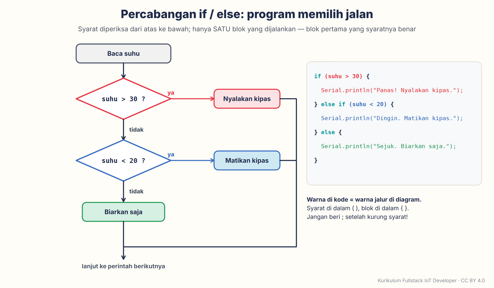

# Modul 3 — Pemrograman C++ untuk ESP32 dari Nol

*Fase 0 · Minggu 3 · Perangkat keras (*hardware*): **tidak wajib** — semua praktik bisa tanpa papan (Wokwi, Arduino IDE, GitHub Desktop); papan ESP32 dan breadboard dari Modul 2 boleh ikut dipakai · Prasyarat: **Modul 2** · Waktu: 8–10 jam, dicicil dalam seminggu*

[⬅️ Modul 2](../modul-02-listrik-dan-unggah-pertama/README.md) · [Silabus](../../SILABUS.md) · [Pelacak progres](../../PROGRES.md) · [Modul 4 ➡️ (segera terbit — baca ringkasannya di Silabus)](../../SILABUS.md#modul-4--javascript--nodejs-dari-nol-bahasa-untuk-server--dashboard)

---

Dua minggu terakhir kamu sudah membuat LED berkedip — di layar (Modul 1) dan di meja (Modul 2). Jujur saja: sebagian besar kodenya kamu **salin**. Minggu ini giliranmu **menulis sendiri**. Kita belajar "tata bahasa" C++ yang dipakai ESP32: menyimpan angka dan teks, membuat keputusan, mengulang pekerjaan, membuat "resep" sendiri, mengelompokkan data sensor, sampai membaca pesan error tanpa panik. Di akhir minggu kamu menulis program **lampu lalu lintas** dari nol dan menyimpannya ke GitHub dengan alat baru, **GitHub Desktop**.

Kabar baiknya: **tidak ada perangkat keras baru**. Semua praktik bisa dikerjakan tanpa papan: cukup Wokwi di browser, ditambah Arduino IDE dan GitHub Desktop di laptop. Kalau papan dan breadboard dari Modul 2 ada di meja, kamu boleh mencoba hasilnya di papan asli juga — itu bonus, bukan syarat.


> [!NOTE]
> **Cara memakai kode di modul ini.** Setiap kotak kode punya tombol salin (ikon dua kotak bertumpuk) di pojok kanan atasnya. Kalau kamu mau mengetik sendiri — sangat dianjurkan karena jari ikut belajar — perhatikan huruf besar-kecil dan tanda bacanya: bagi C++, `Serial` dan `serial` adalah dua nama yang berbeda. Semua kode juga tersedia sebagai file di folder [`kode/`](kode/). Pengguna macOS: ganti **Ctrl** dengan **Cmd** di semua pintasan.

Ritme modul ini sama dengan Modul 1–2. Bagian lipat di 🚨 (klik judulnya untuk membuka) cukup dibuka saat kamu membutuhkannya; bagian lipat di 🔬 boleh dilewati. Setiap praktik diawali kotak **🖥️** yang menyebut alat apa yang harus kamu buka.

## Daftar isi

1. [🎯 Setelah modul ini kamu bisa…](#-setelah-modul-ini-kamu-bisa)
2. [🧰 Yang perlu disiapkan](#-yang-perlu-disiapkan)
3. [🏆 Kemenangan Cepat: program pertamamu yang "bicara" (10 menit)](#-kemenangan-cepat-program-pertamamu-yang-bicara-10-menit)
4. [🧠 Konsep "Mengapa"](#-konsep-mengapa)
   - [1 Sketch](#1-program-kompiler-dan-bentuk-sebuah-sketch) · [2 Variabel](#2-variabel-dan-tipe-data-stoples-berlabel) · [3 Operator](#3-operator-tanda-hitung-pembanding-dan-logika) · [4 `if`/`else`](#4-percabangan-ifelse-mengambil-keputusan) · [5 Perulangan](#5-perulangan-for-dan-while-mengulang-tanpa-menulis-ulang) · [6 Fungsi](#6-fungsi-resep-yang-bisa-dipanggil-berulang-kali) · [7 *Array*](#7-array-deret-laci-bernomor) · [8 `struct`](#8-struct-satu-formulir-berisi-banyak-data) · [9 Gaya rapi](#9-const-define-komentar-dan-gaya-rapi) · [10 Serial Monitor & error](#10-serial-monitor-sebagai-jendela-ke-otak-chip--dan-cara-membaca-pesan-error) · [11 Library](#11-library-kode-siap-pakai--dan-contoh-bawaan) · [12 Git](#12-git-dan-github-desktop-memotret-kemajuan)
5. [🔧 Praktik langkah demi langkah](#-praktik-langkah-demi-langkah)
   - [1 Kalkulator](#praktik-1--kalkulator-serial-20-menit) · [2 Bengkel error](#praktik-2--bengkel-error-sengaja-salah-lalu-baca-pesannya-15-menit) · [3 Fungsi LED](#praktik-3--fungsi-buatan-sendiri-nyalakanledberapakali-15-menit) · [4 Morse](#praktik-4--nama--kode-morse--kedip-led-otomatis-20-menit) · [5 *Array* suhu](#praktik-5--array-suhu-rata-rata-tertinggi-terendah-15-menit) · [6 `struct`](#praktik-6--struct-bacaansensor-satu-formulir-banyak-data-15-menit) · [7 Library](#praktik-7--library-versi-tertentu-dan-contoh-bawaan-25-menit) · [8 Lampu lalu lintas ⭐](#praktik-8--proyek-kelulusan-lampu-lalu-lintas-3-led-3045-menit) · [9 GitHub Desktop ⭐](#praktik-9--github-desktop-clone-commit-push-3045-menit-sekali-pasang)
6. [🚨 Kalau Tidak Jalan?](#-kalau-tidak-jalan)
7. [🔬 Bedah Teknis (opsional)](#-bedah-teknis-opsional)
8. [🧩 Tantangan mandiri](#-tantangan-mandiri)
9. [➕ Tambahan ke "Rumah Pintar Mini"](#-tambahan-ke-rumah-pintar-mini)
10. [📖 Glosarium](#-glosarium) · [📝 Kuis](#-kuis-5-soal) · [✅ Checklist kelulusan](#-checklist-kelulusan-modul-3)
11. [📚 Sumber & atribusi gambar](#-sumber--atribusi-gambar)

---

## 🎯 Setelah modul ini kamu bisa…

- **Menulis program C++ sederhana untuk ESP32 tanpa menyontek** — memakai variabel, operator, `if`/`else`, perulangan `for`/`while`, fungsi dengan parameter dan nilai balik, *array* (larik), dan `struct`.
- **Membaca pesan error kompiler tanpa panik**: menemukan baris yang dimaksud, memahami pesan-pesan yang paling sering muncul, dan tahu kenapa error **pertama** yang harus dibetulkan lebih dulu.
- **Memakai library dengan versi tertentu** dan belajar dari **contoh bawaan** (**File → Examples**) — sumber belajar terbaik yang sering terlupakan.
- **Menyimpan setiap kemajuan dengan Git lewat GitHub Desktop**: mengambil salinan repositori (*clone*), "memotret" kemajuan (*commit*), dan mengunggahnya (*push*).
- **Menulis program lampu lalu lintas 3 LED sendiri** dan menyimpannya di GitHub — syarat lulus modul ini.

---

## 🧰 Yang perlu disiapkan

| Kebutuhan | Keterangan |
| :--- | :--- |
| **Laptop dengan Arduino IDE 2 + paket esp32** | Sudah terpasang di Modul 2. Belum? Kerjakan dulu [Praktik 2.1–2.2 Modul 2](../modul-02-listrik-dan-unggah-pertama/README.md#21-unduh-dan-pasang-arduino-ide-2) — tidak butuh kit. |
| **Browser + Wokwi** | Sama seperti Modul 1. Akun Wokwi (gratis) tidak wajib, tetapi berguna untuk menyimpan proyek supaya rangkaiannya tidak perlu ditempel ulang. |
| **Akun GitHub + repositori `belajar-iot`** | Dibuat di [Modul 1 Praktik 4](../modul-01-peta-besar-iot/README.md#praktik-4--simpan-ke-github-lewat-browser-tanpa-menginstal-apa-pun). |
| **GitHub Desktop** | Dipasang di Praktik 9 (unduhan ±310 MB). Butuh Windows 10/11 64-bit atau macOS 13 ke atas (versi 3.6.6 masih jalan di macOS 12, tetapi versi sesudahnya tidak). Pengguna Linux atau macOS 12: lihat catatan di Praktik 9. |
| **Opsional: papan ESP32 + breadboard dari Modul 2** | LED merah di D4 sudah terpasang sejak Modul 2. Untuk lampu lalu lintas di papan asli, tambahkan 1 LED hijau, 1 LED kuning, 2 resistor 220 Ω, dan 5 kabel jumper (2 untuk sinyal, 3 hitam) — semuanya ada di Kit A Tahap 1. |
| **Internet** | Wokwi menerjemahkan kode di servernya, jadi butuh koneksi. Kuota yang terpakai kecil, kecuali saat mengunduh GitHub Desktop. |

**Versi yang dipakai di modul ini:**

| Alat | Versi | Catatan |
| :--- | :--- | :--- |
| Arduino IDE | **2.3.x** (saat ditulis: 2.3.10) | Dari Modul 2. |
| Paket papan **esp32 by Espressif Systems** | **3.3.x** (saat ditulis: 3.3.12) | Dari Modul 2. |
| Library **ArduinoJson** | **7.4.3** (rilis Maret 2026) | Dipasang di Praktik 7. Cara menulis kode untuk versi 7 berbeda dengan versi 5–6 yang masih banyak dipakai di tutorial lama. |
| **GitHub Desktop** | **3.6.x** (saat ditulis: 3.6.6, rilis September 2026) | Dipasang di Praktik 9. Di dalamnya sudah ada Git, jadi tidak perlu memasang Git terpisah. |

---

## 🏆 Kemenangan Cepat: program pertamamu yang "bicara" (10 menit)

Di Modul 1–2, ESP32 kebanyakan berbicara lewat LED. Di Modul 2 kamu sempat membaca pesannya di Serial Monitor, tetapi kodenya salinan. Sekarang kamu sendiri yang menyusun **kalimatnya**: memperkenalkan dirimu dan menghitung sesuatu untukmu.

> 🖥️ **Alat yang dipakai di bagian ini:** browser → **https://wokwi.com/projects/new/esp32**. Tidak perlu papan, tidak perlu memasang apa pun.

1. Buka alamat di atas. Wokwi membuka proyek ESP32 baru; tab **`sketch.ino`** sudah berisi kerangka `setup()` dan `loop()`.
2. Klik di dalam editor, hapus semua isinya (**Ctrl + A**, lalu **Delete**), kemudian salin-tempel kode di bawah ini (file aslinya: [`kode/modul03_halo/modul03_halo.ino`](kode/modul03_halo/modul03_halo.ino)):

   ```cpp
   // Modul 3 - Kemenangan Cepat: program pertamamu yang "bicara"
   // Jalankan di Wokwi (proyek ESP32 baru) atau di papan asli.
   // Hasilnya muncul di Serial Monitor.

   String nama = "Ani";   // teks: tulis namamu di antara dua tanda petik
   int umur = 17;         // bilangan bulat: umurmu dalam tahun

   void setup() {
     Serial.begin(115200);  // buka jalur bicara ke laptop, kecepatan 115200
     delay(500);            // beri waktu sejenak sebelum mulai bicara
     Serial.println();      // satu baris kosong supaya rapi

     Serial.println("Halo, ESP32!");
     Serial.println("Namaku " + nama + ".");

     Serial.print("Umurku ");
     Serial.print(umur);
     Serial.println(" tahun.");

     Serial.print("Berarti aku sudah hidup kira-kira ");
     Serial.print(umur * 365);  // ESP32 yang menghitung: umur x 365
     Serial.println(" hari.");
   }

   void loop() {
     // Sengaja dikosongkan: semua pesan cukup dikirim sekali di setup().
   }
   ```

3. Ganti `"Ani"` dengan namamu (tanda petiknya jangan dihapus) dan `17` dengan umurmu.
4. Klik tombol hijau **▶**. Tunggu ±10 detik — Wokwi sedang menerjemahkan kodemu di servernya.
5. Lihat **Serial Monitor** di bawah panel simulasi. Mula-mula muncul beberapa baris "aneh" (`rst:0x1 …`, `entry 0x400805dc`) — itu laporan *boot* bawaan chip, sama seperti di Modul 2. Setelah itu, muncul kalimat-kalimat milikmu:

   ```text
   Halo, ESP32!
   Namaku Ani.
   Umurku 17 tahun.
   Berarti aku sudah hidup kira-kira 6205 hari.
   ```


*Tangkapan layar [Wokwi](https://wokwi.com), © Wokwi (CodeMagic LTD), Oktober 2026; dipakai untuk tujuan pendidikan, penanda oleh penulis.*

Selamat — kamu baru saja memakai **dua variabel** (`nama` dan `umur`) dan menyuruh ESP32 **menghitung** (`umur * 365`). Papan di panel simulasi mungkin bentuknya berbeda dengan papanmu (proyek ESP32 baru di Wokwi memakai papan 38 pin), tetapi untuk program yang hanya memakai Serial Monitor, itu tidak masalah.

Coba dua hal kecil sebelum lanjut: (1) ubah `umur * 365` menjadi `umur * 365 * 24`, lalu ubah kata `hari` menjadi `jam`; (2) hapus satu tanda titik koma `;` di mana saja, klik **▶**, lihat apa yang terjadi, lalu kembalikan titik komanya. Jangan khawatir — Praktik 2 khusus membahas pesan error.

---

## 🧠 Konsep "Mengapa"

Dua belas konsep, satu per bagian — **tidak perlu dibaca sekaligus**. Bacanya santai saja; ada ☕ titik istirahat di tengah. Urutan yang disarankan: Konsep 1–4 dan Konsep 10 → Praktik 1–2 → Konsep 5–8 → Praktik 3–6 → Konsep 9, 11, dan 12 → Praktik 7–9. Setiap praktik juga menyebut konsep mana yang dipakainya.

### 1. Program, kompiler, dan bentuk sebuah sketch

Ingat analogi Modul 1? Kode adalah **resep**, kompiler adalah **juru masak**, dan file biner yang masuk ke chip adalah **masakannya** ([Modul 1 Konsep 4](../modul-01-peta-besar-iot/README.md#4-dari-kode-ke-chip-resep--juru-masak--masakan)). Juru masak yang satu ini sangat teliti: satu tanda baca yang hilang membuatnya berhenti dan bertanya. Pertanyaannya itulah yang kita sebut **pesan error**.

Program Arduino disebut *sketch* (sketsa). Bentuknya hampir selalu sama — empat bagian, dari atas ke bawah:


1. **Bagian atas** — `#include` (memanggil library, Konsep 11), konstanta, dan variabel yang dipakai di mana-mana.
2. **Fungsi buatanmu sendiri** — "resep kecil" seperti `kedip()` yang kamu pakai di Modul 1 Praktik 3 (dibahas di Konsep 6 modul ini). Di kurikulum ini kita menaruhnya di atas `setup()`.
3. **`setup()`** — dijalankan **sekali** saat chip menyala: "ritual pagi".
4. **`loop()`** — diulang **terus-menerus** sampai listrik dicabut: "rutinitas seharian". Gambar dua "ruangan" ini sudah kamu lihat di [Modul 1 Konsep 5](../modul-01-peta-besar-iot/README.md#5-dua-ruangan-dalam-setiap-program-setup-dan-loop).

Lima aturan tulis yang berlaku di semua bagian:

- Setiap **perintah** diakhiri **titik koma** `;` — seperti titik di akhir kalimat.
- **Kurung kurawal** `{ … }` membungkus satu **blok**: isi sebuah fungsi, isi sebuah `if`, isi sebuah perulangan. Setiap `{` harus punya pasangan `}`.
- **Huruf besar-kecil dibedakan**: `digitalWrite` benar, `digitalwrite` salah.
- **Komentar** diawali `//` dan diabaikan kompiler — catatan untuk manusia.
- **Spasi dan baris baru** tidak mengubah arti, tetapi membuat kode mudah dibaca. Rapikan secara otomatis dengan **Tools → Auto Format** (**Ctrl + T**) di Arduino IDE.

### 2. Variabel dan tipe data: stoples berlabel

Bayangkan dapur dengan banyak **stoples berlabel**: "gula", "garam", "kopi". Labelnya adalah **nama variabel**, isinya adalah **nilai**, dan jenis stoplesnya adalah **tipe data** — stoples kerupuk tidak cocok untuk menyimpan minyak.

```cpp
int umur = 17;
```

Baca dari kiri ke kanan: "buat stoples **berjenis `int`** bernama **`umur`**, lalu **isi dengan** 17". Tanda `=` di C++ artinya **"isi dengan"**, bukan "sama dengan". (Untuk membandingkan "apakah sama", C++ memakai `==` — dibahas di Konsep 3.)


Lima tipe data yang paling sering kita pakai:

| Tipe | Isinya | Contoh | Catatan di ESP32 |
| :--- | :--- | :--- | :--- |
| `int` | Bilangan **bulat** | `int umur = 17;` | Dari −2.147.483.648 sampai 2.147.483.647 (±2,1 miliar). |
| `float` | Bilangan **pecahan** | `float suhu = 28.5;` | Ketelitiannya ±7 angka penting. Cukup untuk sensor. |
| `bool` | **Ya/tidak** | `bool lampuMenyala = true;` | Hanya `true` atau `false`. |
| `String` | **Teks** | `String nama = "Ani";` | Ditulis di antara tanda petik ganda `"…"`. |
| `char` | **Satu** huruf | `char huruf = 'A';` | Ditulis di antara tanda petik tunggal `'…'`. |

Nanti kamu juga akan bertemu `unsigned long` (bilangan bulat yang tidak pernah negatif, dari 0 sampai ±4,29 miliar, untuk mencatat waktu; Modul 8) dan `const` (Konsep 9).

> [!WARNING]
> **Di dalam kode, desimal memakai titik, bukan koma.** Tulis `28.5`, bukan `28,5`. Bagi C++, koma punya arti lain: `float suhu = 28,5;` memberi error, sedangkan `suhu = 28,5;` (tanpa kata `float`) lebih parah — lolos tanpa pesan dan diam-diam mengisi `suhu` dengan 28. Di artikel ini, angka di kalimat biasa tetap memakai koma sesuai EYD (28,5 °C), sedangkan angka di dalam kode dan di Serial Monitor memakai titik.

Aturan memberi nama variabel:

- Tanpa spasi, tidak boleh diawali angka, tidak boleh memakai tanda baca selain garis bawah `_`. `umur1`, `suhu_kamar`, dan `detikHidup` boleh; `1umur`, `suhu kamar`, dan `suhu-kamar` tidak.
- Gaya kurikulum ini: variabel dan fungsi memakai **huruf kecil + huruf besar di awal kata berikutnya** (`detikHidup`, `nyalakanLED`), konstanta memakai **HURUF_BESAR_DENGAN_GARIS_BAWAH** (`PIN_LED`).
- Pakai nama yang bercerita. `suhuKamar` jauh lebih jelas daripada `x`.

Satu hal lagi: **di mana** variabel dibuat menentukan **siapa** yang boleh memakainya. Variabel yang dibuat di bagian atas sketch (di luar semua fungsi) disebut **variabel global** — bisa dipakai di mana saja. Variabel yang dibuat **di dalam** sebuah blok `{ … }` hanya berlaku di dalam blok itu. Itulah sebabnya error `'x' was not declared in this scope` ("x belum dikenal di wilayah ini") sering muncul: variabelnya dibuat di `setup()`, tetapi dipakai di `loop()`.

### 3. Operator: tanda hitung, pembanding, dan logika

**Operator hitung** bekerja seperti kalkulator, dengan dua kejutan:

| Operator | Arti | Contoh | Hasil |
| :---: | :--- | :--- | :--- |
| `+` `-` | tambah, kurang | `10 - 3` | `7` |
| `*` | kali (bukan `x`) | `4 * 5` | `20` |
| `/` | bagi | `7 / 2` | **`3`** ← kejutan 1 |
| `/` | bagi (dengan pecahan) | `7.0 / 2` | `3.5` |
| `%` | **sisa** bagi | `7 % 2` | `1` ← kejutan 2 |

**Kejutan 1:** kalau kedua angka bilangan bulat, hasil pembagiannya juga bulat — bagian pecahannya **dibuang**, bukan dibulatkan. `7 / 2` menghasilkan 3. Supaya hasilnya 3,5, salah satu angkanya harus pecahan: `7.0 / 2`. **Kejutan 2:** `%` bukan persen, melainkan **sisa bagi**. `7 % 2` = 1 (7 dibagi 2 sisa 1). Gunanya banyak, misalnya mengecek bilangan genap: `angka % 2 == 0`.

Seperti di sekolah, `*` dan `/` dikerjakan lebih dulu daripada `+` dan `-`. Ragu? Pakai kurung: `(a + b) / 2`.

**Operator pembanding** menghasilkan `true` atau `false`:

| Operator | Arti | Contoh (`suhu` = 31) |
| :---: | :--- | :--- |
| `==` | sama dengan | `suhu == 31` → `true` |
| `!=` | tidak sama dengan | `suhu != 31` → `false` |
| `>` `<` | lebih besar, lebih kecil | `suhu > 30` → `true` |
| `>=` `<=` | lebih besar atau sama dengan, lebih kecil atau sama dengan | `suhu <= 30` → `false` |

**Operator logika** menggabungkan beberapa syarat: `&&` (**dan** — dua-duanya harus benar), `||` (**atau** — salah satu cukup), dan `!` (**bukan** — membalik benar menjadi salah, dan sebaliknya). Contoh: `suhu > 30 && adaOrang` artinya "panas **dan** ada orang".

**Bentuk singkat** yang akan sering kamu lihat: `x = x + 1;` bisa ditulis `x += 1;` atau `x++;`. Ketiganya sama artinya: "tambah satu". Kebalikannya, `x--;` artinya "kurangi satu".

> [!CAUTION]
> **Jebakan paling klasik: `=` dan `==`.** `if (suhu = 30)` **tidak** membandingkan — ia **mengisi** `suhu` dengan 30, dan syaratnya selalu dianggap benar. Arduino IDE tidak memperingatkanmu (peringatan kompiler bawaannya dimatikan). Kalau `if` milikmu "selalu masuk", periksa jumlah tanda `=`-nya dulu. Mau diperingatkan? Di Arduino IDE, buka **File → Preferences…** (macOS: **Arduino IDE → Settings…**), lalu ubah **Compiler warnings** menjadi **More**.

### 4. Percabangan `if`/`else`: mengambil keputusan

Program yang hanya berjalan lurus tidak bisa bereaksi. Dengan `if` ("kalau"), program bisa memilih:

```cpp
if (suhu > 30) {
  Serial.println("Panas! Nyalakan kipas.");
} else if (suhu < 20) {
  Serial.println("Dingin. Matikan kipas.");
} else {
  Serial.println("Sejuk. Biarkan saja.");
}
```

Cara membacanya seperti kalimat: "**kalau** suhu lebih dari 30, cetak `Panas!`; **kalau tidak, tetapi kalau** suhu kurang dari 20, cetak `Dingin.`; **selain itu**, cetak `Sejuk.`". Program memeriksa syarat dari atas ke bawah dan hanya menjalankan **satu** blok — blok pertama yang syaratnya benar.



Tiga hal yang perlu diingat:

- Syaratnya selalu di dalam **kurung** `( … )`, dan bloknya di dalam **kurung kurawal** `{ … }`.
- **Jangan** memberi titik koma setelah kurung syarat. `if (suhu > 30);` membuat `if` itu "kosong", dan blok di bawahnya selalu dijalankan.
- `else if` dan `else` boleh tidak ada. `if` saja juga sah.

### 5. Perulangan `for` dan `while`: mengulang tanpa menulis ulang

Kamu sudah kenal satu perulangan: `loop()` sendiri diulang selamanya. Di dalamnya, sering kita perlu mengulang sesuatu **beberapa kali saja** — misalnya mengedipkan LED 5 kali. Untuk itu ada `for`:

```cpp
for (int i = 1; i <= 5; i++) {
  Serial.println(i);
}
```

Di dalam kurung `for` ada **tiga bagian** yang dipisahkan titik koma:


1. **Titik mulai** — `int i = 1`: buat penghitung `i`, mulai dari 1.
2. **Syarat lanjut** — `i <= 5`: selama `i` paling banyak 5, ulangi.
3. **Langkah** — `i++`: setiap selesai satu putaran, tambah `i` dengan 1.

Hasilnya, Serial Monitor mencetak 1, 2, 3, 4, 5. Saat `i` menjadi 6, syaratnya salah dan perulangan berhenti. Nama `i` hanya kebiasaan; boleh diganti `ke` atau `hitung`.

`while` ("selama") dipakai kalau kita **tidak tahu** berapa kali harus mengulang, hanya tahu **kapan berhenti**:

```cpp
int sisa = 3;
while (sisa > 0) {
  Serial.print("Sisa ");
  Serial.println(sisa);
  sisa = sisa - 1;
}
```

Pastikan ada sesuatu di dalam `while` yang suatu saat membuat syaratnya salah. Kalau tidak (misalnya baris `sisa = sisa - 1;` lupa ditulis), program berputar di situ selamanya: Serial Monitor dibanjiri `Sisa 3` tanpa henti, sedangkan perintah sesudah `while` — termasuk kedip LED — tidak pernah dijalankan lagi. Kalau di dalam `while` tidak ada `Serial.print`, chip tampak "membeku" sama sekali. Ingin keluar dari perulangan lebih awal? Pakai `break;`.

### 6. Fungsi: resep yang bisa dipanggil berulang kali

Di Modul 1 kamu sudah memakai fungsi `kedip(…)` tanpa tahu isinya. Sekarang kita bedah. Fungsi adalah **resep kecil bernama** yang bisa dipanggil kapan saja:

```cpp
void nyalakanLED(int berapaKali) {
  for (int i = 1; i <= berapaKali; i++) {
    digitalWrite(PIN_LED, HIGH);
    delay(300);
    digitalWrite(PIN_LED, LOW);
    delay(300);
  }
}
```

- **`nyalakanLED`** adalah nama resepnya.
- **`(int berapaKali)`** adalah **parameter** — "bahan" yang diserahkan saat resep dipanggil. Panggilan `nyalakanLED(3);` mengisi `berapaKali` dengan 3; `nyalakanLED(5);` mengisinya dengan 5.
- **`void`** di depan artinya resep ini **tidak menghasilkan apa-apa** untuk dibawa pulang — ia hanya **melakukan** sesuatu. (Inilah arti `void` yang dijanjikan di Modul 1.)

Ada juga resep yang **menghasilkan sesuatu**; hasilnya disebut **nilai balik**:

```cpp
float keFahrenheit(float celsius) {
  return celsius * 9.0 / 5.0 + 32.0;
}
```

Kata `float` di depan menjanjikan bahwa resep ini mengembalikan bilangan pecahan, dan kata **`return`** menyerahkan hasilnya. Pemakaiannya: `float f = keFahrenheit(30.0);` → `f` berisi `86.0`.


`setup()` dan `loop()` pun sebenarnya fungsi — `void`, tanpa parameter, dan dipanggil otomatis oleh "sistem" Arduino. Kenapa repot membuat fungsi sendiri? Ada tiga alasan: kode yang sama tidak perlu ditulis berulang; namanya membuat kode mudah dibaca ("oh, di sini LED dikedipkan"); dan kalau ada yang salah, cukup membetulkan satu tempat.

> ☕ **Titik istirahat.** Enam konsep di atas adalah "tata bahasa inti" — dengan itu saja kamu sudah bisa menulis banyak program. Enam berikutnya adalah alat bantu: wadah data yang lebih besar, kerapian, pesan error, library, dan Git. Kalau sudah membaca 30 menit, berdiri dulu, minum, lalu lanjut.

### 7. *Array*: deret laci bernomor

Kalau ingin menyimpan suhu 7 hari, membuat 7 variabel (`suhu1`, `suhu2`, …) sungguh merepotkan. *Array* (larik) adalah **satu nama untuk deretan laci bernomor**:

```cpp
float suhu[7] = {28.5, 29.1, 30.4, 31.2, 29.8, 27.6, 28.9};
```

Artinya: "buat deret 7 laci bernama `suhu`, masing-masing berisi `float`, dengan isi awal sebagai berikut". Nomor laci (**indeks**) **dimulai dari 0**: `suhu[0]` adalah `28.5`, `suhu[1]` adalah `29.1`, … `suhu[6]` adalah `28.9`.


Dua hal yang membuat *array* hebat sekaligus berbahaya:

- **Hebat:** dengan `for`, kamu bisa membuka semua laci tanpa menulis satu per satu: `for (int i = 0; i < 7; i++) { … suhu[i] … }`. Perhatikan syaratnya `i < 7`, bukan `i <= 7`.
- **Berbahaya:** C++ **tidak** memeriksa apakah nomor lacinya ada. `suhu[7]` (laci kedelapan, padahal hanya ada 7) tidak memberi error saat kompilasi. Saat program jalan, membaca laci yang tidak ada biasanya menghasilkan angka ngawur. Kalau lacinya berisi `String` atau kamu **menulis** ke laci di luar batas, ESP32 bisa *restart* dengan pesan `Guru Meditation Error` di Serial Monitor. Kalau melihat angka aneh atau *restart* misterius setelah memakai *array*, periksa batas indeksnya dulu.

### 8. `struct`: satu formulir berisi banyak data

Satu bacaan sensor terdiri atas beberapa data sekaligus: suhu, kelembapan, cahaya, dan ada-tidaknya gerakan. Alih-alih membuat empat variabel yang berceceran, kita kelompokkan semuanya dalam satu **`struct`** — bayangkan **formulir** dengan beberapa kolom isian:

```cpp
struct BacaanSensor {
  float suhu;      // derajat Celsius
  int kelembapan;  // persen
  int cahaya;      // 0-4095
  bool gerak;      // ada gerakan?
};
```

Kode di atas baru **merancang formulir kosong**, semacam cetakan (tipe data baru bernama `BacaanSensor`). Belum ada isinya, dan belum ada yang tampil di Serial Monitor. Untuk **mengisi** formulir, buat variabelnya, lalu isi kolomnya lewat tanda titik (`bacaan.suhu`):

```cpp
BacaanSensor bacaan;
bacaan.suhu = 28.5;
bacaan.kelembapan = 71;
```


Nama kolomnya sengaja sama dengan "kontrak data" proyek kita — kesepakatan nama dan format data yang dipakai semua bagian proyek ([Lampiran A Silabus](../../SILABUS.md#14-lampiran-a--kontrak-data-rumah-pintar-mini)). Di Modul 11, isi formulir ini dikirim ke server dalam format JSON — dan di Praktik 7 kamu akan melihat cuplikannya lebih dulu.

### 9. `const`, `#define`, komentar, dan gaya rapi

Angka yang **tidak boleh berubah** (nomor pin, lama jeda) sebaiknya diberi nama dengan `const`:

```cpp
const int PIN_LED = 4;
```

`const` ("konstan") membuat kompiler menolak kalau suatu hari kamu tidak sengaja mengubahnya. Di tutorial lain kamu akan sering melihat cara lama:

```cpp
#define PIN_LED 4
```

`#define` bukan variabel, melainkan perintah "cari dan ganti" sebelum kompilasi: setiap tulisan `PIN_LED` diganti `4`. Perhatikan bentuknya — **tanpa** `=` dan **tanpa** `;`. Kesalahan klasiknya adalah menulis `#define PIN_LED 4;` — titik koma itu ikut "tertempel" di mana-mana dan memunculkan error membingungkan di baris yang jauh dari baris aslinya. Kurikulum ini memakai `const`, tetapi kamu perlu bisa membaca keduanya.

**Komentar** yang baik menjelaskan **kenapa**, bukan mengulang **apa**. `delay(500); // tunggu 500 ms` kurang berguna; `delay(500); // LED butuh jeda supaya kedipnya terlihat mata` lebih berguna. Untuk catatan panjang, pakai `/* … */`.

**Gaya rapi** bukan soal selera, melainkan soal **menemukan kesalahan lebih cepat**. Isi setiap blok digeser masuk dua spasi, satu perintah satu baris, dan baris kosong di antara bagian-bagian. Tidak perlu menghafal aturannya: di Arduino IDE, **Tools → Auto Format** (**Ctrl + T**) merapikan semuanya dalam sekejap. Biasakan menekannya sebelum menyimpan.

### 10. Serial Monitor sebagai "jendela ke otak chip" — dan cara membaca pesan error

Chip tidak punya layar, jadi kita tidak tahu apa yang sedang ia "pikirkan" — kecuali ia memberi tahu lewat Serial Monitor. Itulah alat *debugging* (mencari penyebab kesalahan) nomor satu di seluruh kurikulum:

- `Serial.print(x)` mencetak tanpa pindah baris; `Serial.println(x)` mencetak lalu pindah baris.
- Bilangan `float` dicetak dengan **2 angka di belakang titik** (`28.50`). Mau 1 angka? `Serial.print(suhu, 1)`.
- **Trik melacak *bug* (kutu):** cetak isi variabel di titik-titik penting. `Serial.print("i = "); Serial.println(i);` di dalam perulangan sering langsung membuka misteri.
- Membaca **ketikan** dari Serial Monitor: `Serial.available()` memberi tahu apakah ada yang masuk; `Serial.readStringUntil('\n')` mengambil satu baris utuh. (`'\n'` adalah tanda "pindah baris" yang ikut terkirim saat kamu menekan **Enter**.) Keduanya dipakai di Praktik 1 dan 4.

Sekarang sisi yang sering membuat pemula panik: **pesan error kompiler**. Di Modul 1 kamu sudah belajar membaca yang paling dasar. Minggu ini kita naik satu tingkat:

![Anatomi pesan error kompiler dari Wokwi dengan enam penanda bernomor: baris pertama In function 'void setup()' diberi label konteks, yaitu kesalahannya ada di dalam fungsi setup(); baris sketch.ino:17:16 berarti 1 nama file sketch.ino, 2 nomor baris 17, dan 3 kolom 16; lalu 4 jenis pesan error, 5 isi pesan 'umr' was not declared in this scope, dan 6 tebakan kompiler did you mean 'umur'?; di bawahnya potongan kode baris 17 dengan tanda gelombang di bawah kata umr dan saran perbaikan umur; kotak Ingat berisi tiga kebiasaan membaca error, termasuk bahwa Arduino IDE menampilkan pesan yang sama dengan alamat file lengkap dan diakhiri Compilation error](aset/anatomi-pesan-error.png)

- **`sketch.ino:17:16`** — nama file, **baris 17**, kolom 16. Nomor baris terlihat di tepi kiri editor.
- **`error:`** diikuti pesannya. **`note:`** adalah keterangan tambahan, bukan error baru.
- **`did you mean 'umur'?`** — kompiler versi baru sering **menebak** maksudmu. Tebakannya biasanya benar; bacalah.
- **Satu kesalahan bisa memunculkan banyak pesan.** Betulkan **pesan pertama** saja, lalu jalankan ulang. Pesan-pesan sisanya sering ikut hilang.
- **Di Arduino IDE**, pesannya sama, tetapi diawali alamat file lengkap (misalnya `C:\Users\…\modul03_halo.ino:17:16: error: …`) dan diakhiri `Compilation error: …` di panel **Output** serta di notifikasi pojok kanan bawah.

Daftar pesan yang paling sering beserta obatnya ada di Praktik 2 dan di 🚨.

### 11. Library: kode siap pakai — dan contoh bawaan

Tidak semua hal perlu ditulis sendiri. ***Library*** (pustaka) adalah kumpulan kode siap pakai buatan orang lain — seperti **buku resep** yang bisa dipinjam. Library dipanggil dengan `#include` di bagian atas sketch:

```cpp
#include <ArduinoJson.h>
```

Setelah baris itu, semua "resep" di dalam library ArduinoJson bisa kamu pakai. Library bisa dipasang lewat dua tempat:

- **Arduino IDE** — lewat **Library Manager** (ikon ketiga di bilah kiri, bergambar buku). Library yang dipasang di sana bisa dipakai oleh semua sketch-mu.
- **Wokwi** — lewat tab **Library Manager** di atas editor. Wokwi mencatat daftarnya di file **`libraries.txt`** di dalam proyek.

**Kenapa versi penting?** Library terus diperbarui, dan kadang cara menulisnya ikut berubah. Contoh nyata: kode untuk ArduinoJson versi 6 (`StaticJsonDocument<200> doc;`) sudah usang di versi 7 (cukup `JsonDocument doc;`). Itulah sebabnya setiap modul menyebut versi yang dipakai, dan kamu akan belajar **memilih versi tertentu** di Praktik 7.

**Contoh bawaan** adalah sumber belajar terbaik yang sering terlupakan. Hampir setiap library dilengkapi contoh siap pakai yang **pasti cocok dengan versi yang terpasang**. Letaknya di menu **File → Examples**, yang punya beberapa kelompok:

- **Built-in examples** — contoh dasar Arduino (`01.Basics`, `02.Digital`, …).
- **Examples for any board** — contoh dari library bawaan Arduino IDE yang bisa dipakai di papan apa pun.
- **Examples for DOIT ESP32 DEVKIT V1** — contoh khusus ESP32 (WiFi, Bluetooth, sensor sentuh, …). Kelompok ini muncul setelah papan dipilih (Modul 2 Praktik 2.4).
- **Examples from Custom Libraries** — contoh dari library yang kamu pasang sendiri, misalnya ArduinoJson.

Kebiasaan yang kita pakai sampai akhir kurikulum: **sebelum mencari tutorial di internet, buka dulu contoh bawaannya.**

### 12. Git dan GitHub Desktop: memotret kemajuan

Selama ini kamu menyimpan ke GitHub lewat browser: unggah file, klik **Commit changes**. Itu sudah memakai Git, hanya saja tidak terasa. Minggu ini kita memakainya dengan sengaja, lewat aplikasi **GitHub Desktop**.

**Git** adalah "mesin waktu" untuk sebuah folder. Empat kata kerjanya:

- ***Clone*** (menyalin) — mengunduh salinan repositori dari GitHub ke laptop, **lengkap dengan riwayatnya**. Cukup sekali.
- ***Commit*** — **memotret** keadaan folder saat ini, lengkap dengan catatan singkat ("Modul 3: kalkulator Serial"). Setiap foto tersimpan selamanya di riwayat; kamu bisa kembali ke foto mana pun.
- ***Push*** (mengunggah) — mengirim foto-foto baru dari laptop ke GitHub.
- ***Fetch*** (mengecek) — mengunduh kabar *commit* baru dari GitHub tanpa mengubah foldermu; ***pull*** (mengambil) — memasukkan *commit* baru itu ke folder di laptop.

![Alur Git: folder belajar-iot hasil clone di Documents GitHub berisi README.md, file Modul 1, folder modul-02, dan folder baru modul-03; commit memotret keadaan folder menjadi foto bernomor 3 di bagian atas riwayat laptop, dengan yang terbaru di atas; push mengirim foto baru itu ke repositori belajar-iot di GitHub, tempat commit 3 baru muncul setelah push; fetch atau pull mengambil commit dari GitHub ke laptop; clone menyalin repositori dari GitHub ke laptop sekali di awal; catatan bahwa commit tanpa push berarti fotonya masih di laptop saja](aset/git-commit-push.png)

Satu hal yang paling sering membingungkan pemula: ***commit* belum berarti tersimpan di GitHub.** *Commit* menyimpan foto di **laptop**; baru setelah ***push***, foto itu muncul di GitHub. GitHub Desktop membuat semua ini cukup dengan mengeklik tombol, tanpa mengetik perintah.

---

## 🔧 Praktik langkah demi langkah

Sembilan praktik pendek. Hampir semuanya cukup di Wokwi; Praktik 7 juga memakai Arduino IDE, dan Praktik 9 memasang GitHub Desktop. Proyek kelulusan ada di **Praktik 8**; simpanlah kodenya baik-baik untuk Praktik 9.

> [!TIP]
> **Biasakan menyimpan kodemu.** Setiap selesai satu praktik, klik di editor Wokwi, tekan **Ctrl + A**, lalu **Ctrl + C**. Di Arduino IDE, pilih **File → New Sketch**, hapus isi bawaannya (**Ctrl + A**, lalu **Delete**), tempel (**Ctrl + V**), lalu **File → Save** dengan nama seperti `modul03_kalkulator` (tersimpan di folder *Arduino* di dalam *Documents*). Di Praktik 9, semuanya dipindahkan ke GitHub. Punya akun Wokwi? Klik **Save** di Wokwi juga.
>
> **Mau lebih praktis?** Kerjakan dulu Praktik 9.1–9.3 (pasang GitHub Desktop dan *clone*, ±20 menit). Setelah itu, simpan setiap sketch langsung ke folder `modul-03` di dalam repositori `belajar-iot` (caranya di Praktik 9.4), lalu *commit* setiap kali satu praktik selesai.

### Praktik 1 — Kalkulator Serial (20 menit)

> 🖥️ **Alat yang dipakai:** browser → **https://wokwi.com/projects/new/esp32** (proyek ESP32 baru). Tidak perlu papan.

> 📌 Praktik 1–2 memakai [Konsep 1–4](#1-program-kompiler-dan-bentuk-sebuah-sketch) dan [Konsep 10](#10-serial-monitor-sebagai-jendela-ke-otak-chip--dan-cara-membaca-pesan-error) (membaca ketikan dan membaca pesan error). Belum membacanya? Baca dulu, ±30 menit.

Kalkulator ini menerima soal yang kamu ketik — misalnya `12 + 5` — lalu menjawabnya. Isinya memakai Konsep 2–4 (variabel, operator, dan `if`/`else`) serta cara membaca ketikan dari Konsep 10.

1. Buka proyek ESP32 baru di Wokwi, hapus isi `sketch.ino`, lalu tempel kode di bawah ini (file aslinya: [`kode/modul03_kalkulator/modul03_kalkulator.ino`](kode/modul03_kalkulator/modul03_kalkulator.ino)):

   ```cpp
   // Modul 3 - Praktik 1: kalkulator Serial
   // Ketik soal di Serial Monitor, misalnya 12 + 5, lalu tekan Enter.
   // Operator yang dikenal: +  -  *  /   (spasi boleh ada, boleh tidak)

   void setup() {
     Serial.begin(115200);
     delay(500);
     Serial.println();
     Serial.println("=== Kalkulator ESP32 ===");
     Serial.println("Ketik soal, misalnya 12 + 5, lalu tekan Enter.");
     Serial.println("Operator: +  -  *  /");
   }

   void loop() {
     if (Serial.available() > 0) {                  // ada ketikan yang masuk?
       String soal = Serial.readStringUntil('\n');  // ambil satu baris, misalnya "12 + 5"
       soal.replace(" ", "");                       // buang semua spasi: "12+5"
       soal.trim();                                 // buang sisa tanda Enter

       // Cari letak operatornya. Pencarian dimulai dari karakter kedua (posisi 1)
       // supaya tanda minus di depan angka pertama (misalnya -3*2) tidak dikira operator.
       char operasi = '*';
       int posisi = soal.indexOf('*', 1);
       if (posisi < 0) {
         operasi = '/';
         posisi = soal.indexOf('/', 1);
       }
       if (posisi < 0) {
         operasi = '+';
         posisi = soal.indexOf('+', 1);
       }
       if (posisi < 0) {
         operasi = '-';
         posisi = soal.indexOf('-', 1);
       }

       if (posisi < 0) {
         // indexOf() memberi -1 kalau yang dicari tidak ada
         Serial.println("Operator tidak ditemukan. Contoh yang benar: 12 + 5");
       } else {
         float angka1 = soal.substring(0, posisi).toFloat();   // bagian kiri operator
         float angka2 = soal.substring(posisi + 1).toFloat();  // bagian kanan operator

         if (operasi == '/' && angka2 == 0) {
           Serial.println("Tidak bisa membagi dengan nol!");
         } else {
           float hasil = 0;
           if (operasi == '+') {
             hasil = angka1 + angka2;
           } else if (operasi == '-') {
             hasil = angka1 - angka2;
           } else if (operasi == '*') {
             hasil = angka1 * angka2;
           } else {
             hasil = angka1 / angka2;
           }

           Serial.print(angka1);
           Serial.print(" ");
           Serial.print(operasi);
           Serial.print(" ");
           Serial.print(angka2);
           Serial.print(" = ");
           Serial.println(hasil);
         }
       }
     }
   }
   ```

2. Klik **▶**. Setelah pesan *boot*, Serial Monitor menampilkan `=== Kalkulator ESP32 ===`.
3. Klik **kotak ketik di bagian paling bawah Serial Monitor**, ketik `12 + 5`, lalu tekan **Enter**. Jawabannya muncul: `12.00 + 5.00 = 17.00`.

   

   *Tangkapan layar [Wokwi](https://wokwi.com), © Wokwi (CodeMagic LTD), Oktober 2026; dipakai untuk tujuan pendidikan, penanda oleh penulis.*

4. Coba soal-soal ini satu per satu dan cocokkan dengan hasil di Serial Monitor:

   | Ketik | Hasil yang muncul | Pelajarannya |
   | :--- | :--- | :--- |
   | `7/2` | `7.00 / 2.00 = 3.50` | Karena memakai `float`, hasilnya pecahan (bandingkan dengan `7 / 2` = 3 di Konsep 3). |
   | `-3*4` | `-3.00 * 4.00 = -12.00` | Tanda minus di depan angka pertama tidak dikira operator. |
   | `10 / 0` | `Tidak bisa membagi dengan nol!` | `if` menjaga program dari soal yang mustahil. |
   | `halo` | `Operator tidak ditemukan. …` | `indexOf()` memberi `-1` kalau tidak menemukan apa-apa. |

Bagian-bagian kode yang baru:

- `soal.replace(" ", "")` membuang semua spasi, `soal.indexOf('+', 1)` mencari letak tanda `+` mulai dari karakter kedua (komputer menghitung posisi dari 0, jadi posisi 1 = karakter kedua; lihat Konsep 7), dan `soal.substring(0, posisi)` memotong teks dari awal sampai tepat sebelum operator. Ketiganya adalah "resep" milik tipe `String`.
- `.toFloat()` mengubah teks `"12"` menjadi bilangan `12.0` supaya bisa dihitung. Teks dan bilangan adalah dua hal berbeda: `String("12") + "5"` menghasilkan teks `"125"`, bukan 17. (Menulis `"12" + "5"` tanpa `String(…)` malah error di C++ — berbeda dengan JavaScript di Modul 4.)
- Rangkaian `if … else if … else` memilih operasi yang tepat — persis Konsep 4.
- Serial Monitor memakai **titik desimal** (`3.50`), bukan koma.

### Praktik 2 — Bengkel error: sengaja salah, lalu baca pesannya (15 menit)

> 🖥️ **Alat yang dipakai:** Wokwi dengan kode **Kemenangan Cepat** (tempel ulang dari atas kalau tab sebelumnya sudah ditutup).

Di Modul 2 kamu sengaja "merusak" rangkaian. Sekarang kita merusak **kode** — satu per satu. Untuk setiap baris tabel: buat kerusakannya, klik **▶**, baca kotak **Build failed!** yang muncul, betulkan, lalu lanjut ke baris berikutnya. Nomor baris di layarmu bisa sedikit berbeda kalau kodemu tidak persis sama; yang penting, nomor itu menunjuk baris yang kamu rusak — kecuali kerusakan 4 (baca kolom terakhirnya). Pesan-pesan di tabel ini adalah pesan asli dari Wokwi.

| # | Kerusakan | Pesan yang muncul | Cara membacanya |
| :---: | :--- | :--- | :--- |
| 1 | Hapus `;` di ujung `Serial.println("Halo, ESP32!");` | `sketch.ino:13:33: error: expected ';' before 'Serial0'` | Titik koma hilang di **baris 13**. Kompiler baru sadar saat bertemu perintah **berikutnya**. Kenapa `Serial0`, bukan `Serial`? Di paket esp32 versi 3, `Serial` sebenarnya nama lain dari `Serial0` — anggap saja sama. |
| 2 | Ubah `Serial.print(umur);` menjadi `Serial.print(umr);` | `error: 'umr' was not declared in this scope; did you mean 'umur'?` | Nama `umr` tidak pernah dibuat. Kompiler bahkan menebak maksudmu: `umur`. |
| 3 | Ubah `Serial.begin(115200);` menjadi `serial.begin(115200);` | `error: 'serial' was not declared in this scope; did you mean 'Serial'?` | Huruf besar-kecil dibedakan. Tebakan kompiler lagi-lagi tepat. |
| 4 | Hapus `}` di baris 23 (penutup `setup()`, dua baris di atas `void loop() {`) | `error: a function-definition is not allowed here before '{' token` di baris `void loop() {`, lalu `error: expected '}' at end of input` dan `note: to match this '{'` di baris `void setup() {` | **Satu** kurung yang hilang memunculkan **tiga** pesan, dan tidak satu pun menunjuk baris yang benar-benar salah. Petunjuk terbaiknya adalah `note: to match this '{'`, yang berarti kurung pembuka di `setup()` tidak punya pasangan. |
| 5 | Ubah `int umur = 17;` menjadi `int umur = "tujuh belas";` | `error: invalid conversion from 'const char*' to 'int' [-fpermissive]` | Stoples `int` hanya muat bilangan bulat; teks `"tujuh belas"` tidak bisa masuk. `const char*` adalah nama C++ untuk teks di antara tanda petik. |

Tiga pelajaran dari bengkel ini:

1. **Lihat nomor barisnya dulu**, lalu cari di sekitar baris itu — kadang satu baris di atasnya.
2. **Betulkan error pertama saja**, lalu klik **▶** lagi. Pesan berikutnya sering hilang sendiri.
3. **Baca saran `did you mean`.** Kompiler sering tahu jawabannya.

> [!NOTE]
> **Di Arduino IDE**, pesan yang sama muncul di panel **Output**, diawali alamat file lengkap dan diakhiri `exit status 1` serta `Compilation error: …` (juga muncul sebagai notifikasi di pojok kanan bawah). Baris yang bermasalah ikut disorot merah di editor.

### Praktik 3 — Fungsi buatan sendiri: `nyalakanLED(berapaKali)` (15 menit)

> 🖥️ **Alat yang dipakai:** Wokwi dengan rangkaian breadboard 3 LED — **atau** papan asli dengan rangkaian Modul 2 (LED merah di D4) dan Arduino IDE.

> 📌 Praktik 3–6 memakai [Konsep 5–8](#5-perulangan-for-dan-while-mengulang-tanpa-menulis-ulang). Belum membacanya? Baca dulu, ±30 menit.

Mulai praktik ini kita butuh LED. Kita pakai satu rangkaian Wokwi yang sama untuk Praktik 3, 4, dan 8: papan ESP32 di breadboard dengan **LED merah di D4** (persis rangkaian Modul 2), **LED hijau di D18**, dan **LED kuning di D19**.

1. Buka proyek ESP32 baru di Wokwi. Klik tab **`diagram.json`**, hapus isinya, lalu tempel isi file [`kode/wokwi-lampu-lalu-lintas/diagram.json`](kode/wokwi-lampu-lalu-lintas/diagram.json) (klik kanan tautannya → buka di tab baru, lalu klik ikon salin **Copy raw file** di kanan atas isi file). Panel simulasi kini menampilkan papan ESP32 di breadboard dengan tiga LED — merah, hijau, kuning — seperti [gambar di Praktik 8](#praktik-8--proyek-kelulusan-lampu-lalu-lintas-3-led-3045-menit).
2. Punya akun Wokwi? Klik **Save** sekarang supaya rangkaian ini bisa dibuka lagi di Praktik 4 dan 8 tanpa ditempel ulang. Setelah tersimpan, alamat di bilah browser berubah menjadi `wokwi.com/projects/…`; tandai (*bookmark*) alamat itu supaya mudah dibuka lagi.
3. Klik tab **`sketch.ino`**, hapus isinya, lalu tempel kode di bawah ini (file aslinya: [`kode/modul03_fungsi_led/modul03_fungsi_led.ino`](kode/modul03_fungsi_led/modul03_fungsi_led.ino)):

   ```cpp
   // Modul 3 - Praktik 3: fungsi buatan sendiri
   // Rangkaian: LED merah di D4 (rangkaian Modul 2 atau diagram Wokwi lampu lalu lintas).

   const int PIN_LED = 4;  // LED merah di D4

   // Fungsi TANPA nilai balik (void): mengedipkan LED sebanyak berapaKali.
   // berapaKali adalah parameter: "bahan" yang kita serahkan saat memanggil fungsi.
   void nyalakanLED(int berapaKali) {
     for (int i = 1; i <= berapaKali; i++) {
       digitalWrite(PIN_LED, HIGH);
       delay(300);
       digitalWrite(PIN_LED, LOW);
       delay(300);
     }
   }

   // Fungsi DENGAN nilai balik (float): mengubah suhu Celsius ke Fahrenheit.
   // Kata return mengirim hasilnya kembali ke tempat fungsi dipanggil.
   float keFahrenheit(float celsius) {
     return celsius * 9.0 / 5.0 + 32.0;
   }

   void setup() {
     Serial.begin(115200);
     delay(500);
     pinMode(PIN_LED, OUTPUT);
     Serial.println();

     Serial.println("Kedip 3 kali...");
     nyalakanLED(3);
     delay(1000);

     Serial.println("Kedip 5 kali...");
     nyalakanLED(5);

     float suhuKamar = 30.0;
     float hasil = keFahrenheit(suhuKamar);  // hasil berisi nilai yang di-return
     Serial.print(suhuKamar);
     Serial.print(" derajat C = ");
     Serial.print(hasil);
     Serial.println(" derajat F");
   }

   void loop() {
     // kosong: semua sudah dikerjakan sekali di setup()
   }
   ```

4. Klik **▶**. LED merah berkedip **3 kali**, berhenti sebentar, lalu **5 kali**. Serial Monitor diakhiri `30.00 derajat C = 86.00 derajat F`.
5. Ubah sendiri: panggil `nyalakanLED(10);` atau tambahkan baris yang mencetak `keFahrenheit(37.0)` (suhu tubuh). Setiap kali, tebak dulu hasilnya, baru klik **▶**.

**Di papan asli:** di Arduino IDE, pilih **File → New Sketch**, hapus isi bawaannya (**Ctrl + A**, lalu **Delete**), tempel kode yang sama, lalu klik **Upload** seperti di Modul 2. Buka Serial Monitor (115200 baud) dan tekan tombol **EN** supaya pesannya terlihat dari awal.

### Praktik 4 — Nama → kode Morse → kedip LED, otomatis (20 menit)

> 🖥️ **Alat yang dipakai:** proyek Wokwi dari Praktik 3 (rangkaian 3 LED) — atau papan asli dengan LED merah di D4.

Di Modul 1 kamu menerjemahkan namamu ke kode Morse **dengan tangan**, satu baris `kedip(…)` per titik dan garis. Sekarang biarkan program yang menerjemahkan nama apa pun yang kamu ketik. Program ini memakai hampir semua konsep: `String`, *array* (Konsep 7), `for`, `if`, dan fungsi.

1. Di proyek Wokwi Praktik 3, ganti isi `sketch.ino` dengan kode ini (file aslinya: [`kode/modul03_morse_nama/modul03_morse_nama.ino`](kode/modul03_morse_nama/modul03_morse_nama.ino)):

   ```cpp
   // Modul 3 - Praktik 4: nama -> kode Morse -> kedip LED, otomatis
   // Ketik namamu di Serial Monitor, lalu tekan Enter. LED merah di D4 berkedip dalam kode Morse.
   // Di Modul 1 kamu menulis kedip(...) satu per satu; sekarang programlah yang menerjemahkan.

   const int PIN_LED = 4;

   const int PENDEK = 200;      // lama kedip pendek (titik), milidetik
   const int PANJANG = 600;     // lama kedip panjang (garis)
   const int JEDA_KEDIP = 200;  // jeda antara dua kedip dalam satu huruf
   const int JEDA_HURUF = 400;  // jeda tambahan antara dua huruf
   const int JEDA_KATA = 1000;  // jeda untuk spasi antarkata

   // Dua daftar yang urutannya sama: huruf ke-0 (A) pasangannya kode ke-0 (".-"), dan seterusnya.
   const String HURUF = "ABCDEFGHIJKLMNOPQRSTUVWXYZ";
   const String MORSE[26] = {
     ".-", "-...", "-.-.", "-..", ".", "..-.", "--.", "....", "..", ".---",  // A-J
     "-.-", ".-..", "--", "-.", "---", ".--.", "--.-", ".-.", "...", "-",    // K-T
     "..-", "...-", ".--", "-..-", "-.--", "--.."                            // U-Z
   };

   void kedip(int lamaNyala) {
     digitalWrite(PIN_LED, HIGH);
     delay(lamaNyala);
     digitalWrite(PIN_LED, LOW);
     delay(JEDA_KEDIP);
   }

   // Mengirim satu huruf: cari kodenya, lalu kedipkan titik dan garisnya satu per satu.
   void kirimHuruf(char huruf) {
     int posisi = HURUF.indexOf(huruf);  // A = 0, B = 1, ... ; -1 kalau bukan huruf A-Z
     if (posisi < 0) {
       return;  // angka atau tanda baca: lewati saja
     }
     String kode = MORSE[posisi];
     Serial.print(huruf);
     Serial.print(" = ");
     Serial.println(kode);

     for (int i = 0; i < kode.length(); i++) {
       if (kode.charAt(i) == '.') {
         kedip(PENDEK);
       } else {
         kedip(PANJANG);
       }
     }
     delay(JEDA_HURUF);
   }

   void setup() {
     Serial.begin(115200);
     delay(500);
     pinMode(PIN_LED, OUTPUT);
     Serial.println();
     Serial.println("Ketik namamu, lalu tekan Enter:");
   }

   void loop() {
     if (Serial.available() > 0) {
       String nama = Serial.readStringUntil('\n');
       nama.trim();         // buang sisa tanda Enter
       nama.toUpperCase();  // "ani" menjadi "ANI"
       Serial.println("Mengirim: " + nama);

       for (int i = 0; i < nama.length(); i++) {
         char huruf = nama.charAt(i);
         if (huruf == ' ') {
           delay(JEDA_KATA);  // spasi antarkata
         } else {
           kirimHuruf(huruf);
         }
       }
       Serial.println("Selesai. Ketik nama lain:");
     }
   }
   ```

2. Klik **▶**, tunggu `Ketik namamu, lalu tekan Enter:`, ketik namamu di kotak ketik di bagian bawah Serial Monitor, lalu tekan **Enter**. Untuk `ani`, Serial Monitor menulis `A = .-`, `N = -.`, `I = ..`, dan LED merah berkedip pendek-panjang, panjang-pendek, pendek-pendek.

**Di papan asli:** di Arduino IDE, pilih **File → New Sketch**, hapus isi bawaannya (**Ctrl + A**, lalu **Delete**), tempel kode ini, lalu klik **Upload**. Buka Serial Monitor (115200 baud, ujung baris **New Line**), tekan **EN**, lalu ketik namamu di kotak **Message** di bagian **atas** panel Serial Monitor.

Cara kerjanya, dari luar ke dalam:

- `loop()` mengambil nama yang kamu ketik, mengubahnya menjadi huruf besar, lalu **memproses hurufnya satu per satu** dengan perulangan `for`.
- `kirimHuruf()` mencari **urutan** huruf itu di alfabet dengan `HURUF.indexOf(huruf)` — A = 0, B = 1, N = 13, dan seterusnya — lalu membuka **laci dengan nomor yang sama** di *array* `MORSE`. Dua daftar yang urutannya sejajar seperti ini adalah trik yang sangat sering dipakai.
- Perulangan kedua (`for` di dalam `kirimHuruf`) membaca kode Morse tanda demi tanda: titik → `kedip(PENDEK)`, garis → `kedip(PANJANG)`.
- `return;` di awal `kirimHuruf()` artinya "berhenti di sini dan keluar dari fungsi" — dipakai kalau hurufnya bukan A–Z.

### Praktik 5 — *Array* suhu: rata-rata, tertinggi, terendah (15 menit)

> 🖥️ **Alat yang dipakai:** Wokwi — proyek ESP32 baru, atau proyek mana pun (praktik ini tidak memakai LED).

1. Kosongkan `sketch.ino` (**Ctrl + A**, lalu **Delete**), tempel kode ini (file aslinya: [`kode/modul03_rata_rata_suhu/modul03_rata_rata_suhu.ino`](kode/modul03_rata_rata_suhu/modul03_rata_rata_suhu.ino)), kemudian klik **▶**:

   ```cpp
   // Modul 3 - Praktik 5: array suhu contoh -> rata-rata, tertinggi, terendah
   // Tidak butuh rangkaian apa pun: hasilnya hanya di Serial Monitor.

   const int JUMLAH_HARI = 7;

   // Suhu siang selama 7 hari (data contoh, bukan dari sensor)
   float suhu[JUMLAH_HARI] = {28.5, 29.1, 30.4, 31.2, 29.8, 27.6, 28.9};
   String hari[JUMLAH_HARI] = {"Senin", "Selasa", "Rabu", "Kamis", "Jumat", "Sabtu", "Minggu"};

   // Fungsi dengan nilai balik: menjumlahkan semua isi array, lalu membaginya dengan jumlah data.
   float hitungRataRata(float data[], int jumlah) {
     float total = 0;
     for (int i = 0; i < jumlah; i++) {
       total = total + data[i];
     }
     return total / jumlah;
   }

   void setup() {
     Serial.begin(115200);
     delay(500);
     Serial.println();
     Serial.println("Suhu minggu ini:");

     // Cetak isi array satu per satu. Ingat: nomor laci dimulai dari 0.
     for (int i = 0; i < JUMLAH_HARI; i++) {
       Serial.print("  ");
       Serial.print(hari[i]);
       Serial.print(": ");
       Serial.print(suhu[i], 1);  // 1 angka di belakang titik
       Serial.println(" C");
     }

     // Cari laci dengan suhu tertinggi dan terendah.
     int laciTertinggi = 0;
     int laciTerendah = 0;
     for (int i = 1; i < JUMLAH_HARI; i++) {
       if (suhu[i] > suhu[laciTertinggi]) {
         laciTertinggi = i;
       }
       if (suhu[i] < suhu[laciTerendah]) {
         laciTerendah = i;
       }
     }

     Serial.print("Rata-rata : ");
     Serial.print(hitungRataRata(suhu, JUMLAH_HARI), 2);
     Serial.println(" C");
     Serial.print("Tertinggi : ");
     Serial.print(suhu[laciTertinggi], 1);
     Serial.println(" C (" + hari[laciTertinggi] + ")");
     Serial.print("Terendah  : ");
     Serial.print(suhu[laciTerendah], 1);
     Serial.println(" C (" + hari[laciTerendah] + ")");
   }

   void loop() {
   }
   ```

2. Serial Monitor mencetak suhu ketujuh hari, lalu `Rata-rata : 29.36 C`, `Tertinggi : 31.2 C (Kamis)`, dan `Terendah  : 27.6 C (Sabtu)`.

Perhatikan tiga hal:

- `JUMLAH_HARI` dipakai di lima tempat. Mau menambah hari kedelapan? Ubah angkanya menjadi 8, lalu tambahkan satu suhu **dan** satu nama hari. Coba sekarang.
- Cara mencari yang tertinggi: anggap laci 0 yang tertinggi, lalu bandingkan dengan laci-laci berikutnya. Setiap kali ada yang lebih tinggi, catat nomornya. Itu sebabnya perulangannya mulai dari `i = 1`.
- `hitungRataRata(suhu, JUMLAH_HARI)` menyerahkan **seluruh** *array* sebagai bahan fungsi, ditambah jumlah isinya — fungsi tidak bisa menebak sendiri berapa laci yang ada.

### Praktik 6 — `struct BacaanSensor`: satu formulir, banyak data (15 menit)

> 🖥️ **Alat yang dipakai:** Wokwi — proyek ESP32 baru, atau proyek mana pun.

1. Kosongkan `sketch.ino` (**Ctrl + A**, lalu **Delete**), tempel kode ini, kemudian klik **▶** (file aslinya: [`kode/modul03_bacaan_sensor/modul03_bacaan_sensor.ino`](kode/modul03_bacaan_sensor/modul03_bacaan_sensor.ino)):

   ```cpp
   // Modul 3 - Praktik 6: struct BacaanSensor
   // Satu "formulir" berisi beberapa data sensor sekaligus. Nilainya masih palsu (acak);
   // sensor sungguhan dipasang mulai Modul 6. Nama kolomnya sengaja sama dengan
   // kontrak data proyek (Lampiran A Silabus): suhu, kelembapan, cahaya, gerak.

   struct BacaanSensor {
     float suhu;      // derajat Celsius
     int kelembapan;  // persen
     int cahaya;      // 0-4095 (nanti dari sensor cahaya)
     bool gerak;      // true = ada gerakan (nanti dari sensor gerak PIR)
   };

   // Fungsi yang mengembalikan satu formulir lengkap berisi angka acak.
   BacaanSensor bacaSensorPalsu() {
     BacaanSensor b;
     b.suhu = random(250, 330) / 10.0;  // 25.0 sampai 32.9
     b.kelembapan = random(55, 85);     // 55 sampai 84
     b.cahaya = random(0, 4096);        // 0 sampai 4095
     b.gerak = (random(0, 2) == 1);     // true atau false
     return b;
   }

   // Fungsi yang menerima satu formulir lalu mencetaknya rapi.
   void cetakBacaan(BacaanSensor b) {
     Serial.print("suhu=");
     Serial.print(b.suhu, 1);
     Serial.print(" C  kelembapan=");
     Serial.print(b.kelembapan);
     Serial.print(" %  cahaya=");
     Serial.print(b.cahaya);
     Serial.print("  gerak=");
     if (b.gerak) {
       Serial.println("ya");
     } else {
       Serial.println("tidak");
     }
   }

   int nomorBacaan = 0;

   void setup() {
     Serial.begin(115200);
     delay(500);
     Serial.println();
     Serial.println("Bacaan sensor (palsu) tiap 2 detik:");
   }

   void loop() {
     BacaanSensor bacaan = bacaSensorPalsu();  // isi formulir baru
     nomorBacaan = nomorBacaan + 1;
     Serial.print("#");
     Serial.print(nomorBacaan);
     Serial.print("  ");
     cetakBacaan(bacaan);
     delay(2000);
   }
   ```

2. Setiap 2 detik muncul satu baris, misalnya `#1  suhu=27.9 C  kelembapan=81 %  cahaya=784  gerak=tidak`. Angkanya acak, jadi milikmu pasti berbeda.

Yang perlu diperhatikan:

- Fungsi bisa **mengembalikan satu formulir utuh** (`BacaanSensor bacaSensorPalsu()`) dan bisa **menerima satu formulir utuh** sebagai bahan (`cetakBacaan(BacaanSensor b)`). Bayangkan kalau tanpa `struct`: fungsi itu butuh empat bahan terpisah.
- `random(250, 330)` memberi bilangan bulat acak dari 250 sampai **329** (angka kedua tidak ikut). Dibagi `10.0`, hasilnya 25,0 sampai 32,9 — trik membuat pecahan acak.
- Coba tambahkan kolom `int tanah;` (kelembapan tanah, nanti untuk tanaman), isi di `bacaSensorPalsu()`, dan cetak di `cetakBacaan()`. Tiga tempat yang harus diubah. Kalau kolomnya lupa ditambahkan di `struct`, kompiler protes (`has no member named 'tanah'`). Namun, kalau kamu lupa mengisinya, kompiler diam saja dan yang tercetak angka ngawur — jadi periksa ketiganya sendiri.

### Praktik 7 — Library versi tertentu dan contoh bawaan (25 menit)

> 🖥️ **Alat yang dipakai:** **Arduino IDE** (bagian A; papan asli opsional) dan **Wokwi** (bagian B).

> 📌 Praktik 7–9 memakai [Konsep 9, 11, dan 12](#9-const-define-komentar-dan-gaya-rapi). Belum membacanya? Baca dulu, ±20 menit.

Kita memasang library **ArduinoJson** — pembuat dan pembaca format JSON, "format surat" yang nanti dipakai ESP32 untuk berbicara dengan server (Modul 10–11). Versinya kita kunci di **7.4.3**.

**A. Di Arduino IDE: pasang versi tertentu, lalu buka contoh bawaannya**

1. Klik ikon **Library Manager** di bilah kiri (ikon ketiga dari atas, bergambar buku). Cara lain: **Tools → Manage Libraries…** (**Ctrl + Shift + I**).
2. Di kotak pencarian, ketik **ArduinoJson**. Pilih entri **ArduinoJson by Benoit Blanchon** — hati-hati, ada library lain yang namanya mirip.
3. Di bawah entri itu ada menu versi (berisi nomor versi terbaru) dan tombol **INSTALL**. Pastikan menu versinya menunjukkan **7.4.3**. Kalau sudah ada versi yang lebih baru, klik menu itu dan pilih 7.4.3 dari daftarnya. Lalu klik **INSTALL**.
4. Tunggu sampai ada tiga tanda selesai: notifikasi `Successfully installed library ArduinoJson:7.4.3` muncul sebentar di kanan bawah, panel **Output** di bawah berakhir dengan `Installed ArduinoJson@7.4.3`, dan entri ArduinoJson kini bertuliskan `7.4.3 installed`. Kalau kelak muncul notifikasi `Updates are available for some of your libraries.`, klik **Later** — kita sengaja bertahan di 7.4.3.

   

5. Buka contoh bawaannya: **File → Examples**, gulir ke kelompok **Examples from Custom Libraries**, lalu **ArduinoJson → JsonGeneratorExample**. Contoh itu terbuka di jendela baru.

   

6. **Baca dulu sebelum menjalankan.** Komentar di contoh itu menjelaskan setiap langkah, bahkan menuliskan hasil yang diharapkan. Satu hal perlu diubah: contohnya memakai `Serial.begin(9600);`. Ubah menjadi **`Serial.begin(115200);`** supaya cocok dengan kebiasaan kita (dan dengan pesan *boot* ESP32).
7. Klik **Verify** (✓). Tanpa papan pun kompilasinya harus berhasil — itu tandanya library sudah terpasang dengan benar. Kompilasi pertama bisa makan 1–3 menit; tunggu sampai muncul `Done compiling.`. (Kit belum datang dan papan belum pernah dipilih? Klik **Select Board → Select other board and port…**, pilih **DOIT ESP32 DEVKIT V1** tanpa memilih port, lalu **OK**. Itu cukup untuk **Verify**.)
8. Punya papan? Klik **Upload**, buka Serial Monitor (115200 baud), lalu tekan **EN**. Hasilnya JSON dua versi — satu baris padat dan satu versi rapi bertingkat:

   ```text
   {"sensor":"gps","time":1351824120,"data":[48.75608,2.302038]}
   {
     "sensor": "gps",
     "time": 1351824120,
     "data": [
       48.75608,
       2.302038
     ]
   }
   ```

   Komentar di contoh itu menulis `48.756080`, sedangkan yang tercetak `48.75608` — angka nol di ujungnya tidak dicetak, tetapi nilainya sama. Tidak punya papan? Setelah bagian B, kamu bisa menjalankan contoh ini di Wokwi: di jendela contoh, tekan **Ctrl + A** lalu **Ctrl + C**, buka proyek Wokwi dari bagian B, kosongkan `sketch.ino`, tempel, lalu klik **▶**.

**B. Di Wokwi: library lewat `libraries.txt`**

1. Buka proyek ESP32 baru di Wokwi. Klik tab **Library Manager** di atas editor, lalu tombol bulat **+** berwarna biru muda di panel gelap **Library Manager** (**Add a new library**) — bukan tombol + di panel simulasi, yang gunanya menambah komponen.
2. Ketik **ArduinoJson**, lalu klik hasilnya. ArduinoJson muncul di daftar **Installed Libraries**, dan sebuah tab baru bernama **`libraries.txt`** muncul. (Panel **Library Manager** Wokwi memang berwarna gelap walaupun editornya terang.)
3. Klik tab **`libraries.txt`**. Dua baris teratas yang diawali `#` hanyalah catatan dari Wokwi — biarkan saja. Ubah baris `ArduinoJson` menjadi **`ArduinoJson@7.4.3`** — tanda `@` mengunci versinya. (Tanpa `@`, Wokwi memakai versi terbaru.)

   

   *Tangkapan layar [Wokwi](https://wokwi.com), © Wokwi (CodeMagic LTD), Oktober 2026; dipakai untuk tujuan pendidikan, penanda oleh penulis.*
4. Klik tab **`sketch.ino`**, hapus isi bawaannya (**Ctrl + A**, lalu **Delete**), lalu tempel kode ini (file aslinya: [`kode/modul03_json_bacaan/modul03_json_bacaan.ino`](kode/modul03_json_bacaan/modul03_json_bacaan.ino)). Kode ini mengubah formulir `BacaanSensor` dari Praktik 6 menjadi JSON:

   ```cpp
   // Modul 3 - Praktik 7 (langkah tambahan): struct BacaanSensor -> JSON dengan library ArduinoJson
   // Butuh library ArduinoJson versi 7.4.3 (pasang lewat Library Manager; di Wokwi lewat libraries.txt).
   // Hasilnya mirip "telemetry" di kontrak data proyek (Lampiran A Silabus) yang dikirim mulai Modul 11.

   #include <ArduinoJson.h>  // pintu masuk ke library ArduinoJson

   struct BacaanSensor {
     float suhu;
     int kelembapan;
     int cahaya;
     bool gerak;
   };

   BacaanSensor bacaSensorPalsu() {
     BacaanSensor b;
     b.suhu = random(250, 330) / 10.0;
     b.kelembapan = random(55, 85);
     b.cahaya = random(0, 4096);
     b.gerak = (random(0, 2) == 1);
     return b;
   }

   void setup() {
     Serial.begin(115200);
     delay(500);
     Serial.println();
     Serial.println("Bacaan sensor (palsu) dalam format JSON:");
   }

   void loop() {
     BacaanSensor bacaan = bacaSensorPalsu();

     JsonDocument doc;  // "amplop" JSON kosong
     doc["suhu"] = bacaan.suhu;
     doc["kelembapan"] = bacaan.kelembapan;
     doc["cahaya"] = bacaan.cahaya;
     doc["gerak"] = bacaan.gerak;

     serializeJson(doc, Serial);  // tulis JSON-nya ke Serial Monitor
     Serial.println();            // pindah baris
     delay(2000);
   }
   ```

5. Klik **▶**. Setiap 2 detik muncul satu baris JSON, misalnya `{"suhu":27.7,"kelembapan":55,"cahaya":4079,"gerak":false}`. Bandingkan dengan contoh pesan `telemetry` (laporan bacaan sensor yang dikirim rutin) di [Lampiran A Silabus](../../SILABUS.md#14-lampiran-a--kontrak-data-rumah-pintar-mini): nama-nama kolomnya sama. Itulah bentuk "surat" yang akan dikirim Node 1 ke server mulai Modul 11.

> [!TIP]
> **Lupa memasang library?** Coba hapus ArduinoJson dari Library Manager Wokwi (ikon tempat sampah), lalu klik **▶**. Muncul `fatal error: ArduinoJson.h: No such file or directory` — pesan paling umum untuk library yang belum terpasang — dan Wokwi menawarkan tombol untuk memasangnya. Di Arduino IDE, pesannya sama; obatnya Library Manager. Setelah mencoba, pasang lagi ArduinoJson dan pastikan `libraries.txt` kembali bertuliskan `ArduinoJson@7.4.3`.

### Praktik 8 — Proyek kelulusan: lampu lalu lintas 3 LED (30–45 menit)

> 🖥️ **Alat yang dipakai:** proyek Wokwi dari Praktik 3 (rangkaian 3 LED) dan **Arduino IDE** untuk menyimpan kodemu (langkah 5). Opsional: papan asli + 2 LED tambahan.

Inilah syarat lulus modul ini: program lampu lalu lintas yang **kamu tulis sendiri**. Spesifikasinya:

| Urutan | Lampu yang menyala | Lama | Pesan di Serial Monitor |
| :---: | :--- | :--- | :--- |
| 1 | **Merah** (D4) | 5 detik | `MERAH  - berhenti` |
| 2 | **Hijau** (D18) | 4 detik | `HIJAU  - silakan jalan` |
| 3 | **Kuning** (D19) | 2 detik | `KUNING - hati-hati, sebentar lagi merah` |
| | lalu ulang dari nomor 1 | | |

Urutannya sama dengan lampu lalu lintas di jalan raya Indonesia: merah → hijau → kuning → merah. Di setiap langkah, **hanya satu lampu** yang menyala. Lamanya boleh kamu ubah asalkan urutannya benar.

1. Buka proyek Wokwi Praktik 3. Kalau proyeknya tidak tersimpan, buat proyek ESP32 baru dan tempel lagi [`diagram.json`](kode/wokwi-lampu-lalu-lintas/diagram.json)-nya.
2. Kosongkan `sketch.ino` dan **tulis sendiri** programnya. Petunjuk langkah demi langkah:
   - Buat tiga konstanta untuk nomor pin: 4, 18, dan 19 (Konsep 9). Hijau di 18 dan kuning di 19 — sama dengan Modul 1.
   - Di `setup()`: `Serial.begin(115200);` dan `pinMode(…, OUTPUT);` untuk ketiga pin.
   - Di `loop()`: untuk setiap langkah, cetak pesan, nyalakan lampu yang benar, padamkan dua lampu lainnya, lalu tunggu dengan `delay(…)`.
   - Supaya `loop()` pendek, buat fungsi `aturLampu(bool merah, bool kuning, bool hijau)` yang mengatur ketiga lampu sekaligus (Konsep 6). Di `digitalWrite`, `true` sama artinya dengan `HIGH`, dan `false` sama dengan `LOW`.
   - `delay()` memakai **milidetik**: 5 detik = `delay(5000)`.
   - Nomor pin ditulis angkanya saja: `4`, bukan `D4`.
   - Semua perintah (`Serial.println`, `digitalWrite`, `delay`) harus berada **di dalam** `{ … }` milik `setup()`, `loop()`, atau fungsimu. Di luar fungsi hanya ada konstanta, variabel, dan fungsi baru. Fungsi `aturLampu` sendiri ditulis **di luar** `setup()` dan `loop()`, yaitu di atas `setup()`, seperti `nyalakanLED` di Praktik 3.
   - Urutan parameter `aturLampu` adalah merah, **kuning**, hijau — seperti tiang lampu dari atas ke bawah — bukan urutan LED di breadboard.
3. Klik **▶** dan periksa dengan tabel di atas. Yang paling sering terlewat: lupa memadamkan lampu sebelumnya sehingga dua lampu menyala bersamaan.
4. Sudah jalan? Ambil **tangkapan layar** Wokwi saat salah satu lampu menyala (Windows: **Win + Shift + S**; macOS: **Cmd + Shift + 4**), lalu simpan dan ubah namanya menjadi `lampu-lalu-lintas-wokwi.png` (caranya sama dengan [Modul 1 Langkah 5](../modul-01-peta-besar-iot/README.md#langkah-5--abadikan-kemenanganmu)). Trik: klik tombol jeda **‖** di Wokwi saat lampu yang kamu mau sedang menyala. Kamu membutuhkan gambar ini di Praktik 9.
5. Simpan kodemu di Arduino IDE dengan nama **`modul03_lampu_lalu_lintas`** (lihat kotak **Tip** di awal bagian Praktik).

<details>
<summary><b>Contoh jawaban — buka hanya setelah programmu jalan (atau setelah 45 menit mencoba)</b></summary>

Ini salah satu cara menulisnya, bukan satu-satunya. Kalau programmu berbeda, tetapi lampunya menyala sesuai tabel, kamu tetap benar. File aslinya: [`kode/modul03_lampu_lalu_lintas/modul03_lampu_lalu_lintas.ino`](kode/modul03_lampu_lalu_lintas/modul03_lampu_lalu_lintas.ino).

```cpp
// Modul 3 - Praktik 8: lampu lalu lintas 3 LED (CONTOH JAWABAN)
// Coba tulis versimu sendiri dulu; buka file ini hanya untuk mencocokkan.
// Rangkaian: merah di D4, hijau di D18, kuning di D19 (sama dengan Modul 1). Diagram Wokwi-nya
// ada di folder wokwi-lampu-lalu-lintas. Urutannya seperti di jalan raya Indonesia:
// merah -> hijau -> kuning -> merah.

const int PIN_MERAH = 4;    // LED merah  (tulisan D4 di papan)
const int PIN_HIJAU = 18;   // LED hijau  (D18)
const int PIN_KUNING = 19;  // LED kuning (D19)

const int LAMA_MERAH = 5000;   // milidetik
const int LAMA_HIJAU = 4000;
const int LAMA_KUNING = 2000;

// Satu fungsi untuk mengatur ketiga lampu sekaligus.
// true sama artinya dengan HIGH (menyala), false sama dengan LOW (padam).
void aturLampu(bool merah, bool kuning, bool hijau) {
  digitalWrite(PIN_MERAH, merah);
  digitalWrite(PIN_KUNING, kuning);
  digitalWrite(PIN_HIJAU, hijau);
}

void setup() {
  Serial.begin(115200);
  delay(500);
  pinMode(PIN_MERAH, OUTPUT);
  pinMode(PIN_KUNING, OUTPUT);
  pinMode(PIN_HIJAU, OUTPUT);
  Serial.println();
  Serial.println("Lampu lalu lintas siap.");
}

void loop() {
  Serial.println("MERAH  - berhenti");
  aturLampu(true, false, false);
  delay(LAMA_MERAH);

  Serial.println("HIJAU  - silakan jalan");
  aturLampu(false, false, true);
  delay(LAMA_HIJAU);

  Serial.println("KUNING - hati-hati, sebentar lagi merah");
  aturLampu(false, true, false);
  delay(LAMA_KUNING);
}
```

</details>

**Di papan asli (opsional).** Rangkaian Modul 2 sudah punya LED merah di D4. **Cabut USB dulu**, lalu tambahkan dua LED dengan pola yang sama, masing-masing digeser 12 kolom ke kanan:

![Rangkaian lampu lalu lintas di breadboard Wokwi, dilihat dari atas, dengan ketiga LED sengaja dinyalakan bersamaan untuk gambar ini: papan ESP32 di kolom 4 sampai 18; LED merah (resistor 24i dan 30i, kaki panjang 30h, kaki pendek 31h) lewat kabel hijau dari 8j (D4) ke 24j; LED hijau (resistor 36i dan 42i, kaki 42h dan 43h) lewat kabel biru dari 12j (D18) ke 36j; LED kuning (resistor 48i dan 54i, kaki 54h dan 55h) lewat kabel oranye dari 13j (D19) ke 48j; empat kabel hitam dari 5j (GND), 31j, 43j, dan 55j ke jalur biru; serta satu kabel hitam pendek penyambung jalur biru dari lubang di bawah kolom 30 ke lubang di bawah kolom 33, melewati celah tengah; label di sekeliling gambar menyebut tujuan setiap kabel, misalnya kabel hijau ke LED merah](aset/rangkaian-lampu-lalu-lintas.png)

*Gambar dibuat dengan simulator [Wokwi](https://wokwi.com) supaya posisi lubangnya persis. Tangkapan layar © Wokwi (CodeMagic LTD), Oktober 2026; dipakai untuk tujuan pendidikan, label oleh penulis. Susunan lubang breadboard aslimu umumnya sama.*

| LED | Kabel sinyal | Resistor 220 Ω | Kaki panjang / pendek | Kabel hitam |
| :--- | :--- | :--- | :--- | :--- |
| Merah (sudah ada) | 8j → 24j | 24i dan 30i | 30h / 31h | 31j → jalur biru |
| **Hijau** (baru) | **12j** (di bawah D18) → **36j** | **36i** dan **42i** | **42h** / **43h** | **43j** → jalur biru |
| **Kuning** (baru) | **13j** (di bawah D19) → **48j** | **48i** dan **54i** | **54h** / **55h** | **55j** → jalur biru |

Tambahkan juga **satu kabel hitam pendek** yang menyambung jalur biru belahan kiri dan kanan: colokkan satu ujungnya ke lubang jalur biru di bawah **kolom 30** (lubang di bawah kolom 31 sudah dipakai kabel hitam LED merah) dan ujung lainnya ke lubang jalur biru di bawah **kolom 33**, di seberang celah tengah. Lubang kolom 30 sudah terisi, atau lubang jalur birumu bergeser satu kolom? Pakai lubang kosong terdekat; yang penting, satu ujung di kiri celah dan satu ujung di kanan celah. Di sebagian breadboard, jalur ini terputus di tengah (Modul 2 Konsep 4); kabel penyambung membuat LED hijau dan kuning ikut tersambung ke GND. Sudah mengerjakan Tantangan Tingkat 2 Modul 2? LED hijaumu sudah di tempatnya — tinggal tambah LED kuning (dan kabel penyambung, kalau belum ada).

Urutan LED di breadboard (merah, hijau, kuning) memang berbeda dengan urutan lampu di tiang lampu lalu lintas — kita mengikuti pin dari Modul 1. Yang penting, programnya menyalakan urutan yang benar. Colokkan kabel USB, buka sketch-mu di Arduino IDE, lalu klik **Upload**. Macet di `Connecting…`? Tahan **BOOT** begitu tulisan itu muncul, lepaskan saat `Writing at …` mulai berjalan.

### Praktik 9 — GitHub Desktop: *clone*, *commit*, *push* (30–45 menit, sekali pasang)

> 🖥️ **Alat yang dipakai:** laptop + internet, browser untuk mengunduh, lalu aplikasi **GitHub Desktop** dan **Arduino IDE**. Unduhan ±310 MB.

#### 9.1 Pasang GitHub Desktop

1. Buka **https://desktop.github.com** di browser, lalu klik **Download for Windows**. Pengguna Mac: pilih **Download for macOS (Silicon)** untuk Mac berchip Apple M1 dan sesudahnya, atau **Download for macOS (Intel)** untuk Mac lama. (Cara mengecek: menu Apple → **About This Mac**. Ada baris `Chip Apple M…` berarti Silicon; baris `Processor … Intel` berarti Intel.)
2. **Windows:** klik dua kali file yang terunduh (biasanya di folder *Downloads*, namanya diawali `GitHubDesktopSetup`). Tidak ada pertanyaan apa pun; GitHub Desktop langsung terpasang dan terbuka. **macOS:** klik dua kali file `.zip`-nya (kalau memakai Safari, biasanya sudah terbuka otomatis), seret **GitHub Desktop** ke folder *Applications*, lalu buka dari sana. Kalau muncul peringatan bahwa aplikasi ini diunduh dari internet, klik **Open**.

<details>
<summary><b>Pengguna Linux atau macOS 12</b> — GitHub Desktop belum mendukung Linux, dan versi sesudah 3.6.6 tidak lagi mendukung macOS 12</summary>

GitHub Desktop resmi hanya tersedia untuk Windows dan macOS (versi sesudah 3.6.6 butuh macOS 13 ke atas). Pilihan untukmu:

1. **Tetap lewat browser** (Linux dan macOS 12), seperti di Modul 1–2: di repositori `belajar-iot`, klik **Add file → Upload files**, seret file-file Modul 3, lalu **Commit changes**. Ini juga membuat *commit* dan sah untuk syarat lulus.
2. **Lewat Terminal — khusus Linux** (kalau ingin belajar lebih jauh): pasang Git dan GitHub CLI dengan `sudo apt install git gh`, masuk dengan `gh auth login` (ikuti petunjuknya; pilih **GitHub.com** dan **HTTPS**), lalu jalankan `gh repo clone NAMA-AKUNMU/belajar-iot` dan `cd belajar-iot`. Sekali saja, atur identitas Git: `git config --global user.name "Nama Kamu"` dan `git config --global user.email "ALAMAT@users.noreply.github.com"` (alamat lengkapnya ada di GitHub → **Settings → Emails**). Setelah menyalin file ke folder itu: `git add .`, lalu `git commit -m "Modul 3: lampu lalu lintas"`, lalu `git push`. Perintah-perintah ini dibahas lebih dalam di Modul 16.
3. **macOS 12: pasang GitHub Desktop 3.6.6.** Selama tombol unduhan untuk macOS masih memberi versi 3.6.6, pasang seperti biasa. Kalau sudah berganti ke versi yang lebih baru, buka [halaman rilis 3.6.6](https://github.com/desktop/desktop/releases/tag/release-3.6.6), lalu di bagian **Assets** unduh `GitHub.Desktop-arm64.zip` (Silicon) atau `GitHub.Desktop-x64.zip` (Intel), dan ikuti langkah 2 di atas. Versi ini tidak akan memperbarui dirinya ke versi yang tidak cocok untuk macOS 12.

</details>

#### 9.2 Masuk ke akun GitHub dan atur identitas Git

1. Saat pertama dibuka, GitHub Desktop menampilkan **Welcome to GitHub Desktop**. Klik **Sign in to GitHub.com**.
2. Browser terbuka di halaman GitHub. Masuk ke akunmu (kalau belum), lalu setujui akses untuk GitHub Desktop dengan tombol hijau (biasanya bertuliskan **Authorize desktop**). Kalau browser bertanya `Open GitHub Desktop?`, klik **Open GitHub Desktop** (atau **Open**). Kamu kembali ke aplikasi.
3. Muncul layar **Configure Git**. Pilih **Use my GitHub account name and email address**, lalu klik **Finish**.

> [!IMPORTANT]
> **Atur privasi email sekarang, sebelum *commit* pertama (9.5).** Setiap *commit* mencatat nama dan email pembuatnya, dan di repositori publik catatan itu bisa dilihat siapa pun — selamanya. Sebaiknya pakai alamat samaran dari GitHub:
>
> 1. Di situs GitHub: foto profil → **Settings → Emails** → centang **Keep my email addresses private**. Kotak **Block command line pushes that expose my email** biarkan kosong dulu.
> 2. Di GitHub Desktop: **File → Options → Git** (macOS: **GitHub Desktop → Settings → Git**), pilih email yang berakhiran **`@users.noreply.github.com`** di menu **Email**, lalu klik **Save**. Belum muncul di menu? Tutup GitHub Desktop, buka lagi, lalu ulangi.

#### 9.3 *Clone* repositori `belajar-iot` ke laptop

1. Di GitHub Desktop, pilih **File → Clone repository…**; jendela **Clone a repository** terbuka.
2. Di tab **GitHub.com**, klik **belajar-iot** di daftar **Your repositories**. Tidak muncul? Klik tombol berikon panah melingkar di sebelah kotak **Filter your repositories** untuk memuat ulang daftarnya.
3. Lihat kolom **Local path**: di situlah folder salinannya akan dibuat — biasanya `C:\Users\NAMAMU\Documents\GitHub\belajar-iot` (macOS: `/Users/NAMAMU/Documents/GitHub/belajar-iot`). Biarkan saja, atau klik **Choose…** untuk memilih tempat lain. Kalau alamatnya mengandung `OneDrive`, sebaiknya klik **Choose…** dan pilih folder di luar OneDrive (misalnya `C:\Users\NAMAMU\GitHub`) karena repositori di folder yang disinkronkan OneDrive rawan bentrok. **Catat lokasinya.**
4. Klik **Clone**. Beberapa detik kemudian, nama `belajar-iot` muncul di kiri atas (**Current repository**).


> [!WARNING]
> **Awas tertukar.** Sejak Modul 1 kamu sudah punya folder biasa bernama `belajar-iot` (misalnya di *Documents*). Folder itu **bukan** repositori, jadi GitHub Desktop tidak memantaunya. Mulai sekarang, simpan semuanya di folder hasil *clone* (biasanya `Documents\GitHub\belajar-iot`). Supaya tidak tertukar, ubah nama folder lama menjadi `belajar-iot-lama`. Jangan memilih folder lama itu lewat **Choose…** — Git hanya bisa menyalin ke folder kosong.

#### 9.4 Masukkan kode Modul 3 ke folder repositori

Folder `belajar-iot` di laptopmu sekarang adalah "folder ajaib": apa pun yang berubah di dalamnya akan dilihat GitHub Desktop.

1. Simpan sketch lampu lalu lintasmu ke folder repositori:
   1. Di Arduino IDE, buka sketch-nya: **File → Sketchbook → modul03_lampu_lalu_lintas** (atau **File → Open Recent**).
   2. Klik **Verify** (✓) sekali untuk memastikan kodenya bisa dikompilasi.
   3. Pilih **File → Save As…**. Di jendela simpan, klik **Documents** (*Dokumen*) di panel kiri, klik dua kali **GitHub**, lalu klik dua kali **belajar-iot** (atau buka lokasi lain yang kamu catat di 9.3).
   4. Klik tombol **New folder** di bagian atas jendela (macOS: lebarkan dulu jendelanya dengan tombol panah di samping kotak nama, lalu klik **New Folder**). Beri nama **`modul-03`**, lalu klik dua kali folder itu.
   5. Ketik nama **`modul03_lampu_lalu_lintas`**, lalu klik **Save**. Arduino IDE otomatis membuat folder `modul03_lampu_lalu_lintas` berisi file `.ino`-nya.
2. Ulangi untuk sketch lain yang ingin kamu simpan (kalkulator, Morse, dan seterusnya) — tetap ke folder `modul-03`.
3. Di GitHub Desktop, klik **Repository → Show in Explorer** (macOS: **Show in Finder**); folder repositori yang benar langsung terbuka. Masuk ke `modul-03`, lalu salin file **`lampu-lalu-lintas-wokwi.png`** (tangkapan layar dari Praktik 8) ke sana. Lupa menyimpannya di mana? Cari di folder `belajar-iot-lama`, *Pictures → Screenshots* (Windows), atau *Desktop* (macOS).

#### 9.5 *Commit*: memotret kemajuan

1. Kembali ke GitHub Desktop. Tab **Changes** di kiri kini berisi daftar file baru (bertanda **+** hijau), masing-masing dengan kotak centang yang sudah tercentang. Pengguna macOS: kalau muncul file `.DS_Store`, hilangkan centangnya — itu file catatan milik Finder.
2. Di kiri bawah, isi kotak ringkasan (**Summary**) dengan catatan singkat, misalnya **`Modul 3: lampu lalu lintas dan latihan C++`**. Kotak **Description** di bawahnya boleh dikosongkan.
3. Klik tombol biru **Commit … to main** — tulisannya menyebut jumlah file, misalnya **Commit 6 files to main**. Daftar **Changes** kosong kembali: fotonya sudah tersimpan di laptop.


#### 9.6 *Push*: mengunggah ke GitHub

1. Di bilah atas, tombol yang tadinya bertuliskan **Fetch origin** kini bertuliskan **Push origin**, dengan angka kecil (jumlah *commit* yang belum diunggah). Klik tombol itu. (*origin* adalah nama panggilan Git untuk repositorimu di GitHub, sedangkan *main* adalah jalur riwayat utama, tempat semua *commit*-mu masuk.)
2. Setelah selesai, tombolnya kembali menjadi **Fetch origin**.
3. Klik **Repository → View on GitHub** (**Ctrl + Shift + G**) untuk membuka repositori `belajar-iot` di browser. Folder `modul-03` sudah ada, lengkap dengan kode dan tangkapan layarnya. **Syarat lulus terpenuhi.**

Mulai sekarang, ritmenya selalu sama: **ubah file → *commit* (dengan catatan yang jelas) → *push***. Satu *commit* per langkah kecil lebih baik daripada satu *commit* raksasa di akhir minggu.

---

## 🚨 Kalau Tidak Jalan?

Minggu ini masalahnya kebanyakan ada di **kode**, bukan di kabel — dan kabar baiknya, kompiler hampir selalu memberi tahu di mana. **Sedang macet? Lewati tabel di bawah** — daftar gejala (judul-judul lipat yang bisa diklik) ada tepat setelahnya. Tabel ini merangkum **"yang sering ditemui di tutorial lain → yang benar untuk versi kita"**:

| Yang sering ditemui di tutorial lain | Yang benar untuk kurikulum ini | Kenapa |
| :--- | :--- | :--- |
| "`int` hanya sampai 32.767" | Di ESP32, `int` sampai ±2,1 miliar | Angka 32.767 berlaku untuk Arduino UNO (chip 8 bit). ESP32 adalah chip 32 bit; lihat 🔬. |
| `StaticJsonDocument<200> doc;` / `DynamicJsonDocument doc(1024);` | `JsonDocument doc;` | Itu cara ArduinoJson versi 6. Di versi 7 (yang kita pakai), ukurannya diatur otomatis. |
| `Serial.begin(9600);` (termasuk di banyak contoh bawaan) | `Serial.begin(115200);` | Kecepatan baku ESP32. Kalau tetap 9600, pesan *boot* menjadi huruf acak dan Serial Monitor harus disetel 9600. |
| `#define LED_PIN 4;` | `const int PIN_LED = 4;` | `#define` tidak boleh diakhiri `;`. `const` lebih aman dan diperiksa kompiler. |
| Perintah `git` di baris perintah untuk segala hal | GitHub Desktop (Windows/macOS) | Kita belajar konsepnya dengan tombol dulu. Baris perintah dibahas di Modul 16. |
| `delay()` dipakai di mana-mana untuk program besar | `delay()` cukup untuk minggu ini | `delay()` membuat `loop()` berhenti menunggu; selama itu programmu tidak bisa bereaksi (ketikan baru diproses setelah jeda selesai). Cara menunggu tanpa tertidur (`millis()`) dibahas di Modul 8. |

<details>
<summary><b><code>Build failed!</code> / <code>Compilation error</code> — daftar pesan error yang paling sering</b></summary>

Ingat aturannya: **lihat nomor baris**, betulkan **error pertama** saja, lalu jalankan ulang.

| Pesan (potongan) | Artinya | Obatnya |
| :--- | :--- | :--- |
| `expected ';' before …` | Titik koma hilang **di ujung baris yang nomornya disebut** (misalnya `:13:` berarti ujung baris 13). Kata sesudah `before` adalah awal perintah **berikutnya**, tempat kompiler baru sadar. | Tambahkan `;` di ujung baris itu. |
| `'x' was not declared in this scope` | Nama `x` belum dibuat, salah ketik, salah huruf besar-kecil, atau dibuat di blok lain (Konsep 2). | Baca saran `did you mean …?`; samakan ejaannya; pindahkan variabel ke bagian atas sketch kalau dipakai di beberapa fungsi. |
| `expected '}' at end of input` / `a function-definition is not allowed here` | Kurung kurawal tidak berpasangan, **atau** ada fungsi yang ditulis di dalam fungsi lain (misalnya `void aturLampu(…) { … }` di dalam `loop()`). | Cari `note: to match this '{'`. Di Arduino IDE, tekan **Ctrl + T** (Auto Format; di Wokwi tombol itu malah membuka tab browser baru) — blok yang letak menjoroknya janggal biasanya menandai kurung yang hilang. Kalau ada fungsi di dalam fungsi, pindahkan seluruhnya ke atas `setup()`. |
| `invalid conversion from 'const char*' to 'int'` | Teks dimasukkan ke stoples bilangan (atau sebaliknya). | Periksa tipe variabelnya; untuk mengubah teks menjadi bilangan, pakai `.toInt()` atau `.toFloat()`. |
| `'BacaanSensor' does not name a type` | Nama tipe tidak dikenal: salah ketik, atau `struct`-nya ditulis **di bawah** tempat ia dipakai. | Pindahkan `struct` ke bagian paling atas sketch. |
| `'Serial0' does not name a type` / `expected constructor, destructor, or type conversion before '(' token` | Ada perintah yang ditulis di luar fungsi, misalnya `Serial.begin(…)` atau `digitalWrite(…)` di bagian atas sketch. (`Serial0` adalah nama asli `Serial` di paket esp32 versi 3.) | Pindahkan perintah itu ke dalam `setup()` atau `loop()`. Di luar fungsi hanya boleh ada `#include`, konstanta, variabel, `struct`, dan fungsi buatanmu. |
| `redefinition of 'void setup()'` / `redefinition of 'void loop()'` | Ada dua `setup()` atau dua `loop()` — biasanya kode ditempel di bawah kerangka bawaan tanpa menghapusnya dulu. | **Ctrl + A**, **Delete**, lalu tempel ulang kodenya. |
| `fatal error: ArduinoJson.h: No such file or directory` | Library belum terpasang. | Pasang lewat Library Manager (Arduino IDE) atau tab Library Manager (Wokwi) — Praktik 7. |
| `expected ')' before …` / `expected primary-expression before …` | Kurung biasa tidak berpasangan, atau ada tanda baca yang salah tempat. | Hitung `(` dan `)` di baris itu. |
| `extended character “ is not valid in an identifier` (di alat lama: `stray '\342' in program`) | Ada tanda petik "cantik" (“ ”) hasil salin dari aplikasi pesan atau Word. | Salin ulang dari kotak kode di halaman ini, atau ketik ulang tanda petiknya. |

</details>

<details>
<summary><b>Kalkulator memberi hasil aneh</b></summary>

- `7/2` menghasilkan `3` atau `3.00`? Kamu memakai `int`, bukan `float`, untuk `angka1`/`angka2`/`hasil` — ingat Kejutan 1 di Konsep 3.
- Mengetik `12 x 5`? Tanda kali di C++ dan di kalkulator ini adalah `*`, bukan huruf `x`.
- Mengetik `12,5 + 1`? Pakai titik: `12.5 + 1`.
- Tidak terjadi apa-apa setelah menekan **Enter**? Pastikan kamu mengetik di **kotak ketik di bagian paling bawah Serial Monitor** (Wokwi) atau di kotak **Message** di bagian atas panel Serial Monitor (Arduino IDE), bukan di editor kode.
- Hasilnya selalu `0.00`? Periksa baris `toFloat()` — mungkin `substring` memotong di tempat yang salah. Cetak `soal`, `posisi`, `angka1`, dan `angka2` dengan `Serial.println(…)` untuk melihat isinya.

</details>

<details>
<summary><b>LED tidak menyala di Praktik 3, 4, atau 8</b></summary>

- **Di Wokwi:** pastikan `diagram.json` sudah diganti dengan isi file [`kode/wokwi-lampu-lalu-lintas/diagram.json`](kode/wokwi-lampu-lalu-lintas/diagram.json). Proyek ESP32 baru tidak punya LED sama sekali.
- **Nomor pin di kode tidak sepakat dengan kabel.** Merah = 4, hijau = 18, kuning = 19. Pin 18 dan 19 yang tertukar adalah kesalahan paling sering di Praktik 8.
- **Lupa `pinMode(…, OUTPUT);`** untuk pin itu di `setup()`. Tanpa baris ini, di ESP32 (paket esp32 versi 3) `digitalWrite` diabaikan dan LED tidak menyala sama sekali.
- **Lampu berganti terlalu cepat atau tampak menyala bersamaan:** angka `delay` mungkin kamu tulis dalam detik. `delay(5000)` = 5 detik.
- **Di papan asli:** lihat bagian lipat "LED di breadboard tidak menyala" di [🚨 Modul 2](../modul-02-listrik-dan-unggah-pertama/README.md#-kalau-tidak-jalan). Kalau LED hijau dan kuning tidak menyala, sedangkan LED merah menyala, penyebabnya hampir pasti jalur biru yang terputus di tengah — pasang kabel penyambungnya. LED hijau menyala, tetapi jauh lebih redup daripada yang lain? Itu normal untuk LED hijau terang (tegangan majunya ±3 V; lihat 🔬 Modul 2). Rangkaianmu tidak salah.

</details>

<details>
<summary><b>Serial Monitor kosong, berisi huruf acak, atau ketikan tidak berpengaruh</b></summary>

- **Huruf acak** = kecepatan tidak cocok. Samakan `Serial.begin(…)` di kode dengan pemilih baud di Serial Monitor (Arduino IDE). Di Wokwi kecepatannya otomatis cocok.
- **Kosong di Arduino IDE:** buka Serial Monitor, lalu tekan **EN** di papan supaya program mulai dari awal.
- **Kosong sama sekali, bahkan di Wokwi:** pastikan `setup()` berisi `Serial.begin(115200);`.
- **Ketikan tidak dibalas:** program hanya membaca ketikan kalau di `loop()`-nya ada `Serial.available()`. Kemenangan Cepat serta Praktik 3, 5, dan 6 memang tidak membaca ketikan.
- **Di Arduino IDE**, pemilih ujung baris di sebelah pemilih baud harus **New Line** (bawaan). Kalau **No Line Ending**, `readStringUntil('\n')` menunggu sampai batas waktunya (1 detik) sebelum memproses ketikanmu.

</details>

<details>
<summary><b>ESP32 <i>restart</i> terus, atau muncul <code>Guru Meditation Error</code></b></summary>

Pesan seperti `Guru Meditation Error: Core 1 panic'ed (…)` berarti program melakukan sesuatu yang terlarang, lalu chip *restart* untuk menyelamatkan diri. Kata di dalam kurung menunjukkan jenisnya:

- `IntegerDivideByZero` — membagi atau mencari sisa bagi **bilangan bulat** (`int`) dengan nol. Periksa penjaga nol di programmu, misalnya setelah menambah `%` di Tantangan Tingkat 1.
- `LoadProhibited` / `StoreProhibited` — membaca atau menulis memori yang bukan miliknya, sering karena indeks *array* di luar batas: misalnya `hari[7]`, padahal *array*-nya hanya punya laci 0–6, atau syarat perulangan `i <= 7` yang seharusnya `i < 7`. Periksa setiap tanda `[ ]` dan setiap syarat `for` yang menyentuh *array*.

</details>

<details>
<summary><b>GitHub Desktop: tidak bisa masuk, file tidak muncul, atau <i>push</i> ditolak</b></summary>

- **Setelah *Sign in*, browser tidak membawamu kembali ke aplikasi:** di browser, cari tombol atau tautan **Open GitHub Desktop**; kalau browser memblokir, klik **Allow** atau izinkan membuka aplikasi. Ulangi dari **File → Options → Accounts → Sign into GitHub.com** (macOS: **GitHub Desktop → Settings → Accounts**).
- **File baru tidak muncul di tab *Changes*:** file itu tersimpan di luar folder repositori — paling sering di folder `belajar-iot` **lama** dari Modul 1, atau di *Documents/Arduino* (tempat simpan bawaan Arduino IDE). Gunakan **File → Save As…** dan arahkan ke folder hasil *clone* (Praktik 9.4). Di GitHub Desktop, **Repository → Show in Explorer** (macOS: **Show in Finder**) membuka folder repositori yang benar. Cek juga kotak **Current repository** di kiri atas — mungkin yang terbuka repositori lain, misalnya `rumah-pintar-mini`.
- **Tombol *Commit* tidak bisa diklik:** kotak ringkasan (**Summary**) masih kosong, atau tidak ada satu pun file yang dicentang.
- **Muncul peringatan email tidak cocok dengan akun:** atur ulang di **File → Options → Git** (Praktik 9.2).
- **Muncul `Newer commits on remote` saat *push*:** di GitHub ada *commit* yang belum ada di laptopmu (misalnya kamu sempat mengunggah lewat browser). Klik **Fetch**, lalu **Pull origin**, baru **Push origin**.
- **Sudah *commit*, tetapi di GitHub tidak berubah:** belum di-*push*. Lihat tombol di bilah atas; kalau masih bertuliskan **Push origin**, klik tombol itu.
- **Jangan menghapus folder `.git`** di dalam folder repositori (biasanya tersembunyi). Di situlah seluruh riwayat *commit* disimpan.

</details>

Masih buntu setelah semua itu? Pakai templat bertanya dari [Modul 1 Praktik 6](../modul-01-peta-besar-iot/README.md#praktik-6--latihan-bertanya-yang-baik-termasuk-kepada-ai), dan sertakan **kode lengkapmu** serta **pesan error lengkap** (salin teksnya, bukan foto layar).

> [!TIP]
> **Aturan 2 jam** dari Modul 2 tetap berlaku. Satu masalah belum selesai setelah 2 jam? Tulis pertanyaanmu, kirim, lalu istirahat atau kerjakan bagian lain.

---

## 🔬 Bedah Teknis (opsional)

Bagian ini untuk yang penasaran "di balik layar". **Boleh dilewati** — tidak ada isi bagian ini yang menjadi syarat lulus.

<details>
<summary><b>Apa yang sebenarnya terjadi saat kompilasi</b></summary>

Saat kamu menekan **Verify**, Arduino IDE (atau server Wokwi) menjalankan beberapa tahap berurutan:

1. **Persiapan sketch.** File `.ino` diubah menjadi file C++ biasa (`.cpp`). Arduino menambahkan `#include <Arduino.h>` di bagian paling atas, lalu membuat **deklarasi awal** (*prototype*) untuk setiap fungsimu. Itulah sebabnya di Arduino kamu boleh memanggil fungsi yang baru ditulis di bawahnya — di C++ biasa, itu error.
2. **Praproses.** Semua baris `#include` diganti isi file yang dipanggilnya, dan semua `#define` dijalankan sebagai "cari dan ganti". Di sinilah `Serial` diganti `Serial0` pada paket esp32 versi 3 — makanya nama itu muncul di pesan error Praktik 2.
3. **Kompilasi.** Kompiler `xtensa-esp32-elf-g++` (GCC untuk chip Xtensa milik ESP32) menerjemahkan setiap file C++ menjadi kode mesin. Pesan error yang kamu baca berasal dari tahap ini.
4. **Penautan** (*linking*). Kode mesinmu digabung dengan kode library dan "sistem operasi kecil" ESP32 (FreeRTOS dan ESP-IDF) menjadi satu file `.elf`, lalu diubah menjadi `.bin`.
5. **Laporan ukuran.** Baris `Sketch uses … bytes` yang kamu lihat di Modul 2 dihitung dari file itu.
6. **Pengunggahan.** Kalau kamu menekan **Upload**, esptool lalu menulis `.bin` itu ke memori *flash* (Modul 2 Konsep 9).

</details>

<details>
<summary><b><code>String</code> vs <code>char[]</code>: kenapa nanti kita lebih sering memakai yang kedua</b></summary>

Di modul ini kita memakai `String` karena paling mudah: bisa digabung dengan `+`, dipotong dengan `substring()`, dan dicari dengan `indexOf()`. Di balik layar, `String` meminjam memori dari tempat bernama ***heap*** (timbunan) setiap kali isinya berubah. Pada program yang berjalan berhari-hari dan sering menggabungkan teks, pinjam-kembalikan ini bisa membuat memori *heap* "berlubang-lubang" (fragmentasi) — mirip lemari yang penuh celah kecil sehingga barang besar tidak muat lagi — dan suatu hari ESP32 *restart* tanpa sebab yang jelas.

`char[]` adalah cara lama ala bahasa C: deret laci berisi huruf, dengan ukuran tetap yang ditentukan di awal (`char nama[20];`), dan diakhiri satu laci khusus bernilai 0 sebagai tanda "teks selesai". Ia tidak pernah meminjam memori baru, tetapi lebih repot dipakai (penggabungan memakai fungsi seperti `snprintf`). Untuk program pendek seperti di modul ini, `String` aman. Mulai Modul 8 (firmware yang berjalan 24 jam) dan Modul 11 (pesan MQTT), kita beralih ke `char[]` di bagian yang sering diulang.

</details>

<details>
<summary><b>Ukuran tipe data: ESP32 vs Arduino UNO</b></summary>

| Tipe | ESP32 (32 bit) | Arduino UNO (8 bit) |
| :--- | :--- | :--- |
| `int` | 4 byte: ±2.147.483.647 | 2 byte: ±32.767 |
| `long` | 4 byte | 4 byte |
| `float` | 4 byte (±7 angka penting) | 4 byte |
| `double` | 8 byte (±15 angka penting) | 4 byte (sama dengan `float`) |
| `bool`, `char` | 1 byte | 1 byte |

Tutorial untuk Arduino UNO sering memperingatkan bahwa `int` "meluap" setelah 32.767 — misalnya waktu dalam milidetik yang tiba-tiba menjadi negatif. Di ESP32, batasnya jauh lebih tinggi. Namun, luapan tetap mungkin terjadi: `int` di ESP32 meluap setelah ±2,1 miliar. Itulah sebabnya waktu (`millis()`, Modul 8) disimpan di `unsigned long`. Ingin memeriksa sendiri? `Serial.println(sizeof(int));` mencetak ukurannya dalam byte.

</details>

<details>
<summary><b>Kenapa indeks <i>array</i> dimulai dari 0</b></summary>

Bagi komputer, indeks bukan "laci keberapa", melainkan "berapa langkah dari laci pertama". Laci pertama berjarak 0 langkah dari dirinya sendiri, jadi indeksnya 0. Alamat laci ke-`i` dihitung dengan rumus sederhana: alamat awal + `i` × ukuran satu laci. Rumus ini cepat, dan itulah alasan hampir semua bahasa pemrograman (C, C++, JavaScript, Python) memulai indeks dari 0.

</details>

<details>
<summary><b>Git di balik layar: folder <code>.git</code> dan nomor <i>commit</i></b></summary>

Saat kamu melakukan *clone*, Git membuat folder tersembunyi bernama `.git` di dalam folder repositori. Seluruh riwayat — setiap "foto" — disimpan di sana dalam bentuk terkompresi. Setiap *commit* diberi tanda pengenal unik berupa 40 karakter heksadesimal (misalnya `c421504…`), yang dihitung dari isi file dan dari *commit* sebelumnya. Akibatnya, riwayat yang sudah di-*push* sangat sulit dipalsukan diam-diam. GitHub Desktop menampilkan tujuh karakter pertamanya di tab **History**.

</details>

---

## 🧩 Tantangan mandiri

Tiga tingkat. Kerjakan minimal Tingkat 1.

> 🖥️ **Alat:** Wokwi — Tingkat 1 di proyek kalkulator (Praktik 1), Tingkat 2 di proyek lampu lalu lintas (Praktik 8), Tingkat 3 di proyek ESP32 baru.

**Tingkat 1 — Ubah sedikit: operator sisa bagi.** Tambahkan operator `%` (sisa bagi) ke kalkulator Praktik 1. Petunjuk: `%` hanya berlaku untuk bilangan bulat, jadi ubah dulu kedua angka menjadi `int` — misalnya `int a = angka1;` — sebelum menghitung `a % b`. Jangan lupa menambah satu langkah pencarian `indexOf('%', 1)`. Ingat, `else` terakhir di rantai `if` kalkulator berarti **bagi** — tambahkan `else if (operasi == '%') { … }` **sebelum** `else` itu. Ubah juga penjaga nolnya menjadi `(operasi == '/' || operasi == '%') && angka2 == 0` supaya program terjaga dari pembagian dengan nol. Awas: `0.5` menjadi `0` setelah diubah ke `int`, jadi untuk `%` pastikan juga `b` tidak bernilai 0 — kalau tidak, soal seperti `7 % 0.5` membuat ESP32 *restart* (`IntegerDivideByZero`, lihat 🚨). Uji dengan `17 % 5`; hasil yang benar: `17.00 % 5.00 = 2.00`.

**Tingkat 2 — Isi bagian rumpang: hitung mundur.** Buat lampu merah menghitung mundur di Serial Monitor (`5, 4, 3, 2, 1`) sebelum berganti hijau. Lengkapi bagian `___` pada fungsi ini, lalu panggil `merahHitungMundur(5);` sebagai pengganti `aturLampu(true, false, false); delay(LAMA_MERAH);` di program lampu lalu lintasmu. (`sisa--` artinya "kurangi `sisa` dengan 1". Programmu tidak memakai `aturLampu`? Salin dulu fungsi itu dari contoh jawaban Praktik 8.)

```cpp
void merahHitungMundur(int detik) {
  aturLampu(true, false, false);
  for (int sisa = ___; sisa >= ___; sisa--) {
    Serial.print("MERAH ");
    Serial.println(___);
    delay(___);
  }
}
```

Hasil yang benar: `MERAH 5`, `MERAH 4`, … `MERAH 1`, satu baris per detik, lalu lampu berganti hijau.

**Tingkat 3 — Dari nol: catatan seminggu.** Buat *array* berisi 7 `BacaanSensor` (gabungan Praktik 5 dan 6): `BacaanSensor catatan[7];`. Isi setiap lacinya dengan `bacaSensorPalsu()` di dalam perulangan, cetak ketujuhnya, lalu cetak bacaan dengan **suhu tertinggi** beserta nomor lacinya dan **rata-rata kelembapan** seminggu. Awas Kejutan 1: jumlah kelembapan bertipe `int`, jadi bagilah dengan `7.0`, bukan `7`. Tidak ada kunci jawaban — kalau angka-angkanya masuk akal saat kamu periksa dengan mata, kamu benar.

Simpan kode tantanganmu di folder `modul-03/` repositori `belajar-iot` — sekalian latihan *commit* dan *push*.

---

## ➕ Tambahan ke "Rumah Pintar Mini"

Sumbangan Modul 3 ke proyek benang merah: **repositori proyek** dan **kerangka program Node 1**.

Sampai sekarang, kode proyek bercampur dengan latihan di `belajar-iot`. Mulai minggu ini, proyek Rumah Pintar Mini punya rumah sendiri. Kita membuatnya dengan GitHub Desktop — cara kedua untuk membuat repositori, selain lewat browser.

> 🖥️ **Alat yang dipakai:** **GitHub Desktop** (dari Praktik 9), **Arduino IDE**, dan browser untuk menyalin kode kerangka. Tidak perlu papan.

1. Di GitHub Desktop: **File → New repository…** (**Ctrl + N**; macOS **Cmd + N**).
2. Isi jendela **Create a new repository**:
   - **Name:** `rumah-pintar-mini`
   - **Local path:** biarkan (biasanya folder *Documents/GitHub*; kalau di 9.3 kamu memilih folder lain, GitHub Desktop otomatis memakai folder itu).
   - **Description:** `Proyek Rumah Pintar Mini - kurikulum Fullstack IoT Developer`
   - Centang **Initialize this repository with a README**. **Git ignore** (daftar file yang sengaja tidak dicatat Git — penting saat mulai ada kata sandi di Modul 10) dan **License** biarkan **None**.
3. Klik **Create repository**. Repositori ini **masih hanya ada di laptop**. GitHub Desktop kini menampilkan `rumah-pintar-mini` di kotak **Current repository** (kiri atas). Kamu sekarang punya dua repositori; untuk berpindah, klik kotak itu lalu pilih namanya. **Selalu lihat kotak ini sebelum *commit*.**
4. Masukkan kerangka Node 1 ke repositori ini:
   1. Buka [`kode/node-1-rumah/node-1-rumah.ino`](kode/node-1-rumah/node-1-rumah.ino) di tab baru (klik kanan tautannya → buka di tab baru), lalu klik ikon salin **Copy raw file** di kanan atas isi file.
   2. Di Arduino IDE, pilih **File → New Sketch**, hapus isi bawaannya (**Ctrl + A**, lalu **Delete**), lalu tempel (**Ctrl + V**).
   3. Klik **Verify** (✓) dan tunggu sampai muncul `Done compiling.` — tanda kodenya utuh.
   4. Pilih **File → Save As…**. Di jendela simpan, buka **Documents** → **GitHub** → **rumah-pintar-mini** (atau folder lain yang kamu catat di 9.3). Klik **New folder** (macOS: **New Folder**), beri nama `firmware`, klik dua kali folder itu, ketik nama `node-1-rumah`, lalu klik **Save**.

   **Jangan** membuat folder `node-1-rumah` sendiri — Arduino IDE membuatnya otomatis. Hasil akhirnya: `rumah-pintar-mini/firmware/node-1-rumah/node-1-rumah.ino`.
5. Kembali ke GitHub Desktop: isi **Summary** dengan `Kerangka Node 1 v0.1.0`, lalu klik **Commit 1 file to main**.
6. Klik **Publish repository** di bilah atas. Di jendela **Publish repository**, kotak **Description** sudah terisi kalimat yang kamu tulis di langkah 2 — biarkan saja. Sebaiknya hilangkan centang **Keep this code private** supaya repositori ini publik dan bisa menjadi portofolio (sama seperti `belajar-iot`); kerangka ini tidak berisi rahasia. Pilihan ini bisa diubah kapan saja di halaman repositori: **Settings → General**, bagian paling bawah. Lalu klik tombol **Publish repository** di kanan bawah jendela itu.
7. Periksa hasilnya: **Repository → View on GitHub** (**Ctrl + Shift + G**). Halaman `github.com/NAMAMU/rumah-pintar-mini` harus menampilkan `README.md` dan folder `firmware`.
8. (Opsional) Coba jalankan kerangkanya: tempel isinya ke proyek Wokwi Praktik 3, lalu klik **▶**. Serial Monitor menulis `Node 1 Rumah - firmware 0.1.0`, disusul satu baris bacaan setiap ±2 detik, dan LED merah berkedip singkat.


Kerangka `node-1-rumah.ino` berisi **rak-rak berlabel** yang sebagian besar masih kosong: `siapkanPin()` (Modul 5), `bacaSensor()` (Modul 6–7), `tampilkanDiLayar()` (Modul 7), `kendalikanAktuator()` (Modul 5 dan 19), `kirimData()` (Modul 10–11), dan `kedipStatus()` (Modul 8). Programnya sudah bisa dijalankan: mencetak bacaan contoh dan mengedipkan LED status D4 setiap 2 detik. Setiap modul berikutnya mengisi satu-dua rak — dan setiap kali, kamu *commit* dan *push* ke repositori ini. Versi rujukan dari kurikulum ada di folder [`proyek-rumah-pintar-mini/`](../../proyek-rumah-pintar-mini/README.md).

> [!IMPORTANT]
> **Repositori publik bisa dibaca siapa pun.** Kerangka ini aman. Namun, mulai Modul 10 akan ada kata sandi WiFi dan kunci rahasia — semuanya **tidak boleh** masuk ke repositori. Caranya dibahas di Modul 10.

---

## 📖 Glosarium

| Istilah | Arti ramah awam |
| :--- | :--- |
| ***Sketch*** | Program Arduino; satu folder berisi file `.ino` bernama sama. |
| **Kompiler** | "Juru masak" yang menerjemahkan kode C++ menjadi kode mesin untuk chip. |
| **Variabel** | "Stoples berlabel" untuk menyimpan satu nilai yang bisa berubah. |
| **Tipe data** | Jenis isi variabel: `int` (bulat), `float` (pecahan), `bool` (ya/tidak), `String` (teks), `char` (satu huruf). |
| **Konstanta** (`const`) | Variabel yang isinya dikunci dan tidak boleh berubah. |
| **Operator** | Tanda hitung (`+ - * / %`), pembanding (`== != < >`), atau logika (`&& \|\| !`). |
| **Percabangan** (`if`/`else`) | Bagian program yang memilih jalan berdasarkan syarat. |
| **Perulangan** (`for`, `while`) | Bagian program yang diulang beberapa kali atau selama syarat terpenuhi. |
| **Fungsi** | "Resep kecil" bernama yang bisa dipanggil berulang kali. |
| **Parameter** | "Bahan" yang diserahkan saat memanggil fungsi. |
| **Nilai balik** (`return`) | Hasil yang diserahkan fungsi kembali ke pemanggilnya. `void` = tanpa nilai balik. |
| ***Array*** (larik) | Deret laci bernomor dengan satu nama; nomornya mulai dari 0. |
| **Indeks** | Nomor laci di dalam *array*. |
| **`struct`** | "Formulir" yang mengelompokkan beberapa data yang tipenya berbeda-beda dalam satu nama. |
| **Variabel global** | Variabel yang dibuat di luar semua fungsi; bisa dipakai di mana saja. |
| **Komentar** | Catatan untuk manusia di dalam kode, diawali `//`; diabaikan kompiler. |
| ***Library*** (pustaka) | Kumpulan kode siap pakai buatan orang lain; dipanggil dengan `#include`. |
| **Contoh bawaan** | Sketch contoh yang ikut terpasang bersama library; ada di **File → Examples**. |
| ***Debugging*** | Mencari dan membetulkan penyebab kesalahan (*bug*, kutu) dalam program. |
| **Git** | "Mesin waktu" yang mencatat setiap perubahan isi folder. |
| ***Clone*** | Menyalin repositori dari GitHub ke laptop, lengkap dengan riwayatnya. |
| ***Commit*** | Memotret keadaan folder beserta catatan singkat; tersimpan di laptop. |
| ***Push*** | Mengunggah *commit* baru dari laptop ke GitHub. |
| ***Fetch* / *pull*** | *Fetch* mengecek dan mengunduh kabar *commit* baru dari GitHub tanpa mengubah foldermu; *pull* memasukkan *commit* baru itu ke folder di laptop. |
| ***origin* / *main*** | *origin*: nama panggilan Git untuk repositorimu di GitHub. *main*: jalur riwayat utama (*branch*) tempat *commit*-mu masuk. |
| **GitHub Desktop** | Aplikasi berbasis tombol untuk memakai Git dan GitHub tanpa mengetik perintah. |
| **JSON** | Format teks "surat universal" untuk bertukar data, misalnya `{"suhu":28.5}`. |

---

## 📝 Kuis 5 soal

Jawab dulu di catatanmu, baru buka kuncinya. Lulus = minimal 4 benar.

1. Apa isi `a` dan `b` setelah dua baris ini: `int a = 7 / 2;` dan `float b = 7.0 / 2;`? Jelaskan kenapa berbeda.
2. Saat kamu mengeklik **Verify** di Arduino IDE (atau **▶** di Wokwi), panel **Output** (atau kotak **Build failed!**) menampilkan `error: 'ledpin' was not declared in this scope; did you mean 'ledPin'?`. Apa artinya, dan apa yang harus kamu lakukan?
3. Tulis baris pertama (kepala) sebuah fungsi bernama `hitungLuas` yang menerima `panjang` dan `lebar` (keduanya pecahan) serta mengembalikan luasnya. Kenapa kata di depannya bukan `void`?
4. Ada `int nilai[5] = {70, 85, 90, 65, 80};`. Berapa indeks laci terakhir? Apa yang mungkin terjadi kalau programmu membaca `nilai[5]`?
5. Kamu sudah mengeklik **Commit 3 files to main** di GitHub Desktop, tetapi di situs GitHub file-file itu belum muncul. Kenapa, dan apa yang harus diklik?

<details>
<summary><b>Kunci jawaban & penjelasan</b></summary>

1. `a` berisi **3**, `b` berisi **`3.5`**. Pembagian dua bilangan bulat (`7 / 2`) membuang bagian pecahannya. Kalau salah satu angkanya pecahan (`7.0`), hasilnya pecahan.
2. Nama `ledpin` dipakai, tetapi yang pernah dibuat adalah `ledPin` — bedanya hanya huruf besar-kecil. Kompiler menebak maksudmu dengan tepat. Ubah `ledpin` menjadi `ledPin`, lalu jalankan ulang. (Pesan error kompiler tidak pernah muncul di Serial Monitor: program yang gagal dikompilasi belum berjalan sama sekali.)
3. `float hitungLuas(float panjang, float lebar)`. Kata di depannya adalah **tipe nilai balik**. Fungsi ini mengembalikan luas (pecahan), jadi tipenya `float`; `void` berarti fungsi tidak mengembalikan apa-apa. Isinya cukup `return panjang * lebar;`. Ingat, setiap parameter wajib punya tipe sendiri: `float panjang, float lebar` — bukan `float panjang, lebar`.
4. Indeks terakhir **4** (indeks dimulai dari 0: 0, 1, 2, 3, 4). `nilai[5]` berada di luar *array*. C++ tidak memeriksanya: membacanya biasanya menghasilkan angka ngawur, sedangkan menulis ke sana (atau membaca laci `String` di luar batas) bisa membuat ESP32 *restart* dengan `Guru Meditation Error`.
5. ***Commit* hanya menyimpan "foto" di laptop.** Untuk mengirimnya ke GitHub, klik **Push origin** di bilah atas GitHub Desktop.

</details>

---

## ✅ Checklist kelulusan Modul 3

Centang dengan jujur. Kotak ⭐ adalah **syarat lulus resmi** dari Silabus; sisanya sangat dianjurkan. Kalau semuanya tercentang, tandai Modul 3 di salinan [`PROGRES.md`](../../PROGRES.md) milikmu dan lanjut ke Modul 4.

- [ ] Program Kemenangan Cepat mencetak nama dan umurku sendiri di Serial Monitor Wokwi.
- [ ] Kalkulator Serial menjawab soal-soal yang aku ketik, termasuk menolak pembagian dengan nol (Praktik 1).
- [ ] Aku sudah membuat lima kesalahan di bengkel error dan bisa menjelaskan arti setiap pesannya (Praktik 2).
- [ ] Fungsi `nyalakanLED(berapaKali)` dan program Morse jalan; aku bisa menjelaskan apa itu parameter dan nilai balik (Praktik 3–4).
- [ ] Program *array* suhu dan `struct BacaanSensor` jalan; aku sudah menambahkan satu hari / satu kolom sendiri (Praktik 5–6).
- [ ] ArduinoJson **7.4.3** terpasang (Arduino IDE dan/atau Wokwi), dan aku sudah membuka contoh bawaannya lewat **File → Examples** (Praktik 7).
- [ ] ⭐ **Program lampu lalu lintas 3 LED jalan dari kode yang aku tulis sendiri** (Praktik 8)…
- [ ] ⭐ …**dan sudah ter-*push* ke GitHub** di folder `modul-03/` repositori `belajar-iot`, beserta tangkapan layar Wokwi-nya (Praktik 9).
- [ ] Repositori `rumah-pintar-mini` sudah terbit di GitHub dan berisi `firmware/node-1-rumah/node-1-rumah.ino` (➕).
- [ ] ⭐ **Kuis: minimal 4 dari 5 benar.**

**Lulus jika** (sesuai Silabus): *kuis 5 soal ≥ 4 benar dan program "lampu lalu lintas 3 LED" jalan dari kode yang kamu tulis sendiri dan ter-push ke GitHub.*

---

## 📚 Sumber & atribusi gambar

Diagram dan ilustrasi buatan sendiri dilisensikan **CC BY 4.0**; untuk yang digambar sepenuhnya oleh penulis, file sumber `.svg`-nya disertakan di folder `aset/` supaya bisa kamu ubah. Gambar Arduino IDE dan GitHub Desktop adalah **ilustrasi** yang digambar ulang mengikuti tampilan aslinya (dicek Oktober 2026); antarmuka aslinya bisa berubah. Rekap lengkap juga ada di [`aset/SUMBER.md`](aset/SUMBER.md).

| File | Sumber | Lisensi / keterangan |
| :--- | :--- | :--- |
| `peta-jalan-modul-03`, `anatomi-sketsa`, `variabel-kotak`, `alur-if-else`, `perulangan-for`, `fungsi-mesin`, `array-laci`, `struct-formulir`, `anatomi-pesan-error`, `git-commit-push` (`.png` + `.svg`) | Diagram orisinal kurikulum Fullstack IoT Developer. Teks pesan error di `anatomi-pesan-error` adalah keluaran asli kompiler di Wokwi. | CC BY 4.0 |
| `ide-library-manager-arduinojson`, `ide-contoh-bawaan` (`.png` + `.svg`) | Ilustrasi orisinal kurikulum, digambar ulang mengikuti tampilan [Arduino IDE 2.3.10](https://www.arduino.cc/en/software); teks antarmuka dicocokkan dengan [`i18n/en.json`](https://github.com/arduino/arduino-ide/blob/2.3.10/i18n/en.json) dan kode sumber arduino-ide. Nama dan logo Arduino milik Arduino SA. | CC BY 4.0 untuk ilustrasinya. Bukan tangkapan layar asli. |
| `github-desktop-clone`, `github-desktop-commit-push`, `github-desktop-repo-baru` (`.png` + `.svg`) | Ilustrasi orisinal kurikulum, digambar ulang mengikuti tampilan [GitHub Desktop 3.6.6](https://github.com/desktop/desktop/releases/tag/release-3.6.6); teks antarmuka dicocokkan dengan kode sumbernya. GitHub dan GitHub Desktop adalah merek GitHub, Inc. | CC BY 4.0 untuk ilustrasinya. Bukan tangkapan layar asli. |
| `wokwi-halo-serial.png`, `wokwi-serial-ketik.png`, `wokwi-library-manager.png`, `rangkaian-lampu-lalu-lintas.png` | Tangkapan layar simulator [Wokwi](https://wokwi.com), © Wokwi (CodeMagic LTD), Oktober 2026; penanda dan label oleh penulis. | Dipakai untuk tujuan pendidikan/tutorial; bukan bagian dari lisensi CC kurikulum. |

Rujukan yang dipakai saat menulis: dokumentasi bahasa Arduino ([docs.arduino.cc/language-reference](https://docs.arduino.cc/language-reference/)), dokumentasi arduino-esp32 ([docs.espressif.com/projects/arduino-esp32](https://docs.espressif.com/projects/arduino-esp32/en/latest/)) dan `platform.txt` paket esp32 3.3.12, teks antarmuka Arduino IDE 2.3.10 ([github.com/arduino/arduino-ide](https://github.com/arduino/arduino-ide)), ArduinoJson 7.4.3 beserta contoh `JsonGeneratorExample` ([arduinojson.org](https://arduinojson.org/), [github.com/bblanchon/ArduinoJson](https://github.com/bblanchon/ArduinoJson)), dokumentasi Wokwi tentang library dan Serial Monitor ([docs.wokwi.com](https://docs.wokwi.com/)), dokumentasi GitHub Desktop ([docs.github.com/desktop](https://docs.github.com/en/desktop)) dan kode sumber GitHub Desktop 3.6.6 ([github.com/desktop/desktop](https://github.com/desktop/desktop)), serta pengaturan email *commit* di dokumentasi GitHub. Semua kode di modul ini sudah diuji di simulator Wokwi, dan semua pesan error di Praktik 2 adalah keluaran asli kompiler.

---

[⬅️ Modul 2](../modul-02-listrik-dan-unggah-pertama/README.md) · [Silabus](../../SILABUS.md) · [Pelacak progres](../../PROGRES.md) · **Berikutnya: Modul 4 — JavaScript & Node.js dari Nol** (segera terbit; [ringkasannya di Silabus](../../SILABUS.md#modul-4--javascript--nodejs-dari-nol-bahasa-untuk-server--dashboard))
