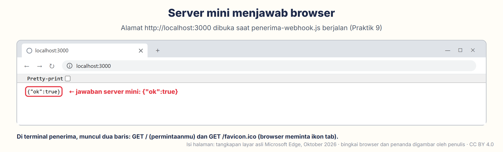

# Modul 4 — JavaScript & Node.js dari Nol (Bahasa untuk Server & Dashboard)

*Fase 0 · Minggu 4 · Perangkat keras (*hardware*): **tidak perlu** — cukup laptop dan internet · Prasyarat: **Modul 3** · Waktu: 8–10 jam, dicicil dalam seminggu*

[⬅️ Modul 3](../modul-03-cpp-untuk-esp32/README.md) · [Silabus](../../SILABUS.md) · [Pelacak progres](../../PROGRES.md) · [Modul 5 ➡️ (segera terbit — baca ringkasannya di Silabus)](../../SILABUS.md#modul-5--anatomi-esp32-peta-pin-kanonik-catu-daya--mengendalikan-dunia-nyata)

---

Tiga minggu terakhir kamu berbicara dengan **chip** dalam bahasa C++. Minggu ini kita pindah ke ujung kabel yang lain: ke **laptop dan server**, tempat data dari ESP32 nanti diterima, dihitung, disimpan, lalu ditampilkan. Bahasanya **JavaScript**, dan "mesin" yang menjalankannya di luar browser bernama **Node.js**. Mulai Modul 10, ESP32-mu mengirim data ke program JavaScript buatanmu sendiri. Di Modul 16, program itu tumbuh menjadi *backend* (dapur di balik layar), dan di Modul 22 menjadi dashboard di HP. Jadi, bahasa yang kamu pelajari minggu ini akan menemanimu hampir sampai akhir kurikulum.

Kabar baiknya, banyak hal sudah kamu kenal dari Modul 3: variabel, `if`, perulangan, dan fungsi. Kamu tinggal belajar "logatnya". Yang benar-benar baru hanya empat: **terminal** (memberi perintah ke laptop lewat ketikan), **menunggu tanpa membeku** (`async`/`await`), **npm** (toko library), dan **server** (program yang menunggu kiriman). Semuanya kita kerjakan pelan-pelan, satu per satu. Di akhir minggu, kamu punya skrip statistik sensor dan server mini yang tersimpan di GitHub — dua bukti terakhir untuk lulus Fase 0.

![Peta jalan mini: posisi Modul 4 sebagai modul terakhir Fase 0 di antara 32 modul serta enam hal yang dikerjakan minggu ini tanpa perangkat keras: Kemenangan Cepat, JavaScript di Console browser; Praktik 1–3, memasang VS Code dan Node.js, terminal, lalu halo.js; Praktik 4–5, data sensor palsu dan statistik; Praktik 6–7, menunggu dengan await dan library dari npm; Praktik 8–9, cuaca dari internet dan server mini; serta Praktik 10, simpan ke GitHub sebagai checkpoint Fase 0. Tanda bintang menandai bagian yang wajib untuk lulus: statistik, await, server mini, dan simpan ke GitHub](aset/peta-jalan-modul-04.png)

> [!NOTE]
> **Cara memakai kode dan perintah di modul ini.**
>
> - Setiap kotak kode punya tombol salin (ikon dua kotak bertumpuk) di pojok kanan atasnya. Mengetik sendiri tetap dianjurkan karena jari ikut belajar. Perhatikan huruf besar-kecil dan tanda bacanya: bagi JavaScript, `console` dan `Console` adalah dua nama yang berbeda.
> - Kotak berisi **perintah terminal** hanya memuat perintahnya. Ketik atau tempel ke terminal, lalu tekan **Enter**. Tanda siap seperti `PS C:\…>`, `%`, atau `$` tidak pernah ikut ditulis di kotak perintah.
> - Kotak yang didahului kata **Hasilnya** hanya untuk dicocokkan, bukan diketik. Angka, tanggal, dan jamnya pasti berbeda dengan milikmu.
> - Semua kode juga tersedia sebagai file di folder [`kode/`](kode/).
> - Pengguna macOS: ganti **Ctrl** dengan **Cmd** untuk menyimpan, menyalin, dan menempel. **Kecuali di terminal:** menghentikan program tetap **Ctrl + C**, juga di Mac.

Ritme modul ini sama dengan Modul 1–3. Bagian lipat di 🚨 (klik judulnya untuk membuka) cukup dibuka saat kamu membutuhkannya; bagian lipat di 🔬 boleh dilewati. Setiap praktik diawali kotak **🖥️** yang menyebut alat apa yang harus kamu buka.

## Daftar isi

1. [🎯 Setelah modul ini kamu bisa…](#-setelah-modul-ini-kamu-bisa)
2. [🧰 Yang perlu disiapkan](#-yang-perlu-disiapkan)
3. [🏆 Kemenangan Cepat: JavaScript pertamamu, langsung di browser (10 menit)](#-kemenangan-cepat-javascript-pertamamu-langsung-di-browser-10-menit)
4. [🧠 Konsep "Mengapa"](#-konsep-mengapa)
   - [1 JavaScript & Node.js](#1-javascript-dan-nodejs-satu-bahasa-dua-rumah) · [2 Terminal](#2-terminal-folder-alamat-dan-perintah) · [3 Variabel](#3-variabel-dan-tipe-data-let-const-teks-angka-truefalse) · [4 Operator & perulangan](#4-operator-ifelse-dan-perulangan-hampir-sama-dengan-c) · [5 Pesan error](#5-consolelog-dan-cara-membaca-pesan-error-nodejs) · [6 Fungsi](#6-fungsi-dan-arrow-function) · [7 *Array* & objek](#7-array-dan-objek-daftar-dan-formulir) · [8 JSON](#8-json-format-surat-universal) · [9 `map` & `filter`](#9-map-dan-filter-mengolah-seluruh-daftar-sekaligus) · [10 Modul & npm](#10-modul-packagejson-dan-npm-berbagi-kode-dan-belanja-library) · [11 File](#11-membaca-dan-menulis-file) · [12 `await`](#12-menunggu-tanpa-membeku-promise-async-dan-await) · [13 HTTP](#13-http-surat-menyurat-antarprogram) · [14 C++ vs JavaScript](#14-c-vs-javascript-berdampingan)
5. [🔧 Praktik langkah demi langkah](#-praktik-langkah-demi-langkah)
   - [1 VS Code](#praktik-1--pasang-vs-code-dan-buka-folder-belajar-iot-2030-menit-sekali-pasang) · [2 Terminal](#praktik-2--terminal-tanpa-takut-enam-perintah-pertama-20-menit) · [3 Node.js & `halo.js`](#praktik-3--pasang-nodejs-24-lts-lalu-jalankan-halojs-30-menit-sekali-pasang) · [4 Data palsu](#praktik-4--data-sensor-palsu-packagejson-dan-generate-dummyjs-20-menit) · [5 Statistik ⭐](#praktik-5--statistik-sensor-terendah-tertinggi-rata-rata-20-menit) · [6 `await` ⭐](#praktik-6--menunggu-sensor-dengan-await--dan-kalau-await-dihapus-15-menit) · [7 npm](#praktik-7--library-dari-npm-dayjs-versi-tertentu-15-menit) · [8 Cuaca](#praktik-8--cuaca-dari-internet-dengan-fetch-15-menit) · [9 Server mini ⭐](#praktik-9--server-mini-penerima-webhookjs-dan-kirim-datajs-25-menit) · [10 GitHub ⭐](#praktik-10--simpan-ke-github-checkpoint-fase-0-15-menit)
6. [🚨 Kalau Tidak Jalan?](#-kalau-tidak-jalan)
7. [🔬 Bedah Teknis (opsional)](#-bedah-teknis-opsional)
8. [🧩 Tantangan mandiri](#-tantangan-mandiri)
9. [➕ Tambahan ke "Rumah Pintar Mini"](#-tambahan-ke-rumah-pintar-mini)
10. [📖 Glosarium](#-glosarium) · [📝 Kuis](#-kuis-5-soal) · [✅ Checklist kelulusan](#-checklist-kelulusan-modul-4)
11. [📚 Sumber & atribusi gambar](#-sumber--atribusi-gambar)

---

## 🎯 Setelah modul ini kamu bisa…

- **Membuka terminal tanpa takut** dan memakai sepuluh perintah dasarnya (berpindah folder, membuat folder, menjalankan program, dan memasang library) serta menghentikan program yang sedang berjalan.
- **Menulis dan menjalankan program JavaScript di Node.js** — memakai `let`/`const`, teks, angka, `true`/`false`, *array* (daftar), objek, JSON, fungsi, `if`, perulangan, serta `map` dan `filter`.
- **Memahami cara "menunggu tanpa membeku"** dengan `Promise`, `async`, dan `await`, serta **menjelaskan apa yang terjadi kalau `await` dihapus**.
- **Memakai npm** untuk memasang library dengan versi tertentu, **membaca dan menulis file**, serta **mengambil data dari internet** dengan `fetch`.
- **Membuat server mini yang "mendengarkan"** dan mencetak JSON kiriman program lain — bekal langsung untuk Modul 10 dan 16.

---

## 🧰 Yang perlu disiapkan

| Kebutuhan | Keterangan |
| :--- | :--- |
| **Laptop** | Windows 10/11 64-bit, macOS 13.5 (Ventura) ke atas, atau Linux (Ubuntu/Debian/Fedora). Siapkan ruang kosong ±1,5 GB. **Tidak perlu papan ESP32 minggu ini.** Mac yang tertahan di macOS 12 tetap bisa ikut dengan Node.js 22 (lihat Praktik 3.1). |
| **Internet** | Unduhan VS Code ±250 MB (Windows) atau ±580 MB (macOS); Node.js ±33 MB (Windows) atau ±94 MB (macOS). Internet juga dipakai untuk `npm install` (kecil) dan API cuaca di Praktik 8. |
| **Browser** | Chrome atau Edge (Firefox juga bisa; Safari bisa setelah diatur sedikit) untuk Kemenangan Cepat dan untuk melihat data JSON. |
| **Repositori `belajar-iot` di laptop + GitHub Desktop** | Hasil *clone* di [Modul 3 Praktik 9](../modul-03-cpp-untuk-esp32/README.md#praktik-9--github-desktop-clone-commit-push-3045-menit-sekali-pasang), biasanya di `Documents\GitHub\belajar-iot`. Pengguna Linux atau macOS 12 tanpa GitHub Desktop: ikuti jalur pengganti yang dijelaskan di Modul 3. Belum punya salinan di laptop karena di Modul 3 kamu mengunggah lewat browser? Praktik 1.2 menjelaskan caranya. |
| **Izin administrator (Windows)** | Pemasang Node.js meminta izin administrator satu kali. Kalau laptopmu milik kantor atau sekolah dan kamu tidak punya izin itu, minta bantuan pengelolanya. |

**Versi yang dipakai di modul ini:**

| Alat | Versi | Catatan |
| :--- | :--- | :--- |
| **Visual Studio Code** | **1.141 atau lebih baru** (saat ditulis: 1.141.0) | Dipasang di Praktik 1. VS Code memperbarui dirinya sendiri secara berkala, hampir setiap minggu; tampilannya bisa sedikit berbeda. |
| **Node.js** | **24 LTS** (saat ditulis: 24.21.0, rilis 7 September 2026) | Dipasang di Praktik 3. LTS (*Long Term Support*) artinya versi "awet" yang terus mendapat perbaikan, untuk Node.js 24 sampai April 2028. |
| **npm** | **11.x** (saat ditulis: 11.19.0) | Terpasang otomatis bersama Node.js. |
| **dayjs** | **1.11.23** | Library pengolah tanggal; dipasang di Praktik 7. |

---

## 🏆 Kemenangan Cepat: JavaScript pertamamu, langsung di browser (10 menit)

Di Modul 3, program pertamamu butuh Wokwi, tombol **▶**, dan waktu menunggu kompiler. JavaScript lebih santai: setiap browser di laptopmu sudah membawa "penerjemah" JavaScript sendiri. Kita pakai itu dulu — tanpa memasang apa pun.

> 🖥️ **Alat yang dipakai di bagian ini:** browser **Chrome** atau **Edge** di laptop (Firefox juga bisa; Safari perlu diatur sedikit, lihat langkah 2). Tidak perlu memasang apa pun.

1. Buka tab baru, ketik `about:blank` di kotak alamat, lalu tekan **Enter**. Muncul halaman putih kosong — sengaja supaya tidak ada situs yang ikut campur.
2. Tekan **Ctrl + Shift + J** (macOS: **Cmd + Option + J**). Panel **DevTools** (*developer tools*, perkakas pengembang) terbuka di samping atau di bawah halaman, langsung di tab **Console**. Di Firefox, tekan **Ctrl + Shift + K** (macOS: **Cmd + Option + K**). Kalau browser bertanya dulu apakah kamu memang ingin membuka DevTools, jawab ya.

   Pengguna Safari (macOS): aktifkan dulu **Safari → Settings → Advanced → Show features for web developers**, lalu tekan **Cmd + Option + C**. Tampilan Firefox dan Safari sedikit berbeda dengan gambar di bawah (misalnya baris ketik Firefox bertanda `»`), tetapi cara pakainya sama. Kalau DevTools-mu berbahasa Indonesia, nama tabnya bisa tertulis lain, misalnya **Konsol**.

   Panelnya kira-kira seperti gambar ini. Baris-baris jawabannya baru muncul setelah kamu mengerjakan langkah 3 dan 4:

   

3. Klik baris paling bawah panel itu — ada tanda `›` berwarna biru dan kursor berkedip. Di situlah kamu mengetik. **Ketik** baris ini (jangan menempelkannya; alasannya ada di catatan di bawah), lalu tekan **Enter**:

   ```js
   console.log("Halo, JavaScript!")
   ```

   Muncul dua baris. `Halo, JavaScript!` adalah pesanmu. Baris kedua, `undefined` (artinya "tidak ada isinya"), adalah jawaban Console atas pertanyaan "apa hasil perintah barusan?". `console.log` hanya mencetak, tidak menghasilkan nilai apa pun. Abaikan saja.

4. Ketik baris-baris di kolom kiri tabel ini **satu per satu**, masing-masing diakhiri **Enter**:

   | Kamu ketik | Console menjawab | Artinya |
   | :--- | :--- | :--- |
   | `17 * 365` | `6205` | Hitungan langsung dikerjakan. |
   | `"Ani".toUpperCase()` | `'ANI'` | Teks diubah menjadi huruf besar semua. |
   | `"Ani".length` | `3` | Panjang teks: 3 huruf. |
   | `new Date().toLocaleString("id-ID")` | misalnya `'10/10/2026, 15.42.10'` | Tanggal dan jam laptopmu, gaya Indonesia. |
   | `let umur = 17` | `undefined` | Menyimpan angka 17 di "stoples" bernama `umur`. |
   | `umur * 365 * 24` | `148920` | Kira-kira sudah berapa jam kamu hidup. |

5. Terakhir, yang lebih seru. Ketik:

   ```js
   alert("Halo! Ini JavaScript pertamaku.")
   ```

   Browser memunculkan kotak pesan. Klik **OK** untuk menutupnya.

Selamat — kamu baru saja menjalankan JavaScript! Tidak ada tombol **▶** dan tidak ada kompiler yang ditunggu: setiap baris langsung dikerjakan begitu kamu menekan **Enter**. Ingat bentuk `console.log(…)`; inilah `Serial.println`-nya JavaScript, dan bentuk ini akan kamu pakai sepanjang modul.

Coba buat dua kesalahan kecil sebelum lanjut. (1) Ketik `let 1umur = 17` — nama variabel sengaja diawali angka, padahal itu dilarang (aturan nama di Konsep 3). Console menjawab dengan tulisan merah `Uncaught SyntaxError: Invalid or unexpected token` ("ada tanda yang tidak kumengerti"). Di Firefox, kalimat pesannya sedikit berbeda. (2) Ketik `Console.log("Halo")` dengan huruf C besar. Jawabannya `Uncaught ReferenceError: Console is not defined` ("aku tidak kenal nama `Console`"). Sama seperti C++, JavaScript membedakan huruf besar-kecil. Cara membaca pesan seperti ini dibahas di Konsep 5.

> [!NOTE]
> **Kenapa "ketik, jangan tempel"?** Kalau kamu menempelkan kode ke Console, Chrome dan Edge memunculkan peringatan berbahasa Inggris dan memintamu mengetik `allow pasting` dulu. Itu pengaman yang bagus karena penipu sering menyuruh korbannya menempelkan "kode ajaib" ke Console untuk membobol akun. **Aturannya: jangan pernah menempelkan kode yang tidak kamu pahami, apalagi kiriman orang yang tidak kamu kenal.** Kode di bagian ini pendek, jadi ketik saja.

Console browser cocok untuk mencoba satu-dua baris. Untuk program sungguhan — yang disimpan di file, membaca data, dan menjadi server — kita butuh **Node.js** dan sebuah editor kode. Itulah isi Praktik 1–3.

---

## 🧠 Konsep "Mengapa"

Empat belas konsep, satu per bagian — **tidak perlu dibaca sekaligus**. Konsep dan praktik dikerjakan berselang-seling, dengan urutan ini:

1. Konsep 1–2 → Praktik 1–2
2. Konsep 3–5 → Praktik 3
3. Konsep 6–11 → Praktik 4–5
4. Konsep 12 → Praktik 6–7
5. Konsep 13 → Praktik 8–10
6. 🧩 Tantangan → ➕ Rumah Pintar Mini → 📝 Kuis → ✅ Checklist

Tidak perlu menghafalnya. Di setiap titik pindah ada kotak ➡️ atau ☕ (maju ke praktik atau bagian berikutnya) dan ⬆️ (kembali ke konsep) yang tautannya tinggal diklik. Konsep 14 (tabel C++ vs JavaScript) adalah rangkuman; buka kapan saja. Setiap praktik juga menyebut konsep mana yang dipakainya.

> 🖥️ **Perlu mencoba kode di bagian Konsep?** Tidak wajib — cukup dibaca karena semuanya akan kamu jalankan sendiri di Praktik. Kalau penasaran, baris pendek (misalnya `17 === "17"`, `"12" + 5`, atau `typeof 28.5`) boleh kamu ketik di Console browser seperti di Kemenangan Cepat. Kode yang memakai `import` atau file (Konsep 10–11) hanya jalan sebagai file di Node.js, jadi jangan dicoba di Console.

### 1. JavaScript dan Node.js: satu bahasa, dua rumah

JavaScript lahir pada 1995 untuk membuat halaman web "hidup": tombol yang bereaksi, formulir yang memeriksa isinya sendiri, dan sebagainya. Karena itu, **setiap browser membawa mesin JavaScript**, yang barusan kamu pakai di Console. Mesin milik Chrome dan Edge bernama **V8**.

Pada 2009, V8 dikeluarkan dari browser, lalu diberi kemampuan yang sengaja tidak diberikan kepada halaman web: membaca dan menulis file di laptop serta membuka "pintu" jaringan untuk menerima kiriman. Hasilnya bernama **Node.js**. Dengan Node.js, JavaScript bisa berjalan di laptop, di Raspberry Pi, dan di server internet — tanpa browser.

Jadi, JavaScript punya dua rumah: browser dan Node.js. Ditambah ESP32 yang berbahasa C++, program di proyek Rumah Pintar Mini tersebar di tiga "rumah":

![Diagram tiga rumah program di proyek Rumah Pintar Mini. Kiri, ESP32 dengan bahasa C++ yang membaca sensor, menggerakkan kipas dan lampu, serta mengirim data (Modul 1–3 dan 5–15). Tengah, laptop, Raspberry Pi, atau server dengan JavaScript di Node.js yang menerima kiriman, menghitung, menyimpan, dan memberi perintah, bertanda "KAMU DI SINI" (mulai minggu ini; Modul 16–21). Kanan, browser di HP dengan JavaScript yang menampilkan dashboard, tombol kendali, grafik, dan peringatan (Modul 22–25). Kurung di atas kotak tengah dan kanan berlabel JavaScript: satu bahasa, dua rumah. Panah berlabel JSON mengalir dari ESP32 ke laptop (lewat WiFi, Modul 10) dan dari laptop ke HP (Modul 22), sedangkan panah tipis berlabel perintah mengalir balik. Di bawahnya, pengingat: JavaScript bukan Java](aset/dua-rumah-javascript.png)

| Tempat | Bahasa | Tugasnya | Modul |
| :--- | :--- | :--- | :--- |
| ESP32 | C++ | Membaca sensor, menggerakkan aktuator, mengirim data | 1–3, 5–15 |
| Laptop, Raspberry Pi, server | JavaScript di **Node.js** | Menerima, menghitung, menyimpan, memberi perintah | **mulai minggu ini**; 16–21 |
| Browser di laptop atau HP | JavaScript di browser | Menampilkan dashboard | 22–25 |

Kenapa server tidak memakai C++ saja? Bisa, tetapi jauh lebih repot. JavaScript lebih luwes untuk mengolah teks dan data, punya jutaan library siap pakai (Konsep 10), dan — ini yang terpenting — **bisa dipakai untuk server sekaligus dashboard**. Sebaliknya, untuk chip kecil seperti ESP32, C++ tetap pilihan utama: cepat, hemat memori, dan contohnya melimpah.

Cara menjalankannya pun berbeda. Program C++ harus **dikompilasi** dulu menjadi file biner, lalu diunggah ke chip ([Modul 1 Konsep 4](../modul-01-peta-besar-iot/README.md#4-dari-kode-ke-chip-resep--juru-masak--masakan)). Program JavaScript cukup disimpan sebagai file `.js`, lalu dijalankan dengan perintah `node nama-file.js`. Node.js membaca file itu dan langsung mengerjakannya dari atas ke bawah (di balik layar, V8 menerjemahkannya sambil jalan).

> [!TIP]
> **JavaScript bukan Java.** Namanya mirip, tetapi bahasanya berbeda sama sekali — seperti "kasur" dan "kasus". Saat mencari bantuan di internet, tulis "JavaScript" atau "Node.js", bukan "Java".

### 2. Terminal: folder, alamat, dan perintah

Selama ini kamu memakai laptop dengan **mengeklik**: ikon, menu, tombol. Terminal adalah cara kedua: **mengetik perintah**. Bedanya seperti memesan di warung dengan menunjuk gambar menu, dibandingkan dengan menyebutkan pesanan: "nasi goreng satu, pedas, tanpa kerupuk". Menyebutkan pesanan lebih cepat, bisa diulang persis, dan bisa ditulis di catatan untuk orang lain. Itulah sebabnya hampir semua alat pemrograman — termasuk Node.js — dipakai lewat terminal.

Namanya berbeda di setiap sistem operasi: **PowerShell** di Windows, **Terminal** di macOS dan Linux. Kamu tidak perlu membukanya terpisah karena **VS Code punya terminal di dalamnya** (Praktik 2).


Cara membaca layar terminal:

1. ***Prompt*** (tanda siap). Contoh di Windows: `PS C:\Users\Ani\Documents\GitHub\belajar-iot>`. `PS` berarti PowerShell, disusul **folder tempat terminal sedang berdiri**, lalu `>` yang artinya "siap menerima perintah". Di macOS bentuknya seperti `ani@MacBook-Air belajar-iot %`, di Linux seperti `ani@laptop:~/Documents/GitHub/belajar-iot$`. (Di gambar, terminal sudah berdiri di folder `modul-04`, jadi *prompt*-nya lebih panjang.)
2. **Perintah**: apa yang kamu ketik setelah *prompt*, lalu diakhiri **Enter**.
3. **Keluaran**: jawaban perintah itu. Ada perintah yang tidak menjawab apa-apa kalau berhasil — **diam berarti beres**.
4. ***Prompt* baru** muncul saat perintah selesai. Kalau *prompt* baru tidak muncul, programnya masih berjalan (misalnya server di Praktik 9). Hentikan dengan **Ctrl + C**.

**Folder tempat berdiri.** Terminal selalu "berdiri" di satu folder (*working directory*). Perintah seperti `node halo.js` mencari file `halo.js` **di folder itu**. Kesalahan pemula nomor satu adalah menjalankan perintah dari folder yang salah, jadi biasakan melirik *prompt* sebelum mengetik.

**Alamat (*path*).** Setiap file dan folder punya alamat lengkap, seperti alamat rumah: provinsi, kota, jalan, nomor rumah.

- Windows: `C:\Users\Ani\Documents\GitHub\belajar-iot\modul-04\halo.js` (pemisahnya `\`)
- macOS: `/Users/ani/Documents/GitHub/belajar-iot/modul-04/halo.js` (pemisahnya `/`)
- Linux: `/home/ani/Documents/GitHub/belajar-iot/modul-04/halo.js` (pemisahnya juga `/`)

Selain alamat lengkap, ada **alamat relatif**: alamat yang dihitung dari tempatmu berdiri. Kalau kamu berdiri di `belajar-iot`, alamat `modul-04` berarti "folder `modul-04` yang ada di sini". Dua singkatan penting: `..` berarti "folder satu tingkat di atasku" (folder induk), dan `.` berarti "folder ini".

![Diagram folder. Kiri, pohon folder: C:\Users\Ani (folder pribadimu), lalu Documents, GitHub, dan belajar-iot (repositori hasil clone Modul 3) yang berisi modul-02, modul-03, dan modul-04 (kamu di sini, Praktik 2) dengan file halo.js. Kanan atas, cara berpindah: cd modul-04 untuk masuk dari belajar-iot ke modul-04, dan cd .. untuk naik kembali ke induk. Kanan tengah, prompt ikut berubah dari PS C:\…\GitHub\belajar-iot> menjadi PS C:\…\belajar-iot\modul-04>. Kanan bawah, alamat lengkap folder modul-04 versi Windows dan macOS serta alamat relatifnya dari belajar-iot: cukup modul-04. Paling bawah, arti .. (folder induk) dan . (folder ini), serta saran menghindari spasi di nama folder](aset/peta-folder.png)

**Sepuluh perintah** ini cukup untuk seluruh modul. Semuanya jalan di PowerShell, Terminal macOS, dan Terminal Linux; hanya tampilan hasilnya yang sedikit berbeda.

| No. | Perintah | Artinya | Dipakai di |
| :---: | :--- | :--- | :--- |
| 1 | `pwd` | "Aku sedang berdiri di folder mana?" (*print working directory*) | Praktik 2 |
| 2 | `ls` | "Ada apa saja di folder ini?" (*list*) | Praktik 2 |
| 3 | `mkdir nama-folder` | Buat folder baru (*make directory*). | Praktik 2 |
| 4 | `cd nama-folder` | Masuk ke folder (*change directory*). | Praktik 2 |
| 5 | `cd ..` | Naik satu tingkat ke folder induk. | Praktik 2 |
| 6 | `clear` | Bersihkan layar terminal. | Praktik 2 |
| 7 | `node -v` dan `npm -v` | Tampilkan versi Node.js dan npm — sekaligus memastikan keduanya terpasang. | Praktik 2–3 |
| 8 | `node nama-file.js` | Jalankan program JavaScript. | Praktik 3–9 |
| 9 | `npm init -y` | Buat "KTP proyek" (`package.json`). | Praktik 4 |
| 10 | `npm install nama@versi` | Pasang library dari npm. | Praktik 7 |

Ada juga tiga jurus papan ketik:

- **Ctrl + C** — hentikan program yang sedang berjalan (di Mac juga **Ctrl**, bukan **Cmd**). Di terminal, **Ctrl + C** tanpa teks yang disorot berarti "berhenti", bukan "salin".
- **↑** (panah atas) — panggil lagi perintah sebelumnya. Tekan beberapa kali untuk mundur lebih jauh, lalu tekan **Enter**.
- **Tab** — lengkapi nama file atau folder secara otomatis. Ketik beberapa huruf awalnya, lalu tekan **Tab**.

Tiga kebiasaan baik: **hindari spasi di nama file dan folder** (pakai tanda hubung, misalnya `modul-04`; kalau terpaksa ada spasi, apit alamatnya dengan tanda petik: `cd "Folder Saya"`); **tulis huruf besar-kecil persis** (Windows memaafkan, Linux tidak); dan **baca pesannya sebelum panik** — terminal hampir selalu memberi tahu apa yang salah.

> ➡️ **Saatnya praktik.** Kerjakan dulu [Praktik 1](#praktik-1--pasang-vs-code-dan-buka-folder-belajar-iot-2030-menit-sekali-pasang) dan [Praktik 2](#praktik-2--terminal-tanpa-takut-enam-perintah-pertama-20-menit), lalu kembali ke sini untuk [Konsep 3](#3-variabel-dan-tipe-data-let-const-teks-angka-truefalse).

### 3. Variabel dan tipe data: `let`, `const`, teks, angka, `true`/`false`

Ingat stoples berlabel dari Modul 3? Di JavaScript, stoplesnya sama, tetapi kamu **tidak perlu menulis jenis isinya**. JavaScript melihat sendiri isinya:

```js
const nama = "Ani"; // teks: selalu diapit tanda petik
let umur = 17; // angka
let suhu = 28.5; // angka juga: bulat dan pecahan tidak dibedakan
let adaGerakan = false; // benar/salah: true atau false
```

Titik koma `;` di akhir baris boleh ditulis, boleh juga tidak (di Console tadi kita tidak menulisnya). Kurikulum ini selalu menulisnya, sama seperti di C++.


**`const` atau `let`?**

- `const` (dari *constant*, tetap) adalah stoples yang tutupnya dilem: isinya tidak bisa diganti. Kalau kamu mencoba menggantinya (`nama = "Budi";`), Node.js berhenti dengan pesan `TypeError: Assignment to constant variable.`
- `let` adalah stoples biasa: isinya boleh diganti kapan saja, cukup dengan menyebut namanya tanpa `let` lagi, misalnya `umur = 18;`.
- **Aturan praktis: pakai `const` dulu.** Ubah menjadi `let` hanya kalau isinya memang akan berubah, misalnya penghitung atau jumlah total. Tutorial lama memakai `var`; jangan ikut-ikutan (lihat 🚨).

**Tiga tipe data dasar.** Jenis isi stoples bisa dicek dengan `typeof`, misalnya `typeof 28.5` menghasilkan `'number'`.

| Tipe | Contoh | Catatan |
| :--- | :--- | :--- |
| teks (***string***) | `"Ani"`, `"28.5"` | Diapit tanda petik ganda atau tunggal. Kurikulum ini memakai **petik ganda**, sama seperti C++ dan JSON. Awas: `"28.5"` yang berpetik adalah **teks**, bukan angka. |
| angka (***number***) | `17`, `28.5`, `-6.2` | Satu jenis untuk bulat dan pecahan, jadi `7 / 2` menghasilkan `3.5` (di C++ dengan `int`, hasilnya `3`). Pemisah desimalnya **titik**, bukan koma. |
| benar/salah (***boolean***) | `true`, `false` | Untuk jawaban ya/tidak, misalnya "ada gerakan?". |

**Teks bertemplat.** Kalau teks diapit *backtick* — tanda petik terbalik `` ` ``, yang tombolnya ada di kiri atas papan ketik, di bawah **Esc** — kamu bisa menyisipkan nilai dengan `${…}`:

```js
console.log(`Umurku ${umur} tahun, kira-kira ${umur * 365} hari.`);
// hasilnya: Umurku 17 tahun, kira-kira 6205 hari.
```

Bandingkan dengan cara Modul 3 yang menyambung teks dengan `+` berkali-kali. Lebih ringkas, bukan?

**Stoples kosong.** Variabel yang belum diisi bernilai `undefined` ("belum ada isinya") — kata yang sama dengan yang muncul di Console tadi. Ada juga `null`, yang berarti "sengaja dikosongkan". Untuk sekarang, cukup kenali namanya.

**Aturan nama** sama dengan Modul 3: tanpa spasi, tidak diawali angka, huruf besar-kecil dibedakan, dan memakai gaya *camelCase* (kata kedua dan seterusnya diawali huruf besar): `adaGerakan`, `rataRata`, `daftarSuhu`.

### 4. Operator, `if`/`else`, dan perulangan: hampir sama dengan C++

Kabar gembira: hampir seluruh bagian ini **sudah kamu kuasai** di Modul 3. Tanda hitung (`+ - * / %`), pembanding (`< > <= >=`), dan logika (`&& || !`) sama persis. `if`/`else` serta perulangan `for` dan `while` juga sama; bedanya hanya `int` diganti dengan `let`:

```js
const suhu = 31.5;

if (suhu > 30) {
  console.log("Panas! Nyalakan kipas.");
} else if (suhu < 20) {
  console.log("Dingin.");
} else {
  console.log("Nyaman.");
}

for (let i = 1; i <= 3; i++) {
  console.log("Kedip ke-" + i); // Kedip ke-1, Kedip ke-2, Kedip ke-3
}
```

Ada **dua perbedaan** yang wajib diingat.

**Pertama, "sama dengan" ditulis dengan tiga tanda: `===`.** JavaScript punya dua jenis pembanding "sama dengan":

| Ditulis | Hasilnya | Kenapa |
| :--- | :--- | :--- |
| `17 == "17"` | `true` | `==` (dua tanda) diam-diam mengubah jenisnya dulu, baru membandingkan. Sering menipu. |
| `17 === "17"` | `false` | `===` (tiga tanda) membandingkan isi **dan** jenisnya: angka 17 tidak sama dengan teks `"17"`. |

**Selalu pakai `===` dan `!==`** (tidak sama dengan). Di seluruh kode JavaScript kurikulum ini, `==` tidak pernah dipakai.

Satu jebakan lagi ada pada tanda `+`. Kalau salah satu sisinya teks, `+` **menyambung**, bukan menjumlahkan: `"12" + 5` menghasilkan `"125"`, sedangkan `"12" * 5` menghasilkan `60`. Kalau ragu, ubah teks menjadi angka dengan `Number("12")`.

**Kedua, ada perulangan "untuk setiap isi": `for…of`.** Untuk memproses semua isi sebuah daftar, JavaScript punya bentuk yang lebih enak dibaca daripada `for (let i = 0; …)`:

```js
const daftarSuhu = [28.5, 31.2, 27.9];

for (const suhu of daftarSuhu) {
  console.log(suhu); // 28.5, lalu 31.2, lalu 27.9
}
```

Bacalah: "**untuk setiap** `suhu` **dari** `daftarSuhu`, kerjakan isi kurung kurawal". Kata yang dipakai adalah `of`. Ada juga `for…in`, tetapi itu untuk keperluan lain — jangan tertukar.

### 5. `console.log` dan cara membaca pesan error Node.js

`console.log` adalah `Serial.println`-nya JavaScript. Ia bisa mencetak beberapa nilai sekaligus: pisahkan nilainya dengan koma; spasi di antaranya ditambahkan otomatis.

```js
const suhu = 28.5;
console.log("Suhu:", suhu, "°C"); // hasilnya: Suhu: 28.5 °C
```

Teknik *debugging* (mencari penyebab kesalahan) yang paling ampuh untuk pemula masih sama dengan Modul 3: **cetak isi variabel di titik yang mencurigakan**, lalu bandingkan dengan dugaanmu.

Kesalahan di JavaScript ada dua jenis:

1. **Kesalahan tata bahasa** (`SyntaxError`), misalnya tanda petik atau kurung yang hilang. Node.js memeriksa tata bahasa seluruh file **sebelum** menjalankannya, jadi **tidak ada satu baris pun yang jalan**. Mirip error kompiler di Modul 3.
2. **Kesalahan saat berjalan**, misalnya `ReferenceError` (nama yang tidak dikenal) atau `TypeError` (jenis yang tidak cocok). Program sudah berjalan sampai baris itu, lalu berhenti. **Baris-baris sebelumnya sudah sempat dikerjakan.**

Pesan error Node.js biasanya tersusun dengan pola yang sama. Contoh berikut — yang nanti kamu buat sendiri di Praktik 3.4 — muncul saat `nama` sengaja diketik salah menjadi `nma`:


Cara membacanya, dari atas:

1. **Alamat file dan nomor baris.** `…\modul-04\halo.js:8` berarti baris 8 di file `halo.js`. (Nanti, setelah `package.json` berisi `"type": "module"` di Praktik 4, alamat semua file `.js` — termasuk `halo.js` — diawali `file:///`; artinya sama.)
2. **Salinan baris itu**, dengan tanda `^` di bawah tempat masalahnya.
3. **Jenis error dan pesannya** — baris terpenting. `ReferenceError: nma is not defined` berarti "aku tidak kenal nama `nma`".
4. **Jejak panggilan** (*stack trace*), yaitu baris-baris yang diawali `at`. Cari yang menyebut nama filemu: `halo.js:8:25` berarti baris 8, kolom 25. Baris yang menyebut `node:internal` adalah isi Node.js sendiri — abaikan. Pada error dari fungsi bawaan Node.js (misalnya `ENOENT` atau `fetch failed`), baris paling atas justru menunjuk ke dalam Node.js (`node:internal/…`), bukan ke filemu. Jangan bingung; baca saja baris jenis errornya. Pada `ENOENT`, filemu baru disebut di baris `at async file:///…`; pada `fetch failed`, filemu tidak disebut sama sekali, jadi baca bagian `[cause]`-nya (Praktik 9).
5. **Versi Node.js** di baris terakhir. Sertakan saat bertanya.

Tiga jenis error yang paling sering kamu temui minggu ini:

| Jenis | Artinya | Contoh penyebab |
| :--- | :--- | :--- |
| `SyntaxError` | Tata bahasanya salah. | Tanda petik, kurung, atau kurung kurawal tidak berpasangan. |
| `ReferenceError` | Ada nama yang tidak dikenal. | Salah ketik (`nma`), salah huruf besar-kecil (`Console`), atau variabel belum dibuat. |
| `TypeError` | Jenisnya tidak cocok dengan yang kamu lakukan. | Mengganti isi `const` atau mengambil kolom dari sesuatu yang `undefined`. |

Saat bertanya kepada orang lain atau kepada AI, **salin teks pesannya**, jangan memotret layar. Caranya: sorot teksnya dengan mouse, lalu tekan **Ctrl + C** (Windows), **Cmd + C** (macOS), atau **Ctrl + Shift + C** (Linux).

> ☕ **Titik istirahat.** Konsep 3–5 adalah bekal [Praktik 3](#praktik-3--pasang-nodejs-24-lts-lalu-jalankan-halojs-30-menit-sekali-pasang). Kerjakan dulu, lalu kembali ke sini untuk [Konsep 6](#6-fungsi-dan-arrow-function).

### 6. Fungsi dan *arrow function*

Fungsi di JavaScript sama dengan "resep" di Modul 3, hanya saja tanpa tipe di depan nama dan parameternya:

```js
function rataRata(daftar) {
  let total = 0;
  for (const angka of daftar) {
    total = total + angka;
  }
  return total / daftar.length; // daftar.length = jumlah isi daftar
}

console.log(rataRata([28.5, 31.2, 27.9])); // 29.2
```

Bandingkan dengan C++: di Modul 3 Praktik 5 kamu menulis `float hitungRataRata(float data[], int jumlah)`. Di JavaScript tidak ada `float`, tidak ada `void`, dan jumlah isi daftar bisa ditanyakan langsung lewat `.length`.

Parameter boleh punya **nilai bawaan**: pada `function sapa(nama = "teman")`, pemanggilan `sapa()` tanpa isi membuat `nama` bernilai `"teman"`. Kamu akan bertemu nilai bawaan di `generate-dummy.js`.

***Arrow function*** (fungsi panah) adalah cara singkat menulis fungsi kecil:

```js
const kaliDua = (x) => x * 2; // sama dengan: function kaliDua(x) { return x * 2; }
console.log(kaliDua(21)); // 42
```

Bacalah `(x) => x * 2` sebagai "**dari** `x`, **hasilkan** `x * 2`". Fungsi panah sering diserahkan kepada fungsi lain untuk dijalankan nanti, misalnya kepada `map` dan `filter` (Konsep 9) atau kepada `setTimeout(() => { … }, 2000)`, yang berarti "jalankan isi kurung kurawal ini 2 detik lagi" (Konsep 12). Fungsi yang dititipkan seperti ini disebut *callback* (fungsi titipan).

### 7. *Array* dan objek: daftar dan formulir

***Array*** (daftar) di JavaScript mirip deret laci di Modul 3 — indeksnya juga mulai dari 0 — tetapi ukurannya **tidak tetap**: isinya bisa ditambah kapan saja.

```js
const daftarSuhu = [28.5, 31.2, 27.9];
console.log(daftarSuhu[0]); // 28.5 (laci pertama = indeks 0)
console.log(daftarSuhu.length); // 3
daftarSuhu.push(30.1); // tambahkan satu isi di ujung
console.log(daftarSuhu); // [ 28.5, 31.2, 27.9, 30.1 ]
```

Lho, `daftarSuhu` itu `const`, kok isinya bisa ditambah? `const` hanya mengunci **daftar mana** yang ditunjuk oleh nama itu, bukan isi daftarnya. Jadi, menambah isi boleh, tetapi mengganti seluruh daftar (`daftarSuhu = [1, 2];`) tidak boleh.

**Objek** adalah "formulir": sekumpulan **kunci** (nama kolom) beserta **nilainya** (isi kolom). Mirip `struct` di Modul 3, tetapi kamu tidak perlu merancang formulirnya lebih dulu — langsung saja tulis:

```js
const bacaan = { suhu: 28.5, kelembapan: 71, gerak: false };
console.log(bacaan.suhu); // 28.5 (ambil isi kolom dengan tanda titik)
bacaan.suhu = 29.4; // ganti isi kolom
bacaan.cahaya = 412; // tambah kolom baru
console.log(bacaan); // { suhu: 29.4, kelembapan: 71, gerak: false, cahaya: 412 }
```

Gabungkan keduanya, dan kamu mendapat **daftar berisi formulir** — bentuk data sensor yang paling umum. Setiap formulir adalah satu bacaan; seluruh daftar adalah catatan dari waktu ke waktu.

```js
const catatan = [
  { ts: "2026-10-09T09:41:30Z", suhu: 28.5 },
  { ts: "2026-10-09T09:41:40Z", suhu: 28.7 },
];
console.log(catatan[1].suhu); // 28.7 (formulir kedua, kolom suhu)
```

Perhatikan koma setelah formulir terakhir: di JavaScript boleh, tetapi di JSON tidak (Konsep 8).

### 8. JSON: format surat universal

ESP32 berbahasa C++, server berbahasa JavaScript, dan database punya bahasanya sendiri. Supaya mereka bisa bertukar data, dibutuhkan **format surat** yang dimengerti semua pihak. Format itu bernama **JSON** (*JavaScript Object Notation*): teks biasa yang bentuknya meniru objek JavaScript. Kamu sudah sempat bertemu JSON di Modul 3 (ArduinoJson).

Inilah surat yang nanti dikirim **Node 1** setiap 10 detik. (Node 1 "Rumah" adalah perangkat ESP32 pertama di proyek Rumah Pintar Mini, yang dikenalkan di Modul 1. Ia tidak ada hubungannya dengan Node.js; namanya saja yang mirip.) Bentuknya ditetapkan dalam **kontrak data** proyek kita, persis seperti yang tertulis di [Lampiran A Silabus](../../SILABUS.md#14-lampiran-a--kontrak-data-rumah-pintar-mini):

```json
{ "ts": "2026-10-09T09:41:30Z", "fw": "1.0.0", "suhu": 28.5, "kelembapan": 71, "cahaya": 412, "tanah": 37, "gerak": false, "level_air": 64 }
```

| Kunci | Isinya |
| :--- | :--- |
| `ts` | *Timestamp* (cap waktu) pembacaan dalam UTC, waktu patokan dunia. Huruf `Z` di ujungnya berarti UTC; WIB = UTC + 7 jam. |
| `fw` | Versi *firmware* (program di chip) yang mengirim. |
| `suhu` | Suhu udara, dalam °C. |
| `kelembapan` | Kelembapan udara, dalam persen. |
| `cahaya` | Tingkat terang cahaya: angka `0` sampai `4095` (dibahas di Modul 6). |
| `tanah` | Kelembapan tanah, dalam persen. |
| `gerak` | Ada gerakan atau tidak: `true` atau `false`. |
| `level_air` | Isi tandon, dalam persen. |

JSON lebih **galak** daripada objek JavaScript. Lima aturannya:

1. Kunci **wajib** diapit tanda petik ganda: `"suhu"`, bukan `suhu`.
2. Teks hanya boleh memakai **petik ganda**, bukan petik tunggal.
3. **Tidak boleh ada koma** setelah isi terakhir.
4. **Tidak boleh ada komentar** (`// …`).
5. Isinya hanya boleh teks, angka, `true`/`false`, `null`, *array*, dan objek.

JavaScript punya dua "penerjemah" bawaan yang mengubah objek menjadi surat, dan sebaliknya:

```js
const bacaan = { suhu: 28.5, gerak: false };

const surat = JSON.stringify(bacaan); // objek -> teks JSON: {"suhu":28.5,"gerak":false}
const kembali = JSON.parse(surat); // teks JSON -> objek lagi
console.log(kembali.suhu); // 28.5
```


`JSON.stringify(objek, null, 2)` menghasilkan teks yang rapi: satu kunci per baris, menjorok 2 spasi. Sebaliknya, kalau teks yang diberikan kepada `JSON.parse` melanggar aturan — misalnya `JSON.parse("{suhu: 28.5}")` — hasilnya `SyntaxError: Expected property name or '}' in JSON at position 1 (line 1 column 2)`. Artinya: "di posisi 1 (karakter kedua), aku mengharapkan nama kunci berpetik ganda".

Kenapa `ts` memakai UTC, bukan WIB? Alasannya, perangkat bisa berada di zona waktu mana saja, dan satu patokan membuat data mudah dibandingkan. Waktu baru diubah menjadi jam setempat saat **ditampilkan** kepada manusia; kamu melakukannya di Praktik 7.

### 9. `map` dan `filter`: mengolah seluruh daftar sekaligus

Dua alat ini memproses seluruh isi *array* tanpa perlu menulis perulangan sendiri. Keduanya menerima fungsi panah, dan keduanya menghasilkan **daftar baru**; daftar aslinya tidak berubah.

- **`map`** adalah mesin pengubah. Setiap isi dimasukkan ke fungsi panah, lalu hasilnya dikumpulkan. Jumlah isi daftar baru **sama** dengan jumlah isi daftar asal.
- **`filter`** adalah saringan. Hanya isi yang membuat fungsi panah menjawab `true` yang lolos sehingga daftar baru bisa **lebih pendek**.

```js
const bacaan = [
  { suhu: 28.5, gerak: false },
  { suhu: 31.2, gerak: true },
  { suhu: 27.9, gerak: false },
  { suhu: 30.6, gerak: false },
];

const daftarSuhu = bacaan.map((b) => b.suhu); // ambil suhunya saja
const panas = bacaan.filter((b) => b.suhu > 30); // saring yang di atas 30

console.log(daftarSuhu); // [ 28.5, 31.2, 27.9, 30.6 ]
console.log(panas.length); // 2
console.log(Math.max(...daftarSuhu)); // 31.2
```


Baris terakhir memakai dua hal baru. `Math.max()` mencari angka terbesar, dan pasangannya, `Math.min()`, mencari yang terkecil. Tiga titik `...` (*spread*) berarti "tuang semua isi daftar ini sebagai bahan terpisah" karena `Math.max` minta angkanya ditulis satu per satu, seperti `Math.max(28.5, 31.2, 27.9, 30.6)`, bukan diberi satu daftar utuh.

Huruf `b` di `(b) => b.suhu` hanyalah nama sementara untuk "satu bacaan yang sedang diproses". Kamu boleh menggantinya dengan nama lain, misalnya `(satu) => satu.suhu`.

### 10. Modul, `package.json`, dan npm: berbagi kode dan "belanja" library

**Modul JavaScript: berbagi fungsi antarfile.** Program yang besar dipecah menjadi beberapa file. File yang ingin berbagi menandai fungsinya dengan `export`, dan file lain mengambilnya dengan `import`:

```js
// di generate-dummy.js
export function buatTelemetri() { … }

// di tunggu.js
import { buatTelemetri } from "./generate-dummy.js";
```

`./` berarti "di folder yang sama dengan file ini", dan akhiran `.js` wajib ditulis. Perhatikan: khusus `import`, alamat relatif dihitung dari **folder file itu sendiri**, bukan dari folder tempat terminal berdiri seperti di Konsep 2 (alamat file data di Konsep 11 kembali memakai aturan Konsep 2). Node.js juga punya modul bawaan yang namanya diawali `node:`, misalnya `node:fs/promises` untuk file (Konsep 11) dan `node:http` untuk server (Konsep 13).

**`package.json`: KTP proyek.** Setiap proyek Node.js punya satu file `package.json` di folder utamanya. Isinya identitas proyek (nama dan versi), **daftar library yang dibutuhkan**, dan satu pengaturan penting: `"type": "module"`, yang berarti "proyek ini memakai `import`/`export`". Kalau baris itu berisi `"commonjs"` — isi bawaan `npm init -y` — Node.js menganggap proyekmu bergaya lama (CommonJS, yang memakai `require`) dan menolak `import` dengan pesan `SyntaxError: Cannot use import statement outside a module`. Kalau baris itu tidak ada sama sekali, Node.js menebak gayanya sendiri sambil memberi peringatan panjang (lihat 🚨). File ini dibuat dengan `npm init -y` di Praktik 4.

**npm: toko sekaligus kurir library.** Program npm (*Node Package Manager*) ikut terpasang bersama Node.js. Di belakangnya ada gudang berisi jutaan paket library buatan orang di seluruh dunia. Saat kamu mengetik `npm install dayjs@1.11.23` (Praktik 7), terjadi tiga hal:

1. Library-nya diunduh ke folder **`node_modules/`**, "lemari dapur" proyekmu. Isinya bisa ratusan file; jangan diubah dan **jangan di-*commit***.
2. `package.json` mencatat `"dayjs": "^1.11.23"` di bagian `dependencies`. Inilah **daftar belanja**. Tanda `^` berarti "versi 1.11.23 atau versi 1.x yang lebih baru".
3. File **`package-lock.json`** dibuat. Inilah **struk belanja**: versi persis yang benar-benar terpasang. File ini ikut di-*commit* supaya semua orang mendapat versi yang sama. Struk inilah yang benar-benar **mengunci** versinya, jadi jangan dihapus.

Karena daftar belanja dan struknya tersimpan, `node_modules/` bisa dibuat ulang kapan saja: orang yang mengambil proyekmu cukup menjalankan `npm install`. Itulah sebabnya kita menulis `node_modules/` di file `.gitignore` (daftar file yang sengaja tidak dicatat Git).

![Diagram belanja library dengan npm, bernomor 1–3 sesuai urutan di Konsep 10. Tengah atas, perintah npm install dayjs@1.11.23 yang mencatat dayjs ke package.json dan mengambil paket dari awan gudang npm di internet. Kiri, package.json (nomor 2) sebagai daftar belanja yang dipersingkat, berisi "type": "module" dan dependencies dayjs ^1.11.23, bertanda ikut di-commit. Kanan atas, folder node_modules (nomor 1) sebagai lemari dapur yang isinya bisa ratusan file, bertanda "JANGAN di-commit" karena tercatat di .gitignore. Kanan bawah, package-lock.json (nomor 3) sebagai struk belanja yang mencatat dayjs 1.11.23 persis, bertanda ikut di-commit. Catatan bawah: teman yang meng-clone proyekmu cukup menjalankan npm install untuk membuat ulang isi lemari](aset/npm-daftar-belanja.png)

> [!WARNING]
> **Belanja dengan hati-hati.** Siapa pun boleh menerbitkan paket di npm. Pada September 2025, misalnya, beberapa paket yang sangat populer sempat disusupi kode jahat selama beberapa jam setelah akun pembuatnya dibobol. Empat kebiasaan aman: (1) pasang **hanya yang kamu butuhkan**; (2) **cek ejaan namanya** karena penipu sengaja membuat paket bernama mirip, misalnya `dayjss`; (3) pilih paket yang terkenal dan masih dirawat; (4) **kunci versinya**, seperti yang dilakukan setiap modul kurikulum ini. Pesan `found 0 vulnerabilities` di akhir `npm install` berarti npm tidak menemukan celah keamanan yang sudah diketahui.

### 11. Membaca dan menulis file

Node.js bisa membaca dan menulis file di laptopmu lewat modul bawaan `node:fs/promises` (`fs` = *file system*, sistem berkas):

```js
import { readFile, writeFile, mkdir } from "node:fs/promises";

await mkdir("data", { recursive: true }); // buat folder data (tidak protes kalau sudah ada)
await writeFile("data/catatan.txt", "Halo dari Node.js"); // tulis teks ke file (isi lama ditimpa!)
const isi = await readFile("data/catatan.txt", "utf8"); // baca file sebagai teks
console.log(isi); // Halo dari Node.js
```

Tiga hal yang perlu diperhatikan:

- **`"utf8"`** berarti "baca sebagai teks". Tanpa itu, yang kamu dapat adalah angka-angka mentah (byte).
- **`writeFile` menimpa** isi file yang sudah ada tanpa bertanya.
- **Alamat relatif dihitung dari folder tempat terminal berdiri**, bukan dari folder tempat file `.js`-nya disimpan. `"data/catatan.txt"` berarti "file `catatan.txt` di dalam folder `data`, di tempat terminal berdiri". Inilah alasan semua praktik dijalankan dari folder `modul-04`. Kalau terminal berdiri di folder lain, hasilnya `Error: ENOENT: no such file or directory`. `ENOENT` adalah singkatan *Error NO ENTry*: "tidak ada file atau folder itu". (Aturan ini berlaku untuk alamat file data, seperti di `readFile` dan `writeFile`. Alamat di `import` selalu dihitung dari letak file `.js` itu sendiri, seperti di Konsep 10.)

Lalu, apa arti `await` di depan setiap baris? Membaca dan menulis file butuh waktu — sangat singkat, tetapi tetap harus ditunggu. Untuk sekarang, baca `await` sebagai "**tunggu sampai ini selesai, baru lanjut**". Konsep berikutnya membedah artinya.

> ☕ **Titik istirahat.** Konsep 6–11 adalah bekal [Praktik 4](#praktik-4--data-sensor-palsu-packagejson-dan-generate-dummyjs-20-menit) dan Praktik 5. Kerjakan dulu, lalu kembali ke sini untuk [Konsep 12](#12-menunggu-tanpa-membeku-promise-async-dan-await).

### 12. Menunggu tanpa membeku: `Promise`, `async`, dan `await`

Banyak pekerjaan program butuh waktu: membaca sensor lewat jaringan, mengambil data cuaca dari internet, atau menunggu kiriman dari ESP32. Di Modul 3, cara menunggunya adalah `delay(2000)`, dan selama 2 detik itu **seluruh chip membeku**: tidak bisa membaca tombol, tidak bisa melakukan apa pun. Bagi server, membeku adalah bencana. Bayangkan server yang tidak bisa melayani siapa pun selama menunggu satu pengirim!

JavaScript punya cara menunggu yang lain. Bayangkan **memesan makanan di *food court*** (pujasera):

1. Kamu memesan di kasir. Makanannya belum ada, jadi kasir memberimu **alat getar** (*buzzer*) — **janji** bahwa makananmu menyusul.
2. Kamu tidak berdiri mematung di depan kasir. Kamu duduk, mengobrol, atau memesan minuman. Kasir pun bebas melayani pembeli berikutnya.
3. Saat alat getarnya bergetar, kamu mengambil makananmu.

![Diagram analogi food court atau pujasera dalam dua jalur waktu, dari 0 sampai 2 detik. Jalur atas, DENGAN await, kode const hasil = await bacaSensorLambat(): kamu menerima alat getar (Promise), baris berikutnya menunggu sementara Node.js tetap bebas melayani yang lain, lalu setelah 2 detik alat bergetar dan kamu mengambil { suhu: 28.5 } sehingga tercetak 28.5. Jalur bawah, TANPA await: yang dipegang hanya alat getarnya dan baris berikutnya langsung jalan; console.log(hasil) mencetak Promise { <pending> }, janji yang masih menunggu, dan console.log(hasil.suhu) mencetak undefined karena alat getar tidak punya kolom suhu. Makanan yang siap 2 detik kemudian tidak diambil siapa pun](aset/async-pesan-makanan.png)

Di JavaScript, alat getar itu bernama **`Promise`** (janji). Sebuah `Promise` punya tiga keadaan: **menunggu** (*pending*), **ditepati** (*fulfilled*, makanannya siap), atau **ditolak** (*rejected*, "maaf, menunya habis" — berubah menjadi error). Kata **`await`** berarti "tunggu sampai janji ini ditepati, ambil hasilnya, baru lanjut ke baris berikutnya". Selama menunggu, Node.js **tidak membeku**; ia bebas mengurus pekerjaan lain (buktinya ada di 🔬).

```js
function bacaSensorLambat() {
  return new Promise((selesai) => {
    setTimeout(() => {
      selesai({ suhu: 28.5 }); // 2 detik kemudian: janji ditepati, hasilnya diserahkan
    }, 2000);
  });
}

const hasil = await bacaSensorLambat(); // tunggu janjinya, ambil hasilnya
console.log(hasil.suhu); // 28.5 (muncul setelah 2 detik)
```

`setTimeout(fungsi, 2000)` berarti "jalankan fungsi ini 2.000 milidetik (2 detik) lagi". Bedanya dengan `delay`: `setTimeout` seperti menyetel *timer* (pengatur waktu) dapur lalu pergi mengerjakan hal lain, bukan menunggui *timer* itu sampai berbunyi.

**Bagaimana kalau `await` dihapus?** Ini termasuk syarat lulus, jadi pahami baik-baik:

```js
const hasil = bacaSensorLambat(); // tanpa await
console.log(hasil); // Promise { <pending> }
console.log(hasil.suhu); // undefined
```

1. `hasil` berisi **alat getarnya**, bukan makanannya: `Promise { <pending> }`, janji yang masih menunggu.
2. Baris-baris berikutnya **langsung jalan tanpa menunggu** sehingga urutan kejadiannya kacau.
3. Kode yang memakai hasilnya ikut salah: `hasil.suhu` bernilai `undefined` karena alat getar tidak punya kolom `suhu`.

**`async`: izin memakai `await` di dalam fungsi.** `await` boleh ditulis langsung di badan file (seperti contoh di atas; syaratnya, proyeknya memakai `"type": "module"`) atau di dalam fungsi yang diberi tanda `async`:

```js
async function ambilCuaca() {
  const jawaban = await fetch("https://api.open-meteo.com/…"); // lihat Praktik 8
  return await jawaban.json();
}
```

Lupa menulis `async`? Node.js menolak dengan `SyntaxError: Unexpected reserved word` ("kata khusus `await` dipakai di tempat yang salah"). Satu hal lagi: fungsi `async` **selalu** mengembalikan janji, jadi pemanggilnya juga harus menunggu, misalnya `const data = await ambilCuaca();`.

> ➡️ **Saatnya praktik lagi.** Kerjakan [Praktik 6](#praktik-6--menunggu-sensor-dengan-await--dan-kalau-await-dihapus-15-menit) dan Praktik 7, lalu kembali ke sini untuk [Konsep 13](#13-http-surat-menyurat-antarprogram).

### 13. HTTP: surat-menyurat antarprogram

Program di dua tempat berbeda — atau dua program di satu laptop — berbicara lewat **HTTP**. Ada dua peran:

- **Klien** (*client*, si peminta): pihak yang memulai pembicaraan. Contohnya browser, perintah `fetch` di JavaScript, dan — mulai Modul 10 — ESP32-mu.
- **Server** (si penjawab): pihak yang menunggu dan menjawab. Contohnya situs Open-Meteo di Praktik 8 dan `penerima-webhook.js` buatanmu di Praktik 9.

Ingat analogi di Silabus: **API** (*Application Programming Interface*) itu seperti **pelayan restoran**. Kamu tidak masuk ke dapur; kamu menyampaikan pesanan dengan format yang sudah ditentukan, lalu pelayan membawakan hasilnya. Setiap pertukaran HTTP terdiri atas **satu permintaan** (*request*) dan **satu jawaban** (*response*), seperti surat dan balasannya:

| Bagian | Di permintaan | Di jawaban |
| :--- | :--- | :--- |
| Jenis surat | ***Method***: `GET` (minta data) atau `POST` (kirim data) | ***Status code***: `200` (beres), `404` (alamat tidak ada), `500` (server bermasalah) |
| Label amplop | ***Headers***, misalnya `Content-Type: application/json` = "isinya JSON" | ***Headers*** |
| Isi surat | ***Body***, misalnya satu bacaan sensor dalam JSON (untuk `POST`) | ***Body***, misalnya `{"ok":true}` |

![Diagram surat-menyurat HTTP antara dua program di satu laptop. Kiri, kirim-data.js sebagai klien (si peminta) yang menjalankan fetch; mulai Modul 10, ESP32 yang mengirim. Tengah atas, amplop permintaan (request): method POST, jalur /telemetry, headers Content-Type: application/json, dan body berisi satu bacaan sensor dalam JSON. Kanan, penerima-webhook.js sebagai server (si penjawab) yang berjaga di loket 3000, mencetak isi kiriman, lalu membalas. Tengah bawah, amplop jawaban (response): status 200 OK, headers Content-Type: application/json, dan body {"ok":true}. Di bawahnya, anatomi alamat http://localhost:3000/telemetry: http:// adalah protokol, localhost berarti komputer ini sendiri, 3000 adalah nomor port atau loket, dan /telemetry adalah jalur. Catatan: 404 berarti alamat tidak ada dan 500 berarti server bermasalah](aset/http-surat-menyurat.png)

**Membaca alamat (URL).** Ambil contoh `http://localhost:3000/telemetry`:

- `http://` — protokolnya ("bahasa surat"). `https://` adalah versi yang isinya disandikan (dibahas di Modul 27).
- `localhost` — nama komputer tujuan. **`localhost` selalu berarti "komputer ini sendiri".**
- `3000` — nomor **port**, seperti nomor loket di kantor pos. Satu komputer punya 65.535 loket; setiap program server menempati satu loket, dan **satu loket hanya untuk satu program**.
- `/telemetry` — jalur (*path*, mirip alamat folder di Konsep 2): bagian mana yang dituju.

Alamat API cuaca di Praktik 8 punya bagian tambahan setelah tanda `?`, yaitu **parameter**: `?latitude=-6.2&longitude=106.85`. Isinya pasangan `kunci=nilai` yang disambung dengan `&`.

Di Node.js, peran klien dijalankan dengan `fetch` (sudah bawaan, tidak perlu library), sedangkan server dibuat dengan modul `node:http`. Server yang sengaja disiapkan untuk **menerima kabar dari program lain** disebut ***webhook***. Itulah `penerima-webhook.js`: di Praktik 9 ia menerima kiriman dari skrip lain di laptopmu, dan di Modul 10 dari ESP32 lewat WiFi.

> ➡️ **Saatnya praktik.** Kerjakan [Praktik 8](#praktik-8--cuaca-dari-internet-dengan-fetch-15-menit) sampai Praktik 10. Konsep 14 di bawah ini adalah tabel rangkuman; buka kapan saja.

### 14. C++ vs JavaScript berdampingan

Simpan tabel ini; isinya berguna saat kamu berpindah-pindah antara Arduino IDE dan VS Code, lalu mulai "tertukar logat".

| Hal | C++ (ESP32, Modul 3) | JavaScript (Node.js, Modul 4) |
| :--- | :--- | :--- |
| Komentar | `// catatan` | `// catatan` (sama) |
| Membuat variabel | `int umur = 17;` · `float suhu = 28.5;` | `let umur = 17;` · `let suhu = 28.5;` (tanpa tipe) |
| Konstanta | `const int PIN_LED = 4;` | `const PIN_LED = 4;` |
| Bulat dan pecahan | `int` dan `float` dibedakan; `7 / 2` = `3` | satu jenis `number`; `7 / 2` = `3.5` |
| Teks | `String nama = "Ani";` | `const nama = "Ani";` |
| Menyisipkan nilai ke teks | `"Umur " + String(umur)` | `` `Umur ${umur}` `` |
| Mencetak | `Serial.println(x);` | `console.log(x);` |
| Sama dengan / tidak sama dengan | `==` / `!=` | `===` / `!==` |
| `if`, `for`, `while` | `if (…) { … }` · `for (int i = 0; …)` | sama, hanya `int` diganti dengan `let`: `for (let i = 0; …)` |
| Memproses setiap isi daftar | `for (int i = 0; i < 7; i++) { … suhu[i] … }` | `for (const s of daftar) { … }` |
| Fungsi | `float rataRata(float a, float b) { … }` | `function rataRata(a, b) { … }` atau `(a, b) => …` |
| Daftar | `float suhu[3] = {28.5, 31.2, 27.9};` (ukuran tetap) | `const suhu = [28.5, 31.2, 27.9];` (bisa `push`) |
| Kelompok data | rancang dulu `struct BacaanSensor { … };` | langsung `{ suhu: 28.5, kelembapan: 71 }` |
| JSON | library ArduinoJson | bawaan: `JSON.stringify` dan `JSON.parse` |
| Memakai kode orang lain | `#include <ArduinoJson.h>` + **Library Manager** | `import dayjs from "dayjs";` + `npm install` |
| Menunggu | `delay(2000);` — seluruh chip berhenti | `await` + `setTimeout` — menunggu tanpa membeku |
| Dari kode sampai jalan | kompilasi → unggah → `setup()` sekali, `loop()` selamanya | `node file.js` → dikerjakan dari atas ke bawah, lalu selesai (kecuali server) |
| Tempat berjalan | chip ESP32 | laptop, Raspberry Pi, server; juga browser |
| Titik koma `;` | wajib | dianjurkan; di kurikulum ini selalu ditulis |

---

## 🔧 Praktik langkah demi langkah

Sepuluh praktik, **berurutan** — setiap praktik memakai hasil praktik sebelumnya. Praktik bertanda ⭐ di daftar isi wajib dikerjakan: **5** (statistik), **6** (`await`), dan **9** (server mini) adalah syarat lulus modul ini, sedangkan **10** (simpan ke GitHub) adalah bukti untuk tanda lulus Fase 0. Semua file ditulis di satu folder, `belajar-iot/modul-04`, yang di akhir modul berisi:

```text
belajar-iot/
└── modul-04/
    ├── data/
    │   └── bacaan.json        ← dibuat generate-dummy.js (Praktik 4)
    ├── node_modules/          ← dibuat npm (Praktik 7); tidak di-commit
    ├── .gitignore             ← Praktik 7
    ├── cuaca.js               ← Praktik 8
    ├── generate-dummy.js      ← Praktik 4
    ├── halo.js                ← Praktik 3
    ├── kirim-data.js          ← Praktik 9 ⭐
    ├── package-lock.json      ← Praktik 7
    ├── package.json           ← Praktik 4 (ditambah dayjs di Praktik 7)
    ├── penerima-webhook.js    ← Praktik 9 ⭐
    ├── server-mini.png        ← Praktik 10 (tangkapan layar)
    ├── statistik.js           ← Praktik 5 ⭐
    ├── tunggu.js              ← Praktik 6 ⭐
    └── waktu.js               ← Praktik 7
```

### Praktik 1 — Pasang VS Code dan buka folder `belajar-iot` (20–30 menit, sekali pasang)

> 🖥️ **Alat yang dipakai:** browser untuk mengunduh, lalu aplikasi **Visual Studio Code**. Unduhan ±250 MB (Windows) atau ±580 MB (macOS). Konsep yang dipakai: 1 dan 2.

**Visual Studio Code** (disingkat **VS Code**) adalah editor kode gratis buatan Microsoft — "Arduino IDE"-nya JavaScript, tetapi bisa dipakai untuk hampir semua bahasa. Ia mewarnai kode supaya mudah dibaca, menandai sebagian salah ketik, dan punya terminal di dalamnya. Arduino IDE tetap dipakai untuk ESP32; keduanya hidup berdampingan.

#### 1.1 Unduh dan pasang VS Code

**Windows**

1. Buka **https://code.visualstudio.com/download**, lalu klik tombol **Windows**. File bernama seperti `VSCodeUserSetup-x64-1.141.0.exe` terunduh ke folder *Downloads*.
2. Klik dua kali file itu. Pemasang (*installer*) terbuka di layar **License Agreement**. Pilih **I accept the agreement**, lalu klik **Next**.
3. Di layar **Select Destination Location** dan **Select Start Menu Folder**, biarkan pilihan bawaannya, lalu klik **Next** di setiap layar.
4. Di layar **Select Additional Tasks**, centang **semua** kotak:
   - **Create a desktop icon** — ikon VS Code di desktop.
   - **Add "Open with Code" action to Windows Explorer file context menu** dan **Add "Open with Code" action to Windows Explorer directory context menu** — supaya kamu bisa mengeklik kanan file atau folder, lalu memilih **Open with Code**.
   - **Register Code as an editor for supported file types** — VS Code ikut muncul di pilihan **Open with** untuk file kode seperti `.js`. (Sudah tercentang.) Catatan: jangan mengeklik dua kali file `.js` di File Explorer. Bawaan Windows untuk `.js` adalah *Windows Script Host*, yang akan menjalankannya dan memunculkan pesan error. Buka file `.js` selalu lewat VS Code.
   - **Add to PATH (requires shell restart)** — supaya perintah `code` dikenal terminal. (Sudah tercentang.)
5. Klik **Next**, lalu **Install**. Tunggu sampai muncul layar **Completing the Visual Studio Code Setup Wizard**. Biarkan **Launch Visual Studio Code** tercentang, lalu klik **Finish**.

**macOS**

1. Buka **https://code.visualstudio.com/download**, lalu klik tombol **Mac Universal** (di sebagian tampilan hanya tertulis **Mac**). Versi Universal ini cocok untuk Mac berchip Apple ataupun Intel.
2. Buka folder *Downloads* dan klik dua kali file unduhannya (`.zip` atau `.dmg`). Seret aplikasi **Visual Studio Code** yang muncul ke folder *Applications*.
3. Buka VS Code dari *Applications* atau Launchpad. Kalau macOS memperingatkan bahwa aplikasi ini diunduh dari internet, klik **Open**.

<details>
<summary><b>Pengguna Linux</b> — pasang lewat Snap atau paket <code>.deb</code>/<code>.rpm</code></summary>

- **Ubuntu (cara paling singkat):** buka Terminal (**Ctrl + Alt + T**), lalu jalankan `sudo snap install code --classic`. Masukkan kata sandimu saat diminta (ketikannya memang tidak terlihat).
- **Ubuntu/Debian (paket `.deb`):** di halaman unduhan, klik **Debian/Ubuntu**, lalu jalankan `sudo apt install ./Downloads/code_*.deb` di Terminal. Kalau ditanya apakah repositori Microsoft boleh ditambahkan, jawab **Yes** supaya VS Code ikut diperbarui oleh sistem.
- **Fedora (paket `.rpm`):** klik **Red Hat/Fedora**, lalu jalankan `sudo dnf install ./Downloads/code-*.rpm`.

Setelah terpasang, buka **Visual Studio Code** dari menu aplikasi.

</details>

#### 1.2 Buka folder `belajar-iot` dan kenali tata letaknya

1. Saat pertama dibuka, VS Code menampilkan tab **Welcome** berisi langkah-langkah perkenalan. Kamu boleh melihat-lihatnya atau menutupnya dengan tanda **×** di tabnya.
2. Pilih menu **File → Open Folder…**. Arahkan ke folder repositori hasil *clone* di Modul 3 — biasanya **Documents → GitHub → belajar-iot** (di Windows berbahasa Indonesia, *Documents* tampil sebagai *Dokumen*), atau lokasi lain yang kamu catat di Modul 3 Praktik 9.3 — lalu klik **Select Folder** (macOS: **Open**).

   Belum punya salinan hasil *clone* karena di Modul 3 kamu mengunggah lewat browser? Pilih saja folder biasa `belajar-iot` yang kamu buat di Modul 1 (biasanya di **Documents**). Kalau folder itu sudah tidak ada, buat folder kosong bernama `belajar-iot` (jendela **Open Folder** punya tombol **New folder**; macOS: **New Folder**), lalu pilih folder itu. Pengguna jalur Terminal Linux di Modul 3: foldermu ada di `~/belajar-iot`.

3. VS Code bertanya `Do you trust the authors of the files in this folder?`. Folder ini milikmu sendiri, jadi klik **Yes, I trust the authors**. Kalau kamu memilih **No, I don't trust the authors**, VS Code membuka folder dalam **Restricted Mode**, mode terbatas yang mematikan sebagian fitur. (Telanjur? Lihat 🚨.)
4. Mungkin muncul juga pemberitahuan di pojok kanan bawah: `Git not found. Install it or configure it using the "git.path" setting.` Klik **Don't Show Again**. Itu wajar: Git yang terbawa di dalam GitHub Desktop memang tidak bisa dipakai VS Code, dan *commit* tetap kita lakukan lewat GitHub Desktop. Tidak perlu memasang apa pun.
5. Kenali bagian-bagian VS Code (lihat gambar):
   1. **Activity Bar** — deretan ikon di tepi kiri. Ikon dua lembar kertas membuka **Explorer**.
   2. **Explorer** — daftar file dan folder di folder yang terbuka: `modul-02`, `modul-03`, `README.md`, dan seterusnya.
   3. **Editor** — tempat menulis kode. Setiap file terbuka sebagai satu tab; nomor baris ada di kirinya.
   4. **Panel bawah** — tempat **Terminal**. Dibuka di Praktik 2.
   5. **Status Bar** — bilah tipis di paling bawah.
6. Panel di sisi kanan (biasanya berjudul **Chat**) adalah asisten AI bawaan VS Code. Kita tidak memakainya di modul ini. Tutup dengan tombol **×** di pojok kanan atas panel itu (namanya **Hide Secondary Side Bar**) atau tekan **Ctrl + Alt + B** (macOS: **Cmd + Option + B**).
7. Nyalakan simpan otomatis: pilih menu **File → Auto Save** sampai ada tanda centang di depannya. Mulai sekarang, setiap ketikanmu tersimpan sendiri sekitar 1 detik kemudian. Tanpa Auto Save, tab file yang belum disimpan bertanda bulatan **●**, dan kamu harus menekan **Ctrl + S**.

![Ilustrasi jendela VS Code dengan folder belajar-iot terbuka dan delapan penanda: 1, Activity Bar, yaitu lajur ikon di tepi kiri, dengan ikon Explorer di paling atas; 2, Explorer berisi folder modul-02, modul-03, file Modul 1, dan README.md; 3, editor dengan tab README.md dan nomor baris; 4, panel bawah tempat terminal muncul; 5, Status Bar di paling bawah; 6, panel Chat di kanan dengan tombol tutup ×, yaitu Hide Secondary Side Bar; 7, menu File (dipersingkat) dengan pilihan Auto Save yang dicentang; 8, sisipan judul folder MODUL-04 dengan ikon New File… yang muncul saat mouse diarahkan ke sana, disertai pesan: klik dulu ruang kosong di bawah daftar file supaya file baru masuk ke folder utama, bukan ke dalam folder data](aset/vscode-tata-letak.png)

### Praktik 2 — Terminal tanpa takut: enam perintah pertama (20 menit)

> 🖥️ **Alat yang dipakai:** **VS Code** dengan folder `belajar-iot` terbuka (Praktik 1). Konsep yang dipakai: 2.

1. Pilih menu **Terminal → New Terminal**. Panel terminal muncul di bawah dengan *prompt* seperti ini (macOS: `ani@MacBook-Air belajar-iot %`):

   ```text
   PS C:\Users\Ani\Documents\GitHub\belajar-iot>
   ```

   (Mungkin didahului beberapa baris tulisan pembuka dari PowerShell; abaikan saja.) Itu tanda terminal siap, dan ia sedang berdiri di folder `belajar-iot`. **Klik di dalam panel terminal sebelum mengetik** — ketikanmu harus masuk ke terminal, bukan ke editor.

2. Ketik perintah ini, lalu tekan **Enter**:

   ```bash
   pwd
   ```

   Hasilnya di Windows (di macOS cukup satu baris: `/Users/ani/Documents/GitHub/belajar-iot`; di Linux: `/home/ani/Documents/GitHub/belajar-iot`):

   ```text
   Path
   ----
   C:\Users\Ani\Documents\GitHub\belajar-iot
   ```

3. Lihat isi folder ini:

   ```bash
   ls
   ```

   Hasilnya di Windows kira-kira seperti ini — sama dengan yang terlihat di Explorer:

   ```text
       Directory: C:\Users\Ani\Documents\GitHub\belajar-iot


   Mode                 LastWriteTime         Length Name
   ----                 -------------         ------ ----
   d-----        10/10/2026   3:02 PM                modul-02
   d-----        10/10/2026   3:02 PM                modul-03
   -a----        10/10/2026   3:02 PM          48213 modul-01-blink.png
   -a----        10/10/2026   3:02 PM           1342 modul-01-pola-nama.ino
   -a----        10/10/2026   3:02 PM          51877 modul-01-pola-nama.png
   -a----        10/10/2026   3:02 PM             53 README.md
   ```

   Huruf `d` di kolom `Mode` menandai folder (*directory*), dan kolom `Length` adalah ukuran file dalam byte. Isi folder serta format tanggal dan jamnya tentu berbeda dengan milikmu. Di macOS dan Linux, `ls` hanya menampilkan nama-namanya.

4. Buat folder untuk modul ini:

   ```bash
   mkdir modul-04
   ```

   Windows menampilkan keterangan folder baru itu; macOS dan Linux tidak menampilkan apa-apa — **diam berarti beres**. Lihat Explorer di kiri: folder `modul-04` sudah muncul. (Muncul tulisan merah `An item with the specified name … already exists` atau `File exists` di macOS/Linux? Artinya, folder itu sudah ada, misalnya karena kamu mengulang langkah ini. Tidak apa-apa; lanjut ke langkah 5.)

5. Masuk ke folder itu:

   ```bash
   cd modul-04
   ```

   Tidak ada keluaran, tetapi ***prompt*-nya berubah** menjadi `PS C:\Users\Ani\Documents\GitHub\belajar-iot\modul-04>`. Ketik `pwd` untuk memastikan, lalu `ls`. Tidak muncul apa-apa karena folder ini memang masih kosong.

6. Naik lagi ke folder induk:

   ```bash
   cd ..
   ```

   *Prompt* kembali berakhiran `belajar-iot>` (macOS: `belajar-iot %`; Linux: `belajar-iot$`).

7. Tekan **↑** (panah atas) beberapa kali. Perintah-perintah tadi muncul lagi satu per satu. Berhenti di `cd modul-04`, lalu tekan **Enter** — kamu masuk lagi ke `modul-04` tanpa mengetik ulang.
8. Ketik `clear`, lalu tekan **Enter**. Layar terminal bersih; riwayat perintah di **↑** tetap ada.
9. Coba satu perintah yang belum dikenal:

   ```bash
   node -v
   ```

   Kalau Node.js belum pernah dipasang di laptopmu, muncul tulisan merah seperti ini:

   ```text
   node : The term 'node' is not recognized as the name of a cmdlet, function, script file, or operable program. Check
   the spelling of the name, or if a path was included, verify that the path is correct and try again.
   At line:1 char:1
   + node -v
   + ~~~~
       + CategoryInfo          : ObjectNotFound: (node:String) [], CommandNotFoundException
       + FullyQualifiedErrorId : CommandNotFoundException
   ```

   Artinya: "perintah `node` tidak kukenal". Itu wajar karena Node.js memang belum dipasang. Pesan seperti ini juga muncul setiap kali kamu salah mengetik nama perintah. Di macOS pesannya `zsh: command not found: node`. Di Linux pesannya `bash: node: command not found`; di Ubuntu, `Command 'node' not found, but can be installed with:` disertai saran memasang `nodejs` lewat `apt` — **jangan ikuti saran itu** karena versinya lama; pakai cara di Praktik 3. Kalau yang muncul justru nomor versi (misalnya `v22.12.0`), berarti Node.js pernah terpasang di laptopmu; tetap kerjakan Praktik 3 supaya versinya menjadi 24.

10. **Jadikan `modul-04` "rumah" VS Code.**
    1. Pilih **File → Open Folder…**, masuk ke **belajar-iot**, pilih folder **modul-04**, lalu klik **Select Folder** (macOS: **Open**). VS Code memuat ulang jendelanya, dan Explorer kini hanya menampilkan isi `modul-04` (masih kosong). Mulai sekarang, setiap terminal baru (**Terminal → New Terminal**) otomatis berdiri di `modul-04`, jadi tidak perlu `cd` lagi. VS Code juga mengingat folder ini saat dibuka lain kali.
    2. **Kalau** di pojok kanan bawah muncul pertanyaan `A git repository was found in the parent folders of the workspace or the open file(s). Would you like to open the repository?`, klik **Yes**. VS Code lalu ikut memantau repositori `belajar-iot` dan memberi warna pada file: file baru berwarna hijau dengan huruf **U** (*untracked*, belum pernah di-*commit*), dan file yang diabaikan Git tampak pucat. Pertanyaan ini hanya muncul kalau Git terpasang terpisah di laptopmu, bukan sekadar Git di dalam GitHub Desktop. Tidak muncul? Lewati saja; tidak ada yang kurang. *Commit* tetap kita lakukan lewat GitHub Desktop.

Kamu sudah memakai enam perintah: `pwd`, `ls`, `mkdir`, `cd`, `cd ..`, dan `clear`, ditambah jurus **↑**. Empat perintah sisanya butuh Node.js.

> ⬆️ **Sebelum memasang Node.js**, baca dulu [Konsep 3–5](#3-variabel-dan-tipe-data-let-const-teks-angka-truefalse) (variabel, operator, dan pesan error), lalu lanjut ke Praktik 3.

### Praktik 3 — Pasang Node.js 24 LTS, lalu jalankan `halo.js` (30 menit, sekali pasang)

> 🖥️ **Alat yang dipakai:** browser untuk mengunduh, pemasang Node.js, lalu **VS Code** dengan folder `modul-04`. Unduhan ±33 MB (Windows) atau ±94 MB (macOS). Konsep yang dipakai: 1, 3, dan 5.

#### 3.1 Unduh dan pasang Node.js

**Windows**

1. Buka **https://nodejs.org/en/download**. Di baris paling atas (**Get Node.js®**), pastikan kotak versinya menunjukkan versi yang diawali **v24** dengan tanda **LTS** (saat ditulis: **v24.21.0**). Mulai akhir Oktober 2026, versi 26 juga bertanda LTS dan mungkin menjadi pilihan awal. Kalau begitu, klik kotak versinya dan pilih yang diawali **v24** supaya sama dengan modul ini. Di bawahnya ada kotak gelap berisi deretan perintah (untuk cara pasang lain, misalnya lewat Docker). **Abaikan kotak itu** dan jangan salin isinya ke terminal; kita memakai pemasang biasa di langkah 2.
2. Gulir sedikit ke bagian **Or get a prebuilt Node.js® for Windows running a x64 architecture**, lalu klik **Windows Installer (.msi)**. File `node-v24.21.0-x64.msi` terunduh. (Laptop berprosesor ARM, misalnya Snapdragon, otomatis mendapat versi `ARM64`; tidak apa-apa.)
3. Klik dua kali file itu, lalu ikuti layar-layarnya:
   1. **Welcome to the Node.js Setup Wizard** → klik **Next**.
   2. **End-User License Agreement** → centang **I accept the terms in the License Agreement** → **Next**.
   3. **Destination Folder** → biarkan (`C:\Program Files\nodejs\`) → **Next**.
   4. **Custom Setup** → biarkan semua bagian terpasang, termasuk **npm package manager** dan **Add to PATH** → **Next**.
   5. **Tools for Native Modules** → **jangan centang** kotak **Automatically install the necessary tools…** (lihat gambar). Kotak itu memasang Chocolatey, Python, dan Visual Studio Build Tools — beberapa gigabita yang tidak kita butuhkan. Klik **Next**.
   6. **Ready to install Node.js** → **Install**. Windows bertanya `Do you want to allow this app to make changes to your device?` → klik **Yes**.
   7. **Completed the Node.js Setup Wizard** → **Finish**.

![Ilustrasi dua layar pemasang Node.js 24 untuk Windows dengan tiga penanda. Kiri, layar Custom Setup: daftar bagian Node.js runtime, corepack manager, npm package manager, Online documentation shortcuts, dan Add to PATH yang semuanya dibiarkan terpasang, lalu tombol Next (penanda 1). Kanan, layar Tools for Native Modules: kotak centang Automatically install the necessary tools yang dibiarkan kosong dan diberi tanda "JANGAN dicentang" (penanda 2), lalu tombol Next (penanda 3). Subjudulnya mengingatkan: layar lain cukup diklik Next, kecuali layar lisensi yang perlu dicentang dulu](aset/pemasang-nodejs.png)

**macOS**

> [!NOTE]
> **Cek dulu versi macOS-mu** lewat menu Apple → **About This Mac**. Node.js 24 butuh **macOS 13.5 atau lebih baru**. Masih macOS 12 (Monterey) atau 13.0–13.4? Kalau Mac-mu masih bisa diperbarui (macOS 12: **System Preferences → Software Update**; macOS 13: **System Settings → General → Software Update**), perbarui dulu. Kalau tidak bisa (misalnya banyak Mac keluaran 2015–2016), pasang **Node.js 22 versi 22.18 atau lebih baru**: di langkah 1 di bawah, pilih versi yang diawali **v22**, lalu klik **macOS Installer (.pkg)**. Semua kode modul ini tetap jalan. Bedanya, `node -v` menampilkan `v22…`, `npm -v` menampilkan `10…`, dan `npm init -y` di Praktik 4 tidak menulis baris `"type"` — tetap jalankan `npm pkg set type=module`.

1. Buka **https://nodejs.org/en/download** dan pastikan versinya diawali **v24** dengan tanda **LTS** (lihat langkah 1 untuk Windows). Di bagian **Or get a prebuilt Node.js® for …**, pilih **macOS**, lalu klik **macOS Installer (.pkg)**. File `node-v24.21.0.pkg` terunduh; file ini cocok untuk Mac berchip Apple ataupun Intel.
2. Klik dua kali file itu. Ikuti layarnya: **Continue** → **Continue** → **Agree** → **Install**. Masukkan kata sandi Mac-mu (atau sentuh Touch ID), lalu klik **Close**.

<details>
<summary><b>Pengguna Linux</b> — pasang lewat nvm, bukan lewat <code>apt</code></summary>

Paket `nodejs` bawaan Ubuntu/Debian biasanya versi lama (Ubuntu 24.04 masih memberi Node.js 18), jadi kita memakai **nvm** (*Node Version Manager*), cara yang dianjurkan situs Node.js untuk Linux. Buka Terminal, lalu jalankan perintah-perintah ini satu per satu:

```bash
sudo apt install curl
```

```bash
curl -o- https://raw.githubusercontent.com/nvm-sh/nvm/v0.40.8/install.sh | bash
```

```bash
\. "$HOME/.nvm/nvm.sh"
```

```bash
nvm install 24
```

Perintah ketiga membuat Terminal yang sedang terbuka langsung mengenal `nvm` (sebagai pengganti menutup lalu membuka lagi Terminal). Setelah selesai, `node -v` harus menampilkan `v24.21.0` (atau versi 24 yang lebih baru). Pengguna Fedora: ganti perintah pertama dengan `sudo dnf install curl`.

</details>

#### 3.2 Pastikan terminal mengenal `node` dan `npm`

1. **Tutup VS Code sepenuhnya** dengan **File → Exit** (macOS: **Code → Quit Visual Studio Code**), lalu buka lagi. Ini penting: terminal yang sudah terbuka sebelum Node.js terpasang belum "tahu" ada perintah baru. VS Code otomatis membuka folder `modul-04` lagi.
2. Pilih **Terminal → New Terminal**, lalu jalankan dua perintah ini satu per satu:

   ```bash
   node -v
   ```

   ```bash
   npm -v
   ```

   Hasilnya:

   ```text
   v24.21.0
   11.19.0
   ```

   Angka di belakangnya boleh lebih besar (misalnya `v24.22.0`) asalkan awalannya `v24`. (Pengguna Node.js 22 di macOS 12: `v22.18.0` atau lebih baru, dan npm `10…`.)

3. **Khusus Windows:** kalau `npm -v` justru menghasilkan tulisan merah seperti ini:

   ```text
   npm : File C:\Program Files\nodejs\npm.ps1 cannot be loaded because running scripts is disabled on this system. For
   more information, see about_Execution_Policies at https:/go.microsoft.com/fwlink/?LinkID=135170.
   At line:1 char:1
   + npm -v
   + ~~~
       + CategoryInfo          : SecurityError: (:) [], PSSecurityException
       + FullyQualifiedErrorId : UnauthorizedAccess
   ```

   artinya PowerShell di laptopmu sedang dikunci supaya tidak menjalankan skrip apa pun, termasuk `npm.ps1`, "pintu masuk" npm di PowerShell. Buka kuncinya **sekali saja, khusus untuk akunmu**, dengan perintah ini:

   ```powershell
   Set-ExecutionPolicy -ExecutionPolicy RemoteSigned -Scope CurrentUser
   ```

   Kalau PowerShell bertanya `Do you want to change the execution policy?`, ketik `Y`, lalu tekan **Enter**. Setelah itu, ulangi `npm -v`. Pengaturan `RemoteSigned` berarti skrip yang dibuat di laptopmu sendiri boleh jalan, sedangkan skrip yang diunduh dari internet harus bertanda tangan digital. Pengaturan ini umum dipakai pemrogram (dan menjadi bawaan Windows Server) serta hanya berlaku untuk akunmu. Tidak ingin mengubah pengaturan apa pun? Ketik `npm.cmd` setiap kali modul ini menulis `npm`, misalnya `npm.cmd -v`.

#### 3.3 Program pertamamu: `halo.js`

1. Di Explorer VS Code, arahkan mouse ke judul folder **MODUL-04**; muncul beberapa ikon kecil di sebelah kanannya. Klik ikon **New File…** (lembar kertas bertanda +), ketik `halo.js`, lalu tekan **Enter**. File kosong terbuka di editor.

   **Penting — di mana file baru dibuat?** Ikon **New File…** membuat file di folder yang sedang tersorot (berwarna) di Explorer; kalau yang tersorot sebuah file, file baru masuk ke folder tempat file itu berada. Biasakan mengeklik dulu **ruang kosong di bawah daftar file** sampai tidak ada baris yang tersorot, baru klik ikonnya (lihat penanda 8 di gambar tata letak VS Code). File baru harus muncul sejajar dengan file lain, tidak menjorok ke dalam folder seperti `data` atau `node_modules`. Kebiasaan ini akan sangat berguna mulai Praktik 4, saat isi `modul-04` mulai bertambah.
2. Ketik atau tempel kode ini (file aslinya: [`kode/halo.js`](kode/halo.js)):

   ```js
   // Modul 4 - Praktik 3: program JavaScript pertamamu di Node.js
   // Jalankan dari terminal VS Code (folder modul-04):  node halo.js

   const nama = "Ani"; // teks: tulis namamu di antara dua tanda petik
   const umur = 17; // angka: umurmu dalam tahun

   console.log("Halo, Node.js!");
   console.log("Namaku " + nama + ".");
   console.log(`Umurku ${umur} tahun, kira-kira ${umur * 365} hari.`);
   console.log("Sekarang:", new Date().toLocaleString("id-ID"));
   ```

3. Ubah `"Ani"` menjadi namamu (tanda petiknya jangan dihapus) dan `17` menjadi umurmu. Dengan Auto Save, file langsung tersimpan; tanpa Auto Save, tekan **Ctrl + S**.
4. Di terminal, jalankan:

   ```bash
   node halo.js
   ```

   Hasilnya:

   ```text
   Halo, Node.js!
   Namaku Ani.
   Umurku 17 tahun, kira-kira 6205 hari.
   Sekarang: 10/10/2026, 16.05.12
   ```

5. Coba jurus **Tab**: ketik `node ha`, lalu tekan **Tab**. Terminal melengkapinya menjadi `node .\halo.js` (macOS/Linux: `node halo.js`). `.\` berarti "di folder ini"; biarkan saja. Tekan **Enter**. Lalu coba jurus **↑** dan **Enter** untuk menjalankannya sekali lagi.

Selamat — itu program Node.js pertamamu! Bandingkan dengan Kemenangan Cepat Modul 3: hasilnya mirip, tetapi kali ini tidak ada papan dan tidak ada kompiler. Programnya juga **selesai** begitu baris terakhir dikerjakan (tidak ada `loop()` yang berulang selamanya) sehingga *prompt* baru langsung muncul.

Membaca kodenya baris demi baris:

- Dua baris pertama adalah komentar, yaitu catatan untuk manusia. Node.js mengabaikannya.
- `const nama = "Ani";` dan `const umur = 17;` — dua stoples yang dilem tutupnya (Konsep 3).
- `console.log("Namaku " + nama + ".");` — menyambung teks dengan `+`, cara ala Modul 3.
- `` console.log(`Umurku ${umur} tahun, …`); `` — teks bertemplat, cara yang lebih ringkas.
- `new Date()` mengambil tanggal dan jam laptop saat ini, lalu `.toLocaleString("id-ID")` menuliskannya dengan gaya Indonesia.

#### 3.4 Bengkel error mini

Seperti bengkel error di Modul 3, kita sengaja membuat kesalahan supaya terbiasa membaca pesannya (Konsep 5). Kerjakan **satu per satu**: buat kesalahannya, jalankan lagi `node halo.js` (pakai **↑**), baca pesannya, lalu **kembalikan kodenya seperti semula** sebelum mencoba nomor berikutnya. Nomor baris ada di kiri editor.

| No. | Yang diubah | Pesan utama yang muncul | Jenis dan artinya |
| :---: | :--- | :--- | :--- |
| 1 | Di baris 8, ubah `nama` menjadi `nma`. | `ReferenceError: nma is not defined` | Saat berjalan: ada nama yang tidak dikenal. Perhatikan bahwa `Halo, Node.js!` **sudah sempat tercetak** karena baris 7 dikerjakan lebih dulu. |
| 2 | Di baris 7, hapus tanda petik sebelum `)`. | `SyntaxError: Invalid or unexpected token` | Tata bahasa: teksnya tidak ditutup. **Tidak ada yang tercetak** sama sekali. |
| 3 | Di baris 8, hapus tanda kurung tutup `)` sebelum `;`. | `SyntaxError: missing ) after argument list` | Tata bahasa: kurungnya tidak berpasangan. Tanda `^` menunjuk tempat Node.js baru menyadari kesalahannya. |
| 4 | Tambahkan baris `umur = 18;` di bawah `const umur = 17;`. | `TypeError: Assignment to constant variable.` | Saat berjalan: isi `const` tidak boleh diganti. Obatnya: ubah `const umur` menjadi `let umur`. |

Inilah pesan lengkap untuk nomor 1. Cocokkan dengan gambar anatomi di Konsep 5:

```text
Halo, Node.js!
C:\Users\Ani\Documents\GitHub\belajar-iot\modul-04\halo.js:8
console.log("Namaku " + nma + ".");
                        ^

ReferenceError: nma is not defined
    at Object.<anonymous> (C:\Users\Ani\Documents\GitHub\belajar-iot\modul-04\halo.js:8:25)
    at Module._compile (node:internal/modules/cjs/loader:1929:14)
    at Object..js (node:internal/modules/cjs/loader:2060:10)
    at Module.load (node:internal/modules/cjs/loader:1651:32)
    at Module._load (node:internal/modules/cjs/loader:1443:12)
    at wrapModuleLoad (node:internal/modules/cjs/loader:261:19)
    at Module.executeUserEntryPoint [as runMain] (node:internal/modules/run_main:154:5)
    at node:internal/main/run_main_module:33:47

Node.js v24.21.0
```

VS Code sering sudah menandai kesalahan tata bahasa (nomor 2 dan 3) dengan **garis bergelombang merah** sebelum kamu menjalankan programnya. Arahkan mouse ke garis itu untuk membaca keterangannya. Setelah keempatnya selesai, pastikan `halo.js` kembali seperti semula dan jalan normal.

> ⬆️ **Selesai Praktik 3?** Kembali ke [Konsep 6](#6-fungsi-dan-arrow-function) dan baca sampai Konsep 11 (☕ di sana akan mengantarmu ke Praktik 4).

### Praktik 4 — Data sensor palsu: `package.json` dan `generate-dummy.js` (20 menit)

> 🖥️ **Alat yang dipakai:** **VS Code** (folder `modul-04`) dan terminalnya. Konsep yang dipakai: 6, 7, 8, 10, dan 11.

Sebelum punya sensor sungguhan, kita butuh **data latihan**. Skrip `generate-dummy.js` membuat bacaan palsu yang bentuknya persis seperti kontrak data (Lampiran A). Skrip ini bukan sekadar latihan: ia dipakai lagi di Modul 10, 16, dan 22, setiap kali kita butuh data tanpa menunggu sensor.

#### 4.1 Buat KTP proyek: `package.json`

1. Di terminal (pastikan *prompt*-nya berakhiran `modul-04>`; macOS: `modul-04 %`; Linux: `modul-04$`), jalankan:

   ```bash
   npm init -y
   ```

   `-y` berarti "jawab *yes* untuk semua pertanyaan". Lalu, npm membuat `package.json` dan menampilkan isinya:

   ```text
   Wrote to C:\Users\Ani\Documents\GitHub\belajar-iot\modul-04\package.json:

   {
     "name": "modul-04",
     "version": "1.0.0",
     "description": "",
     "main": "halo.js",
     "scripts": {
       "test": "echo \"Error: no test specified\" && exit 1"
     },
     "keywords": [],
     "author": "",
     "license": "ISC",
     "type": "commonjs"
   }
   ```

2. Lihat baris terakhirnya: `"type": "commonjs"`. Itu gaya lama yang menolak `import` (Konsep 10). Ubah menjadi gaya baru dengan perintah ini (tidak ada keluaran berarti beres):

   ```bash
   npm pkg set type=module
   ```

   Pengguna Node.js 22 (macOS 12): baris `"type"` memang tidak ada di hasil `npm init -y`-mu. Tetap jalankan perintah di atas; baris itu akan ditambahkan.

3. Klik `package.json` di Explorer untuk melihatnya. Baris terakhirnya kini `"type": "module"`. Kamu tidak perlu mengubah apa pun lagi di file ini.

#### 4.2 Tulis dan jalankan `generate-dummy.js`

1. Klik dulu ruang kosong di Explorer, lalu buat file baru `generate-dummy.js` dengan ikon **New File…**. Tempel kode ini (file aslinya: [`kode/generate-dummy.js`](kode/generate-dummy.js)):

   ```js
   // generate-dummy.js — pembuat data sensor palsu sesuai "kontrak data" (Lampiran A Silabus)
   // Modul 4 - Praktik 4. Dipakai lagi di Modul 10, 16, dan 22.
   //
   // Cara pakai (dari terminal, di folder yang berisi file ini):
   //   node generate-dummy.js        -> menulis 100 bacaan ke data/bacaan.json
   //   node generate-dummy.js 500    -> menulis 500 bacaan
   // File lain bisa memakai fungsinya:
   //   import { buatTelemetri } from "./generate-dummy.js";

   import { mkdir, writeFile } from "node:fs/promises";

   // Bilangan bulat acak dari min sampai maks (keduanya ikut).
   function acak(min, maks) {
     return Math.floor(Math.random() * (maks - min + 1)) + min;
   }

   // Satu bacaan "telemetry" Node 1, bentuknya persis seperti contoh di Lampiran A.
   export function buatTelemetri(waktu = new Date()) {
     return {
       ts: waktu.toISOString().slice(0, 19) + "Z", // waktu UTC tanpa milidetik, misalnya "2026-10-09T09:41:30Z"
       fw: "0.1.0", // versi firmware (sama dengan kerangka Node 1 di Modul 3)
       suhu: acak(250, 330) / 10, // 25.0 sampai 33.0 derajat Celsius
       kelembapan: acak(55, 85), // persen
       cahaya: acak(0, 4095), // 0 sampai 4095 (pembacaan analog 12 bit, Modul 6)
       tanah: acak(20, 60), // kelembapan tanah, persen
       gerak: Math.random() < 0.2, // kira-kira 1 dari 5 bacaan mendeteksi gerakan
       level_air: acak(30, 90), // isi tandon, persen
     };
   }

   // Bagian di bawah ini hanya jalan kalau file ini dijalankan langsung
   // (node generate-dummy.js), bukan saat fungsinya dipakai file lain lewat import.
   if (import.meta.main) {
     const jumlah = Number(process.argv[2]) || 100; // angka setelah nama file, atau 100
     const JEDA = 10000; // satu bacaan tiap 10 detik (aturan 3 Lampiran A), dalam milidetik
     const mulai = Date.now() - (jumlah - 1) * JEDA; // mundur dulu supaya bacaan terakhir = sekarang

     const daftar = [];
     for (let i = 0; i < jumlah; i++) {
       daftar.push(buatTelemetri(new Date(mulai + i * JEDA)));
     }

     await mkdir("data", { recursive: true }); // buat folder data kalau belum ada
     await writeFile("data/bacaan.json", JSON.stringify(daftar, null, 2));
     console.log(`Selesai: ${jumlah} bacaan ditulis ke data/bacaan.json`);
     console.log("Contoh bacaan pertama:", daftar[0]);
   }
   ```

2. Jalankan:

   ```bash
   node generate-dummy.js
   ```

   Hasilnya (angkanya acak, jadi pasti berbeda):

   ```text
   Selesai: 100 bacaan ditulis ke data/bacaan.json
   Contoh bacaan pertama: {
     ts: '2026-10-10T09:10:18Z',
     fw: '0.1.0',
     suhu: 29.1,
     kelembapan: 67,
     cahaya: 3416,
     tanah: 55,
     gerak: true,
     level_air: 86
   }
   ```

3. Lihat Explorer: ada folder baru `data` berisi `bacaan.json`. Klik untuk membukanya — 100 formulir JSON, satu bacaan setiap 10 detik, dengan bacaan terakhir bertepatan dengan saat kamu menjalankan perintah tadi. Node.js menampilkan objek di terminal dengan petik tunggal dan kunci tanpa petik; itu hanya gaya tampilannya. Isi filenya JSON sungguhan, berpetik ganda. Selama file ini terbuka, **jangan mengetik di editor**: dengan Auto Save, ketikan yang nyasar langsung tersimpan dan merusak JSON-nya. Telanjur? Jalankan lagi `node generate-dummy.js`.
4. Coba jalankan `node generate-dummy.js 5`, lalu buka lagi `data/bacaan.json`. Kini isinya hanya 5 bacaan, mudah dibaca semuanya. Setelah puas, jalankan lagi `node generate-dummy.js` supaya isinya kembali 100 bacaan.

Bagian-bagian penting kodenya:

- **`acak(min, maks)`** — `Math.random()` menghasilkan pecahan acak dari 0 sampai hampir 1. Hasil itu dikalikan dengan lebar rentangnya, lalu `Math.floor` membulatkannya ke bawah. Suhu dibuat dengan `acak(250, 330) / 10` supaya punya satu angka desimal (25,0–33,0 °C).
- **`export function buatTelemetri(waktu = new Date())`** — `export` membuat fungsi ini bisa dipakai file lain (Praktik 6 dan 9). `waktu = new Date()` adalah nilai bawaan: kalau tidak diberi waktu, pakai jam sekarang.
- **`waktu.toISOString().slice(0, 19) + "Z"`** — `toISOString()` menulis waktu dalam UTC, misalnya `2026-10-10T09:10:18.734Z`. `slice(0, 19)` mengambil 19 karakter pertama (membuang milidetik `.734Z`), lalu `"Z"` ditempelkan lagi. Hasilnya persis format `ts` di Lampiran A.
- **`if (import.meta.main) { … }`** — bagian ini hanya jalan kalau file ini dijalankan langsung dengan `node generate-dummy.js`. Saat fungsinya dipinjam file lain lewat `import`, bagian ini dilewati. Fitur ini baru ada sejak Node.js 24.2 (dan 22.18); di versi yang lebih lama, bagian ini diam-diam tidak jalan (lihat 🚨).
- **`process.argv[2]`** — kata ketiga di baris perintah: `node` (0), `generate-dummy.js` (1), `500` (2). `Number(…) || 100` berarti "ubah menjadi angka; kalau kosong atau bukan angka, pakai 100".
- **`Date.now() - (jumlah - 1) * JEDA`** — `Date.now()` adalah waktu sekarang dalam milidetik. Waktu mulai dihitung mundur sejauh 99 × 10 detik (untuk 100 bacaan) supaya bacaan terakhir jatuh tepat pada saat ini.
- **`JSON.stringify(daftar, null, 2)`** — mengubah seluruh daftar menjadi teks JSON yang rapi, lalu `writeFile` menuliskannya ke `data/bacaan.json`.

### Praktik 5 — Statistik sensor: terendah, tertinggi, rata-rata (20 menit)

> 🖥️ **Alat yang dipakai:** **VS Code** (folder `modul-04`) dan terminalnya. Konsep yang dipakai: 7, 8, 9, dan 11.
>
> ⭐ **Wajib** — syarat lulus 1 dari 3.

Inilah syarat lulus pertama dari tiga syarat modul ini: skrip yang membaca 100 bacaan, lalu meringkasnya.

1. Klik dulu ruang kosong di Explorer — tadi kamu membuka `data/bacaan.json`, jadi file itu (yang ada di dalam folder `data`) masih tersorot. Setelah itu, buat file baru `statistik.js` dan pastikan letaknya sejajar dengan `halo.js`, bukan di dalam `data`. Tempel kode ini (file aslinya: [`kode/statistik.js`](kode/statistik.js)):

   ```js
   // statistik.js — membaca bacaan sensor palsu, lalu menghitung ringkasannya
   // Modul 4 - Praktik 5. Buat datanya dulu:  node generate-dummy.js
   // Lalu jalankan:  node statistik.js

   import { readFile } from "node:fs/promises";

   const teks = await readFile("data/bacaan.json", "utf8"); // isi file sebagai teks
   const bacaan = JSON.parse(teks); // teks JSON -> array berisi objek

   // map: dari setiap bacaan, ambil suhunya saja
   const daftarSuhu = bacaan.map((b) => b.suhu);

   const terendah = Math.min(...daftarSuhu); // tiga titik = "keluarkan semua isi array"
   const tertinggi = Math.max(...daftarSuhu);

   let total = 0;
   for (const suhu of daftarSuhu) {
     total = total + suhu;
   }
   const rataRata = total / daftarSuhu.length;

   // filter: saring bacaan yang memenuhi syarat
   const panas = bacaan.filter((b) => b.suhu > 30);
   const adaGerak = bacaan.filter((b) => b.gerak === true);

   const terakhir = bacaan[bacaan.length - 1];
   console.log(`Jumlah bacaan  : ${bacaan.length}`);
   console.log(`Dari           : ${bacaan[0].ts}`);
   console.log(`Sampai         : ${terakhir.ts}`);
   console.log(`Suhu terendah  : ${terendah} °C`);
   console.log(`Suhu tertinggi : ${tertinggi} °C`);
   console.log(`Suhu rata-rata : ${rataRata.toFixed(2)} °C`);
   console.log(`Di atas 30 °C  : ${panas.length} kali`);
   console.log(`Ada gerakan    : ${adaGerak.length} kali`);
   ```

2. Jalankan:

   ```bash
   node statistik.js
   ```

   Hasilnya (angkamu pasti berbeda karena datanya acak):

   ```text
   Jumlah bacaan  : 100
   Dari           : 2026-10-10T09:10:18Z
   Sampai         : 2026-10-10T09:26:48Z
   Suhu terendah  : 25.1 °C
   Suhu tertinggi : 33 °C
   Suhu rata-rata : 28.91 °C
   Di atas 30 °C  : 33 kali
   Ada gerakan    : 12 kali
   ```

   **Syarat lulus pertama terpenuhi: skrip statistik sensormu jalan dari terminal.** Perhatikan `33 °C`, bukan `33.0 °C`: JavaScript tidak menulis `.0` untuk angka bulat.

Cara kerjanya, dari atas ke bawah:

1. `readFile` membaca seluruh isi `data/bacaan.json` sebagai teks, lalu `JSON.parse` mengubahnya menjadi *array* berisi 100 objek (Konsep 8 dan 11).
2. `map` mengambil suhunya saja sehingga `daftarSuhu` berisi 100 angka (Konsep 9).
3. `Math.min(...daftarSuhu)` dan `Math.max(...daftarSuhu)` mencari angka terkecil dan terbesar.
4. Perulangan `for…of` menjumlahkan semua suhu; jumlahnya dibagi dengan banyaknya bacaan. `toFixed(2)` menuliskan hasilnya dengan dua angka desimal.
5. `filter` menyaring bacaan yang suhunya di atas 30 °C dan bacaan yang ada gerakannya; `.length` menghitung berapa yang lolos.
6. `bacaan[bacaan.length - 1]` adalah bacaan terakhir. Kalau ada 100 bacaan, indeksnya 0 sampai 99, jadi yang terakhir berindeks 99.

Tiga eksperimen kecil:

- Ubah `b.suhu > 30` menjadi `b.suhu > 32`, lalu jalankan lagi. Angka di baris `Di atas 30 °C` mengecil — tetapi labelnya masih `30`! Betulkan labelnya juga supaya jujur.
- Jalankan `node generate-dummy.js`, lalu `node statistik.js` lagi. Hampir semua angka berubah karena datanya baru.
- Tambahkan `console.log(daftarSuhu);` tepat di bawah baris `const daftarSuhu = …`. Kamu akan melihat ke-100 angka itu — teknik "mengintip isi stoples" dari Konsep 5. Hapus lagi setelah selesai.

> ⬆️ **Selesai Praktik 5?** Kembali ke [Konsep 12](#12-menunggu-tanpa-membeku-promise-async-dan-await) sebelum Praktik 6.

### Praktik 6 — Menunggu sensor dengan `await` — dan kalau `await` dihapus (15 menit)

> 🖥️ **Alat yang dipakai:** **VS Code** (folder `modul-04`) dan terminalnya. Konsep yang dipakai: 10 dan 12.
>
> ⭐ **Wajib** — syarat lulus 2 dari 3.

1. Buat file baru `tunggu.js`, lalu tempel kode ini (file aslinya: [`kode/tunggu.js`](kode/tunggu.js)):

   ```js
   // tunggu.js — simulasi "menunggu sensor" dengan Promise dan await
   // Modul 4 - Praktik 6. Jalankan:  node tunggu.js
   // Lalu coba hapus kata await di baris "const hasil = ...", simpan, dan jalankan lagi.

   import { buatTelemetri } from "./generate-dummy.js";

   // Sensor pura-pura yang butuh 2 detik untuk membaca.
   // Fungsi ini langsung mengembalikan sebuah Promise: "janji" bahwa hasilnya menyusul.
   function bacaSensorLambat() {
     return new Promise((selesai) => {
       setTimeout(() => {
         selesai(buatTelemetri()); // 2 detik kemudian: janji ditepati, hasil diserahkan
       }, 2000);
     });
   }

   console.log("1. Minta sensor membaca...");
   const hasil = await bacaSensorLambat(); // await = tunggu sampai janji ditepati
   console.log("2. Hasilnya datang:", hasil);
   console.log("3. Lanjut ke pekerjaan berikutnya.");
   ```

2. Jalankan `node tunggu.js` dan **perhatikan jedanya**. Baris 1 muncul, lalu 2 detik kemudian baris 2 dan 3 menyusul:

   ```text
   1. Minta sensor membaca...
   2. Hasilnya datang: {
     ts: '2026-10-10T09:27:01Z',
     fw: '0.1.0',
     suhu: 32.8,
     kelembapan: 84,
     cahaya: 2874,
     tanah: 46,
     gerak: false,
     level_air: 90
   }
   3. Lanjut ke pekerjaan berikutnya.
   ```

   Perhatikan baris `import`: `tunggu.js` meminjam `buatTelemetri` dari `generate-dummy.js`. Bagian `if (import.meta.main)` di file itu tidak ikut jalan, jadi `data/bacaan.json` tidak ditimpa.

3. **Eksperimen syarat lulus kedua.** Di baris `const hasil = await bacaSensorLambat();`, hapus kata `await` (beserta spasi sesudahnya), lalu jalankan lagi. Hasilnya:

   ```text
   1. Minta sensor membaca...
   2. Hasilnya datang: Promise { <pending> }
   3. Lanjut ke pekerjaan berikutnya.
   ```

   Ketiga baris muncul **seketika**, tanpa jeda. Baris 2 tidak lagi berisi bacaan sensor, melainkan `Promise { <pending> }` — alat getar yang belum bergetar. Anehnya, *prompt* baru tetap muncul kira-kira 2 detik kemudian: janjinya tetap ditepati, tetapi tidak ada lagi yang menunggu dan mengambil hasilnya. (Node.js memang baru berhenti setelah semua *timer* berbunyi.)

4. **Kembalikan kata `await`**, lalu jalankan sekali lagi untuk memastikan jedanya muncul kembali.

> [!IMPORTANT]
> **Jawaban syarat lulus: apa yang terjadi kalau `await` dihapus?** Tulis dengan kata-katamu sendiri di catatanmu. Intinya ada tiga: (1) variabelnya berisi **janji** (`Promise { <pending> }`), bukan hasilnya; (2) baris-baris berikutnya **langsung jalan tanpa menunggu**; (3) kode yang memakai hasilnya ikut salah — misalnya `hasil.suhu` bernilai `undefined`. Di server sungguhan, akibatnya bisa berupa data kosong yang tersimpan di database atau balasan yang terkirim sebelum datanya siap.

### Praktik 7 — Library dari npm: `dayjs` versi tertentu (15 menit)

> 🖥️ **Alat yang dipakai:** **VS Code** (folder `modul-04`), terminalnya, dan internet. Konsep yang dipakai: 10.

Kita akan menampilkan `ts` (yang berformat UTC) dalam waktu Indonesia, lengkap dengan nama hari dan bulan. Bisa saja kita menulis kodenya sendiri, tetapi **dayjs** — library kecil tanpa ketergantungan lain — membuatnya jauh lebih mudah.

1. Pasang dayjs **versi 1.11.23**:

   ```bash
   npm install dayjs@1.11.23
   ```

   Hasilnya (waktunya bisa berbeda):

   ```text
   added 1 package, and audited 2 packages in 3s

   found 0 vulnerabilities
   ```

   Kalau muncul juga baris `npm notice` tentang versi npm yang lebih baru, abaikan saja.

2. Lihat apa yang berubah (Konsep 10):
   - `package.json` kini punya bagian baru — daftar belanja:

     ```json
     "dependencies": {
       "dayjs": "^1.11.23"
     }
     ```

   - Ada folder baru **`node_modules`** (lemari dapur) berisi folder `dayjs`.
   - Ada file baru **`package-lock.json`** (struk belanja).

3. **Larang Git mencatat `node_modules`.** Klik dulu ruang kosong di Explorer (jangan di dalam `node_modules`), lalu buat file baru bernama **`.gitignore`** (diawali titik, tanpa nama di depannya). Isi file itu dengan satu baris ini, lalu simpan:

   ```text
   node_modules/
   ```

   Kalau di Praktik 2 kamu menjawab **Yes** untuk repositori Git di folder induk, folder `node_modules` di Explorer kini tampak pucat — tanda Git sudah mengabaikannya. Warnanya tidak berubah? Wajar kalau Git terpisah tidak terpasang di laptopmu; GitHub Desktop tetap mematuhi `.gitignore` (buktinya di Praktik 10).

4. Buat file baru `waktu.js`, lalu tempel kode ini (file aslinya: [`kode/waktu.js`](kode/waktu.js)):

   ```js
   // waktu.js — memakai library dari npm (dayjs) untuk menampilkan ts dalam bahasa Indonesia
   // Modul 4 - Praktik 7. Pasang library-nya dulu:  npm install dayjs@1.11.23
   // Lalu jalankan:  node waktu.js

   import { readFile } from "node:fs/promises";
   import dayjs from "dayjs"; // library dari npm: cukup sebut namanya
   import "dayjs/locale/id.js"; // nama hari dan bulan dalam bahasa Indonesia

   dayjs.locale("id");

   const bacaan = JSON.parse(await readFile("data/bacaan.json", "utf8"));
   const pertama = bacaan[0];

   console.log("ts asli (UTC)  :", pertama.ts);
   console.log("Waktu laptopmu :", dayjs(pertama.ts).format("dddd, D MMMM YYYY, HH.mm.ss"));
   console.log("Sudah berlalu  :", dayjs().diff(dayjs(pertama.ts), "minute"), "menit");
   ```

5. Jalankan `node waktu.js`. Hasilnya, untuk laptop berzona WIB:

   ```text
   ts asli (UTC)  : 2026-10-10T09:10:18Z
   Waktu laptopmu : Sabtu, 10 Oktober 2026, 16.10.18
   Sudah berlalu  : 16 menit
   ```

   Pukul 09.10 UTC menjadi 16.10 WIB (tambah 7 jam). Di laptop berzona WITA, hasilnya 17.10, dan di WIT 18.10. Library dayjs mengikuti zona waktu laptopmu.

Yang baru di kode ini:

- **`import dayjs from "dayjs";`** — library dari npm cukup disebut namanya, tanpa `./` dan tanpa `node:`. Node.js mencarinya di folder `node_modules`.
- **`import "dayjs/locale/id.js";`** dan **`dayjs.locale("id")`** — memuat lalu memakai nama hari dan bulan berbahasa Indonesia.
- **`format("dddd, D MMMM YYYY, HH.mm.ss")`** — pola tampilan: `dddd` nama hari, `D` tanggal, `MMMM` nama bulan, `YYYY` tahun, lalu `HH.mm.ss` jam, menit, dan detik (pemisahnya titik, sesuai ejaan bahasa Indonesia).
- **`dayjs().diff(…, "minute")`** — selisih antara sekarang dan waktu bacaan, dalam menit.

Kenapa versinya dikunci (`@1.11.23`)? Tujuannya supaya hasilmu sama persis dengan modul ini walaupun suatu hari dayjs merilis versi baru yang cara pakainya berbeda. Di `package.json` memang tertulis `^1.11.23` ("1.11.23 atau 1.x yang lebih baru"); yang benar-benar mengunci versinya adalah `package-lock.json`, jadi jangan hapus file itu. Inilah prinsip "versi dikunci" yang dipegang seluruh kurikulum.

> ⬆️ **Selesai Praktik 7?** Kembali ke [Konsep 13](#13-http-surat-menyurat-antarprogram) sebelum Praktik 8.

### Praktik 8 — Cuaca dari internet dengan `fetch` (15 menit)

> 🖥️ **Alat yang dipakai:** browser, lalu **VS Code** (folder `modul-04`) dan terminalnya. Butuh internet. Konsep yang dipakai: 12 dan 13.

Kita memakai **Open-Meteo**, layanan cuaca gratis yang tidak memerlukan akun atau kunci rahasia.

1. **Lihat dulu jawabannya di browser.** Buka alamat ini di tab baru (semuanya satu baris):

   ```text
   https://api.open-meteo.com/v1/forecast?latitude=-6.2&longitude=106.85&current=temperature_2m,relative_humidity_2m,weather_code&timezone=auto
   ```

   Yang muncul bukan halaman cantik, melainkan **JSON mentah** — jawaban API untuk program, bukan untuk manusia. Di Chrome dan Edge, centang **Pretty-print** di bagian atas supaya rapi; Firefox sudah merapikannya otomatis.

   

   Bagian yang kita butuhkan ada di dalam `current`: `temperature_2m` (suhu udara 2 meter di atas tanah, °C), `relative_humidity_2m` (kelembapan, %), dan `weather_code` (kode cuaca standar WMO atau Organisasi Meteorologi Dunia, misalnya `0` cerah, `3` mendung, dan `61` hujan ringan).

2. Buat file baru `cuaca.js`, lalu tempel kode ini (file aslinya: [`kode/cuaca.js`](kode/cuaca.js)):

   ```js
   // cuaca.js — mengambil cuaca terkini dari internet lewat API gratis Open-Meteo
   // Modul 4 - Praktik 8. Jalankan:  node cuaca.js   (butuh koneksi internet)
   // Data cuaca: Open-Meteo.com, lisensi CC BY 4.0 — https://open-meteo.com/

   const LINTANG = -6.2; // Jakarta. Ganti dengan lokasimu (caranya ada di Praktik 8)
   const BUJUR = 106.85;

   const alamat =
     "https://api.open-meteo.com/v1/forecast" +
     `?latitude=${LINTANG}&longitude=${BUJUR}` +
     "&current=temperature_2m,relative_humidity_2m,weather_code" +
     "&timezone=auto";

   // Kode cuaca WMO yang paling sering muncul di Indonesia
   const KONDISI = {
     0: "cerah",
     1: "cerah berawan",
     2: "berawan sebagian",
     3: "mendung",
     45: "berkabut",
     51: "gerimis ringan",
     53: "gerimis",
     55: "gerimis lebat",
     61: "hujan ringan",
     63: "hujan sedang",
     65: "hujan lebat",
     80: "hujan lokal ringan",
     81: "hujan lokal",
     82: "hujan lokal lebat",
     95: "badai petir",
   };

   console.log("Mengambil data cuaca...");
   const jawaban = await fetch(alamat); // kirim permintaan, tunggu jawaban
   if (!jawaban.ok) {
     console.log("Server menolak permintaan. Kode status:", jawaban.status);
     process.exit(1);
   }
   const data = await jawaban.json(); // isi jawaban (teks JSON) -> objek
   const kini = data.current;

   console.log(`Waktu    : ${kini.time} (${data.timezone})`);
   console.log(`Suhu     : ${kini.temperature_2m} °C`);
   console.log(`Lembap   : ${kini.relative_humidity_2m} %`);
   console.log(`Kondisi  : ${KONDISI[kini.weather_code] || "kode cuaca " + kini.weather_code}`);
   console.log("Sumber data: Open-Meteo.com (CC BY 4.0)");
   ```

3. Jalankan `node cuaca.js`. Hasilnya (tentu berbeda, bergantung pada cuaca saat itu):

   ```text
   Mengambil data cuaca...
   Waktu    : 2026-10-10T16:45 (Asia/Jakarta)
   Suhu     : 31.3 °C
   Lembap   : 60 %
   Kondisi  : berawan sebagian
   Sumber data: Open-Meteo.com (CC BY 4.0)
   ```

4. **Ganti dengan lokasimu.** Buka [Google Maps](https://maps.google.com) di browser laptop, klik kanan lokasi tempat tinggalmu di peta, lalu klik baris angka paling atas di menu yang muncul (misalnya `-7.2575, 112.7521`); angkanya tersalin. Angka pertama adalah **lintang** (`LINTANG`) dan angka kedua **bujur** (`BUJUR`). Daerah di selatan khatulistiwa — seperti Jawa, Bali, dan Nusa Tenggara — lintangnya negatif. Tulis dengan **titik** desimal karena `-7,25` adalah kesalahan tata bahasa di JavaScript. Contoh lain: Bandung `-6.92`/`107.62`, Medan `3.59`/`98.67`, Makassar `-5.14`/`119.42`, Denpasar `-8.65`/`115.22`. Kalau `node cuaca.js` lalu menjawab `Server menolak permintaan. Kode status: 400`, kemungkinan besar angka lintang dan bujurnya tertukar.

Cara kerjanya:

- **`fetch(alamat)`** mengirim permintaan `GET` (Konsep 13) dan mengembalikan janji, jadi kita menunggunya dengan `await`. Hasilnya objek jawaban: `jawaban.ok` bernilai `true` kalau status 200-an, dan `jawaban.status` berisi kodenya.
- **`process.exit(1)`** menghentikan program lebih awal; angka 1 berarti "berhenti karena ada masalah".
- **`await jawaban.json()`** membaca isi jawaban dan langsung menjalankan `JSON.parse` untukmu. Membacanya juga butuh waktu, jadi ada `await` lagi.
- **`KONDISI[kini.weather_code]`** mencari terjemahan kode cuaca. Tanda `||` berarti "kalau tidak ketemu, pakai yang ini" sehingga kode yang tidak ada di daftar tetap tercetak sebagai angka.
- **`timezone=auto`** membuat Open-Meteo memakai zona waktu lokasi yang diminta sehingga `time` sudah dalam jam setempat (bukan UTC).

> [!NOTE]
> **Etika memakai API gratis.** Open-Meteo gratis untuk penggunaan nonkomersial dengan batas 10.000 panggilan per hari. Datanya berlisensi **CC BY 4.0**, artinya boleh dipakai asalkan sumbernya disebut — itulah gunanya baris terakhir skrip kita. Jangan memanggilnya ratusan kali per menit; data cuaca toh hanya diperbarui setiap 15 menit.

### Praktik 9 — Server mini: `penerima-webhook.js` dan `kirim-data.js` (25 menit)

> 🖥️ **Alat yang dipakai:** **VS Code** (folder `modul-04`) dengan **dua terminal berdampingan** serta browser. Konsep yang dipakai: 12 dan 13.
>
> ⭐ **Wajib** — syarat lulus 3 dari 3.

Inilah bekal langsung untuk Modul 10: server kecil yang menunggu kiriman di laptopmu dan mencetak apa pun yang diterimanya.

#### 9.1 Nyalakan penerima

1. Buat file baru `penerima-webhook.js`, lalu tempel kode ini (file aslinya: [`kode/penerima-webhook.js`](kode/penerima-webhook.js)):

   ```js
   // penerima-webhook.js — server mini yang mencetak apa pun yang dikirim kepadanya
   // Modul 4 - Praktik 9. Dipakai lagi di Modul 10, 16, dan 22.
   // Jalankan:  node penerima-webhook.js   (berhenti: Ctrl + C)

   import http from "node:http";

   const PORT = 3000;

   const server = http.createServer((permintaan, jawaban) => {
     let isi = "";
     permintaan.on("data", (potongan) => {
       isi = isi + potongan; // kiriman datang sepotong demi sepotong
     });
     permintaan.on("end", () => {
       const jam = new Date().toLocaleTimeString("id-ID");
       console.log(`[${jam}] ${permintaan.method} ${permintaan.url}`);
       if (isi !== "") {
         console.log(isi); // cetak isi kiriman apa adanya
       }
       jawaban.writeHead(200, { "Content-Type": "application/json" });
       jawaban.end(JSON.stringify({ ok: true })); // balas: "diterima"
     });
   });

   server.listen(PORT, () => {
     console.log(`Penerima siap di http://localhost:${PORT} — tekan Ctrl + C untuk berhenti.`);
   });
   ```

2. Jalankan:

   ```bash
   node penerima-webhook.js
   ```

   Hasilnya:

   ```text
   Penerima siap di http://localhost:3000 — tekan Ctrl + C untuk berhenti.
   ```

   **Tidak ada *prompt* baru — dan memang begitu seharusnya.** Server sedang berjaga di loket 3000, menunggu kiriman. Biarkan program ini tetap berjalan.

3. **Windows:** kalau muncul jendela **Windows Security Alert** (`Windows Defender Firewall has blocked some features of this app`), pastikan yang tercentang hanya **Private networks** (jaringan pribadi, seperti WiFi rumah), lalu klik **Allow access**. Izin ini nanti dibutuhkan ESP32 di Modul 10 untuk menghubungi laptopmu. Kalau kamu memilih **Cancel**, praktik minggu ini tetap jalan karena `localhost` tidak diblokir. Hanya saja, Windows lalu mencatat larangan untuk Node.js dan tidak bertanya lagi; cara membukanya kembali dibahas di Modul 10. **macOS:** kalau ditanya apakah `node` boleh menerima sambungan masuk, klik **Allow**.

#### 9.2 Uji dari browser

1. Buka **http://localhost:3000** di browser. Browser menjadi klien yang mengirim permintaan `GET`, dan server membalas:

   

2. Lihat terminal penerima. Ada dua baris baru:

   ```text
   [16.52.10] GET /
   [16.52.10] GET /favicon.ico
   ```

   Baris pertama adalah permintaanmu. Baris kedua dikirim browser secara otomatis untuk meminta ikon kecil di tab (*favicon*). Server kita menjawab semuanya dengan `{"ok":true}` — sederhana, tetapi cukup untuk sekarang.

#### 9.3 Kirim data dari skrip lain

1. Buka terminal kedua tanpa menutup yang pertama: pilih menu **Terminal → Split Terminal**. Panel terminal terbelah dua; terminal baru di kanan juga berdiri di `modul-04`. Klik terminal kanan sebelum mengetik.
2. Buat file baru `kirim-data.js`, lalu tempel kode ini (file aslinya: [`kode/kirim-data.js`](kode/kirim-data.js)):

   ```js
   // kirim-data.js — mengirim 3 bacaan palsu ke penerima-webhook.js
   // Modul 4 - Praktik 9. Jalankan di TERMINAL KEDUA, saat penerima-webhook.js sedang berjalan:
   //   node kirim-data.js

   import { buatTelemetri } from "./generate-dummy.js";

   const ALAMAT = "http://localhost:3000/telemetry";

   // jeda(ms): Promise yang ditepati setelah ms milidetik (lihat tunggu.js)
   function jeda(ms) {
     return new Promise((selesai) => setTimeout(selesai, ms));
   }

   for (let i = 1; i <= 3; i++) {
     const bacaan = buatTelemetri();
     const jawaban = await fetch(ALAMAT, {
       method: "POST", // POST = mengirim data
       headers: { "Content-Type": "application/json" }, // label: "isi kiriman ini JSON"
       body: JSON.stringify(bacaan), // objek -> teks JSON
     });
     console.log(`Kiriman ${i}: suhu ${bacaan.suhu} °C -> jawaban ${jawaban.status}`, await jawaban.json());
     await jeda(1000); // jeda 1 detik supaya uji cepat; ESP32 sungguhan mengirim tiap 10 detik (Lampiran A aturan 3)
   }
   console.log("Selesai. Lihat terminal penerima: ketiga kiriman tercetak di sana.");
   ```

3. Di terminal **kanan**, jalankan:

   ```bash
   node kirim-data.js
   ```

   Terminal kanan (pengirim) menampilkan:

   ```text
   Kiriman 1: suhu 32.8 °C -> jawaban 200 { ok: true }
   Kiriman 2: suhu 31.3 °C -> jawaban 200 { ok: true }
   Kiriman 3: suhu 27.9 °C -> jawaban 200 { ok: true }
   Selesai. Lihat terminal penerima: ketiga kiriman tercetak di sana.
   ```

   Pada saat yang sama, terminal kiri (penerima) mencetak:

   ```text
   [16.53.04] POST /telemetry
   {"ts":"2026-10-10T09:53:04Z","fw":"0.1.0","suhu":32.8,"kelembapan":58,"cahaya":3972,"tanah":31,"gerak":false,"level_air":47}
   [16.53.05] POST /telemetry
   {"ts":"2026-10-10T09:53:05Z","fw":"0.1.0","suhu":31.3,"kelembapan":78,"cahaya":1723,"tanah":55,"gerak":false,"level_air":63}
   [16.53.06] POST /telemetry
   {"ts":"2026-10-10T09:53:06Z","fw":"0.1.0","suhu":27.9,"kelembapan":64,"cahaya":2091,"tanah":60,"gerak":false,"level_air":89}
   ```

   ![Ilustrasi VS Code dengan panel terminal terbelah dua dan empat penanda; di atasnya, tab kirim-data.js. Penanda 1, tombol Split Terminal di bilah panel. Penanda 2, terminal kiri yang menjalankan node penerima-webhook.js: baris Penerima siap di http://localhost:3000, dua baris GET dari browser pukul 16.52.10, lalu tiga kiriman POST /telemetry beserta isi JSON-nya. Penanda 3, terminal kanan yang menjalankan node kirim-data.js: tiga baris Kiriman 1 sampai 3 dengan jawaban 200 { ok: true }, baris Selesai, lalu prompt yang kembali. Penanda 4, kotak kuning yang memasangkan kiriman 1 di kanan dengan blok pukul 16.53.04 di kiri. Baris yang panjang dipotong otomatis oleh terminal](aset/vscode-dua-terminal.png)

   **Syarat lulus ketiga terpenuhi: server minimu mencetak JSON yang dikirim skrip lain.** Inilah yang nanti dilakukan ESP32: menggantikan `kirim-data.js` sebagai pengirim.

#### 9.4 Matikan penerima — dan lihat apa yang terjadi

1. Klik terminal **kiri**, lalu tekan **Ctrl + C**. Server berhenti dan *prompt* kembali muncul.
2. Di terminal kanan, jalankan lagi `node kirim-data.js`. Kali ini muncul error panjang yang intinya:

   ```text
   [TypeError: fetch failed] {
     [cause]: AggregateError [ECONNREFUSED]:
     ...
         Error: connect ECONNREFUSED ::1:3000
     ...
         Error: connect ECONNREFUSED 127.0.0.1:3000
   ```

   `ECONNREFUSED` (*connection refused*, sambungan ditolak) berarti "tidak ada yang melayani di loket 3000". `::1` dan `127.0.0.1` adalah dua alamat angka (alamat IP) untuk `localhost` (lihat 🔬); di sebagian Linux, misalnya Ubuntu, hanya `127.0.0.1` yang muncul. Nyalakan lagi penerimanya, dan pengiriman kembali berhasil.

Cara kerja kedua skrip:

- **`http.createServer((permintaan, jawaban) => { … })`** — membuat server. Fungsi panah di dalamnya dipanggil **setiap kali sebuah surat datang**; `permintaan` berisi surat masuk, dan `jawaban` dipakai untuk membalas.
- **`permintaan.on("data", …)`** dan **`permintaan.on("end", …)`** — "kalau ada potongan isi datang, kerjakan ini" dan "kalau suratnya sudah lengkap, kerjakan itu". Pola `.on("kejadian", fungsi)` disebut *event listener* (pendengar kejadian). Isi surat bisa datang sepotong-sepotong, jadi dikumpulkan dulu di `isi`.
- **`jawaban.writeHead(200, …)`** dan **`jawaban.end(…)`** — menulis status, label amplop, dan isi balasan, lalu mengirimkannya.
- **`server.listen(PORT, …)`** — mulai berjaga di loket 3000. Fungsi panah di dalamnya dijalankan sekali saat server siap.
- **`fetch(ALAMAT, { method: "POST", headers: …, body: … })`** — di `kirim-data.js`, `fetch` tidak hanya meminta, tetapi juga **mengirim**: jenis surat `POST`, label `Content-Type: application/json`, dan isi berupa satu bacaan yang diubah menjadi teks JSON.

### Praktik 10 — Simpan ke GitHub: checkpoint Fase 0 (15 menit)

> 🖥️ **Alat yang dipakai:** **VS Code**, alat tangkapan layar bawaan laptopmu, dan **GitHub Desktop** (dari Modul 3). Konsep yang dipakai: tidak ada konsep baru (Git dari Modul 3).
>
> ⭐ **Wajib** — bukti untuk tanda lulus Fase 0.

1. **Ambil bukti.** Pastikan penerima sedang berjalan di terminal kiri (kalau di sana sudah ada *prompt*, jalankan lagi `node penerima-webhook.js`), lalu jalankan `node kirim-data.js` di terminal kanan. Setelah itu, buat tangkapan layar jendela VS Code yang menampilkan kedua terminal:
   - **Windows:** tekan **Win + Shift + S**, lalu seret kotak pilihan. Di Windows 11, gambarnya otomatis tersimpan di *Pictures → Screenshots*. Di Windows 10, klik pemberitahuan yang muncul di pojok kanan bawah, lalu klik ikon simpan.
   - **macOS:** tekan **Cmd + Shift + 4**, lalu seret. Gambarnya tersimpan di *Desktop*.
   - **Linux (Ubuntu):** tekan **PrtSc**, pilih mode area, seret kotak pilihan, lalu klik tombol bulat. Gambarnya tersimpan di *Pictures → Screenshots*.

   Masukkan gambar itu ke `modul-04` lewat VS Code supaya mudah. Buka folder tempat gambar tersimpan (Windows: File Explorer, **Win + E**; macOS: Finder; Linux: Files), lalu **seret** gambar terbarunya ke ruang kosong di panel Explorer VS Code (panel kiri, bukan area editor). VS Code menyalinnya ke `modul-04` dan langsung membukanya di editor. Klik kanan gambar itu di Explorer VS Code → **Rename…** (atau klik gambar itu di Explorer, lalu tekan **F2**; macOS: **Enter**). VS Code langsung menyorot nama lamanya **tanpa** akhiran `.png`, jadi cukup ketik `server-mini`, lalu tekan **Enter** — hasilnya `server-mini.png`. (Telanjur mengetik `server-mini.png` sehingga namanya menjadi `server-mini.png.png`? Klik kanan file itu → **Rename…** lagi, ketik `server-mini`, lalu tekan **Enter**.) Setelah itu, klik terminal kiri, lalu matikan penerima dengan **Ctrl + C**.
2. Buka **GitHub Desktop**. Pastikan kotak **Current repository** di kiri atas menunjukkan **belajar-iot**.
3. Tab **Changes** kini berisi file-file baru di `modul-04`: `.gitignore`, `cuaca.js`, `data/bacaan.json`, `generate-dummy.js`, `halo.js`, `kirim-data.js`, `package-lock.json`, `package.json`, `penerima-webhook.js`, `server-mini.png`, `statistik.js`, `tunggu.js`, dan `waktu.js` — **sekitar 13 file**. Jumlahnya bisa lebih kalau kamu juga membuat file dari 🔬 atau mencoba contoh Konsep 11 (misalnya `urutan-event-loop.js` atau `data/catatan.txt`); tidak apa-apa ikut di-*commit*, hanya angka di tombolnya yang berbeda. Pengguna macOS: kalau muncul file `.DS_Store`, hilangkan centangnya, seperti di Modul 3. **Tidak boleh ada `node_modules`.** Kalau daftarnya berisi ratusan file dari `node_modules`, berarti `.gitignore` belum benar; periksa lagi langkah 3 Praktik 7.
4. Isi kotak **Summary** dengan `Modul 4: statistik sensor dan server mini (JavaScript)`, lalu klik **Commit 13 files to main** (angkanya mengikuti jumlah file yang tercentang).
5. Klik **Push origin** di bilah atas.
6. Klik **Repository → View on GitHub**. Buka folder `modul-04` di repositorimu: semua file ada di sana, dan `node_modules` tidak ikut.

**Checkpoint Fase 0 tercapai.** Repositori `belajar-iot` kini berisi semua bukti yang diminta [Silabus §8](../../SILABUS.md#8-evaluasi--tanda-kelulusan-tiap-fase): lampu lalu lintas dalam C++ (`modul-03`) serta skrip statistik dan server mini dalam JavaScript (`modul-04`), lengkap dengan kode dan tangkapan layarnya.

> [!NOTE]
> **Tanpa GitHub Desktop** (Linux atau macOS 12)? Pakai jalur pengganti dari [Modul 3 Praktik 9](../modul-03-cpp-untuk-esp32/README.md#praktik-9--github-desktop-clone-commit-push-3045-menit-sekali-pasang):
>
> - **Lewat browser:** pindahkan dulu folder `node_modules` ke luar `modul-04` (misalnya ke Desktop) karena unggahan lewat browser tidak mematuhi `.gitignore`. Lalu, di halaman utama repositori `belajar-iot` di GitHub, klik **Add file → Upload files** dan seret **folder `modul-04` utuh** (bukan isinya satu per satu); susunan foldernya ikut terbawa. Klik **Commit changes**, lalu kembalikan `node_modules` ke tempatnya (atau jalankan `npm install` lagi di folder `modul-04`).
> - **Lewat Terminal (Linux):** dari folder `belajar-iot`, jalankan `git add .`, lalu `git commit -m "Modul 4: statistik sensor dan server mini"`, lalu `git push`. Perintah `git` otomatis mematuhi `.gitignore`.

> ➡️ **Sesudah Praktik 10:** kerjakan [🧩 Tantangan mandiri](#-tantangan-mandiri) (minimal Tingkat 1) dan [➕ Tambahan ke "Rumah Pintar Mini"](#-tambahan-ke-rumah-pintar-mini) — alat-alatnya dipakai lagi di Modul 10 — lalu tutup dengan [📝 Kuis](#-kuis-5-soal) dan [✅ Checklist kelulusan](#-checklist-kelulusan-modul-4). Bagian 🚨 dan 🔬 di antaranya cukup dibuka saat perlu.

---

## 🚨 Kalau Tidak Jalan?

Minggu ini masalahnya kebanyakan ada di **folder yang salah** dan **salah ketik**, dan kabar baiknya, Node.js hampir selalu memberi tahu di mana. **Sedang macet? Lewati tabel di bawah** — daftar gejala (judul-judul lipat yang bisa diklik) ada tepat setelahnya. Tabel ini merangkum **"yang sering ditemui di tutorial lain → yang benar untuk kurikulum ini"**:

| Yang sering ditemui di tutorial lain | Yang benar untuk kurikulum ini | Kenapa |
| :--- | :--- | :--- |
| `var suhu = 28.5;` | `const suhu = 28.5;` atau `let` | `var` adalah cara lama yang aturannya membingungkan. Sejak 2015, `let`/`const` adalah standar. |
| `const fs = require("fs");` | `import { readFile } from "node:fs/promises";` + `"type": "module"` di `package.json` | `require` adalah gaya lama (CommonJS). Kalau `require` dicampur dengan `"type": "module"`, muncul `ReferenceError: require is not defined in ES module scope`. |
| `module.exports = { … };` | `export function …` | Pasangan `require`, sama-sama gaya lama. |
| `fs.readFile("x.json", (err, data) => { … })` | `const data = await readFile("x.json", "utf8");` | Gaya *callback* lama sulit dibaca bila bertingkat-tingkat. |
| `.then(…).then(…).catch(…)` | `await` | Hasilnya sama, tetapi `await` dibaca dari atas ke bawah seperti biasa. |
| `npm install node-fetch` atau `axios` hanya untuk `fetch` sederhana | `fetch` bawaan | Sejak Node.js 18, `fetch` sudah tersedia tanpa library tambahan. |
| `npm install -g nodemon` supaya program jalan ulang saat file disimpan | `node --watch nama-file.js` | Fitur bawaan Node.js; tekan **Ctrl + C** untuk berhenti. |
| `if (a == b)` | `if (a === b)` | `==` diam-diam mengubah jenis data (Konsep 4). |
| Node.js 16, 18, atau 20 | Node.js **24 LTS** | Versi-versi itu sudah tidak dirawat lagi (EOL, *end of life*), dan `import.meta.main` belum ada. |

<details>
<summary><b>Perintah <code>node</code> atau <code>npm</code> tidak dikenal</b> (<code>is not recognized</code>, <code>command not found</code>)</summary>

- **Baru saja memasang Node.js?** Tutup VS Code **sepenuhnya** (**File → Exit**; macOS: **Code → Quit Visual Studio Code**), lalu buka lagi. Menutup terminalnya saja tidak cukup. Masih gagal di Windows? *Restart* laptop sekali.
- **Belum memasang Node.js** atau pemasangannya dibatalkan di tengah jalan? Ulangi Praktik 3.1. Di layar **Custom Setup**, pastikan **Add to PATH** tidak berubah menjadi tanda silang merah.
- **Salah ketik**, misalnya `nodez` atau `npn`. Pesan `The term 'nodez' is not recognized…` hanya berarti "perintah ini tidak kukenal".
- **Linux:** pastikan kamu menjalankan `\. "$HOME/.nvm/nvm.sh"` atau membuka Terminal baru setelah memasang nvm.

</details>

<details>
<summary><b><code>npm.ps1 cannot be loaded because running scripts is disabled on this system</code></b> (Windows)</summary>

PowerShell di laptopmu dikunci supaya tidak menjalankan skrip, termasuk `npm.ps1`. Jalankan sekali `Set-ExecutionPolicy -ExecutionPolicy RemoteSigned -Scope CurrentUser`, jawab `Y`, lalu ulangi perintah npm-mu. Penjelasan lengkap dan cara tanpa mengubah pengaturan (`npm.cmd`) ada di [Praktik 3.2](#32-pastikan-terminal-mengenal-node-dan-npm), langkah 3.

</details>

<details>
<summary><b><code>Error: Cannot find module 'C:\…\statistik.js'</code></b> — Node.js tidak menemukan file programmu</summary>

Baca alamat di dalam pesannya baik-baik. Biasanya penyebabnya salah satu dari ini:

- **Terminal berdiri di folder yang salah.** Contoh: `Cannot find module 'C:\Users\Ani\Documents\GitHub\belajar-iot\statistik.js'` — perhatikan bahwa `modul-04` tidak ada di alamat itu. Ketik `pwd` untuk melihat posisimu, lalu `cd modul-04`. Lebih baik lagi, buka folder `modul-04` lewat **File → Open Folder…** (Praktik 2 langkah 10) sehingga setiap terminal baru langsung berdiri di sana.
- **Filenya tak sengaja masuk ke folder lain**, misalnya `data/statistik.js`. Di Explorer, file itu tampak menjorok di bawah folder `data`, dan alamat di pesan error tetap berakhiran `modul-04\statistik.js`. Seret file itu ke ruang kosong di bawah daftar file, klik **Move** kalau VS Code bertanya, lalu jalankan lagi.
- **Nama file salah ketik** atau filenya belum dibuat. Ketik `ls` dan cocokkan namanya huruf demi huruf.
- **Akhiran file ganda**, misalnya `statistik.js.txt` — biasanya terjadi kalau file dibuat dengan Notepad. Buat ulang filenya lewat ikon **New File…** di VS Code.

</details>

<details>
<summary><b><code>Error: ENOENT: no such file or directory, open '…\data\bacaan.json'</code></b></summary>

Programnya ketemu, tetapi file **datanya** tidak. Dua kemungkinan:

- **Data belum dibuat.** Jalankan `node generate-dummy.js` dulu (Praktik 4).
- **Terminal berdiri di folder lain.** Alamat `data/bacaan.json` dihitung dari folder tempat terminal berdiri (Konsep 11). Contohnya, menjalankan `node modul-04/statistik.js` dari folder `belajar-iot` membuat Node.js mencari `belajar-iot\data\bacaan.json`. Pindahlah ke `modul-04` dengan `cd modul-04`, lalu jalankan `node statistik.js`.

</details>

<details>
<summary><b><code>SyntaxError: Cannot use import statement outside a module</code></b></summary>

Biasanya didahului peringatan `Warning: Failed to load the ES module … Make sure to set "type": "module" in the nearest package.json file…`. Artinya, `package.json` di foldermu masih bergaya lama (`"type": "commonjs"`).

- Pastikan terminal berdiri di `modul-04`, lalu jalankan `npm pkg set type=module` (Praktik 4.1).
- Belum punya `package.json`? Jalankan `npm init -y` dulu, baru `npm pkg set type=module`.

</details>

<details>
<summary><b>Peringatan panjang <code>[MODULE_TYPELESS_PACKAGE_JSON] Warning: Module type of … is not specified</code></b></summary>

Programmu tetap jalan, tetapi `package.json`-mu belum punya baris `"type"`, jadi Node.js harus menebak sendiri gaya filemu (Konsep 10). Pastikan terminal berdiri di `modul-04`, lalu jalankan `npm pkg set type=module`. Peringatannya hilang.

</details>

<details>
<summary><b><code>ReferenceError: … is not defined</code></b> — nama tidak dikenal</summary>

- **Salah ketik atau salah huruf besar-kecil**: `nma` untuk `nama`, `Console` untuk `console`, atau `consol.log` untuk `console.log`. Cocokkan huruf demi huruf.
- **Variabel dipakai sebelum dibuat** atau dibuat di dalam kurung kurawal lain. Variabel yang dibuat dengan `let`/`const` di dalam `{ … }` hanya dikenal di dalam kurung kurawal itu.
- **`require is not defined in ES module scope`**: kamu menyalin kode gaya lama. Ganti `require` dengan `import` (lihat tabel di atas).

</details>

<details>
<summary><b><code>SyntaxError</code></b> — tata bahasa salah (tanda petik, kurung, koma)</summary>

- `Invalid or unexpected token` — biasanya tanda petik tidak berpasangan atau ada tanda petik "cantik" (“ ”) hasil menyalin dari aplikasi pesan atau Word. Nama variabel yang diawali angka (`1umur`) juga menghasilkan pesan ini. Ketik ulang tanda petiknya di VS Code.
- `missing ) after argument list` — kurung tutup `)` hilang atau ada koma yang hilang di antara isi kurung.
- `Unexpected token '}'` atau `Unexpected end of input` — kurung kurawal `{ }` tidak berpasangan. Klik tepat di sebelah sebuah `{`, dan VS Code menyorot pasangannya. (Kalau pesannya memuat kata `JSON`, misalnya `… is not valid JSON` atau `Unexpected end of JSON input`, lihat butir JSON di bawah.)
- `Unexpected number` — sering karena koma desimal: `const LINTANG = -6,2;`. Di JavaScript, desimal ditulis dengan titik: `-6.2`.
- `Unexpected reserved word` — `await` dipakai di dalam fungsi yang tidak diberi tanda `async` (Konsep 12).
- Pesan `SyntaxError` yang memuat kata `JSON`, misalnya `Expected property name or '}' in JSON …`, `Expected double-quoted property name in JSON …`, `Expected ',' or '}' after property value in JSON …`, `Unexpected token …, "…" is not valid JSON`, atau `Unexpected non-whitespace character after JSON …` — teks JSON-mu melanggar aturan: kunci tanpa petik ganda, teks berpetik tunggal, ada koma setelah isi terakhir (Konsep 8), atau ada ketikan nyasar di dalam filenya. Kalau pesan ini muncul saat menjalankan `node statistik.js` atau `node waktu.js`, kemungkinan besar `data/bacaan.json` tak sengaja terketik (pesannya sering ikut mengutip ketikan itu, misalnya `"node statis"...`); buat ulang dengan `node generate-dummy.js`.

</details>

<details>
<summary><b><code>TypeError: Assignment to constant variable.</code></b>, <code>Cannot read properties of undefined</code>, atau <code>… is not a function</code></summary>

- **`Assignment to constant variable.`** — kamu mengganti isi variabel `const`. Ubah `const` menjadi `let` **di baris pembuatannya** kalau isinya memang harus berubah.
- **`Cannot read properties of undefined (reading 'suhu')`** — kamu mengambil kolom dari sesuatu yang kosong. Contoh: `bacaan[100].suhu`, padahal indeks terakhir adalah 99. Contoh lain: lupa `await` sehingga yang kamu pegang hanyalah janji. Cetak variabelnya dengan `console.log` untuk melihat isinya.
- **`JSON.Parse is not a function`** (atau nama lain) — nama fungsinya salah ketik, misalnya huruf `P` besar di `JSON.Parse`. Yang benar `JSON.parse`.

</details>

<details>
<summary><b>Yang tercetak <code>Promise { &lt;pending&gt; }</code> atau hasilnya <code>undefined</code></b></summary>

Ada `await` yang terlupa (Konsep 12 dan Praktik 6). Cari baris yang memanggil fungsi yang "butuh waktu" — `fetch(…)`, `jawaban.json()`, `readFile(…)`, `bacaSensorLambat()`, atau fungsi `async` buatanmu — lalu tambahkan `await` di depannya.

</details>

<details>
<summary><b><code>node generate-dummy.js</code> tidak mencetak apa-apa dan tidak membuat <code>data/bacaan.json</code></b></summary>

Kemungkinan besar kamu memakai **Node.js versi lama**. `import.meta.main` baru ada sejak Node.js 24.2 (dan 22.18); di versi yang lebih lama nilainya `undefined` sehingga bagian utama skrip diam-diam dilewati. Cek dengan `node -v`. Kalau angkanya lebih rendah dari `v24.2.0` (misalnya `v22.12.0` atau `v24.1.0`), pasang Node.js 24 terbaru (Praktik 3.1), tutup VS Code sepenuhnya, lalu buka lagi. Pengguna Node.js 22 di macOS 12: pastikan versinya `v22.18.0` atau lebih baru.

</details>

<details>
<summary><b><code>Error [ERR_MODULE_NOT_FOUND]: Cannot find package 'dayjs'</code></b></summary>

Library-nya belum terpasang **di folder ini**. Pastikan terminal berdiri di `modul-04`, lalu jalankan `npm install dayjs@1.11.23`. Kalau kamu baru saja meng-*clone* proyek dari GitHub (yang memang tidak menyertakan `node_modules`), cukup jalankan `npm install` — npm memasang semua yang tercatat di `package.json`.

</details>

<details>
<summary><b><code>TypeError: fetch failed</code></b> — dengan <code>ECONNREFUSED</code> atau <code>ENOTFOUND</code></summary>

Baca kata di dalam bagian `[cause]`:

- **`ECONNREFUSED … :3000`** — tidak ada yang melayani di loket 3000. Penerimanya belum dinyalakan atau sudah dimatikan. Jalankan `node penerima-webhook.js` di terminal lain dulu, lalu kirim lagi. Kalau kamu mengubah `PORT` di penerima, ubah juga angka di `ALAMAT` pada `kirim-data.js`.
- **`ENOTFOUND api.open-meteo.com`** — nama alamatnya tidak bisa ditemukan. Penyebabnya biasanya internet yang mati atau salah ketik di alamat. (Di Linux, kadang tertulis `EAI_AGAIN`; artinya sama.) Coba buka alamat API-nya di browser (Praktik 8 langkah 1).
- Koneksi lewat jaringan kantor atau kampus yang memakai *proxy* (server perantara) bisa menghalangi `fetch`. Coba pakai *hotspot* HP (berbagi internet dari HP).

</details>

<details>
<summary><b><code>Server menolak permintaan. Kode status: 400</code></b> (saat menjalankan <code>cuaca.js</code>)</summary>

Open-Meteo menolak alamat yang kamu minta. Penyebab paling sering: angka `LINTANG` dan `BUJUR` tertukar (lintang hanya boleh dari −90 sampai 90) atau ada salah ketik di bagian alamat setelah tanda `?`. Cocokkan dengan kode asli di Praktik 8.

</details>

<details>
<summary><b><code>Error: listen EADDRINUSE: address already in use :::3000</code></b> (atau <code>EACCES: permission denied</code>)</summary>

Loket 3000 **sudah dipakai** — hampir selalu oleh penerimamu sendiri yang masih berjalan di terminal lain. Cari terminal itu (klik daftar terminal di kanan panel bawah VS Code), lalu tekan **Ctrl + C** di sana. Bisa juga ada program lain yang memakai port 3000. Kalau begitu, ubah `const PORT = 3000;` menjadi `const PORT = 3001;` (dan sesuaikan `ALAMAT` di `kirim-data.js`).

Pesan yang mirip, `Error: listen EACCES: permission denied :::3000`, berarti Windows sedang menyimpan port itu untuk keperluan lain (misalnya untuk WSL atau Docker). Obatnya sama: pakai port lain, misalnya `3001` atau `8080`.

</details>

<details>
<summary><b>Terminal "macet": tidak ada <i>prompt</i>, ketikan tidak berpengaruh</b></summary>

- Mungkin **sebuah program masih berjalan** — misalnya server di Praktik 9, yang memang tidak pernah selesai sendiri. Tekan **Ctrl + C** di terminal itu.
- Mungkin **ketikanmu masuk ke editor**, bukan ke terminal. Klik dulu di dalam panel terminal. Kalau ketikanmu telanjur masuk ke sebuah file, tekan **Ctrl + Z** (macOS: **Cmd + Z**) di editor sampai ketikan itu hilang; dengan Auto Save, salah ketik langsung tersimpan.
- Mungkin **terminalnya tersembunyi**. Pilih **Terminal → New Terminal** untuk membuka yang baru.

</details>

<details>
<summary><b><i>Prompt</i> berubah menjadi <code>&gt;</code> saja, didahului <code>Welcome to Node.js v24…</code></b></summary>

Kamu mengetik `node` tanpa nama file sehingga masuk ke "ruang coba" Node.js (namanya REPL). Di ruang ini, mengetik `node halo.js` justru menghasilkan `Uncaught SyntaxError: Unexpected identifier 'halo'`. Tekan **Ctrl + C** dua kali (atau ketik `.exit`, lalu **Enter**) sampai *prompt* biasa (`PS C:\…\modul-04>`) kembali, lalu ketik ulang `node nama-file.js`.

</details>

<details>
<summary><b>Kodenya sudah diubah, tetapi hasilnya masih yang lama</b></summary>

- **File belum tersimpan.** Tab yang bertanda bulatan **●** belum disimpan. Tekan **Ctrl + S** atau nyalakan **File → Auto Save**.
- **Server tidak membaca ulang kodenya sendiri.** Setelah mengubah `penerima-webhook.js`, matikan servernya (**Ctrl + C**), lalu jalankan lagi (**↑**, **Enter**). Cara lain: jalankan dengan `node --watch penerima-webhook.js` sehingga server menyala ulang setiap kali file disimpan.
- **File yang kamu ubah bukan file yang dijalankan.** Cek nama file di tab editor dan di perintah terminal.

</details>

<details>
<summary><b>VS Code: Restricted Mode, panel Chat, Explorer yang kosong, atau peringatan Git</b></summary>

- **Restricted Mode** (tulisan di bilah bawah): kamu memilih **No** saat ditanya soal kepercayaan folder. Klik tulisan **Restricted Mode**, lalu klik tombol **Trust**.
- **Panel Chat** di kanan mengganggu? Tekan **Ctrl + Alt + B** (macOS: **Cmd + Option + B**) untuk menyembunyikan atau menampilkannya.
- **Explorer kosong bertuliskan `You have not yet opened a folder.`** Klik **Open Folder** dan pilih folder `modul-04`.
- **File `.js` baru tidak muncul di Explorer**, padahal sudah dibuat? Mungkin file itu tersimpan di folder lain atau di dalam sebuah subfolder (lihat butir "Filenya tak sengaja masuk ke folder lain" di atas). Klik dulu ruang kosong di Explorer, baru klik ikon **New File…** supaya file dibuat langsung di `modul-04`.
- **Pemberitahuan `Git not found. Install it or configure it using the "git.path" setting.`** Klik **Don't Show Again**. VS Code tidak bisa memakai Git di dalam GitHub Desktop, dan itu tidak masalah: *commit* kita lakukan lewat GitHub Desktop (Praktik 1.2).

</details>

<details>
<summary><b>GitHub Desktop: <code>node_modules</code> ikut muncul di daftar Changes</b></summary>

File `.gitignore` belum ada, salah nama, atau salah tempat. Pastikan:

- Namanya tepat **`.gitignore`** — diawali titik, tanpa nama di depannya, tanpa akhiran `.txt`.
- Letaknya di folder `modul-04`, sejajar dengan `package.json`.
- Isinya satu baris: `node_modules/`.

Setelah disimpan, daftar **Changes** di GitHub Desktop langsung menyusut. Cara lain lewat GitHub Desktop: klik kanan salah satu file `node_modules` di daftar **Changes**, pilih **Ignore folder (add to .gitignore)** (macOS: **Ignore Folder (Add to .gitignore)**), lalu pilih **`/modul-04/node_modules`** dari daftar yang muncul. **Jangan** memilih `/modul-04` karena itu membuat Git mengabaikan seluruh folder modulmu. GitHub Desktop menuliskan aturannya ke `.gitignore` di folder utama repositori.

</details>

Masih buntu setelah semua itu? Pakai templat bertanya dari [Modul 1 Praktik 6](../modul-01-peta-besar-iot/README.md#praktik-6--latihan-bertanya-yang-baik-termasuk-kepada-ai) dan sertakan **kode lengkapmu**, **pesan error lengkap** (teksnya, bukan foto layar), serta **hasil `node -v`**.

> [!TIP]
> **Aturan 2 jam** dari Modul 2 tetap berlaku. Satu masalah belum selesai setelah 2 jam? Tulis pertanyaanmu, kirim, lalu istirahat atau kerjakan bagian lain.

---

## 🔬 Bedah Teknis (opsional)

Bagian ini untuk yang penasaran "di balik layar". **Boleh dilewati** — tidak ada isi bagian ini yang menjadi syarat lulus.

<details>
<summary><b><i>Event loop</i>: satu koki, satu papan pesanan</b></summary>

Node.js menjalankan kodemu dengan **satu jalur kerja** — bayangkan dapur dengan **satu koki**. Bagaimana satu koki bisa melayani banyak pesanan sekaligus? Rahasianya ada pada **papan pesanan** dan **koki yang tidak pernah menunggu sambil diam**:

1. Koki mengerjakan semua baris kode biasa dari atas ke bawah sampai habis.
2. Pekerjaan yang butuh waktu — *timer*, membaca file, menunggu jaringan — **diserahkan kepada "asisten"** (sistem operasi dan library bawaan Node.js). Koki tidak ikut menunggu.
3. Setiap kali sebuah pekerjaan selesai, asisten menempelkan **catatan** di papan: "*timer* 2 detik sudah berbunyi, jalankan fungsi ini".
4. Setiap kali tangannya kosong, koki melihat papan, mengambil catatan berikutnya, dan menjalankan fungsinya. Putaran "lihat papan → kerjakan → lihat papan lagi" inilah yang disebut ***event loop*** (putaran kejadian).

![Diagram event loop dengan analogi dapur. Kiri atas, koki bernama Node.js (satu jalur kerja) yang mengerjakan kode biasa dari atas ke bawah sampai habis dan menyerahkan pekerjaan lama ke asisten. Kanan atas, asisten (sistem operasi dan library Node.js) yang mengurus timer, file, dan jaringan. Asisten menempelkan catatan ke papan pesanan di bawah, yang berisi dua antrean: antrean janji (Promise) yang didahulukan serta antrean timer dan kejadian lain; koki mengambil catatan dari papan itu. Paling bawah, urutan satu putaran: 1, kerjakan kode biasa sampai habis; 2, ambil semua catatan janji; 3, ambil satu catatan timer atau kejadian; 4, ulangi dari langkah 2, dengan panah melengkung kembali ke langkah 2](aset/event-loop.png)

> 🖥️ **Alat:** **VS Code** (folder `modul-04`) dan terminalnya. Ingat kebiasaan dari Praktik 3: klik dulu ruang kosong di Explorer sebelum membuat file baru.

Buktikan sendiri urutannya. Buat file `urutan-event-loop.js` di folder `modul-04` (file aslinya: [`kode/bonus/urutan-event-loop.js`](kode/bonus/urutan-event-loop.js)):

```js
// urutan-event-loop.js — siapa yang dikerjakan lebih dulu?
// Modul 4 - Bedah Teknis. Jalankan:  node urutan-event-loop.js

console.log("1. Pesanan A dicatat");

setTimeout(() => {
  console.log("4. Timer 0 milidetik berbunyi");
}, 0);

Promise.resolve().then(() => {
  console.log("3. Janji yang sudah ditepati diurus");
});

console.log("2. Pesanan B dicatat");
```

Hasilnya selalu 1, 2, 3, 4, padahal urutan penulisannya 1, 4, 3, 2. Kode biasa (1 dan 2) dikerjakan sampai habis dulu. Setelah itu, catatan janji (3) selalu didahulukan, baru catatan *timer* (4) — walaupun *timer*-nya 0 milidetik.

Bukti kedua — Node.js benar-benar **tidak membeku** selama `await`. Buat `tanpa-membeku.js` (file aslinya: [`kode/bonus/tanpa-membeku.js`](kode/bonus/tanpa-membeku.js)):

```js
// tanpa-membeku.js — bukti bahwa Node.js tetap bekerja selama menunggu
// Modul 4 - Bedah Teknis. Jalankan:  node tanpa-membeku.js

function bacaSensorLambat() {
  return new Promise((selesai) => {
    setTimeout(() => selesai(28.5), 2000); // sensor pura-pura: 2 detik
  });
}

// Setiap 0,6 detik, cetak satu baris: tanda Node.js tidak membeku
const detak = setInterval(() => {
  console.log("   ...sambil menunggu, Node.js masih bebas bekerja");
}, 600);

console.log("Minta sensor membaca...");
const suhu = await bacaSensorLambat();
clearInterval(detak); // hentikan detaknya
console.log("Suhu:", suhu, "°C");
```

Hasilnya:

```text
Minta sensor membaca...
   ...sambil menunggu, Node.js masih bebas bekerja
   ...sambil menunggu, Node.js masih bebas bekerja
   ...sambil menunggu, Node.js masih bebas bekerja
Suhu: 28.5 °C
```

Selama `await` menunggu 2 detik, koki tetap mengerjakan catatan `setInterval` (*timer* berulang) setiap 0,6 detik. Andai yang dipakai adalah cara `delay()` ala Arduino, ketiga baris tengah itu tidak akan pernah muncul.

Akibat penting dari "satu koki": **jangan pernah membuat koki sibuk lama tanpa jeda**. Perulangan raksasa yang menghitung selama 10 detik membuat server tidak bisa melayani siapa pun selama 10 detik itu — persis seperti `delay()`.

</details>

<details>
<summary><b>JSDoc dan <code>// @ts-check</code>: "pemeriksa ejaan" untuk JavaScript</b></summary>

JavaScript sangat pemaaf — kadang terlalu pemaaf. Coba tebak hasil `rataRata("28.5")` dengan fungsi `rataRata` dari Konsep 6. Bukan error, melainkan angka ngawur `7.125`! Teks `"28.5"` diperlakukan sebagai deretan karakter `"2"`, `"8"`, `"."`, dan `"5"`, yang lalu "dijumlahkan" dengan cara menyambung teks.

VS Code bisa menangkap kesalahan seperti ini **sebelum programnya dijalankan** asalkan kamu memberinya dua hal: baris `// @ts-check` di paling atas file dan **JSDoc** — komentar khusus `/** … */` yang menjelaskan jenis parameter dan nilai balik. Buat `cek-ejaan.js` di folder `modul-04` (file aslinya: [`kode/bonus/cek-ejaan.js`](kode/bonus/cek-ejaan.js)). Cukup buka filenya di VS Code; tidak perlu dijalankan:

```js
// @ts-check
// cek-ejaan.js — JSDoc + @ts-check: "pemeriksa ejaan" JavaScript di VS Code
// Modul 4 - Bedah Teknis. Buka file ini di VS Code: baris terakhir digarisbawahi merah.

/**
 * Menghitung rata-rata sebuah daftar angka.
 * @param {number[]} daftar - daftar angka, misalnya [28.5, 31.2, 27.9]
 * @returns {number} rata-ratanya
 */
function rataRata(daftar) {
  let total = 0;
  for (const angka of daftar) {
    total = total + angka;
  }
  return total / daftar.length;
}

console.log(rataRata([28.5, 31.2, 27.9])); // 29.2
console.log(rataRata("28.5")); // salah: teks, bukan daftar angka. Node.js tetap menjalankannya (hasilnya 7.125)
```

Di VS Code, `"28.5"` pada baris terakhir langsung digarisbawahi merah. Arahkan mouse ke sana: `Argument of type 'string' is not assignable to parameter of type 'number[]'.` — "teks tidak boleh diberikan ke parameter yang seharusnya daftar angka". `{number[]}` berarti "daftar angka".

Inilah pintu masuk ke **TypeScript**, versi JavaScript yang jenis datanya ditulis langsung di kode dan diperiksa sebelum program jalan. Mulai Modul 16, *backend* proyek kita memakai TypeScript ringan.

</details>

<details>
<summary><b>Kenapa <code>0.1 + 0.2</code> hasilnya <code>0.30000000000000004</code>?</b></summary>

Coba ketik `0.1 + 0.2` di Console browser. Hasilnya bukan `0.3`. Ini bukan *bug* (kutu) JavaScript: komputer menyimpan pecahan dalam bentuk biner (basis 2), dan `0.1` tidak bisa ditulis tepat dalam biner — sama seperti 1/3 tidak bisa ditulis tepat dalam desimal (0,333…). Hal yang sama terjadi pada `double` di C++.

Karena itu, **jangan membandingkan pecahan dengan `===`** dan bulatkan saat menampilkan: `(0.1 + 0.2).toFixed(2)` menghasilkan `"0.30"`. Itulah sebabnya `statistik.js` memakai `toFixed(2)` untuk rata-rata.

</details>

<details>
<summary><b>Dua gaya modul: <code>require</code> (CommonJS) dan <code>import</code> (ES Modules)</b></summary>

Saat Node.js lahir (2009), JavaScript belum punya cara resmi untuk berbagi kode antarfile. Node.js lalu membuat caranya sendiri: `require` dan `module.exports`, yang disebut **CommonJS**. Pada 2015, JavaScript resmi mendapat `import` dan `export` (ES Modules), yang juga dipakai browser. Selama bertahun-tahun keduanya hidup berdampingan, dan banyak tutorial di internet masih memakai `require`.

Kurikulum ini memakai `import`/`export` karena itulah standar resmi bahasanya, berlaku sama, baik di Node.js maupun di browser (Modul 22). Bagi Node.js, penanda gaya yang dipakai adalah baris `"type"` di `package.json`: `"module"` berarti `import`/`export`, sedangkan `"commonjs"` berarti `require`. Kalau baris itu tidak ada, Node.js menebak dari isi filenya sambil memberi peringatan. Itulah sebabnya baris ini penting di Praktik 4. npm 11 bahkan menuliskan `"type": "commonjs"` secara eksplisit saat kita menjalankan `npm init -y`, demi menjaga kecocokan dengan proyek-proyek lama.

</details>

<details>
<summary><b><code>localhost</code>, <code>::1</code>, dan <code>127.0.0.1</code></b></summary>

Setiap komputer di jaringan punya **alamat IP**, deretan angka yang mirip nomor rumah (dibahas di Modul 10). Ada satu alamat istimewa yang selalu berarti "komputer ini sendiri", dan namanya `localhost`. Alamat ini tersedia dalam dua "format nomor rumah": **IPv4**, versi lama yang berupa empat angka (`127.0.0.1`), dan **IPv6**, versi baru yang lebih panjang (`::1`, bentuk singkat dari tujuh kelompok nol dan satu angka 1).

Saat `fetch` menghubungi `localhost`, Node.js mencoba kedua alamat itu. Itulah sebabnya pesan `ECONNREFUSED` di Praktik 9 menyebut dua alamat sekaligus. Begitu juga `:::3000` di pesan `EADDRINUSE`: `::` berarti "semua alamat di komputer ini", dan `3000` adalah nomor port-nya.

Mulai Modul 10, ESP32 tidak bisa memakai `localhost` untuk menghubungi laptopmu karena bagi ESP32, `localhost` adalah ESP32 itu sendiri! Di sana kita memakai alamat IP laptop di jaringan WiFi rumah.

</details>

---

## 🧩 Tantangan mandiri

Tiga tingkat. Kerjakan minimal Tingkat 1.

> 🖥️ **Alat:** **VS Code** (folder `modul-04`) dan terminalnya — Tingkat 1 dan 2 di `statistik.js`, Tingkat 3 di `penerima-waspada.js` (salinan `penerima-webhook.js`).

**Tingkat 1 — Ubah sedikit: statistik kelembapan.** Tambahkan ke `statistik.js` tiga baris baru: kelembapan terendah, tertinggi, dan rata-rata. Petunjuk: buat `daftarKelembapan` dengan `map`, persis seperti `daftarSuhu`, lalu tiru baris-baris suhunya. Hasilnya harus berupa tiga baris tambahan seperti `Lembap terendah : 55 %`. Angka terendah tidak boleh di bawah 55 dan tertinggi tidak boleh di atas 85 — itu rentang yang dibuat `generate-dummy.js`. Kalau angkamu di luar rentang itu, ada yang salah.

**Tingkat 2 — Isi bagian rumpang: satu fungsi untuk semua kolom.** Daripada menulis ulang tiga baris untuk setiap kolom, buat satu fungsi `ringkasan(bacaan, kunci)`. Lengkapi bagian `___`, lalu tempelkan semuanya di bagian paling bawah `statistik.js`. Satu hal baru: `b[kunci]` berarti "ambil kolom yang namanya tersimpan di variabel `kunci`". Jadi, kalau `kunci` berisi `"suhu"`, `b[kunci]` sama dengan `b.suhu`.

```js
function ringkasan(bacaan, kunci) {
  const nilai = bacaan.map((b) => b[___]);
  let total = 0;
  for (const n of ___) {
    total = total + n;
  }
  return {
    terendah: Math.min(...nilai),
    tertinggi: Math.___(...nilai),
    rataRata: (total / ___.length).toFixed(2),
  };
}

console.log("suhu      :", ringkasan(bacaan, "suhu"));
console.log("kelembapan:", ringkasan(bacaan, "kelembapan"));
console.log("tanah     :", ringkasan(bacaan, "tanah"));
```

Hasil yang benar: tiga baris, masing-masing berisi objek seperti `{ terendah: 25.1, tertinggi: 33, rataRata: '28.91' }`. Angka `suhu` harus sama dengan hasil `statistik.js` di atasnya.

**Tingkat 3 — Dari nol: penerima yang waspada.** Kerjakan di salinan supaya `penerima-webhook.js` tetap asli (file itu nanti disalin ke proyek di ➕): klik kanan `penerima-webhook.js` di Explorer → **Copy**, lalu klik kanan ruang kosong → **Paste**. Klik salinannya, `penerima-webhook copy.js`, tekan **F2** (macOS: **Enter**; bisa juga klik kanan → **Rename…**), ketik `penerima-waspada` (akhiran `.js` sudah ada dan tidak ikut tersorot), lalu tekan **Enter**. Setelah itu, ubah `penerima-waspada.js` supaya:

1. Isi kiriman diubah menjadi objek dengan `JSON.parse(isi)`, lalu hanya ringkasannya yang dicetak, misalnya `suhu 31.3 °C, lembap 78 %`.
2. Kalau suhunya di atas 30 °C, cetak juga peringatan `PANAS!`.
3. Kalau isinya bukan JSON yang sah, balas dengan status `400` (permintaan salah) dan `{"ok":false}`; **server tidak boleh ikut mati**.

Petunjuk untuk nomor 3: tanpa pengaman, `JSON.parse` yang gagal akan menghentikan seluruh server. Bungkus `JSON.parse` dengan `try { … } catch { … }` — "coba kerjakan ini; kalau gagal, jangan berhenti, tetapi kerjakan bagian `catch`":

```js
try {
  const data = JSON.parse(isi);
  // … kalau berhasil …
} catch {
  // … kalau isi bukan JSON …
}
```

Untuk menguji, matikan dulu penerima lama kalau masih berjalan, lalu jalankan `node penerima-waspada.js`. Nomor 1 dan 2 diuji dengan `node kirim-data.js` biasa di terminal kedua; ulangi kalau belum ada suhu di atas 30 °C. Untuk nomor 3, buat salinan `kirim-data.js` bernama `kirim-rusak.js` (dengan cara **Copy**, **Paste**, dan ganti nama yang sama), ubah `body: JSON.stringify(bacaan)` di dalamnya menjadi `body: "bukan json"`, lalu jalankan `node kirim-rusak.js` di terminal kedua. Setiap barisnya harus berakhiran `jawaban 400 { ok: false }`. Tidak ada kunci jawaban untuk tingkat ini. Kalau server tetap hidup setelah menerima kiriman rusak dan peringatannya muncul untuk suhu di atas 30 °C, kodemu sudah benar. Catatan: setelah pengaman dipasang, membuka `http://localhost:3000` di browser juga dijawab `{"ok":false}` karena isinya kosong. Itu wajar.

Simpan hasil tantanganmu di folder `modul-04`, lalu *commit* dan *push* — sekalian latihan.

---

## ➕ Tambahan ke "Rumah Pintar Mini"

Sumbangan Modul 4 ke proyek benang merah: **folder `alat/`** berisi tiga alat bantu yang akan dipakai berulang kali.

| Alat | Gunanya | Dipakai lagi di |
| :--- | :--- | :--- |
| `generate-dummy.js` | Membuat bacaan palsu sesuai kontrak data, kapan pun sensor belum siap. | Modul 10 (data uji sebelum sensor siap), Modul 16 (simulator perangkat untuk *backend*), Modul 22 (menggambar dashboard sebelum ada data sungguhan) |
| `penerima-webhook.js` | Server mini yang mencetak setiap kiriman. | Modul 10 (ESP32 mengirim bacaan pertamanya lewat WiFi ke laptopmu), lalu Modul 16 dan 22 sebagai penerima uji |
| `kirim-data.js` | Pengirim uji yang berpura-pura menjadi ESP32. | Modul 10 dan 16, untuk menguji penerima tanpa papan |

> 🖥️ **Alat yang dipakai:** **VS Code** dan **GitHub Desktop**. Tidak perlu papan.

1. Di VS Code, pilih **File → Open Folder…**, lalu buka folder repositori proyekmu: **Documents → GitHub → rumah-pintar-mini** (dibuat di ➕ Modul 3; atau lokasi lain yang kamu pilih saat itu). Kalau VS Code bertanya soal kepercayaan folder, pilih **Yes, I trust the authors**. Belum punya folder `rumah-pintar-mini` di laptop (misalnya karena memakai jalur browser)? Buat folder kosong `rumah-pintar-mini` di **Documents**, lalu buka folder itu; di langkah 7 kamu mengunggah folder `alat` lewat browser. Belum punya repositori `rumah-pintar-mini` di GitHub? Buat dulu lewat browser, sama seperti `belajar-iot` di [Modul 1 Praktik 4b](../modul-01-peta-besar-iot/README.md#4b-buat-repositori-belajar-iot).
2. Buka terminal (**Terminal → New Terminal**), lalu buat folder `alat` dan masuk ke dalamnya:

   ```bash
   mkdir alat
   ```

   ```bash
   cd alat
   ```

3. Buat KTP proyek untuk folder ini, sama seperti Praktik 4.1:

   ```bash
   npm init -y
   ```

   ```bash
   npm pkg set type=module
   ```

4. Salin tiga file dari `belajar-iot/modul-04` ke `rumah-pintar-mini/alat`: `generate-dummy.js`, `penerima-webhook.js`, dan `kirim-data.js`. Cara termudah: di GitHub Desktop, pilih `belajar-iot` di kotak **Current repository**, klik **Repository → Show in Explorer** (macOS: **Show in Finder**), lalu masuk ke folder `modul-04`. Tanpa GitHub Desktop? Buka folder `modul-04` lewat File Explorer (macOS: Finder; Linux: Files), misalnya di **Documents → belajar-iot → modul-04**. Pilih ketiga file itu (tahan **Ctrl**, macOS: **Cmd**, sambil mengeklik), lalu **seret** ke folder `alat` di panel Explorer VS Code; VS Code menyalinnya ke sana. Ketiga file ini tidak memakai library dari npm, jadi tidak perlu `npm install`.
5. Klik kanan folder `alat` di Explorer → **New File…**, lalu beri nama `.gitignore` (kali ini file baru memang harus masuk ke dalam `alat`, jadi jangan klik ruang kosong dulu). Isi dengan dua baris ini — data palsu tidak perlu disimpan di repositori proyek:

   ```text
   node_modules/
   data/
   ```

6. Uji cepat di terminal: jalankan `node generate-dummy.js 3`, lalu nyalakan penerima dengan `node penerima-webhook.js`. Buka terminal kedua (**Terminal → Split Terminal**) dan lirik *prompt*-nya: kalau belum berakhiran `alat` (biasanya di Windows), ketik `cd alat` dulu; kalau sudah (biasanya di macOS dan Linux), langsung saja. Jalankan `node kirim-data.js` di terminal kedua itu. Matikan penerima dengan **Ctrl + C** setelah selesai.
7. Di GitHub Desktop, klik kotak **Current repository**, lalu **pilih `rumah-pintar-mini`** — selalu lihat kotak ini sebelum *commit*! Tab **Changes** berisi 5 file di folder `alat`: `.gitignore`, `generate-dummy.js`, `kirim-data.js`, `package.json`, dan `penerima-webhook.js`. Isi **Summary** dengan `Alat bantu: data palsu, penerima webhook, pengirim uji (Modul 4)`, klik **Commit 5 files to main**, lalu **Push origin**. Tanpa GitHub Desktop? Pakai cara di catatan akhir Praktik 10. Kalau lewat browser, pindahkan dulu folder `data` di dalam `alat` ke tempat lain, lalu seret folder `alat` utuh ke halaman repositori `rumah-pintar-mini`.

Versi rujukan dari kurikulum ada di folder [`proyek-rumah-pintar-mini/alat/`](../../proyek-rumah-pintar-mini/alat/README.md). Bandingkan dengan milikmu kalau ada yang macet.

> [!IMPORTANT]
> **Penerima ini sengaja polos:** siapa pun yang bisa menghubungi laptopmu boleh mengirim apa saja, tanpa kata sandi. Untuk latihan di jaringan rumah, itu tidak masalah, tetapi jangan jalankan penerima ini saat laptopmu tersambung ke WiFi umum (kafe, bandara). Cara menguncinya dibahas di Fase 3 dan 5 (Modul 20, 21, dan 27).

---

## 📖 Glosarium

| Istilah | Arti ramah awam |
| :--- | :--- |
| **JavaScript** | Bahasa pemrograman yang lahir di browser; di kurikulum ini dipakai untuk server dan dashboard. Bukan Java. |
| **Node.js** | Program yang menjalankan JavaScript di luar browser: di laptop, Raspberry Pi, atau server. |
| **V8** | Mesin JavaScript milik Chrome dan Edge yang juga dipakai Node.js. |
| **VS Code** | Visual Studio Code, editor kode gratis buatan Microsoft dengan terminal di dalamnya. |
| **Terminal** | Jendela untuk memberi perintah ke laptop lewat ketikan. Di Windows namanya PowerShell. |
| ***Prompt*** | Tanda siap di terminal, berisi folder tempat terminal berdiri, misalnya `PS C:\…\modul-04>`. |
| **Folder tempat berdiri** (*working directory*) | Folder yang menjadi titik awal setiap perintah terminal dan setiap alamat relatif. |
| **Alamat** (*path*) | Lokasi file atau folder. Alamat lengkap dimulai dari akar (`C:\` atau `/`); alamat relatif dihitung dari folder tempat berdiri. |
| **`let` / `const`** | Cara membuat variabel: `let` isinya boleh diganti, `const` tidak. |
| **Teks bertemplat** | Teks berpetik terbalik `` ` `` yang bisa disisipi nilai dengan `${…}`. |
| **`undefined`** | Nilai untuk "belum ada isinya". |
| **`===`** | "Sama dengan" yang membandingkan isi dan jenisnya sekaligus. Selalu pakai yang ini, bukan `==`. |
| ***Array*** | Daftar berisi beberapa nilai, berindeks mulai dari 0, dan bisa bertambah (`push`). |
| **Objek** | "Formulir" berisi pasangan kunci dan nilai, misalnya `{ suhu: 28.5 }`. |
| **JSON** | Format teks "surat universal" untuk bertukar data, misalnya `{"suhu":28.5}`. Kuncinya wajib berpetik ganda. |
| ***Arrow function*** | Cara singkat menulis fungsi: `(x) => x * 2`. |
| ***Callback*** | Fungsi yang diserahkan kepada fungsi lain untuk dijalankan nanti. |
| **`map` / `filter`** | `map` mengubah setiap isi daftar; `filter` menyaring isi daftar. Keduanya menghasilkan daftar baru. |
| **Modul JavaScript** (`import`/`export`) | Cara berbagi fungsi antarfile (bukan "modul" dalam arti bab kurikulum ini). |
| **`package.json`** | "KTP proyek" Node.js: nama, versi, `"type": "module"`, dan daftar library. |
| **npm** | *Node Package Manager*, toko sekaligus kurir library untuk Node.js. |
| **`node_modules`** | Folder tempat library yang dipasang npm disimpan. Tidak di-*commit*. |
| **`package-lock.json`** | "Struk belanja": catatan versi persis setiap library yang terpasang. Ikut di-*commit*. |
| **`.gitignore`** | Daftar file atau folder yang sengaja tidak dicatat Git. |
| **Asinkron** (*asynchronous*) | Cara kerja "menunggu tanpa membeku": pekerjaan yang butuh waktu ditunggu tanpa menghentikan pekerjaan lain. |
| **`Promise`** | "Janji" atau alat getar: tanda bahwa hasil sebuah pekerjaan akan menyusul. |
| **`await` / `async`** | `await`: tunggu janji ditepati, lalu ambil hasilnya. `async`: tanda fungsi yang boleh memakai `await`. |
| **HTTP** | Aturan surat-menyurat antarprogram: permintaan (*request*) dan jawaban (*response*). |
| **Klien / server** | Klien (*client*) meminta atau mengirim; server menunggu dan menjawab. |
| **API** | Pintu resmi sebuah program untuk dimintai data atau layanan — "pelayan restoran". |
| **`GET` / `POST`** | Jenis permintaan HTTP: `GET` meminta data, `POST` mengirim data. |
| **Kode status** | Angka di jawaban HTTP: `200` beres, `404` alamat tidak ada, `500` server bermasalah. |
| **`localhost`** | Nama untuk "komputer ini sendiri". |
| **Port** | "Nomor loket" di sebuah komputer; satu program server menempati satu port, misalnya 3000. |
| ***Webhook*** | Server (atau alamatnya) yang sengaja disiapkan untuk menerima kabar dari program lain. |
| ***Event loop*** | Putaran kerja Node.js: kerjakan kode, lalu ambil catatan pekerjaan yang sudah selesai, dan ulangi. |
| **LTS** | *Long Term Support*: versi yang dirawat lama, dianjurkan untuk belajar dan bekerja. |
| **Node 1 "Rumah"** | Perangkat ESP32 pertama di proyek Rumah Pintar Mini (Modul 1). Tidak ada hubungannya dengan Node.js. |

---

## 📝 Kuis 5 soal

Jawab dulu di catatanmu, baru buka kuncinya. Lulus = minimal 4 benar.

1. Kode berikut berhenti dengan error: `const umur = 17;` lalu di baris berikutnya `umur = 18;`. Apa pesan errornya, dan bagaimana memperbaikinya? Kapan sebaiknya memakai `let`, dan kapan `const`?
2. Apa hasil `17 == "17"` dan `17 === "17"`? Mana yang dipakai di kurikulum ini, dan kenapa?
3. Dari tiga teks ini, mana yang **JSON sah**? Jelaskan kesalahan dua lainnya.
   (a) `{suhu: 28.5}` (b) `{"suhu": 28.5, "gerak": false}` (c) `{"suhu": 28.5,}`
4. Di `tunggu.js`, apa yang terjadi kalau `await` dihapus dari baris `const hasil = await bacaSensorLambat();`? Sebutkan minimal dua akibatnya.
5. Jelaskan penyebab masing-masing pesan error ini:
   (a) `Error: Cannot find module 'C:\Users\Ani\Documents\GitHub\belajar-iot\statistik.js'`
   (b) `TypeError: fetch failed` dengan `ECONNREFUSED 127.0.0.1:3000` saat menjalankan `node kirim-data.js`

<details>
<summary><b>Kunci jawaban & penjelasan</b></summary>

1. Pesannya `TypeError: Assignment to constant variable.` karena isi `const` tidak boleh diganti. Perbaikannya: ubah `const umur = 17;` menjadi `let umur = 17;`. Aturan praktisnya: pakai `const` sebagai pilihan pertama dan `let` hanya untuk variabel yang isinya memang akan berubah, misalnya penghitung atau jumlah total.
2. `17 == "17"` menghasilkan `true` karena `==` diam-diam mengubah teks `"17"` menjadi angka dulu. `17 === "17"` menghasilkan `false` karena `===` juga membandingkan jenisnya: angka tidak sama dengan teks. Kurikulum ini selalu memakai `===` (dan `!==`) supaya tidak ada perubahan jenis diam-diam yang menipu.
3. Yang sah hanya **(b)**. (a) melanggar aturan karena kuncinya tidak diapit tanda petik ganda (`"suhu"`). (c) melanggar aturan karena ada koma setelah isi terakhir. `JSON.parse` menolak keduanya dengan `SyntaxError`.
4. (1) `hasil` berisi janji (bukan bacaan sensor) sehingga yang tercetak adalah `Promise { <pending> }`; (2) baris-baris berikutnya langsung jalan tanpa menunggu 2 detik sehingga ketiga baris muncul seketika; (3) kode yang memakai hasilnya ikut salah, misalnya `hasil.suhu` bernilai `undefined`. (Bonus: *prompt* tetap muncul belakangan, sekitar 2 detik kemudian karena *timer*-nya tetap berjalan sampai selesai.)
5. (a) Terminal berdiri di folder yang salah: alamatnya berakhir di `belajar-iot\statistik.js`, tanpa `modul-04`. Masuk dulu dengan `cd modul-04` (atau buka folder `modul-04` di VS Code), lalu jalankan lagi. (b) Tidak ada server yang melayani di port 3000: `penerima-webhook.js` belum dinyalakan atau sudah dimatikan. Jalankan dulu `node penerima-webhook.js` di terminal lain, lalu kirim lagi.

</details>

---

## ✅ Checklist kelulusan Modul 4

Centang dengan jujur. Kotak ⭐ adalah **syarat lulus resmi** dari Silabus (termasuk bukti untuk tanda lulus Fase 0); sisanya sangat dianjurkan. Kalau semuanya tercentang, tandai Modul 4 di salinan [`PROGRES.md`](../../PROGRES.md) milikmu — **Fase 0 selesai!** — dan lanjut ke Modul 5.

- [ ] Aku sudah menjalankan JavaScript di Console browser dan tahu kenapa tidak boleh menempelkan kode yang tidak kupahami (Kemenangan Cepat).
- [ ] VS Code dan Node.js 24 terpasang; `node -v` menampilkan `v24…` dan `npm -v` menampilkan `11…` (Praktik 1 dan 3). Pengguna macOS 12: `v22.18` atau lebih baru dan `10…`.
- [ ] Aku bisa memakai `pwd`, `ls`, `mkdir`, `cd`, `cd ..`, dan `clear`, serta jurus **↑**, **Tab**, dan **Ctrl + C** di terminal (Praktik 2).
- [ ] `halo.js` mencetak nama dan umurku; aku sudah membuat empat kesalahan di bengkel error dan bisa menjelaskan arti setiap pesannya (Praktik 3).
- [ ] `generate-dummy.js` membuat `data/bacaan.json` berisi 100 bacaan berformat Lampiran A (Praktik 4).
- [ ] ⭐ **Skrip `statistik.js` jalan dari terminal** dan mencetak suhu terendah, tertinggi, dan rata-rata (Praktik 5).
- [ ] ⭐ **Aku bisa menjelaskan apa yang terjadi kalau `await` dihapus** — sudah kucoba sendiri di `tunggu.js` (Praktik 6).
- [ ] Library dayjs **1.11.23** terpasang, `waktu.js` jalan, dan `.gitignore` berisi `node_modules/` (Praktik 7).
- [ ] `cuaca.js` menampilkan cuaca di kotaku (Praktik 8).
- [ ] ⭐ **Server mini `penerima-webhook.js` mencetak JSON yang dikirim `kirim-data.js`** (Praktik 9).
- [ ] ⭐ **Folder `modul-04` sudah ter-*push* ke repositori `belajar-iot`**, beserta `server-mini.png` dan tanpa `node_modules` — bukti untuk tanda lulus Fase 0 (Praktik 10).
- [ ] Folder `alat/` sudah ter-*push* ke repositori `rumah-pintar-mini` (➕).
- [ ] ⭐ **Kuis: minimal 4 dari 5 benar.**

**Lulus jika** (sesuai Silabus): *skrip statistik sensormu jalan dari terminal, server minimu mencetak JSON yang dikirim skrip lain, dan kamu bisa menjelaskan apa yang terjadi jika `await` dihapus.*

**Tanda lulus Fase 0** ([Silabus §8](../../SILABUS.md#8-evaluasi--tanda-kelulusan-tiap-fase)): kuis setiap modul ≥ 4 benar; lampu lalu lintas (C++, Modul 3) serta skrip statistik dan server mini (JavaScript, modul ini) ada di GitHub, beserta kode dan tangkapan layarnya. Selamat — fondasimu sudah lengkap! Mulai Modul 5, kita kembali ke papan ESP32 untuk mengendalikan dunia nyata.

---

## 📚 Sumber & atribusi gambar

Diagram dan ilustrasi buatan sendiri dilisensikan **CC BY 4.0**, dan file sumber `.svg`-nya disertakan di folder `aset/` supaya bisa kamu ubah. Gambar Console DevTools, VS Code, terminal, dan pemasang Node.js adalah **ilustrasi** yang digambar ulang mengikuti tampilan aslinya (dicek Oktober 2026); antarmuka aslinya bisa berubah. Rekap lengkap juga ada di [`aset/SUMBER.md`](aset/SUMBER.md).

| File | Sumber | Lisensi / keterangan |
| :--- | :--- | :--- |
| `peta-jalan-modul-04`, `dua-rumah-javascript`, `peta-folder`, `let-const-stoples`, `objek-vs-json`, `map-filter`, `npm-daftar-belanja`, `async-pesan-makanan`, `http-surat-menyurat`, `event-loop` (`.png` + `.svg`) | Diagram orisinal kurikulum Fullstack IoT Developer. | CC BY 4.0 |
| `anatomi-error-node` (`.png` + `.svg`) | Diagram orisinal kurikulum. Teks pesan errornya adalah keluaran asli Node.js 24.21.0; alamat folder disesuaikan menjadi `C:\Users\Ani\…` dan lima baris `node:internal` diringkas. | CC BY 4.0 |
| `console-browser`, `terminal-anatomi`, `vscode-tata-letak`, `vscode-dua-terminal` (`.png` + `.svg`) | Ilustrasi orisinal kurikulum, digambar ulang mengikuti tampilan DevTools Chrome/Edge dan [Visual Studio Code 1.141](https://code.visualstudio.com/); teks antarmuka VS Code dicocokkan dengan [kode sumbernya](https://github.com/microsoft/vscode/tree/1.141.0). Isi Console dan terminalnya adalah keluaran asli kode modul ini; jam disesuaikan dengan WIB, dan alamat folder di *prompt* dipersingkat. Visual Studio Code dan Microsoft Edge adalah merek Microsoft Corporation; Chrome adalah merek Google LLC. | CC BY 4.0 untuk ilustrasinya. Bukan tangkapan layar asli. |
| `pemasang-nodejs` (`.png` + `.svg`) | Ilustrasi orisinal kurikulum, digambar ulang mengikuti pemasang Node.js 24.21.0 untuk Windows; teksnya dicocokkan dengan [file bahasa pemasang Node.js](https://github.com/nodejs/node/blob/v24.21.0/tools/msvs/msi/nodemsi/i18n/en-us.wxl). Node.js adalah merek OpenJS Foundation. | CC BY 4.0 untuk ilustrasinya. Bukan tangkapan layar asli. |
| `open-meteo-json.png` | Isi halaman: tangkapan layar asli Microsoft Edge (Oktober 2026) yang menampilkan jawaban API [Open-Meteo.com](https://open-meteo.com/); datanya berlisensi [CC BY 4.0](https://creativecommons.org/licenses/by/4.0/). Bingkai browser dan penanda digambar oleh penulis. | Data cuaca: CC BY 4.0 (Open-Meteo.com). Bingkai dan penanda: CC BY 4.0. |
| `localhost-ok.png` | Isi halaman: tangkapan layar asli Microsoft Edge (Oktober 2026) saat membuka server mini modul ini. Bingkai browser dan penanda digambar oleh penulis. | CC BY 4.0 |

Rujukan yang dipakai saat menulis: dokumentasi Node.js 24 ([nodejs.org/docs/latest-v24.x/api](https://nodejs.org/docs/latest-v24.x/api/)) dan halaman unduhannya ([nodejs.org/en/download](https://nodejs.org/en/download)), panduan JavaScript MDN ([developer.mozilla.org/en-US/docs/Web/JavaScript/Guide](https://developer.mozilla.org/en-US/docs/Web/JavaScript/Guide)), dokumentasi npm ([docs.npmjs.com](https://docs.npmjs.com/)), dokumentasi VS Code ([code.visualstudio.com/docs](https://code.visualstudio.com/docs)) dan kode sumbernya pada tag 1.141.0, dokumentasi DevTools Microsoft Edge ([learn.microsoft.com/microsoft-edge/devtools](https://learn.microsoft.com/en-us/microsoft-edge/devtools/overview)), dokumentasi *execution policy* PowerShell ([about_Execution_Policies](https://learn.microsoft.com/en-us/powershell/module/microsoft.powershell.core/about/about_execution_policies)), dokumentasi API dan ketentuan Open-Meteo ([open-meteo.com/en/docs](https://open-meteo.com/en/docs), [open-meteo.com/en/terms](https://open-meteo.com/en/terms)) termasuk tabel kode cuaca WMO, dokumentasi dayjs ([day.js.org](https://day.js.org/)), serta nvm ([github.com/nvm-sh/nvm](https://github.com/nvm-sh/nvm)). Semua kode di modul ini sudah dijalankan dengan Node.js 24.21.0 dan npm 11.19.0, dan semua pesan error yang dikutip adalah keluaran asli.

---

[⬅️ Modul 3](../modul-03-cpp-untuk-esp32/README.md) · [Silabus](../../SILABUS.md) · [Pelacak progres](../../PROGRES.md) · **Berikutnya: Modul 5 — Anatomi ESP32, Peta Pin Kanonik, Catu Daya, & Mengendalikan Dunia Nyata** (segera terbit; [ringkasannya di Silabus](../../SILABUS.md#modul-5--anatomi-esp32-peta-pin-kanonik-catu-daya--mengendalikan-dunia-nyata))
